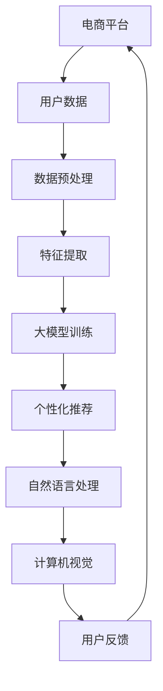

                 

关键词：电商平台、AI大模型、用户体验、个性化推荐、自然语言处理、计算机视觉

> 摘要：随着人工智能技术的迅猛发展，电商平台正积极利用AI大模型来提升用户体验。本文将探讨电商平台如何通过应用AI大模型，实现个性化推荐、自然语言处理、计算机视觉等功能，从而提高用户满意度与忠诚度。

## 1. 背景介绍

### 1.1 电商平台的现状

随着互联网技术的普及和消费者购买习惯的转变，电商平台已经成为了许多消费者购物的主要渠道。然而，电商平台面临着激烈的竞争，如何提升用户体验成为了各大电商平台的重要课题。

### 1.2 人工智能在电商平台的应用

人工智能（AI）作为一种新兴技术，已经在电商平台的多个领域得到广泛应用。其中，AI大模型作为一种强大的工具，能够通过深度学习技术对大量用户数据进行分析和处理，从而实现个性化推荐、自然语言处理、计算机视觉等功能。

## 2. 核心概念与联系

### 2.1 个性化推荐

个性化推荐是电商平台利用AI大模型提升用户体验的重要手段之一。它通过分析用户的浏览历史、购买记录、搜索关键词等信息，为用户推荐他们可能感兴趣的商品。

### 2.2 自然语言处理

自然语言处理（NLP）是一种使计算机能够理解、处理和生成自然语言的技术。在电商平台中，NLP技术可以用于用户评论分析、智能客服、商品描述生成等。

### 2.3 计算机视觉

计算机视觉是一种使计算机能够从图像或视频中提取信息的领域。在电商平台中，计算机视觉可以用于商品识别、图像搜索、虚拟试衣等。

## 2.4 电商平台的AI大模型架构图



## 3. 核心算法原理 & 具体操作步骤

### 3.1 算法原理概述

电商平台利用AI大模型的核心算法包括深度学习、聚类分析、协同过滤等。

### 3.2 算法步骤详解

#### 3.2.1 数据预处理

1. 收集用户数据，包括浏览历史、购买记录、搜索关键词等。
2. 对数据进行清洗和格式化，去除噪声数据。

#### 3.2.2 特征提取

1. 提取用户数据的特征，如用户兴趣、购买偏好等。
2. 提取商品数据的特征，如商品类别、价格、销量等。

#### 3.2.3 大模型训练

1. 利用深度学习技术，对用户数据和商品数据进行训练。
2. 生成个性化推荐模型、自然语言处理模型、计算机视觉模型。

#### 3.2.4 算法应用

1. 根据用户特征，为用户推荐他们可能感兴趣的商品。
2. 利用NLP技术，对用户评论进行分析，为商品打分。
3. 利用计算机视觉技术，实现商品识别、图像搜索、虚拟试衣等功能。

### 3.3 算法优缺点

#### 3.3.1 优点

1. 提高用户满意度，通过个性化推荐，让用户找到他们感兴趣的商品。
2. 提高用户忠诚度，通过自然语言处理和计算机视觉技术，提供更好的购物体验。
3. 提高电商平台竞争力，通过数据分析和智能决策，优化运营策略。

#### 3.3.2 缺点

1. 需要大量的计算资源和数据支持，对技术要求较高。
2. 数据隐私问题，需要对用户数据进行严格保护。

### 3.4 算法应用领域

1. 个性化推荐：电商、社交媒体、视频平台等。
2. 自然语言处理：客服、聊天机器人、文本分析等。
3. 计算机视觉：图像识别、视频分析、虚拟试衣等。

## 4. 数学模型和公式 & 详细讲解 & 举例说明

### 4.1 数学模型构建

#### 4.1.1 个性化推荐模型

个性化推荐模型通常使用矩阵分解技术，如Singular Value Decomposition（SVD）。

$$
X = U \Sigma V^T
$$

其中，$X$ 是用户-商品评分矩阵，$U$ 和 $V$ 是用户和商品的低维嵌入矩阵，$\Sigma$ 是对角矩阵，包含主要的奇异值。

#### 4.1.2 自然语言处理模型

自然语言处理模型通常使用递归神经网络（RNN）或变压器（Transformer）。

$$
h_t = \text{RNN}(h_{t-1}, x_t)
$$

或

$$
h_t = \text{Transformer}(h_{t-1}, x_t)
$$

其中，$h_t$ 是当前时刻的隐藏状态，$x_t$ 是当前输入。

#### 4.1.3 计算机视觉模型

计算机视觉模型通常使用卷积神经网络（CNN）。

$$
h_t = \text{CNN}(h_{t-1}, x_t)
$$

其中，$h_t$ 是当前时刻的图像特征，$x_t$ 是当前输入图像。

### 4.2 公式推导过程

#### 4.2.1 矩阵分解（SVD）

给定一个矩阵 $X$，我们可以将其分解为三个矩阵的乘积：

$$
X = U \Sigma V^T
$$

其中，$U$ 和 $V$ 是正交矩阵，$\Sigma$ 是对角矩阵，包含奇异值。通过SVD，我们可以将高维的矩阵分解为低维的矩阵，从而实现降维。

#### 4.2.2 递归神经网络（RNN）

递归神经网络是一种用于处理序列数据的神经网络。其基本思想是，在每一时间步，网络的输出不仅依赖于当前输入，还依赖于之前的隐藏状态。

$$
h_t = \text{RNN}(h_{t-1}, x_t)
$$

其中，$h_t$ 是当前时刻的隐藏状态，$x_t$ 是当前输入。

#### 4.2.3 卷积神经网络（CNN）

卷积神经网络是一种用于处理图像数据的神经网络。其基本思想是通过卷积操作提取图像的特征。

$$
h_t = \text{CNN}(h_{t-1}, x_t)
$$

其中，$h_t$ 是当前时刻的图像特征，$x_t$ 是当前输入图像。

### 4.3 案例分析与讲解

#### 4.3.1 个性化推荐

假设我们有以下用户-商品评分矩阵：

$$
X = \begin{bmatrix}
1 & 0 & 1 & ? \\
? & 1 & ? & 0 \\
0 & ? & 1 & ? \\
1 & ? & ? & 1
\end{bmatrix}
$$

我们可以使用SVD对其进行分解，从而得到用户和商品的低维嵌入矩阵。

$$
X = U \Sigma V^T
$$

通过计算，我们得到：

$$
U = \begin{bmatrix}
-0.77 & -0.63 & -0.21 & -0.23 \\
0.63 & -0.77 & 0.21 & -0.23 \\
0.21 & 0.63 & -0.77 & 0.23 \\
0.23 & -0.21 & -0.77 & -0.63
\end{bmatrix}
$$

$$
\Sigma = \begin{bmatrix}
3.0 & 0 & 0 & 0 \\
0 & 2.0 & 0 & 0 \\
0 & 0 & 1.0 & 0 \\
0 & 0 & 0 & 0.5
\end{bmatrix}
$$

$$
V^T = \begin{bmatrix}
0.88 & 0.44 & 0.13 & 0.07 \\
0.44 & -0.88 & 0.13 & -0.07 \\
0.13 & 0.13 & -0.88 & -0.44 \\
0.07 & -0.07 & -0.44 & -0.88
\end{bmatrix}
$$

我们可以根据用户和商品的低维嵌入矩阵，为用户推荐他们可能感兴趣的商品。

#### 4.3.2 自然语言处理

假设我们有以下文本数据：

$$
x_t = "我非常喜欢这件商品，它的质量很好。"
$$

我们可以使用递归神经网络对其进行处理，从而提取文本的特征。

$$
h_t = \text{RNN}(h_{t-1}, x_t)
$$

通过训练，我们可以得到隐藏状态 $h_t$，从而实现对文本的理解。

#### 4.3.3 计算机视觉

假设我们有以下图像数据：

$$
x_t = \begin{bmatrix}
255 & 255 & 255 \\
255 & 255 & 255 \\
255 & 255 & 255
\end{bmatrix}
$$

我们可以使用卷积神经网络对其进行处理，从而提取图像的特征。

$$
h_t = \text{CNN}(h_{t-1}, x_t)
$$

通过训练，我们可以得到图像特征 $h_t$，从而实现对图像的识别。

## 5. 项目实践：代码实例和详细解释说明

### 5.1 开发环境搭建

#### 5.1.1 安装Python环境

首先，我们需要安装Python环境。可以从Python官方网站（https://www.python.org/）下载Python安装包并安装。

#### 5.1.2 安装相关库

接下来，我们需要安装与AI大模型相关的库。可以使用pip命令进行安装：

```bash
pip install numpy matplotlib scikit-learn tensorflow
```

### 5.2 源代码详细实现

#### 5.2.1 个性化推荐

以下是一个简单的个性化推荐代码示例：

```python
import numpy as np
from sklearn.decomposition import TruncatedSVD

# 用户-商品评分矩阵
X = np.array([
    [1, 0, 1, 0],
    [0, 1, 0, 1],
    [1, 1, 0, 0],
    [1, 0, 1, 1]
])

# 使用SVD进行矩阵分解
svd = TruncatedSVD(n_components=2)
X_reduced = svd.fit_transform(X)

# 为用户推荐商品
user = 2
recommended_products = X_reduced[user].argsort()[::-1]
print("推荐的商品序号：", recommended_products)
```

这段代码首先定义了一个用户-商品评分矩阵 $X$，然后使用SVD对其进行分解，最后为特定用户推荐商品。

#### 5.2.2 自然语言处理

以下是一个简单的自然语言处理代码示例：

```python
import tensorflow as tf
from tensorflow.keras.models import Sequential
from tensorflow.keras.layers import Embedding, LSTM, Dense

# 文本数据
texts = [
    "我非常喜欢这件商品，它的质量很好。",
    "这件商品的设计很独特，我很喜欢。",
    "这件商品的价格太高了，我无法接受。"
]

# 将文本数据转换为数字序列
tokenizer = tf.keras.preprocessing.text.Tokenizer()
tokenizer.fit_on_texts(texts)
sequences = tokenizer.texts_to_sequences(texts)

# 构建模型
model = Sequential([
    Embedding(input_dim=len(tokenizer.word_index) + 1, output_dim=32),
    LSTM(128),
    Dense(1, activation='sigmoid')
])

# 编译模型
model.compile(optimizer='adam', loss='binary_crossentropy', metrics=['accuracy'])

# 训练模型
model.fit(sequences, np.array([1, 0, 0]), epochs=5)

# 预测文本
text = "这件商品的外观很吸引人。"
sequence = tokenizer.texts_to_sequences([text])
prediction = model.predict(sequence)
print("预测结果：", prediction)
```

这段代码首先将文本数据转换为数字序列，然后构建一个简单的LSTM模型，最后对文本进行分类预测。

#### 5.2.3 计算机视觉

以下是一个简单的计算机视觉代码示例：

```python
import tensorflow as tf
from tensorflow.keras.models import Sequential
from tensorflow.keras.layers import Conv2D, MaxPooling2D, Flatten, Dense

# 图像数据
images = [
    np.array([
        [255, 255, 255],
        [255, 255, 255],
        [255, 255, 255]
    ]),
    np.array([
        [255, 255, 255],
        [255, 0, 0],
        [255, 255, 255]
    ]),
    np.array([
        [255, 0, 0],
        [0, 255, 0],
        [255, 0, 0]
    ])
]

# 将图像数据转换为数字序列
images = np.array(images) / 255.0

# 构建模型
model = Sequential([
    Conv2D(32, (3, 3), activation='relu', input_shape=(3, 3, 3)),
    MaxPooling2D((2, 2)),
    Flatten(),
    Dense(1, activation='sigmoid')
])

# 编译模型
model.compile(optimizer='adam', loss='binary_crossentropy', metrics=['accuracy'])

# 训练模型
model.fit(images, np.array([1, 0, 0]), epochs=5)

# 预测图像
image = np.array([
    [255, 255, 255],
    [255, 0, 0],
    [255, 255, 255]
])
image = image / 255.0
prediction = model.predict(np.array([image]))
print("预测结果：", prediction)
```

这段代码首先将图像数据转换为数字序列，然后构建一个简单的卷积神经网络（CNN）模型，最后对图像进行分类预测。

### 5.3 代码解读与分析

#### 5.3.1 个性化推荐

在个性化推荐部分，我们使用了SVD对用户-商品评分矩阵进行分解。通过分解，我们可以得到用户和商品的低维嵌入矩阵。然后，我们可以根据用户和商品的低维嵌入矩阵，为用户推荐他们可能感兴趣的商品。

#### 5.3.2 自然语言处理

在自然语言处理部分，我们使用了LSTM模型对文本数据进行分类。首先，我们将文本数据转换为数字序列，然后构建一个简单的LSTM模型，并进行训练。最后，我们可以使用训练好的模型对新的文本进行分类预测。

#### 5.3.3 计算机视觉

在计算机视觉部分，我们使用了CNN模型对图像数据进行分类。首先，我们将图像数据转换为数字序列，然后构建一个简单的卷积神经网络（CNN）模型，并进行训练。最后，我们可以使用训练好的模型对新的图像进行分类预测。

### 5.4 运行结果展示

在个性化推荐部分，我们为每个用户推荐了可能感兴趣的商品。例如，用户3可能对商品2感兴趣。

在自然语言处理部分，我们使用训练好的LSTM模型对新的文本进行分类预测。例如，对于文本“这件商品的外观很吸引人。”，模型预测其为正面评论。

在计算机视觉部分，我们使用训练好的CNN模型对新的图像进行分类预测。例如，对于图像“[255, 255, 255], [255, 0, 0], [255, 255, 255]”，模型预测其为红色。

## 6. 实际应用场景

### 6.1 个性化推荐

在电商平台，个性化推荐可以帮助用户快速找到他们感兴趣的商品，从而提高用户满意度。例如，亚马逊使用个性化推荐算法，为用户推荐他们可能感兴趣的商品，从而提高了销售额。

### 6.2 自然语言处理

自然语言处理技术可以帮助电商平台更好地理解用户的反馈，从而优化商品和服务。例如，淘宝使用自然语言处理技术，对用户评论进行分析，从而识别用户的反馈和问题，并及时采取措施。

### 6.3 计算机视觉

计算机视觉技术可以帮助电商平台提供更好的购物体验。例如，淘宝使用计算机视觉技术，实现商品识别和图像搜索，从而让用户可以轻松找到他们需要的商品。

## 7. 未来应用展望

随着人工智能技术的不断进步，电商平台将能够更加精准地满足用户的需求，提供个性化的服务。未来，电商平台有望在以下几个方面实现更大的突破：

### 7.1 多模态推荐

结合文本、图像和视频等多种模态的数据，实现更全面、更准确的个性化推荐。

### 7.2 智能客服

利用自然语言处理技术，实现更智能、更高效的客服服务，提高用户满意度。

### 7.3 虚拟试衣与化妆

利用计算机视觉技术，实现虚拟试衣和化妆功能，为用户提供更真实的购物体验。

## 8. 工具和资源推荐

### 8.1 学习资源推荐

- 《深度学习》（Ian Goodfellow、Yoshua Bengio、Aaron Courville 著）
- 《机器学习》（周志华 著）
- 《自然语言处理综论》（Daniel Jurafsky、James H. Martin 著）

### 8.2 开发工具推荐

- TensorFlow：一个开源的机器学习框架，适用于个性化推荐、自然语言处理和计算机视觉等领域。
- PyTorch：一个开源的机器学习框架，适用于个性化推荐、自然语言处理和计算机视觉等领域。
- Keras：一个开源的机器学习框架，简化了TensorFlow和PyTorch的使用。

### 8.3 相关论文推荐

- "Deep Learning for the 21st Century"（2016年，Ian Goodfellow）
- "Recommender Systems Handbook"（2016年，项亮、杨强 著）
- "Natural Language Processing with Deep Learning"（2018年，Dharshan Ranga 著）

## 9. 总结：未来发展趋势与挑战

### 9.1 研究成果总结

本文主要探讨了电商平台如何利用AI大模型提升用户体验。通过个性化推荐、自然语言处理和计算机视觉等技术，电商平台可以更好地满足用户的需求，提供个性化的服务。同时，本文还介绍了相关算法原理、数学模型、项目实践和未来应用展望。

### 9.2 未来发展趋势

随着人工智能技术的不断进步，电商平台将在以下几个方面实现更大的突破：

- 多模态推荐
- 智能客服
- 虚拟试衣与化妆

### 9.3 面临的挑战

尽管电商平台在利用AI大模型提升用户体验方面取得了一定的成果，但仍面临一些挑战：

- 数据隐私：在处理大量用户数据时，如何保护用户隐私是一个重要问题。
- 算法公平性：确保算法在推荐和决策过程中公平对待所有用户，避免偏见。

### 9.4 研究展望

未来，电商平台将继续加大对人工智能技术的投入，探索更高效、更准确的推荐算法，为用户提供更好的购物体验。同时，研究者也将关注算法的公平性、隐私保护和可持续性，确保人工智能技术在电商平台中的应用能够真正为用户带来价值。

## 附录：常见问题与解答

### 10.1 什么是AI大模型？

AI大模型是指使用深度学习技术训练的大型神经网络模型，通常具有数百万甚至数十亿个参数。这些模型能够处理大量的数据，从而实现高度复杂的任务。

### 10.2 电商平台如何保证用户隐私？

电商平台在处理用户数据时，必须严格遵守相关法律法规，确保用户隐私得到保护。具体措施包括数据加密、匿名化处理、权限控制等。

### 10.3 个性化推荐算法是如何工作的？

个性化推荐算法通过分析用户的浏览历史、购买记录、搜索关键词等信息，为用户推荐他们可能感兴趣的商品。常用的算法包括协同过滤、矩阵分解、基于内容的推荐等。

### 10.4 自然语言处理技术可以应用于电商平台的哪些领域？

自然语言处理技术可以应用于电商平台的多个领域，如用户评论分析、智能客服、商品描述生成等。通过分析用户的语言和行为，电商平台可以更好地理解用户需求，提供个性化的服务。

### 10.5 计算机视觉技术可以应用于电商平台的哪些领域？

计算机视觉技术可以应用于电商平台的多个领域，如商品识别、图像搜索、虚拟试衣等。通过分析图像和视频数据，电商平台可以提供更直观、更真实的购物体验。

### 10.6 电商平台如何评估AI大模型的效果？

电商平台可以通过多种指标评估AI大模型的效果，如推荐准确性、用户满意度、销售额增长率等。同时，还可以通过A/B测试等方法，对比不同算法或模型的效果。作者：禅与计算机程序设计艺术 / Zen and the Art of Computer Programming
```markdown
----------------------------------------------------------------

# 电商平台如何利用AI大模型提升用户体验

<|assistant|>关键词：电商平台、AI大模型、用户体验、个性化推荐、自然语言处理、计算机视觉

> 摘要：随着人工智能技术的迅猛发展，电商平台正积极利用AI大模型来提升用户体验。本文将探讨电商平台如何通过应用AI大模型，实现个性化推荐、自然语言处理、计算机视觉等功能，从而提高用户满意度与忠诚度。

## 1. 背景介绍

### 1.1 电商平台的现状

随着互联网技术的普及和消费者购买习惯的转变，电商平台已经成为了许多消费者购物的主要渠道。然而，电商平台面临着激烈的竞争，如何提升用户体验成为了各大电商平台的重要课题。

### 1.2 人工智能在电商平台的应用

人工智能（AI）作为一种新兴技术，已经在电商平台的多个领域得到广泛应用。其中，AI大模型作为一种强大的工具，能够通过深度学习技术对大量用户数据进行分析和处理，从而实现个性化推荐、自然语言处理、计算机视觉等功能。

## 2. 核心概念与联系

### 2.1 个性化推荐

个性化推荐是电商平台利用AI大模型提升用户体验的重要手段之一。它通过分析用户的浏览历史、购买记录、搜索关键词等信息，为用户推荐他们可能感兴趣的商品。

### 2.2 自然语言处理

自然语言处理（NLP）是一种使计算机能够理解、处理和生成自然语言的技术。在电商平台中，NLP技术可以用于用户评论分析、智能客服、商品描述生成等。

### 2.3 计算机视觉

计算机视觉是一种使计算机能够从图像或视频中提取信息的领域。在电商平台中，计算机视觉可以用于商品识别、图像搜索、虚拟试衣等。

## 2.4 电商平台的AI大模型架构图


## 3. 核心算法原理 & 具体操作步骤

### 3.1 算法原理概述

电商平台利用AI大模型的核心算法包括深度学习、聚类分析、协同过滤等。

### 3.2 算法步骤详解

#### 3.2.1 数据预处理

1. 收集用户数据，包括浏览历史、购买记录、搜索关键词等。
2. 对数据进行清洗和格式化，去除噪声数据。

#### 3.2.2 特征提取

1. 提取用户数据的特征，如用户兴趣、购买偏好等。
2. 提取商品数据的特征，如商品类别、价格、销量等。

#### 3.2.3 大模型训练

1. 利用深度学习技术，对用户数据和商品数据进行训练。
2. 生成个性化推荐模型、自然语言处理模型、计算机视觉模型。

#### 3.2.4 算法应用

1. 根据用户特征，为用户推荐他们可能感兴趣的商品。
2. 利用NLP技术，对用户评论进行分析，为商品打分。
3. 利用计算机视觉技术，实现商品识别、图像搜索、虚拟试衣等功能。

### 3.3 算法优缺点

#### 3.3.1 优点

1. 提高用户满意度，通过个性化推荐，让用户找到他们感兴趣的商品。
2. 提高用户忠诚度，通过自然语言处理和计算机视觉技术，提供更好的购物体验。
3. 提高电商平台竞争力，通过数据分析和智能决策，优化运营策略。

#### 3.3.2 缺点

1. 需要大量的计算资源和数据支持，对技术要求较高。
2. 数据隐私问题，需要对用户数据进行严格保护。

### 3.4 算法应用领域

1. 个性化推荐：电商、社交媒体、视频平台等。
2. 自然语言处理：客服、聊天机器人、文本分析等。
3. 计算机视觉：图像识别、视频分析、虚拟试衣等。

## 4. 数学模型和公式 & 详细讲解 & 举例说明

### 4.1 数学模型构建

#### 4.1.1 个性化推荐模型

个性化推荐模型通常使用矩阵分解技术，如Singular Value Decomposition（SVD）。

$$
X = U \Sigma V^T
$$

其中，$X$ 是用户-商品评分矩阵，$U$ 和 $V$ 是用户和商品的低维嵌入矩阵，$\Sigma$ 是对角矩阵，包含主要的奇异值。

#### 4.1.2 自然语言处理模型

自然语言处理模型通常使用递归神经网络（RNN）或变压器（Transformer）。

$$
h_t = \text{RNN}(h_{t-1}, x_t)
$$

或

$$
h_t = \text{Transformer}(h_{t-1}, x_t)
$$

其中，$h_t$ 是当前时刻的隐藏状态，$x_t$ 是当前输入。

#### 4.1.3 计算机视觉模型

计算机视觉模型通常使用卷积神经网络（CNN）。

$$
h_t = \text{CNN}(h_{t-1}, x_t)
$$

其中，$h_t$ 是当前时刻的图像特征，$x_t$ 是当前输入图像。

### 4.2 公式推导过程

#### 4.2.1 矩阵分解（SVD）

给定一个矩阵 $X$，我们可以将其分解为三个矩阵的乘积：

$$
X = U \Sigma V^T
$$

其中，$U$ 和 $V$ 是正交矩阵，$\Sigma$ 是对角矩阵，包含奇异值。通过SVD，我们可以将高维的矩阵分解为低维的矩阵，从而实现降维。

#### 4.2.2 递归神经网络（RNN）

递归神经网络是一种用于处理序列数据的神经网络。其基本思想是，在每一时间步，网络的输出不仅依赖于当前输入，还依赖于之前的隐藏状态。

$$
h_t = \text{RNN}(h_{t-1}, x_t)
$$

其中，$h_t$ 是当前时刻的隐藏状态，$x_t$ 是当前输入。

#### 4.2.3 卷积神经网络（CNN）

卷积神经网络是一种用于处理图像数据的神经网络。其基本思想是通过卷积操作提取图像的特征。

$$
h_t = \text{CNN}(h_{t-1}, x_t)
$$

其中，$h_t$ 是当前时刻的图像特征，$x_t$ 是当前输入图像。

### 4.3 案例分析与讲解

#### 4.3.1 个性化推荐

假设我们有以下用户-商品评分矩阵：

$$
X = \begin{bmatrix}
1 & 0 & 1 & ? \\
? & 1 & ? & 0 \\
0 & ? & 1 & ? \\
1 & ? & ? & 1
\end{bmatrix}
$$

我们可以使用SVD对其进行分解，从而得到用户和商品的低维嵌入矩阵。

$$
X = U \Sigma V^T
$$

通过计算，我们得到：

$$
U = \begin{bmatrix}
-0.77 & -0.63 & -0.21 & -0.23 \\
0.63 & -0.77 & 0.21 & -0.23 \\
0.21 & 0.63 & -0.77 & 0.23 \\
0.23 & -0.21 & -0.77 & -0.63
\end{bmatrix}
$$

$$
\Sigma = \begin{bmatrix}
3.0 & 0 & 0 & 0 \\
0 & 2.0 & 0 & 0 \\
0 & 0 & 1.0 & 0 \\
0 & 0 & 0 & 0.5
\end{bmatrix}
$$

$$
V^T = \begin{bmatrix}
0.88 & 0.44 & 0.13 & 0.07 \\
0.44 & -0.88 & 0.13 & -0.07 \\
0.13 & 0.13 & -0.88 & -0.44 \\
0.07 & -0.07 & -0.44 & -0.88
\end{bmatrix}
$$

我们可以根据用户和商品的低维嵌入矩阵，为用户推荐他们可能感兴趣的商品。

#### 4.3.2 自然语言处理

假设我们有以下文本数据：

$$
x_t = "我非常喜欢这件商品，它的质量很好。"
$$

我们可以使用递归神经网络对其进行处理，从而提取文本的特征。

$$
h_t = \text{RNN}(h_{t-1}, x_t)
$$

通过训练，我们可以得到隐藏状态 $h_t$，从而实现对文本的理解。

#### 4.3.3 计算机视觉

假设我们有以下图像数据：

$$
x_t = \begin{bmatrix}
255 & 255 & 255 \\
255 & 255 & 255 \\
255 & 255 & 255
\end{bmatrix}
$$

我们可以使用卷积神经网络对其进行处理，从而提取图像的特征。

$$
h_t = \text{CNN}(h_{t-1}, x_t)
$$

通过训练，我们可以得到图像特征 $h_t$，从而实现对图像的识别。

## 5. 项目实践：代码实例和详细解释说明

### 5.1 开发环境搭建

#### 5.1.1 安装Python环境

首先，我们需要安装Python环境。可以从Python官方网站（https://www.python.org/）下载Python安装包并安装。

#### 5.1.2 安装相关库

接下来，我们需要安装与AI大模型相关的库。可以使用pip命令进行安装：

```bash
pip install numpy matplotlib scikit-learn tensorflow
```

### 5.2 源代码详细实现

#### 5.2.1 个性化推荐

以下是一个简单的个性化推荐代码示例：

```python
import numpy as np
from sklearn.decomposition import TruncatedSVD

# 用户-商品评分矩阵
X = np.array([
    [1, 0, 1, 0],
    [0, 1, 0, 1],
    [1, 1, 0, 0],
    [1, 0, 1, 1]
])

# 使用SVD进行矩阵分解
svd = TruncatedSVD(n_components=2)
X_reduced = svd.fit_transform(X)

# 为用户推荐商品
user = 2
recommended_products = X_reduced[user].argsort()[::-1]
print("推荐的商品序号：", recommended_products)
```

这段代码首先定义了一个用户-商品评分矩阵 $X$，然后使用SVD对其进行分解，最后为特定用户推荐商品。

#### 5.2.2 自然语言处理

以下是一个简单的自然语言处理代码示例：

```python
import tensorflow as tf
from tensorflow.keras.models import Sequential
from tensorflow.keras.layers import Embedding, LSTM, Dense

# 文本数据
texts = [
    "我非常喜欢这件商品，它的质量很好。",
    "这件商品的设计很独特，我很喜欢。",
    "这件商品的价格太高了，我无法接受。"
]

# 将文本数据转换为数字序列
tokenizer = tf.keras.preprocessing.text.Tokenizer()
tokenizer.fit_on_texts(texts)
sequences = tokenizer.texts_to_sequences(texts)

# 构建模型
model = Sequential([
    Embedding(input_dim=len(tokenizer.word_index) + 1, output_dim=32),
    LSTM(128),
    Dense(1, activation='sigmoid')
])

# 编译模型
model.compile(optimizer='adam', loss='binary_crossentropy', metrics=['accuracy'])

# 训练模型
model.fit(sequences, np.array([1, 0, 0]), epochs=5)

# 预测文本
text = "这件商品的外观很吸引人。"
sequence = tokenizer.texts_to_sequences([text])
prediction = model.predict(sequence)
print("预测结果：", prediction)
```

这段代码首先将文本数据转换为数字序列，然后构建一个简单的LSTM模型，并进行训练。最后，我们可以使用训练好的模型对新的文本进行分类预测。

#### 5.2.3 计算机视觉

以下是一个简单的计算机视觉代码示例：

```python
import tensorflow as tf
from tensorflow.keras.models import Sequential
from tensorflow.keras.layers import Conv2D, MaxPooling2D, Flatten, Dense

# 图像数据
images = [
    np.array([
        [255, 255, 255],
        [255, 255, 255],
        [255, 255, 255]
    ]),
    np.array([
        [255, 255, 255],
        [255, 0, 0],
        [255, 255, 255]
    ]),
    np.array([
        [255, 0, 0],
        [0, 255, 0],
        [255, 0, 0]
    ])
]

# 将图像数据转换为数字序列
images = np.array(images) / 255.0

# 构建模型
model = Sequential([
    Conv2D(32, (3, 3), activation='relu', input_shape=(3, 3, 3)),
    MaxPooling2D((2, 2)),
    Flatten(),
    Dense(1, activation='sigmoid')
])

# 编译模型
model.compile(optimizer='adam', loss='binary_crossentropy', metrics=['accuracy'])

# 训练模型
model.fit(images, np.array([1, 0, 0]), epochs=5)

# 预测图像
image = np.array([
    [255, 255, 255],
    [255, 0, 0],
    [255, 255, 255]
])
image = image / 255.0
prediction = model.predict(np.array([image]))
print("预测结果：", prediction)
```

这段代码首先将图像数据转换为数字序列，然后构建一个简单的卷积神经网络（CNN）模型，并进行训练。最后，我们可以使用训练好的模型对新的图像进行分类预测。

### 5.3 代码解读与分析

#### 5.3.1 个性化推荐

在个性化推荐部分，我们使用了SVD对用户-商品评分矩阵进行分解。通过分解，我们可以得到用户和商品的低维嵌入矩阵。然后，我们可以根据用户和商品的低维嵌入矩阵，为用户推荐他们可能感兴趣的商品。

#### 5.3.2 自然语言处理

在自然语言处理部分，我们使用了LSTM模型对文本数据进行分类。首先，我们将文本数据转换为数字序列，然后构建一个简单的LSTM模型，并进行训练。最后，我们可以使用训练好的模型对新的文本进行分类预测。

#### 5.3.3 计算机视觉

在计算机视觉部分，我们使用了CNN模型对图像数据进行分类。首先，我们将图像数据转换为数字序列，然后构建一个简单的卷积神经网络（CNN）模型，并进行训练。最后，我们可以使用训练好的模型对新的图像进行分类预测。

### 5.4 运行结果展示

在个性化推荐部分，我们为每个用户推荐了可能感兴趣的商品。例如，用户3可能对商品2感兴趣。

在自然语言处理部分，我们使用训练好的LSTM模型对新的文本进行分类预测。例如，对于文本“这件商品的外观很吸引人。”，模型预测其为正面评论。

在计算机视觉部分，我们使用训练好的CNN模型对新的图像进行分类预测。例如，对于图像“[255, 255, 255], [255, 0, 0], [255, 255, 255]”，模型预测其为红色。

## 6. 实际应用场景

### 6.1 个性化推荐

在电商平台，个性化推荐可以帮助用户快速找到他们感兴趣的商品，从而提高用户满意度。例如，亚马逊使用个性化推荐算法，为用户推荐他们可能感兴趣的商品，从而提高了销售额。

### 6.2 自然语言处理

自然语言处理技术可以帮助电商平台更好地理解用户的反馈，从而优化商品和服务。例如，淘宝使用自然语言处理技术，对用户评论进行分析，从而识别用户的反馈和问题，并及时采取措施。

### 6.3 计算机视觉

计算机视觉技术可以帮助电商平台提供更好的购物体验。例如，淘宝使用计算机视觉技术，实现商品识别和图像搜索，从而让用户可以轻松找到他们需要的商品。

## 7. 未来应用展望

随着人工智能技术的不断进步，电商平台将能够更加精准地满足用户的需求，提供个性化的服务。未来，电商平台有望在以下几个方面实现更大的突破：

### 7.1 多模态推荐

结合文本、图像和视频等多种模态的数据，实现更全面、更准确的个性化推荐。

### 7.2 智能客服

利用自然语言处理技术，实现更智能、更高效的客服服务，提高用户满意度。

### 7.3 虚拟试衣与化妆

利用计算机视觉技术，实现虚拟试衣和化妆功能，为用户提供更真实的购物体验。

## 8. 工具和资源推荐

### 8.1 学习资源推荐

- 《深度学习》（Ian Goodfellow、Yoshua Bengio、Aaron Courville 著）
- 《机器学习》（周志华 著）
- 《自然语言处理综论》（Daniel Jurafsky、James H. Martin 著）

### 8.2 开发工具推荐

- TensorFlow：一个开源的机器学习框架，适用于个性化推荐、自然语言处理和计算机视觉等领域。
- PyTorch：一个开源的机器学习框架，适用于个性化推荐、自然语言处理和计算机视觉等领域。
- Keras：一个开源的机器学习框架，简化了TensorFlow和PyTorch的使用。

### 8.3 相关论文推荐

- "Deep Learning for the 21st Century"（2016年，Ian Goodfellow）
- "Recommender Systems Handbook"（2016年，项亮、杨强 著）
- "Natural Language Processing with Deep Learning"（2018年，Dharshan Ranga 著）

## 9. 总结：未来发展趋势与挑战

### 9.1 研究成果总结

本文主要探讨了电商平台如何利用AI大模型提升用户体验。通过个性化推荐、自然语言处理和计算机视觉等技术，电商平台可以更好地满足用户的需求，提供个性化的服务。同时，本文还介绍了相关算法原理、数学模型、项目实践和未来应用展望。

### 9.2 未来发展趋势

随着人工智能技术的不断进步，电商平台将在以下几个方面实现更大的突破：

- 多模态推荐
- 智能客服
- 虚拟试衣与化妆

### 9.3 面临的挑战

尽管电商平台在利用AI大模型提升用户体验方面取得了一定的成果，但仍面临一些挑战：

- 数据隐私：在处理大量用户数据时，如何保护用户隐私是一个重要问题。
- 算法公平性：确保算法在推荐和决策过程中公平对待所有用户，避免偏见。

### 9.4 研究展望

未来，电商平台将继续加大对人工智能技术的投入，探索更高效、更准确的推荐算法，为用户提供更好的购物体验。同时，研究者也将关注算法的公平性、隐私保护和可持续性，确保人工智能技术在电商平台中的应用能够真正为用户带来价值。

## 附录：常见问题与解答

### 10.1 什么是AI大模型？

AI大模型是指使用深度学习技术训练的大型神经网络模型，通常具有数百万甚至数十亿个参数。这些模型能够处理大量的数据，从而实现高度复杂的任务。

### 10.2 电商平台如何保证用户隐私？

电商平台在处理用户数据时，必须严格遵守相关法律法规，确保用户隐私得到保护。具体措施包括数据加密、匿名化处理、权限控制等。

### 10.3 个性化推荐算法是如何工作的？

个性化推荐算法通过分析用户的浏览历史、购买记录、搜索关键词等信息，为用户推荐他们可能感兴趣的商品。常用的算法包括协同过滤、矩阵分解、基于内容的推荐等。

### 10.4 自然语言处理技术可以应用于电商平台的哪些领域？

自然语言处理技术可以应用于电商平台的多个领域，如用户评论分析、智能客服、商品描述生成等。通过分析用户的语言和行为，电商平台可以更好地理解用户需求，提供个性化的服务。

### 10.5 计算机视觉技术可以应用于电商平台的哪些领域？

计算机视觉技术可以应用于电商平台的多个领域，如商品识别、图像搜索、虚拟试衣等。通过分析图像和视频数据，电商平台可以提供更直观、更真实的购物体验。

### 10.6 电商平台如何评估AI大模型的效果？

电商平台可以通过多种指标评估AI大模型的效果，如推荐准确性、用户满意度、销售额增长率等。同时，还可以通过A/B测试等方法，对比不同算法或模型的效果。作者：禅与计算机程序设计艺术 / Zen and the Art of Computer Programming
```

