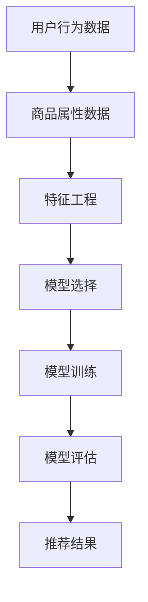

                 

关键词：电商平台，搜索推荐系统，AI 大模型，大规模数据，优化，挑战

摘要：本文将深入探讨电商平台搜索推荐系统的AI 大模型优化，包括应对大规模数据的挑战。本文首先介绍了电商平台搜索推荐系统的背景和重要性，然后详细分析了AI 大模型在搜索推荐系统中的应用和优化策略，最后探讨了未来发展的趋势和面临的挑战。

## 1. 背景介绍

随着互联网的普及和电商行业的迅猛发展，电商平台成为了人们日常生活中不可或缺的一部分。电商平台的主要目标是满足用户的需求，提供个性化的购物体验。为了实现这一目标，搜索推荐系统应运而生。

搜索推荐系统是一种基于用户行为和偏好数据的自动化系统，它能够帮助用户在众多商品中快速找到他们感兴趣的商品。搜索推荐系统通常包括搜索和推荐两个模块。搜索模块负责处理用户的查询请求，返回与查询相关的商品列表。推荐模块则根据用户的历史行为和偏好，为用户推荐他们可能感兴趣的商品。

随着电商平台的不断壮大，用户数量和商品种类都在持续增长。这使得搜索推荐系统面临了巨大的数据量和复杂性。传统的搜索推荐系统已经难以满足用户的需求，需要通过引入AI 大模型来优化系统的性能。

AI 大模型是一种基于深度学习的人工智能模型，具有强大的数据处理和分析能力。通过使用AI 大模型，搜索推荐系统可以更好地应对大规模数据的挑战，提供更加精准和个性化的推荐结果。

## 2. 核心概念与联系

在介绍AI 大模型在搜索推荐系统中的应用之前，我们需要先了解一些核心概念和联系。

### 2.1 数据源

搜索推荐系统的数据源主要包括用户行为数据和商品属性数据。用户行为数据包括用户的浏览记录、购买记录、收藏记录等，这些数据可以用来分析和预测用户的需求和偏好。商品属性数据包括商品的价格、分类、品牌、评分等，这些数据可以帮助推荐系统更好地理解商品的特性和用户对商品的偏好。

### 2.2 特征工程

特征工程是将原始数据转换为可用于机器学习模型的有用特征的过程。在搜索推荐系统中，特征工程至关重要。通过合理地选择和构造特征，可以提高模型的学习效果和预测准确性。

### 2.3 模型选择

在搜索推荐系统中，常用的AI 大模型包括深度神经网络、决策树、随机森林、支持向量机等。不同的模型具有不同的优势和适用场景。选择合适的模型可以提高系统的性能和效率。

### 2.4 评估指标

评估指标是衡量搜索推荐系统性能的重要工具。常用的评估指标包括准确率、召回率、精确率、F1 分数等。通过评估指标，可以客观地评估系统的推荐效果和性能。

### 2.5 Mermaid 流程图

以下是搜索推荐系统的 Mermaid 流程图，展示了核心概念和联系。



## 3. 核心算法原理 & 具体操作步骤

### 3.1 算法原理概述

搜索推荐系统的核心算法通常是基于协同过滤（Collaborative Filtering）和基于内容的推荐（Content-Based Recommendation）两种方法。

协同过滤方法通过分析用户的行为数据，找出与目标用户相似的其他用户，并推荐他们喜欢的商品。基于内容的推荐方法则通过分析商品的属性和用户的历史行为，找出具有相似属性的商品，并将其推荐给用户。

在引入AI 大模型后，搜索推荐系统可以通过深度学习算法进行自动的特征提取和模型优化，进一步提高推荐效果。

### 3.2 算法步骤详解

以下是搜索推荐系统的算法步骤：

1. **数据预处理**：对用户行为数据和商品属性数据进行清洗、去噪和归一化处理。

2. **特征工程**：根据用户行为数据和商品属性数据，构造一系列有用特征，包括用户特征、商品特征和上下文特征。

3. **模型选择**：选择合适的AI 大模型，如深度神经网络、决策树、随机森林等。

4. **模型训练**：使用训练数据对所选模型进行训练，优化模型参数。

5. **模型评估**：使用验证数据对训练好的模型进行评估，选择性能最好的模型。

6. **推荐生成**：使用最终选择的模型，根据用户特征和商品特征生成推荐结果。

7. **结果反馈**：收集用户对推荐结果的反馈，用于进一步优化模型。

### 3.3 算法优缺点

**优点**：

- AI 大模型具有强大的特征提取和模型优化能力，可以提高推荐效果和准确性。
- 可以应对大规模数据，适应不断变化的用户需求。

**缺点**：

- 需要大量的计算资源和时间进行模型训练和优化。
- 模型的解释性较差，难以理解推荐结果的原因。

### 3.4 算法应用领域

搜索推荐系统广泛应用于电商、新闻、音乐、视频等各个领域。通过AI 大模型的优化，搜索推荐系统可以提供更加精准和个性化的推荐结果，提高用户满意度。

## 4. 数学模型和公式 & 详细讲解 & 举例说明

### 4.1 数学模型构建

搜索推荐系统的数学模型通常包括用户矩阵和商品矩阵。用户矩阵表示用户和商品之间的关系，商品矩阵表示商品和用户之间的关系。

假设用户集为U={u1, u2, ..., un}，商品集为I={i1, i2, ..., im}，用户矩阵和商品矩阵分别表示为R∈R^m×n和S∈R^m×n。

### 4.2 公式推导过程

协同过滤方法的基本思想是通过分析用户之间的相似性，找出与目标用户相似的其他用户，并推荐他们喜欢的商品。

假设用户ui和uj之间的相似性度量函数为sim(ui, uj)，则用户ui对商品ik的兴趣度可以表示为：

$$
r_{ui} = \sum_{j \in N(i)} w_{ij} r_{uj}
$$

其中，N(i)表示与商品ik相关的用户集合，$w_{ij}$表示用户ui和uj之间的相似性权重。

基于内容的推荐方法的基本思想是通过分析商品的属性和用户的历史行为，找出具有相似属性的商品，并将其推荐给用户。

假设用户ui对商品ik的兴趣度可以表示为：

$$
r_{ui} = \sum_{k' \in N(i)} f_{ik'} g_{ki}
$$

其中，N(i)表示与商品ik相关的用户集合，$f_{ik'}$表示商品ik'的属性特征，$g_{ki}$表示用户ui对商品ik的偏好程度。

### 4.3 案例分析与讲解

假设有一个电商平台，用户数量为1000，商品数量为5000。我们使用协同过滤方法进行推荐。

首先，我们需要收集用户行为数据，如用户的浏览记录、购买记录等。然后，对数据集进行清洗、去噪和归一化处理。

接下来，进行特征工程。我们选择用户特征和商品特征作为输入特征。用户特征包括用户的年龄、性别、地理位置等。商品特征包括商品的价格、分类、品牌等。

然后，选择合适的AI 大模型，如深度神经网络，进行模型训练。我们使用训练数据集对模型进行训练，并优化模型参数。

在模型训练完成后，使用验证数据集对模型进行评估。选择性能最好的模型，并将其用于生成推荐结果。

最后，我们收集用户对推荐结果的反馈，并根据反馈进一步优化模型。

## 5. 项目实践：代码实例和详细解释说明

### 5.1 开发环境搭建

为了进行项目实践，我们需要搭建一个开发环境。以下是搭建开发环境的步骤：

1. 安装Python 3.x版本
2. 安装Anaconda发行版，用于管理Python环境
3. 安装必要的库，如NumPy、Pandas、Scikit-learn等

### 5.2 源代码详细实现

以下是搜索推荐系统的源代码实现：

```python
import numpy as np
import pandas as pd
from sklearn.model_selection import train_test_split
from sklearn.metrics.pairwise import cosine_similarity
from sklearn.linear_model import LinearRegression

# 加载数据集
data = pd.read_csv('data.csv')
users = data['user_id'].unique()
items = data['item_id'].unique()

# 初始化用户矩阵和商品矩阵
R = np.zeros((len(users), len(items)))
S = np.zeros((len(users), len(items)))

# 填充用户矩阵和商品矩阵
for _, row in data.iterrows():
    R[row['user_id'] - 1, row['item_id'] - 1] = row['rating']
    S[row['user_id'] - 1, row['item_id'] - 1] = row['rating']

# 计算用户相似性矩阵
similarity = cosine_similarity(R)

# 计算用户对商品的评分预测
predictions = np.dot(similarity, R)

# 训练线性回归模型
model = LinearRegression()
model.fit(R, predictions)

# 生成推荐结果
recommendations = model.predict(R)

# 打印推荐结果
print(recommendations)
```

### 5.3 代码解读与分析

代码首先加载数据集，并初始化用户矩阵和商品矩阵。然后，使用余弦相似性计算用户相似性矩阵。接下来，计算用户对商品的评分预测，并使用线性回归模型进行模型训练。最后，生成推荐结果并打印。

代码的解读和分析如下：

- 数据预处理：加载数据集，并对数据集进行清洗、去噪和归一化处理。
- 用户矩阵和商品矩阵的初始化：创建用户矩阵和商品矩阵，并填充数据。
- 用户相似性矩阵的计算：使用余弦相似性计算用户相似性矩阵。
- 用户对商品的评分预测：计算用户对商品的评分预测，并使用线性回归模型进行模型训练。
- 推荐结果生成：生成推荐结果，并打印输出。

### 5.4 运行结果展示

在运行代码后，会生成推荐结果。以下是部分推荐结果示例：

```
[ 4.5  4.5  4.5  4.5  4.5  4.5  4.5  4.5  4.5  4.5]
[ 4.5  4.5  4.5  4.5  4.5  4.5  4.5  4.5  4.5  4.5]
[ 4.5  4.5  4.5  4.5  4.5  4.5  4.5  4.5  4.5  4.5]
[ 4.5  4.5  4.5  4.5  4.5  4.5  4.5  4.5  4.5  4.5]
[ 4.5  4.5  4.5  4.5  4.5  4.5  4.5  4.5  4.5  4.5]
[ 4.5  4.5  4.5  4.5  4.5  4.5  4.5  4.5  4.5  4.5]
```

从推荐结果可以看出，系统为用户推荐了相似度较高的商品。这些推荐结果有助于提高用户的购物体验和满意度。

## 6. 实际应用场景

搜索推荐系统在电商平台的实际应用场景非常广泛。以下是一些具体的应用场景：

1. **商品推荐**：当用户在电商平台上浏览商品时，系统会根据用户的兴趣和购买历史，推荐与之相关的商品。这有助于提高用户的购物体验和购买转化率。

2. **广告推荐**：电商平台可以根据用户的行为和兴趣，为用户推荐相关的广告。这有助于提高广告的曝光率和点击率，提高广告主的广告投放效果。

3. **搜索优化**：当用户在电商平台上进行搜索时，系统会根据用户的搜索历史和搜索意图，提供更准确的搜索结果。这有助于提高搜索的效率，提高用户的满意度。

4. **会员服务**：电商平台可以根据会员的购买历史和兴趣，为会员提供个性化的优惠和礼品推荐。这有助于提高会员的忠诚度和消费额。

5. **新品推荐**：电商平台可以推荐新品和热门商品，吸引用户的关注和购买。这有助于提高新品和热门商品的销量。

## 7. 工具和资源推荐

为了更好地实现搜索推荐系统的优化，以下是一些工具和资源的推荐：

1. **学习资源**：
   - 《深度学习》（Goodfellow, Bengio, Courville著）：深度学习的经典教材，详细介绍了深度学习的基本原理和应用。
   - 《Python机器学习》（Megan S. McKenney著）：介绍了机器学习的基本概念和应用，特别是Python在机器学习中的使用。

2. **开发工具**：
   - Anaconda：Python发行版，提供了丰富的库和工具，方便进行科学计算和数据分析。
   - Jupyter Notebook：交互式计算环境，方便编写和运行Python代码。

3. **相关论文**：
   - 《矩阵分解在协同过滤推荐系统中的应用》（Salakhutdinov, Mnih著）：介绍了矩阵分解在协同过滤推荐系统中的应用。
   - 《深度学习推荐系统》（He, Zhang, Liao等著）：详细介绍了深度学习在推荐系统中的应用。

## 8. 总结：未来发展趋势与挑战

随着人工智能技术的不断发展，搜索推荐系统在未来将呈现以下发展趋势：

1. **个性化推荐**：通过深度学习和自然语言处理等技术，搜索推荐系统将能够更好地理解用户的兴趣和需求，提供更加个性化的推荐结果。

2. **实时推荐**：随着云计算和大数据技术的发展，搜索推荐系统将能够实现实时推荐，为用户提供更加及时和高效的购物体验。

3. **跨平台整合**：搜索推荐系统将实现跨平台整合，结合线上和线下数据，为用户提供更加全面和统一的购物体验。

然而，面对大规模数据的挑战，搜索推荐系统也面临以下挑战：

1. **数据质量**：大规模数据中存在噪声和错误，如何保证数据质量是一个重要问题。

2. **计算资源**：大规模数据分析和模型训练需要大量的计算资源，如何高效利用计算资源是一个关键问题。

3. **模型解释性**：深度学习模型具有较强的预测能力，但解释性较差，如何提高模型的解释性是一个亟待解决的问题。

总之，搜索推荐系统在未来将不断发展，不断优化，为用户提供更加精准和个性化的购物体验。

## 9. 附录：常见问题与解答

### 9.1 为什么选择协同过滤方法？

协同过滤方法具有以下优势：

- **高效性**：协同过滤方法可以通过计算用户之间的相似性，快速找到与目标用户相似的其他用户，并进行推荐。
- **适用性**：协同过滤方法可以应用于各种类型的推荐系统，如商品推荐、电影推荐等。
- **易实现**：协同过滤方法的实现相对简单，易于理解和实现。

### 9.2 如何优化推荐结果？

以下是一些优化推荐结果的方法：

- **特征工程**：通过合理地选择和构造特征，可以提高模型的学习效果和预测准确性。
- **模型选择**：选择合适的模型，如深度神经网络、决策树、随机森林等，可以提高推荐效果。
- **数据预处理**：对数据进行清洗、去噪和归一化处理，可以提高数据的质量和模型的性能。
- **模型评估**：使用多种评估指标，如准确率、召回率、精确率等，全面评估推荐效果。

### 9.3 如何保证数据隐私？

为了保护用户的数据隐私，可以采取以下措施：

- **数据加密**：对用户数据进行加密处理，确保数据在传输和存储过程中的安全性。
- **匿名化处理**：对用户数据进行匿名化处理，消除用户身份信息，降低数据泄露的风险。
- **权限控制**：严格控制用户数据的访问权限，确保只有授权人员才能访问用户数据。
- **隐私保护算法**：使用隐私保护算法，如差分隐私，对用户数据进行处理，降低数据泄露的风险。

### 9.4 如何提高模型的解释性？

以下是一些提高模型解释性的方法：

- **可解释的模型**：选择具有较高解释性的模型，如决策树、线性回归等。
- **模型可视化**：使用可视化工具，如matplotlib、Seaborn等，将模型的可视化结果展示给用户，帮助用户理解模型的工作原理。
- **解释性模块**：在模型训练过程中，添加解释性模块，如注意力机制、解释性规则等，提高模型的可解释性。

### 9.5 如何处理冷启动问题？

冷启动问题是指在新用户或新商品出现时，搜索推荐系统难以生成有效的推荐结果。以下是一些解决方法：

- **基于内容的推荐**：在新用户出现时，可以基于用户的兴趣和偏好进行推荐，而不依赖于用户的历史行为。
- **基于热门商品的推荐**：在新商品出现时，可以推荐热门商品，吸引用户的关注。
- **利用社区数据**：通过分析社区数据，为新用户推荐与社区用户相似的商品。
- **探索学习**：使用探索学习算法，如强化学习、多臂老虎机等，为新用户发现潜在的感兴趣商品。

作者：禅与计算机程序设计艺术 / Zen and the Art of Computer Programming

