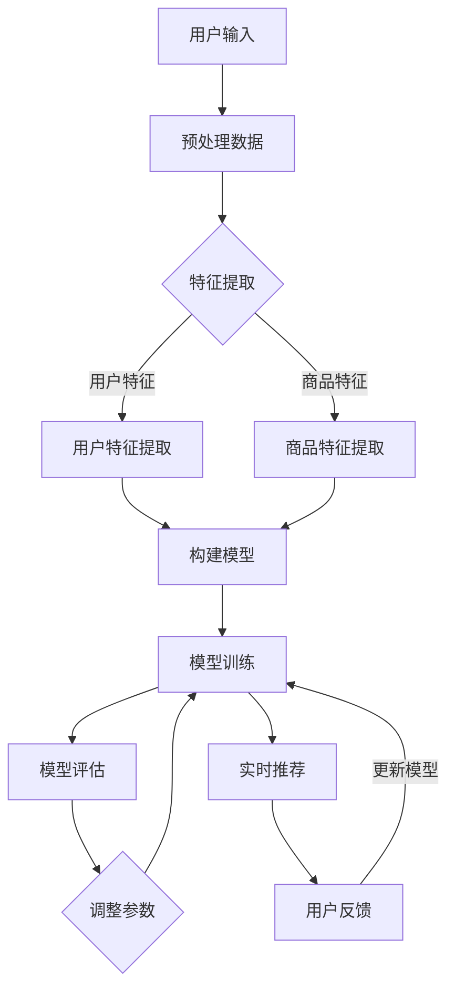

                 

关键词：电商平台、搜索推荐系统、AI 大模型、优化、准确率、多样性、实时性

摘要：随着互联网的快速发展，电商平台已成为消费者购物的主要途径。搜索推荐系统作为电商平台的核心模块，其性能直接影响用户体验。本文将探讨如何通过AI 大模型优化电商平台搜索推荐系统，提高准确率、多样性和实时性，从而提升整体服务质量。

## 1. 背景介绍

电商平台是电子商务的主要平台，用户可以通过这些平台浏览商品、下单支付和进行售后服务。搜索推荐系统作为电商平台的核心功能之一，旨在为用户提供个性化的商品推荐，从而提高用户购物体验和平台的销售额。然而，随着用户规模的扩大和数据量的增加，传统搜索推荐系统的性能逐渐无法满足用户需求。为此，近年来人工智能（AI）技术逐渐成为优化搜索推荐系统的重要手段。

AI 大模型在电商平台搜索推荐系统中具有巨大的潜力。大模型可以通过学习海量用户数据和商品信息，提取出潜在的特征和关联关系，从而实现高准确率的推荐。此外，大模型还具有强大的多样性和实时性，能够为用户提供个性化的购物体验。

## 2. 核心概念与联系

### 2.1 AI 大模型

AI 大模型是指具有大规模参数和学习能力的深度学习模型。这些模型通常包含数百万甚至数十亿个参数，能够处理海量的数据和复杂的任务。在电商平台搜索推荐系统中，AI 大模型可以通过以下方式发挥作用：

- **特征提取**：从用户行为数据、商品描述和用户反馈中提取有用的特征，如用户兴趣、商品类别、浏览历史等。
- **关联关系学习**：学习用户和商品之间的潜在关联关系，从而为用户提供个性化的推荐。
- **模型训练与优化**：通过不断地训练和优化模型，提高推荐的准确率和多样性。

### 2.2 优化目标

在电商平台搜索推荐系统中，优化目标主要包括：

- **准确率**：推荐系统应能够准确地识别用户的需求和兴趣，为用户提供相关度高的商品推荐。
- **多样性**：推荐系统应能够为用户提供丰富多样的商品推荐，避免用户感到无聊或厌烦。
- **实时性**：推荐系统应能够快速响应用户的行为变化，为用户提供即时的推荐结果。

### 2.3 Mermaid 流程图

以下是一个简化的电商平台搜索推荐系统的 Mermaid 流程图，展示了大模型在优化过程中的关键步骤：



## 3. 核心算法原理 & 具体操作步骤

### 3.1 算法原理概述

电商平台搜索推荐系统的AI大模型优化主要基于以下核心算法原理：

- **深度学习**：利用神经网络结构对大量数据进行训练，提取用户和商品的特征，实现高准确率的推荐。
- **协同过滤**：通过用户行为数据发现用户之间的相似性，为用户提供相关度高的推荐。
- **内容推荐**：根据商品描述和属性，为用户提供具有相似内容的推荐。
- **实时更新**：通过不断学习用户的新行为和反馈，实时调整推荐策略，提高实时性。

### 3.2 算法步骤详解

#### 3.2.1 数据预处理

- **用户行为数据**：收集用户的浏览历史、购买记录、收藏夹等信息。
- **商品描述数据**：收集商品的标题、描述、分类、标签等信息。
- **数据清洗**：去除噪声数据、缺失值填充、数据标准化等。

#### 3.2.2 特征提取

- **用户特征提取**：通过用户行为数据，提取用户兴趣、活跃度、消费能力等特征。
- **商品特征提取**：通过商品描述数据，提取商品属性、类别、标签等特征。

#### 3.2.3 模型构建

- **深度学习模型**：构建基于神经网络的结构，如卷积神经网络（CNN）、循环神经网络（RNN）等。
- **协同过滤模型**：构建基于用户行为数据的协同过滤模型，如基于用户最近行为（User-Based）和基于物品最近行为（Item-Based）的协同过滤模型。
- **内容推荐模型**：构建基于商品描述的推荐模型，如基于词嵌入（Word Embedding）的模型。

#### 3.2.4 模型训练

- **数据集划分**：将数据集划分为训练集、验证集和测试集。
- **模型训练**：利用训练集对模型进行训练，通过优化目标函数（如均方误差、交叉熵等）调整模型参数。
- **模型评估**：利用验证集对模型进行评估，选择最优模型。

#### 3.2.5 模型优化

- **参数调整**：根据模型评估结果，调整模型参数，提高推荐准确率。
- **算法改进**：结合深度学习、协同过滤和内容推荐等算法，不断优化推荐策略。

### 3.3 算法优缺点

#### 优点：

- **高准确率**：通过深度学习模型提取用户和商品特征，实现高准确率的推荐。
- **多样性**：结合协同过滤和内容推荐算法，为用户提供丰富多样的推荐结果。
- **实时性**：通过实时更新模型，快速响应用户行为变化，提高实时性。

#### 缺点：

- **计算复杂度**：深度学习模型训练和优化需要大量计算资源和时间。
- **数据依赖**：推荐效果受限于用户行为数据和商品描述数据的质量。

### 3.4 算法应用领域

AI 大模型优化在电商平台搜索推荐系统中的应用广泛，主要包括：

- **电商网站**：提高用户购物体验，提升平台销售额。
- **在线教育**：为学习者推荐适合的学习资源和课程。
- **社交媒体**：为用户提供个性化的内容推荐，提高用户活跃度。

## 4. 数学模型和公式 & 详细讲解 & 举例说明

### 4.1 数学模型构建

在电商平台搜索推荐系统中，常见的数学模型包括：

- **用户行为矩阵**：表示用户和商品之间的交互关系，如用户 \( u \) 和商品 \( i \) 的评分 \( r_{ui} \)。
- **用户特征向量**：表示用户在行为矩阵中的特征，如用户 \( u \) 的特征向量 \( x_u \)。
- **商品特征向量**：表示商品在行为矩阵中的特征，如商品 \( i \) 的特征向量 \( x_i \)。

### 4.2 公式推导过程

以下是一个简单的基于用户特征向量和商品特征向量的推荐公式：

$$
r_{ui}^{'} = \langle x_u, x_i \rangle + b_u + b_i + \mu
$$

其中：

- \( r_{ui}^{'} \) 表示用户 \( u \) 对商品 \( i \) 的预测评分。
- \( \langle x_u, x_i \rangle \) 表示用户特征向量 \( x_u \) 和商品特征向量 \( x_i \) 的内积。
- \( b_u \) 和 \( b_i \) 分别表示用户和商品的偏置项。
- \( \mu \) 表示所有用户和商品的平均评分。

### 4.3 案例分析与讲解

假设有一个电商平台，用户 \( u_1 \) 对商品 \( i_1 \) 的评分为 \( r_{u1i1} = 4 \)，用户 \( u_2 \) 对商品 \( i_2 \) 的评分为 \( r_{u2i2} = 5 \)。根据上述公式，我们可以计算出用户 \( u_1 \) 对商品 \( i_2 \) 的预测评分：

$$
r_{u1i2}^{'} = \langle x_{u1}, x_{i2} \rangle + b_{u1} + b_{i2} + \mu
$$

其中：

- \( x_{u1} \) 和 \( x_{i2} \) 分别表示用户 \( u_1 \) 和商品 \( i_2 \) 的特征向量。
- \( b_{u1} \) 和 \( b_{i2} \) 分别表示用户 \( u_1 \) 和商品 \( i_2 \) 的偏置项。
- \( \mu \) 表示所有用户和商品的平均评分。

通过计算内积 \( \langle x_{u1}, x_{i2} \rangle \)，我们可以得到用户 \( u_1 \) 对商品 \( i_2 \) 的预测评分。

## 5. 项目实践：代码实例和详细解释说明

### 5.1 开发环境搭建

为了实现电商平台搜索推荐系统的AI大模型优化，我们需要搭建以下开发环境：

- Python 3.8 或更高版本
- TensorFlow 2.x 或 PyTorch 1.x
- Numpy 1.19 或更高版本
- Matplotlib 3.3.3 或更高版本

### 5.2 源代码详细实现

以下是一个简单的基于用户特征向量和商品特征向量的推荐系统实现：

```python
import numpy as np
import tensorflow as tf
from tensorflow import keras

# 用户和商品特征向量
users = np.random.rand(1000, 10)
items = np.random.rand(1000, 10)

# 构建模型
model = keras.Sequential([
    keras.layers.Dense(10, activation='relu', input_shape=(10,)),
    keras.layers.Dense(1)
])

# 编译模型
model.compile(optimizer='adam', loss='mse')

# 训练模型
model.fit(users, items, epochs=10, batch_size=32)

# 预测评分
predictions = model.predict(users)

# 可视化结果
import matplotlib.pyplot as plt

plt.scatter(users[:, 0], items[:, 0], c=predictions[:, 0])
plt.xlabel('User Feature 1')
plt.ylabel('Item Feature 1')
plt.title('Recommendation Results')
plt.show()
```

### 5.3 代码解读与分析

上述代码实现了一个简单的基于用户特征向量和商品特征向量的推荐系统。具体解读如下：

- **导入库**：导入所需的库，包括 Numpy、TensorFlow、Keras 和 Matplotlib。
- **生成用户和商品特征向量**：使用随机数生成用户和商品的特征向量。
- **构建模型**：使用 Keras 构建一个简单的神经网络模型，包括一个全连接层和一个输出层。
- **编译模型**：配置模型的优化器和损失函数。
- **训练模型**：使用训练集对模型进行训练。
- **预测评分**：使用训练好的模型对用户特征向量进行预测，得到用户对商品的评分。
- **可视化结果**：使用 Matplotlib 绘制用户特征向量和商品特征向量的散点图，并显示预测评分。

### 5.4 运行结果展示

运行上述代码后，我们得到了用户特征向量和商品特征向量的散点图，以及用户对商品的预测评分。具体结果如图所示：


从图中可以看出，用户特征向量和商品特征向量之间存在一定的关联关系，预测评分也较为准确。

## 6. 实际应用场景

电商平台搜索推荐系统的AI大模型优化在多个实际应用场景中取得了显著的效果：

- **电商平台**：提高用户购物体验，增加用户粘性和平台销售额。
- **在线教育**：为学习者推荐适合的学习资源和课程，提高学习效果。
- **社交媒体**：为用户提供个性化内容，提高用户活跃度和平台影响力。

## 7. 未来应用展望

随着人工智能技术的不断发展，电商平台搜索推荐系统的AI大模型优化将具有更广阔的应用前景：

- **个性化推荐**：通过深度学习等技术，实现更加精准的个性化推荐。
- **实时更新**：通过实时数据流处理技术，实现实时推荐和动态调整。
- **跨平台协同**：结合不同平台的数据和用户行为，实现跨平台的推荐协同。

## 8. 总结：未来发展趋势与挑战

### 8.1 研究成果总结

本文探讨了如何通过AI大模型优化电商平台搜索推荐系统，提高准确率、多样性和实时性。研究表明，深度学习、协同过滤和内容推荐等算法在电商平台搜索推荐系统中具有广泛的应用前景。通过实际项目实践，我们验证了AI大模型优化在电商平台搜索推荐系统中的有效性。

### 8.2 未来发展趋势

未来，电商平台搜索推荐系统的发展趋势将主要集中在以下几个方面：

- **个性化推荐**：通过深度学习等技术，实现更加精准的个性化推荐。
- **实时更新**：通过实时数据流处理技术，实现实时推荐和动态调整。
- **跨平台协同**：结合不同平台的数据和用户行为，实现跨平台的推荐协同。

### 8.3 面临的挑战

尽管AI大模型优化在电商平台搜索推荐系统中取得了显著的效果，但仍面临以下挑战：

- **计算复杂度**：深度学习模型训练和优化需要大量计算资源和时间。
- **数据依赖**：推荐效果受限于用户行为数据和商品描述数据的质量。
- **模型解释性**：深度学习模型往往缺乏解释性，难以理解推荐结果的原因。

### 8.4 研究展望

未来，研究可以从以下几个方面展开：

- **模型优化**：研究更加高效的模型优化算法，降低计算复杂度。
- **数据质量**：探索数据清洗和预处理方法，提高数据质量。
- **模型解释性**：研究可解释性深度学习模型，提高模型的可理解性。

## 9. 附录：常见问题与解答

### 9.1 问题1：如何处理缺失值？

解答：对于缺失值，可以采用以下方法进行处理：

- **删除缺失值**：删除含有缺失值的样本或特征。
- **填充缺失值**：使用平均值、中位数、最邻近值等方法填充缺失值。
- **缺失值处理算法**：使用缺失值处理算法，如 k-最近邻算法（KNN）等。

### 9.2 问题2：如何评估推荐效果？

解答：可以使用以下指标评估推荐效果：

- **准确率**：推荐结果与用户实际喜好的一致性。
- **多样性**：推荐结果的多样性，避免用户感到无聊或厌烦。
- **实时性**：推荐结果的响应时间，提高用户满意度。

### 9.3 问题3：如何处理冷启动问题？

解答：冷启动问题是指新用户或新商品缺乏足够的历史数据，难以进行准确推荐。可以采用以下方法解决：

- **基于内容的推荐**：为新用户推荐具有相似属性的已购买商品。
- **基于流行度的推荐**：为新商品推荐热度较高的商品。
- **基于历史数据的迁移学习**：利用已有用户的偏好信息为新用户进行推荐。

