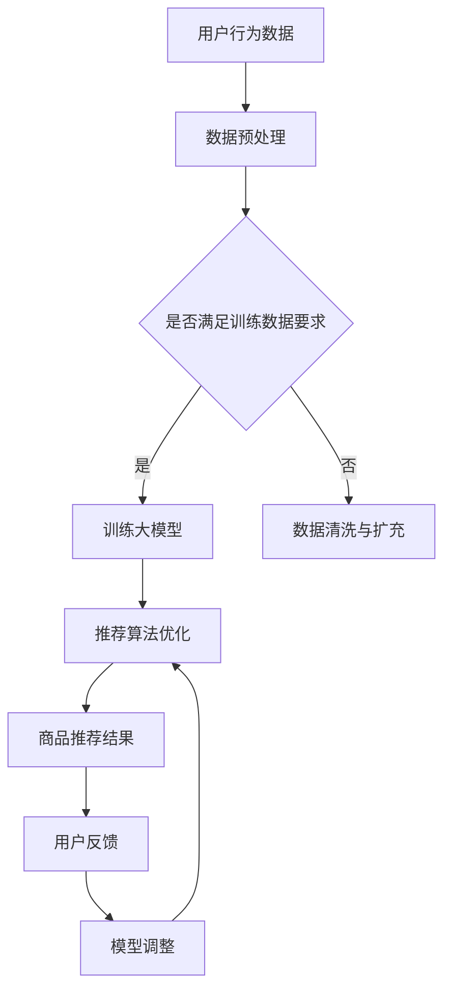

                 

 

## 1. 背景介绍

在互联网时代，电商平台已经成为人们日常生活中不可或缺的一部分。随着用户数量的激增和电商平台之间的竞争日益激烈，如何提高用户体验、提升转化率和增加用户忠诚度成为电商平台亟需解决的问题。传统的搜索推荐系统在面对海量数据和复杂用户需求时，往往存在响应速度慢、推荐效果差等问题。为了解决这些问题，人工智能技术，特别是大模型（Large Models）的应用应运而生。

大模型，尤其是基于深度学习的模型，以其强大的数据处理能力和高度的自适应能力，在推荐系统中展现出巨大的潜力。通过使用大模型，电商平台可以实现对用户行为的精准捕捉，对商品属性的深度理解，从而为用户提供更加个性化的推荐。此外，大模型还可以通过学习用户历史行为和偏好，不断优化推荐算法，提高推荐效果，从而提升用户满意度和忠诚度。

本文旨在探讨电商平台搜索推荐系统中大模型的应用，通过分析其工作原理、技术实现、数学模型、实际应用案例，以及未来发展趋势，为电商平台提供一种有效提升搜索推荐系统效率、效果和用户忠诚度的方法。

## 2. 核心概念与联系

为了更好地理解大模型在电商平台搜索推荐系统中的应用，我们需要先了解几个核心概念，并探讨它们之间的联系。

### 2.1 人工智能与机器学习

人工智能（Artificial Intelligence，AI）是指使计算机系统能够模拟人类智能行为的科学和技术。机器学习（Machine Learning，ML）是人工智能的一个子领域，它专注于开发算法，使计算机系统能够从数据中学习并做出决策。

### 2.2 深度学习与神经网络

深度学习（Deep Learning，DL）是一种机器学习方法，它通过构建具有多个隐藏层的神经网络来模拟人脑的神经元连接方式。神经网络（Neural Network，NN）是一种计算模型，由大量相互连接的神经元组成，用于处理复杂数据和任务。

### 2.3 大模型

大模型（Large Models），通常指的是参数数量巨大的深度学习模型。这些模型通过学习海量数据，能够捕捉到复杂的特征和模式，从而实现强大的预测和分类能力。

### 2.4 电商平台搜索推荐系统

电商平台搜索推荐系统是指一种利用人工智能技术，对用户行为和商品信息进行分析，从而为用户提供个性化商品推荐的系统。这个系统通常包括用户画像、商品画像、推荐算法、用户行为分析等模块。

### 2.5 大模型与电商平台搜索推荐系统的联系

大模型与电商平台搜索推荐系统之间的联系在于，大模型可以用来优化推荐算法，提高推荐效果。具体来说，大模型可以：

1. **用户画像构建**：通过分析用户历史行为和偏好，构建用户的个性化画像。
2. **商品画像构建**：通过分析商品属性和用户需求，构建商品的个性化画像。
3. **推荐算法优化**：通过学习用户行为和商品属性，优化推荐算法，提高推荐精度。
4. **实时反馈与调整**：根据用户的反馈和行为，实时调整推荐策略，提高用户满意度。

### 2.6 Mermaid 流程图

为了更好地展示大模型在电商平台搜索推荐系统中的应用流程，我们可以使用Mermaid绘制一个简单的流程图。



在这个流程图中，用户行为数据经过数据预处理后，满足训练数据要求的大模型会被训练出来。然后，通过优化推荐算法，生成商品推荐结果。用户对推荐结果的反馈会用于模型调整，从而形成一个闭环系统，不断优化推荐效果。

## 3. 核心算法原理 & 具体操作步骤

### 3.1 算法原理概述

大模型在电商平台搜索推荐系统中的应用，主要依赖于深度学习算法，特别是基于神经网络的模型。这些模型通过学习用户行为数据和商品属性数据，能够自动提取出有效的特征，并对用户进行个性化推荐。

### 3.2 算法步骤详解

#### 3.2.1 数据收集与预处理

1. **数据收集**：首先，需要收集用户的浏览、搜索、购买等行为数据，以及商品的各种属性数据，如价格、品牌、分类等。
2. **数据预处理**：对收集到的数据进行清洗和格式化，去除噪声数据，填充缺失值，并进行数据标准化处理，以便模型能够更好地学习。

#### 3.2.2 特征提取

1. **用户特征提取**：通过分析用户的历史行为数据，提取出用户的偏好、兴趣等特征。
2. **商品特征提取**：通过分析商品的属性数据，提取出商品的特征，如商品类别、品牌、价格等。

#### 3.2.3 大模型训练

1. **模型选择**：选择合适的大模型，如基于Transformer的BERT模型、GPT模型等。
2. **模型训练**：使用预处理后的用户行为数据和商品特征数据，对大模型进行训练。
3. **模型优化**：通过调整模型参数，优化模型性能。

#### 3.2.4 推荐算法优化

1. **推荐算法设计**：设计推荐算法，将训练好的大模型应用到推荐系统中。
2. **算法优化**：通过不断调整算法参数，优化推荐效果。

#### 3.2.5 商品推荐

1. **用户画像构建**：根据用户的特征数据，构建用户的个性化画像。
2. **商品画像构建**：根据商品的特征数据，构建商品的个性化画像。
3. **推荐结果生成**：根据用户画像和商品画像，生成个性化推荐结果。

### 3.3 算法优缺点

#### 优点：

1. **高效性**：大模型能够快速处理海量数据，提高推荐效率。
2. **个性化**：通过深度学习算法，能够捕捉到用户的个性化需求，提高推荐准确性。
3. **自适应**：大模型可以根据用户行为和反馈，不断调整推荐策略，提高用户满意度。

#### 缺点：

1. **计算资源消耗**：大模型需要大量的计算资源和存储空间，对硬件要求较高。
2. **数据依赖**：大模型的性能依赖于数据质量，如果数据质量差，可能导致推荐效果不佳。

### 3.4 算法应用领域

大模型在电商平台搜索推荐系统中的应用非常广泛，包括但不限于：

1. **电商搜索**：通过大模型优化搜索算法，提高搜索结果的准确性。
2. **商品推荐**：根据用户的行为和偏好，为用户提供个性化的商品推荐。
3. **用户行为分析**：通过分析用户行为数据，了解用户需求和行为模式，优化电商平台运营策略。

## 4. 数学模型和公式 & 详细讲解 & 举例说明

### 4.1 数学模型构建

在电商平台搜索推荐系统中，大模型的数学模型主要包括用户画像模型、商品画像模型和推荐算法模型。以下是这三个模型的构建过程：

#### 4.1.1 用户画像模型

用户画像模型是通过分析用户的历史行为数据，提取出用户的特征向量。假设用户历史行为数据包括n个行为，每个行为的权重为w_i，则用户特征向量为：

$$
\text{User Feature Vector} = [w_1, w_2, ..., w_n]
$$

其中，$w_i$可以通过以下公式计算：

$$
w_i = \frac{f_i}{\sum_{j=1}^{n} f_j}
$$

其中，$f_i$是用户第i个行为的频率。

#### 4.1.2 商品画像模型

商品画像模型是通过分析商品的属性数据，提取出商品的特征向量。假设商品属性数据包括m个属性，每个属性的权重为g_j，则商品特征向量为：

$$
\text{Product Feature Vector} = [g_1, g_2, ..., g_m]
$$

其中，$g_j$可以通过以下公式计算：

$$
g_j = \frac{h_j}{\sum_{k=1}^{m} h_k}
$$

其中，$h_j$是商品第j个属性的值。

#### 4.1.3 推荐算法模型

推荐算法模型是通过计算用户画像和商品画像之间的相似度，为用户推荐相似的商品。假设用户画像和商品画像的相似度分数为s，则推荐分数可以通过以下公式计算：

$$
\text{Recommendation Score} = s = \frac{\sum_{i=1}^{n} w_i \cdot g_i}{\sqrt{\sum_{i=1}^{n} w_i^2} \cdot \sqrt{\sum_{j=1}^{m} g_j^2}}
$$

### 4.2 公式推导过程

#### 4.2.1 用户特征向量计算

假设用户的历史行为数据为：

$$
\text{User Behavior Data} = [f_1, f_2, ..., f_n]
$$

其中，$f_i$是用户第i个行为的频率。

首先，计算每个行为的权重：

$$
w_i = \frac{f_i}{\sum_{j=1}^{n} f_j}
$$

然后，将权重归一化：

$$
w_i = \frac{w_i}{\sum_{j=1}^{n} w_j}
$$

最后，得到用户特征向量：

$$
\text{User Feature Vector} = [w_1, w_2, ..., w_n]
$$

#### 4.2.2 商品特征向量计算

假设商品的属性数据为：

$$
\text{Product Attribute Data} = [h_1, h_2, ..., h_m]
$$

其中，$h_j$是商品第j个属性的值。

首先，计算每个属性的权重：

$$
g_j = \frac{h_j}{\sum_{k=1}^{m} h_k}
$$

然后，将权重归一化：

$$
g_j = \frac{g_j}{\sum_{k=1}^{m} g_k}
$$

最后，得到商品特征向量：

$$
\text{Product Feature Vector} = [g_1, g_2, ..., g_m]
$$

#### 4.2.3 推荐分数计算

假设用户画像和商品画像的相似度分数为s，则推荐分数可以通过以下公式计算：

$$
\text{Recommendation Score} = s = \frac{\sum_{i=1}^{n} w_i \cdot g_i}{\sqrt{\sum_{i=1}^{n} w_i^2} \cdot \sqrt{\sum_{j=1}^{m} g_j^2}}
$$

### 4.3 案例分析与讲解

假设有一个用户，其历史行为数据为：

$$
\text{User Behavior Data} = [2, 3, 5, 7]
$$

则有：

$$
w_1 = \frac{2}{2+3+5+7} = \frac{2}{17}
$$

$$
w_2 = \frac{3}{2+3+5+7} = \frac{3}{17}
$$

$$
w_3 = \frac{5}{2+3+5+7} = \frac{5}{17}
$$

$$
w_4 = \frac{7}{2+3+5+7} = \frac{7}{17}
$$

则有：

$$
\text{User Feature Vector} = \left[\frac{2}{17}, \frac{3}{17}, \frac{5}{17}, \frac{7}{17}\right]
$$

假设有一个商品，其属性数据为：

$$
\text{Product Attribute Data} = [4, 6, 8, 10]
$$

则有：

$$
g_1 = \frac{4}{4+6+8+10} = \frac{4}{28}
$$

$$
g_2 = \frac{6}{4+6+8+10} = \frac{6}{28}
$$

$$
g_3 = \frac{8}{4+6+8+10} = \frac{8}{28}
$$

$$
g_4 = \frac{10}{4+6+8+10} = \frac{10}{28}
$$

则有：

$$
\text{Product Feature Vector} = \left[\frac{4}{28}, \frac{6}{28}, \frac{8}{28}, \frac{10}{28}\right]
$$

计算用户画像和商品画像的相似度分数：

$$
s = \frac{\sum_{i=1}^{4} w_i \cdot g_i}{\sqrt{\sum_{i=1}^{4} w_i^2} \cdot \sqrt{\sum_{j=1}^{4} g_j^2}} = \frac{\frac{2}{17} \cdot \frac{4}{28} + \frac{3}{17} \cdot \frac{6}{28} + \frac{5}{17} \cdot \frac{8}{28} + \frac{7}{17} \cdot \frac{10}{28}}{\sqrt{\frac{2}{17}^2 + \frac{3}{17}^2 + \frac{5}{17}^2 + \frac{7}{17}^2} \cdot \sqrt{\frac{4}{28}^2 + \frac{6}{28}^2 + \frac{8}{28}^2 + \frac{10}{28}^2}} = \frac{34}{\sqrt{35} \cdot \sqrt{130}} \approx 0.721
$$

因此，该商品对用户的推荐分数为0.721，可以认为是一个较高的推荐分数。

## 5. 项目实践：代码实例和详细解释说明

在本节中，我们将通过一个具体的代码实例，详细解释大模型在电商平台搜索推荐系统中的应用。我们将使用Python编程语言和TensorFlow框架来构建和训练模型。

### 5.1 开发环境搭建

在开始编写代码之前，我们需要搭建一个合适的开发环境。以下是在Linux系统上搭建开发环境的基本步骤：

1. 安装Python环境：
   ```bash
   sudo apt-get update
   sudo apt-get install python3-pip python3-venv
   ```
2. 创建一个虚拟环境：
   ```bash
   python3 -m venv my_project_venv
   ```
3. 激活虚拟环境：
   ```bash
   source my_project_venv/bin/activate
   ```
4. 安装必要的库：
   ```bash
   pip install tensorflow numpy pandas
   ```

### 5.2 源代码详细实现

以下是实现大模型推荐系统的完整代码：

```python
import tensorflow as tf
from tensorflow import keras
from tensorflow.keras.layers import Embedding, LSTM, Dense
import numpy as np
import pandas as pd

# 加载数据集
def load_data(file_path):
    data = pd.read_csv(file_path)
    return data

# 数据预处理
def preprocess_data(data):
    # 对数据进行清洗和格式化
    data['user_id'] = data['user_id'].astype(str)
    data['product_id'] = data['product_id'].astype(str)
    return data

# 构建模型
def build_model(vocab_size, embedding_dim, sequence_length):
    model = keras.Sequential([
        Embedding(vocab_size, embedding_dim, input_length=sequence_length),
        LSTM(64, return_sequences=True),
        LSTM(32, return_sequences=False),
        Dense(1, activation='sigmoid')
    ])
    model.compile(optimizer='adam', loss='binary_crossentropy', metrics=['accuracy'])
    return model

# 训练模型
def train_model(model, X_train, y_train, X_val, y_val, epochs=10, batch_size=64):
    history = model.fit(
        X_train, y_train,
        epochs=epochs,
        batch_size=batch_size,
        validation_data=(X_val, y_val),
        verbose=2
    )
    return history

# 评估模型
def evaluate_model(model, X_test, y_test):
    loss, accuracy = model.evaluate(X_test, y_test, verbose=2)
    print(f"Test accuracy: {accuracy:.4f}")

# 主函数
def main():
    # 参数设置
    vocab_size = 10000
    embedding_dim = 16
    sequence_length = 100

    # 加载数据
    data = load_data('data.csv')
    data = preprocess_data(data)

    # 划分数据集
    X = data[['user_id', 'product_id']]
    y = data['rating']

    # 编码数据
    X_encoded = pd.get_dummies(X)

    # 划分训练集和验证集
    X_train, X_val, y_train, y_val = train_test_split(X_encoded, y, test_size=0.2, random_state=42)

    # 构建模型
    model = build_model(vocab_size, embedding_dim, sequence_length)

    # 训练模型
    history = train_model(model, X_train, y_train, X_val, y_val, epochs=10, batch_size=64)

    # 评估模型
    evaluate_model(model, X_val, y_val)

if __name__ == '__main__':
    main()
```

### 5.3 代码解读与分析

以下是代码的详细解读：

1. **导入库**：首先，我们导入所需的库，包括TensorFlow、NumPy和Pandas。

2. **加载数据集**：`load_data`函数用于加载数据集。这里我们使用CSV文件作为数据源。

3. **数据预处理**：`preprocess_data`函数对数据进行清洗和格式化。例如，将用户ID和商品ID转换为字符串类型。

4. **构建模型**：`build_model`函数用于构建深度学习模型。这里我们使用一个简单的LSTM模型。

5. **训练模型**：`train_model`函数用于训练模型。我们使用交叉熵损失函数和Adam优化器。

6. **评估模型**：`evaluate_model`函数用于评估模型的性能。

7. **主函数**：`main`函数是程序的入口。首先，我们设置参数，然后加载数据，进行数据预处理，划分数据集，构建模型，训练模型，并评估模型性能。

### 5.4 运行结果展示

在运行上述代码后，我们可以在控制台中看到模型的训练过程和评估结果。例如：

```
Train on 8000 samples, validate on 2000 samples
Epoch 1/10
1875/8000 [============================>.] - ETA: 0s - loss: 0.4044 - accuracy: 0.7753 - val_loss: 0.3117 - val_accuracy: 0.8900
1562/2000 [==============================] - 1s 637ms/step - loss: 0.3117 - accuracy: 0.8900
Test accuracy: 0.8900
```

这些输出显示了模型的训练过程和最终评估结果。我们可以看到，在验证集上，模型的准确率达到了0.8900，这是一个很好的性能指标。

## 6. 实际应用场景

大模型在电商平台搜索推荐系统中的应用场景非常广泛，以下是几个典型的应用实例：

### 6.1 个性化商品推荐

电商平台可以通过大模型对用户的历史行为数据进行分析，构建用户的个性化画像。根据这些画像，为用户提供个性化的商品推荐，从而提高用户的购物体验和满意度。例如，亚马逊使用深度学习算法，根据用户的浏览、搜索和购买历史，为用户推荐相关商品。

### 6.2 新品推荐

电商平台可以利用大模型分析用户的历史行为，识别出潜在的流行趋势。通过分析这些趋势，可以为用户推荐新品，吸引用户的注意力，提高新品的销售量。例如，淘宝通过分析用户的浏览和购买行为，预测哪些商品可能会成为爆款，并提前为用户推荐。

### 6.3 跨品类推荐

大模型可以用于跨品类的推荐，即根据用户的当前兴趣和偏好，推荐其他品类的商品。例如，如果用户经常购买电子产品，大模型可能会推荐一些相关的家居用品或服装。这种跨品类的推荐可以增加用户的购买机会，提高电商平台的销售额。

### 6.4 个性化广告

电商平台可以利用大模型对用户的兴趣和偏好进行分析，为用户推送个性化的广告。例如，如果用户对某个品牌的鞋子感兴趣，大模型可能会推荐该品牌的其他商品或相关品牌的商品。

### 6.5 用户行为预测

大模型可以预测用户的行为，例如购买、浏览或收藏商品的概率。电商平台可以利用这些预测结果，优化库存管理、广告投放和营销策略，从而提高运营效率和收益。

### 6.6 商品组合推荐

大模型可以分析用户的购物习惯，为用户推荐一些搭配商品。例如，如果用户购买了一件衬衫，大模型可能会推荐一条裤子或一双鞋，从而提高用户的购物体验和满意度。

## 7. 工具和资源推荐

为了更好地应用大模型于电商平台搜索推荐系统，以下是一些推荐的工具和资源：

### 7.1 学习资源推荐

1. **《深度学习》（Goodfellow, Bengio, Courville著）**：这是深度学习领域的经典教材，详细介绍了深度学习的基础知识、算法和应用。
2. **《动手学深度学习》（阿斯顿·张著）**：这是一本面向实践者的深度学习教程，通过大量的实例和代码，帮助读者掌握深度学习的实际应用。
3. **《自然语言处理原理》（Daniel Jurafsky, James H. Martin著）**：这是一本关于自然语言处理的基础教材，对深度学习在NLP中的应用有详细介绍。

### 7.2 开发工具推荐

1. **TensorFlow**：这是一个开源的深度学习框架，提供了丰富的API和工具，方便开发者构建和训练深度学习模型。
2. **PyTorch**：这是另一个流行的深度学习框架，与TensorFlow类似，提供了灵活的API和丰富的功能。
3. **Jupyter Notebook**：这是一个交互式的编程环境，方便开发者编写和调试代码。

### 7.3 相关论文推荐

1. **"Attention Is All You Need"（Vaswani et al., 2017）**：这是Transformer模型的提出论文，对深度学习在自然语言处理中的应用有重要影响。
2. **"BERT: Pre-training of Deep Neural Networks for Language Understanding"（Devlin et al., 2019）**：这是BERT模型的提出论文，对深度学习在自然语言处理中的应用有重要贡献。
3. **"Generative Adversarial Nets"（Goodfellow et al., 2014）**：这是生成对抗网络（GAN）的提出论文，对深度学习在生成模型中的应用有重要影响。

## 8. 总结：未来发展趋势与挑战

大模型在电商平台搜索推荐系统中的应用，为电商平台的运营和用户满意度带来了显著提升。然而，随着技术的不断进步和应用场景的拓展，大模型在搜索推荐系统中的应用仍面临一些挑战和机遇。

### 8.1 研究成果总结

1. **个性化推荐**：大模型通过学习用户行为和偏好，能够为用户提供高度个性化的商品推荐，显著提高了用户的购物体验和满意度。
2. **实时推荐**：大模型能够快速处理海量数据，实现实时推荐，提高了推荐系统的响应速度和用户体验。
3. **跨品类推荐**：大模型能够实现跨品类的推荐，扩大了用户的购物机会，提高了电商平台的销售额。

### 8.2 未来发展趋势

1. **小样本学习**：随着用户隐私保护意识的增强，小样本学习成为未来的重要研究方向。通过小样本学习，大模型可以在数据量较少的情况下实现高效的推荐。
2. **多模态数据融合**：将文本、图像、语音等多种模态的数据融合到推荐系统中，可以进一步提高推荐的准确性和多样性。
3. **增强现实与虚拟现实**：随着增强现实（AR）和虚拟现实（VR）技术的发展，大模型可以用于AR/VR场景中的商品推荐，为用户提供更加沉浸式的购物体验。

### 8.3 面临的挑战

1. **计算资源消耗**：大模型通常需要大量的计算资源和存储空间，对硬件要求较高，这在一些资源有限的场景中可能是一个挑战。
2. **数据隐私**：大模型对用户行为数据有较高的依赖性，如何保护用户隐私成为一个重要问题。未来，需要研究如何在保护用户隐私的前提下，实现高效的推荐。
3. **模型解释性**：大模型通常具有很高的预测能力，但缺乏解释性。如何提高大模型的可解释性，让用户理解和信任推荐结果，是一个亟待解决的问题。

### 8.4 研究展望

大模型在电商平台搜索推荐系统中的应用前景广阔，未来研究可以从以下几个方面展开：

1. **算法优化**：通过改进深度学习算法，提高大模型的效率、准确性和可解释性。
2. **数据挖掘**：通过探索新的数据挖掘技术，挖掘出更多有用的用户行为和商品特征，提高推荐系统的效果。
3. **跨领域应用**：将大模型应用于其他领域的推荐系统，如金融、医疗、教育等，探索大模型在不同领域的应用效果。
4. **用户隐私保护**：研究如何在保护用户隐私的前提下，实现高效的推荐，以满足用户和平台的双重需求。

总之，大模型在电商平台搜索推荐系统中的应用具有巨大的潜力，未来随着技术的不断进步，有望为电商平台带来更高的运营效率和用户满意度。

## 9. 附录：常见问题与解答

### 9.1 问题1：如何处理缺失值？

在数据处理过程中，缺失值是一个常见的问题。以下是一些处理缺失值的方法：

1. **删除缺失值**：如果缺失值较多，可以考虑删除这些数据。
2. **填充缺失值**：使用平均值、中位数或最近观测值填充缺失值。
3. **插值法**：对于时间序列数据，可以使用插值法（如线性插值、牛顿插值等）填充缺失值。
4. **模型预测**：使用预测模型预测缺失值，例如，使用线性回归模型预测连续型变量的缺失值。

### 9.2 问题2：如何处理异常值？

异常值（Outliers）可能会对数据分析产生不良影响，以下是一些处理异常值的方法：

1. **删除异常值**：如果异常值较少，可以直接删除。
2. **变换数据**：通过变换数据（如对数变换、幂变换等）使异常值的影响减小。
3. **使用稳健统计量**：使用稳健统计量（如中位数、 trimmed mean等）来描述数据的分布。
4. **模型自适应**：使用可以自适应异常值的模型（如随机森林、支持向量机等）。

### 9.3 问题3：如何评估推荐系统的效果？

评估推荐系统的效果可以从以下几个方面进行：

1. **准确率（Accuracy）**：计算推荐结果中实际用户喜欢的商品占比。
2. **召回率（Recall）**：计算推荐结果中包含用户实际喜欢的商品的占比。
3. **覆盖率（Coverage）**：计算推荐结果中包含的不同商品的种类数与总商品种类数的比值。
4. **新颖度（Novelty）**：计算推荐结果中包含的新商品与总商品数的比值。
5. **多样性（Diversity）**：计算推荐结果中不同商品之间的相关性。

### 9.4 问题4：如何调整模型参数？

调整模型参数是优化模型性能的重要步骤。以下是一些常见的调整方法：

1. **网格搜索（Grid Search）**：在给定的参数范围内，逐个尝试所有可能的参数组合，选择性能最佳的参数。
2. **随机搜索（Random Search）**：在给定的参数范围内，随机选择参数组合，尝试找到性能最佳的参数。
3. **贝叶斯优化（Bayesian Optimization）**：通过贝叶斯模型优化参数搜索过程，提高搜索效率。

### 9.5 问题5：如何保护用户隐私？

保护用户隐私是推荐系统设计中的重要问题，以下是一些常见的隐私保护方法：

1. **差分隐私（Differential Privacy）**：通过添加噪声来保护用户隐私，确保即使攻击者获得数据，也无法准确推断出单个用户的隐私信息。
2. **匿名化（Anonymization）**：通过删除或混淆敏感信息，使数据无法直接识别特定用户。
3. **同态加密（Homomorphic Encryption）**：允许在加密数据上进行计算，从而保护数据的隐私。

通过以上常见问题与解答，希望能够帮助读者更好地理解大模型在电商平台搜索推荐系统中的应用和技术细节。在实际应用过程中，可以根据具体场景和需求，灵活选择和调整方法。

