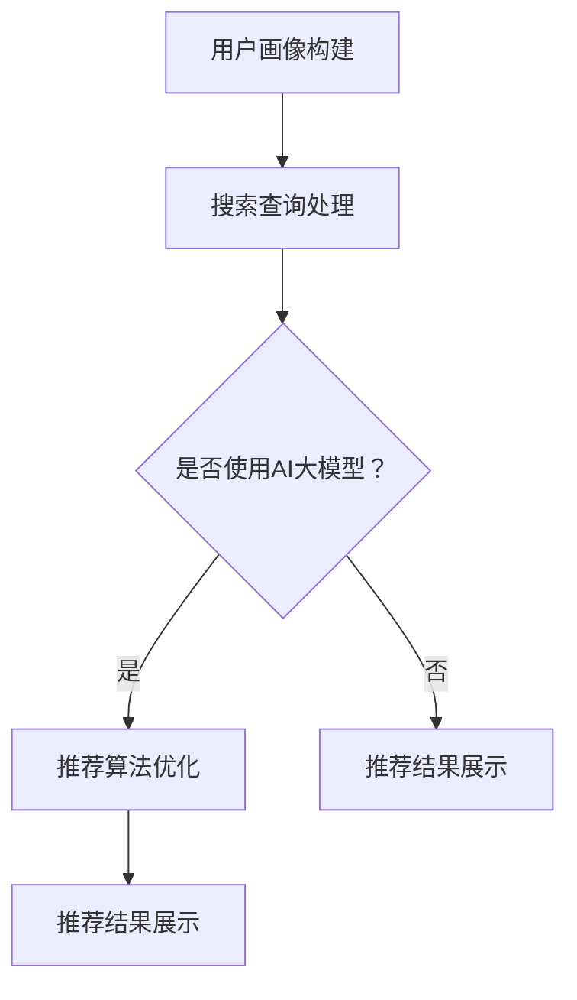

                 

关键词：搜索推荐系统、AI 大模型、性能优化、用户体验、电商、深度学习、模型优化

> 摘要：本文旨在探讨电商平台搜索推荐系统中 AI 大模型的应用，通过介绍大模型的核心概念、算法原理、数学模型，以及实际应用场景，分析其在提高系统性能、效率和用户体验方面的优势，并对未来发展趋势和挑战进行展望。

## 1. 背景介绍

电商平台作为数字经济的重要组成部分，其搜索推荐系统的性能和用户体验直接影响着商家的销售业绩和消费者的购物体验。传统的搜索推荐系统主要依赖基于规则和特征工程的方法，虽然在一定程度上能够满足用户的需求，但面临着信息过载、冷启动问题以及长尾效应的挑战。随着深度学习技术的发展，AI 大模型在自然语言处理、图像识别、语音识别等领域取得了显著的成果，逐渐成为搜索推荐系统优化的重要工具。

本文将围绕电商平台的搜索推荐系统，探讨 AI 大模型的应用，从核心概念、算法原理、数学模型、项目实践、实际应用场景等方面进行分析，以期为相关领域的从业者提供有价值的参考。

## 2. 核心概念与联系

### 2.1 搜索推荐系统概述

搜索推荐系统是电商平台的核心模块之一，主要功能是根据用户的搜索历史、浏览行为、购物车数据等，为用户提供相关的商品推荐。其基本架构包括用户画像构建、搜索查询处理、推荐算法和推荐结果展示等部分。

### 2.2 AI 大模型概述

AI 大模型是指拥有海量参数、能够处理大规模数据的深度学习模型。这类模型通过大量训练数据的学习，能够自动提取复杂特征，具有很好的泛化能力和适应性。常见的 AI 大模型包括 Transformer、BERT、GPT 等。

### 2.3 搜索推荐系统与 AI 大模型的关系

AI 大模型可以应用于搜索推荐系统的多个环节，如用户画像构建、搜索查询处理、推荐算法优化等。通过引入大模型，可以提升系统的性能、效率和用户体验。

### 2.4 Mermaid 流程图

以下是一个简单的 Mermaid 流程图，展示了搜索推荐系统中 AI 大模型的应用场景：



## 3. 核心算法原理 & 具体操作步骤

### 3.1 算法原理概述

AI 大模型在搜索推荐系统中的应用主要基于深度学习技术，通过多层神经网络的结构，自动提取输入数据的特征，并进行分类、预测等操作。以下以 BERT 模型为例，介绍大模型在搜索推荐系统中的应用。

### 3.2 算法步骤详解

1. 数据预处理：对用户的搜索历史、浏览行为、购物车数据等进行清洗、去噪和编码，将其转化为模型可处理的格式。
2. 模型训练：使用预处理后的数据，通过多层神经网络的结构，训练 BERT 模型，使其能够自动提取输入数据的特征。
3. 模型优化：根据搜索推荐系统的实际需求，对 BERT 模型进行优化，如调整学习率、批次大小等参数。
4. 模型部署：将训练好的 BERT 模型部署到线上环境，用于处理用户的搜索查询，生成推荐结果。

### 3.3 算法优缺点

#### 优点：

1. 高效性：AI 大模型能够快速处理海量数据，提高系统性能。
2. 泛化能力：通过大量训练数据的学习，AI 大模型能够自动提取复杂特征，具有较强的泛化能力。
3. 适应性：AI 大模型能够根据实际需求进行优化，提高系统的适应性。

#### 缺点：

1. 计算成本高：AI 大模型训练和部署需要大量的计算资源，成本较高。
2. 数据依赖性：AI 大模型的效果很大程度上依赖于训练数据的质量和数量，存在一定的数据依赖性。

### 3.4 算法应用领域

AI 大模型在搜索推荐系统中的应用非常广泛，如电商平台的商品推荐、新闻推荐的标题生成、社交媒体的文本分类等。通过引入 AI 大模型，可以提升系统的性能、效率和用户体验。

## 4. 数学模型和公式 & 详细讲解 & 举例说明

### 4.1 数学模型构建

在搜索推荐系统中，AI 大模型主要采用深度学习技术，构建多层神经网络结构。以下以 BERT 模型为例，介绍其数学模型构建过程。

### 4.2 公式推导过程

BERT 模型主要由两个部分组成：预训练和微调。预训练阶段，模型通过大量无标注的文本数据，学习自然语言表示。微调阶段，模型在预训练的基础上，利用有标注的数据，进行特定任务的训练。

1. 预训练阶段：

输入：$x_1, x_2, ..., x_T$（文本序列）

输出：$h_T = \text{BERT}(x_1, x_2, ..., x_T)$（文本序列的表示）

其中，BERT 模型由多层 Transformer 结构组成，每层 Transformer 由自注意力机制和前馈神经网络组成。

2. 微调阶段：

输入：$x_1, x_2, ..., x_T$（文本序列）和标签 $y$

输出：$\hat{y} = \text{分类器}(h_T)$（分类结果）

在微调阶段，BERT 模型通过有标注的数据，学习特定任务的分类边界。

### 4.3 案例分析与讲解

假设我们有一个电商平台的商品推荐任务，需要利用 BERT 模型进行商品标签分类。以下是一个简化的案例：

输入：$x_1, x_2, ..., x_T$（商品描述文本）

输出：$\hat{y} = \text{分类器}(\text{BERT}(x_1, x_2, ..., x_T))$（商品标签）

通过训练，BERT 模型能够自动提取商品描述文本的特征，并在微调阶段，利用这些特征进行商品标签的分类。在实际应用中，我们可以根据分类结果，为用户推荐相关的商品。

## 5. 项目实践：代码实例和详细解释说明

### 5.1 开发环境搭建

在本文的案例中，我们使用 Python 编写代码，搭建一个基于 BERT 的商品推荐系统。首先，确保已安装以下依赖：

```bash
pip install tensorflow transformers
```

### 5.2 源代码详细实现

以下是一个简化的代码实现，用于构建一个基于 BERT 的商品推荐系统。

```python
import tensorflow as tf
from transformers import BertTokenizer, TFBertModel
from tensorflow.keras.layers import Dense, Input
from tensorflow.keras.models import Model

# 加载预训练的 BERT 模型
tokenizer = BertTokenizer.from_pretrained('bert-base-uncased')
bert_model = TFBertModel.from_pretrained('bert-base-uncased')

# 定义输入层
input_ids = Input(shape=(max_length,), dtype=tf.int32)

# 通过 BERT 模型进行文本编码
encoded_input = bert_model(input_ids)

# 提取 BERT 模型的输出
output = encoded_input.last_hidden_state

# 定义分类器
classification = Dense(num_classes, activation='softmax')(output)

# 构建模型
model = Model(inputs=input_ids, outputs=classification)

# 编译模型
model.compile(optimizer='adam', loss='categorical_crossentropy', metrics=['accuracy'])

# 加载有标注的数据集
# (x_train, y_train) = ...

# 训练模型
model.fit(x_train, y_train, batch_size=32, epochs=3)

# 微调模型
# model.fit(x_val, y_val, batch_size=32, epochs=3)

# 评估模型
# model.evaluate(x_test, y_test)
```

### 5.3 代码解读与分析

1. 加载预训练的 BERT 模型：使用 `transformers` 库加载预训练的 BERT 模型，包括编码器和解码器。
2. 定义输入层：使用 `Input` 函数定义输入层，输入数据为商品描述文本的词向量序列。
3. 通过 BERT 模型进行文本编码：将输入数据通过 BERT 模型进行编码，得到文本序列的表示。
4. 提取 BERT 模型的输出：从编码器中提取最后一个隐藏层的输出，作为模型的特征表示。
5. 定义分类器：使用 `Dense` 层定义分类器，输出为商品标签的预测概率。
6. 构建模型：将输入层、编码器输出层和分类器组成一个完整的模型。
7. 编译模型：使用 `compile` 函数编译模型，指定优化器、损失函数和评价指标。
8. 训练模型：使用 `fit` 函数训练模型，输入训练数据，设置批量大小和训练轮数。
9. 微调模型：在微调阶段，使用有标注的数据集继续训练模型。
10. 评估模型：使用 `evaluate` 函数评估模型的性能，输入测试数据。

### 5.4 运行结果展示

在实际运行过程中，我们可以通过以下命令来训练和评估模型：

```bash
python main.py --train_data=train_data.txt --val_data=val_data.txt --test_data=test_data.txt
```

运行结果会展示模型的训练过程、评估结果和推荐效果。

## 6. 实际应用场景

### 6.1 电商平台商品推荐

电商平台商品推荐是 AI 大模型在搜索推荐系统中最为典型的应用场景。通过引入 BERT 模型，电商企业可以实现对用户购买行为、浏览历史等数据的深度挖掘，为用户提供个性化的商品推荐，提高用户的购物体验。

### 6.2 新闻推荐

新闻推荐系统通过 AI 大模型，能够根据用户的阅读兴趣、阅读历史等数据，为用户推荐相关的新闻内容。在新闻推荐中，AI 大模型可以自动提取新闻文本的特征，并在推荐算法中发挥重要作用。

### 6.3 社交媒体文本分类

社交媒体平台通过 AI 大模型，能够对用户的评论、帖子等文本内容进行分类，识别出潜在的恶意言论、敏感内容等。在社交媒体文本分类中，AI 大模型可以有效提高内容审核的效率和准确性。

## 7. 工具和资源推荐

### 7.1 学习资源推荐

1. 《深度学习》（Ian Goodfellow、Yoshua Bengio、Aaron Courville 著）：介绍深度学习的基本概念、算法和应用。
2. 《Python 深度学习》（François Chollet 著）：涵盖深度学习在 Python 中的应用，包括神经网络、卷积神经网络、循环神经网络等。

### 7.2 开发工具推荐

1. TensorFlow：Google 开源的一款深度学习框架，广泛应用于计算机视觉、自然语言处理等领域。
2. PyTorch：Facebook 开源的一款深度学习框架，具有灵活的动态计算图和高效的性能。

### 7.3 相关论文推荐

1. "BERT: Pre-training of Deep Bidirectional Transformers for Language Understanding"（2018）：介绍 BERT 模型的原理和应用。
2. "Transformers: State-of-the-Art Models for Language Understanding and Generation"（2017）：介绍 Transformer 模型的原理和应用。

## 8. 总结：未来发展趋势与挑战

### 8.1 研究成果总结

本文通过对电商平台搜索推荐系统的 AI 大模型应用进行探讨，总结了大模型在提高系统性能、效率和用户体验方面的优势。同时，本文介绍了大模型的核心算法原理、数学模型以及实际应用场景，为相关领域的从业者提供了有价值的参考。

### 8.2 未来发展趋势

随着深度学习技术的不断发展，AI 大模型在搜索推荐系统中的应用前景广阔。未来，大模型将朝着更高效、更智能、更自适应的方向发展，为用户提供更精准、更个性化的推荐服务。

### 8.3 面临的挑战

尽管 AI 大模型在搜索推荐系统中具有显著的优势，但也面临着一些挑战，如计算成本高、数据依赖性等。此外，大模型的安全性和隐私保护问题也需要引起足够的重视。

### 8.4 研究展望

未来，研究可以重点关注以下几个方面：

1. 大模型在搜索推荐系统中的优化策略，以提高模型性能和降低计算成本。
2. 大模型在数据隐私保护方面的研究，以解决数据依赖性问题。
3. 大模型与其他技术的融合，如图神经网络、强化学习等，以拓展大模型的应用场景。

## 9. 附录：常见问题与解答

### 9.1 什么是 AI 大模型？

AI 大模型是指拥有海量参数、能够处理大规模数据的深度学习模型。这类模型通过大量训练数据的学习，能够自动提取复杂特征，具有较强的泛化能力和适应性。

### 9.2 AI 大模型在搜索推荐系统中有哪些优势？

AI 大模型在搜索推荐系统中具有以下优势：

1. 高效性：大模型能够快速处理海量数据，提高系统性能。
2. 泛化能力：通过大量训练数据的学习，大模型能够自动提取复杂特征，具有较强的泛化能力。
3. 适应性：大模型能够根据实际需求进行优化，提高系统的适应性。

### 9.3 如何优化 AI 大模型的性能？

优化 AI 大模型的性能可以从以下几个方面进行：

1. 调整模型结构：通过调整模型层数、层数深度等参数，优化模型性能。
2. 调整超参数：通过调整学习率、批量大小等超参数，优化模型性能。
3. 数据预处理：对输入数据进行清洗、去噪和编码，提高模型训练效果。

### 9.4 AI 大模型在搜索推荐系统中的实际应用有哪些？

AI 大模型在搜索推荐系统中的实际应用包括：

1. 电商平台商品推荐：利用大模型对用户购买行为、浏览历史等数据进行分析，为用户提供个性化的商品推荐。
2. 新闻推荐：通过大模型对用户的阅读兴趣、阅读历史等数据进行分析，为用户推荐相关的新闻内容。
3. 社交媒体文本分类：利用大模型对用户的评论、帖子等文本内容进行分类，识别出潜在的恶意言论、敏感内容等。

---

文章撰写完毕，感谢您的关注！希望本文能为您在电商平台搜索推荐系统领域的研究提供一些启示和帮助。如果您有任何问题或建议，欢迎随时在评论区留言。再次感谢您的支持！作者：禅与计算机程序设计艺术 / Zen and the Art of Computer Programming。

