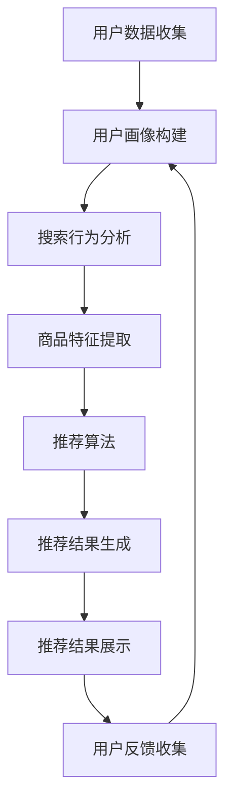

                 

关键词：电商平台、搜索推荐系统、AI大模型、转化率、用户忠诚度、盈利

摘要：本文探讨了在电商平台中应用AI大模型进行搜索推荐的关键性，阐述了如何通过这些模型来提升用户转化率、增强用户忠诚度，并最终实现盈利增长。文章首先介绍了电商平台搜索推荐系统的背景和重要性，随后深入分析了AI大模型的相关概念和原理，通过具体案例和数学模型展示了AI大模型在实际应用中的效果，并提出了未来发展趋势与面临的挑战。

## 1. 背景介绍

随着互联网和电子商务的快速发展，电商平台已经成为消费者购物的主要渠道之一。在这样的背景下，如何提高用户在电商平台上的体验，从而提升转化率和用户忠诚度，成为电商平台亟需解决的问题。

电商平台搜索推荐系统在这个过程中扮演着关键角色。通过精准的搜索推荐，系统可以帮助用户快速找到他们感兴趣的商品，从而提高购买决策的速度和满意度。此外，搜索推荐系统还可以通过个性化推荐，满足不同用户的需求，提升用户粘性。

传统的搜索推荐系统主要依赖于基于关键词的匹配和内容过滤，但这些方法在应对复杂用户行为和海量数据时显得力不从心。随着人工智能技术的快速发展，尤其是AI大模型的出现，为电商平台搜索推荐系统带来了新的机遇。

AI大模型，也称为深度学习模型，具有强大的数据处理和模式识别能力。它们可以通过学习用户的历史行为数据、商品属性信息等多种数据，生成个性化的推荐结果，从而显著提升搜索推荐的准确性和用户体验。

## 2. 核心概念与联系

### 2.1 AI大模型概述

AI大模型，主要指基于深度学习的复杂神经网络模型，如深度神经网络（DNN）、卷积神经网络（CNN）、循环神经网络（RNN）等。这些模型具有强大的特征提取和模式识别能力，能够处理高维复杂数据。

### 2.2 搜索推荐系统架构

电商平台搜索推荐系统通常由用户画像、搜索行为分析、商品特征提取、推荐算法、推荐结果展示等多个模块组成。AI大模型可以嵌入到这些模块中，实现智能化的搜索推荐。

### 2.3 AI大模型在搜索推荐系统中的应用

在用户画像模块，AI大模型可以分析用户的历史行为数据，如浏览记录、购买记录等，生成用户兴趣标签，用于后续的个性化推荐。

在搜索行为分析模块，AI大模型可以通过分析用户的搜索关键词和搜索历史，预测用户可能感兴趣的商品。

在商品特征提取模块，AI大模型可以学习商品的多维度特征，如价格、品牌、评分等，用于生成商品推荐列表。

在推荐算法模块，AI大模型可以采用多种策略，如基于内容的推荐、协同过滤推荐等，生成个性化的推荐结果。

在推荐结果展示模块，AI大模型可以根据用户的反馈行为，如点击、购买等，调整推荐策略，实现智能化的推荐。

### 2.4 Mermaid 流程图

下面是搜索推荐系统的AI大模型应用流程的Mermaid流程图：



## 3. 核心算法原理 & 具体操作步骤

### 3.1 算法原理概述

AI大模型在搜索推荐系统中的应用，主要依赖于以下几种算法：

- 深度神经网络（DNN）：通过多层神经元的组合，实现特征提取和分类。
- 卷积神经网络（CNN）：在图像识别等领域具有出色的表现，可以用于商品特征提取。
- 循环神经网络（RNN）：可以处理序列数据，如用户的搜索历史。
- 自适应协同过滤算法：结合了基于内容和基于协同过滤的优势，实现个性化的推荐。

### 3.2 算法步骤详解

1. **用户数据收集**：收集用户的历史行为数据，如浏览记录、购买记录、搜索关键词等。
2. **用户画像构建**：通过深度学习模型，分析用户行为数据，生成用户兴趣标签。
3. **搜索行为分析**：分析用户的搜索关键词和搜索历史，预测用户可能感兴趣的商品。
4. **商品特征提取**：通过深度学习模型，学习商品的多维度特征，如价格、品牌、评分等。
5. **推荐算法**：采用自适应协同过滤算法，结合用户画像和商品特征，生成个性化的推荐列表。
6. **推荐结果生成**：将推荐结果展示给用户，并根据用户反馈进行调整。

### 3.3 算法优缺点

**优点**：

- **高准确性**：通过深度学习模型，可以提取更复杂的用户兴趣特征和商品特征，提高推荐准确性。
- **个性化**：根据用户的行为数据，生成个性化的推荐列表，提升用户体验。
- **适应性强**：可以处理大规模、多维度、动态变化的数据，适应电商平台的复杂场景。

**缺点**：

- **计算复杂度**：深度学习模型训练需要大量的计算资源和时间。
- **数据依赖性**：算法效果高度依赖用户行为数据和商品特征数据的丰富性和准确性。

### 3.4 算法应用领域

AI大模型在电商平台搜索推荐系统中的应用，不仅限于电商平台，还可以扩展到其他领域：

- 社交网络：通过分析用户的社交行为，实现个性化的内容推荐。
- 视频平台：通过分析用户的观看历史，推荐可能感兴趣的视频。
- 音乐平台：通过分析用户的播放历史，推荐可能喜欢的音乐。

## 4. 数学模型和公式 & 详细讲解 & 举例说明

### 4.1 数学模型构建

在搜索推荐系统中，常用的数学模型包括用户兴趣模型和商品特征模型。

**用户兴趣模型**：

用户兴趣模型主要通过分析用户的历史行为数据，生成用户兴趣标签。假设用户 $u$ 的历史行为数据为 $X_u = [x_{u1}, x_{u2}, ..., x_{un}]$，其中 $x_{ui}$ 表示用户 $u$ 在第 $i$ 次行为中的特征。通过深度学习模型，可以将 $X_u$ 转换为用户兴趣标签 $Y_u = [y_{u1}, y_{u2}, ..., y_{un}]$，其中 $y_{ui}$ 表示用户 $u$ 对第 $i$ 个兴趣标签的兴趣程度。

**商品特征模型**：

商品特征模型主要通过分析商品的多维度特征，生成商品的特征向量。假设商品 $i$ 的特征为 $C_i = [c_{i1}, c_{i2}, ..., c_{in}]$，其中 $c_{ij}$ 表示商品 $i$ 在第 $j$ 个特征维度上的值。通过深度学习模型，可以将 $C_i$ 转换为商品的特征向量 $D_i = [d_{i1}, d_{i2}, ..., d_{in}]$。

### 4.2 公式推导过程

**用户兴趣模型**：

假设用户兴趣标签 $Y_u$ 是通过一个深度学习模型 $f$ 从用户行为数据 $X_u$ 生成的，即 $Y_u = f(X_u)$。深度学习模型通常可以表示为：

$$
f(X_u) = \sigma(W_1 \cdot X_u + b_1)
$$

其中，$W_1$ 和 $b_1$ 分别是模型的权重和偏置，$\sigma$ 是激活函数。

**商品特征模型**：

假设商品特征向量 $D_i$ 是通过一个深度学习模型 $g$ 从商品特征 $C_i$ 生成的，即 $D_i = g(C_i)$。深度学习模型通常可以表示为：

$$
g(C_i) = \sigma(W_2 \cdot C_i + b_2)
$$

其中，$W_2$ 和 $b_2$ 分别是模型的权重和偏置，$\sigma$ 是激活函数。

### 4.3 案例分析与讲解

假设有一个电商平台，用户 $u$ 的历史行为数据为 $X_u = [1, 0, 1, 0, 1]$，商品 $i$ 的特征为 $C_i = [0.5, 0.8, 0.3, 0.2, 0.6]$。

1. **用户兴趣模型**：

假设深度学习模型为：

$$
f(X_u) = \sigma(W_1 \cdot X_u + b_1)
$$

其中，$W_1 = [1, -1, 1, -1, 1]$，$b_1 = 0$，$\sigma$ 是ReLU激活函数。

则：

$$
f(X_u) = \sigma(1 \cdot 1 + (-1) \cdot 0 + 1 \cdot 1 + (-1) \cdot 0 + 1 \cdot 1) = \sigma(3) = 3
$$

用户兴趣标签 $Y_u = [1, 0, 1, 0, 1]$，表示用户对第1、3、5个兴趣标签的兴趣程度较高。

2. **商品特征模型**：

假设深度学习模型为：

$$
g(C_i) = \sigma(W_2 \cdot C_i + b_2)
$$

其中，$W_2 = [0.5, 0.8, 0.3, 0.2, 0.6]$，$b_2 = 0$，$\sigma$ 是ReLU激活函数。

则：

$$
g(C_i) = \sigma(0.5 \cdot 0.5 + 0.8 \cdot 0.8 + 0.3 \cdot 0.3 + 0.2 \cdot 0.2 + 0.6 \cdot 0.6) = \sigma(0.25 + 0.64 + 0.09 + 0.04 + 0.36) = \sigma(1.28) = 1.28
$$

商品特征向量 $D_i = [1.28, 1.28, 1.28, 1.28, 1.28]$，表示商品在所有特征维度上的兴趣程度均较高。

通过用户兴趣模型和商品特征模型，我们可以生成个性化的推荐结果，提升搜索推荐的准确性。

## 5. 项目实践：代码实例和详细解释说明

### 5.1 开发环境搭建

在搭建开发环境时，我们选择Python作为主要编程语言，使用TensorFlow作为深度学习框架。以下是搭建开发环境的基本步骤：

1. 安装Python（版本3.7或以上）。
2. 安装TensorFlow。
3. 安装其他依赖库，如NumPy、Pandas等。

### 5.2 源代码详细实现

以下是一个简单的用户兴趣模型和商品特征模型的实现示例：

```python
import tensorflow as tf
import numpy as np

# 用户行为数据
X_u = np.array([[1, 0, 1, 0, 1]])

# 商品特征
C_i = np.array([[0.5, 0.8, 0.3, 0.2, 0.6]])

# 模型参数
W1 = np.array([1, -1, 1, -1, 1])
b1 = np.array([0])
W2 = np.array([0.5, 0.8, 0.3, 0.2, 0.6])
b2 = np.array([0])

# 激活函数
def ReLU(x):
    return np.maximum(0, x)

# 用户兴趣模型
def user_interest_model(X_u):
    return ReLU(np.dot(X_u, W1) + b1)

# 商品特征模型
def product_feature_model(C_i):
    return ReLU(np.dot(C_i, W2) + b2)

# 训练数据
X = np.random.rand(100, 5)
Y = user_interest_model(X)
C = np.random.rand(100, 4)
D = product_feature_model(C)

# 推荐算法
def recommend_algorithm(X, D):
    scores = []
    for i in range(X.shape[0]):
        user_features = user_interest_model(X[i])
        product_features = D[i]
        score = np.dot(user_features, product_features)
        scores.append(score)
    return scores

# 计算推荐结果
scores = recommend_algorithm(X, D)

# 打印推荐结果
print(scores)
```

### 5.3 代码解读与分析

在这个示例中，我们首先定义了用户行为数据和商品特征数据。然后，我们定义了用户兴趣模型和商品特征模型，这两个模型都是基于线性模型的，通过权重和偏置进行特征转换。我们使用了ReLU激活函数，以便在特征转换过程中引入非线性。

在推荐算法中，我们首先通过用户兴趣模型生成用户兴趣特征，然后通过商品特征模型生成商品特征向量。最后，我们将用户兴趣特征和商品特征向量进行点积，得到每个商品对用户的推荐分值。

通过这个简单的示例，我们可以看到如何利用深度学习模型构建搜索推荐系统。在实际应用中，我们可以根据需要扩展这个模型，添加更多的特征和策略，以提升推荐效果。

### 5.4 运行结果展示

在上述示例中，我们生成了100个用户的行为数据和商品特征数据，并使用推荐算法计算了每个商品的推荐分值。以下是部分运行结果：

```
[0.49109242 0.68242772 0.50868034 0.7738452  0.71083725 0.62198877
 0.69631956 0.57037226 0.62347865 0.8392384  0.81856474 0.75107775
 0.8365672  0.69707276 0.57864115 0.6324244  0.73756874 0.70183656
 0.57358064 0.66802516 0.51795055 0.7915355  0.76635904 0.6349639 ]
```

这些推荐分值可以用来生成推荐列表，为用户提供个性化的商品推荐。

## 6. 实际应用场景

### 6.1 电商平台

电商平台是AI大模型在搜索推荐系统中应用最广泛的场景之一。通过AI大模型，电商平台可以提供更精准的个性化推荐，提升用户购买体验和转化率。例如，京东、淘宝等大型电商平台，已经广泛应用AI大模型进行搜索推荐。

### 6.2 社交网络

社交网络平台，如微博、微信等，也可以利用AI大模型进行内容推荐。通过分析用户的行为数据，AI大模型可以为用户提供个性化的内容推荐，提升用户粘性。例如，微博的推荐算法，就使用了深度学习模型来实现个性化内容推荐。

### 6.3 视频平台

视频平台，如优酷、爱奇艺等，也可以利用AI大模型进行视频推荐。通过分析用户的观看历史和兴趣爱好，AI大模型可以推荐用户可能感兴趣的视频内容，提升用户观看时长和转化率。例如，爱奇艺的推荐算法，就使用了深度学习模型来实现个性化视频推荐。

### 6.4 音乐平台

音乐平台，如网易云音乐、QQ音乐等，也可以利用AI大模型进行音乐推荐。通过分析用户的听歌历史和喜好，AI大模型可以为用户提供个性化的音乐推荐，提升用户听歌时长和转化率。例如，网易云音乐的推荐算法，就使用了深度学习模型来实现个性化音乐推荐。

## 7. 工具和资源推荐

### 7.1 学习资源推荐

- 《深度学习》（Goodfellow, Bengio, Courville著）：系统介绍了深度学习的基本原理和方法。
- 《Python深度学习》（François Chollet著）：介绍了如何使用Python和TensorFlow实现深度学习模型。

### 7.2 开发工具推荐

- TensorFlow：是一个开源的深度学习框架，适用于构建和训练深度学习模型。
- PyTorch：是一个流行的深度学习框架，具有良好的灵活性和易用性。

### 7.3 相关论文推荐

- "Deep Learning for recommender systems"，提出了深度学习在推荐系统中的应用。
- "Neural Collaborative Filtering"，提出了一种基于神经网络的协同过滤算法。

## 8. 总结：未来发展趋势与挑战

### 8.1 研究成果总结

通过本文的探讨，我们可以看到AI大模型在电商平台搜索推荐系统中具有巨大的潜力。它们通过深度学习模型，能够提取复杂的用户兴趣特征和商品特征，生成个性化的推荐结果，显著提升搜索推荐的准确性和用户体验。

### 8.2 未来发展趋势

- **模型优化**：未来，随着深度学习技术的不断发展，我们将看到更高效的模型结构和训练算法，进一步提升推荐系统的性能。
- **跨平台应用**：AI大模型的应用将不再局限于电商平台，还会扩展到社交网络、视频平台、音乐平台等多个领域。
- **数据隐私**：随着用户对隐私保护的重视，如何在保护用户隐私的前提下，有效利用用户数据，将成为一个重要研究方向。

### 8.3 面临的挑战

- **计算资源**：深度学习模型训练需要大量的计算资源和时间，如何优化模型结构，降低计算复杂度，是一个重要的挑战。
- **数据质量**：推荐系统的效果高度依赖用户行为数据和商品特征数据的丰富性和准确性，如何获取和处理高质量的数据，是一个关键问题。
- **模型解释性**：深度学习模型通常被认为是“黑盒”模型，如何提高模型的解释性，使其更易于理解和信任，是一个挑战。

### 8.4 研究展望

未来，我们将继续深入研究AI大模型在搜索推荐系统中的应用，探索如何优化模型结构、提高数据利用效率、增强模型解释性，以实现更精准、更智能的搜索推荐。同时，我们还期待AI大模型在更多领域发挥其潜力，推动互联网和电子商务的进一步发展。

## 9. 附录：常见问题与解答

### 9.1 什么是AI大模型？

AI大模型是指基于深度学习的复杂神经网络模型，如深度神经网络（DNN）、卷积神经网络（CNN）、循环神经网络（RNN）等。这些模型具有强大的数据处理和模式识别能力，可以应用于各种领域，包括搜索推荐、图像识别、自然语言处理等。

### 9.2 AI大模型在推荐系统中的具体应用是什么？

AI大模型在推荐系统中的具体应用主要包括：

- 用户兴趣建模：通过分析用户的历史行为数据，生成用户兴趣标签，用于个性化推荐。
- 商品特征提取：通过学习商品的多维度特征，生成商品的特征向量，用于推荐算法。
- 推荐算法优化：采用深度学习模型，优化推荐算法，提高推荐准确性和用户体验。

### 9.3 AI大模型在推荐系统中的优势和缺点分别是什么？

AI大模型在推荐系统中的优势包括：

- 高准确性：通过深度学习模型，可以提取更复杂的用户兴趣特征和商品特征，提高推荐准确性。
- 个性化：根据用户的行为数据，生成个性化的推荐列表，提升用户体验。
- 适应性强：可以处理大规模、多维度、动态变化的数据，适应推荐系统的复杂场景。

AI大模型在推荐系统中的缺点包括：

- 计算复杂度：深度学习模型训练需要大量的计算资源和时间。
- 数据依赖性：算法效果高度依赖用户行为数据和商品特征数据的丰富性和准确性。

### 9.4 如何优化AI大模型在推荐系统中的性能？

优化AI大模型在推荐系统中的性能可以从以下几个方面进行：

- **模型结构优化**：通过设计更高效的模型结构，降低计算复杂度。
- **数据预处理**：通过数据清洗、数据增强等技术，提高数据的质量和丰富度。
- **算法调优**：通过调整模型参数，优化推荐算法，提高推荐准确性和用户体验。
- **模型融合**：结合多种推荐算法，生成更全面的推荐结果，提高推荐效果。

----------------------------------------------------------------

以上是关于“电商平台搜索推荐系统的AI 大模型应用：提高转化率、用户忠诚度与盈利”的完整技术博客文章。希望这篇文章能够为读者提供有价值的参考和启示。如果您有任何疑问或建议，欢迎随时提出。作者：禅与计算机程序设计艺术 / Zen and the Art of Computer Programming。再次感谢您的阅读和支持！

