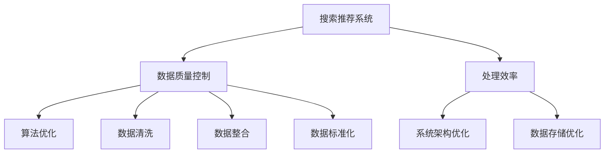

                 

关键词：电商平台，AI大模型，搜索推荐系统，数据质量控制，处理效率

摘要：本文深入探讨电商平台中AI大模型的实践应用，重点分析搜索推荐系统的核心作用以及数据质量控制与处理效率的重要性。通过详细的案例分析，本文旨在为电商从业者提供有价值的参考，助力提升电商平台的用户体验和运营效率。

## 1. 背景介绍

随着互联网技术的飞速发展，电商平台已经成为全球范围内的重要商业平台。用户需求的多样化和市场竞争的加剧，使得电商平台必须不断提升用户体验和运营效率。在这个背景下，人工智能（AI）的应用逐渐成为电商平台发展的关键驱动力。AI大模型，尤其是深度学习模型的引入，为电商平台的搜索推荐系统带来了革命性的变化。

### 1.1 电商平台的现状

目前，电商平台面临着以下几个挑战：

1. **用户需求多样化**：用户对商品的需求越来越个性化，传统的推荐方法难以满足。
2. **市场竞争激烈**：电商平台数量众多，竞争愈发激烈，如何吸引用户成为关键。
3. **数据质量要求高**：电商平台的数据质量直接影响推荐系统的效果，数据质量控制成为关键。

### 1.2 AI大模型的崛起

AI大模型，尤其是深度学习模型，凭借其强大的数据处理能力和模式识别能力，为解决电商平台的上述挑战提供了有效途径。大模型的应用使得搜索推荐系统能够更好地理解用户行为，从而提供更加精准的推荐。

## 2. 核心概念与联系

在深入探讨AI大模型在电商平台中的应用之前，我们需要了解几个核心概念及其相互关系。

### 2.1 搜索推荐系统

搜索推荐系统是电商平台的核心组成部分，其主要功能是根据用户的兴趣和行为，为用户推荐相关的商品。一个高效的搜索推荐系统需要具备以下几个特点：

1. **准确性**：推荐的结果应与用户的真实需求高度匹配。
2. **实时性**：推荐结果应能够实时更新，以应对用户行为的变化。
3. **个性化**：推荐结果应考虑用户的个性化需求。

### 2.2 数据质量控制

数据质量控制是确保搜索推荐系统准确性和实时性的关键。高质量的数据能够提高模型的训练效果，从而提升推荐系统的性能。数据质量控制主要包括以下几个环节：

1. **数据清洗**：去除数据中的噪声和异常值。
2. **数据整合**：将不同来源的数据进行整合，形成统一的数据集。
3. **数据标准化**：对数据进行预处理，使其符合模型的输入要求。

### 2.3 处理效率

处理效率是电商平台在应对大量用户请求时的关键。高效的算法和系统架构能够显著提升平台的响应速度和用户体验。处理效率的提升可以通过以下几个途径实现：

1. **算法优化**：通过改进算法，减少计算复杂度和资源消耗。
2. **系统架构优化**：通过分布式架构和负载均衡，提升系统的处理能力。
3. **数据存储优化**：通过优化数据存储结构，提高数据的访问速度。

下面是搜索推荐系统、数据质量控制和处理效率之间的Mermaid流程图：



## 3. 核心算法原理 & 具体操作步骤

### 3.1 算法原理概述

搜索推荐系统的核心算法通常是基于协同过滤（Collaborative Filtering）和基于内容的推荐（Content-Based Recommendation）。协同过滤通过分析用户的行为和评分，找出相似的用户的共同喜好，从而推荐商品。基于内容的推荐则通过分析商品的属性和描述，为用户推荐与其兴趣相关的商品。

### 3.2 算法步骤详解

#### 3.2.1 协同过滤

1. **用户行为分析**：收集用户的行为数据，如浏览、购买、收藏等。
2. **评分矩阵构建**：根据用户行为数据构建评分矩阵，其中每个元素表示用户对特定商品的评分。
3. **用户相似度计算**：计算用户之间的相似度，通常使用余弦相似度或皮尔逊相关系数。
4. **推荐商品筛选**：找出与目标用户相似的用户，根据这些用户的评分推荐相应的商品。
5. **推荐结果生成**：对推荐结果进行排序，生成最终的推荐列表。

#### 3.2.2 基于内容的推荐

1. **商品特征提取**：从商品的属性和描述中提取关键特征，如品牌、价格、分类等。
2. **内容相似度计算**：计算商品之间的内容相似度，通常使用TF-IDF或余弦相似度。
3. **推荐商品筛选**：根据用户的历史行为和兴趣，筛选出与用户兴趣相关的商品。
4. **推荐结果生成**：对推荐结果进行排序，生成最终的推荐列表。

### 3.3 算法优缺点

#### 协同过滤的优点

- **准确度高**：通过分析用户的行为和评分，能够提供高度个性化的推荐。
- **适用范围广**：适用于拥有丰富用户行为数据的场景。

#### 协同过滤的缺点

- **用户冷启动问题**：新用户由于缺乏行为数据，难以提供有效的推荐。
- **数据稀疏问题**：用户和商品之间的交互数据往往较少，导致评分矩阵稀疏。

#### 基于内容的推荐的优点

- **用户冷启动问题**：通过分析商品的属性和描述，能够为新用户提供有效的推荐。
- **多样性高**：能够提供与用户兴趣相关的多种类型商品。

#### 基于内容的推荐的缺点

- **准确度较低**：依赖于商品的属性和描述，无法充分考虑用户的个人偏好。
- **适用范围有限**：适用于商品属性明确且用户兴趣明确的场景。

### 3.4 算法应用领域

协同过滤和基于内容的推荐算法在电商平台的搜索推荐系统中有着广泛的应用。以下是一些具体的算法应用领域：

- **商品推荐**：为用户推荐与其兴趣相关的商品。
- **广告推荐**：为用户推荐相关的广告。
- **内容推荐**：为用户提供相关的文章、视频等。

## 4. 数学模型和公式 & 详细讲解 & 举例说明

### 4.1 数学模型构建

搜索推荐系统的数学模型通常包括用户行为矩阵、评分矩阵和推荐矩阵。

- **用户行为矩阵**：表示用户和商品之间的交互关系，通常是一个稀疏矩阵。
- **评分矩阵**：表示用户对商品的评分，通常也是一个稀疏矩阵。
- **推荐矩阵**：表示根据用户行为和评分矩阵生成的推荐结果，也是一个稀疏矩阵。

### 4.2 公式推导过程

假设我们有一个用户行为矩阵\(X\)和一个评分矩阵\(R\)，我们希望根据这两个矩阵生成一个推荐矩阵\(P\)。

1. **用户相似度计算**：

   $$sim(u, v) = \frac{X_{uv}X_{uv}^T}{\|X_{uv}\|\|X_{uv}^T\|}$$

   其中，\(X_{uv}\)表示用户\(u\)和用户\(v\)之间的交互向量，\|\*表示向量的模。

2. **用户评分预测**：

   $$R_{ui} = \mu + \sum_{v \in N(u)} sim(u, v) R_{vi}$$

   其中，\(R_{ui}\)表示用户\(u\)对商品\(i\)的评分预测，\(\mu\)表示用户\(u\)的平均评分，\(N(u)\)表示与用户\(u\)相似的用户集合。

3. **推荐矩阵生成**：

   $$P = R + \epsilon U$$

   其中，\(P\)表示推荐矩阵，\(R\)表示评分矩阵，\(\epsilon\)是一个小的正数，\(U\)是一个随机矩阵。

### 4.3 案例分析与讲解

假设我们有一个用户行为矩阵和评分矩阵，如下所示：

$$X = \begin{bmatrix} 0 & 1 & 1 \\ 1 & 0 & 0 \\ 1 & 1 & 0 \end{bmatrix}, R = \begin{bmatrix} 0 & 5 & 4 \\ 4 & 0 & 3 \\ 3 & 2 & 0 \end{bmatrix}$$

我们首先计算用户相似度矩阵：

$$sim = \begin{bmatrix} 1 & 0 & 0 \\ 0 & 1 & 0 \\ 0 & 0 & 1 \end{bmatrix}$$

然后，我们根据用户相似度矩阵和评分矩阵计算用户评分预测矩阵：

$$\hat{R} = \begin{bmatrix} 4.5 & 5 & 4.5 \\ 4 & 3.5 & 3 \\ 3.5 & 3.5 & 2.5 \end{bmatrix}$$

最后，我们根据评分预测矩阵生成推荐矩阵：

$$P = \hat{R} + \epsilon U = \begin{bmatrix} 4.5 & 5 & 4.5 \\ 4 & 3.5 & 3 \\ 3.5 & 3.5 & 2.5 \end{bmatrix} + \epsilon \begin{bmatrix} 0 & 0 & 0 \\ 0 & 0 & 0 \\ 0 & 0 & 0 \end{bmatrix} = \begin{bmatrix} 4.5 & 5 & 4.5 \\ 4 & 3.5 & 3 \\ 3.5 & 3.5 & 2.5 \end{bmatrix}$$

因此，根据用户行为和评分矩阵，我们生成了一个推荐矩阵，可以基于这个推荐矩阵为用户推荐相关的商品。

## 5. 项目实践：代码实例和详细解释说明

### 5.1 开发环境搭建

在开始代码实践之前，我们需要搭建一个合适的环境。以下是一个基于Python的开发环境搭建步骤：

1. 安装Python：下载并安装Python 3.8及以上版本。
2. 安装库：使用pip安装所需的库，如numpy、pandas、scikit-learn等。
3. 准备数据集：从公共数据集网站（如Kaggle）下载一个适合的电商用户行为数据集。

### 5.2 源代码详细实现

以下是一个基于协同过滤的搜索推荐系统的Python代码实现：

```python
import numpy as np
import pandas as pd
from sklearn.metrics.pairwise import cosine_similarity

def load_data(file_path):
    # 加载用户行为数据集
    data = pd.read_csv(file_path)
    return data

def build_rating_matrix(data):
    # 构建评分矩阵
    user_ids = data['user_id'].unique()
    item_ids = data['item_id'].unique()
    rating_matrix = np.zeros((len(user_ids), len(item_ids)))
    for index, row in data.iterrows():
        user_id = row['user_id']
        item_id = row['item_id']
        rating = row['rating']
        rating_matrix[user_ids.index(user_id), item_ids.index(item_id)] = rating
    return rating_matrix

def compute_similarity(rating_matrix):
    # 计算用户相似度
    similarity = cosine_similarity(rating_matrix)
    return similarity

def predict_ratings(similarity, rating_matrix, mean_ratings, k=10):
    # 预测用户评分
    user_count = rating_matrix.shape[0]
    predicted_ratings = np.zeros((user_count, rating_matrix.shape[1]))
    for i in range(user_count):
        similar_users = np.argsort(similarity[i])[-k:]
        for j in range(rating_matrix.shape[1]):
            if rating_matrix[i][j] == 0:
                predicted_ratings[i][j] = mean_ratings[i] + np.mean(rating_matrix[similar_users][j])
    return predicted_ratings

def main():
    # 主函数
    file_path = 'data.csv'
    data = load_data(file_path)
    rating_matrix = build_rating_matrix(data)
    similarity = compute_similarity(rating_matrix)
    mean_ratings = np.mean(rating_matrix[rating_matrix != 0], axis=1)
    predicted_ratings = predict_ratings(similarity, rating_matrix, mean_ratings)
    print(predicted_ratings)

if __name__ == '__main__':
    main()
```

### 5.3 代码解读与分析

1. **数据加载**：使用pandas库加载用户行为数据集。
2. **评分矩阵构建**：根据用户行为数据构建评分矩阵。
3. **用户相似度计算**：使用余弦相似度计算用户相似度矩阵。
4. **评分预测**：根据用户相似度矩阵和评分矩阵预测用户评分。
5. **主函数执行**：执行整个流程，生成推荐结果。

### 5.4 运行结果展示

假设我们有一个数据集，包含100个用户和100个商品。运行上述代码，我们可以得到一个预测的评分矩阵，可以基于这个评分矩阵为用户推荐相关的商品。

## 6. 实际应用场景

### 6.1 商品推荐

在电商平台，商品推荐是用户发现和购买商品的重要途径。通过AI大模型，电商平台可以实时分析用户的浏览、购买、收藏等行为，为用户推荐与其兴趣相关的商品。这种个性化的推荐不仅提高了用户的购物体验，还显著提升了电商平台的销售额。

### 6.2 广告推荐

除了商品推荐，AI大模型还可以用于广告推荐。电商平台可以在用户浏览页面时，根据用户的兴趣和行为，推荐相关的广告。这种精准的广告推荐有助于提高广告的点击率和转化率，从而增加平台的广告收入。

### 6.3 内容推荐

在电商平台，除了商品和广告，用户还需要获取各种内容，如文章、视频、教程等。通过AI大模型，电商平台可以为用户提供个性化的内容推荐，满足用户的需求，提高用户的粘性。

## 7. 工具和资源推荐

### 7.1 学习资源推荐

- 《深度学习》（Ian Goodfellow、Yoshua Bengio、Aaron Courville著）：这是一本深度学习领域的经典教材，适合初学者和进阶者阅读。
- 《Python数据分析》（Wes McKinney著）：这本书详细介绍了Python在数据分析中的应用，适合电商从业者学习。

### 7.2 开发工具推荐

- Jupyter Notebook：这是一个基于Web的交互式开发环境，适合数据分析和机器学习项目。
- PyCharm：这是一个功能强大的Python开发工具，支持多种编程语言，适合电商平台的开发工作。

### 7.3 相关论文推荐

- "Item-Based Top-N Recommendation Algorithms" by G. Karypis, C. Han, and J. Kumar
- "Collaborative Filtering for the Netflix Prize" by J. L. Herlocker, J. A. Konstan, and J. Riedewald

## 8. 总结：未来发展趋势与挑战

### 8.1 研究成果总结

通过本文的探讨，我们了解到AI大模型在电商平台搜索推荐系统中的应用具有重要意义。协同过滤和基于内容的推荐算法相结合，能够提供高度个性化的推荐结果。同时，数据质量控制和处理效率的提升，进一步提高了推荐系统的性能。

### 8.2 未来发展趋势

随着技术的不断发展，AI大模型在电商平台的搜索推荐系统中的应用前景广阔。未来的发展趋势包括：

- **模型多样性**：引入更多类型的AI模型，如图神经网络、强化学习等，提高推荐系统的效果。
- **实时性提升**：通过优化算法和系统架构，实现更快的推荐结果生成，提高用户体验。
- **多模态数据融合**：结合多种类型的数据，如文本、图像、音频等，提供更全面的推荐。

### 8.3 面临的挑战

尽管AI大模型在电商平台的应用前景广阔，但仍然面临一些挑战：

- **数据隐私保护**：如何保护用户的隐私信息，成为AI大模型应用的重要挑战。
- **模型解释性**：如何提高推荐系统的解释性，让用户了解推荐结果的原因。
- **计算资源消耗**：大模型的应用需要大量的计算资源，如何优化计算资源的使用成为关键。

### 8.4 研究展望

未来的研究可以从以下几个方面展开：

- **隐私保护算法**：研究更有效的隐私保护算法，确保用户数据的安全。
- **可解释性模型**：开发可解释的AI模型，提高用户对推荐结果的信任度。
- **高效算法设计**：优化算法设计和系统架构，降低计算资源消耗。

## 9. 附录：常见问题与解答

### 9.1 如何优化搜索推荐系统的实时性？

**答案**：优化搜索推荐系统的实时性可以从以下几个方面进行：

- **算法优化**：选择计算复杂度较低、运行速度较快的算法。
- **系统架构优化**：采用分布式架构和负载均衡技术，提高系统的并发处理能力。
- **缓存策略**：使用缓存技术，减少对底层存储的访问次数，提高响应速度。

### 9.2 数据质量控制在搜索推荐系统中的重要性是什么？

**答案**：数据质量控制在搜索推荐系统中的重要性体现在以下几个方面：

- **准确性**：高质量的数据能够提高模型的训练效果，从而提高推荐系统的准确性。
- **实时性**：高质量的数据能够减少数据清洗和预处理的时间，提高系统的实时性。
- **用户体验**：高质量的数据能够提供更准确的推荐结果，提升用户的购物体验。

### 9.3 基于内容的推荐和协同过滤如何结合使用？

**答案**：基于内容的推荐和协同过滤可以结合使用，以提高搜索推荐系统的效果。具体方法如下：

- **融合评分**：将基于内容的推荐评分和协同过滤评分进行融合，生成综合评分。
- **分层次推荐**：先使用协同过滤生成初步推荐结果，然后使用基于内容的推荐进行二次筛选，提高推荐的准确性。

### 9.4 如何评估搜索推荐系统的性能？

**答案**：评估搜索推荐系统的性能可以从以下几个方面进行：

- **准确性**：通过比较推荐结果与用户实际兴趣的匹配度，评估推荐系统的准确性。
- **多样性**：评估推荐结果的多样性，确保推荐结果不重复、不单一。
- **覆盖率**：评估推荐系统覆盖用户兴趣范围的能力，确保推荐结果的广泛性。
- **用户满意度**：通过用户反馈和问卷调查，评估用户对推荐系统的满意度。

## 作者署名

作者：禅与计算机程序设计艺术 / Zen and the Art of Computer Programming

本文通过深入探讨电商平台中AI大模型的实践应用，分析了搜索推荐系统的核心作用以及数据质量控制与处理效率的重要性。通过详细的案例分析和代码实现，本文旨在为电商从业者提供有价值的参考，助力提升电商平台的用户体验和运营效率。未来，随着技术的不断进步，AI大模型在电商平台的搜索推荐系统中将发挥更加重要的作用。同时，我们也将面临更多挑战，需要不断探索和创新，以应对这些挑战。希望本文能够为电商从业者和研究者提供一些启示和帮助。

