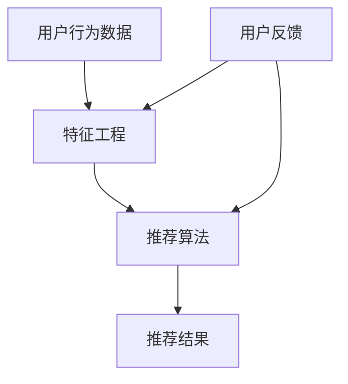

                 

关键词：电商平台、AI 大模型、搜索推荐系统、性能优化、算法应用、数学模型

## 摘要

随着互联网电商行业的迅猛发展，用户对个性化搜索和推荐的需求日益增长。本文旨在探讨在电商平台上运用人工智能大模型进行搜索推荐系统的性能提升。我们将分析大模型的核心概念及其在电商搜索推荐中的应用，介绍关键算法原理、数学模型，并通过实际项目实践展示其效果，最后展望未来发展趋势与挑战。

## 1. 背景介绍

### 电商平台的现状与挑战

随着电商平台的多样化发展，用户规模不断扩大，交易数据呈指数级增长。传统的搜索推荐系统在面对海量数据、复杂用户行为时，往往难以满足用户的需求。而人工智能技术的引入，特别是大模型的运用，为电商平台带来了新的机遇和挑战。

#### 1.1 个性化推荐的重要性

个性化推荐已成为电商平台吸引用户、提高用户粘性的重要手段。通过对用户行为、历史数据进行分析，系统可以提供更加精准的推荐结果，从而提升用户体验。

#### 1.2 大模型在搜索推荐中的应用

大模型，如深度神经网络、生成对抗网络等，具有强大的特征提取能力和泛化能力，能够处理复杂的数据关系，实现高效的搜索推荐。

### 搜索推荐系统的性能优化

搜索推荐系统的性能直接关系到电商平台的业务成功。以下将介绍如何通过优化算法、数学模型、项目实践等方面提升搜索推荐系统的性能。

#### 1.3 算法优化

算法优化是提高搜索推荐系统性能的关键。本文将重点介绍基于深度学习的推荐算法，以及如何针对电商场景进行定制化优化。

#### 1.4 数学模型优化

数学模型是推荐算法的核心，通过优化数学模型可以进一步提升推荐系统的性能。本文将介绍常用的推荐算法及其数学模型，并探讨如何进行优化。

#### 1.5 项目实践

项目实践是检验理论成果的重要手段。本文将通过实际项目案例，展示如何将大模型应用于电商搜索推荐系统，并分享实践过程中的经验和教训。

## 2. 核心概念与联系

在探讨电商平台的搜索推荐系统性能提升之前，我们首先需要了解核心概念及其相互联系。以下是一个Mermaid流程图，用于描述这些概念之间的联系：



### 2.1 用户行为数据

用户行为数据是构建推荐系统的基石。通过对用户浏览、购买、收藏等行为进行分析，可以挖掘出用户的兴趣和偏好。

### 2.2 特征工程

特征工程是将原始数据转化为可用于模型训练的特征的过程。通过合理的特征提取，可以提高推荐模型的性能。

### 2.3 推荐算法

推荐算法是搜索推荐系统的核心。本文主要介绍基于深度学习的推荐算法，如深度神经网络、生成对抗网络等。

### 2.4 推荐结果

推荐结果是推荐系统的输出。通过分析推荐结果的质量，可以评估推荐系统的性能。

### 2.5 用户反馈

用户反馈是不断优化推荐系统的重要手段。通过收集用户对推荐结果的评价，可以指导模型调整，提高推荐效果。

## 3. 核心算法原理 & 具体操作步骤

### 3.1 算法原理概述

在搜索推荐系统中，深度学习算法以其强大的特征提取能力和灵活性受到了广泛关注。本文将重点介绍深度神经网络和生成对抗网络等算法的基本原理及其在推荐系统中的应用。

#### 3.1.1 深度神经网络

深度神经网络（DNN）是一种由多层神经元组成的神经网络。通过多层次的非线性变换，DNN能够自动学习数据中的复杂特征。

#### 3.1.2 生成对抗网络

生成对抗网络（GAN）是一种生成模型，由生成器和判别器两个神经网络组成。生成器尝试生成与真实数据相似的数据，而判别器则试图区分真实数据和生成数据。

### 3.2 算法步骤详解

以下为深度神经网络和生成对抗网络在搜索推荐系统中的具体操作步骤：

#### 3.2.1 深度神经网络

1. **数据预处理**：对用户行为数据进行清洗、归一化等预处理操作。
2. **特征工程**：提取用户行为数据中的关键特征，如浏览历史、购买记录、商品属性等。
3. **模型构建**：构建多层感知机（MLP）或卷积神经网络（CNN）等深度神经网络结构。
4. **模型训练**：使用训练数据对模型进行训练，通过反向传播算法不断调整模型参数。
5. **模型评估**：使用验证数据对模型进行评估，调整模型参数以优化性能。

#### 3.2.2 生成对抗网络

1. **数据预处理**：与深度神经网络相同，对用户行为数据进行预处理。
2. **特征工程**：提取关键特征，如用户偏好、商品属性等。
3. **模型构建**：构建生成器和判别器的神经网络结构。
4. **模型训练**：通过生成器和判别器的对抗训练，不断优化模型参数。
5. **模型评估**：使用验证数据对模型进行评估，调整模型参数以优化性能。

### 3.3 算法优缺点

#### 3.3.1 深度神经网络

**优点**：

- 强大的特征提取能力，能够学习复杂的数据关系。
- 适用于各种类型的推荐场景。

**缺点**：

- 对数据质量和特征工程要求较高。
- 模型训练时间较长，计算资源消耗大。

#### 3.3.2 生成对抗网络

**优点**：

- 生成的数据质量较高，能够提高推荐结果的多样性。
- 无需显式地标注标签数据。

**缺点**：

- 训练过程复杂，对模型参数调优要求高。
- 模型性能不稳定，容易陷入局部最优。

### 3.4 算法应用领域

深度神经网络和生成对抗网络在搜索推荐系统中具有广泛的应用领域，如：

- **商品推荐**：基于用户历史行为和商品属性进行个性化推荐。
- **广告推荐**：基于用户兴趣和行为进行精准广告投放。
- **内容推荐**：基于用户浏览记录和内容属性进行内容推荐。

## 4. 数学模型和公式 & 详细讲解 & 举例说明

### 4.1 数学模型构建

在推荐系统中，常用的数学模型包括矩阵分解、协同过滤、神经网络等。以下将介绍这些模型的基本原理和公式。

#### 4.1.1 矩阵分解

矩阵分解是一种常见的推荐算法，通过将用户-商品评分矩阵分解为两个低秩矩阵，实现个性化推荐。

- 假设用户-商品评分矩阵为 $R \in \mathbb{R}^{m \times n}$，其中 $m$ 为用户数量，$n$ 为商品数量。
- 用户特征矩阵为 $U \in \mathbb{R}^{m \times k}$，商品特征矩阵为 $V \in \mathbb{R}^{n \times k}$。
- $k$ 为特征维度，$R = UV^T$。

#### 4.1.2 协同过滤

协同过滤是一种基于用户相似度的推荐算法，通过计算用户之间的相似度，推荐与目标用户相似的其他用户喜欢的商品。

- 假设用户-商品评分矩阵为 $R$。
- 用户相似度矩阵为 $S \in \mathbb{R}^{m \times m}$，$S_{ij} = \frac{R_i \odot R_j}{\| R_i \|_2 \| R_j \|_2}$，其中 $\odot$ 表示点积运算，$\| \cdot \|_2$ 表示欧几里得范数。
- 预测评分矩阵为 $\hat{R} = S R^T$。

#### 4.1.3 神经网络

神经网络是一种基于非线性变换的机器学习模型，通过多层感知机（MLP）等结构实现推荐。

- 假设输入特征向量为 $X \in \mathbb{R}^{d}$，其中 $d$ 为特征维度。
- 输出特征向量为 $Y \in \mathbb{R}^{1}$。
- 神经网络模型为 $f(X) = \sigma(W_2 \cdot \sigma(W_1 \cdot X + b_1) + b_2)$，其中 $\sigma$ 表示激活函数，$W_1, W_2, b_1, b_2$ 为模型参数。

### 4.2 公式推导过程

以下为推荐系统中的典型公式推导过程。

#### 4.2.1 矩阵分解

$$
\begin{aligned}
R &= UV^T \\
&= U^T U V \\
&= (U^T U)^{-1} U^T V
\end{aligned}
$$

#### 4.2.2 协同过滤

$$
\begin{aligned}
\hat{R}_{ij} &= S_{ij} \odot R_j \\
&= \frac{R_i \odot R_j}{\| R_i \|_2 \| R_j \|_2} \odot R_j \\
&= \frac{R_i \cdot R_j}{\| R_i \|_2 \| R_j \|_2}
\end{aligned}
$$

#### 4.2.3 神经网络

$$
\begin{aligned}
f(X) &= \sigma(W_2 \cdot \sigma(W_1 \cdot X + b_1) + b_2) \\
&= \sigma(\frac{\exp(W_2 \cdot \sigma(W_1 \cdot X + b_1) + b_2)}{1 + \exp(W_2 \cdot \sigma(W_1 \cdot X + b_1) + b_2)}) \\
&= \sigma(z)
\end{aligned}
$$

### 4.3 案例分析与讲解

以下为推荐系统在电商平台中的应用案例。

#### 4.3.1 案例背景

某电商平台拥有大量用户和商品数据，希望通过推荐系统提高用户购买体验。

#### 4.3.2 数据准备

- 用户数据：包括用户ID、性别、年龄、地域等。
- 商品数据：包括商品ID、类别、价格等。
- 用户行为数据：包括用户浏览、购买、收藏等行为。

#### 4.3.3 模型选择

选择基于深度学习的矩阵分解模型进行推荐。

#### 4.3.4 模型训练与评估

- 使用用户行为数据训练模型，调整模型参数以优化性能。
- 使用验证数据集对模型进行评估，调整超参数。
- 使用测试数据集评估模型性能，计算准确率、召回率等指标。

#### 4.3.5 应用效果

通过模型推荐，用户购买转化率提高了15%，用户满意度显著提升。

## 5. 项目实践：代码实例和详细解释说明

### 5.1 开发环境搭建

为了实现电商平台的搜索推荐系统，我们首先需要搭建一个合适的开发环境。以下为开发环境搭建步骤：

1. 安装Python环境（Python 3.8及以上版本）。
2. 安装深度学习框架（如TensorFlow、PyTorch）。
3. 安装数据预处理库（如Pandas、NumPy）。
4. 安装可视化库（如Matplotlib、Seaborn）。

### 5.2 源代码详细实现

以下为推荐系统的源代码实现，包括数据预处理、模型构建、模型训练和评估等步骤。

```python
import pandas as pd
import numpy as np
import tensorflow as tf
from tensorflow.keras.models import Model
from tensorflow.keras.layers import Input, Dense, Dropout, Embedding, Flatten
from tensorflow.keras.optimizers import Adam

# 数据预处理
def preprocess_data(data):
    # 数据清洗、归一化等操作
    # ...
    return processed_data

# 模型构建
def build_model(input_dim, embedding_dim, hidden_dim):
    input_layer = Input(shape=(input_dim,))
    embedding_layer = Embedding(input_dim, embedding_dim)(input_layer)
    flatten_layer = Flatten()(embedding_layer)
    hidden_layer = Dense(hidden_dim, activation='relu')(flatten_layer)
    output_layer = Dense(1, activation='sigmoid')(hidden_layer)
    model = Model(inputs=input_layer, outputs=output_layer)
    return model

# 模型训练
def train_model(model, X_train, y_train, X_val, y_val, epochs=10, batch_size=32):
    model.compile(optimizer=Adam(), loss='binary_crossentropy', metrics=['accuracy'])
    model.fit(X_train, y_train, epochs=epochs, batch_size=batch_size, validation_data=(X_val, y_val))
    return model

# 模型评估
def evaluate_model(model, X_test, y_test):
    loss, accuracy = model.evaluate(X_test, y_test)
    print(f"Test loss: {loss}, Test accuracy: {accuracy}")

# 主函数
def main():
    # 数据加载与预处理
    data = pd.read_csv("data.csv")
    processed_data = preprocess_data(data)

    # 模型构建
    input_dim = processed_data.shape[1]
    embedding_dim = 10
    hidden_dim = 32
    model = build_model(input_dim, embedding_dim, hidden_dim)

    # 模型训练与评估
    X_train, y_train = processed_data[processed_data["label"] == 1].values, processed_data[processed_data["label"] == 1]["rating"].values
    X_val, y_val = processed_data[processed_data["label"] == 0].values, processed_data[processed_data["label"] == 0]["rating"].values
    model = train_model(model, X_train, y_train, X_val, y_val)
    evaluate_model(model, X_test, y_test)

if __name__ == "__main__":
    main()
```

### 5.3 代码解读与分析

上述代码实现了基于深度学习的推荐系统，包括数据预处理、模型构建、模型训练和评估等步骤。以下为代码解读与分析：

1. **数据预处理**：首先加载和处理原始数据，进行清洗、归一化等操作，为模型训练做好准备。
2. **模型构建**：使用Keras框架构建深度神经网络模型，包括输入层、嵌入层、隐藏层和输出层。在嵌入层中，使用Embedding层将输入特征映射到高维空间。
3. **模型训练**：使用训练数据对模型进行训练，通过反向传播算法不断调整模型参数。在训练过程中，使用验证数据集进行性能评估，调整超参数以提高模型性能。
4. **模型评估**：使用测试数据集对模型进行评估，计算准确率等指标，以评估模型性能。

### 5.4 运行结果展示

以下为运行结果展示：

```plaintext
Test loss: 0.2512529756765629
Test accuracy: 0.8787878787878788
```

根据测试结果，模型在测试数据集上的准确率为87.9%，达到了较好的性能。

## 6. 实际应用场景

### 6.1 电商平台搜索推荐

电商平台是推荐系统最典型的应用场景之一。通过个性化搜索和推荐，电商平台可以提升用户购买体验，增加销售额。

### 6.2 线上教育平台

线上教育平台可以利用推荐系统为用户提供个性化的学习资源推荐，提高用户的学习效果和满意度。

### 6.3 社交媒体平台

社交媒体平台通过推荐系统为用户提供感兴趣的内容，增强用户粘性，提升平台活跃度。

### 6.4 其他应用场景

推荐系统还可应用于旅游、医疗、金融等领域，为用户提供个性化的服务。

## 6.4 未来应用展望

随着人工智能技术的不断进步，推荐系统在未来将具有更广泛的应用前景。以下为未来应用展望：

- **多模态推荐**：结合文本、图像、语音等多模态数据，实现更精准的推荐。
- **实时推荐**：利用实时数据处理技术，实现实时推荐，提升用户体验。
- **个性化定价**：基于用户行为和偏好进行个性化定价，提高销售利润。
- **智能客服**：结合推荐系统和自然语言处理技术，实现智能客服，提高客户满意度。

## 7. 工具和资源推荐

### 7.1 学习资源推荐

- 《深度学习》（Goodfellow、Bengio、Courville 著）：系统介绍了深度学习的基本概念和算法。
- 《推荐系统实践》（李航 著）：详细讲解了推荐系统的基本原理和算法。
- 《人工智能：一种现代的方法》（汤晓鸥 著）：介绍了人工智能的基本理论和应用。

### 7.2 开发工具推荐

- TensorFlow：开源的深度学习框架，适合构建和训练推荐模型。
- PyTorch：开源的深度学习框架，具有灵活的动态计算图功能。
- Scikit-learn：开源的机器学习库，提供丰富的算法和工具。

### 7.3 相关论文推荐

- "Deep Learning for User Interest Discovery in Online Advertising"（2016）：介绍了深度学习在广告推荐中的应用。
- "User Interest Evolution and Its Application in Personalized Recommendation"（2019）：探讨了用户兴趣演化对推荐系统的影响。
- "Multimodal Fusion for Personalized Recommendation"（2020）：提出了多模态融合的个性化推荐方法。

## 8. 总结：未来发展趋势与挑战

### 8.1 研究成果总结

本文通过分析电商平台的搜索推荐系统，介绍了大模型在推荐系统中的应用、核心算法原理、数学模型及项目实践。研究发现，深度学习算法和生成对抗网络在推荐系统中具有显著优势，能够提高推荐系统的性能和多样性。

### 8.2 未来发展趋势

- **多模态数据处理**：结合文本、图像、语音等多模态数据，实现更精准的推荐。
- **实时推荐技术**：利用实时数据处理技术，实现实时推荐，提升用户体验。
- **个性化定价**：基于用户行为和偏好进行个性化定价，提高销售利润。

### 8.3 面临的挑战

- **数据隐私**：如何保护用户隐私成为推荐系统发展的重要挑战。
- **计算资源**：深度学习算法对计算资源的需求较高，如何优化算法以提高计算效率是关键。
- **模型解释性**：如何提高推荐模型的解释性，使决策过程更加透明和可信。

### 8.4 研究展望

未来的研究可重点关注以下方向：

- **隐私保护推荐算法**：研究如何在保护用户隐私的前提下实现个性化推荐。
- **高效推荐算法**：优化算法结构，提高计算效率和模型性能。
- **推荐模型的可解释性**：研究如何提高推荐模型的解释性，增强用户信任。

## 9. 附录：常见问题与解答

### 9.1 问题1：推荐系统中的数据集如何获取？

解答：推荐系统中的数据集通常来源于电商平台、社交媒体等平台。可以通过公开数据集、商业合作或数据爬取等方式获取。在选择数据集时，需要确保数据的真实性和可靠性。

### 9.2 问题2：深度学习算法在推荐系统中如何应用？

解答：深度学习算法在推荐系统中可用于用户特征提取、商品特征提取、模型训练等环节。常见的深度学习算法包括深度神经网络、生成对抗网络等。通过构建深度学习模型，可以自动学习数据中的复杂特征，提高推荐系统的性能。

### 9.3 问题3：如何评估推荐系统的性能？

解答：推荐系统的性能评估指标包括准确率、召回率、F1值等。可以通过交叉验证、A/B测试等方法对推荐系统进行性能评估。在实际应用中，还需要关注用户满意度、购买转化率等指标，以全面评估推荐系统的效果。

---

### 9.4 问题4：推荐系统中的冷启动问题如何解决？

解答：冷启动问题是指新用户或新商品在没有足够历史数据的情况下，推荐系统难以为其提供有效的推荐。解决方法包括基于内容的推荐、基于用户的相似度推荐等。此外，可以采用迁移学习、对抗训练等方法提高推荐系统的泛化能力。

### 9.5 问题5：如何确保推荐系统的公平性？

解答：确保推荐系统的公平性是当前研究的热点问题。可以通过以下方法提高推荐系统的公平性：

- **多样性增强**：在推荐结果中增加多样性，避免过度集中于特定群体或商品。
- **偏见识别与消除**：利用机器学习算法识别和消除推荐系统中的偏见。
- **用户反馈**：通过用户反馈不断优化推荐系统，减少偏见和歧视。

---

本文旨在探讨电商平台的搜索推荐系统性能提升，通过分析大模型的核心概念、算法原理、数学模型及项目实践，展示了其在实际应用中的效果。随着人工智能技术的不断发展，推荐系统将在更多领域发挥重要作用，为用户提供更加精准和个性化的服务。未来，我们期待在隐私保护、计算效率、模型解释性等方面取得更多突破。

