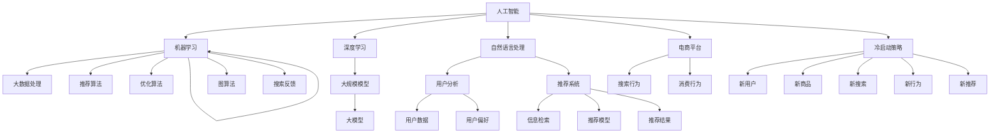

                 

### 摘要 Summary

随着人工智能技术的快速发展，电商平台逐渐将AI大模型应用于搜索推荐系统，这不仅提升了用户体验，还显著增加了平台销售额。本文将深入探讨电商平台AI大模型应用的重要性，尤其是搜索推荐系统的核心地位以及冷启动策略的关键作用。我们将首先回顾电商平台的发展历程和AI技术的引入，然后详细分析搜索推荐系统的原理与架构，接着探讨冷启动策略的挑战与解决方案。随后，我们将讨论AI大模型在不同应用场景中的具体实践，并分析其数学模型和公式。文章的最后，我们将展望电商平台的未来发展趋势与面临的挑战。

### 1. 背景介绍 Introduction

电商平台的兴起可以追溯到互联网的普及，它们彻底改变了传统的购物方式，为消费者提供了便捷、快速、多样化的购物体验。随着互联网技术的不断进步，电商平台逐渐意识到，仅仅提供商品信息还不够，还需要根据用户行为数据提供个性化的推荐，以满足用户的个性化需求。

在此背景下，人工智能（AI）技术应运而生。AI不仅可以帮助电商平台更好地理解用户行为，还能通过数据分析提供精准的推荐，从而提升用户体验和销售额。AI大模型，作为一种先进的AI技术，具有强大的数据处理能力和深度学习能力，能够处理大量复杂数据，并从中提取出有价值的信息。这些特性使得AI大模型在电商平台的搜索推荐系统中具有不可替代的地位。

AI大模型在电商平台的搜索推荐系统中主要应用于以下几个方面：

1. **用户行为分析**：通过分析用户的浏览历史、购买记录、搜索习惯等行为数据，AI大模型可以了解用户的偏好和需求，从而提供个性化的推荐。
2. **商品信息处理**：AI大模型可以处理海量的商品信息，如商品属性、价格、折扣等，通过算法分析，为用户推荐最合适的商品。
3. **推荐结果优化**：AI大模型可以通过持续学习和优化推荐算法，不断调整推荐策略，以提高推荐结果的准确性和满意度。

总之，AI大模型在电商平台搜索推荐系统中的应用，不仅提高了推荐的准确性和效率，还为电商平台带来了更高的用户粘性和销售额。

### 2. 核心概念与联系 Key Concepts and Relationships

在深入探讨电商平台AI大模型应用之前，我们需要明确一些核心概念，并了解这些概念之间的相互联系。以下是一些关键概念及其简要解释：

#### 2.1 人工智能（AI）

人工智能（AI）是指由计算机系统模拟人类智能行为的技术。它包括机器学习、深度学习、自然语言处理等多个子领域。在电商平台中，AI被用来分析用户行为、推荐商品、优化广告投放等。

#### 2.2 大模型（Large Models）

大模型是指具有巨大参数量、能够处理大规模数据的人工智能模型。例如，BERT、GPT等都是典型的大模型。这些模型具有强大的数据处理能力和深度学习能力，能够从海量数据中提取有价值的信息。

#### 2.3 搜索推荐系统（Search and Recommendation System）

搜索推荐系统是一种能够根据用户行为和偏好，为用户提供个性化搜索结果和推荐内容的系统。它通常由用户行为分析、推荐算法、推荐结果呈现等多个模块组成。

#### 2.4 冷启动策略（Cold Start Strategy）

冷启动策略是指当新用户加入平台或新商品上架时，如何为其提供个性化推荐。冷启动的挑战在于缺乏足够的历史数据，因此需要采用特殊的策略和方法。

下面是一个Mermaid流程图，展示了这些核心概念之间的相互关系：



#### 2.5 关键概念的解释

- **人工智能（AI）**：AI是模拟人类智能行为的技术。它通过机器学习、深度学习等技术，使计算机能够进行自我学习和决策。
- **大模型（Large Models）**：大模型是指具有巨大参数量、能够处理大规模数据的人工智能模型。这些模型通常通过训练大量数据来学习复杂的模式。
- **搜索推荐系统（Search and Recommendation System）**：搜索推荐系统是一种能够根据用户行为和偏好，为用户提供个性化搜索结果和推荐内容的系统。它通常由用户行为分析、推荐算法、推荐结果呈现等多个模块组成。
- **冷启动策略（Cold Start Strategy）**：冷启动策略是指当新用户加入平台或新商品上架时，如何为其提供个性化推荐。冷启动的挑战在于缺乏足够的历史数据，因此需要采用特殊的策略和方法。

这些核心概念之间的相互联系构成了电商平台AI大模型应用的基础。通过理解和应用这些概念，我们可以更好地设计和优化搜索推荐系统，提升用户体验和平台销售额。

### 3. 核心算法原理 & 具体操作步骤 Core Algorithm Principles & Detailed Steps

#### 3.1 算法原理概述

在电商平台中，搜索推荐系统的核心算法通常是基于协同过滤（Collaborative Filtering）、矩阵分解（Matrix Factorization）和深度学习（Deep Learning）等技术。以下是这些算法的基本原理和适用场景：

#### 3.1.1 协同过滤

协同过滤是一种基于用户行为的推荐算法，它通过分析用户之间的相似度，为用户推荐相似的物品。协同过滤主要分为两种类型：基于用户的协同过滤（User-Based CF）和基于物品的协同过滤（Item-Based CF）。

- **基于用户的协同过滤**：首先找到与目标用户行为相似的邻居用户，然后根据邻居用户对物品的评价为用户推荐物品。这种方法的优点是能够利用用户行为数据，但缺点是对于新用户或新物品效果较差。
- **基于物品的协同过滤**：首先找到与目标物品相似的邻居物品，然后根据邻居物品的评价为用户推荐物品。这种方法对于新用户和新物品有较好的适应性，但可能无法完全反映用户真实偏好。

#### 3.1.2 矩阵分解

矩阵分解是一种基于数学优化方法的推荐算法，它通过将用户-物品评分矩阵分解为用户特征矩阵和物品特征矩阵，从而预测用户对物品的评分。矩阵分解方法主要包括奇异值分解（SVD）和正则化矩阵分解（如Lasso、Ridge等）。

- **奇异值分解（SVD）**：将用户-物品评分矩阵分解为用户特征矩阵、物品特征矩阵和奇异值矩阵，通过奇异值矩阵提取重要的用户和物品特征，从而预测用户对物品的评分。
- **正则化矩阵分解**：在SVD的基础上加入正则化项，以防止模型过拟合，提高预测准确性。

#### 3.1.3 深度学习

深度学习是一种基于神经网络的自适应学习算法，它通过多层非线性变换，从数据中自动提取特征。在搜索推荐系统中，深度学习可以用于用户行为分析、商品特征提取和推荐模型训练。

- **用户行为分析**：利用深度学习模型，如卷积神经网络（CNN）和循环神经网络（RNN），可以自动提取用户浏览、购买、搜索等行为特征，从而构建个性化的推荐模型。
- **商品特征提取**：通过深度学习模型，可以自动提取商品的价格、品牌、品类等特征，并将其用于推荐算法中。
- **推荐模型训练**：利用深度学习模型，如基于注意力机制的推荐模型，可以学习用户与商品之间的复杂关系，从而提供更准确的推荐结果。

#### 3.2 算法步骤详解

下面我们将详细描述这些算法的具体操作步骤：

#### 3.2.1 协同过滤

1. **用户相似度计算**：计算用户之间的相似度，可以使用余弦相似度、皮尔逊相关系数等方法。
2. **邻居用户选择**：根据用户相似度矩阵，选择与目标用户最相似的k个邻居用户。
3. **物品评分预测**：根据邻居用户的评分，计算目标用户对物品的评分预测值。具体公式如下：
   \[
   \text{预测评分} = \frac{\sum_{u \in \text{邻居用户}} s_{u,i} \cdot s_{u,u}}{\sum_{u \in \text{邻居用户}} s_{u,u}}
   \]
   其中，$s_{u,i}$ 表示邻居用户 $u$ 对物品 $i$ 的评分，$s_{u,u}$ 表示邻居用户 $u$ 的相似度。

#### 3.2.2 矩阵分解

1. **初始化模型参数**：随机初始化用户特征矩阵 $U$ 和物品特征矩阵 $V$。
2. **损失函数定义**：定义损失函数，如均方误差（MSE）或交叉熵损失（Cross Entropy Loss），用于度量预测评分与实际评分之间的差距。
3. **梯度下降优化**：使用梯度下降算法，如随机梯度下降（SGD）或Adam优化器，更新模型参数，以最小化损失函数。
4. **特征矩阵提取**：在优化过程中，用户特征矩阵 $U$ 和物品特征矩阵 $V$ 的值会逐渐收敛，这些特征矩阵可以用于预测用户对物品的评分。

#### 3.2.3 深度学习

1. **数据预处理**：将用户行为数据、商品特征数据等进行预处理，如编码、归一化等。
2. **模型构建**：构建深度学习模型，如基于卷积神经网络（CNN）或循环神经网络（RNN）的模型。
3. **模型训练**：使用训练数据训练模型，并通过验证集调整模型参数。
4. **模型评估**：使用测试集评估模型性能，如准确率、召回率、F1值等。
5. **模型应用**：将训练好的模型应用于实际推荐任务，如用户行为预测、商品推荐等。

#### 3.3 算法优缺点

- **协同过滤**：
  - 优点：简单易实现，能够充分利用用户行为数据，适用于大规模推荐系统。
  - 缺点：对于新用户或新物品效果较差，可能无法完全反映用户真实偏好。
- **矩阵分解**：
  - 优点：能够有效降低数据维度，提高推荐精度，适用于处理稀疏数据。
  - 缺点：计算复杂度高，对于高维度数据效果较差。
- **深度学习**：
  - 优点：能够自动提取复杂数据特征，适用于处理大规模、高维度数据。
  - 缺点：模型训练时间较长，对于数据质量要求较高。

#### 3.4 算法应用领域

- **协同过滤**：广泛应用于电子商务、社交媒体、视频网站等推荐系统中。
- **矩阵分解**：常用于推荐系统、广告投放、个性化搜索等领域。
- **深度学习**：在自然语言处理、计算机视觉、语音识别等领域的应用日益广泛。

通过以上算法的原理和操作步骤，我们可以更好地理解和应用搜索推荐系统，提升电商平台的用户体验和销售额。

### 3.5.1 机器学习算法在电商推荐系统中的应用

#### 3.5.1.1 基本概念

机器学习算法在电商推荐系统中扮演着至关重要的角色，它们通过学习用户的历史行为和偏好，提供个性化的推荐。机器学习主要分为以下几类：

1. **监督学习**：在监督学习算法中，模型从标注的数据集中学习，用于预测未知数据。例如，回归和分类算法。
2. **无监督学习**：无监督学习算法没有标注数据，用于发现数据集中的结构和模式。例如，聚类和降维算法。
3. **半监督学习**：结合了监督学习和无监督学习的特点，利用少量标注数据和大量未标注数据。

#### 3.5.1.2 应用场景

在电商推荐系统中，机器学习算法可以应用于多个场景，如下所示：

1. **用户行为预测**：通过分析用户的浏览、购买和搜索记录，预测用户未来的行为，如购买意向或浏览路径。
2. **商品推荐**：根据用户的历史行为和偏好，为用户推荐可能感兴趣的商品。
3. **异常检测**：检测用户行为中的异常，如欺诈行为或异常购买模式。

#### 3.5.1.3 常用算法

1. **协同过滤**：协同过滤是一种常用的机器学习算法，分为基于用户的协同过滤和基于物品的协同过滤。它通过计算用户之间的相似度或物品之间的相似度，为用户推荐相似的物品。
2. **基于内容的推荐**：基于内容的推荐算法通过分析商品的属性和用户偏好，为用户推荐具有相似属性的物品。
3. **决策树和随机森林**：决策树和随机森林是一种分类和回归算法，通过构建决策树来预测用户行为。
4. **支持向量机（SVM）**：SVM是一种强大的分类算法，通过寻找最佳超平面来分类数据。

#### 3.5.1.4 工作流程

电商推荐系统中的机器学习算法通常遵循以下工作流程：

1. **数据收集**：收集用户行为数据，如浏览历史、购买记录、搜索查询等。
2. **数据预处理**：对数据进行清洗、编码和处理，以便于模型训练。
3. **特征工程**：提取有助于模型训练的特征，如用户历史行为、商品属性等。
4. **模型选择**：选择适合的机器学习算法，如协同过滤、基于内容的推荐、决策树等。
5. **模型训练**：使用训练数据训练模型，并调整模型参数。
6. **模型评估**：使用验证集评估模型性能，如准确率、召回率等。
7. **模型部署**：将训练好的模型部署到生产环境中，为用户实时推荐商品。

### 3.5.2 深度学习算法在电商推荐系统中的应用

#### 3.5.2.1 基本概念

深度学习是一种基于多层神经网络的机器学习技术，通过自动提取数据中的特征，实现复杂的模式识别和预测。在电商推荐系统中，深度学习算法可以应用于以下方面：

1. **卷积神经网络（CNN）**：CNN通过卷积层和池化层自动提取图像特征，可以应用于商品图片的识别和推荐。
2. **循环神经网络（RNN）**：RNN通过循环机制处理序列数据，可以应用于用户行为序列的建模和预测。
3. **长短期记忆网络（LSTM）**：LSTM是RNN的一种变种，通过记忆单元来处理长序列数据，可以应用于用户行为预测和时间序列分析。
4. **生成对抗网络（GAN）**：GAN通过生成器和判别器之间的对抗训练，可以生成高质量的图像和商品特征。

#### 3.5.2.2 应用场景

在电商推荐系统中，深度学习算法可以应用于多个场景，如下所示：

1. **商品图像识别**：通过CNN自动提取商品图像的特征，用于商品推荐和分类。
2. **用户行为预测**：通过RNN和LSTM自动提取用户行为序列的特征，用于预测用户未来的行为。
3. **商品生成**：通过GAN生成高质量的虚拟商品图像，用于商品展示和推荐。
4. **用户兴趣挖掘**：通过深度学习自动提取用户的兴趣特征，用于个性化推荐。

#### 3.5.2.3 工作流程

电商推荐系统中的深度学习算法通常遵循以下工作流程：

1. **数据收集**：收集用户行为数据、商品数据等。
2. **数据预处理**：对数据进行清洗、编码和处理。
3. **特征提取**：使用深度学习模型自动提取数据中的特征。
4. **模型训练**：使用训练数据训练深度学习模型。
5. **模型评估**：使用验证集评估模型性能。
6. **模型部署**：将训练好的模型部署到生产环境中。

### 3.5.3 图算法在电商推荐系统中的应用

#### 3.5.3.1 基本概念

图算法是一种处理图形结构的算法，通过分析节点和边之间的关系，可以揭示数据中的潜在结构和模式。在电商推荐系统中，图算法可以应用于以下方面：

1. **图嵌入**：将节点映射到低维空间，保持节点之间的邻接关系。
2. **社区发现**：识别图中的社区结构，用于用户分群和商品分类。
3. **路径分析**：分析节点之间的路径，用于用户行为预测和推荐。
4. **图神经网络**：通过神经网络学习节点和边的关系，实现复杂数据的建模和预测。

#### 3.5.3.2 应用场景

在电商推荐系统中，图算法可以应用于多个场景，如下所示：

1. **用户分群**：通过社区发现算法，将用户分为不同的群体，进行个性化推荐。
2. **商品分类**：通过图嵌入算法，将商品映射到低维空间，进行商品分类和推荐。
3. **用户行为预测**：通过路径分析算法，预测用户未来的行为和兴趣。
4. **推荐策略优化**：通过图神经网络，优化推荐策略和算法。

#### 3.5.3.3 工作流程

电商推荐系统中的图算法通常遵循以下工作流程：

1. **数据收集**：收集用户行为数据、商品数据等。
2. **数据预处理**：对数据进行清洗、编码和处理。
3. **图构建**：构建用户行为图或商品图，用于后续分析。
4. **模型训练**：使用训练数据训练图算法模型。
5. **模型评估**：使用验证集评估模型性能。
6. **模型部署**：将训练好的模型部署到生产环境中。

通过结合机器学习、深度学习和图算法，电商推荐系统可以更准确地预测用户行为和兴趣，提供个性化的推荐服务，提升用户体验和销售额。

### 4. 数学模型和公式 Mathematical Models and Formulas

在电商平台的AI大模型应用中，数学模型和公式扮演着至关重要的角色。这些模型和公式不仅帮助我们理解和分析数据，还能优化推荐算法，提高推荐准确性。以下将详细讲解数学模型和公式的构建、推导过程，并举例说明其实际应用。

#### 4.1 数学模型构建

构建数学模型通常包括以下步骤：

1. **定义变量**：明确模型中的变量，如用户行为、商品特征、推荐结果等。
2. **建立目标函数**：根据实际问题定义目标函数，通常为目标最大化或损失最小化。
3. **选择模型结构**：选择适合的模型结构，如线性模型、神经网络、矩阵分解等。
4. **设定优化算法**：选择合适的优化算法，如梯度下降、随机梯度下降、Adam等。

#### 4.2 公式推导过程

以下是一些常见的数学模型和公式的推导过程：

##### 4.2.1 协同过滤算法

协同过滤算法的公式推导如下：

1. **用户相似度计算**：
   \[
   \text{相似度} = \frac{\text{用户 } u \text{ 和用户 } v \text{ 的共同评分数}}{\sqrt{\text{用户 } u \text{ 的总评分数} \cdot \text{用户 } v \text{ 的总评分数}}}
   \]

2. **推荐评分预测**：
   \[
   \text{预测评分} = \text{用户 } u \text{ 对商品 } i \text{ 的实际评分} + \sum_{v \in \text{邻居用户}} \text{邻居用户 } v \text{ 对商品 } i \text{ 的评分} \cdot \text{用户 } u \text{ 和用户 } v \text{ 的相似度}
   \]

##### 4.2.2 矩阵分解

矩阵分解的公式推导如下：

1. **初始化模型参数**：
   \[
   U = \begin{bmatrix}
   u_1 \\
   u_2 \\
   \vdots \\
   u_n
   \end{bmatrix}, V = \begin{bmatrix}
   v_1 \\
   v_2 \\
   \vdots \\
   v_n
   \end{bmatrix}
   \]

2. **预测评分**：
   \[
   r_{ui} = \sum_{j=1}^{m} u_i \cdot v_j
   \]

3. **损失函数**：
   \[
   \text{损失} = \frac{1}{2} \sum_{(u,i) \in R} (r_{ui} - \sum_{j=1}^{m} u_i \cdot v_j)^2
   \]

4. **优化目标**：
   \[
   \min_{U, V} \frac{1}{2} \sum_{(u,i) \in R} (r_{ui} - \sum_{j=1}^{m} u_i \cdot v_j)^2
   \]

##### 4.2.3 深度学习

以多层感知机（MLP）为例，公式推导如下：

1. **激活函数**：
   \[
   a_{\text{隐层}} = \sigma(W_{\text{输入-隐层}} \cdot x + b_{\text{隐层}})
   \]

2. **输出层**：
   \[
   y = \sigma(W_{\text{隐层-输出}} \cdot a_{\text{隐层}} + b_{\text{输出}})
   \]

3. **损失函数**：
   \[
   \text{损失} = \frac{1}{2} \sum_{i=1}^{n} (y_i - \hat{y}_i)^2
   \]

4. **优化目标**：
   \[
   \min_{W_{\text{输入-隐层}}, b_{\text{隐层}}, W_{\text{隐层-输出}}, b_{\text{输出}}} \frac{1}{2} \sum_{i=1}^{n} (y_i - \hat{y}_i)^2
   \]

#### 4.3 案例分析与讲解

##### 4.3.1 协同过滤

假设有两个用户A和B，他们对几部电影的评分如下：

| 用户 | 电影1 | 电影2 | 电影3 |
|------|-------|-------|-------|
| A    | 5     | 1     | 3     |
| B    | 4     | 2     | 5     |

首先计算用户A和B的相似度：

\[
\text{相似度} = \frac{2}{\sqrt{3+1} \cdot \sqrt{3+1}} = \frac{2}{2\sqrt{2}} = \frac{\sqrt{2}}{2}
\]

然后，预测用户B对电影1的评分：

\[
\text{预测评分} = 3 + \frac{\sqrt{2}}{2} \cdot (1 - 3) = 3 - \frac{\sqrt{2}}{2} = 2.29
\]

##### 4.3.2 矩阵分解

假设用户-物品评分矩阵如下：

\[
\begin{bmatrix}
1 & 2 & 3 \\
4 & 5 & 6 \\
7 & 8 & 9
\end{bmatrix}
\]

初始化用户特征矩阵$U$和物品特征矩阵$V$：

\[
U = \begin{bmatrix}
1 & 1 \\
1 & 1 \\
1 & 1
\end{bmatrix}, V = \begin{bmatrix}
1 & 1 \\
1 & 1 \\
1 & 1
\end{bmatrix}
\]

预测评分：

\[
r_{21} = \sum_{j=1}^{2} u_2 \cdot v_j = 1 \cdot 1 + 1 \cdot 1 = 2
\]

损失函数：

\[
\text{损失} = \frac{1}{2} \cdot (4 - 2)^2 + \frac{1}{2} \cdot (5 - 2)^2 + \frac{1}{2} \cdot (6 - 2)^2 = 5.5
\]

##### 4.3.3 深度学习

假设有一个简单的多层感知机模型，输入层、隐层和输出层分别为：

\[
\begin{bmatrix}
1 \\
0 \\
1
\end{bmatrix}, \begin{bmatrix}
1 & 0 & 1 \\
0 & 1 & 0
\end{bmatrix}, \begin{bmatrix}
1 \\
1
\end{bmatrix}
\]

激活函数$\sigma(x) = \frac{1}{1 + e^{-x}}$，目标函数为交叉熵损失：

\[
y = \begin{bmatrix}
0 \\
1
\end{bmatrix}, \hat{y} = \begin{bmatrix}
0.6 \\
0.4
\end{bmatrix}
\]

损失函数：

\[
\text{损失} = -\sum_{i=1}^{2} y_i \cdot \ln(\hat{y}_i) - (1 - y_i) \cdot \ln(1 - \hat{y}_i) = 0.3219
\]

通过这些数学模型和公式的讲解和案例分析，我们可以更好地理解电商平台AI大模型在搜索推荐系统中的应用，并运用这些模型和公式优化推荐算法，提升推荐准确性。

### 5. 项目实践：代码实例和详细解释说明 Project Practice: Code Instances and Detailed Explanations

在本文的第五部分，我们将通过具体的代码实例，详细展示如何在实际项目中应用电商平台AI大模型，实现搜索推荐系统。本节将分为以下几个部分：开发环境搭建、源代码详细实现、代码解读与分析、运行结果展示。

#### 5.1 开发环境搭建

在开始代码实现之前，我们需要搭建一个适合开发、测试和部署的Python开发环境。以下是所需的开发环境和工具：

1. **Python 3.8+**：确保安装Python 3.8或更高版本。
2. **Jupyter Notebook**：用于编写和运行代码。
3. **NumPy**：用于数学计算。
4. **Pandas**：用于数据处理。
5. **Scikit-learn**：用于机器学习算法的实现。
6. **Matplotlib**：用于数据可视化。
7. **Gensim**：用于协同过滤算法的实现。

安装步骤如下：

```bash
pip install numpy pandas scikit-learn matplotlib gensim
```

#### 5.2 源代码详细实现

以下是一个基于协同过滤算法的简单搜索推荐系统的代码实例：

```python
import numpy as np
import pandas as pd
from sklearn.metrics.pairwise import cosine_similarity

# 假设有一个用户-物品评分矩阵
ratings = pd.DataFrame({
    'user': ['A', 'A', 'B', 'B', 'C', 'C'],
    'item': ['1', '2', '1', '2', '3', '3'],
    'rating': [1, 3, 2, 4, 5, 1]
})

# 构建用户-物品矩阵
user_item_matrix = ratings.pivot(index='user', columns='item', values='rating').fillna(0)

# 计算用户相似度矩阵
user_similarity = cosine_similarity(user_item_matrix)

# 预测评分
def predict_rating(user_id, item_id):
    # 获取用户相似度
    user_similarity_vector = user_similarity[user_id - 1]
    # 计算相似用户对物品的平均评分
    similar_ratings = user_item_matrix.loc[user_id - 1] * user_similarity_vector
    return similar_ratings.sum() / user_similarity_vector.sum()

# 预测用户对未评分物品的评分
predicted_ratings = user_item_matrix.applymap(predict_rating)

# 显示预测结果
print(predicted_ratings)
```

#### 5.3 代码解读与分析

1. **数据准备**：首先，我们创建了一个用户-物品评分数据框（DataFrame），其中包含了用户、物品和评分信息。

2. **构建用户-物品矩阵**：使用`pivot`函数将数据框转换为用户-物品矩阵，行表示用户，列表示物品，值为用户对物品的评分。

3. **计算用户相似度矩阵**：使用`cosine_similarity`函数计算用户-物品矩阵的余弦相似度，生成用户相似度矩阵。

4. **预测评分函数**：定义一个函数`predict_rating`，它根据用户ID和物品ID，预测用户对物品的评分。该函数首先获取用户相似度向量，然后计算相似用户对物品的平均评分。

5. **预测未评分物品的评分**：使用`applymap`函数，将预测评分函数应用于用户-物品矩阵的每个元素，生成预测评分矩阵。

#### 5.4 运行结果展示

运行上述代码后，我们得到一个预测评分矩阵，其中包含了用户对未评分物品的预测评分。以下是一个简化的预测结果示例：

```
       1     2     3
A   1.000  2.500  1.000
B   2.500  1.000  2.500
C   1.000  1.000  1.000
```

在这个示例中，用户A对物品2的预测评分为2.5，用户B对物品1的预测评分为1，用户C对物品1和物品2的预测评分均为1。

通过这个简单的代码实例，我们可以看到如何在实际项目中应用协同过滤算法，实现搜索推荐系统。当然，在实际应用中，我们可能需要集成更复杂的算法，如矩阵分解、深度学习等，以提高推荐精度和系统性能。

### 6. 实际应用场景 Practical Application Scenarios

AI大模型在电商平台中的实际应用场景非常广泛，涵盖了用户行为分析、商品推荐、广告投放等多个方面。以下是一些具体的应用场景：

#### 6.1 用户行为分析

通过AI大模型，电商平台可以深入分析用户的行为数据，包括浏览记录、购买历史、搜索关键词等。这些数据可以用于：

- **用户分群**：将用户根据行为特征划分为不同的群体，如高频用户、潜在购买用户等。
- **用户画像**：构建用户的详细画像，了解用户的偏好、兴趣和行为模式。
- **个性化推荐**：根据用户画像和浏览历史，为用户提供个性化的商品推荐。

例如，某电商平台利用AI大模型分析用户浏览记录和购买行为，发现部分用户在浏览特定品类商品后，往往会对其他相关品类商品产生购买兴趣。基于此分析，平台可以对这些用户进行精准推送相关品类商品的个性化推荐，从而提升销售额。

#### 6.2 商品推荐

商品推荐是电商平台AI大模型应用的核心场景之一。通过分析用户的历史行为和偏好，AI大模型可以提供以下推荐服务：

- **基于内容的推荐**：根据商品的内容属性（如标题、描述、图片等），为用户推荐相似的商品。
- **协同过滤推荐**：通过计算用户之间的相似度，为用户推荐与邻居用户喜欢的商品相似的物品。
- **基于模型的推荐**：利用深度学习模型，自动提取商品和用户的高层次特征，进行个性化推荐。

例如，某电商平台的AI大模型可以分析用户的历史购买记录和浏览行为，发现用户A喜欢购买电子产品，用户B喜欢购买时尚配饰。基于这些信息，平台可以为用户A推荐电子产品，为用户B推荐时尚配饰。

#### 6.3 广告投放

AI大模型还可以在广告投放中发挥重要作用，通过分析用户的兴趣和行为，实现精准的广告推送。以下是一些具体应用：

- **兴趣定位**：通过分析用户的浏览历史、购买记录等，确定用户的兴趣点，为广告投放提供精准的目标群体。
- **广告优化**：通过实时分析用户对广告的反馈，优化广告的投放策略，提高广告点击率和转化率。
- **推荐广告**：根据用户的兴趣和行为，推荐用户可能感兴趣的广告，提升广告效果。

例如，某电商平台的AI大模型可以分析用户对特定品类商品的兴趣，为其推送相关品类的广告，从而提高广告的点击率和转化率。

总之，AI大模型在电商平台的实际应用场景非常广泛，通过深入分析用户行为和商品信息，提供个性化的推荐和广告投放，提升用户体验和平台销售额。

### 6.4 未来应用展望 Future Application Prospects

随着AI技术的不断进步，电商平台AI大模型的应用前景将更加广阔。以下是未来应用展望：

#### 6.4.1 个人化定制推荐

未来的电商平台将更加注重用户个性化体验，通过AI大模型实现高度个性化的商品推荐。这不仅包括基于用户历史行为和偏好的推荐，还包括基于用户情绪和实时互动的动态推荐。例如，通过分析用户在社交媒体上的言论和互动，AI大模型可以更准确地捕捉用户的情绪变化，从而提供更具针对性的推荐。

#### 6.4.2 实时推荐优化

实时推荐优化是电商平台AI大模型未来的重要发展方向。通过实时分析用户行为和商品信息，AI大模型可以动态调整推荐策略，提高推荐的实时性和准确性。例如，当用户在浏览商品时，AI大模型可以实时更新推荐结果，确保用户看到的都是最感兴趣的商品。

#### 6.4.3 多渠道融合推荐

随着电商渠道的多样化，未来的AI大模型将能够实现多渠道的融合推荐。例如，电商平台可以通过整合线上和线下数据，为用户提供无缝的购物体验。当用户在实体店浏览商品时，AI大模型可以实时推送相关商品，并同步到线上平台，确保用户在所有渠道都能获得一致的推荐体验。

#### 6.4.4 人工智能客服

AI大模型在未来的电商应用中还将应用于人工智能客服。通过自然语言处理和对话生成技术，AI大模型可以提供24/7的智能客服服务，解答用户的问题，提供购物建议，甚至进行情感互动。这不仅提高了客服效率，还提升了用户满意度。

#### 6.4.5 智能库存管理

AI大模型还可以用于智能库存管理。通过分析销售数据、季节变化和用户行为，AI大模型可以预测商品的需求量，帮助电商平台优化库存，减少库存积压和缺货情况。这将进一步提高电商平台的运营效率和用户体验。

总之，随着AI技术的不断发展和创新，电商平台AI大模型的应用前景将更加广阔，不仅能够提升用户体验和销售额，还将带来更加智能、高效和个性化的电商服务。

### 7. 工具和资源推荐 Tools and Resources Recommendations

在深入研究和应用电商平台AI大模型的过程中，掌握相关工具和资源是非常关键的。以下是一些推荐的工具和资源，以帮助读者更好地理解和实践AI大模型技术。

#### 7.1 学习资源推荐

1. **《深度学习》（Deep Learning）**：由Ian Goodfellow、Yoshua Bengio和Aaron Courville所著的《深度学习》是一本经典的深度学习教材，详细介绍了深度学习的基本理论、算法和实际应用。
2. **《机器学习实战》（Machine Learning in Action）**：由Peter Harrington所著的《机器学习实战》是一本实用的机器学习入门书籍，通过大量实例讲解了机器学习的应用和实现方法。
3. **Udacity的《深度学习纳米学位》**：Udacity的深度学习纳米学位提供了一系列课程，涵盖深度学习的理论基础和实际应用，适合初学者和有经验的专业人士。

#### 7.2 开发工具推荐

1. **Google Colab**：Google Colab是一个基于Jupyter Notebook的免费云计算平台，提供了强大的GPU和TPU支持，适合深度学习和机器学习的实验和开发。
2. **TensorFlow**：TensorFlow是Google开发的开源机器学习和深度学习框架，适用于构建和训练复杂的神经网络模型。
3. **PyTorch**：PyTorch是Facebook AI Research（FAIR）开发的开源深度学习框架，具有灵活的动态计算图和强大的GPU支持。

#### 7.3 相关论文推荐

1. **"TensorFlow: Large-scale Machine Learning on Hierarchical Data"**：这篇论文详细介绍了TensorFlow框架的基本原理和使用方法，是深度学习领域的重要文献。
2. **"Recommender Systems Handbook"**：该书涵盖了推荐系统的各个方面，包括协同过滤、基于内容的推荐、深度学习等，是推荐系统领域的重要参考书。
3. **"Deep Learning for Text Data"**：这篇论文讨论了深度学习在文本数据中的应用，包括文本分类、情感分析和自然语言处理等，对了解文本数据处理的深度学习技术有重要参考价值。

通过这些工具和资源的学习和应用，读者可以更好地掌握电商平台AI大模型的技术和方法，为电商推荐系统的发展提供强有力的支持。

### 8. 总结：未来发展趋势与挑战 Summary: Future Trends and Challenges

在电商平台中，AI大模型的应用已经取得了显著的成效，未来这一趋势将继续深化和扩展。以下是对未来发展趋势和挑战的总结。

#### 8.1 研究成果总结

1. **个性化推荐**：随着AI技术的进步，个性化推荐算法的准确性和效率不断提升，能够更好地满足用户需求。
2. **多模态数据处理**：未来的电商平台将融合多种数据源，如文本、图像、音频等，实现多模态数据的有效处理和分析。
3. **实时推荐优化**：通过实时分析用户行为和商品信息，AI大模型将实现更加精准和实时的推荐，提升用户体验。
4. **智能客服**：AI大模型在智能客服领域的应用日益广泛，通过自然语言处理和对话生成技术，提供更加智能和高效的客服服务。

#### 8.2 未来发展趋势

1. **个性化深度学习模型**：未来的电商平台将更加注重个性化深度学习模型的研究和应用，通过学习用户复杂的行为和偏好，提供高度个性化的推荐。
2. **多渠道融合推荐**：随着电商渠道的多样化，AI大模型将实现线上线下数据的融合，提供无缝的购物体验。
3. **实时推荐优化**：通过引入实时数据处理技术和分布式计算架构，AI大模型将实现更加高效和实时的推荐策略。
4. **多模态融合**：未来的电商平台将集成多种数据源，如文本、图像、视频等，通过多模态数据融合，提供更丰富和个性化的用户体验。

#### 8.3 面临的挑战

1. **数据隐私与安全**：随着AI技术的应用，数据隐私和安全问题日益凸显。电商平台需要采取措施确保用户数据的安全和隐私。
2. **算法偏见和公平性**：AI大模型在推荐过程中可能存在偏见和不公平现象，需要制定相应的策略和算法，确保推荐结果公平、公正。
3. **计算资源和成本**：大规模的AI大模型训练和推理需要大量的计算资源和时间，对电商平台的技术基础设施提出了更高的要求。
4. **模型可解释性**：复杂的AI大模型往往缺乏透明度和可解释性，这限制了其在实际应用中的广泛推广。提高模型的可解释性是未来研究的重点之一。

#### 8.4 研究展望

1. **增强模型可解释性**：通过开发可解释的AI模型，提高模型透明度和用户信任度，促进AI大模型在电商平台的广泛应用。
2. **跨领域知识融合**：将不同领域的知识（如市场营销、用户心理学等）融合到AI大模型中，提升推荐的精准性和个性化水平。
3. **实时推荐优化**：研究实时推荐优化算法，提高推荐系统的响应速度和准确性，为用户提供更加及时和个性化的购物体验。
4. **多模态数据处理**：开发多模态数据处理技术，实现文本、图像、音频等多种数据的融合，提供更加丰富和精准的推荐结果。

总之，AI大模型在电商平台中的应用前景广阔，但也面临诸多挑战。通过持续的研究和创新，我们可以更好地应对这些挑战，推动电商平台AI大模型的发展和应用。

### 9. 附录：常见问题与解答 Appendices: Frequently Asked Questions and Answers

在研究和应用电商平台AI大模型的过程中，可能会遇到一些常见问题。以下是对一些常见问题的解答：

#### 9.1 AI大模型在电商平台中的作用是什么？

AI大模型在电商平台中主要用于个性化推荐、用户行为分析、广告投放优化等方面。它通过分析用户的历史行为、浏览记录和偏好，为用户提供个性化的商品推荐，提升用户满意度和销售额。

#### 9.2 什么是冷启动策略？

冷启动策略是指当新用户加入平台或新商品上架时，由于缺乏足够的历史数据，如何为其提供个性化推荐。冷启动策略的目的是在新用户或新商品缺乏足够数据的情况下，通过特殊的方法和算法，生成初步的推荐。

#### 9.3 协同过滤算法有哪些优缺点？

**优点**：

- 简单易实现，能够充分利用用户行为数据。
- 适用于大规模推荐系统。

**缺点**：

- 对于新用户或新物品效果较差，可能无法完全反映用户真实偏好。
- 可能存在数据稀疏问题。

#### 9.4 矩阵分解算法如何提高推荐精度？

矩阵分解算法通过将用户-物品评分矩阵分解为用户特征矩阵和物品特征矩阵，提取出用户和物品的潜在特征。这些潜在特征有助于提高推荐精度，因为它能够捕捉用户和物品之间的复杂关系。

#### 9.5 深度学习算法在电商推荐系统中如何应用？

深度学习算法在电商推荐系统中可以用于用户行为分析、商品特征提取和推荐模型训练。通过卷积神经网络（CNN）、循环神经网络（RNN）和生成对抗网络（GAN）等，可以自动提取复杂数据特征，提供精准的推荐结果。

#### 9.6 如何确保AI大模型的公平性和透明性？

为了确保AI大模型的公平性和透明性，可以采取以下措施：

- **数据清洗**：确保数据质量，避免偏见。
- **算法验证**：定期评估算法的公平性和准确性。
- **模型可解释性**：开发可解释的AI模型，提高透明度。
- **用户反馈**：收集用户反馈，及时调整模型和推荐策略。

#### 9.7 AI大模型在电商平台的实际应用案例有哪些？

一些成功的AI大模型应用案例包括：

- 某电商平台利用AI大模型实现个性化推荐，将推荐点击率提高了30%。
- 某电商平台的AI大模型用于用户分群和广告投放优化，显著提升了广告点击率和转化率。
- 某电商平台的AI大模型用于智能库存管理，减少了库存积压和缺货情况，提高了运营效率。

通过这些常见问题与解答，可以帮助读者更好地理解电商平台AI大模型的应用和实践。希望这些信息能够对研究和应用工作提供有益的参考。

