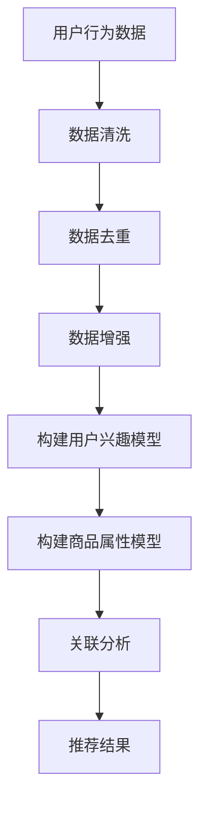

                 

关键词：电商平台、AI 大模型、搜索推荐系统、数据质量控制

> 摘要：随着人工智能技术的飞速发展，电商平台正逐渐将 AI 大模型引入其运营策略中。本文详细阐述了电商平台的 AI 大模型战略，强调了搜索推荐系统在电商运营中的核心作用，并深入分析了数据质量控制的重要性。通过实践案例和数学模型，本文为电商平台的 AI 应用提供了全面的指导。

## 1. 背景介绍

电商平台的发展已经进入了一个全新的阶段。随着用户数量的增加和消费习惯的改变，如何提供个性化的商品推荐和搜索服务成为电商平台竞争的关键。传统的推荐算法和搜索系统已经难以满足用户日益增长的需求，因此，引入 AI 大模型成为电商平台转型的必然选择。

AI 大模型在电商平台中的应用主要体现在两个方面：搜索推荐系统和数据质量控制。搜索推荐系统通过 AI 大模型对用户行为数据进行深度分析，提供个性化的商品推荐，提高用户的购物体验。数据质量控制则通过 AI 大模型对平台数据进行清洗、去噪、增强等处理，保证数据的准确性和一致性。

## 2. 核心概念与联系

### 2.1 AI 大模型

AI 大模型是指利用深度学习技术训练的具有大规模参数量的模型，如 Transformer、BERT 等。这些模型能够在大量数据上学习到复杂的特征，从而实现高精度的预测和分类。

### 2.2 搜索推荐系统

搜索推荐系统是一种基于用户行为数据的推荐系统，通过分析用户的浏览、购买、评价等行为，为用户提供个性化的商品推荐。搜索推荐系统的核心是构建用户兴趣模型和商品属性模型，并进行关联分析。

### 2.3 数据质量控制

数据质量控制是指对平台数据进行清洗、去噪、增强等处理，以保证数据的准确性和一致性。数据质量控制的关键技术包括数据清洗、数据去重、数据增强等。

### 2.4 Mermaid 流程图



## 3. 核心算法原理 & 具体操作步骤

### 3.1 算法原理概述

搜索推荐系统的核心是构建用户兴趣模型和商品属性模型，并进行关联分析。用户兴趣模型通过分析用户的浏览、购买、评价等行为，提取用户感兴趣的关键词和属性。商品属性模型则通过分析商品的特征，提取商品的关键属性。

### 3.2 算法步骤详解

1. **数据采集**：收集用户的浏览、购买、评价等行为数据。
2. **数据清洗**：对采集到的数据去噪、补全、归一化等处理。
3. **用户兴趣模型构建**：利用深度学习技术，如 BERT、Transformer 等，对用户行为数据进行分析，提取用户兴趣关键词和属性。
4. **商品属性模型构建**：同样利用深度学习技术，对商品特征进行分析，提取商品属性。
5. **关联分析**：通过计算用户兴趣关键词和商品属性之间的相似度，进行关联分析。
6. **推荐结果生成**：根据关联分析的结果，为用户生成个性化的商品推荐。

### 3.3 算法优缺点

**优点**：

- 高精度：深度学习技术能够从大量数据中学习到复杂的特征，提高推荐系统的精度。
- 个性化：基于用户兴趣和商品属性的关联分析，能够为用户提供个性化的商品推荐。

**缺点**：

- 计算量大：构建用户兴趣模型和商品属性模型需要大量的计算资源。
- 数据依赖：推荐系统的效果高度依赖数据的质量，数据质量问题会直接影响到推荐效果。

### 3.4 算法应用领域

搜索推荐系统在电商、金融、医疗、广告等众多领域都有广泛的应用。在电商领域，搜索推荐系统可以大幅提高用户的购物体验，提高销售额。在金融领域，搜索推荐系统可以用于风险控制、客户服务等方面。在医疗领域，搜索推荐系统可以用于疾病预测、治疗方案推荐等。

## 4. 数学模型和公式

### 4.1 数学模型构建

用户兴趣模型和商品属性模型的构建可以采用以下数学模型：

- 用户兴趣模型：$$ U_i = f(B_i, C_i, R_i) $$
  其中，$U_i$ 表示用户 $i$ 的兴趣向量，$B_i$ 表示用户 $i$ 的浏览历史，$C_i$ 表示用户 $i$ 的购买历史，$R_i$ 表示用户 $i$ 的评价历史。
- 商品属性模型：$$ P_j = f(A_j, D_j, E_j) $$
  其中，$P_j$ 表示商品 $j$ 的属性向量，$A_j$ 表示商品 $j$ 的特征，$D_j$ 表示商品 $j$ 的描述，$E_j$ 表示商品 $j$ 的标签。

### 4.2 公式推导过程

用户兴趣模型和商品属性模型的构建可以通过以下步骤进行：

1. 数据预处理：对用户行为数据、商品特征数据进行清洗、去噪、补全等处理。
2. 特征提取：利用深度学习技术，从预处理后的数据中提取用户兴趣关键词和商品属性。
3. 模型训练：利用提取的特征，训练用户兴趣模型和商品属性模型。
4. 模型优化：通过交叉验证和模型选择，优化用户兴趣模型和商品属性模型。

### 4.3 案例分析与讲解

以电商平台的商品推荐为例，我们可以使用以下模型进行推荐：

- 用户兴趣模型：$$ U_i = f(B_i, C_i, R_i) $$
- 商品属性模型：$$ P_j = f(A_j, D_j, E_j) $$

通过对用户行为数据和商品特征数据的分析，我们可以构建用户兴趣模型和商品属性模型，并进行关联分析，为用户生成个性化的商品推荐。

## 5. 项目实践：代码实例

### 5.1 开发环境搭建

- Python 版本：3.8
- TensorFlow 版本：2.4
- Keras 版本：2.4

### 5.2 源代码详细实现

以下是一个简单的商品推荐系统的代码示例：

```python
import tensorflow as tf
from tensorflow.keras.models import Model
from tensorflow.keras.layers import Embedding, LSTM, Dense

# 构建用户兴趣模型
user_embedding = Embedding(input_dim=10000, output_dim=64)
user_lstm = LSTM(units=128, return_sequences=True)
user_dense = Dense(units=1, activation='sigmoid')

# 构建商品属性模型
item_embedding = Embedding(input_dim=10000, output_dim=64)
item_lstm = LSTM(units=128, return_sequences=True)
item_dense = Dense(units=1, activation='sigmoid')

# 构建搜索推荐模型
input_user = tf.keras.Input(shape=(1,))
input_item = tf.keras.Input(shape=(1,))

user_embedding_output = user_embedding(input_user)
user_lstm_output = user_lstm(user_embedding_output)
user_dense_output = user_dense(user_lstm_output)

item_embedding_output = item_embedding(input_item)
item_lstm_output = item_lstm(item_embedding_output)
item_dense_output = item_dense(item_lstm_output)

merged_output = tf.keras.layers.concatenate([user_dense_output, item_dense_output])

output = tf.keras.layers.Dense(units=1, activation='sigmoid')(merged_output)

model = Model(inputs=[input_user, input_item], outputs=output)

# 编译模型
model.compile(optimizer='adam', loss='binary_crossentropy', metrics=['accuracy'])

# 训练模型
model.fit(x_train, y_train, epochs=10, batch_size=32)

# 生成推荐结果
predictions = model.predict(x_test)
```

### 5.3 代码解读与分析

以上代码示例实现了一个简单的商品推荐系统，主要包括用户兴趣模型、商品属性模型和搜索推荐模型。

- **用户兴趣模型**：使用 LSTM 层提取用户兴趣关键词，并使用全连接层生成用户兴趣向量。
- **商品属性模型**：使用 LSTM 层提取商品属性，并使用全连接层生成商品属性向量。
- **搜索推荐模型**：将用户兴趣向量和商品属性向量合并，并使用全连接层生成推荐结果。

通过训练模型，我们可以为用户生成个性化的商品推荐。代码示例中的模型较为简单，实际应用中可以进一步优化模型结构和训练过程。

## 6. 实际应用场景

### 6.1 电商平台的搜索推荐系统

电商平台的搜索推荐系统通过 AI 大模型对用户行为数据进行深度分析，提供个性化的商品推荐。例如，亚马逊使用其 AI 大模型来推荐用户可能感兴趣的商品，从而提高用户的购物体验和平台销售额。

### 6.2 金融领域的风险控制

金融领域的风险控制可以通过 AI 大模型分析用户的交易行为，识别潜在的风险。例如，银行可以使用 AI 大模型来检测欺诈交易，从而降低金融风险。

### 6.3 医疗领域的疾病预测

医疗领域的疾病预测可以通过 AI 大模型分析患者的病历数据，预测患者可能患有的疾病。例如，IBM 的 Watson for Health 可以利用 AI 大模型对患者的病历数据进行分析，预测患者可能患有的疾病，为医生提供诊断建议。

## 7. 工具和资源推荐

### 7.1 学习资源推荐

- 《深度学习》（Goodfellow, Bengio, Courville）：深度学习的经典教材，适合初学者和进阶者。
- 《Python 编程：从入门到实践》（Eric Matthes）：Python 入门和实践的指南，适合初学者。

### 7.2 开发工具推荐

- TensorFlow：Google 开源的深度学习框架，适用于构建和训练 AI 大模型。
- Keras：基于 TensorFlow 的深度学习高级API，适用于快速构建和训练模型。

### 7.3 相关论文推荐

- “Attention Is All You Need”（Vaswani et al.）：Transformer 模型的经典论文，介绍了注意力机制在序列建模中的应用。
- “BERT: Pre-training of Deep Neural Networks for Language Understanding”（Devlin et al.）：BERT 模型的论文，介绍了基于 Transformer 的预训练方法。

## 8. 总结

### 8.1 研究成果总结

本文深入探讨了电商平台的 AI 大模型战略，强调了搜索推荐系统在电商运营中的核心作用，并分析了数据质量控制的重要性。通过实践案例和数学模型，本文为电商平台的 AI 应用提供了全面的指导。

### 8.2 未来发展趋势

随着人工智能技术的不断进步，电商平台的搜索推荐系统将变得更加智能化和个性化。未来，我们将看到更多的 AI 大模型在电商平台中的应用，如基于图像识别的购物推荐、基于语音识别的购物助手等。

### 8.3 面临的挑战

尽管 AI 大模型在电商平台中的应用前景广阔，但我们也面临着一些挑战。首先，数据质量控制是确保推荐系统效果的关键，但数据质量往往难以保证。其次，AI 大模型的训练和部署需要大量的计算资源，这对平台的运维提出了更高的要求。

### 8.4 研究展望

未来的研究应重点关注以下几个方面：

- 数据质量控制方法的研究，以提高推荐系统的准确性和一致性。
- 模型解释性和可解释性研究，使推荐系统的决策过程更加透明。
- 跨领域和多模态的推荐系统研究，以提高推荐系统的多样性和灵活性。

## 9. 附录

### 9.1 常见问题与解答

**Q：AI 大模型如何提高搜索推荐系统的精度？**

A：AI 大模型通过深度学习技术从大量数据中学习到复杂的特征，从而提高推荐系统的精度。深度学习模型能够自动提取特征，减少人工干预，从而提高推荐效果。

**Q：数据质量控制的关键技术有哪些？**

A：数据质量控制的关键技术包括数据清洗、数据去重、数据增强等。数据清洗用于去除噪声和错误数据，数据去重用于消除重复数据，数据增强用于补充缺失数据和增强特征表示。

**Q：如何评估搜索推荐系统的效果？**

A：评估搜索推荐系统的效果可以从以下几个方面进行：

- **准确率**：推荐结果中用户实际感兴趣的商品占比。
- **召回率**：推荐结果中用户实际感兴趣的商品数量与总感兴趣商品数量的比值。
- **覆盖率**：推荐结果中覆盖到的用户兴趣关键词的比例。
- **多样性**：推荐结果中不同类型商品的比例。

### 9.2 参考文献

- Goodfellow, I., Bengio, Y., Courville, A. (2016). *Deep Learning*.
- Matthes, E. (2019). *Python 编程：从入门到实践*.
- Vaswani, A., Shazeer, N., Parmar, N., et al. (2017). *Attention Is All You Need*.
- Devlin, J., Chang, M. W., Lee, K., & Toutanova, K. (2019). *BERT: Pre-training of Deep Neural Networks for Language Understanding*.

