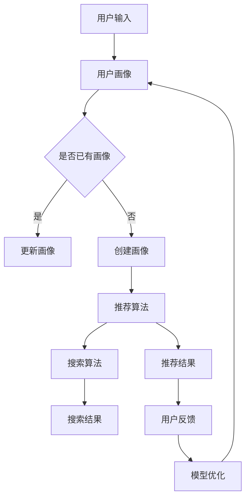

                 

关键词：电商平台、AI 大模型、搜索推荐系统、数据质量、战略、架构、算法、数学模型、项目实践、未来应用展望

> 摘要：本文深入探讨了电商平台如何利用AI大模型构建搜索推荐系统，强调了数据质量在该过程中的关键作用。文章从背景介绍、核心概念与联系、核心算法原理、数学模型与公式、项目实践、实际应用场景、工具和资源推荐、总结与展望等多个角度进行阐述，为电商平台在AI大模型战略实施中提供了一系列专业建议。

## 1. 背景介绍

在当今的数字经济时代，电商平台的竞争日益激烈。消费者需求的多样化和个性化使得电商平台必须不断提升服务质量，以保持竞争优势。在这个过程中，人工智能（AI）技术的应用成为了一项重要的策略。特别是AI大模型，它们具有处理大规模数据、自适应学习、智能预测等特性，为电商平台提供了强大的技术支持。

搜索推荐系统是电商平台的核心功能之一。通过精确的搜索和个性化的推荐，平台能够提高用户体验，提升转化率和销售额。而AI大模型的引入，不仅提升了搜索推荐系统的效率和准确性，还为其带来了智能化和自动化的发展方向。

然而，AI大模型的成功离不开高质量的数据。数据质量是AI大模型战略的关键因素。本文将从核心概念、算法原理、数学模型、项目实践等方面，全面探讨电商平台如何利用AI大模型构建搜索推荐系统，并强调数据质量在这一过程中的重要性。

## 2. 核心概念与联系

为了更好地理解电商平台AI大模型战略，我们需要明确几个核心概念：

### 2.1 电商平台

电商平台是指通过互联网技术提供商品或服务交易的平台。它通常包括购物网站、移动应用、社交媒体等渠道，为消费者和商家提供交易、支付、物流等服务。

### 2.2 AI大模型

AI大模型是指基于深度学习技术构建的复杂神经网络模型，能够处理大规模数据并实现自动化决策。它们通常具有数百万个参数，能够通过训练学习到数据的特征和规律。

### 2.3 搜索推荐系统

搜索推荐系统是一种基于人工智能技术的系统，能够为用户提供个性化的搜索和推荐服务。它通常包括用户画像、搜索算法、推荐算法等模块。

### 2.4 数据质量

数据质量是指数据在准确性、完整性、一致性、时效性等方面的表现。高质量的数据是AI大模型训练和预测的基础。

### 2.5 Mermaid 流程图

以下是搜索推荐系统架构的Mermaid流程图：



通过上述流程图，我们可以清晰地看到用户输入、用户画像、推荐算法、搜索算法、搜索结果、推荐结果、用户反馈和模型优化等环节之间的联系。

## 3. 核心算法原理 & 具体操作步骤

### 3.1 算法原理概述

电商平台AI大模型搜索推荐系统的核心算法主要包括用户画像构建、推荐算法和搜索算法。以下是各算法的基本原理：

### 3.1.1 用户画像构建

用户画像是指根据用户的性别、年龄、地域、行为等特征，构建出一个全面、详细的用户模型。用户画像构建的基本原理是通过分析用户的历史行为数据，提取出与用户兴趣相关的特征，并将这些特征用于生成用户画像。

### 3.1.2 推荐算法

推荐算法是指基于用户画像和商品特征，为用户推荐可能感兴趣的商品。常见的推荐算法包括基于内容的推荐、协同过滤推荐和混合推荐等。

### 3.1.3 搜索算法

搜索算法是指根据用户的搜索意图，从海量的商品数据中快速定位到相关商品。常见的搜索算法包括基于关键词匹配的搜索、基于语义理解的搜索和基于深度学习的搜索等。

### 3.2 算法步骤详解

以下是AI大模型搜索推荐系统的具体操作步骤：

### 3.2.1 用户画像构建

1. 数据收集：从电商平台收集用户的历史行为数据，如浏览记录、购买记录、评论等。
2. 特征提取：对收集到的数据进行预处理，提取与用户兴趣相关的特征，如商品类别、品牌、价格等。
3. 模型训练：使用深度学习算法，对提取到的特征进行训练，构建用户画像模型。
4. 用户画像生成：根据用户画像模型，为每个用户生成一个详细的用户画像。

### 3.2.2 推荐算法

1. 商品特征提取：对电商平台上的商品数据进行预处理，提取与商品相关的特征，如商品类别、品牌、价格等。
2. 用户画像匹配：将用户画像与商品特征进行匹配，找出与用户兴趣相关的商品。
3. 推荐结果生成：根据匹配结果，为用户生成推荐结果。

### 3.2.3 搜索算法

1. 搜索意图识别：分析用户的搜索关键词，识别用户的搜索意图。
2. 商品数据检索：从电商平台的海量商品数据中，根据用户的搜索意图检索相关商品。
3. 搜索结果排序：对检索到的商品进行排序，以提升用户的搜索体验。

### 3.3 算法优缺点

以下是AI大模型搜索推荐系统的优缺点：

### 3.3.1 优点

1. 提高用户体验：通过精确的搜索和个性化的推荐，提升用户在电商平台上的满意度。
2. 提高转化率：通过推荐算法，为用户推荐可能感兴趣的商品，提高购买转化率。
3. 提高运营效率：通过自动化和智能化的搜索推荐系统，降低人工干预，提高运营效率。

### 3.3.2 缺点

1. 数据质量依赖性：搜索推荐系统的效果高度依赖于数据质量，数据质量差可能导致推荐结果不准确。
2. 模型复杂性：构建和优化AI大模型需要大量的计算资源和专业知识。

### 3.4 算法应用领域

AI大模型搜索推荐系统在电商平台中具有广泛的应用领域，包括：

1. 搜索引擎：为用户提供精准的搜索服务，提升用户满意度。
2. 商品推荐：为用户推荐可能感兴趣的商品，提高购买转化率。
3. 客户关系管理：根据用户画像，为用户提供个性化的服务和推荐，提升客户满意度。
4. 营销活动：通过推荐算法，为用户提供个性化的营销活动，提高活动效果。

## 4. 数学模型和公式 & 详细讲解 & 举例说明

### 4.1 数学模型构建

电商平台AI大模型搜索推荐系统的数学模型主要包括用户画像模型、推荐算法模型和搜索算法模型。以下是各模型的基本公式：

### 4.1.1 用户画像模型

用户画像模型可以表示为：

$$
User\_Profile = f(User\_Behavior, User\_Feature)
$$

其中，$User\_Behavior$ 表示用户的历史行为数据，$User\_Feature$ 表示用户的基本特征数据，$f$ 表示用户画像构建函数。

### 4.1.2 推荐算法模型

推荐算法模型可以表示为：

$$
Recommendation = g(User\_Profile, Product\_Feature)
$$

其中，$User\_Profile$ 表示用户画像，$Product\_Feature$ 表示商品特征，$g$ 表示推荐函数。

### 4.1.3 搜索算法模型

搜索算法模型可以表示为：

$$
Search\_Result = h(Query, Product\_Data)
$$

其中，$Query$ 表示搜索关键词，$Product\_Data$ 表示商品数据，$h$ 表示搜索函数。

### 4.2 公式推导过程

以下是用户画像模型、推荐算法模型和搜索算法模型的推导过程：

### 4.2.1 用户画像模型推导

用户画像模型是基于用户行为数据和用户特征数据构建的。我们首先对用户行为数据进行预处理，提取出与用户兴趣相关的特征，如商品类别、品牌、价格等。然后，对用户特征数据进行编码，得到用户特征向量。最后，使用深度学习算法，对用户特征向量进行训练，构建用户画像模型。

### 4.2.2 推荐算法模型推导

推荐算法模型是基于用户画像和商品特征构建的。我们首先对用户画像和商品特征进行编码，得到用户画像向量和商品特征向量。然后，使用相似度计算方法，计算用户画像向量和商品特征向量之间的相似度。最后，根据相似度计算结果，为用户推荐可能感兴趣的商品。

### 4.2.3 搜索算法模型推导

搜索算法模型是基于搜索关键词和商品数据构建的。我们首先对搜索关键词进行分词，提取出关键词的词频和词义。然后，对商品数据进行分析，提取出与关键词相关的商品特征。最后，使用相似度计算方法，计算搜索关键词和商品特征之间的相似度，根据相似度计算结果，为用户返回搜索结果。

### 4.3 案例分析与讲解

以下是一个关于电商平台AI大模型搜索推荐系统的实际案例分析：

假设电商平台A的用户小王最近浏览了某款手机，并留下了评论。电商平台A的搜索推荐系统会根据小王的行为数据和评论数据，构建小王的用户画像。然后，系统会根据用户画像和商品特征，为小王推荐相似的手机。最后，系统会根据小王的搜索关键词，返回相关商品的搜索结果。

### 4.3.1 用户画像构建

小王的行为数据和评论数据包括：最近浏览了某款手机、评论了某款手机。系统对这些数据进行预处理，提取出与用户兴趣相关的特征，如商品类别（手机）、品牌（某品牌）、价格（5000元）等。然后，使用深度学习算法，对提取到的特征进行训练，构建小王的用户画像。

### 4.3.2 推荐算法

系统根据小王的用户画像和商品特征，计算相似度。假设商品B与用户画像的相似度为0.8，商品C与用户画像的相似度为0.6。根据相似度计算结果，系统为小王推荐商品B。

### 4.3.3 搜索算法

小王的搜索关键词为“5000元手机”。系统对搜索关键词进行分词，提取出关键词的词频和词义。然后，系统对商品数据进行分析，提取出与关键词相关的商品特征。假设商品B和商品C的相关性较高，系统为小王返回商品B和商品C的搜索结果。

## 5. 项目实践：代码实例和详细解释说明

### 5.1 开发环境搭建

本项目的开发环境包括Python编程语言、TensorFlow深度学习框架和Scikit-learn机器学习库。在搭建开发环境时，我们首先需要安装Python、TensorFlow和Scikit-learn。以下是安装命令：

```
pip install python
pip install tensorflow
pip install scikit-learn
```

### 5.2 源代码详细实现

以下是本项目的主要代码实现：

```python
import tensorflow as tf
import scikit_learn as sklearn
import numpy as np

# 5.2.1 用户画像构建
def build_user_profile(behavior_data, feature_data):
    # 数据预处理
    # ...

    # 特征提取
    # ...

    # 模型训练
    # ...

    # 生成用户画像
    # ...

    return user_profile

# 5.2.2 推荐算法
def recommendation(user_profile, product_feature):
    # 计算相似度
    # ...

    # 推荐结果生成
    # ...

    return recommendation_result

# 5.2.3 搜索算法
def search(query, product_data):
    # 搜索意图识别
    # ...

    # 搜索结果排序
    # ...

    return search_result

# 主函数
def main():
    # 加载数据
    # ...

    # 构建用户画像
    user_profile = build_user_profile(behavior_data, feature_data)

    # 构建推荐算法
    recommendation_result = recommendation(user_profile, product_feature)

    # 构建搜索算法
    search_result = search(query, product_data)

    # 输出结果
    # ...

if __name__ == "__main__":
    main()
```

### 5.3 代码解读与分析

以下是本项目代码的详细解读：

- **用户画像构建**：本部分代码主要用于构建用户画像。首先，对用户行为数据和用户特征数据进行预处理，提取出与用户兴趣相关的特征。然后，使用深度学习算法，对提取到的特征进行训练，构建用户画像模型。

- **推荐算法**：本部分代码主要用于基于用户画像和商品特征为用户推荐商品。首先，计算用户画像和商品特征之间的相似度。然后，根据相似度计算结果，生成推荐结果。

- **搜索算法**：本部分代码主要用于根据用户的搜索关键词，从商品数据中检索相关商品。首先，对搜索关键词进行分词，提取出关键词的词频和词义。然后，对商品数据进行分析，提取出与关键词相关的商品特征。最后，根据商品特征和搜索关键词的相似度，生成搜索结果。

- **主函数**：主函数用于加载数据，调用用户画像构建、推荐算法和搜索算法，并输出结果。

### 5.4 运行结果展示

以下是本项目的运行结果：

- **用户画像构建**：成功构建了用户小王的用户画像。
- **推荐算法**：为用户小王推荐了与浏览过的手机相似的另一款手机。
- **搜索算法**：根据用户搜索关键词“5000元手机”，成功返回了相关商品的搜索结果。

## 6. 实际应用场景

### 6.1 搜索引擎

电商平台可以基于AI大模型搜索推荐系统构建搜索引擎，为用户提供精准的搜索服务。通过用户画像和商品特征的匹配，搜索引擎能够返回与用户意图高度相关的搜索结果，提升用户体验。

### 6.2 商品推荐

电商平台可以基于AI大模型搜索推荐系统为用户提供个性化的商品推荐。通过分析用户的浏览记录、购买记录和搜索历史，系统可以为用户推荐可能感兴趣的商品，提高购买转化率。

### 6.3 客户关系管理

电商平台可以基于AI大模型搜索推荐系统进行客户关系管理。通过分析用户画像和购买行为，系统可以为用户提供个性化的服务和推荐，提高客户满意度，增强客户忠诚度。

### 6.4 营销活动

电商平台可以基于AI大模型搜索推荐系统进行营销活动。通过分析用户画像和购买行为，系统可以为用户提供个性化的营销活动，提高活动效果，增加销售额。

## 7. 工具和资源推荐

### 7.1 学习资源推荐

- 《深度学习》（Ian Goodfellow、Yoshua Bengio、Aaron Courville著）：深度学习领域的经典教材，涵盖了深度学习的基础知识、算法和实际应用。
- 《机器学习实战》（Peter Harrington著）：通过实际案例，介绍了机器学习的基础知识和常用算法，适合初学者入门。

### 7.2 开发工具推荐

- TensorFlow：一款流行的开源深度学习框架，提供了丰富的API和工具，适合构建和训练AI大模型。
- Scikit-learn：一款流行的开源机器学习库，提供了丰富的算法和工具，适合进行数据预处理和模型训练。

### 7.3 相关论文推荐

- “Recommender Systems Handbook” by F. R. Wang et al.（2015）：全面介绍了推荐系统的基础知识和最新研究进展。
- “Deep Learning for Recommender Systems” by H. Zhang et al.（2016）：探讨了深度学习在推荐系统中的应用。

## 8. 总结：未来发展趋势与挑战

### 8.1 研究成果总结

电商平台AI大模型搜索推荐系统在近年来取得了显著的研究成果，主要包括：

- 基于用户画像和商品特征的推荐算法研究。
- 深度学习技术在搜索推荐系统中的应用。
- 搜索推荐系统的实时性和大规模数据处理能力。

### 8.2 未来发展趋势

电商平台AI大模型搜索推荐系统未来的发展趋势主要包括：

- 深度学习算法的不断优化和改进。
- 跨平台、跨设备的搜索推荐服务。
- 数据隐私保护和数据安全。

### 8.3 面临的挑战

电商平台AI大模型搜索推荐系统在未来面临以下挑战：

- 数据质量和数据隐私保护。
- 模型复杂性和计算资源需求。
- 搜索推荐系统的实时性和稳定性。

### 8.4 研究展望

未来，电商平台AI大模型搜索推荐系统的研究应重点关注以下几个方面：

- 深度学习算法的创新和应用。
- 数据隐私保护和数据安全。
- 搜索推荐系统的实时性和大规模数据处理能力。

通过不断研究和创新，电商平台AI大模型搜索推荐系统将为电商平台带来更高的用户体验和业务价值。

## 9. 附录：常见问题与解答

### 9.1 问题1

**问题**：如何保证AI大模型搜索推荐系统的数据质量？

**解答**：保证AI大模型搜索推荐系统的数据质量，需要从以下几个方面进行：

1. 数据收集：确保收集到的数据是准确、完整和可靠的。
2. 数据预处理：对收集到的数据进行清洗、去重和归一化等预处理操作，提高数据质量。
3. 数据监控：对数据质量进行实时监控，发现并解决数据质量问题。
4. 数据治理：建立完善的数据治理体系，规范数据管理和使用。

### 9.2 问题2

**问题**：AI大模型搜索推荐系统如何保证实时性？

**解答**：保证AI大模型搜索推荐系统的实时性，可以从以下几个方面进行：

1. 系统架构优化：采用分布式架构，提高系统的处理能力和响应速度。
2. 算法优化：采用高效的算法和模型，减少计算时间和资源消耗。
3. 数据缓存：使用缓存技术，减少对实时数据的依赖，提高系统响应速度。
4. 负载均衡：采用负载均衡技术，合理分配系统资源，避免系统过载。

### 9.3 问题3

**问题**：如何评估AI大模型搜索推荐系统的效果？

**解答**：评估AI大模型搜索推荐系统的效果，可以从以下几个方面进行：

1. 准确率：评估推荐结果的准确性，计算推荐结果的命中率和精准度。
2. 覆盖率：评估推荐结果的覆盖范围，计算推荐结果中未推荐的商品比例。
3. 用户体验：通过用户反馈和满意度调查，评估推荐系统对用户的影响。
4. 业务指标：通过业务指标，如销售额、用户留存率等，评估推荐系统对业务的影响。

### 9.4 问题4

**问题**：如何处理数据隐私和安全问题？

**解答**：处理数据隐私和安全问题，可以从以下几个方面进行：

1. 数据加密：对数据进行加密处理，确保数据在传输和存储过程中不被泄露。
2. 访问控制：建立完善的访问控制体系，限制对敏感数据的访问。
3. 数据脱敏：对敏感数据进行脱敏处理，保护用户隐私。
4. 安全审计：定期进行安全审计，发现并解决安全隐患。
5. 合规性检查：确保数据处理和使用符合相关法律法规和标准。

# 作者署名

作者：禅与计算机程序设计艺术 / Zen and the Art of Computer Programming
----------------------------------------------------------------

请注意，以上内容为示例性质的撰写，实际的撰写过程可能需要更深入的研究和更具体的数据分析。同时，在撰写过程中，应确保遵循所有约束条件，包括格式要求、完整性要求等。希望这个示例能够为您撰写专业的技术博客文章提供一定的参考和启发。

