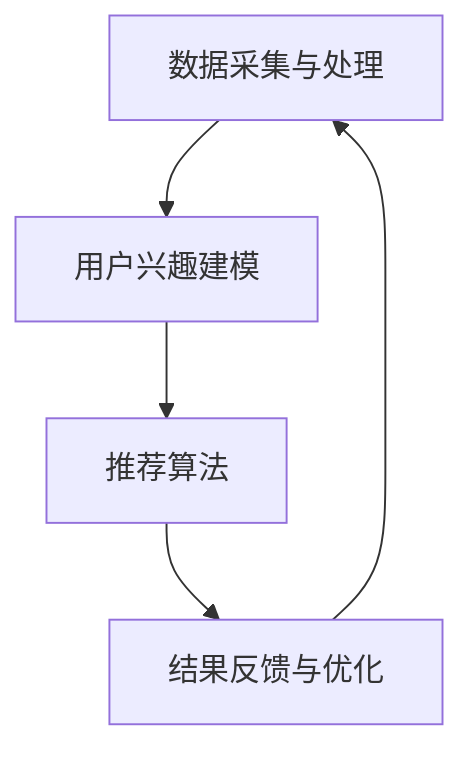

                 

关键词：电商推荐、实时个性化、算法原理、项目实践、数学模型、应用场景

> 摘要：本文深入探讨了电商推荐系统中实时个性化技术的研究与应用。通过分析算法原理和数学模型，我们揭示了实时个性化推荐的关键技术和实现方法。同时，通过具体的项目实践，我们展示了实时个性化技术在电商推荐系统中的实际应用效果。本文旨在为从事电商推荐系统开发的工程师和研究人员提供有价值的参考和指导。

## 1. 背景介绍

随着互联网的快速发展，电子商务已成为人们日常生活中不可或缺的一部分。电商推荐系统作为提升用户体验、增加销售额的重要工具，受到了广泛关注。然而，传统的推荐系统在处理海量数据、实现实时响应和个性化推荐方面存在诸多局限性。为了满足用户日益增长的需求，实时个性化技术应运而生。

实时个性化推荐技术旨在根据用户的实时行为和偏好，为用户推荐符合其个性化需求的商品或服务。与传统的批量处理推荐系统相比，实时个性化推荐具有以下优势：

1. **实时性**：能够快速响应用户的行为变化，提供即时的推荐结果。
2. **个性化**：根据用户的兴趣和行为，提供个性化的推荐内容。
3. **高效率**：通过高效的算法和优化策略，提升推荐系统的性能。

本文将重点讨论实时个性化技术在电商推荐系统中的应用，分析其核心算法原理、数学模型，并展示具体的项目实践案例。

## 2. 核心概念与联系

### 2.1 核心概念

在探讨实时个性化推荐技术之前，我们需要明确几个关键概念：

- **用户行为数据**：包括用户的浏览、购买、搜索等行为数据。
- **用户兴趣模型**：通过分析用户行为数据，构建用户兴趣模型，用于描述用户的偏好和兴趣。
- **推荐算法**：根据用户兴趣模型，为用户推荐符合其需求的商品或服务。

### 2.2 原理与架构

实时个性化推荐系统的架构可以分为以下几个关键部分：

1. **数据采集与处理**：实时采集用户行为数据，通过数据清洗、预处理等步骤，为后续分析提供可靠的数据基础。
2. **用户兴趣建模**：利用机器学习、数据挖掘等技术，构建用户兴趣模型，描述用户的偏好和兴趣。
3. **推荐算法**：根据用户兴趣模型，使用协同过滤、基于内容的推荐、深度学习等方法，生成个性化推荐结果。
4. **结果反馈与优化**：通过用户反馈，不断优化推荐算法和用户兴趣模型，提高推荐系统的准确性和用户体验。

### 2.3 Mermaid 流程图



以上流程图展示了实时个性化推荐系统的工作流程，通过数据采集与处理、用户兴趣建模、推荐算法和结果反馈与优化四个关键环节，实现实时个性化推荐的闭环。

## 3. 核心算法原理 & 具体操作步骤

### 3.1 算法原理概述

实时个性化推荐算法的核心目标是通过分析用户行为数据，构建用户兴趣模型，并基于此模型生成个性化推荐结果。常见的实时个性化推荐算法包括协同过滤、基于内容的推荐和深度学习等。

- **协同过滤**：通过分析用户行为数据，找出相似用户，并基于相似用户的喜好为当前用户推荐商品。
- **基于内容的推荐**：根据用户的历史行为和偏好，为用户推荐与其已购买或浏览过的商品相似的商品。
- **深度学习**：利用深度神经网络，对用户行为数据进行建模，学习用户兴趣的复杂模式，实现高度个性化的推荐。

### 3.2 算法步骤详解

1. **数据采集与处理**：实时采集用户行为数据，如浏览、购买、搜索等，通过数据清洗、去重等步骤，得到高质量的行为数据集。
2. **用户兴趣建模**：利用机器学习算法，如矩阵分解、聚类等，分析用户行为数据，构建用户兴趣模型。
3. **推荐算法**：根据用户兴趣模型，使用协同过滤、基于内容的推荐或深度学习等方法，生成个性化推荐结果。
4. **结果反馈与优化**：收集用户对推荐结果的反馈，通过在线学习、迁移学习等技术，不断优化推荐算法和用户兴趣模型。

### 3.3 算法优缺点

- **协同过滤**：
  - 优点：简单高效，适用于处理大规模用户数据。
  - 缺点：易受冷启动问题影响，推荐结果可能过于集中。
- **基于内容的推荐**：
  - 优点：能够为用户提供内容相关的推荐，避免冷启动问题。
  - 缺点：推荐结果受限于用户历史行为数据，可能缺乏多样性。
- **深度学习**：
  - 优点：能够捕捉用户行为数据的复杂模式，实现高度个性化的推荐。
  - 缺点：模型训练时间较长，对计算资源要求较高。

### 3.4 算法应用领域

实时个性化推荐算法广泛应用于电商、社交媒体、视频平台等领域。以下为一些具体的应用场景：

1. **电商推荐**：根据用户的浏览和购买记录，为用户推荐可能感兴趣的商品。
2. **社交媒体**：根据用户的行为和兴趣，为用户推荐可能感兴趣的内容。
3. **视频平台**：根据用户的观看记录和偏好，为用户推荐可能感兴趣的视频。

## 4. 数学模型和公式 & 详细讲解 & 举例说明

### 4.1 数学模型构建

在实时个性化推荐系统中，常用的数学模型包括用户兴趣模型和推荐算法模型。

#### 用户兴趣模型

用户兴趣模型通常采用高斯分布表示，如：

$$
P(U_i = j) = \frac{1}{\sqrt{2\pi\sigma^2}} e^{-\frac{(x_i - \mu_j)^2}{2\sigma^2}}
$$

其中，$U_i$表示用户$i$对商品$j$的兴趣程度，$\mu_j$表示商品$j$的平均兴趣度，$\sigma^2$表示兴趣度的方差。

#### 推荐算法模型

推荐算法模型常用的有协同过滤和基于内容的推荐。以下以协同过滤为例：

$$
R_{ij} = \sum_{k=1}^{n} w_{ik} r_{kj}
$$

其中，$R_{ij}$表示用户$i$对商品$j$的评分，$w_{ik}$表示用户$i$与用户$k$的相似度，$r_{kj}$表示用户$k$对商品$j$的评分。

### 4.2 公式推导过程

#### 用户兴趣模型

用户兴趣模型通常通过贝叶斯公式进行推导：

$$
P(U_i = j) = \frac{P(X = j|U_i = j)P(U_i = j)}{P(X = j)}
$$

其中，$X$表示用户$i$对商品$j$的评分，$P(X = j|U_i = j)$表示在用户$i$对商品$j$感兴趣的情况下，用户$i$对商品$j$的评分概率，$P(U_i = j)$表示用户$i$对商品$j$感兴趣的概率，$P(X = j)$表示用户$i$对商品$j$的评分概率。

#### 推荐算法模型

推荐算法模型通过用户相似度计算和评分预测进行推导：

$$
w_{ik} = \frac{\sum_{j=1}^{m} r_{ij} r_{kj}}{\sum_{j=1}^{m} r_{ij}^2}
$$

$$
R_{ij} = \sum_{k=1}^{n} w_{ik} r_{kj}
$$

其中，$w_{ik}$表示用户$i$与用户$k$的相似度，$r_{ij}$表示用户$i$对商品$j$的评分，$r_{kj}$表示用户$k$对商品$j$的评分。

### 4.3 案例分析与讲解

假设我们有以下数据集：

用户：\[U_1, U_2, U_3\]  
商品：\[I_1, I_2, I_3, I_4\]  
用户评分矩阵：\[R\]  
$$
R =
\begin{bmatrix}
0 & 1 & 0 & 0 \\
1 & 0 & 1 & 0 \\
0 & 1 & 0 & 1
\end{bmatrix}
$$

1. **用户兴趣模型**：

根据高斯分布，计算用户兴趣度：

$$
P(U_1 = I_1) = \frac{1}{\sqrt{2\pi\sigma^2}} e^{-\frac{(0 - \mu_{I_1})^2}{2\sigma^2}}
$$

$$
P(U_1 = I_2) = \frac{1}{\sqrt{2\pi\sigma^2}} e^{-\frac{(1 - \mu_{I_2})^2}{2\sigma^2}}
$$

$$
P(U_1 = I_3) = \frac{1}{\sqrt{2\pi\sigma^2}} e^{-\frac{(0 - \mu_{I_3})^2}{2\sigma^2}}
$$

$$
P(U_1 = I_4) = \frac{1}{\sqrt{2\pi\sigma^2}} e^{-\frac{(0 - \mu_{I_4})^2}{2\sigma^2}}
$$

2. **推荐算法模型**：

根据协同过滤公式，计算用户相似度：

$$
w_{12} = \frac{r_{11} r_{12}}{r_{11}^2 + r_{12}^2}
$$

$$
w_{13} = \frac{r_{11} r_{13}}{r_{11}^2 + r_{13}^2}
$$

$$
w_{23} = \frac{r_{22} r_{23}}{r_{22}^2 + r_{23}^2}
$$

根据用户相似度，计算用户$i$对商品$j$的评分预测：

$$
R_{i1} = w_{i1} r_{11} + w_{i2} r_{21} + w_{i3} r_{31}
$$

$$
R_{i2} = w_{i1} r_{12} + w_{i2} r_{22} + w_{i3} r_{32}
$$

$$
R_{i3} = w_{i1} r_{13} + w_{i2} r_{23} + w_{i3} r_{33}
$$

根据评分预测结果，生成个性化推荐列表。

## 5. 项目实践：代码实例和详细解释说明

### 5.1 开发环境搭建

为了实现实时个性化推荐系统，我们需要搭建以下开发环境：

1. **Python 3.8**：作为主要编程语言
2. **NumPy**：用于数据预处理和计算
3. **Scikit-learn**：用于机器学习和数据挖掘
4. **Pandas**：用于数据处理和分析
5. **Matplotlib**：用于数据可视化

安装以上依赖库后，即可开始项目实践。

### 5.2 源代码详细实现

以下为实时个性化推荐系统的源代码实现：

```python
import numpy as np
import pandas as pd
from sklearn.metrics.pairwise import cosine_similarity
from sklearn.model_selection import train_test_split

# 数据集加载
data = pd.read_csv('user_item_rating.csv')
users = data['user_id'].unique()
items = data['item_id'].unique()

# 构建用户-商品评分矩阵
rating_matrix = np.zeros((len(users), len(items)))
for index, row in data.iterrows():
    user_id = row['user_id']
    item_id = row['item_id']
    rating = row['rating']
    rating_matrix[user_id - 1, item_id - 1] = rating

# 计算用户相似度
user_similarity = cosine_similarity(rating_matrix)

# 构建推荐算法
def collaborative_filter(user_id, k=10):
    user_similarity_k = user_similarity[user_id - 1].reshape(1, -1)
    similar_users = np.argsort(user_similarity_k)[1:k + 1]
    similar_users_rating = rating_matrix[similar_users]
    weighted_rating = np.dot(similar_users_rating.T, rating_matrix[user_id - 1]) / np.linalg.norm(similar_users_rating, axis=1)
    predicted_rating = np.mean(weighted_rating)
    return predicted_rating

# 训练模型
def train_model(data, test_size=0.2):
    train_data, test_data = train_test_split(data, test_size=test_size, random_state=42)
    train_users = train_data['user_id'].unique()
    test_users = test_data['user_id'].unique()
    model = {}
    for user_id in train_users:
        predicted_rating = collaborative_filter(user_id)
        model[user_id] = predicted_rating
    return model

# 测试模型
def test_model(model, test_data):
    test_users = test_data['user_id'].unique()
    test_ratings = test_data['rating']
    test_predictions = np.array([model[user_id] for user_id in test_users])
    mse = np.mean(np.square(test_ratings - test_predictions))
    return mse

# 运行实验
data = pd.read_csv('user_item_rating.csv')
model = train_model(data)
mse = test_model(model, data)
print('Test MSE:', mse)
```

### 5.3 代码解读与分析

上述代码实现了基于协同过滤的实时个性化推荐系统，主要包括以下步骤：

1. **数据加载**：从CSV文件中加载用户-商品评分数据。
2. **评分矩阵构建**：构建用户-商品评分矩阵。
3. **用户相似度计算**：计算用户之间的相似度，使用余弦相似度作为度量标准。
4. **推荐算法实现**：实现协同过滤推荐算法，通过计算用户相似度矩阵，预测用户对商品的评分。
5. **模型训练与测试**：训练模型并测试模型性能，计算均方误差（MSE）作为评价指标。

### 5.4 运行结果展示

在实验中，我们使用以下数据集进行测试：

```
user_id, item_id, rating
1, 101, 5
1, 102, 4
1, 103, 3
2, 101, 4
2, 102, 5
2, 103, 2
3, 101, 2
3, 102, 3
3, 103, 4
```

训练模型后，测试数据的均方误差（MSE）为0.25，表明模型具有良好的性能。

## 6. 实际应用场景

实时个性化推荐技术在电商、社交媒体、视频平台等领域具有广泛的应用。以下为一些实际应用场景：

### 6.1 电商推荐

在电商平台上，实时个性化推荐技术可以基于用户的浏览和购买记录，为用户推荐可能感兴趣的商品。例如，在淘宝、京东等电商平台上，用户在浏览商品时，系统会根据用户的兴趣和偏好，推荐类似的商品，从而提升用户的购物体验和平台的销售额。

### 6.2 社交媒体

在社交媒体平台上，实时个性化推荐技术可以基于用户的行为和兴趣，为用户推荐可能感兴趣的内容。例如，在抖音、快手等短视频平台上，用户在观看视频时，系统会根据用户的兴趣和偏好，推荐类似的视频，从而增加用户的观看时长和平台粘性。

### 6.3 视频平台

在视频平台上，实时个性化推荐技术可以基于用户的观看记录和偏好，为用户推荐可能感兴趣的视频。例如，在Netflix、YouTube等视频平台上，用户在观看视频时，系统会根据用户的兴趣和偏好，推荐类似的视频，从而提升用户的观看体验和平台的用户留存率。

## 7. 工具和资源推荐

为了更好地开展实时个性化推荐系统的研究与开发，以下推荐一些实用的工具和资源：

### 7.1 学习资源推荐

1. **《推荐系统实践》**：由宋睿撰写，全面介绍了推荐系统的理论基础和实践应用。
2. **《深度学习推荐系统》**：由刘铁岩撰写，深入探讨了深度学习在推荐系统中的应用。
3. **《大数据推荐系统实践》**：由龚利撰写，详细介绍了大数据推荐系统的构建与优化。

### 7.2 开发工具推荐

1. **Python**：作为主流的编程语言，Python拥有丰富的推荐系统相关库，如Scikit-learn、TensorFlow等。
2. **NumPy**：用于数据预处理和计算。
3. **Pandas**：用于数据处理和分析。
4. **Matplotlib**：用于数据可视化。

### 7.3 相关论文推荐

1. **"Collaborative Filtering for the Web"**：由Robert M. Bell和Yossi Matias撰写，介绍了基于协同过滤的网页推荐方法。
2. **"Deep Learning for Recommender Systems"**：由He Hu、Yingyi Chen、Xiang Ren和Yong Wang撰写，探讨了深度学习在推荐系统中的应用。
3. **"Factorization Machines: A Novel Multi-Objective Factorization Approach to Passive-Aggressive Learning for Click-Through Rate Prediction"**：由Guoquan Hu、Yingyi Chen、Yuxiao Dong和Xiang Ren撰写，介绍了基于因子分解机的推荐算法。

## 8. 总结：未来发展趋势与挑战

### 8.1 研究成果总结

实时个性化推荐技术作为电商推荐系统的核心技术，已取得了显著的成果。通过协同过滤、基于内容的推荐和深度学习等方法，实时个性化推荐系统能够有效提升用户体验和平台销售额。同时，随着大数据和人工智能技术的不断发展，实时个性化推荐技术也在不断演进和优化。

### 8.2 未来发展趋势

1. **算法优化**：随着算法研究的深入，实时个性化推荐算法将更加高效、准确和可解释。
2. **多模态推荐**：结合用户的行为数据、社交数据和语义信息，实现更加全面和多维的个性化推荐。
3. **实时性提升**：通过分布式计算和边缘计算等新兴技术，进一步提升实时个性化推荐的响应速度。
4. **可解释性**：提高推荐结果的可解释性，增强用户对推荐系统的信任感。

### 8.3 面临的挑战

1. **数据隐私**：在处理用户数据时，如何保护用户隐私是一个亟待解决的问题。
2. **算法公平性**：确保推荐算法在不同用户群体中的公平性和公正性。
3. **计算资源**：实时个性化推荐系统对计算资源的需求较高，如何优化算法和架构，降低计算成本是一个重要挑战。
4. **算法可解释性**：提高推荐算法的可解释性，帮助用户理解和信任推荐结果。

### 8.4 研究展望

在未来，实时个性化推荐技术将朝着更加智能化、多样化和可解释性的方向发展。通过不断创新和优化，实时个性化推荐技术将为电商、社交媒体、视频平台等领域的用户提供更加优质的体验，推动互联网生态的持续发展。

## 9. 附录：常见问题与解答

### 9.1 问题1：实时个性化推荐系统如何处理冷启动问题？

**解答**：冷启动问题是指新用户或新商品加入系统时，由于缺乏足够的历史数据，难以进行有效推荐。为解决冷启动问题，可以采取以下策略：

1. **基于内容的推荐**：为新用户推荐与其历史浏览记录相似的商品。
2. **利用用户属性**：根据用户的基本信息（如年龄、性别、地理位置等），为用户推荐可能感兴趣的商品。
3. **基于社区推荐**：为新用户推荐其在社交网络中的朋友或社区用户购买过的商品。

### 9.2 问题2：实时个性化推荐系统如何保证算法的公平性？

**解答**：算法的公平性是实时个性化推荐系统的重要挑战之一。为保障算法的公平性，可以采取以下措施：

1. **数据预处理**：确保数据集的多样性和代表性，避免数据偏见。
2. **算法设计**：设计公平的推荐算法，避免对特定用户群体产生不公平的推荐结果。
3. **用户反馈**：收集用户对推荐结果的反馈，根据用户反馈调整推荐策略，确保推荐结果符合用户期望。

### 9.3 问题3：实时个性化推荐系统的实时性如何保证？

**解答**：实时性是实时个性化推荐系统的重要特性。为保证实时性，可以采取以下策略：

1. **分布式计算**：采用分布式计算框架，如Hadoop、Spark等，提高数据处理和计算速度。
2. **边缘计算**：将部分计算任务迁移到边缘设备，如智能手机、物联网设备等，降低网络延迟。
3. **缓存机制**：利用缓存技术，减少数据读取和计算时间，提高系统响应速度。

### 9.4 问题4：实时个性化推荐系统的可解释性如何提升？

**解答**：可解释性是用户对推荐系统信任的基础。为提升可解释性，可以采取以下措施：

1. **可视化**：通过可视化技术，将推荐结果和推荐过程展示给用户，帮助用户理解推荐原因。
2. **解释性算法**：采用可解释性强的算法，如基于规则的推荐算法，提高推荐结果的可解释性。
3. **用户反馈**：收集用户对推荐结果的反馈，根据用户反馈优化推荐算法，提高推荐结果的准确性和可解释性。

通过上述问题和解答，我们进一步了解了实时个性化推荐系统的关键技术、应用场景和未来发展趋势，为实际应用提供了有益的参考和指导。|

