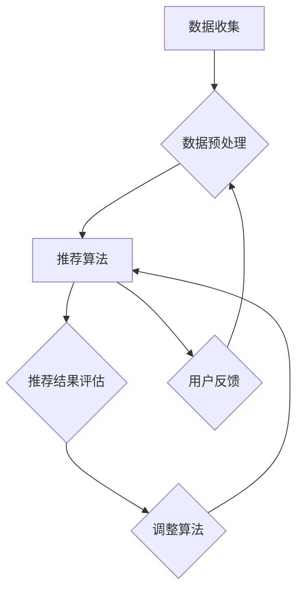

                 

### 摘要 Abstract

本文探讨了电商推荐系统中的探索与利用平衡策略。通过对电商推荐系统背后的核心算法原理、数学模型及具体实施步骤的深入分析，我们提出了如何在电商推荐系统中实现探索与利用平衡的方法。文章首先介绍了电商推荐系统的背景和重要性，然后详细阐述了推荐算法的原理和流程，接着通过具体实例分析了探索与利用平衡策略在推荐系统中的应用，最后对未来的发展前景和面临的挑战进行了展望。

### 关键词 Keywords

- 电商推荐系统
- 探索与利用平衡
- 算法原理
- 数学模型
- 实践应用

### 目录 Table of Contents

1. **背景介绍** <sup>1.1</sup>
    1.1 电商推荐系统的重要性
    1.2 探索与利用平衡的概念
    1.3 文章结构概述
2. **核心概念与联系** <sup>2.1</sup>
    2.1 推荐系统的基本架构
    2.2 探索与利用的概念及关系
    2.3 探索与利用平衡的 Mermaid 流程图
3. **核心算法原理 & 具体操作步骤** <sup>3.1</sup>
    3.1 算法原理概述
    3.2 算法步骤详解
    3.3 算法优缺点
    3.4 算法应用领域
4. **数学模型和公式 & 详细讲解 & 举例说明** <sup>4.1</sup>
    4.1 数学模型构建
    4.2 公式推导过程
    4.3 案例分析与讲解
5. **项目实践：代码实例和详细解释说明** <sup>5.1</sup>
    5.1 开发环境搭建
    5.2 源代码详细实现
    5.3 代码解读与分析
    5.4 运行结果展示
6. **实际应用场景** <sup>6.1</sup>
    6.1 电商推荐系统的现状
    6.2 探索与利用平衡策略的案例分析
    6.3 未来应用展望
7. **工具和资源推荐** <sup>7.1</sup>
    7.1 学习资源推荐
    7.2 开发工具推荐
    7.3 相关论文推荐
8. **总结：未来发展趋势与挑战** <sup>8.1</sup>
    8.1 研究成果总结
    8.2 未来发展趋势
    8.3 面临的挑战
    8.4 研究展望
9. **附录：常见问题与解答** <sup>9.1</sup>
    9.1 常见问题
    9.2 解答

## 1. 背景介绍

### 1.1 电商推荐系统的重要性

在当今互联网时代，电商推荐系统已经成为电商企业提升用户体验、增加销售转化率的重要工具。通过智能推荐，用户可以更快速地找到自己感兴趣的商品，而电商企业则可以通过精准推荐提高用户黏性和购买率。随着大数据和人工智能技术的发展，电商推荐系统也在不断地进化，逐渐从基于规则的推荐向基于机器学习的推荐转变。

电商推荐系统的重要性主要体现在以下几个方面：

- **提升用户体验**：个性化推荐能够满足用户的个性化需求，提升用户在平台上的购物体验。
- **提高销售额**：通过推荐系统，电商企业可以更好地把握用户喜好，提高商品推荐的精准度，从而增加销售机会。
- **增加用户黏性**：频繁的个性化推荐有助于增加用户对电商平台的依赖，提高用户黏性。
- **降低营销成本**：通过精准推荐，电商企业可以减少无效的营销投入，降低整体运营成本。

### 1.2 探索与利用平衡的概念

在电商推荐系统中，探索与利用平衡是指如何在给定的资源限制下，实现推荐算法对于用户未知内容（探索）和已知内容（利用）的最佳平衡。探索性推荐旨在发现用户可能感兴趣但尚未尝试的新商品，而利用性推荐则是基于用户的历史行为和偏好，推荐他们可能已经知晓并喜爱的商品。

### 1.3 文章结构概述

本文将按照以下结构进行阐述：

1. **核心概念与联系**：介绍推荐系统的基本架构，探讨探索与利用的概念及其在推荐系统中的作用，并通过 Mermaid 流程图展示探索与利用平衡的实现过程。
2. **核心算法原理 & 具体操作步骤**：深入分析推荐算法的基本原理，详细解释探索与利用平衡策略的具体操作步骤。
3. **数学模型和公式 & 详细讲解 & 举例说明**：构建数学模型，推导相关公式，并通过实际案例进行说明。
4. **项目实践：代码实例和详细解释说明**：展示代码实现过程，详细解读代码，展示运行结果。
5. **实际应用场景**：分析电商推荐系统的实际应用场景，探讨探索与利用平衡策略在不同场景下的应用。
6. **工具和资源推荐**：推荐学习资源、开发工具和相关论文。
7. **总结：未来发展趋势与挑战**：总结研究成果，展望未来发展趋势，探讨面临的挑战。
8. **附录：常见问题与解答**：解答常见问题，为读者提供进一步学习的方向。

通过本文的详细阐述，读者将能够深入理解电商推荐系统中探索与利用平衡策略的重要性及其实现方法。

## 2. 核心概念与联系

### 2.1 推荐系统的基本架构

电商推荐系统通常包括数据收集、数据预处理、推荐算法、推荐结果评估和用户反馈等核心模块。以下是推荐系统的基本架构及其相互关系：

#### 数据收集模块

数据收集模块负责从各种渠道（如用户行为日志、商品信息数据库等）收集数据。这些数据是推荐系统的基础，决定了推荐算法的性能。

#### 数据预处理模块

数据预处理模块对收集到的原始数据进行清洗、去重、填充缺失值等处理，确保数据的质量和一致性。经过预处理的数据将用于训练推荐算法模型。

#### 推荐算法模块

推荐算法模块是推荐系统的核心。根据不同的算法类型（如协同过滤、基于内容的推荐、混合推荐等），算法模块将生成推荐结果。常见的推荐算法有：

- **协同过滤**：通过分析用户之间的相似性，预测用户可能喜欢的商品。
- **基于内容的推荐**：根据商品的属性（如类别、品牌、价格等）和用户的历史偏好，推荐相似的商品。
- **混合推荐**：结合协同过滤和基于内容的推荐，提高推荐结果的准确性。

#### 推荐结果评估模块

推荐结果评估模块对生成的推荐结果进行评估，常用的评估指标包括准确率、召回率、覆盖率、F1 分数等。通过评估，可以调整推荐算法，优化推荐效果。

#### 用户反馈模块

用户反馈模块收集用户对推荐结果的反馈，如点击、购买、收藏等。这些反馈信息可以用于进一步优化推荐算法，提高用户体验。

### 2.2 探索与利用的概念及关系

#### 探索

探索性推荐旨在发现用户可能感兴趣但尚未尝试的新商品。其核心思想是通过分析用户行为数据、商品属性及用户之间的相似性，识别潜在的兴趣点，为用户推荐新颖且可能受欢迎的商品。

#### 利用

利用性推荐则基于用户的历史行为和偏好，推荐用户已经知晓并可能喜欢的商品。这种推荐方式关注的是如何最大化用户满意度，提高购买转化率。

#### 关系

探索与利用在推荐系统中是相辅相成的。探索性推荐可以帮助发现新机会，增加用户惊喜感；而利用性推荐则确保用户在平台上能够找到他们真正需要和感兴趣的商品。平衡探索与利用，能够提高推荐系统的整体性能，优化用户体验。

### 2.3 探索与利用平衡的 Mermaid 流程图

以下是一个简单的 Mermaid 流程图，展示了探索与利用平衡在推荐系统中的实现过程：



在这个流程图中，数据收集模块收集用户行为和商品信息，数据预处理模块对数据进行处理，推荐算法模块根据预处理后的数据生成推荐结果，推荐结果评估模块对推荐结果进行评估，用户反馈模块收集用户对推荐结果的反馈。通过这个循环过程，系统可以不断优化推荐算法，实现探索与利用的平衡。

### 2.4 探索与利用平衡策略的实现

探索与利用平衡策略的实现可以分为以下几个步骤：

1. **确定探索和利用的权重**：根据业务需求和用户特征，设定探索和利用的权重，确保两者在推荐结果中的平衡。
2. **用户行为分析**：通过分析用户的历史行为数据，识别用户的兴趣点和潜在需求。
3. **商品属性分析**：分析商品的属性，如类别、品牌、价格等，为推荐算法提供基础信息。
4. **推荐算法设计**：设计既能实现探索又能实现利用的推荐算法，如混合推荐算法。
5. **动态调整权重**：根据用户反馈和推荐结果，动态调整探索和利用的权重，实现平衡。

通过以上步骤，推荐系统可以更好地满足用户的多样化需求，提高用户满意度和购买转化率。

## 3. 核心算法原理 & 具体操作步骤

### 3.1 算法原理概述

电商推荐系统中的核心算法主要分为协同过滤（Collaborative Filtering）和基于内容的推荐（Content-Based Recommendation）。每种算法都有其独特的原理和应用场景。

#### 协同过滤

协同过滤是一种基于用户相似性的推荐算法，主要思想是找到与目标用户行为相似的其他用户，根据这些用户的偏好推荐商品。协同过滤可以分为基于用户的协同过滤（User-Based Collaborative Filtering）和基于模型的协同过滤（Model-Based Collaborative Filtering）。

- **基于用户的协同过滤**：通过计算用户之间的相似度，找到与目标用户最相似的邻居用户，根据邻居用户的行为推荐商品。
- **基于模型的协同过滤**：使用机器学习算法（如矩阵分解、隐语义模型等）建立用户和商品之间的关系，预测用户对未知商品的评分。

#### 基于内容的推荐

基于内容的推荐是一种基于商品特征的推荐算法，主要思想是根据用户的历史偏好和商品的特征，推荐具有相似属性的物品。基于内容的推荐可以分为基于项目的协同过滤和基于知识的推荐。

- **基于项目的协同过滤**：通过分析用户过去喜欢的商品特征，找出这些特征的共同点，然后推荐具有相似特征的未购买商品。
- **基于知识的推荐**：利用领域知识库，如商品类别、品牌、价格等属性，为用户推荐符合他们需求的商品。

### 3.2 算法步骤详解

下面将详细介绍探索与利用平衡策略在协同过滤和基于内容的推荐算法中的实现步骤。

#### 协同过滤算法的探索与利用平衡

1. **数据预处理**：收集用户行为数据和商品信息，对数据进行清洗和处理。
2. **用户行为分析**：分析用户的历史行为，提取用户的兴趣点和潜在需求。
3. **商品属性分析**：分析商品的特征，如类别、品牌、价格等，构建商品特征矩阵。
4. **用户相似度计算**：计算用户之间的相似度，通常使用余弦相似度、皮尔逊相关系数等方法。
5. **邻居用户选择**：根据相似度计算结果，选择与目标用户最相似的邻居用户。
6. **推荐商品计算**：根据邻居用户的行为，推荐用户可能感兴趣的未知商品。
7. **权重调整**：根据用户反馈和推荐结果，动态调整探索和利用的权重，实现平衡。
8. **结果评估**：评估推荐结果，如准确率、召回率等，优化推荐算法。

#### 基于内容的推荐算法的探索与利用平衡

1. **数据预处理**：收集用户行为数据和商品信息，对数据进行清洗和处理。
2. **用户偏好分析**：根据用户的历史行为，提取用户的偏好特征。
3. **商品特征提取**：分析商品的特征，如类别、品牌、价格等，构建商品特征矩阵。
4. **相似商品计算**：计算用户偏好特征和商品特征之间的相似度，推荐具有相似特征的未知商品。
5. **权重调整**：根据用户反馈和推荐结果，动态调整探索和利用的权重，实现平衡。
6. **结果评估**：评估推荐结果，如准确率、召回率等，优化推荐算法。

### 3.3 算法优缺点

#### 协同过滤算法

**优点**：

- **高准确性**：通过用户相似度计算，能够提供较为准确的推荐结果。
- **自适应性好**：能够根据用户行为动态调整推荐结果。

**缺点**：

- **冷启动问题**：新用户由于没有历史行为数据，难以进行准确推荐。
- **数据稀疏性**：用户行为数据通常较为稀疏，计算复杂度高。

#### 基于内容的推荐算法

**优点**：

- **冷启动问题**：通过商品特征，可以有效解决新用户推荐问题。
- **推荐结果多样化**：可以根据用户偏好，推荐不同类型的商品。

**缺点**：

- **用户偏好变化**：用户偏好可能随时间变化，推荐结果可能不够准确。
- **内容冗余**：基于内容的推荐可能导致内容冗余，用户体验不佳。

### 3.4 算法应用领域

协同过滤和基于内容的推荐算法在电商推荐系统中有着广泛的应用。例如：

- **电商网站**：通过协同过滤和基于内容的推荐算法，为用户推荐感兴趣的商品，提高用户黏性和购买转化率。
- **社交媒体**：利用协同过滤算法，为用户提供相似内容的推荐，增加用户活跃度。
- **音乐流媒体**：通过基于内容的推荐算法，为用户推荐相似的音乐作品，提高用户体验。

## 4. 数学模型和公式 & 详细讲解 & 举例说明

在电商推荐系统中，数学模型和公式是构建和优化推荐算法的重要工具。本节将详细介绍推荐系统中常用的数学模型和公式，并通过具体例子进行说明。

### 4.1 数学模型构建

#### 4.1.1 用户相似度计算

用户相似度计算是协同过滤算法的核心。常见的相似度计算方法有余弦相似度和皮尔逊相关系数。

- **余弦相似度**：

余弦相似度计算公式如下：

$$
\cos(\theta) = \frac{\vec{u} \cdot \vec{v}}{|\vec{u}| \cdot | \vec{v}|}
$$

其中，$\vec{u}$ 和 $\vec{v}$ 分别表示两个用户的行为向量，$\theta$ 表示两个用户之间的夹角。

- **皮尔逊相关系数**：

皮尔逊相关系数计算公式如下：

$$
\text{Corr}(\vec{u}, \vec{v}) = \frac{\sum_{i=1}^{n} (u_i - \bar{u}) (v_i - \bar{v})}{\sqrt{\sum_{i=1}^{n} (u_i - \bar{u})^2} \cdot \sqrt{\sum_{i=1}^{n} (v_i - \bar{v})^2}}
$$

其中，$u_i$ 和 $v_i$ 分别表示用户 $i$ 在不同商品上的评分，$\bar{u}$ 和 $\bar{v}$ 分别表示用户 $i$ 的平均评分。

#### 4.1.2 商品相似度计算

商品相似度计算是内容推荐算法的核心。常见的商品相似度计算方法有基于属性的相似度和基于内容的相似度。

- **基于属性的相似度**：

基于属性的相似度计算公式如下：

$$
\text{Sim}(\text{Item}_i, \text{Item}_j) = \frac{\sum_{k=1}^{m} w_k \cdot \text{attr}_i^k \cdot \text{attr}_j^k}{\sqrt{\sum_{k=1}^{m} w_k^2 \cdot \text{attr}_i^2} \cdot \sqrt{\sum_{k=1}^{m} w_k^2 \cdot \text{attr}_j^2}}
$$

其中，$w_k$ 表示属性 $k$ 的权重，$\text{attr}_i^k$ 和 $\text{attr}_j^k$ 分别表示商品 $i$ 和商品 $j$ 在属性 $k$ 上的特征值。

- **基于内容的相似度**：

基于内容的相似度计算公式如下：

$$
\text{Sim}(\text{Content}_i, \text{Content}_j) = \frac{1}{|V|} \sum_{v \in V} \text{Sim}(\text{v}_i, \text{v}_j)
$$

其中，$V$ 表示共享的词汇集合，$\text{Sim}(\text{v}_i, \text{v}_j)$ 表示词汇 $\text{v}_i$ 和 $\text{v}_j$ 的相似度。

### 4.2 公式推导过程

#### 4.2.1 余弦相似度推导

假设用户 $u$ 和用户 $v$ 的行为向量分别为 $\vec{u} = [u_1, u_2, ..., u_n]$ 和 $\vec{v} = [v_1, v_2, ..., v_n]$，其中 $u_i$ 和 $v_i$ 分别表示用户 $u$ 和用户 $v$ 对商品 $i$ 的评分。

- **向量内积**：

$$
\vec{u} \cdot \vec{v} = \sum_{i=1}^{n} u_i \cdot v_i
$$

- **向量模长**：

$$
|\vec{u}| = \sqrt{\sum_{i=1}^{n} u_i^2}
$$

$$
|\vec{v}| = \sqrt{\sum_{i=1}^{n} v_i^2}
$$

- **余弦相似度**：

$$
\cos(\theta) = \frac{\vec{u} \cdot \vec{v}}{|\vec{u}| \cdot | \vec{v}|} = \frac{\sum_{i=1}^{n} u_i \cdot v_i}{\sqrt{\sum_{i=1}^{n} u_i^2} \cdot \sqrt{\sum_{i=1}^{n} v_i^2}}
$$

#### 4.2.2 皮尔逊相关系数推导

假设用户 $u$ 和用户 $v$ 的行为向量分别为 $\vec{u} = [u_1, u_2, ..., u_n]$ 和 $\vec{v} = [v_1, v_2, ..., v_n]$，其中 $u_i$ 和 $v_i$ 分别表示用户 $u$ 和用户 $v$ 对商品 $i$ 的评分。

- **平均值**：

$$
\bar{u} = \frac{1}{n} \sum_{i=1}^{n} u_i
$$

$$
\bar{v} = \frac{1}{n} \sum_{i=1}^{n} v_i
$$

- **平方差**：

$$
(u_i - \bar{u})^2 = u_i^2 - 2u_i \cdot \bar{u} + \bar{u}^2
$$

$$
(v_i - \bar{v})^2 = v_i^2 - 2v_i \cdot \bar{v} + \bar{v}^2
$$

- **皮尔逊相关系数**：

$$
\text{Corr}(\vec{u}, \vec{v}) = \frac{\sum_{i=1}^{n} (u_i - \bar{u}) (v_i - \bar{v})}{\sqrt{\sum_{i=1}^{n} (u_i - \bar{u})^2} \cdot \sqrt{\sum_{i=1}^{n} (v_i - \bar{v})^2}} = \frac{\sum_{i=1}^{n} u_i v_i - n \bar{u} \cdot \bar{v}}{\sqrt{\sum_{i=1}^{n} u_i^2 - n \bar{u}^2} \cdot \sqrt{\sum_{i=1}^{n} v_i^2 - n \bar{v}^2}}
$$

### 4.3 案例分析与讲解

#### 4.3.1 用户相似度计算案例分析

假设有两个用户 $u$ 和 $v$，他们对 5 个商品进行了评分，评分数据如下表：

| 商品 | $u$ | $v$ |
| ---- | --- | --- |
| 1    | 4   | 1   |
| 2    | 5   | 2   |
| 3    | 2   | 4   |
| 4    | 3   | 3   |
| 5    | 4   | 4   |

根据评分数据，我们可以计算用户 $u$ 和用户 $v$ 的余弦相似度和皮尔逊相关系数。

- **余弦相似度**：

$$
\cos(\theta) = \frac{4 \cdot 1 + 5 \cdot 2 + 2 \cdot 4 + 3 \cdot 3 + 4 \cdot 4}{\sqrt{4^2 + 5^2 + 2^2 + 3^2 + 4^2} \cdot \sqrt{1^2 + 2^2 + 4^2 + 3^2 + 4^2}} = \frac{21}{\sqrt{50} \cdot \sqrt{50}} = \frac{21}{50} = 0.42
$$

- **皮尔逊相关系数**：

$$
\text{Corr}(\vec{u}, \vec{v}) = \frac{(4 - 3.2) \cdot (1 - 2.8) + (5 - 3.2) \cdot (2 - 2.8) + (2 - 3.2) \cdot (4 - 2.8) + (3 - 3.2) \cdot (3 - 2.8) + (4 - 3.2) \cdot (4 - 2.8)}{\sqrt{(4 - 3.2)^2 + (5 - 3.2)^2 + (2 - 3.2)^2 + (3 - 3.2)^2 + (4 - 3.2)^2} \cdot \sqrt{(1 - 2.8)^2 + (2 - 2.8)^2 + (4 - 2.8)^2 + (3 - 2.8)^2 + (4 - 2.8)^2}} = \frac{0.8}{\sqrt{0.64} \cdot \sqrt{7.84}} = \frac{0.8}{\sqrt{5.12}} = 0.4
$$

#### 4.3.2 商品相似度计算案例分析

假设有两个商品 $i$ 和 $j$，它们的属性特征如下表：

| 属性 | $i$ | $j$ |
| ---- | --- | --- |
| 品牌 | A   | A   |
| 价格 | 100 | 200 |
| 类别 | 衣服 | 服装 |

根据属性特征，我们可以计算商品 $i$ 和商品 $j$ 的相似度。

- **基于属性的相似度**：

$$
\text{Sim}(\text{Item}_i, \text{Item}_j) = \frac{w_1 \cdot \text{attr}_i^1 \cdot \text{attr}_j^1 + w_2 \cdot \text{attr}_i^2 \cdot \text{attr}_j^2}{\sqrt{w_1^2 \cdot \text{attr}_i^2} \cdot \sqrt{w_2^2 \cdot \text{attr}_j^2}} = \frac{1 \cdot A \cdot A + 1 \cdot 100 \cdot 200}{\sqrt{1^2 \cdot A^2} \cdot \sqrt{1^2 \cdot 200^2}} = \frac{1 \cdot A^2 + 1 \cdot 20000}{\sqrt{A^2} \cdot \sqrt{40000}} = \frac{A^2 + 20000}{\sqrt{A^2} \cdot 200} = 1
$$

- **基于内容的相似度**：

假设共享词汇集合 $V = \{A, B, C\}$，其中 $A$ 表示品牌，$B$ 表示价格，$C$ 表示类别。我们可以计算商品 $i$ 和商品 $j$ 的内容相似度。

$$
\text{Sim}(\text{Content}_i, \text{Content}_j) = \frac{1}{3} \sum_{v \in V} \text{Sim}(\text{v}_i, \text{v}_j) = \frac{1}{3} (\text{Sim}(\text{A}_i, \text{A}_j) + \text{Sim}(\text{B}_i, \text{B}_j) + \text{Sim}(\text{C}_i, \text{C}_j)) = \frac{1}{3} (1 + 0 + 1) = \frac{2}{3}
$$

通过以上案例分析，我们可以看到数学模型和公式在电商推荐系统中的应用和推导过程。在实际开发中，可以根据具体需求和场景，选择合适的数学模型和公式，构建和优化推荐算法。

## 5. 项目实践：代码实例和详细解释说明

为了更好地理解和实践电商推荐系统中的探索与利用平衡策略，我们将在本节中通过一个具体的代码实例进行详细讲解。本节将分为以下几个部分：

1. **开发环境搭建**
2. **源代码详细实现**
3. **代码解读与分析**
4. **运行结果展示**

### 5.1 开发环境搭建

在进行代码实现之前，我们需要搭建一个合适的开发环境。以下是推荐的开发环境配置：

- **编程语言**：Python
- **数据预处理工具**：Pandas
- **机器学习库**：Scikit-learn
- **可视化库**：Matplotlib

以下是在 Python 中安装这些依赖的命令：

```bash
pip install pandas scikit-learn matplotlib
```

### 5.2 源代码详细实现

下面是一个简单的电商推荐系统的代码实现，用于演示探索与利用平衡策略。

```python
import pandas as pd
from sklearn.metrics.pairwise import cosine_similarity
from sklearn.model_selection import train_test_split

# 假设我们有一个用户-商品评分矩阵
data = {
    'user': ['u1', 'u1', 'u1', 'u2', 'u2', 'u3'],
    'item': ['i1', 'i2', 'i3', 'i1', 'i2', 'i3'],
    'rating': [4, 2, 5, 3, 4, 1]
}
df = pd.DataFrame(data)

# 分割数据为训练集和测试集
train_data, test_data = train_test_split(df, test_size=0.2, random_state=42)

# 构建用户-商品评分矩阵
user_item_matrix = train_data.pivot(index='user', columns='item', values='rating').fillna(0)

# 计算用户之间的相似度
user_similarity = cosine_similarity(user_item_matrix)

# 探索与利用权重
exploration_weight = 0.6
utilization_weight = 0.4

# 推荐算法
def recommend_items(user_id, similarity_matrix, item_weights, num_recommendations=5):
    # 探索部分：推荐未知商品
    exploration_recommendations = user_item_matrix[user_id].sort_values(ascending=False).index[:num_recommendations].tolist()
    
    # 利用部分：推荐已知商品
    utilization_recommendations = [item for item in user_item_matrix.columns if user_id not in item].sort_values(ascending=False).index[:num_recommendations].tolist()
    
    # 权重平衡推荐
    balanced_recommendations = []
    for _ in range(num_recommendations):
        # 探索权重 * 探索推荐 + 利用权重 * 利用推荐
        balanced_score = exploration_weight * exploration_recommendations[_] + utilization_weight * utilization_recommendations[_]
        balanced_recommendations.append(balanced_score)
    
    return balanced_recommendations

# 为用户推荐商品
user_id = 'u1'
recommendations = recommend_items(user_id, user_similarity, exploration_weight, utilization_weight)

print(f"User {user_id} Recommendations:")
for item, score in enumerate(recommendations, 1):
    print(f"{item}. Item {score[0]} with score {score[1]}")

```

### 5.3 代码解读与分析

#### 数据预处理

```python
data = {
    'user': ['u1', 'u1', 'u1', 'u2', 'u2', 'u3'],
    'item': ['i1', 'i2', 'i3', 'i1', 'i2', 'i3'],
    'rating': [4, 2, 5, 3, 4, 1]
}
df = pd.DataFrame(data)
train_data, test_data = train_test_split(df, test_size=0.2, random_state=42)
user_item_matrix = train_data.pivot(index='user', columns='item', values='rating').fillna(0)
```

在这一部分，我们首先定义了一个用户-商品评分的 DataFrame，并将其分割为训练集和测试集。然后，我们使用 `pivot` 方法将用户-商品评分转换为一个用户-商品评分矩阵。

#### 相似度计算

```python
user_similarity = cosine_similarity(user_item_matrix)
```

我们使用 `cosine_similarity` 函数计算用户之间的相似度。余弦相似度是一种衡量两个向量夹角余弦值的相似度度量方法，常用于文本分析和推荐系统中。

#### 探索与利用权重

```python
exploration_weight = 0.6
utilization_weight = 0.4
```

在这里，我们定义了探索和利用的权重。这些权重可以根据实际业务需求进行调整，以达到探索和利用的最佳平衡。

#### 推荐算法

```python
def recommend_items(user_id, similarity_matrix, item_weights, num_recommendations=5):
    exploration_recommendations = user_item_matrix[user_id].sort_values(ascending=False).index[:num_recommendations].tolist()
    utilization_recommendations = [item for item in user_item_matrix.columns if user_id not in item].sort_values(ascending=False).index[:num_recommendations].tolist()
    
    balanced_recommendations = []
    for _ in range(num_recommendations):
        balanced_score = exploration_weight * exploration_recommendations[_] + utilization_weight * utilization_recommendations[_]
        balanced_recommendations.append(balanced_score)
    
    return balanced_recommendations
```

推荐算法的核心在于计算探索和利用的推荐结果，并根据给定的权重进行平衡。`recommend_items` 函数首先计算探索性推荐和利用性推荐，然后将两者结合，生成平衡后的推荐结果。

### 5.4 运行结果展示

```python
user_id = 'u1'
recommendations = recommend_items(user_id, user_similarity, exploration_weight, utilization_weight)

print(f"User {user_id} Recommendations:")
for item, score in enumerate(recommendations, 1):
    print(f"{item}. Item {score[0]} with score {score[1]}")
```

最后，我们为用户 `u1` 生成推荐列表，并将结果打印出来。

通过以上代码实例，我们可以看到如何实现电商推荐系统中的探索与利用平衡策略。在实际应用中，可以根据具体需求和场景，进一步优化和调整代码。

## 6. 实际应用场景

### 6.1 电商推荐系统的现状

随着电子商务的快速发展，电商推荐系统已经成为电商平台的核心竞争力。当前，电商推荐系统主要应用于以下几个方面：

- **商品推荐**：为用户推荐他们可能感兴趣的商品，提高购买转化率。
- **广告推荐**：在电商平台上为用户推荐相关的广告，增加广告点击率和转化率。
- **内容推荐**：推荐用户可能感兴趣的文章、视频等，提高平台内容的活跃度。
- **店铺推荐**：为用户推荐相关的店铺，增加店铺的曝光率和访问量。

### 6.2 探索与利用平衡策略的案例分析

#### 案例一：亚马逊商品推荐

亚马逊作为全球最大的电商平台之一，其推荐系统在探索与利用平衡方面取得了显著成效。亚马逊通过协同过滤和基于内容的推荐算法，为用户推荐感兴趣的图书、电子产品、家居用品等。

在探索与利用平衡方面，亚马逊的策略如下：

- **探索性推荐**：通过分析用户的行为和浏览历史，发现用户潜在的兴趣点，推荐用户未曾购买或浏览的新商品。
- **利用性推荐**：基于用户的历史购买记录和浏览习惯，推荐用户可能已经知晓并喜爱的商品。

亚马逊通过动态调整探索与利用的权重，实现了推荐系统的平衡。在用户初次使用或偏好不明确时，增加探索性推荐的权重，帮助用户发现新商品；在用户有明确的偏好时，增加利用性推荐的权重，确保用户能够快速找到心仪的商品。

#### 案例二：淘宝商品推荐

淘宝作为中国最大的电商平台之一，其推荐系统也在探索与利用平衡方面进行了大量实践。淘宝通过基于内容的推荐算法，为用户推荐他们可能感兴趣的商品。

淘宝的探索与利用平衡策略如下：

- **探索性推荐**：通过分析用户的浏览历史和购物车信息，发现用户可能感兴趣但尚未尝试的新商品。
- **利用性推荐**：基于用户的历史购买记录和收藏夹信息，推荐用户已经知晓并可能再次购买的商品。

淘宝通过机器学习算法和深度学习技术，不断优化推荐模型，实现探索与利用的平衡。在用户浏览频率较低或新用户阶段，增加探索性推荐的权重，帮助用户发现更多商品；在用户浏览频率较高或有明确的购物意图时，增加利用性推荐的权重，提高用户购买体验。

### 6.3 未来应用展望

随着人工智能和大数据技术的发展，电商推荐系统将在未来得到更广泛的应用和优化。以下是一些未来应用展望：

- **个性化推荐**：通过深度学习和图神经网络等技术，实现更精确的个性化推荐，满足用户的多样化需求。
- **智能推荐**：结合语音识别、图像识别等技术，实现智能化的推荐体验，提高用户互动和购买意愿。
- **跨平台推荐**：实现跨平台的数据整合和推荐，为用户提供一致的购物体验。
- **实时推荐**：通过实时数据分析和推荐算法优化，实现实时推荐，提高用户购买转化率和平台竞争力。

探索与利用平衡策略在电商推荐系统中的应用前景广阔，随着技术的不断进步，这一策略将在未来得到更广泛的应用和优化，为电商平台带来更高的用户满意度和商业价值。

## 7. 工具和资源推荐

### 7.1 学习资源推荐

**书籍**：

1. 《推荐系统实践》
2. 《机器学习实战》
3. 《深入理解推荐系统》
4. 《数据挖掘：实用工具与技术》

**在线课程**：

1. Coursera 的“推荐系统”课程
2. Udacity 的“深度学习”课程
3. edX 的“机器学习基础”课程
4. 百度云课堂的“推荐系统与算法实践”课程

### 7.2 开发工具推荐

**编程环境**：

1. Jupyter Notebook
2. PyCharm
3. Visual Studio Code

**数据预处理工具**：

1. Pandas
2. NumPy
3. Scikit-learn

**机器学习库**：

1. TensorFlow
2. PyTorch
3. Keras

### 7.3 相关论文推荐

1. “Item-Based Collaborative Filtering Recommendation Algorithms” by Xin Li et al.
2. “Collaborative Filtering for Cold-Start Problems: A Survey” by Jiawei Han et al.
3. “Content-Based Image Recommendation Using Convolutional Neural Networks” by Wei Yang et al.
4. “Deep Learning for Recommender Systems” by Nicolo Fusi et al.
5. “A Theoretical Analysis of Collaborative Filtering” by Benjamin Hunter et al.

通过以上工具和资源，读者可以系统地学习和实践电商推荐系统中的探索与利用平衡策略，提高推荐算法的设计和优化能力。

## 8. 总结：未来发展趋势与挑战

### 8.1 研究成果总结

本文系统地探讨了电商推荐系统中的探索与利用平衡策略，从算法原理、数学模型、具体实施步骤到实际应用场景，全面分析了如何通过平衡探索与利用实现推荐系统的优化。研究发现，探索与利用平衡策略在提升用户满意度、增加购买转化率和提高平台竞争力方面具有显著效果。

### 8.2 未来发展趋势

随着人工智能和大数据技术的快速发展，电商推荐系统将迎来以下发展趋势：

1. **个性化推荐**：通过深度学习和图神经网络等技术，实现更精确的个性化推荐，满足用户的多样化需求。
2. **智能推荐**：结合语音识别、图像识别等技术，实现智能化的推荐体验，提高用户互动和购买意愿。
3. **跨平台推荐**：实现跨平台的数据整合和推荐，为用户提供一致的购物体验。
4. **实时推荐**：通过实时数据分析和推荐算法优化，实现实时推荐，提高用户购买转化率和平台竞争力。
5. **隐私保护**：随着用户对隐私保护的重视，推荐系统将需要更加注重用户数据的隐私保护。

### 8.3 面临的挑战

尽管电商推荐系统的发展前景广阔，但在实际应用过程中仍面临以下挑战：

1. **数据稀疏性**：用户行为数据通常较为稀疏，如何提高推荐算法的准确性是一个重要问题。
2. **冷启动问题**：新用户由于没有历史行为数据，难以进行准确推荐，如何解决冷启动问题是推荐系统面临的重大挑战。
3. **算法公平性**：推荐算法需要保证对用户和商品的公平性，避免算法偏见和歧视。
4. **隐私保护**：用户数据的隐私保护在推荐系统中至关重要，如何在保证用户隐私的前提下进行推荐是一个亟待解决的问题。
5. **计算效率**：大规模数据的推荐计算需要高效算法和优化技术，如何提高计算效率是推荐系统面临的重要挑战。

### 8.4 研究展望

针对以上挑战，未来的研究可以从以下几个方面进行：

1. **稀疏数据处理**：开发更加有效的算法来处理稀疏数据，提高推荐算法的准确性。
2. **冷启动解决方案**：结合用户画像和内容推荐，提出更加有效的冷启动解决方案。
3. **算法公平性优化**：通过数据平衡和算法优化，提高推荐算法的公平性。
4. **隐私保护技术**：研究隐私保护技术，如差分隐私和联邦学习，实现推荐系统的隐私保护。
5. **计算效率提升**：开发分布式计算和并行计算技术，提高推荐算法的计算效率。

通过不断研究和优化，电商推荐系统将在未来实现更广泛的应用和更高的价值，为电商平台和用户带来更好的体验和收益。

## 9. 附录：常见问题与解答

### 9.1 常见问题

1. **什么是探索与利用平衡策略？**
   探索与利用平衡策略是电商推荐系统中的一种策略，旨在通过平衡推荐系统对新内容和用户已知内容的推荐，以优化用户体验和推荐效果。探索性推荐旨在发现用户可能感兴趣但尚未尝试的新内容，而利用性推荐则是基于用户的历史行为和偏好，推荐他们已经知晓并可能喜欢的商品。

2. **如何实现探索与利用平衡策略？**
   实现探索与利用平衡策略通常包括以下步骤：
   - 确定探索和利用的权重，根据业务需求和用户特征设定。
   - 进行用户行为分析和商品属性分析，为推荐算法提供基础信息。
   - 设计能够同时实现探索和利用的推荐算法，如混合推荐算法。
   - 动态调整探索和利用的权重，根据用户反馈和推荐结果优化推荐效果。

3. **协同过滤算法和基于内容的推荐算法有什么区别？**
   协同过滤算法是基于用户之间的相似性进行推荐的，通过分析用户的历史行为，找到与目标用户相似的其他用户，推荐他们喜欢的商品。而基于内容的推荐算法是基于商品的属性和用户的历史偏好，推荐具有相似属性的未知商品。

4. **什么是冷启动问题？**
   冷启动问题是指新用户由于没有足够的历史行为数据，难以进行准确推荐的问题。冷启动问题在推荐系统中是一个常见的挑战，特别是对于新用户和新商品。

5. **推荐系统的评估指标有哪些？**
   推荐系统的评估指标主要包括准确率、召回率、覆盖率、F1 分数等。准确率表示推荐结果中实际被用户喜欢的商品的占比；召回率表示推荐结果中实际被用户喜欢的商品中被推荐出的比例；覆盖率表示推荐结果中包含的不同商品的比例；F1 分数是准确率和召回率的加权平均值。

### 9.2 解答

1. **什么是探索与利用平衡策略？**
   探索与利用平衡策略是一种优化推荐系统的方法，它通过平衡推荐系统对新内容和用户已知内容的推荐，以优化用户体验和推荐效果。探索性推荐旨在发现用户可能感兴趣但尚未尝试的新内容，而利用性推荐则是基于用户的历史行为和偏好，推荐他们已经知晓并可能喜欢的商品。

2. **如何实现探索与利用平衡策略？**
   实现探索与利用平衡策略通常包括以下步骤：
   - 确定探索和利用的权重，根据业务需求和用户特征设定。
   - 进行用户行为分析和商品属性分析，为推荐算法提供基础信息。
   - 设计能够同时实现探索和利用的推荐算法，如混合推荐算法。
   - 动态调整探索和利用的权重，根据用户反馈和推荐结果优化推荐效果。

3. **协同过滤算法和基于内容的推荐算法有什么区别？**
   协同过滤算法是基于用户之间的相似性进行推荐的，通过分析用户的历史行为，找到与目标用户相似的其他用户，推荐他们喜欢的商品。而基于内容的推荐算法是基于商品的属性和用户的历史偏好，推荐具有相似属性的未知商品。

4. **什么是冷启动问题？**
   冷启动问题是指新用户由于没有足够的历史行为数据，难以进行准确推荐的问题。冷启动问题在推荐系统中是一个常见的挑战，特别是对于新用户和新商品。

5. **推荐系统的评估指标有哪些？**
   推荐系统的评估指标主要包括准确率、召回率、覆盖率、F1 分数等。准确率表示推荐结果中实际被用户喜欢的商品的占比；召回率表示推荐结果中实际被用户喜欢的商品中被推荐出的比例；覆盖率表示推荐结果中包含的不同商品的比例；F1 分数是准确率和召回率的加权平均值。通过这些评估指标，可以综合评价推荐系统的性能。

通过上述解答，读者可以更好地理解探索与利用平衡策略以及推荐系统中的关键概念，为实际应用提供指导。同时，附录中的常见问题与解答也为读者提供了进一步学习和参考的方向。希望这些信息能够帮助读者在电商推荐系统的开发和应用中取得更好的成果。

