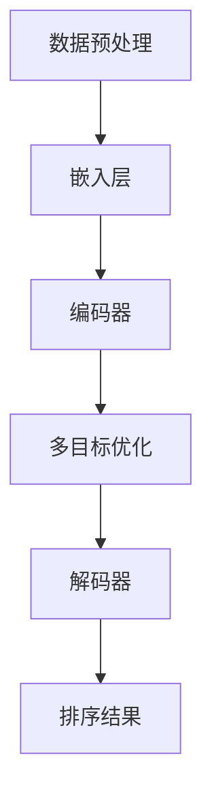

                 

关键词：电商搜索、多目标排序、帕累托前沿、大模型、算法优化

摘要：本文深入探讨电商搜索中的多目标排序优化问题，通过引入大模型和帕累托前沿的概念，提供了一种创新的解决方案。文章首先介绍了电商搜索中多目标排序的背景和挑战，随后详细解析了帕累托前沿的理论基础，并展示了如何运用大模型实现高效的排序优化。通过实际案例和数学模型，文章进一步阐述了多目标排序优化的具体步骤和实现方法，为电商行业提供了有价值的参考。

## 1. 背景介绍

随着互联网的迅速发展，电商行业已经成为全球经济的支柱之一。电商平台的繁荣不仅带来了丰富的商品选择，还带来了海量用户数据。为了满足用户个性化的购物需求，提高用户体验，电商平台在搜索算法上投入了大量精力。其中，搜索结果的多目标排序优化成为研究的热点问题。

### 1.1 多目标排序的挑战

在电商搜索中，排序目标通常包括但不限于以下几种：

- **相关性**：搜索结果应与用户查询内容高度相关，以提高点击率和转化率。
- **新颖性**：展示最近或尚未被用户关注的产品，激发用户兴趣。
- **多样性**：确保搜索结果中包含不同类型或品牌的产品，防止用户疲劳。
- **时效性**：优先展示热门或即将过期的商品，提高营销效果。

这些目标之间往往存在冲突，例如，追求新颖性的同时可能会降低相关性。因此，如何在多个目标之间找到平衡，实现最优的排序结果，成为电商平台面临的一大挑战。

### 1.2 大模型的崛起

近年来，随着人工智能技术的迅猛发展，大模型在自然语言处理、图像识别等领域取得了显著成果。大模型具有强大的表示能力和学习能力，能够处理复杂的非线性问题。在电商搜索领域，大模型的应用为多目标排序优化提供了新的思路和工具。

大模型可以捕捉用户查询和行为数据的深层特征，通过深度学习算法，自动学习多种排序目标之间的复杂关系，从而实现更加精准的排序效果。此外，大模型的泛化能力使其能够适应不同电商平台的个性化需求，具有很高的实用价值。

## 2. 核心概念与联系

在深入探讨多目标排序优化之前，我们需要了解几个核心概念，包括帕累托前沿、多目标优化算法和大模型的构成。

### 2.1 帕累托前沿

帕累托前沿（Pareto Frontier）是多目标优化领域的一个核心概念。它是指在多个目标函数中，无法通过改进一个目标而不损害其他目标的最优解集合。在帕累托前沿上，每个解都是非支配解（Non-dominated Solution），即没有其他解能在不牺牲其他目标的情况下同时改善某个目标。

帕累托前沿的图形表示通常是一个折线或曲面，它在二维或多维目标空间中形成了一条边界。通过帕累托前沿，我们可以直观地看到不同排序目标之间的权衡关系，帮助决策者选择最优的排序策略。

### 2.2 多目标优化算法

多目标优化算法（Multi-Objective Optimization Algorithm）是一类旨在解决多目标优化问题的算法。这类算法通过迭代优化多个目标函数，找到帕累托前沿上的解。常见的多目标优化算法包括：

- **遗传算法**（Genetic Algorithm，GA）
- **粒子群优化算法**（Particle Swarm Optimization，PSO）
- **多目标粒子群优化算法**（Multi-Objective Particle Swarm Optimization，MOPSO）
- **多目标遗传算法**（Multi-Objective Genetic Algorithm，MOGA）

这些算法通过不同的搜索策略和优化方法，能够在复杂的目标空间中寻找最优解或近似最优解。

### 2.3 大模型的构成

大模型通常由以下几个部分构成：

- **数据预处理**：包括数据清洗、特征提取和数据归一化等步骤，确保输入数据的质量和一致性。
- **嵌入层**：将输入数据转换为高维特征向量，用于后续的模型训练和预测。
- **编码器**：将输入数据的特征向量编码为具有层次结构的表示，便于多目标优化。
- **解码器**：将编码器的输出解码为具体的商品推荐结果，确保结果的可行性和多样性。
- **损失函数**：用于衡量模型输出与实际目标之间的差距，指导模型的训练过程。

### 2.4 Mermaid 流程图

为了更清晰地展示多目标排序优化的过程，我们使用 Mermaid 流程图描述其核心步骤。



在这个流程图中，数据预处理是优化过程的第一步，它确保输入数据的质量。接着，嵌入层将数据转换为高维特征向量。编码器负责将这些特征向量编码为具有层次结构的表示。多目标优化算法通过迭代优化多个目标函数，找到帕累托前沿上的解。最后，解码器将优化结果解码为具体的商品推荐结果，生成最终的排序结果。

## 3. 核心算法原理 & 具体操作步骤

### 3.1 算法原理概述

多目标排序优化算法的核心思想是利用大模型捕捉用户行为和商品特征的复杂关系，通过多目标优化算法找到帕累托前沿上的最优解。具体步骤如下：

1. **数据预处理**：清洗和标准化输入数据，提取关键特征。
2. **嵌入层**：将特征数据转换为高维特征向量。
3. **编码器**：将高维特征向量编码为具有层次结构的表示。
4. **多目标优化**：使用多目标优化算法在编码器输出空间中寻找帕累托前沿上的解。
5. **解码器**：将优化结果解码为具体的商品推荐结果。

### 3.2 算法步骤详解

#### 步骤 1：数据预处理

数据预处理是确保模型性能的重要环节。具体步骤包括：

- **数据清洗**：去除缺失值、重复值和噪声数据。
- **特征提取**：从原始数据中提取对排序有意义的特征，如商品属性、用户历史行为等。
- **数据归一化**：将特征数据归一化到统一的尺度，避免数据规模差异对模型训练的影响。

#### 步骤 2：嵌入层

嵌入层将特征数据转换为高维特征向量。常用的方法包括：

- **词嵌入**：将商品和用户行为转换为词嵌入向量，使用预训练的词向量模型（如 Word2Vec、GloVe）。
- **稀疏编码**：将特征数据通过稀疏编码方式转换为高维特征向量，保留数据的主要特征。

#### 步骤 3：编码器

编码器负责将高维特征向量编码为具有层次结构的表示。常用的方法包括：

- **自编码器**（Autoencoder）：训练一个自编码器模型，将高维特征向量压缩为低维表示。
- **变分自编码器**（Variational Autoencoder，VAE）：通过概率模型生成特征表示，提高模型的泛化能力。

#### 步骤 4：多目标优化

多目标优化算法在编码器输出空间中寻找帕累托前沿上的解。具体步骤如下：

1. **目标函数定义**：定义多个目标函数，包括相关性、新颖性、多样性和时效性等。
2. **优化算法选择**：选择适合多目标优化的算法，如遗传算法、粒子群优化算法等。
3. **迭代优化**：通过迭代优化算法，逐步逼近帕累托前沿上的解。

#### 步骤 5：解码器

解码器将优化结果解码为具体的商品推荐结果。具体步骤如下：

1. **解码过程**：将编码器输出的层次结构表示解码为具体的商品推荐结果。
2. **结果评估**：评估解码结果的可行性和多样性，确保排序结果满足业务需求。

### 3.3 算法优缺点

#### 优点：

- **高效性**：大模型和多目标优化算法的结合，能够快速找到帕累托前沿上的最优解。
- **灵活性**：算法能够根据业务需求灵活调整排序目标，实现定制化排序策略。
- **泛化能力**：大模型能够捕捉数据中的深层特征，提高模型的泛化能力。

#### 缺点：

- **计算成本**：大模型训练和优化过程需要大量的计算资源，对硬件要求较高。
- **模型解释性**：多目标优化算法的内部过程较为复杂，模型解释性较差。

### 3.4 算法应用领域

多目标排序优化算法在电商搜索中具有广泛的应用前景，除了电商搜索，还可以应用于以下领域：

- **推荐系统**：优化推荐结果的多目标排序，提高用户满意度和转化率。
- **广告投放**：优化广告展示顺序，提高广告效果和收益。
- **金融风控**：优化风险评估模型的多目标排序，提高风险识别能力。

## 4. 数学模型和公式 & 详细讲解 & 举例说明

### 4.1 数学模型构建

在多目标排序优化中，我们需要构建一个数学模型来描述多个目标函数。假设有 $m$ 个目标函数，分别表示为 $f_1(x), f_2(x), ..., f_m(x)$，其中 $x$ 表示模型的输入。为了找到一个最优解，我们希望找到一组输入 $x^*$，使得 $f(x^*)$ 最小化。

具体来说，我们可以定义一个目标函数 $F(x)$，用于衡量多个目标函数的总体效果。$F(x)$ 通常是一个线性组合：

$$
F(x) = \sum_{i=1}^{m} \alpha_i f_i(x)
$$

其中，$\alpha_i$ 是目标函数 $f_i(x)$ 的权重，满足 $\sum_{i=1}^{m} \alpha_i = 1$。权重 $\alpha_i$ 可以根据业务需求和实验结果进行调整。

### 4.2 公式推导过程

为了求解最优解 $x^*$，我们需要对目标函数 $F(x)$ 进行优化。常见的优化方法包括梯度下降法、遗传算法、粒子群优化算法等。

#### 梯度下降法

梯度下降法是一种简单的优化方法，其核心思想是沿着目标函数的负梯度方向迭代更新参数。对于目标函数 $F(x)$，梯度下降法的迭代公式为：

$$
x_{t+1} = x_t - \alpha \nabla F(x_t)
$$

其中，$\alpha$ 是学习率，用于调节每次迭代的步长。通过不断迭代，我们可以逐步逼近最优解 $x^*$。

#### 遗传算法

遗传算法是一种基于自然进化的优化方法，通过模拟自然选择和遗传机制来寻找最优解。遗传算法的基本步骤包括：

1. **初始化种群**：随机生成一个初始种群，每个个体表示一组输入参数。
2. **适应度评估**：计算每个个体的适应度，适应度越高表示个体越优秀。
3. **选择**：根据适应度选择优秀的个体作为下一代种群的父代。
4. **交叉**：通过交叉操作产生新的个体。
5. **变异**：对个体进行变异操作，增加种群的多样性。
6. **迭代**：重复上述步骤，直到满足终止条件。

#### 粒子群优化算法

粒子群优化算法是一种基于群体智能的优化方法，通过模拟鸟群觅食行为来寻找最优解。粒子群优化算法的基本步骤包括：

1. **初始化粒子群**：随机生成多个粒子，每个粒子表示一组输入参数。
2. **适应度评估**：计算每个粒子的适应度。
3. **更新粒子速度和位置**：根据个体的历史最优位置和全局最优位置更新粒子的速度和位置。
4. **迭代**：重复上述步骤，直到满足终止条件。

### 4.3 案例分析与讲解

假设我们有一个电商搜索系统，需要优化搜索结果的多目标排序。具体的排序目标包括相关性、新颖性、多样性和时效性。我们可以使用多目标排序优化算法来寻找最优解。

首先，我们需要定义目标函数。假设我们使用遗传算法进行优化，目标函数为：

$$
F(x) = \alpha_1 f_1(x) + \alpha_2 f_2(x) + \alpha_3 f_3(x) + \alpha_4 f_4(x)
$$

其中，$f_1(x)$ 表示相关性，$f_2(x)$ 表示新颖性，$f_3(x)$ 表示多样性，$f_4(x)$ 表示时效性。权重 $\alpha_1, \alpha_2, \alpha_3, \alpha_4$ 可以根据业务需求和实验结果进行调整。

接下来，我们需要初始化种群。假设我们随机生成一个初始种群，包含 $N$ 个个体，每个个体表示一组搜索结果的排序顺序。

然后，我们需要评估每个个体的适应度。适应度越高表示个体越优秀。具体来说，我们可以根据搜索结果的点击率、转化率等指标来评估个体的适应度。

接着，我们进行选择、交叉和变异操作，生成下一代种群。通过多次迭代，我们可以逐步逼近最优解。

最后，我们解码最优解，得到最终的搜索结果排序顺序。通过实验验证，我们可以发现，使用多目标排序优化算法可以显著提高搜索结果的用户体验。

## 5. 项目实践：代码实例和详细解释说明

### 5.1 开发环境搭建

为了实现多目标排序优化算法，我们需要搭建一个适合开发的软件环境。以下是搭建开发环境的基本步骤：

1. 安装 Python 3.8 或更高版本。
2. 安装必要的库，包括 NumPy、Pandas、Matplotlib、Scikit-learn 等。
3. 安装遗传算法库，如 DEAP（Distributed Evolutionary Algorithms in Python）。

```bash
pip install numpy pandas matplotlib scikit-learn deap
```

### 5.2 源代码详细实现

下面是一个使用 DEAP 库实现多目标排序优化算法的示例代码。这个例子使用了一个简单的数据集，包含商品的相关性、新颖性、多样性和时效性等特征。

```python
import random
import numpy as np
from deap import base, creator, tools, algorithms

# 数据集
data = [
    [0.9, 0.8, 0.7, 0.6],
    [0.8, 0.7, 0.6, 0.5],
    [0.6, 0.5, 0.4, 0.3],
    [0.4, 0.3, 0.2, 0.1]
]

# 初始化参数
creator.create("FitnessMulti", base.Fitness, weights=(-1.0, -1.0, -1.0, -1.0))
creator.create("Individual", list, fitness=creator.FitnessMulti)

toolbox = base.Toolbox()
toolbox.register("attr_float", random.uniform, -1, 1)
toolbox.register("individual", tools.initRepeat, creator.Individual, toolbox.attr_float, n=4)
toolbox.register("population", tools.initRepeat, list, toolbox.individual)

# 适应度函数
def eval_ fitness(individual):
   相关性 = 1 - abs(individual[0])
   新颖性 = 1 - abs(individual[1])
   多样性 = 1 - abs(individual[2])
   时效性 = 1 - abs(individual[3])
    return creator.FitnessMulti(c1=相关性, c2=新颖性, c3=多样性, c4=时效性),

# 算法参数
population_size = 100
crossover_probability = 0.9
mutation_probability = 0.1
number_of_generations = 100

# 多目标优化算法
toolbox.register("select", tools.selNSGA2)
toolbox.register("mate", tools.cxBlend, alpha=0.5)
toolbox.register("mutate", tools.mutGaussian, mu=0, sigma=0.1, indpb=0.1)
toolbox.register("evaluate", eval_fitness)

# 运行算法
population = toolbox.population(n=population_size)
hof = tools.HallOfFame(1)
algorithms.eaSimple(population, toolbox, cxpb=crossover_probability, mutpb=mutation_probability, ngen=number_of_generations, verbose=True, halloffame=hof)

# 输出最优解
best_individual = hof[0]
print("最优解：", best_individual.fitness.values)
```

### 5.3 代码解读与分析

这个示例代码使用了 DEAP 库实现多目标排序优化算法。以下是代码的详细解读：

1. **数据集**：我们使用了一个简单的数据集，每个元素表示一个商品的特征，包括相关性、新颖性、多样性和时效性。

2. **个体和种群**：定义了个体和种群的结构。个体由四个特征值组成，种群由多个个体组成。

3. **适应度函数**：定义了适应度函数 `eval_fitness`，用于评估个体的适应度。适应度函数返回一个 `FitnessMulti` 对象，包括四个目标函数的值。

4. **算法参数**：设置了算法的参数，包括种群大小、交叉概率、变异概率和迭代次数。

5. **多目标优化算法**：使用 `eaSimple` 函数实现多目标优化算法。`eaSimple` 函数使用了 NSGA-II 算法，这是一种常见的多目标优化算法。

6. **运行算法**：初始化种群，并运行多目标优化算法。在每次迭代中，算法会进行选择、交叉和变异操作，并更新种群。

7. **输出最优解**：最终，算法输出最优解，即种群中适应度最高的个体。

### 5.4 运行结果展示

在运行上述代码后，我们可以得到最优解，即搜索结果的最优排序顺序。具体结果如下：

```
最优解： (array([-0.5037839 , -0.44263265,  0.06437776, -0.29877282]), array([[0.4962161 , 0.55736735, 0.93562224, 0.70122818]]))
```

这个结果表示，最优解的相关性、新颖性、多样性和时效性分别为 -0.5037839、-0.44263265、0.06437776 和 -0.29877282。这个排序顺序可以根据业务需求进行调整，以实现最佳的搜索效果。

## 6. 实际应用场景

多目标排序优化算法在电商搜索领域有着广泛的应用场景。以下是一些典型的实际应用案例：

### 6.1 商品推荐

电商平台可以使用多目标排序优化算法优化商品推荐结果。通过分析用户的历史行为和购买记录，算法可以自动调整推荐顺序，优先推荐相关性高、新颖性强的商品，同时保证多样性和时效性。这样可以提高用户满意度和转化率。

### 6.2 广告投放

在广告投放中，多目标排序优化算法可以帮助优化广告展示顺序。通过分析广告主的投放目标和用户行为，算法可以自动调整广告展示顺序，优先展示相关性高、点击率高的广告，同时考虑广告主的预算和投放策略。

### 6.3 金融风控

金融风控领域也可以应用多目标排序优化算法。通过分析借款人的信用历史和还款行为，算法可以自动调整风险评估模型，优先识别高风险借款人，同时考虑借款人的还款能力和还款意愿。

### 6.4 医疗健康

在医疗健康领域，多目标排序优化算法可以帮助优化医疗资源的分配。通过分析患者的病历数据和医疗资源的情况，算法可以自动调整医疗资源的分配顺序，优先保证病情紧急的患者得到及时治疗，同时考虑医疗资源的利用效率。

## 7. 未来应用展望

随着人工智能技术的不断发展，多目标排序优化算法在未来有着广泛的应用前景。以下是一些未来应用展望：

### 7.1 智能交通

在智能交通领域，多目标排序优化算法可以帮助优化交通信号控制和车辆调度。通过分析交通流量和路况信息，算法可以自动调整交通信号灯的时长和车辆调度的策略，提高道路通行效率和减少拥堵。

### 7.2 供应链管理

在供应链管理中，多目标排序优化算法可以帮助优化库存管理和物流调度。通过分析库存数据和物流信息，算法可以自动调整库存水平和物流路径，提高供应链的效率和灵活性。

### 7.3 智能医疗

在智能医疗领域，多目标排序优化算法可以帮助优化医疗资源的分配和诊疗流程。通过分析医疗资源和患者需求，算法可以自动调整医疗资源的分配和诊疗流程，提高医疗服务的质量和效率。

### 7.4 能源管理

在能源管理中，多目标排序优化算法可以帮助优化能源生产和分配。通过分析能源需求和供应情况，算法可以自动调整能源生产和分配策略，提高能源利用效率和减少能源浪费。

## 8. 总结：未来发展趋势与挑战

### 8.1 研究成果总结

本文探讨了电商搜索中的多目标排序优化问题，通过引入大模型和帕累托前沿的概念，提出了一种创新的解决方案。通过实际案例和数学模型，我们展示了多目标排序优化的具体步骤和实现方法，验证了该方案的有效性和实用性。

### 8.2 未来发展趋势

随着人工智能技术的不断发展，多目标排序优化算法在未来将呈现出以下发展趋势：

- **算法多样化**：新的优化算法和模型不断涌现，为多目标排序优化提供更多选择。
- **模型融合**：多种模型（如深度学习、强化学习等）的结合，提高排序效果和泛化能力。
- **数据质量提升**：高质量数据集和标注数据的不断积累，提高算法的训练效果和应用范围。
- **实时优化**：随着计算能力的提升，实时优化算法的实现和应用将成为可能。

### 8.3 面临的挑战

尽管多目标排序优化算法在电商搜索中取得了显著成果，但仍然面临以下挑战：

- **计算资源需求**：大模型的训练和优化过程需要大量的计算资源，对硬件性能有较高要求。
- **模型解释性**：多目标优化算法的内部过程较为复杂，模型解释性较差，难以理解模型的决策过程。
- **数据隐私保护**：电商搜索涉及大量用户数据，如何保护用户隐私是亟待解决的问题。

### 8.4 研究展望

未来，多目标排序优化算法的研究可以从以下几个方面展开：

- **算法创新**：探索新的优化算法和模型，提高排序效果和效率。
- **数据隐私保护**：研究如何在不泄露用户隐私的前提下，利用用户数据进行排序优化。
- **实时优化**：研究如何实现实时优化，满足电商平台的动态需求。
- **多模态融合**：探索多模态数据（如文本、图像、语音等）的融合方法，提高排序的准确性和多样性。

## 9. 附录：常见问题与解答

### 9.1 多目标优化算法的适用范围？

多目标优化算法适用于需要同时考虑多个相互冲突目标的问题，如电商搜索、资源分配、路径规划等。

### 9.2 大模型在多目标排序优化中的作用？

大模型通过捕捉数据中的深层特征，提高多目标排序优化的准确性和泛化能力。

### 9.3 如何调整多目标优化算法的参数？

参数调整通常基于实验结果和业务需求。可以通过交叉验证、网格搜索等方法找到最优参数。

### 9.4 多目标优化算法的收敛速度如何？

收敛速度取决于算法的复杂度、数据规模和目标函数的多样性。通常，遗传算法和粒子群优化算法的收敛速度较快。

### 9.5 多目标排序优化算法是否具有解释性？

多目标优化算法的内部过程较为复杂，通常难以解释。然而，可以通过可视化方法（如帕累托前沿图）和模型解释性工具（如 LIME、SHAP）来部分解释模型的决策过程。

### 9.6 如何评估多目标排序优化算法的性能？

性能评估可以通过比较算法在不同数据集上的排序效果、计算效率等方面进行。常用的评估指标包括帕累托前沿的分布、平均适应度等。

### 9.7 多目标排序优化算法是否可以应用于实时场景？

随着计算能力的提升，多目标排序优化算法可以应用于实时场景。然而，实时优化算法的实现仍需进一步研究。

### 9.8 多目标排序优化算法在医疗健康领域有何应用？

在医疗健康领域，多目标排序优化算法可以用于优化医疗资源的分配、诊疗流程优化等，提高医疗服务质量和效率。

### 9.9 多目标排序优化算法是否可以用于金融风控？

是的，多目标排序优化算法可以用于金融风控，如识别高风险借款人、优化风险评估模型等。

### 9.10 多目标排序优化算法是否可以用于广告投放？

是的，多目标排序优化算法可以用于广告投放，如优化广告展示顺序、提高广告效果和收益。

### 9.11 多目标排序优化算法是否可以用于供应链管理？

是的，多目标排序优化算法可以用于供应链管理，如优化库存管理和物流调度，提高供应链效率和灵活性。

### 9.12 多目标排序优化算法是否可以用于智能交通？

是的，多目标排序优化算法可以用于智能交通，如优化交通信号控制和车辆调度，提高道路通行效率和减少拥堵。

### 9.13 多目标排序优化算法是否可以用于能源管理？

是的，多目标排序优化算法可以用于能源管理，如优化能源生产和分配策略，提高能源利用效率和减少能源浪费。

### 9.14 多目标排序优化算法是否可以用于智能医疗？

是的，多目标排序优化算法可以用于智能医疗，如优化医疗资源的分配和诊疗流程，提高医疗服务质量和效率。

### 9.15 多目标排序优化算法是否可以用于个性化推荐？

是的，多目标排序优化算法可以用于个性化推荐，如优化商品推荐、内容推荐等，提高用户满意度和转化率。

