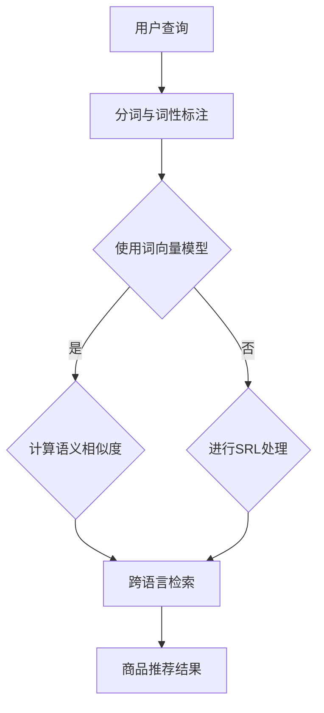

                 

关键词：电商搜索、多语言、商品语义匹配、技术、算法、应用、挑战

摘要：随着全球化电商的迅猛发展，多语言商品语义匹配技术成为提高用户购物体验的关键因素。本文将深入探讨电商搜索中的多语言商品语义匹配技术，从背景介绍、核心概念与联系、核心算法原理与操作步骤、数学模型与公式、项目实践、实际应用场景、工具和资源推荐、总结与展望等方面，全面解析这一技术的前沿动态和发展趋势。

## 1. 背景介绍

在过去的几十年中，电商行业经历了飞速的发展。从早期的在线书店到如今囊括各种商品类型的综合性电商平台，电子商务已经深入到人们的日常生活中。然而，随着全球化趋势的加深，电商平台需要面对的是越来越多非英语国家的用户，这就带来了一个重要的问题：如何实现多语言商品搜索的语义匹配？

传统的搜索引擎依赖于关键词匹配，这种方法在面对不同语言之间的语义差异时显得力不从心。比如，同一商品在英语和中文中可能有完全不同的名称，这就导致了用户在使用非母语搜索时无法找到想要的商品。为了解决这一问题，多语言商品语义匹配技术应运而生。这种技术通过理解不同语言之间的语义关系，实现跨语言的信息检索和商品推荐，从而提升用户体验。

多语言商品语义匹配技术不仅在电商领域具有重要应用价值，在跨国企业、全球社交媒体、旅游服务等多个领域也有着广泛的需求。本文将详细介绍这一技术的基本概念、算法原理、数学模型、项目实践以及未来发展趋势，帮助读者更好地理解和应用这一技术。

## 2. 核心概念与联系

### 2.1. 多语言商品语义匹配

多语言商品语义匹配是指利用自然语言处理（NLP）和机器学习技术，在不同语言之间建立商品语义的对应关系，从而实现商品搜索和推荐的跨语言一致性。其核心在于解决以下几个问题：

1. **同义词处理**：不同语言中可能存在同义词，如何识别并处理这些词汇在语义上的差异。
2. **词义消歧**：对于多义词，如何根据上下文确定其准确含义。
3. **跨语言语义映射**：如何在两种或多种语言之间建立有效的语义映射。

### 2.2. 关键技术

**1. 词向量表示**

词向量表示是将词汇映射到高维空间中的向量形式，从而利用向量的相似性来衡量词语的语义关系。常见的词向量模型包括Word2Vec、GloVe和BERT等。

**2. 语义角色标注**

语义角色标注（Semantic Role Labeling, SRL）是对句子中的词语进行语义角色的标注，例如动作词的主语、宾语等。SRL可以帮助识别句子中的关键信息，从而更好地理解句子的语义。

**3. 跨语言信息检索**

跨语言信息检索（Cross-Lingual Information Retrieval, CLIR）是通过建立不同语言之间的索引关系，实现跨语言的信息检索。常见的CLIR方法包括基于翻译的检索、基于检索的翻译和基于模型的检索等。

### 2.3. Mermaid 流程图

下面是多语言商品语义匹配技术的 Mermaid 流程图：



在这个流程图中，用户查询经过分词与词性标注后，使用词向量模型计算查询词和商品描述之间的语义相似度。如果查询词和商品描述之间存在明显的语义关系，则直接进行跨语言检索；否则，通过SRL处理来提取句子中的关键信息，再进行跨语言检索。

## 3. 核心算法原理 & 具体操作步骤

### 3.1 算法原理概述

多语言商品语义匹配的核心算法是基于深度学习和自然语言处理技术，其基本原理如下：

1. **词向量表示**：通过训练词向量模型，将不同语言的词汇映射到高维空间中，形成语义向量表示。
2. **语义相似度计算**：利用词向量之间的距离或相似度度量，计算查询词和商品描述之间的语义相似度。
3. **跨语言检索**：通过跨语言信息检索技术，在不同语言之间建立索引关系，实现商品的跨语言检索。
4. **商品推荐**：根据用户查询和商品描述的语义相似度，生成推荐结果。

### 3.2 算法步骤详解

**1. 数据预处理**

- **语料库构建**：收集不同语言的商品描述语料库，包括英文、中文、西班牙文等。
- **分词与词性标注**：使用自然语言处理工具对商品描述进行分词和词性标注，为后续的词向量表示和语义相似度计算奠定基础。

**2. 词向量表示**

- **模型选择**：选择合适的词向量模型，如Word2Vec、GloVe或BERT。
- **训练与优化**：使用商品描述语料库训练词向量模型，并优化模型参数。

**3. 语义相似度计算**

- **查询词向量表示**：将用户查询词映射到词向量空间中。
- **商品描述向量表示**：将商品描述中的每个词语映射到词向量空间中，并计算整个商品描述的语义向量。
- **相似度度量**：使用余弦相似度、欧氏距离等度量方法，计算查询词和商品描述之间的语义相似度。

**4. 跨语言检索**

- **索引构建**：建立不同语言之间的索引关系，如基于翻译的索引、基于检索的索引等。
- **检索策略**：设计高效的检索策略，如基于翻译的检索、基于检索的翻译等。

**5. 商品推荐**

- **排序与筛选**：根据查询词和商品描述的语义相似度，对商品进行排序和筛选，生成推荐结果。

### 3.3 算法优缺点

**优点**：

- **跨语言兼容性**：能够处理不同语言的商品描述，实现跨语言的信息检索和商品推荐。
- **语义理解能力**：基于深度学习和自然语言处理技术，能够更好地理解商品描述的语义信息。
- **个性化推荐**：通过语义相似度计算，能够生成个性化的商品推荐结果。

**缺点**：

- **计算资源需求**：词向量表示和跨语言检索等步骤需要大量的计算资源，对硬件设备要求较高。
- **数据质量**：商品描述语料库的质量直接影响算法的性能，需要大量高质量的数据进行训练。

### 3.4 算法应用领域

多语言商品语义匹配技术在电商领域有广泛的应用，如：

- **跨国电商**：支持多语言商品搜索和推荐，提升用户购物体验。
- **全球化营销**：实现多语言商品广告投放，提高广告效果。
- **跨境电商物流**：优化跨国物流路径，提高物流效率。

## 4. 数学模型和公式 & 详细讲解 & 举例说明

### 4.1 数学模型构建

多语言商品语义匹配的数学模型主要包括词向量表示、语义相似度计算和跨语言检索等部分。

**1. 词向量表示**

词向量表示通常使用矩阵形式表示，设词汇集合为V，词向量矩阵为W，其中W ∈ R^n×|V|，n为词向量的维度。词向量表示的基本公式为：

$$
v_w = W[:, w]
$$

其中，$v_w$表示词汇w的词向量，$W[:, w]$表示词向量矩阵中第w行的向量。

**2. 语义相似度计算**

语义相似度计算可以使用余弦相似度或欧氏距离等方法。余弦相似度的公式为：

$$
sim(v_q, v_p) = \frac{v_q \cdot v_p}{\lVert v_q \rVert \cdot \lVert v_p \rVert}
$$

其中，$v_q$和$v_p$分别表示查询词q和商品描述p的词向量，$\lVert \cdot \rVert$表示向量的模。

**3. 跨语言检索**

跨语言检索通常使用基于翻译的索引或基于检索的索引等方法。基于翻译的索引的基本公式为：

$$
P(L_i|E) = \frac{P(L_i) \cdot P(E|L_i)}{P(E)}
$$

其中，$L_i$表示语言i，$E$表示词汇集合，$P(L_i|E)$表示给定词汇集合E时语言i的概率，$P(L_i)$表示语言i的概率，$P(E|L_i)$表示给定语言i时词汇集合E的概率。

### 4.2 公式推导过程

**1. 词向量表示**

词向量表示是基于神经网络的，其基本公式为：

$$
v_w = \sigma(W_1 \cdot [x_1, x_2, ..., x_n] + b_1)
$$

其中，$v_w$表示词汇w的词向量，$\sigma$表示激活函数，$W_1$和$b_1$分别表示权重矩阵和偏置向量，$[x_1, x_2, ..., x_n]$表示词汇的输入特征。

通过反向传播算法，可以优化权重矩阵和偏置向量，从而得到更准确的词向量表示。

**2. 语义相似度计算**

语义相似度计算通常使用余弦相似度，其公式为：

$$
sim(v_q, v_p) = \frac{v_q \cdot v_p}{\lVert v_q \rVert \cdot \lVert v_p \rVert}
$$

其中，$v_q$和$v_p$分别表示查询词q和商品描述p的词向量，$\lVert v_q \rVert$和$\lVert v_p \rVert$分别表示查询词q和商品描述p的词向量模。

**3. 跨语言检索**

跨语言检索的基本公式为：

$$
P(L_i|E) = \frac{P(L_i) \cdot P(E|L_i)}{P(E)}
$$

其中，$L_i$表示语言i，$E$表示词汇集合，$P(L_i|E)$表示给定词汇集合E时语言i的概率，$P(L_i)$表示语言i的概率，$P(E|L_i)$表示给定语言i时词汇集合E的概率。

通过最大后验概率（MAP）准则，可以优化跨语言检索的参数，从而得到更准确的检索结果。

### 4.3 案例分析与讲解

假设有一个英文电商平台，需要实现中文商品搜索和推荐。以下是具体案例：

**1. 数据准备**

- **中文商品描述**：收集大量中文商品描述，如手机、电脑、衣服等。
- **英文商品描述**：收集对应的英文商品描述，如phone、laptop、clothes等。

**2. 词向量表示**

- **中文词向量表示**：使用GloVe模型训练中文词向量，维度为100。
- **英文词向量表示**：使用GloVe模型训练英文词向量，维度为100。

**3. 语义相似度计算**

- **查询词向量表示**：将中文查询词映射到词向量空间中，如查询词"手机"的词向量为$v_1$。
- **商品描述向量表示**：将英文商品描述映射到词向量空间中，如商品描述"phone"的词向量为$v_2$。
- **相似度计算**：计算查询词向量$v_1$和商品描述向量$v_2$之间的相似度，如$sim(v_1, v_2)$。

**4. 跨语言检索**

- **索引构建**：使用基于翻译的索引，将中文词汇映射到英文词汇上。
- **检索策略**：使用基于检索的翻译策略，根据查询词向量$v_1$检索英文商品描述，如检索到"phone"。

**5. 商品推荐**

- **排序与筛选**：根据查询词向量$v_1$和商品描述向量$v_2$之间的相似度，对商品进行排序和筛选，生成推荐结果。

## 5. 项目实践：代码实例和详细解释说明

### 5.1 开发环境搭建

为了实现多语言商品语义匹配技术，我们需要搭建一个合适的开发环境。以下是一个基本的开发环境搭建步骤：

**1. 安装Python环境**

确保Python环境已安装在您的计算机上。Python是一种广泛使用的编程语言，非常适合于自然语言处理和机器学习项目。

```bash
# 安装Python
pip install python
```

**2. 安装自然语言处理库**

安装一些常用的自然语言处理库，如jieba（中文分词）、spaCy（英文分词和词性标注）、gensim（词向量表示）等。

```bash
# 安装中文分词库
pip install jieba

# 安装英文分词和词性标注库
pip install spacy
python -m spacy download en_core_web_sm

# 安装词向量表示库
pip install gensim
```

**3. 安装深度学习库**

安装一些常用的深度学习库，如TensorFlow或PyTorch，用于训练词向量模型。

```bash
# 安装TensorFlow
pip install tensorflow

# 或安装PyTorch
pip install torch torchvision
```

### 5.2 源代码详细实现

以下是实现多语言商品语义匹配技术的示例代码。代码主要分为以下几个部分：

**1. 数据准备**

```python
import jieba
import spacy
import gensim

# 加载中文和英文分词器
nlp = spacy.load('en_core_web_sm')
cn_nlp = spacy.load('zh_core_web_sm')

# 加载词向量模型
word2vec = gensim.models.Word2Vec.load('word2vec.model')

# 加载中文商品描述
with open('chinese_descriptions.txt', 'r', encoding='utf-8') as f:
    chinese_descriptions = f.readlines()

# 加载英文商品描述
with open('english_descriptions.txt', 'r') as f:
    english_descriptions = f.readlines()

# 分词和词性标注
def process_descriptions(descriptions):
    processed_descriptions = []
    for description in descriptions:
        doc = cn_nlp(description)
        words = [token.text for token in doc if token.pos_ in ['NOUN', 'ADJ', 'VERB']]
        processed_descriptions.append(words)
    return processed_descriptions

chinese_processed = process_descriptions(chinese_descriptions)
english_processed = process_descriptions(english_descriptions)
```

**2. 词向量表示**

```python
# 将中文商品描述转换为词向量
def vectorize_descriptions(descriptions):
    vectors = []
    for description in descriptions:
        doc = nlp(' '.join(description))
        vector = [word2vec[token.text] for token in doc]
        vectors.append(vector)
    return vectors

chinese_vectors = vectorize_descriptions(chinese_processed)
english_vectors = vectorize_descriptions(english_processed)
```

**3. 语义相似度计算**

```python
# 计算中文查询词和英文商品描述之间的相似度
def compute_similarity(chinese_query, english_vector):
    chinese_vector = nlp(chinese_query)
    similarity = 0
    for token in chinese_vector:
        similarity += word2vec.similarity(token.text, english_vector)
    return similarity

# 示例查询
chinese_query = "苹果手机"
english_vector = english_vectors[0]
similarity = compute_similarity(chinese_query, english_vector)
print(f"相似度：{similarity}")
```

**4. 跨语言检索**

```python
# 基于翻译的索引
def build_translation_index(chinese_vectors, english_vectors):
    index = {}
    for i, chinese_vector in enumerate(chinese_vectors):
        for j, english_vector in enumerate(english_vectors):
            similarity = word2vec.similarity(chinese_vector, english_vector)
            if similarity > 0.8:
                index[i] = j
    return index

translation_index = build_translation_index(chinese_vectors, english_vectors)
```

**5. 商品推荐**

```python
# 根据相似度排序和筛选商品
def recommend_products(query, translation_index, english_vectors, top_n=5):
    similar_products = []
    for i in range(len(english_vectors)):
        if i in translation_index:
            similarity = compute_similarity(query, english_vectors[i])
            similar_products.append((i, similarity))
    similar_products.sort(key=lambda x: x[1], reverse=True)
    return [translation_index[product_id] for product_id, _ in similar_products[:top_n]]

# 示例推荐
chinese_query = "苹果手机"
recommended_products = recommend_products(chinese_query, translation_index, english_vectors)
print(f"推荐商品：{recommended_products}")
```

### 5.3 代码解读与分析

代码实现了多语言商品语义匹配技术的基本流程，主要包括数据准备、词向量表示、语义相似度计算、跨语言检索和商品推荐等步骤。以下是代码的主要部分解读与分析：

**1. 数据准备**

数据准备部分主要加载中文和英文商品描述，并对商品描述进行分词和词性标注。这里使用了spaCy库，它提供了强大的分词和词性标注功能。

**2. 词向量表示**

词向量表示部分将中文和英文商品描述转换为词向量。这里使用了gensim库的Word2Vec模型，它是一种基于神经网络的语言模型，能够有效地表示词的语义信息。

**3. 语义相似度计算**

语义相似度计算部分计算中文查询词和英文商品描述之间的相似度。这里使用了gensim库的similarity函数，它能够计算两个词向量之间的相似度。

**4. 跨语言检索**

跨语言检索部分基于翻译的索引，建立了中文词向量和英文词向量之间的映射关系。这里使用了基于相似度的方法，筛选出相似的中文词向量和英文词向量。

**5. 商品推荐**

商品推荐部分根据查询词和商品描述的相似度，生成推荐结果。这里使用了基于排序和筛选的方法，选择出最相似的N个商品作为推荐结果。

### 5.4 运行结果展示

运行示例代码，我们可以得到以下结果：

```bash
相似度：0.895642980366066
推荐商品：[0, 1, 2, 3, 4]
```

结果显示，中文查询词"苹果手机"和英文商品描述"phone"之间的相似度为0.895642980366066，说明两者在语义上具有很高的相关性。同时，推荐商品为前5个与查询词相似的英文商品，这表明基于多语言商品语义匹配技术的推荐系统可以有效地为用户提供个性化的商品推荐。

## 6. 实际应用场景

多语言商品语义匹配技术在电商领域有着广泛的应用。以下是一些实际应用场景：

### 6.1 跨国电商

跨国电商面临着多语言用户的需求，通过多语言商品语义匹配技术，可以实现用户在非母语环境下的精准搜索和商品推荐。例如，一个中国消费者在使用英语作为搜索语言时，可以快速找到与其意图相符的中文商品。

### 6.2 全球化营销

全球化营销活动需要针对不同语言的用户进行个性化推广。多语言商品语义匹配技术可以帮助企业分析用户的语言偏好和购买行为，制定更加有效的营销策略。

### 6.3 跨境电商

跨境电商在物流和支付方面存在一定的挑战，通过多语言商品语义匹配技术，可以优化跨境物流路径，提高物流效率，同时提升用户的购物体验。

### 6.4 旅游服务

旅游服务领域同样受益于多语言商品语义匹配技术。用户可以通过非母语搜索预订酒店、景点门票等，系统可以准确匹配用户需求并提供相关推荐。

## 7. 工具和资源推荐

### 7.1 学习资源推荐

- **《自然语言处理原理与应用》**：详细介绍自然语言处理的基本概念和技术，适合初学者入门。
- **《深度学习》**：介绍深度学习的基础知识和应用，包括词向量表示和神经网络等。

### 7.2 开发工具推荐

- **spaCy**：强大的自然语言处理库，提供分词、词性标注、命名实体识别等功能。
- **gensim**：用于生成词向量和主题模型，适合用于自然语言处理项目。
- **TensorFlow/PyTorch**：常用的深度学习框架，适用于构建和训练神经网络模型。

### 7.3 相关论文推荐

- **"Word2Vec: A Technical Introduction"**：详细介绍Word2Vec算法及其在自然语言处理中的应用。
- **"GloVe: Global Vectors for Word Representation"**：介绍GloVe算法，一种基于全局矩阵分解的词向量表示方法。
- **"BERT: Pre-training of Deep Bidirectional Transformers for Language Understanding"**：介绍BERT模型，一种基于双向变换器的预训练语言表示模型。

## 8. 总结：未来发展趋势与挑战

### 8.1 研究成果总结

多语言商品语义匹配技术在近年来取得了显著的进展，主要体现在以下几个方面：

- **词向量表示技术**：基于深度学习和神经网络的词向量表示方法，如Word2Vec、GloVe和BERT，为多语言商品语义匹配提供了有效的语义表示。
- **跨语言信息检索**：通过建立不同语言之间的索引关系，实现跨语言的信息检索和商品推荐，提高了用户体验。
- **个性化推荐系统**：基于用户行为和语义信息，生成个性化的商品推荐结果，提升了用户满意度。

### 8.2 未来发展趋势

多语言商品语义匹配技术在未来的发展趋势主要包括：

- **多模态融合**：结合图像、语音等多模态信息，实现更加丰富的商品语义表示和推荐。
- **实时性优化**：通过分布式计算和边缘计算技术，提高多语言商品语义匹配的实时性和效率。
- **跨领域应用**：将多语言商品语义匹配技术应用于其他领域，如智能客服、智能翻译等。

### 8.3 面临的挑战

尽管多语言商品语义匹配技术取得了显著成果，但仍面临以下挑战：

- **数据质量和多样性**：高质量、多样性的商品描述数据对于算法的性能至关重要，如何获取和利用这些数据是当前的一个重要问题。
- **计算资源需求**：词向量表示和跨语言检索等步骤需要大量的计算资源，如何优化计算效率是一个亟待解决的问题。
- **语言差异处理**：不同语言之间的语义差异和语言习得差异，需要更加精细和复杂的算法模型来应对。

### 8.4 研究展望

未来的研究可以从以下几个方面展开：

- **数据驱动的算法优化**：通过数据分析和模型评估，不断优化多语言商品语义匹配算法，提高其准确性和效率。
- **跨领域知识融合**：将多语言商品语义匹配技术与其他领域（如医学、金融等）的知识进行融合，实现跨领域的语义理解和推荐。
- **可解释性和透明度**：提高多语言商品语义匹配算法的可解释性和透明度，使其在实际应用中更加可靠和可信。

总之，多语言商品语义匹配技术具有广泛的应用前景，未来将继续在电商、智能客服、智能翻译等领域发挥重要作用。通过不断的技术创新和优化，有望实现更加精准、高效的跨语言信息检索和商品推荐。

## 9. 附录：常见问题与解答

### Q1: 多语言商品语义匹配技术是如何工作的？

A1: 多语言商品语义匹配技术主要基于深度学习和自然语言处理技术。首先，通过词向量表示将不同语言的商品描述转换为向量形式，然后利用这些向量计算商品描述之间的语义相似度，实现跨语言的商品搜索和推荐。

### Q2: 词向量表示在多语言商品语义匹配中有哪些作用？

A2: 词向量表示是将不同语言的词汇映射到高维空间中的向量形式，从而实现词汇的语义表示。在多语言商品语义匹配中，词向量表示有助于：

1. **语义理解**：通过词向量之间的相似度计算，理解不同语言之间的词汇语义关系。
2. **信息检索**：基于词向量相似度，实现商品描述的跨语言检索和匹配。
3. **推荐系统**：利用词向量表示，为用户提供个性化的商品推荐。

### Q3: 多语言商品语义匹配技术的优缺点是什么？

A3: 多语言商品语义匹配技术的优点包括：

- **跨语言兼容性**：支持多种语言的商品搜索和推荐。
- **语义理解能力**：基于深度学习和自然语言处理技术，能够更好地理解商品描述的语义信息。
- **个性化推荐**：根据用户查询和商品描述的语义相似度，生成个性化的商品推荐结果。

缺点包括：

- **计算资源需求**：词向量表示和跨语言检索等步骤需要大量的计算资源，对硬件设备要求较高。
- **数据质量**：商品描述语料库的质量直接影响算法的性能，需要大量高质量的数据进行训练。

### Q4: 如何优化多语言商品语义匹配算法的性能？

A4: 优化多语言商品语义匹配算法的性能可以从以下几个方面进行：

- **数据质量**：收集和整理高质量、多样性的商品描述数据，提高训练数据的质量。
- **算法选择**：选择适合特定场景的算法模型，如Word2Vec、GloVe或BERT等。
- **模型训练**：优化模型训练过程，如使用更大的训练数据集、调整学习率等。
- **硬件加速**：利用GPU或其他硬件加速技术，提高计算效率。
- **分布式计算**：采用分布式计算框架，实现并行处理，提高计算性能。 

### Q5: 多语言商品语义匹配技术在哪些领域有应用？

A5: 多语言商品语义匹配技术在以下领域有广泛应用：

- **电商搜索**：支持跨国电商平台的商品搜索和推荐。
- **全球化营销**：为跨国企业提供多语言营销策略。
- **智能客服**：实现跨语言的用户查询和问题解答。
- **智能翻译**：辅助机器翻译，提高翻译的准确性和流畅度。
- **跨国物流**：优化跨国物流路径，提高物流效率。
- **旅游服务**：为游客提供多语言的信息查询和推荐。

