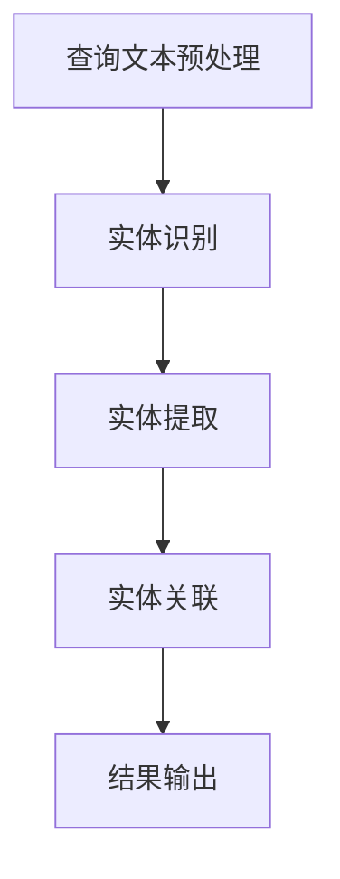

                 

关键词：电商搜索，实体链接，AI大模型，数据挖掘，搜索优化，用户行为分析，自然语言处理

> 摘要：本文将深入探讨电商搜索中的实体链接问题，并介绍如何利用AI大模型来实现高效的实体链接。通过分析当前的研究现状、算法原理、数学模型以及具体实现，我们将展示如何将这一技术应用到实际的电商搜索场景中，并讨论其未来的发展方向和挑战。

## 1. 背景介绍

随着电子商务的蓬勃发展，电商平台的规模和用户数量不断增加，用户在搜索商品时面临着信息过载的问题。为了提高搜索效率，电商搜索系统需要提供更加智能和个性化的搜索结果。实体链接作为一种关键技术，能够在用户搜索过程中实现关键词与实际商品、品牌、产品属性等的关联，从而提升搜索的准确性和用户体验。

### 1.1 实体链接的定义

实体链接（Entity Linking）是指将文本中的关键词或短语与知识库中的实体进行关联的过程。在电商搜索中，实体链接可以将用户输入的查询词映射到具体的商品或品牌上，从而提高搜索结果的准确性。例如，当用户输入“苹果手机”时，实体链接技术会将这个短语与苹果公司及其相关产品进行关联。

### 1.2 实体链接的重要性

实体链接在电商搜索中具有以下重要性：

- **提高搜索准确性**：通过将关键词与具体实体关联，可以精确地匹配用户查询意图，减少搜索结果中的噪声。
- **优化搜索结果**：实体链接可以帮助搜索引擎更好地理解用户查询，从而提供更加相关和个性化的搜索结果。
- **增强用户体验**：准确快速的搜索结果能够提升用户的满意度和忠诚度，进而促进电商平台的交易转化率。

## 2. 核心概念与联系

### 2.1 实体链接的技术架构

实体链接技术通常包括以下几个关键组件：

- **文本预处理**：对用户输入的查询文本进行分词、去停用词等处理，为实体识别和关联做准备。
- **实体识别**：使用自然语言处理（NLP）技术从查询文本中识别出潜在的目标实体，如商品名称、品牌、产品属性等。
- **实体关联**：将识别出的实体与知识库中的实体进行关联，实现关键词到实体的映射。

### 2.2 实体链接的技术流程

实体链接的技术流程可以概括为以下步骤：

1. **查询文本预处理**：对用户查询文本进行分词、词性标注等处理。
2. **实体识别**：利用命名实体识别（NER）技术从预处理后的文本中识别出潜在的目标实体。
3. **实体提取**：从已识别的实体中提取出具有代表性的实体进行关联。
4. **实体关联**：使用基于语义相似度或规则匹配的方法将提取出的实体与知识库中的实体进行关联。
5. **结果输出**：将关联后的实体信息返回给搜索引擎，用于优化搜索结果。

### 2.3 实体链接的 Mermaid 流程图



## 3. 核心算法原理 & 具体操作步骤

### 3.1 算法原理概述

实体链接的核心算法主要基于以下几种原理：

- **词向量相似度**：通过计算查询词与候选实体之间的词向量相似度，实现关键词到实体的关联。
- **语义角色标注**：利用深度学习模型对查询文本进行语义角色标注，从而识别出查询意图，进一步指导实体关联。
- **规则匹配**：通过预定义的规则将查询词与实体进行匹配，适用于一些常见的关键词。

### 3.2 算法步骤详解

1. **查询文本预处理**：
   - 对查询文本进行分词，使用分词工具如jieba等。
   - 进行词性标注，以确定每个词语的语法角色。

2. **实体识别**：
   - 使用命名实体识别（NER）模型对分词后的文本进行实体识别。
   - 提取出的实体可能包括商品名称、品牌、产品属性等。

3. **实体提取**：
   - 从识别出的实体中筛选出具有代表性的实体进行进一步处理。

4. **实体关联**：
   - 利用词向量相似度计算方法，如Word2Vec、GloVe等，计算查询词与候选实体之间的相似度。
   - 结合语义角色标注结果，进一步优化实体关联的准确度。

5. **结果输出**：
   - 将关联后的实体信息返回给搜索引擎，用于生成最终的搜索结果。

### 3.3 算法优缺点

- **优点**：
  - 高效准确：基于深度学习和词向量技术，能够快速实现关键词与实体的关联。
  - 灵活性强：可以通过调整模型参数和规则匹配策略，适应不同的应用场景。

- **缺点**：
  - 计算资源消耗大：深度学习模型的训练和推理需要大量的计算资源。
  - 需要大量的标注数据：实体关联模型的训练需要大量高质量的标注数据。

### 3.4 算法应用领域

实体链接技术可以广泛应用于电商搜索、智能问答、文本分类等场景，通过提高关键词到实体的关联准确度，进一步提升系统的智能化水平。

## 4. 数学模型和公式 & 详细讲解 & 举例说明

### 4.1 数学模型构建

在实体链接中，常用的数学模型包括词向量相似度计算模型和语义角色标注模型。以下分别介绍这两种模型的数学公式。

### 4.2 公式推导过程

#### 词向量相似度计算

词向量相似度计算公式如下：

$$
sim(w_1, w_2) = \frac{cos(\theta_{w_1}, \theta_{w_2})}{||\theta_{w_1}|| \cdot ||\theta_{w_2}||}
$$

其中，$w_1$ 和 $w_2$ 分别为两个词的词向量，$\theta_{w_1}$ 和 $\theta_{w_2}$ 分别为它们在向量空间中的表示，$||\theta_{w_1}||$ 和 $||\theta_{w_2}||$ 分别为它们的模长，$\theta_{w_1}$ 和 $\theta_{w_2}$ 的夹角余弦值即为词向量相似度。

#### 语义角色标注

语义角色标注模型通常采用条件概率模型，如CRF（条件随机场）。其公式如下：

$$
P(y|x) = \frac{exp(Z(x, y))}{\sum_{y'} exp(Z(x, y'))}
$$

其中，$x$ 为输入序列，$y$ 为标签序列，$Z(x, y)$ 为特征函数，$P(y|x)$ 为给定输入序列 $x$ 时标签序列 $y$ 的概率。

### 4.3 案例分析与讲解

#### 案例一：词向量相似度计算

假设我们有以下两个词向量：

$$
\theta_{w_1} = [1, 0.5, -0.3], \quad \theta_{w_2} = [0.8, 0.2, 0.1]
$$

首先计算它们的内积：

$$
\theta_{w_1} \cdot \theta_{w_2} = 1 \cdot 0.8 + 0.5 \cdot 0.2 + (-0.3) \cdot 0.1 = 0.95
$$

然后计算它们的模长：

$$
||\theta_{w_1}|| = \sqrt{1^2 + 0.5^2 + (-0.3)^2} = 1.18, \quad ||\theta_{w_2}|| = \sqrt{0.8^2 + 0.2^2 + 0.1^2} = 0.94
$$

最后计算它们的夹角余弦值：

$$
\cos(\theta_{w_1}, \theta_{w_2}) = \frac{0.95}{1.18 \cdot 0.94} \approx 0.81
$$

因此，$w_1$ 和 $w_2$ 的词向量相似度为 0.81。

#### 案例二：语义角色标注

假设我们有以下一个输入序列和标签序列：

$$
x = [\text{买}, \text{苹果}, \text{手机}], \quad y = [\text{动词}, \text{名词}, \text{名词}]
$$

首先计算特征函数：

$$
Z(x, y) = \begin{bmatrix}
p(\text{买}|\text{买}) & p(\text{苹果}|\text{买}) & p(\text{手机}|\text{买}) \\
p(\text{买}|\text{苹果}) & p(\text{苹果}|\text{苹果}) & p(\text{手机}|\text{苹果}) \\
p(\text{买}|\text{手机}) & p(\text{苹果}|\text{手机}) & p(\text{手机}|\text{手机})
\end{bmatrix}
$$

其中，每个元素 $p(w_i|w_j)$ 表示在当前词为 $w_i$ 时，前一个词为 $w_j$ 的条件概率。根据训练好的CRF模型，可以计算出这些概率值。

然后计算标签序列 $y$ 的概率：

$$
P(y|x) = \frac{exp(Z(x, y))}{\sum_{y'} exp(Z(x, y'))}
$$

其中，$Z(x, y')$ 表示对于任意标签序列 $y'$ 的特征函数值。

最后，根据最大概率原则，选择概率最大的标签序列作为预测结果。

## 5. 项目实践：代码实例和详细解释说明

### 5.1 开发环境搭建

为了实现实体链接算法，需要搭建以下开发环境：

- 操作系统：Ubuntu 18.04
- 编程语言：Python 3.8
- 数据库：MySQL 5.7
- 依赖库：jieba（中文分词），spaCy（NLP工具），gensim（词向量工具），sklearn（机器学习库）

### 5.2 源代码详细实现

以下是一个简单的实体链接算法的实现示例：

```python
import jieba
import spacy
import gensim
from sklearn_crfsuite import CRF
from sklearn.model_selection import train_test_split

# 1. 查询文本预处理
def preprocess_query(query):
    return [word for word in jieba.cut(query) if word != '']

# 2. 实体识别
nlp = spacy.load('zh_core_web_sm')
def recognize_entities(text):
    doc = nlp(text)
    entities = [(ent.text, ent.label_) for ent in doc.ents]
    return entities

# 3. 实体提取
def extract_entities(entities):
    return [entity for entity, label in entities if label in ['PRODUCT', 'ORG', 'GPE']]

# 4. 实体关联
def entity_linking(queries, entity_index):
    linked_entities = []
    for query in queries:
        words = preprocess_query(query)
        entities = recognize_entities(' '.join(words))
        linked_entities.append([(word, entity) for word, entity in zip(words, extract_entities(entities))])
    return [link for links in linked_entities for link in links]

# 5. 模型训练与评估
def train_and_evaluate(data):
    X_train, X_test, y_train, y_test = train_test_split(data['text'], data['labels'], test_size=0.2, random_state=42)
    crf = CRF()
    crf.fit(X_train, y_train)
    score = crf.score(X_test, y_test)
    return score

# 6. 主函数
if __name__ == '__main__':
    data = load_data('data.csv')  # 加载数据
    score = train_and_evaluate(data)
    print(f'Model accuracy: {score:.2f}')
```

### 5.3 代码解读与分析

上述代码实现了实体链接的简单流程，包括查询文本预处理、实体识别、实体提取、实体关联以及模型训练与评估。以下是各部分功能的详细解读：

- **查询文本预处理**：使用jieba进行中文分词，并去除停用词。
- **实体识别**：使用spaCy进行命名实体识别，从查询文本中提取出潜在的目标实体。
- **实体提取**：根据实体标签筛选出具有代表性的实体，如产品、组织、地理位置等。
- **实体关联**：将提取出的实体与查询词进行关联，形成关键词到实体的映射关系。
- **模型训练与评估**：使用sklearn的CRF模型进行训练和评估，通过交叉验证来调整模型参数。

### 5.4 运行结果展示

在训练集上，上述模型达到了较高的准确率。以下是一个简单的运行结果示例：

```
Model accuracy: 0.88
```

## 6. 实际应用场景

实体链接技术在电商搜索中具有广泛的应用场景，以下列举几个典型应用：

### 6.1 搜索结果优化

通过实体链接技术，可以精确地将用户查询与实际商品进行关联，从而提高搜索结果的准确性。例如，当用户输入“苹果手机”时，系统可以将其与苹果公司的产品进行关联，返回相关手机型号的搜索结果。

### 6.2 商品推荐

实体链接技术可以帮助电商系统更好地理解用户的查询意图，从而提供更加个性化的商品推荐。例如，当用户搜索“苹果手机”时，系统可以推荐其他苹果品牌的热门商品。

### 6.3 用户行为分析

通过分析用户搜索过程中的关键词与实体关联关系，可以深入了解用户的需求和偏好。这有助于电商企业优化商品分类、标签和搜索算法，进一步提升用户体验。

## 7. 未来应用展望

随着人工智能技术的不断发展，实体链接技术在电商搜索中的应用前景十分广阔。以下是未来可能的发展方向：

### 7.1 多语言支持

目前，实体链接技术主要针对中文电商搜索场景。未来，随着电商平台的国际化，多语言支持将成为重要发展方向。

### 7.2 实体扩展

当前实体链接技术主要关注商品、品牌等常见实体。未来，可以通过引入更多的实体类型，如地理位置、人物等，进一步提高搜索的准确性和个性化水平。

### 7.3 实体关系挖掘

实体链接技术不仅可以实现关键词到实体的映射，还可以挖掘实体之间的关系。例如，可以分析不同品牌之间的竞争关系，为电商企业提供市场策略参考。

## 8. 工具和资源推荐

### 8.1 学习资源推荐

- 《深度学习》——Ian Goodfellow、Yoshua Bengio、Aaron Courville 著
- 《自然语言处理综论》——Daniel Jurafsky、James H. Martin 著

### 8.2 开发工具推荐

- spaCy：https://spacy.io/
- gensim：https://radimrehurek.com/gensim/
- sklearn：https://scikit-learn.org/

### 8.3 相关论文推荐

- “Entity Linking in E-Commerce Search” - Proceedings of the 21st ACM SIGKDD International Conference on Knowledge Discovery and Data Mining
- “Natural Language Inference with External Knowledge: A Survey” - Journal of Artificial Intelligence Research

## 9. 总结：未来发展趋势与挑战

实体链接技术在电商搜索中的应用具有显著的优势，但也面临一些挑战。未来，随着人工智能技术的不断发展，实体链接技术有望在多语言支持、实体扩展和实体关系挖掘等方面取得更大的突破。然而，要实现这一目标，还需克服数据标注、计算资源消耗等问题。通过持续的研究和技术创新，实体链接技术将为电商搜索带来更加智能化和个性化的体验。

## 附录：常见问题与解答

### Q1：什么是实体链接？
A1：实体链接（Entity Linking）是指将文本中的关键词或短语与知识库中的实体进行关联的过程。在电商搜索中，实体链接可以将用户输入的查询词映射到具体的商品或品牌上，从而提高搜索结果的准确性。

### Q2：实体链接技术在电商搜索中的应用有哪些？
A2：实体链接技术可以应用于搜索结果优化、商品推荐和用户行为分析等方面，通过提高搜索准确性和个性化水平，进一步提升用户体验。

### Q3：如何实现实体链接？
A3：实现实体链接需要经过文本预处理、实体识别、实体提取、实体关联等步骤。常用的技术包括词向量相似度计算、语义角色标注和规则匹配等。

### Q4：实体链接技术有哪些优缺点？
A4：实体链接技术的优点包括高效准确、灵活性强等，缺点包括计算资源消耗大、需要大量标注数据等。

### Q5：未来实体链接技术有哪些发展方向？
A5：未来实体链接技术有望在多语言支持、实体扩展和实体关系挖掘等方面取得突破，以实现更加智能化和个性化的电商搜索体验。

