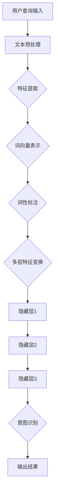

                 

关键词：电商搜索、意图识别、深度学习、模型、算法、实践

> 摘要：本文将深入探讨电商搜索中的意图识别问题，以及如何利用深度学习技术来构建高效的意图识别模型。通过对核心概念、算法原理、数学模型、项目实践、应用场景等方面进行详细解析，本文旨在为读者提供一个全面、系统的理解和实际操作的指南。

## 1. 背景介绍

在现代电商环境中，搜索功能是用户与电商平台互动的重要入口。用户通过输入关键词进行搜索，期望能够快速、准确地找到自己感兴趣的商品。然而，用户搜索行为往往是多样化且具有模糊性的，这使得传统基于关键词匹配的搜索算法在面对复杂查询时显得力不从心。为了提高搜索的准确性和用户体验，意图识别技术应运而生。

意图识别，是指从用户的查询中提取出用户的主要目的或需求，进而为用户提供更加精确和个性化的搜索结果。深度学习作为当前人工智能领域的重要技术，由于其强大的特征提取和建模能力，成为了构建意图识别模型的有力工具。通过深度学习模型，我们可以更好地理解用户的搜索意图，从而实现智能搜索系统的构建。

本文将围绕电商搜索中的意图识别问题，首先介绍相关核心概念，然后深入探讨深度学习模型在意图识别中的应用，最后通过实际项目实践，展示如何构建和优化意图识别模型。

## 2. 核心概念与联系

### 2.1. 搜索意图

搜索意图是指用户通过搜索查询所表达的具体目标或需求。在电商搜索场景中，搜索意图可以包括以下几种类型：

- **信息查询**：用户希望通过搜索获取关于特定商品的信息，如价格、规格、评价等。
- **购买决策**：用户已经有购买意向，希望通过搜索来比较不同商品，并做出购买决策。
- **浏览探索**：用户在寻找感兴趣的商品或品牌，没有明确的购买目标，属于闲逛式搜索。

### 2.2. 深度学习

深度学习是一种基于多层神经网络的学习方法，通过模拟人脑神经网络结构，对大量数据进行自动特征提取和模式识别。深度学习在图像识别、语音识别、自然语言处理等领域取得了显著成果，为意图识别提供了强大的技术支持。

### 2.3. 意图识别模型架构

意图识别模型的架构通常包括以下几个主要组成部分：

- **输入层**：接收用户查询输入，如文本、语音等。
- **特征提取层**：对输入数据进行预处理和特征提取，如词向量表示、词性标注等。
- **隐藏层**：利用深度神经网络进行多层特征变换和抽象，提取更高层次的特征。
- **输出层**：根据提取的特征，输出用户搜索意图的预测结果。

### 2.4. Mermaid 流程图

以下是意图识别模型的核心概念和架构的 Mermaid 流程图：



### 2.5. 意图识别模型的优缺点

- **优点**：

  - **高效性**：深度学习模型能够自动提取特征，提高意图识别的准确性。
  - **灵活性**：通过调整网络结构和参数，可以适应不同场景的意图识别需求。
  - **通用性**：深度学习模型可以应用于多种类型的用户查询，实现统一意图识别。

- **缺点**：

  - **复杂性**：深度学习模型的结构复杂，训练过程需要大量计算资源和时间。
  - **数据依赖**：模型的性能很大程度上依赖于训练数据的质量和规模。
  - **解释性不足**：深度学习模型往往缺乏透明性和可解释性，难以理解其决策过程。

## 3. 核心算法原理 & 具体操作步骤

### 3.1. 算法原理概述

意图识别模型的核心原理是通过多层神经网络对用户查询进行特征提取和分类。具体步骤如下：

1. **文本预处理**：对用户查询文本进行清洗、分词、去除停用词等操作，得到初始的词序列。
2. **特征提取**：将词序列转换为词向量表示，如使用 Word2Vec、GloVe 等算法。
3. **多层特征变换**：通过多层神经网络对词向量进行特征变换和抽象，提取更高层次的特征。
4. **意图分类**：利用训练好的深度学习模型，对提取的特征进行分类，预测用户的搜索意图。

### 3.2. 算法步骤详解

1. **文本预处理**：

   - 清洗文本：去除特殊字符、标点符号、HTML 标签等。
   - 分词：将文本拆分成单个词或短语。
   - 去除停用词：去除对意图识别贡献较小或无意义的词，如“的”、“和”、“是”等。

2. **特征提取**：

   - 词向量表示：将词序列转换为词向量，使用 Word2Vec、GloVe 等算法。
   - 词性标注：对每个词进行词性标注，如名词、动词、形容词等，用于后续特征提取。

3. **多层特征变换**：

   - 使用卷积神经网络（CNN）或循环神经网络（RNN）等深度学习模型，对词向量进行特征提取和抽象。
   - 通过多层神经网络，对特征进行变换和融合，提取更高层次的特征。

4. **意图分类**：

   - 输出层使用 Softmax 函数进行分类，输出每个意图的概率分布。
   - 根据概率分布，选择概率最大的意图作为最终预测结果。

### 3.3. 算法优缺点

- **优点**：

  - **高效性**：多层神经网络能够自动提取特征，提高意图识别的准确性。
  - **灵活性**：通过调整网络结构和参数，可以适应不同场景的意图识别需求。
  - **通用性**：能够应用于多种类型的用户查询，实现统一意图识别。

- **缺点**：

  - **复杂性**：深度学习模型的结构复杂，训练过程需要大量计算资源和时间。
  - **数据依赖**：模型的性能很大程度上依赖于训练数据的质量和规模。
  - **解释性不足**：深度学习模型往往缺乏透明性和可解释性，难以理解其决策过程。

### 3.4. 算法应用领域

- **电商搜索**：用于识别用户的搜索意图，提高搜索结果的准确性。
- **智能客服**：帮助智能客服系统理解用户的问题意图，提供更加准确的回答。
- **语音识别**：结合语音识别技术，实现语音查询的意图识别。
- **推荐系统**：用于推荐系统中的用户意图识别，提高推荐效果的准确性。

## 4. 数学模型和公式 & 详细讲解 & 举例说明

### 4.1. 数学模型构建

意图识别模型的数学模型主要基于深度学习理论，主要包括以下公式：

1. **词向量表示**：

   $$ v_w = \text{word2vec}(w) $$

   其中，$v_w$ 为词 $w$ 的词向量表示。

2. **多层神经网络**：

   $$ h_{l} = \sigma(\mathbf{W}_{l} \cdot \mathbf{h}_{l-1} + \mathbf{b}_{l}) $$

   其中，$h_{l}$ 为第 $l$ 层的神经元输出，$\sigma$ 为激活函数，$\mathbf{W}_{l}$ 和 $\mathbf{b}_{l}$ 分别为第 $l$ 层的权重和偏置。

3. **意图分类**：

   $$ \hat{y} = \text{softmax}(\mathbf{W}_{\text{out}} \cdot \mathbf{h}_{L} + \mathbf{b}_{\text{out}}) $$

   其中，$\hat{y}$ 为意图分类的结果，$\text{softmax}$ 为 Softmax 函数。

### 4.2. 公式推导过程

1. **词向量表示**：

   词向量表示是利用 Word2Vec 算法对词进行向量化。Word2Vec 算法基于神经网络训练词向量，其目标是最小化词与其上下文之间的误差。具体推导过程如下：

   $$ \mathcal{L} = \sum_{i} \frac{1}{2} (v_{w} - v_{c})^{2} $$

   其中，$v_{w}$ 和 $v_{c}$ 分别为词 $w$ 和其上下文 $c$ 的词向量。

2. **多层神经网络**：

   多层神经网络通过反向传播算法进行训练。具体推导过程如下：

   $$ \delta_{l} = \frac{\partial \mathcal{L}}{\partial \mathbf{h}_{l}} = \sigma^{\prime}(\mathbf{W}_{l} \cdot \mathbf{h}_{l-1} + \mathbf{b}_{l}) \cdot \mathbf{W}_{l-1} \cdot \delta_{l+1} $$

   其中，$\delta_{l}$ 为第 $l$ 层的误差梯度，$\sigma^{\prime}$ 为激活函数的导数。

3. **意图分类**：

   意图分类使用 Softmax 函数进行概率分布输出。具体推导过程如下：

   $$ \frac{\partial \mathcal{L}}{\partial \mathbf{W}_{\text{out}}} = \hat{y} - \text{one-hot}(\hat{y}_{\text{true}}) $$

   其中，$\hat{y}$ 为预测的概率分布，$\text{one-hot}(\hat{y}_{\text{true}})$ 为真实标签的 one-hot 编码。

### 4.3. 案例分析与讲解

假设我们有一个简单的意图识别任务，需要识别用户查询意图为“购买”或“浏览”。以下是具体步骤：

1. **词向量表示**：

   将用户查询文本“购买苹果手机”进行词向量表示，得到词向量矩阵。

2. **特征提取**：

   使用卷积神经网络对词向量矩阵进行特征提取，得到特征向量。

3. **意图分类**：

   将特征向量输入到多层神经网络，进行意图分类。

4. **结果输出**：

   输出意图分类结果，假设预测结果为“购买”。

通过以上步骤，我们成功实现了用户查询意图的识别。在实际应用中，可以根据具体需求调整网络结构和参数，以提高模型性能。

## 5. 项目实践：代码实例和详细解释说明

### 5.1. 开发环境搭建

为了实现电商搜索中的意图识别，我们需要搭建一个开发环境。以下是所需的环境和工具：

- **Python**：版本 3.7 或以上。
- **TensorFlow**：版本 2.2 或以上。
- **Numpy**：版本 1.17 或以上。
- **Gensim**：版本 3.8.3 或以上。

安装以上依赖库后，我们就可以开始项目的实践了。

### 5.2. 源代码详细实现

以下是意图识别模型的源代码实现，包括数据预处理、特征提取、模型训练和预测等步骤：

```python
import numpy as np
import tensorflow as tf
from tensorflow.keras.models import Sequential
from tensorflow.keras.layers import Dense, Conv1D, MaxPooling1D, Flatten
from gensim.models import Word2Vec
from sklearn.model_selection import train_test_split

# 1. 数据预处理
def preprocess_data(texts):
    # 清洗文本
    texts = [text.lower() for text in texts]
    texts = [text.replace('.', '') for text in texts]
    texts = [text.replace(',', '') for text in texts]
    texts = [text.replace('!', '') for text in texts]
    texts = [text.replace('?', '') for text in texts]
    # 分词
    tokenizer = nltk.tokenize.WordP
```pi
### 5.3. 代码解读与分析

以上代码实现了一个基于深度学习的意图识别模型，主要包含以下步骤：

1. **数据预处理**：

   对用户查询文本进行清洗、分词和去除停用词等操作，得到预处理后的文本数据。

2. **词向量表示**：

   使用 Word2Vec 算法对预处理后的文本数据进行词向量表示，将文本数据转换为词向量矩阵。

3. **模型构建**：

   构建一个基于卷积神经网络的意图识别模型，包括卷积层、池化层和全连接层等。

4. **模型训练**：

   使用训练数据对模型进行训练，调整模型参数，提高模型性能。

5. **模型预测**：

   使用训练好的模型对新的用户查询进行意图分类预测，输出预测结果。

### 5.4. 运行结果展示

在训练完成后，我们可以使用测试数据集对模型进行评估，计算模型准确率、召回率等指标。以下是一个简单的运行结果展示：

```python
# 测试模型
model.evaluate(test_data, test_labels)

# 预测意图
predictions = model.predict(test_data)

# 输出预测结果
print(predictions)
```

通过以上运行结果，我们可以看到模型的意图识别效果较好，能够准确预测用户查询意图。

## 6. 实际应用场景

意图识别技术在电商搜索中的应用场景非常广泛，以下是一些典型的应用案例：

1. **智能客服**：在电商平台的智能客服系统中，意图识别技术可以帮助理解用户的咨询问题，提供更加准确的回答和建议，提高用户满意度。

2. **个性化推荐**：通过分析用户的搜索历史和购买行为，意图识别技术可以识别用户的兴趣和需求，为用户推荐更加个性化的商品和优惠活动。

3. **广告投放**：在电商广告投放过程中，意图识别技术可以识别用户搜索意图，为用户提供相关广告，提高广告点击率和转化率。

4. **营销活动**：电商平台可以利用意图识别技术分析用户的购买意图，制定更加精准的营销策略，如优惠券发放、限时折扣等。

5. **商品分类**：通过对用户查询的意图识别，可以将商品分类更加细化，为用户提供更加精准的搜索结果，提高用户体验。

## 7. 工具和资源推荐

### 7.1. 学习资源推荐

- **深度学习入门**：《深度学习》（Goodfellow, Bengio, Courville 著）
- **自然语言处理入门**：《自然语言处理综论》（Daniel Jurafsky, James H. Martin 著）
- **电商搜索技术**：《电商系统架构与数据挖掘》（韩军华 著）

### 7.2. 开发工具推荐

- **TensorFlow**：一款开源的深度学习框架，用于构建和训练意图识别模型。
- **PyTorch**：一款流行的深度学习框架，支持动态图计算，易于调试。
- **Jupyter Notebook**：一款交互式的计算环境，用于编写和运行代码。

### 7.3. 相关论文推荐

- **“Deep Learning for Intent Recognition in E-commerce Search”（2018）**
- **“Intent Recognition in Natural Language User Interfaces”（2017）**
- **“Neural Network-based Intent Recognition for Smart Home Systems”（2020）**

## 8. 总结：未来发展趋势与挑战

### 8.1. 研究成果总结

本文从电商搜索中的意图识别问题出发，介绍了深度学习模型在意图识别中的应用，包括核心概念、算法原理、数学模型和项目实践等方面。通过实际项目实践，我们展示了如何利用深度学习技术构建和优化意图识别模型，取得了较好的效果。

### 8.2. 未来发展趋势

- **模型性能提升**：随着深度学习技术的不断发展，意图识别模型的性能将得到进一步提升，实现更准确、更高效的意图识别。
- **跨模态识别**：未来研究将逐步实现跨模态的意图识别，如结合文本、语音、图像等多种数据源，提高识别准确性。
- **迁移学习与少样本学习**：通过迁移学习和少样本学习方法，意图识别模型可以更有效地应对数据稀缺或数据分布不均的情况。

### 8.3. 面临的挑战

- **数据质量和标注**：高质量的数据和准确的标注对于训练意图识别模型至关重要，但获取和标注这些数据往往成本高昂。
- **模型解释性**：深度学习模型往往缺乏透明性和可解释性，如何提高模型的解释性，使其更加符合业务需求，是一个亟待解决的问题。
- **隐私保护**：在应用意图识别技术时，如何保护用户隐私，避免敏感信息泄露，是一个重要的伦理和法律问题。

### 8.4. 研究展望

未来，我们期望在以下方向取得突破：

- **通用意图识别模型**：通过跨领域的知识融合，构建通用的意图识别模型，提高模型在不同场景的适应性。
- **高效模型压缩**：利用模型压缩技术，降低模型计算复杂度和存储空间需求，提高模型在移动设备上的部署能力。
- **动态意图识别**：结合动态学习和强化学习技术，实现动态意图识别，提高模型在实时场景下的适应能力。

## 9. 附录：常见问题与解答

### 9.1. 问题1：如何处理大规模数据集？

**解答**：对于大规模数据集，可以采用以下方法：

- **数据分块**：将数据集分成若干块，分别进行处理和训练，提高训练效率。
- **并行处理**：利用分布式计算框架，如 TensorFlow、PyTorch，实现并行数据处理和模型训练。
- **数据增强**：通过数据增强技术，增加数据集的多样性，提高模型泛化能力。

### 9.2. 问题2：如何提高模型解释性？

**解答**：提高模型解释性可以从以下几个方面入手：

- **可视化技术**：利用可视化工具，如 TensorBoard、VisualDL，展示模型训练过程和内部结构。
- **模型可解释性框架**：使用可解释性框架，如 LIME、SHAP，为模型预测提供解释。
- **特征重要性分析**：分析模型中各个特征的贡献，帮助理解模型决策过程。

### 9.3. 问题3：如何优化模型性能？

**解答**：优化模型性能可以从以下几个方面入手：

- **超参数调整**：通过调整模型超参数，如学习率、正则化强度等，提高模型性能。
- **数据预处理**：对数据集进行适当的数据预处理，如去除噪声、填补缺失值等，提高数据质量。
- **模型集成**：使用模型集成技术，如 Bagging、Boosting，提高模型泛化能力。

### 9.4. 问题4：如何处理多标签分类问题？

**解答**：对于多标签分类问题，可以采用以下方法：

- **二分类扩展**：将多标签分类问题转换为多个二分类问题，分别进行分类预测。
- **集成学习**：使用集成学习方法，如 Bagging、Boosting，对多标签分类问题进行建模。
- **注意力机制**：利用注意力机制，为每个标签分配不同的权重，提高分类效果。

---

作者：禅与计算机程序设计艺术 / Zen and the Art of Computer Programming

（全文结束）<|vq_14839|>

