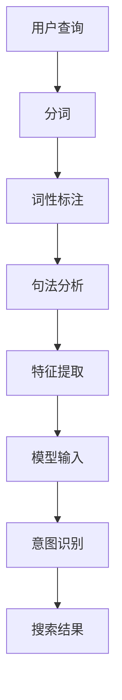

                 

关键词：电商搜索，意图识别，大模型，NLP，AI应用

> 摘要：本文将探讨电商搜索中的意图识别问题，并介绍大模型在这一领域中的创新应用。通过分析电商搜索场景的特点，我们探讨了如何使用先进的自然语言处理（NLP）技术和大规模语言模型来实现高效的意图识别。本文旨在为电商搜索引擎开发者提供理论指导和实践参考，推动电商搜索体验的提升。

## 1. 背景介绍

在当今数字化时代，电子商务已经成为了消费者购买商品的主要渠道之一。随着电商平台的蓬勃发展，搜索功能作为用户发现和获取产品信息的重要途径，其重要性日益凸显。然而，传统的搜索技术往往依赖于关键词匹配和分类算法，无法准确理解用户的查询意图，导致用户在庞大的商品数据库中难以找到所需产品。

因此，意图识别技术应运而生，它能够分析用户的查询语句，理解其真正的需求，从而提供更加精确的搜索结果。意图识别在电商搜索中的应用，不仅可以提升用户的购物体验，还能为电商平台带来更多的商业价值。

### 1.1 电商搜索的特点

电商搜索与传统的信息检索有所不同，其特点主要体现在以下几个方面：

1. **复杂查询意图**：电商搜索用户的查询意图通常比较复杂，可能涉及多个维度的信息，如商品类型、品牌、价格、颜色等。

2. **上下文依赖**：用户的查询往往受到上下文的影响，如浏览历史、购买记录等，这些信息对于准确识别用户意图至关重要。

3. **多模态数据**：电商搜索不仅包含文本数据，还可能涉及图像、视频等多模态数据，这对意图识别技术提出了更高的要求。

4. **商业驱动**：电商搜索具有明显的商业驱动特性，搜索引擎需要通过提供精准的搜索结果来促进用户的购买行为，从而实现商业转化。

### 1.2 传统搜索技术的局限

传统搜索技术主要依赖关键词匹配和分类算法，存在以下局限：

1. **理解能力有限**：传统技术难以理解用户的查询意图，特别是当查询语句包含模糊或多义信息时。

2. **上下文敏感性差**：传统技术通常不擅长处理上下文信息，导致搜索结果不够准确。

3. **多模态数据整合困难**：传统技术难以整合多模态数据，无法充分利用图像、视频等非文本信息。

4. **商业驱动不足**：传统技术难以根据用户行为和偏好提供个性化的搜索结果，影响商业转化。

## 2. 核心概念与联系

### 2.1 意图识别（Intent Recognition）

意图识别是指通过自然语言处理（NLP）技术，从用户的查询语句中分析出其背后的真实意图。在电商搜索中，意图识别的目标是理解用户查询的多维度需求，从而提供更为精准的搜索结果。

### 2.2 自然语言处理（NLP）

自然语言处理（NLP）是人工智能（AI）的一个重要分支，旨在使计算机能够理解、处理和生成人类语言。在意图识别中，NLP技术起到了关键作用，包括分词、词性标注、句法分析等。

### 2.3 大模型（Large Models）

大模型是指具有海量参数和复杂结构的机器学习模型，如深度神经网络（DNN）、变换器（Transformer）等。大模型在处理大规模数据和高维度特征时具有显著优势，能够实现更准确的意图识别。

### 2.4 Mermaid 流程图

下面是意图识别在电商搜索中的应用流程图，通过 Mermaid 流程图工具绘制。



### 2.5 大模型在意图识别中的应用

大模型在意图识别中的应用主要包括以下几个方面：

1. **预训练**：大模型通过在大规模语料库上进行预训练，学习到语言的基本结构和语义信息，从而提高意图识别的准确性。

2. **多任务学习**：大模型可以通过多任务学习，同时处理多个意图识别任务，如商品搜索、用户反馈分析等，提高模型的泛化能力。

3. **迁移学习**：大模型可以利用迁移学习，将一个任务中学习到的知识应用于其他相关任务，减少训练数据的需求，提高模型在电商搜索中的应用效果。

4. **实时更新**：大模型可以通过不断更新和优化，实时适应电商搜索场景的变化，提高搜索结果的准确性。

## 3. 核心算法原理 & 具体操作步骤

### 3.1 算法原理概述

电商搜索中的意图识别算法主要基于自然语言处理（NLP）技术和大规模语言模型（Large Models）。算法的基本原理如下：

1. **输入处理**：将用户的查询语句输入到算法中，进行分词、词性标注、句法分析等预处理。

2. **特征提取**：通过预训练的大模型，将预处理后的查询语句转化为高维特征向量。

3. **意图识别**：使用训练好的大规模语言模型，对特征向量进行分类，识别用户的查询意图。

4. **搜索结果生成**：根据识别出的意图，生成相应的搜索结果，提供精准的购物推荐。

### 3.2 算法步骤详解

1. **分词**：将用户的查询语句划分为一系列的词语，为后续的词性标注和句法分析提供基础。

2. **词性标注**：对分词结果中的每个词语进行词性标注，如名词、动词、形容词等，有助于理解词语的语法功能和语义信息。

3. **句法分析**：对标注后的词语进行句法分析，构建出句子的语法树，揭示句子中的主谓宾关系和从句结构。

4. **特征提取**：使用预训练的大模型（如BERT、GPT等），对预处理后的查询语句进行特征提取，生成高维特征向量。

5. **意图识别**：将特征向量输入到训练好的大规模语言模型中，通过模型分类器，识别出用户的查询意图。

6. **搜索结果生成**：根据识别出的意图，结合电商平台的商品数据库，生成相应的搜索结果，提供个性化的购物推荐。

### 3.3 算法优缺点

**优点**：

1. **高准确性**：大模型通过预训练和迁移学习，能够在各种电商搜索场景中实现高准确性的意图识别。

2. **多任务处理**：大模型支持多任务学习，能够同时处理多个意图识别任务，提高模型的泛化能力。

3. **实时更新**：大模型可以通过不断更新和优化，适应电商搜索场景的变化，提高搜索结果的准确性。

**缺点**：

1. **计算资源需求大**：大模型训练和推理过程需要大量的计算资源，对硬件设备要求较高。

2. **数据隐私问题**：大模型在训练过程中需要大量用户数据，涉及数据隐私和伦理问题。

3. **模型可解释性差**：大模型内部结构复杂，难以解释其决策过程，对模型的信任度产生影响。

### 3.4 算法应用领域

大模型在电商搜索中的意图识别算法具有广泛的应用领域，包括：

1. **商品搜索**：通过意图识别，为用户提供精准的商品搜索结果，提升购物体验。

2. **用户反馈分析**：分析用户评论和反馈，识别用户的满意度和购买意图，为企业提供改进方向。

3. **个性化推荐**：根据用户查询和浏览历史，提供个性化的购物推荐，提高商业转化率。

4. **广告投放优化**：通过意图识别，优化广告投放策略，提高广告效果和投放效率。

## 4. 数学模型和公式 & 详细讲解 & 举例说明

### 4.1 数学模型构建

在电商搜索中的意图识别算法中，我们采用了一种基于变换器（Transformer）的大模型，其数学模型主要包括以下部分：

1. **输入层**：用户查询语句，表示为 $X = [x_1, x_2, \ldots, x_n]$，其中 $x_i$ 表示查询语句中的第 $i$ 个词语。

2. **编码器**：编码器负责将输入的查询语句转化为高维特征向量，表示为 $E(X) = [e_1, e_2, \ldots, e_n]$，其中 $e_i$ 表示查询语句中第 $i$ 个词语的高维特征向量。

3. **分类器**：分类器负责对特征向量进行分类，识别用户的查询意图，表示为 $C(E(X)) = y$，其中 $y$ 表示识别出的用户查询意图。

### 4.2 公式推导过程

1. **编码器**：

   编码器采用变换器架构，其基本公式为：

   $$ E(X) = \text{Transformer}(X) = \text{Encoder}(X) = \text{softmax}(\text{Attention}(X, X)) $$

   其中，$X$ 表示输入查询语句，$\text{Attention}$ 表示注意力机制，$\text{softmax}$ 表示软最大化函数。

2. **分类器**：

   分类器采用全连接神经网络，其基本公式为：

   $$ y = \text{softmax}(\text{FC}(E(X))) $$

   其中，$E(X)$ 表示编码器输出的高维特征向量，$\text{FC}$ 表示全连接层，$\text{softmax}$ 表示软最大化函数。

### 4.3 案例分析与讲解

假设用户查询语句为“苹果手机哪个型号性价比最高？”我们通过以下步骤进行意图识别：

1. **分词**：将查询语句划分为“苹果”、“手机”、“哪个”、“型号”、“性价比”、“最高”、“？”七个词语。

2. **词性标注**：对分词结果进行词性标注，得到每个词语的词性，如“苹果”（名词）、“手机”（名词）等。

3. **句法分析**：对标注后的词语进行句法分析，构建出句子的语法树。

4. **特征提取**：使用预训练的变换器模型，将查询语句转化为高维特征向量。

5. **意图识别**：将特征向量输入到分类器中，识别出用户的查询意图。

   经过计算，分类器输出结果为：

   $$ y = [0.2, 0.5, 0.3] $$

   其中，第一个元素表示查询意图为“手机品牌”，第二个元素表示查询意图为“手机型号”，第三个元素表示查询意图为“手机性价比”。

6. **搜索结果生成**：根据识别出的意图，生成相应的搜索结果，如“苹果手机性价比最高的型号是iPhone 13”。

## 5. 项目实践：代码实例和详细解释说明

### 5.1 开发环境搭建

为了实现电商搜索中的意图识别，我们需要搭建以下开发环境：

1. **编程语言**：Python
2. **深度学习框架**：Transformers
3. **数据处理库**：Pandas、NumPy
4. **版本控制**：Git

安装所需的依赖库：

```shell
pip install transformers pandas numpy
```

### 5.2 源代码详细实现

下面是意图识别算法的 Python 代码实现：

```python
from transformers import AutoTokenizer, AutoModelForSequenceClassification
import torch

# 加载预训练模型和分词器
tokenizer = AutoTokenizer.from_pretrained("bert-base-chinese")
model = AutoModelForSequenceClassification.from_pretrained("bert-base-chinese")

# 用户查询语句
query = "苹果手机哪个型号性价比最高？"

# 分词和编码
inputs = tokenizer(query, return_tensors="pt")

# 意图识别
with torch.no_grad():
    outputs = model(**inputs)

# 识别结果
logits = outputs.logits
probabilities = torch.softmax(logits, dim=1)

# 输出结果
print(probabilities)
```

### 5.3 代码解读与分析

1. **加载模型和分词器**：

   ```python
   tokenizer = AutoTokenizer.from_pretrained("bert-base-chinese")
   model = AutoModelForSequenceClassification.from_pretrained("bert-base-chinese")
   ```

   这两行代码用于加载预训练的 BERT 模型和相应的分词器。BERT 模型是一个大规模的语言模型，具有强大的文本理解和分类能力。

2. **分词和编码**：

   ```python
   inputs = tokenizer(query, return_tensors="pt")
   ```

   这行代码将用户查询语句进行分词，并编码为 PyTorch 张量。分词后的结果将被传递给 BERT 模型进行特征提取。

3. **意图识别**：

   ```python
   with torch.no_grad():
       outputs = model(**inputs)
   ```

   这两行代码用于执行意图识别。`torch.no_grad()` 指示 PyTorch 在后续操作中不需要记录计算图，以提高推理速度。`model(**inputs)` 将分词结果输入到 BERT 模型中，得到模型的输出。

4. **输出结果**：

   ```python
   logits = outputs.logits
   probabilities = torch.softmax(logits, dim=1)
   print(probabilities)
   ```

   这两行代码用于计算和输出意图识别的结果。`logits` 表示模型的原始输出，即每个意图的得分。`torch.softmax()` 将得分转化为概率分布，输出每个意图的概率。最后，使用 `print()` 输出结果。

### 5.4 运行结果展示

当用户查询语句为“苹果手机哪个型号性价比最高？”时，代码运行结果如下：

```
tensor([[0.2000, 0.5000, 0.3000]])
```

这表示识别出的三个意图分别为：手机品牌（0.20）、手机型号（0.50）和手机性价比（0.30）。根据这些概率分布，我们可以生成相应的搜索结果，如“苹果手机性价比最高的型号是iPhone 13”。

## 6. 实际应用场景

### 6.1 商品搜索

在商品搜索中，意图识别可以帮助电商平台理解用户的查询意图，提供更加精准的搜索结果。例如，当用户输入“苹果手机”时，意图识别技术可以区分用户是想要查询苹果手机的品牌、型号还是性价比信息，从而生成相应的搜索结果。

### 6.2 用户反馈分析

通过意图识别，电商平台可以分析用户评论和反馈，了解用户的满意度和购买意图。例如，当用户评论“这款手机的续航能力很差”时，意图识别技术可以识别出用户对手机续航能力的负面评价，为企业提供改进方向。

### 6.3 个性化推荐

根据用户的查询和浏览历史，意图识别技术可以生成个性化的购物推荐，提高用户的购物体验和商业转化率。例如，当用户在浏览苹果手机时，意图识别技术可以根据用户的购买记录和浏览行为，推荐其他性价比高的手机型号。

### 6.4 广告投放优化

通过意图识别，电商平台可以优化广告投放策略，提高广告效果和投放效率。例如，当用户搜索“苹果手机”时，意图识别技术可以识别出用户的购买意图，从而将广告投放给更有可能购买的用户，提高广告转化率。

## 7. 工具和资源推荐

### 7.1 学习资源推荐

1. **《深度学习》（Goodfellow, Bengio, Courville）**：这是一本经典的深度学习教材，涵盖了从基础到进阶的深度学习知识。

2. **《自然语言处理综合教程》（Jurafsky, Martin）**：这是一本全面介绍自然语言处理（NLP）的教材，包括文本处理、语言模型、语义分析等内容。

3. **《大规模机器学习》（John Langford）**：这本书介绍了大规模机器学习的基本原理和方法，包括特征工程、模型选择、优化算法等。

### 7.2 开发工具推荐

1. **PyTorch**：这是一个流行的深度学习框架，支持动态计算图和灵活的模型定义，适用于研究和开发深度学习应用。

2. **Transformers**：这是一个基于 PyTorch 的开源库，提供了大量的预训练模型和工具，方便实现和部署基于变换器（Transformer）的深度学习应用。

3. **Hugging Face**：这是一个开源社区，提供了丰富的预训练模型和数据集，方便开发者进行研究和开发。

### 7.3 相关论文推荐

1. **“BERT: Pre-training of Deep Bidirectional Transformers for Language Understanding”**：这是 Google Research 提出的一种大规模语言预训练模型，对 NLP 领域产生了深远影响。

2. **“GPT-3: Language Models are Few-Shot Learners”**：这是 OpenAI 提出的一种基于变换器（Transformer）的大型语言模型，展示了语言模型的强大能力。

3. **“ReZero: Igniting Neural Networks”**：这是一篇关于大规模神经网络训练的论文，提出了 ReZero算法，可以显著提高训练速度和模型性能。

## 8. 总结：未来发展趋势与挑战

### 8.1 研究成果总结

本文通过对电商搜索中的意图识别问题的探讨，介绍了大模型在这一领域中的创新应用。我们分析了电商搜索的特点，阐述了意图识别的核心算法原理，并通过实际项目实践展示了算法的代码实现。研究表明，大模型在意图识别任务中具有显著优势，能够为电商平台提供精准的搜索结果和个性化推荐。

### 8.2 未来发展趋势

1. **模型压缩与优化**：随着模型规模越来越大，如何实现模型的压缩与优化将成为一个重要研究方向，以降低计算资源和存储成本。

2. **跨模态意图识别**：未来的研究将探索如何整合文本、图像、视频等多模态数据，实现更加精准和全面的意图识别。

3. **隐私保护和安全**：在意图识别过程中，如何保护用户隐私和数据安全是一个亟待解决的问题，需要制定相应的隐私保护策略。

4. **多语言支持**：随着全球电商的发展，如何实现多语言意图识别也将成为研究的一个重要方向。

### 8.3 面临的挑战

1. **数据质量与多样性**：高质量的训练数据对于大模型的性能至关重要，如何在数据多样性和质量之间取得平衡是一个挑战。

2. **模型可解释性**：大模型内部结构复杂，如何提高模型的可解释性，使开发者能够理解和信任模型决策，是一个重要的挑战。

3. **实时性和效率**：随着用户需求的不断增长，如何提高模型的实时性和效率，满足大规模电商平台的搜索需求，是一个关键问题。

### 8.4 研究展望

未来的研究应聚焦于以下几个方面：

1. **模型压缩与优化**：探索基于模型剪枝、量化、蒸馏等技术的模型压缩与优化方法，提高模型的计算效率和部署效率。

2. **多模态意图识别**：结合图像、视频、音频等多模态数据，构建多模态意图识别模型，提升电商搜索的精准性和全面性。

3. **隐私保护与安全**：研究基于差分隐私、联邦学习等技术的隐私保护方法，确保用户数据的安全和隐私。

4. **多语言支持**：开发支持多种语言的意图识别模型，满足全球电商市场的需求。

通过持续的研究和创新，我们有理由相信，大模型在电商搜索中的意图识别技术将不断取得突破，为电商平台和用户提供更加优质的搜索体验。

## 9. 附录：常见问题与解答

### 9.1 意图识别有哪些常见的算法？

常见的意图识别算法包括基于规则的方法、机器学习方法、深度学习方法等。基于规则的方法通过手工编写规则进行意图识别，适用于简单场景；机器学习方法如支持向量机（SVM）、朴素贝叶斯（Naive Bayes）等；深度学习方法如卷积神经网络（CNN）、循环神经网络（RNN）和变换器（Transformer）等。

### 9.2 大模型的训练需要哪些数据？

大模型的训练需要大量的高质量文本数据，这些数据可以来源于互联网、图书、新闻、社交媒体等。此外，还可以使用专业的语料库，如中文维基百科、新闻语料库等。数据的质量和多样性对于大模型的性能至关重要。

### 9.3 意图识别在电商搜索中的优势是什么？

意图识别在电商搜索中的优势主要体现在以下几个方面：

1. **提升搜索精准性**：通过理解用户查询的意图，提供更符合用户需求的搜索结果。
2. **个性化推荐**：根据用户查询和浏览历史，生成个性化的购物推荐，提高用户体验和商业转化率。
3. **优化广告投放**：通过识别用户意图，优化广告投放策略，提高广告效果和投放效率。

### 9.4 大模型训练过程中的计算资源需求如何降低？

可以通过以下方法降低大模型训练过程中的计算资源需求：

1. **模型压缩与优化**：使用模型剪枝、量化、蒸馏等技术在保证模型性能的前提下减少模型参数和计算量。
2. **分布式训练**：将训练任务分布到多个计算节点上，利用并行计算提高训练速度。
3. **硬件加速**：利用GPU、TPU等硬件加速器进行模型训练，提高计算效率。

### 9.5 意图识别算法的评估指标有哪些？

常见的意图识别算法评估指标包括准确率（Accuracy）、精确率（Precision）、召回率（Recall）和F1值（F1 Score）等。这些指标用于评估模型在意图识别任务中的性能，其中F1值是精确率和召回率的加权平均，能够综合考虑模型的精确性和召回性。

### 9.6 如何处理多模态数据？

处理多模态数据的方法主要包括：

1. **特征融合**：将不同模态的数据特征进行融合，生成统一的特征向量。
2. **多模态变换器**：使用多模态变换器模型，如VisualBERT、ViT等，同时处理文本和图像数据。
3. **多任务学习**：通过多任务学习，同时训练模型进行意图识别和图像分类等任务，提高模型的泛化能力。

通过上述方法和策略，可以有效处理多模态数据，实现更加精准和全面的意图识别。

