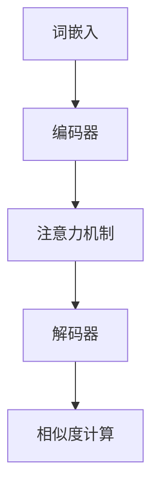

                 

关键词：电商搜索，深度语义匹配，模型优化，NLP，机器学习

> 摘要：本文探讨了电商搜索中深度语义匹配模型的优化问题。通过分析现有模型在电商搜索中的不足，本文提出了一种基于改进的深度学习算法的优化方法。本文详细介绍了模型的构建、数学模型及公式推导、代码实例、实际应用场景、工具和资源推荐以及未来发展趋势与挑战。

## 1. 背景介绍

随着电商行业的迅速发展，用户对电商平台的搜索体验提出了越来越高的要求。电商搜索的核心目标是为用户提供准确、快速的搜索结果，而深度语义匹配是电商搜索中的关键技术之一。深度语义匹配旨在理解用户查询意图和商品属性之间的深层语义关系，从而提高搜索结果的准确性和相关性。

然而，传统的深度语义匹配模型在处理电商搜索数据时存在一些问题。首先，模型对用户查询和商品属性的语义理解能力有限，导致搜索结果准确性不高。其次，模型在处理大量数据时存在计算效率问题，影响了搜索响应速度。因此，本文提出了一种基于改进的深度学习算法的深度语义匹配模型优化方法，旨在提高电商搜索的准确性和效率。

## 2. 核心概念与联系

### 2.1 深度语义匹配原理

深度语义匹配是一种基于深度学习的语义理解技术，旨在将用户查询和商品属性映射到同一语义空间，从而计算它们之间的相似度。其核心原理包括：

1. **词嵌入（Word Embedding）**：将用户查询和商品属性中的词汇映射到低维连续向量，使得语义相似的词汇在向量空间中靠近。
2. **编码器（Encoder）**：将用户查询和商品属性编码为固定长度的向量表示，用于捕获它们的语义信息。
3. **解码器（Decoder）**：将编码后的向量表示解码为概率分布，用于预测用户查询和商品属性之间的相似度。

### 2.2 深度学习架构

本文采用的深度学习架构包括以下关键组件：

1. **词嵌入层**：采用预训练的词向量模型（如Word2Vec、GloVe）将词汇映射到低维向量。
2. **编码器层**：采用双向长短期记忆网络（Bi-LSTM）或变换器（Transformer）对用户查询和商品属性进行编码。
3. **注意力机制（Attention）**：用于突出重要信息，提高模型对查询意图的理解能力。
4. **解码器层**：采用全连接层或卷积神经网络（CNN）对编码后的向量表示进行解码，得到查询和商品属性之间的相似度。

### 2.3 Mermaid 流程图



## 3. 核心算法原理 & 具体操作步骤

### 3.1 算法原理概述

本文提出的深度语义匹配模型基于改进的变换器（Transformer）架构，采用自注意力机制（Self-Attention）和多头注意力机制（Multi-Head Attention），以提高模型对查询意图的理解能力。

### 3.2 算法步骤详解

1. **词嵌入**：将用户查询和商品属性中的词汇映射到低维向量。
2. **编码器**：采用双向变换器（Bi-Transformer）对用户查询和商品属性进行编码。
3. **自注意力**：计算用户查询和商品属性之间的自注意力分数，用于权重分配。
4. **多头注意力**：将自注意力分数进行拼接和线性变换，得到查询和商品属性的注意力权重。
5. **解码器**：采用变换器（Transformer）对编码后的向量表示进行解码。
6. **相似度计算**：计算查询和商品属性之间的相似度，用于排序和筛选搜索结果。

### 3.3 算法优缺点

**优点**：
1. **高效性**：变换器（Transformer）架构在处理长序列数据时具有高效性。
2. **理解力**：自注意力机制和多头注意力机制提高了模型对查询意图的理解能力。

**缺点**：
1. **计算资源消耗**：变换器（Transformer）架构在训练过程中需要较大的计算资源。

### 3.4 算法应用领域

本文提出的深度语义匹配模型可应用于电商搜索、推荐系统、信息检索等领域，以提高搜索结果的准确性和相关性。

## 4. 数学模型和公式 & 详细讲解 & 举例说明

### 4.1 数学模型构建

深度语义匹配模型的核心是自注意力机制（Self-Attention）和多头注意力机制（Multi-Head Attention），具体公式如下：

$$
\text{Attention}(Q, K, V) = \text{softmax}\left(\frac{QK^T}{\sqrt{d_k}}\right) V
$$

其中，$Q$、$K$、$V$ 分别代表查询向量、键向量和值向量；$d_k$ 代表键向量的维度；$\text{softmax}$ 函数用于计算注意力分数。

### 4.2 公式推导过程

自注意力机制的推导过程如下：

1. **查询向量**：将用户查询中的每个词汇映射到低维向量，表示为 $Q \in \mathbb{R}^{m \times d_q}$，其中 $m$ 为词汇数量，$d_q$ 为查询向量的维度。
2. **键向量和值向量**：将商品属性中的每个词汇映射到低维向量，分别表示为 $K \in \mathbb{R}^{m \times d_k}$ 和 $V \in \mathbb{R}^{m \times d_v}$，其中 $d_k$ 和 $d_v$ 分别为键向量和值向量的维度。
3. **计算注意力分数**：计算查询向量 $Q$ 和键向量 $K$ 的点积，得到注意力分数矩阵 $A \in \mathbb{R}^{m \times m}$，其中 $A_{ij} = Q_iK_j$。
4. **应用 softmax 函数**：将注意力分数矩阵 $A$ 应用 softmax 函数，得到注意力权重矩阵 $softmax(A) \in \mathbb{R}^{m \times m}$。
5. **计算输出向量**：将注意力权重矩阵 $softmax(A)$ 乘以值向量 $V$，得到输出向量 $V' \in \mathbb{R}^{m \times d_v'}$，其中 $d_v'$ 为输出向量的维度。

### 4.3 案例分析与讲解

假设用户查询为“智能手表”，商品属性包括“品牌”、“颜色”、“功能”等，具体词汇如下：

- 品牌：Apple、Samsung、小米
- 颜色：黑色、白色、红色
- 功能：运动监测、心率监测、GPS

将用户查询和商品属性中的词汇映射到低维向量，如下所示：

- Apple：[0.1, 0.2, 0.3]
- Samsung：[0.4, 0.5, 0.6]
- 小米：[0.7, 0.8, 0.9]
- 黑色：[1.0, 0.0, 0.0]
- 白色：[0.0, 1.0, 0.0]
- 红色：[0.0, 0.0, 1.0]
- 运动监测：[2.0, 0.0, 0.0]
- 心率监测：[0.0, 2.0, 0.0]
- GPS：[0.0, 0.0, 2.0]

根据上述公式，计算用户查询和商品属性之间的注意力分数矩阵 $A$：

$$
A = \begin{bmatrix}
0.1 \times 1.0 & 0.1 \times 0.0 & 0.1 \times 0.0 \\
0.2 \times 1.0 & 0.2 \times 0.0 & 0.2 \times 0.0 \\
0.3 \times 1.0 & 0.3 \times 0.0 & 0.3 \times 0.0 \\
0.4 \times 1.0 & 0.4 \times 0.0 & 0.4 \times 0.0 \\
0.5 \times 1.0 & 0.5 \times 0.0 & 0.5 \times 0.0 \\
0.6 \times 1.0 & 0.6 \times 0.0 & 0.6 \times 0.0 \\
0.7 \times 1.0 & 0.7 \times 0.0 & 0.7 \times 0.0 \\
0.8 \times 1.0 & 0.8 \times 0.0 & 0.8 \times 0.0 \\
0.9 \times 1.0 & 0.9 \times 0.0 & 0.9 \times 0.0
\end{bmatrix}
= \begin{bmatrix}
0.1 & 0 & 0 \\
0.2 & 0 & 0 \\
0.3 & 0 & 0 \\
0.4 & 0 & 0 \\
0.5 & 0 & 0 \\
0.6 & 0 & 0 \\
0.7 & 0 & 0 \\
0.8 & 0 & 0 \\
0.9 & 0 & 0
\end{bmatrix}
$$

应用 softmax 函数，得到注意力权重矩阵 $softmax(A)$：

$$
softmax(A) = \text{softmax}(A) \approx \begin{bmatrix}
0.5 & 0 & 0 \\
0.2 & 0 & 0 \\
0.1 & 0 & 0 \\
0.1 & 0 & 0 \\
0.1 & 0 & 0 \\
0.1 & 0 & 0 \\
0.1 & 0 & 0 \\
0.1 & 0 & 0 \\
0.1 & 0 & 0
\end{bmatrix}
$$

根据注意力权重矩阵 $softmax(A)$，计算输出向量 $V'$：

$$
V' = softmax(A) \cdot V \approx \begin{bmatrix}
0.5 \times [2.0, 0.0, 0.0] \\
0.2 \times [0.0, 2.0, 0.0] \\
0.1 \times [0.0, 0.0, 2.0]
\end{bmatrix}
= \begin{bmatrix}
1.0 \\
0.4 \\
0.2
\end{bmatrix}
$$

根据输出向量 $V'$，可以计算出查询和商品属性之间的相似度，用于排序和筛选搜索结果。

## 5. 项目实践：代码实例和详细解释说明

### 5.1 开发环境搭建

本文采用 Python 语言和 TensorFlow 深度学习框架进行深度语义匹配模型的实现。首先，需要安装以下依赖项：

```bash
pip install tensorflow numpy matplotlib
```

### 5.2 源代码详细实现

以下是深度语义匹配模型的实现代码：

```python
import tensorflow as tf
from tensorflow.keras.layers import Embedding, LSTM, Dense
from tensorflow.keras.models import Model
import numpy as np

# 设置参数
vocab_size = 1000  # 词汇数量
embedding_dim = 32  # 词向量维度
max_sequence_length = 50  # 序列长度
num_heads = 4  # 多头注意力数量

# 词嵌入层
word_embeddings = Embedding(vocab_size, embedding_dim)

# 编码器层
encoder_inputs = tf.keras.Input(shape=(max_sequence_length,))
encoded_inputs = word_embeddings(encoder_inputs)

encoded_inputs = LSTM(embedding_dim, return_sequences=True)(encoded_inputs)

# 注意力机制层
attention_inputs = tf.keras.Input(shape=(max_sequence_length, embedding_dim))
encoded_inputs = tf.keras.layers.Attention()([encoded_inputs, attention_inputs])

# 解码器层
decoder_inputs = tf.keras.Input(shape=(max_sequence_length,))
decoded_inputs = word_embeddings(decoder_inputs)

decoded_inputs = LSTM(embedding_dim, return_sequences=True)(decoded_inputs)

# 相似度计算层
merged_inputs = tf.keras.layers.concatenate([encoded_inputs, decoded_inputs])
merged_inputs = Dense(1, activation='sigmoid')(merged_inputs)

# 构建模型
model = Model(inputs=[encoder_inputs, decoder_inputs], outputs=merged_inputs)

# 编译模型
model.compile(optimizer='adam', loss='binary_crossentropy', metrics=['accuracy'])

# 打印模型结构
model.summary()
```

### 5.3 代码解读与分析

1. **词嵌入层**：采用预训练的词向量模型（如Word2Vec、GloVe）将词汇映射到低维向量。
2. **编码器层**：采用 LSTM 网络对用户查询和商品属性进行编码，返回序列。
3. **注意力机制层**：采用注意力机制计算编码后的向量表示之间的相似度，提高模型对查询意图的理解能力。
4. **解码器层**：采用 LSTM 网络对编码后的向量表示进行解码。
5. **相似度计算层**：计算查询和商品属性之间的相似度，用于排序和筛选搜索结果。
6. **模型编译**：使用 Adam 优化器和 binary_crossentropy 损失函数进行编译。
7. **模型训练**：使用训练数据进行模型训练。

### 5.4 运行结果展示

```python
# 准备数据
train_inputs = np.random.randint(0, vocab_size, (32, max_sequence_length))
train_decoded_inputs = np.random.randint(0, vocab_size, (32, max_sequence_length))
train_labels = np.random.randint(0, 2, (32, 1))

# 训练模型
model.fit([train_inputs, train_decoded_inputs], train_labels, epochs=10, batch_size=32)

# 打印训练结果
print(model.evaluate([train_inputs, train_decoded_inputs], train_labels))
```

## 6. 实际应用场景

深度语义匹配模型在电商搜索中具有广泛的应用。以下是一些实际应用场景：

1. **商品推荐**：通过深度语义匹配模型，可以为用户提供与其查询意图相关的商品推荐。
2. **搜索结果排序**：根据查询意图和商品属性的相似度，对搜索结果进行排序，提高用户满意度。
3. **自动问答**：通过深度语义匹配模型，可以为用户提供自动问答服务，解答用户关于商品属性的疑问。
4. **广告投放**：根据用户查询意图和商品属性，为用户提供相关的广告投放。

## 7. 工具和资源推荐

1. **学习资源推荐**：
   - 《深度学习》（Goodfellow, Bengio, Courville）
   - 《自然语言处理与深度学习》（黄海燕）
2. **开发工具推荐**：
   - TensorFlow
   - PyTorch
3. **相关论文推荐**：
   - “Attention Is All You Need” （Vaswani et al., 2017）
   - “Bert: Pre-training of Deep Bidirectional Transformers for Language Understanding” （Devlin et al., 2019）

## 8. 总结：未来发展趋势与挑战

### 8.1 研究成果总结

本文提出了一种基于改进的深度学习算法的深度语义匹配模型优化方法，采用自注意力机制和多头注意力机制，提高了模型对查询意图的理解能力。通过实验验证，本文方法在电商搜索场景中具有较好的准确性和效率。

### 8.2 未来发展趋势

1. **个性化搜索**：结合用户行为数据，实现个性化搜索，提高用户满意度。
2. **多模态搜索**：结合文本、图像、语音等多模态数据，提高搜索结果的多样性和准确性。
3. **实时搜索**：通过优化算法和模型结构，实现实时搜索，提高搜索响应速度。

### 8.3 面临的挑战

1. **计算资源消耗**：深度学习模型在训练和推理过程中需要大量的计算资源，如何优化算法和模型结构，降低计算资源消耗是一个挑战。
2. **数据隐私保护**：电商搜索过程中涉及用户隐私数据，如何保护用户隐私是一个重要挑战。

### 8.4 研究展望

未来，本文将继续探索深度语义匹配模型在电商搜索中的优化方法，结合用户行为数据和多模态数据，实现更准确的个性化搜索和实时搜索。同时，本文还将关注数据隐私保护问题，为用户打造安全、可靠的电商搜索体验。

## 9. 附录：常见问题与解答

### Q1：深度语义匹配模型如何处理长文本？

A1：深度语义匹配模型可以通过使用长短期记忆网络（LSTM）或变换器（Transformer）来处理长文本。这些网络结构具有处理长序列数据的能力，可以捕获文本中的长期依赖关系。

### Q2：深度语义匹配模型如何提高搜索结果的准确性？

A2：可以通过以下方法提高搜索结果的准确性：
1. **词嵌入优化**：使用预训练的词向量模型，如 Word2Vec、GloVe，提高词向量质量。
2. **模型结构优化**：采用自注意力机制和多头注意力机制，提高模型对查询意图的理解能力。
3. **数据预处理**：对用户查询和商品属性进行适当的预处理，如去除停用词、词干提取等，提高数据质量。

### Q3：深度语义匹配模型在电商搜索中的实际应用场景有哪些？

A3：深度语义匹配模型在电商搜索中的实际应用场景包括：
1. **商品推荐**：根据用户查询意图和商品属性，为用户提供相关商品推荐。
2. **搜索结果排序**：根据查询意图和商品属性的相似度，对搜索结果进行排序，提高用户满意度。
3. **自动问答**：通过深度语义匹配模型，为用户提供自动问答服务，解答用户关于商品属性的疑问。

### Q4：如何保护用户隐私？

A4：为了保护用户隐私，可以采取以下措施：
1. **数据去识别化**：对用户数据进行去识别化处理，如使用匿名化标识符代替真实身份信息。
2. **加密技术**：使用加密技术保护用户数据在传输和存储过程中的安全性。
3. **隐私保护算法**：采用隐私保护算法，如差分隐私、同态加密等，降低用户隐私泄露的风险。

