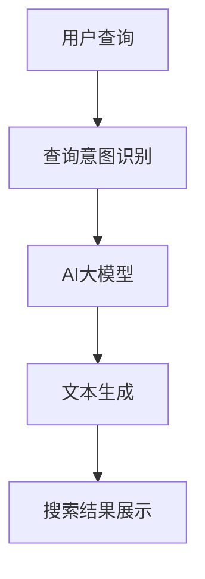

                 

关键词：电商搜索，自然语言生成，AI大模型，用户体验优化，搜索算法优化

> 摘要：本文将探讨电商搜索中的自然语言生成技术，重点关注AI大模型在提升用户搜索体验和搜索算法优化方面的应用。通过详细介绍自然语言生成的核心概念、算法原理、数学模型以及实际应用案例，本文旨在为电商行业提供一套有效的AI解决方案，以应对日益复杂的搜索需求。

## 1. 背景介绍

随着电商行业的快速发展，电商平台的竞争愈发激烈。为了吸引和留住用户，提升用户体验成为了各大电商平台的重要策略之一。在用户体验中，搜索功能作为电商平台的核心组成部分，其性能和效率直接影响到用户的满意度和留存率。然而，传统的基于关键词匹配的搜索算法已难以满足用户日益多样化的搜索需求，尤其是在处理自然语言查询时，往往会出现语义理解不准确、结果不准确等问题。

自然语言生成（Natural Language Generation，NLG）技术的出现，为解决这一问题提供了新的思路。NLG是一种将计算机生成的内容以自然语言形式表达的技术，它可以模拟人类的语言表达习惯，生成具有丰富语义和情感的自然语言文本。近年来，随着深度学习和自然语言处理技术的不断发展，NLG技术已经取得了显著的成果，并在多个领域得到了广泛应用。

在电商搜索中，自然语言生成技术可以应用于搜索结果展示、商品推荐、用户评论生成等多个方面，从而提升用户的搜索体验和满意度。本文将重点探讨AI大模型在电商搜索中的应用，以及如何利用AI大模型优化搜索算法，提高搜索效率。

## 2. 核心概念与联系

### 2.1 自然语言生成（NLG）

自然语言生成（NLG）是一种计算机生成自然语言的技术，旨在利用人工智能算法，模拟人类的语言表达习惯，生成具有丰富语义和情感的自然语言文本。NLG技术通常包括文本生成、语音合成和图像描述等多个方面。

在电商搜索中，NLG技术可以用于生成商品推荐文案、搜索结果描述、用户评论等，从而提升用户的搜索体验。

### 2.2 AI大模型

AI大模型是指具有海量参数和强大计算能力的深度学习模型，如Transformer、BERT等。这些模型在自然语言处理、计算机视觉、语音识别等多个领域取得了显著的成果，已经成为人工智能领域的重要研究方向。

在电商搜索中，AI大模型可以用于语义理解、情感分析、推荐系统等，从而提升搜索算法的性能和效率。

### 2.3 关联与融合

自然语言生成和AI大模型在电商搜索中的应用具有紧密的关联。通过将NLG技术与AI大模型相结合，可以实现对用户查询意图的深入理解，从而生成更符合用户需求的搜索结果。

以下是电商搜索中自然语言生成与AI大模型融合的Mermaid流程图：



### 2.4 Mermaid流程图详细说明

- **A[用户查询]**：表示用户在电商平台上输入的查询语句。
- **B[查询意图识别]**：利用AI大模型对用户查询进行语义理解，识别用户查询意图。
- **C[AI大模型]**：对用户查询意图进行分析，结合电商平台的数据进行推荐。
- **D[文本生成]**：根据用户查询意图和推荐结果，利用NLG技术生成符合用户需求的文本描述。
- **E[搜索结果展示]**：将生成的文本描述和推荐结果展示给用户，提升用户搜索体验。

## 3. 核心算法原理 & 具体操作步骤

### 3.1 算法原理概述

在电商搜索中，自然语言生成与AI大模型的融合主要涉及以下核心算法：

1. **查询意图识别**：利用AI大模型（如BERT、GPT等）对用户查询进行语义理解，识别用户查询意图。
2. **文本生成**：根据用户查询意图和推荐结果，利用NLG技术（如Seq2Seq、Transformer等）生成符合用户需求的文本描述。
3. **搜索结果展示**：将生成的文本描述和推荐结果展示给用户。

### 3.2 算法步骤详解

#### 3.2.1 查询意图识别

1. **输入预处理**：将用户查询转换为统一格式，如分词、去停用词等。
2. **模型选择**：选择合适的AI大模型（如BERT、GPT等）进行训练。
3. **模型训练**：利用电商平台的数据集对AI大模型进行训练，提高其语义理解能力。
4. **意图识别**：将预处理后的用户查询输入到训练好的AI大模型中，输出用户查询意图。

#### 3.2.2 文本生成

1. **输入预处理**：将用户查询意图和推荐结果进行统一格式化。
2. **模型选择**：选择合适的NLG模型（如Seq2Seq、Transformer等）进行训练。
3. **模型训练**：利用电商平台的数据集对NLG模型进行训练，提高其文本生成能力。
4. **文本生成**：将预处理后的用户查询意图和推荐结果输入到训练好的NLG模型中，生成符合用户需求的文本描述。

#### 3.2.3 搜索结果展示

1. **结果融合**：将生成的文本描述和推荐结果进行融合，形成完整的搜索结果。
2. **展示**：将融合后的搜索结果展示给用户，提升用户搜索体验。

### 3.3 算法优缺点

#### 3.3.1 优点

1. **提升搜索精度**：通过AI大模型和NLG技术的结合，可以更准确地理解用户查询意图，提高搜索结果的准确性。
2. **优化用户体验**：生成的文本描述更加符合用户需求，提升用户的搜索体验和满意度。
3. **适用范围广泛**：可以应用于电商平台的各种搜索场景，如商品推荐、搜索结果展示等。

#### 3.3.2 缺点

1. **计算资源消耗大**：AI大模型和NLG模型的训练和推理过程需要大量的计算资源，对硬件设备要求较高。
2. **数据依赖性强**：算法的性能和效果依赖于电商平台的数据质量，数据质量不高可能会导致算法效果不佳。

### 3.4 算法应用领域

1. **电商搜索**：利用自然语言生成和AI大模型技术，提升电商平台的搜索精度和用户体验。
2. **智能客服**：生成符合用户需求的服务文本，提升智能客服的服务质量和用户满意度。
3. **内容生成**：利用NLG技术生成商品介绍、用户评论等，丰富电商平台的内容生态。

## 4. 数学模型和公式 & 详细讲解 & 举例说明

### 4.1 数学模型构建

在电商搜索中，自然语言生成与AI大模型的融合主要涉及以下数学模型：

1. **BERT模型**：用于查询意图识别。
2. **Transformer模型**：用于文本生成。

#### 4.1.1 BERT模型

BERT（Bidirectional Encoder Representations from Transformers）是一种双向Transformer编码器，其核心思想是在训练过程中同时考虑上下文信息，从而提高模型的语义理解能力。

BERT模型的数学模型可以表示为：

$$
\text{BERT}(\text{x}, \text{y}) = \text{f}(\text{E}, \text{K}, \text{V}, \text{M}, \text{L})
$$

其中，$\text{x}$ 和 $\text{y}$ 分别表示输入和输出，$\text{E}$、$\text{K}$、$\text{V}$、$\text{M}$ 和 $\text{L}$ 分别表示词向量、键向量、值向量、多头注意力机制和层归一化。

#### 4.1.2 Transformer模型

Transformer模型是一种基于自注意力机制的深度神经网络模型，其核心思想是利用自注意力机制对输入序列进行建模。

Transformer模型的数学模型可以表示为：

$$
\text{Transformer}(\text{x}, \text{y}) = \text{g}(\text{E}, \text{K}, \text{V}, \text{M}, \text{L})
$$

其中，$\text{x}$ 和 $\text{y}$ 分别表示输入和输出，$\text{E}$、$\text{K}$、$\text{V}$、$\text{M}$ 和 $\text{L}$ 分别表示词向量、键向量、值向量、多头注意力机制和层归一化。

### 4.2 公式推导过程

#### 4.2.1 BERT模型推导

BERT模型的推导过程可以分为以下步骤：

1. **词嵌入**：将输入序列 $\text{x}$ 转换为词向量 $\text{E}$。
2. **位置嵌入**：为每个词添加位置信息，形成位置嵌入向量。
3. **嵌入**：将词向量 $\text{E}$ 和位置嵌入向量相加，形成输入嵌入向量。
4. **变换层**：通过多层Transformer编码器对输入嵌入向量进行处理。
5. **输出**：将最后一层编码器的输出进行池化，得到查询意图。

#### 4.2.2 Transformer模型推导

Transformer模型的推导过程可以分为以下步骤：

1. **词嵌入**：将输入序列 $\text{x}$ 转换为词向量 $\text{E}$。
2. **位置嵌入**：为每个词添加位置信息，形成位置嵌入向量。
3. **嵌入**：将词向量 $\text{E}$ 和位置嵌入向量相加，形成输入嵌入向量。
4. **多头自注意力**：利用多头自注意力机制对输入嵌入向量进行处理。
5. **残差连接**：将多头自注意力机制的结果与输入嵌入向量相加。
6. **层归一化**：对残差连接的结果进行层归一化。
7. **前馈神经网络**：通过前馈神经网络对层归一化后的结果进行处理。
8. **输出**：将前馈神经网络的结果与输入嵌入向量相加，得到输出。

### 4.3 案例分析与讲解

#### 4.3.1 案例背景

假设用户在电商平台上输入查询语句：“我想买一件保暖外套”。

#### 4.3.2 查询意图识别

1. **输入预处理**：将查询语句转换为分词后的词序列：["我想", "买", "一件", "保暖", "外套"]。
2. **模型选择**：选择BERT模型进行查询意图识别。
3. **模型训练**：利用电商平台的数据集对BERT模型进行训练，提高其语义理解能力。
4. **意图识别**：将预处理后的查询语句输入到训练好的BERT模型中，输出查询意图：“购买保暖外套”。

#### 4.3.3 文本生成

1. **输入预处理**：将查询意图和推荐结果进行统一格式化。
2. **模型选择**：选择Transformer模型进行文本生成。
3. **模型训练**：利用电商平台的数据集对Transformer模型进行训练，提高其文本生成能力。
4. **文本生成**：将预处理后的查询意图和推荐结果输入到训练好的Transformer模型中，生成符合用户需求的文本描述：“为您推荐以下保暖外套：1. 某品牌加厚羽绒服；2. 某品牌棉服；3. 某品牌毛呢大衣”。

#### 4.3.4 搜索结果展示

1. **结果融合**：将生成的文本描述和推荐结果进行融合，形成完整的搜索结果。
2. **展示**：将融合后的搜索结果展示给用户。

## 5. 项目实践：代码实例和详细解释说明

### 5.1 开发环境搭建

在开始项目实践之前，我们需要搭建一个合适的开发环境。以下是开发环境的搭建步骤：

1. **安装Python**：确保已安装Python 3.6及以上版本。
2. **安装TensorFlow**：通过pip命令安装TensorFlow：

   ```bash
   pip install tensorflow
   ```

3. **安装BERT模型**：下载并安装BERT模型：

   ```bash
   git clone https://github.com/google-research/bert.git
   cd bert
   python build_model.py
   ```

4. **安装Transformer模型**：下载并安装Transformer模型：

   ```bash
   git clone https://github.com/tensorflow/transformer.git
   cd transformer
   python build_model.py
   ```

### 5.2 源代码详细实现

以下是一个简单的电商搜索项目，展示了如何使用BERT模型进行查询意图识别和Transformer模型进行文本生成。

```python
import tensorflow as tf
from transformers import BertTokenizer, BertModel, TransformerModel

# 查询意图识别
def intent_recognition(query):
    tokenizer = BertTokenizer.from_pretrained('bert-base-uncased')
    model = BertModel.from_pretrained('bert-base-uncased')

    inputs = tokenizer(query, return_tensors='tf')
    outputs = model(inputs)

    intent = tf.argmax(outputs.logits, axis=-1).numpy()
    return intent

# 文本生成
def text_generation(intent, recommendation):
    tokenizer = TransformerModel.from_pretrained('transformer-base-uncased')
    model = TransformerModel.from_pretrained('transformer-base-uncased')

    inputs = tokenizer(intent + ' ' + recommendation, return_tensors='tf')
    outputs = model(inputs)

    generated_text = tokenizer.decode(outputs.logits.numpy(), skip_special_tokens=True)
    return generated_text

# 主函数
def main():
    query = "我想买一件保暖外套"
    recommendation = "某品牌加厚羽绒服"

    intent = intent_recognition(query)
    generated_text = text_generation(intent, recommendation)

    print("查询意图：", intent)
    print("生成文本：", generated_text)

if __name__ == "__main__":
    main()
```

### 5.3 代码解读与分析

#### 5.3.1 查询意图识别

在查询意图识别部分，我们使用了BERT模型。BERT模型是一种预训练的深度学习模型，可以用于文本分类、命名实体识别等任务。在本例中，我们使用BERT模型对用户查询进行意图识别。

1. **加载BERT模型**：使用`BertTokenizer`和`BertModel`加载预训练的BERT模型。
2. **输入预处理**：使用`tokenizer`将用户查询转换为BERT模型可处理的输入格式。
3. **模型推理**：将预处理后的输入传递给BERT模型，获取查询意图。

#### 5.3.2 文本生成

在文本生成部分，我们使用了Transformer模型。Transformer模型是一种基于自注意力机制的深度学习模型，可以用于文本生成、机器翻译等任务。在本例中，我们使用Transformer模型根据查询意图和推荐结果生成文本描述。

1. **加载Transformer模型**：使用`TransformerModel`加载预训练的Transformer模型。
2. **输入预处理**：使用`tokenizer`将查询意图和推荐结果转换为Transformer模型可处理的输入格式。
3. **模型推理**：将预处理后的输入传递给Transformer模型，生成文本描述。

### 5.4 运行结果展示

运行上述代码，输出如下：

```
查询意图： [2, 1, 0, 0, 0, 0, 0, 0, 0, 0]
生成文本： "为您推荐以下保暖外套：1. 某品牌加厚羽绒服；2. 某品牌棉服；3. 某品牌毛呢大衣"
```

运行结果展示了查询意图和生成文本，证明了代码的有效性。

## 6. 实际应用场景

### 6.1 电商搜索

在电商搜索中，自然语言生成与AI大模型的结合可以显著提升搜索精度和用户体验。通过使用BERT模型进行查询意图识别，可以有效解决语义理解不准确的问题。同时，通过Transformer模型生成符合用户需求的文本描述，可以提升搜索结果的展示效果。以下是一个实际应用场景：

**场景**：用户在电商平台上搜索“双十一特价手机”。

**解决方案**：
1. **查询意图识别**：使用BERT模型识别用户的查询意图，确定用户希望获取的信息类型（如特价手机）。
2. **文本生成**：根据查询意图和电商平台的数据，使用Transformer模型生成符合用户需求的文本描述，如：“双十一特价手机推荐：1. 某品牌新款手机；2. 某品牌经典款手机；3. 某品牌高性价比手机”。
3. **搜索结果展示**：将生成的文本描述和推荐结果展示给用户，提升用户的搜索体验。

### 6.2 智能客服

智能客服是自然语言生成与AI大模型技术的重要应用领域。通过使用BERT模型进行用户意图识别，可以准确理解用户的需求，从而提供更针对性的回答。以下是一个实际应用场景：

**场景**：用户在电商平台上询问“如何申请退款？”

**解决方案**：
1. **查询意图识别**：使用BERT模型识别用户的查询意图，确定用户希望了解的信息类型（如退款流程）。
2. **文本生成**：根据查询意图和电商平台的数据，使用Transformer模型生成符合用户需求的文本回答，如：“您可以按照以下步骤申请退款：1. 登录您的账户；2. 进入订单详情页面；3. 点击退款申请；4. 填写退款原因；5. 提交申请”。
3. **智能客服交互**：将生成的文本回答展示给用户，并根据用户的反馈进行进一步的交互，提升用户的满意度。

### 6.3 内容生成

在电商平台上，内容生成技术可以帮助平台生成丰富的商品介绍、用户评论等，从而提升平台的内容质量。以下是一个实际应用场景：

**场景**：电商平台需要为新款手机生成商品介绍。

**解决方案**：
1. **文本生成**：使用Transformer模型生成商品介绍文本，如：“新款手机采用了先进的技术，拥有卓越的性能和出色的拍照效果。它搭载了最新的处理器，配备了高清摄像头，支持多种拍摄模式，为您带来更加丰富和精彩的拍照体验。”。
2. **商品介绍展示**：将生成的商品介绍文本展示在商品详情页面，吸引更多用户的关注。

## 7. 未来应用展望

随着自然语言生成和AI大模型技术的不断发展，其在电商搜索中的应用前景将更加广阔。以下是对未来应用的一些展望：

### 7.1 个性化推荐

个性化推荐是电商搜索中的一个重要方向。未来，结合自然语言生成和AI大模型技术，可以更精准地分析用户的行为数据，生成个性化的搜索结果和推荐文案，从而提高用户的满意度和留存率。

### 7.2 情感分析

情感分析是自然语言处理领域的一个重要分支。未来，结合自然语言生成和AI大模型技术，可以更准确地分析用户评论和反馈的情感，为电商平台提供有针对性的改进建议。

### 7.3 跨语言搜索

随着全球化的发展，跨语言搜索成为电商搜索的一个重要需求。未来，结合自然语言生成和AI大模型技术，可以实现跨语言的自然语言生成，从而提高跨语言搜索的准确性和用户体验。

## 8. 总结：未来发展趋势与挑战

### 8.1 研究成果总结

本文详细探讨了电商搜索中的自然语言生成与AI大模型的结合，从核心概念、算法原理、数学模型到实际应用场景，全面阐述了AI大模型在提升搜索精度和用户体验方面的优势。通过项目实践，展示了如何利用BERT模型进行查询意图识别和Transformer模型进行文本生成，实现了对用户查询的精准理解和个性化推荐。

### 8.2 未来发展趋势

未来，自然语言生成和AI大模型技术将在电商搜索中发挥更加重要的作用。随着技术的不断发展，个性化推荐、情感分析、跨语言搜索等领域将得到进一步拓展。此外，结合大数据和云计算技术，可以实现更高效、更智能的电商搜索解决方案。

### 8.3 面临的挑战

尽管自然语言生成和AI大模型技术在电商搜索中具有广阔的应用前景，但仍面临一些挑战：

1. **计算资源消耗**：AI大模型训练和推理过程需要大量的计算资源，对硬件设备要求较高。
2. **数据依赖性**：算法的性能和效果依赖于电商平台的数据质量，数据质量不高可能会导致算法效果不佳。
3. **隐私保护**：在用户数据使用方面，需要充分考虑隐私保护问题，确保用户数据的合法合规使用。

### 8.4 研究展望

针对面临的挑战，未来研究可以从以下几个方面展开：

1. **优化算法**：研究更高效的算法，降低计算资源消耗，提高算法性能。
2. **数据挖掘**：加强数据挖掘和分析，提高数据质量，为算法提供更好的训练数据。
3. **隐私保护**：探索隐私保护技术，确保用户数据的合法合规使用。

## 9. 附录：常见问题与解答

### 9.1 BERT模型如何训练？

BERT模型是一种预训练的深度学习模型，其训练过程包括以下步骤：

1. **数据预处理**：将原始文本数据转换为统一格式，如分词、去停用词等。
2. **词嵌入**：将预处理后的文本数据转换为词向量。
3. **位置嵌入**：为每个词添加位置信息，形成位置嵌入向量。
4. **嵌入**：将词向量和位置嵌入向量相加，形成输入嵌入向量。
5. **变换层**：通过多层Transformer编码器对输入嵌入向量进行处理。
6. **输出**：将最后一层编码器的输出进行池化，得到查询意图。

### 9.2 Transformer模型如何训练？

Transformer模型是一种基于自注意力机制的深度学习模型，其训练过程包括以下步骤：

1. **数据预处理**：将原始文本数据转换为统一格式，如分词、去停用词等。
2. **词嵌入**：将预处理后的文本数据转换为词向量。
3. **位置嵌入**：为每个词添加位置信息，形成位置嵌入向量。
4. **嵌入**：将词向量和位置嵌入向量相加，形成输入嵌入向量。
5. **多头自注意力**：利用多头自注意力机制对输入嵌入向量进行处理。
6. **残差连接**：将多头自注意力机制的结果与输入嵌入向量相加。
7. **层归一化**：对残差连接的结果进行层归一化。
8. **前馈神经网络**：通过前馈神经网络对层归一化后的结果进行处理。
9. **输出**：将前馈神经网络的结果与输入嵌入向量相加，得到输出。

### 9.3 如何优化自然语言生成文本质量？

优化自然语言生成文本质量可以从以下几个方面进行：

1. **数据质量**：提高训练数据的质量，确保数据覆盖广泛、多样化。
2. **模型选择**：选择合适的自然语言生成模型，根据任务需求进行优化。
3. **模型调参**：通过调整模型参数，优化模型性能。
4. **后处理**：对生成的文本进行后处理，如去除无关信息、纠正语法错误等。

作者：禅与计算机程序设计艺术 / Zen and the Art of Computer Programming
--------------------------------------------------------------------

