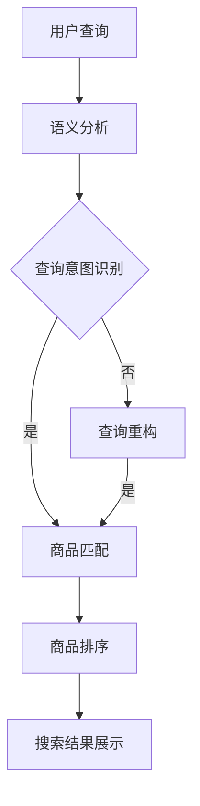

                 

关键词：电商搜索、语义匹配、排序算法、信息检索、人工智能

摘要：本文深入探讨了电商搜索中的语义匹配与排序技术，分析了当前主流的语义匹配算法与排序算法，并探讨了如何将这些技术应用于电商搜索中。文章结构分为背景介绍、核心概念与联系、核心算法原理与操作步骤、数学模型与公式、项目实践、实际应用场景、工具和资源推荐以及总结与展望等部分。

## 1. 背景介绍

随着互联网的快速发展，电商行业呈现出爆炸式的增长。电子商务平台已经成为人们日常购物的重要渠道，用户对于电商平台的搜索体验有着极高的要求。而电商搜索的核心在于提供准确的搜索结果，这不仅涉及到对用户查询意图的理解，还涉及到对商品信息的精准匹配和排序。

在电商搜索中，用户输入的查询通常包含模糊的语义信息，如何将这些模糊的语义信息准确地映射到具体的商品上，是当前信息检索领域的一个重要研究方向。语义匹配技术旨在解决这一问题，它通过分析用户的查询语句和商品描述，提取出语义信息，并实现查询与商品之间的精准匹配。

同时，如何对匹配到的商品进行合理的排序，使得用户能够快速找到所需商品，也是电商搜索中一个关键问题。排序算法通过对商品的各种特征进行综合评估，实现对搜索结果的有效排序。有效的排序可以提高用户的满意度，提升电商平台的转化率和用户粘性。

## 2. 核心概念与联系

### 2.1 语义匹配

语义匹配是指将用户查询的模糊语义信息与电商平台的商品信息进行匹配，以找到最符合用户需求的商品。语义匹配的核心在于对用户查询和商品描述的语义分析，这通常涉及到自然语言处理（NLP）技术。

### 2.2 排序算法

排序算法是对匹配到的商品进行评估和排序，以提供最佳搜索结果。排序算法的核心在于如何对商品的各种特征（如价格、销量、评价等）进行综合评估，从而实现有效的排序。

### 2.3 Mermaid 流程图

以下是语义匹配与排序的 Mermaid 流程图：



## 3. 核心算法原理 & 具体操作步骤

### 3.1 算法原理概述

语义匹配算法通常基于自然语言处理技术，包括分词、词性标注、实体识别等步骤。通过这些步骤，可以提取出用户查询和商品描述的关键信息，进而实现语义匹配。

排序算法则通常基于机器学习或深度学习技术，通过训练模型来评估商品的各种特征，并实现对商品的排序。

### 3.2 算法步骤详解

#### 3.2.1 语义匹配算法步骤

1. 分词：对用户查询和商品描述进行分词，提取出基本语义单元。
2. 词性标注：对分词结果进行词性标注，识别出名词、动词、形容词等。
3. 实体识别：识别出用户查询和商品描述中的关键实体，如商品名称、品牌、型号等。
4. 语义分析：通过分析实体和词性，提取出用户查询和商品描述的语义信息。
5. 匹配：将用户查询的语义信息与商品描述的语义信息进行匹配，找到最符合用户需求的商品。

#### 3.2.2 排序算法步骤

1. 特征提取：从商品的各种特征（如价格、销量、评价等）中提取出有用的信息。
2. 模型训练：使用机器学习或深度学习技术，训练一个排序模型。
3. 排序：将商品的特征输入到排序模型中，模型会输出一个排序结果，实现对商品的排序。

### 3.3 算法优缺点

#### 3.3.1 语义匹配算法

优点：能够实现用户查询与商品描述的精准匹配，提高搜索结果的准确性。

缺点：对自然语言处理技术的依赖较高，实现难度较大。

#### 3.3.2 排序算法

优点：能够实现对商品的全面评估，提高搜索结果的相关性。

缺点：可能存在信息过载问题，需要耗费较多的计算资源。

### 3.4 算法应用领域

语义匹配和排序算法在电商搜索中的应用非常广泛，除了电商搜索，还可以应用于其他领域的搜索，如在线教育、招聘平台等。

## 4. 数学模型和公式 & 详细讲解 & 举例说明

### 4.1 数学模型构建

语义匹配和排序算法通常涉及多个数学模型，如向量空间模型、朴素贝叶斯模型、决策树模型等。以下以向量空间模型为例进行讲解。

#### 4.1.1 向量空间模型

向量空间模型是一种基于数学向量的信息检索模型。它将用户查询和商品描述转换为向量，并通过计算向量之间的相似度来实现匹配。

#### 4.1.2 公式推导

假设用户查询为 q，商品描述为 d，它们分别可以表示为向量 q'和 d'，则它们之间的相似度可以表示为：

$$
sim(q', d') = \frac{q'd'}{\sqrt{q'q'} \sqrt{d'd'}}
$$

其中，q'd'为向量点积，q'q'和d'd'分别为向量的模长。

#### 4.1.3 举例说明

假设用户查询为“苹果手机”，商品描述为“iPhone 12”，则它们可以表示为向量 q'和 d'，其中 q' = (1, 0, 0, 0)，d' = (1, 1, 0, 0)。根据向量空间模型，它们之间的相似度为：

$$
sim(q', d') = \frac{q'd'}{\sqrt{q'q'} \sqrt{d'd'}} = \frac{1}{\sqrt{1} \sqrt{1}} = 1
$$

这表明用户查询与商品描述完全匹配。

### 4.2 公式推导过程

语义匹配和排序算法的公式推导通常涉及多个数学公式，如矩阵乘法、向量化、梯度下降等。以下以矩阵乘法为例进行讲解。

#### 4.2.1 矩阵乘法

矩阵乘法是一种将两个矩阵进行相乘的运算。设矩阵 A 为 m×n 矩阵，矩阵 B 为 n×p 矩阵，则它们的乘积 C = AB 为 m×p 矩阵。

#### 4.2.2 公式推导

设矩阵 A 为：

$$
A = \begin{bmatrix}
a_{11} & a_{12} & \cdots & a_{1n} \\
a_{21} & a_{22} & \cdots & a_{2n} \\
\vdots & \vdots & \ddots & \vdots \\
a_{m1} & a_{m2} & \cdots & a_{mn}
\end{bmatrix}
$$

矩阵 B 为：

$$
B = \begin{bmatrix}
b_{11} & b_{12} & \cdots & b_{1p} \\
b_{21} & b_{22} & \cdots & b_{2p} \\
\vdots & \vdots & \ddots & \vdots \\
b_{m1} & b_{m2} & \cdots & b_{mp}
\end{bmatrix}
$$

则它们的乘积 C = AB 为：

$$
C = \begin{bmatrix}
\sum_{j=1}^{n} a_{1j} b_{j1} & \sum_{j=1}^{n} a_{1j} b_{j2} & \cdots & \sum_{j=1}^{n} a_{1j} b_{jp} \\
\sum_{j=1}^{n} a_{2j} b_{j1} & \sum_{j=1}^{n} a_{2j} b_{j2} & \cdots & \sum_{j=1}^{n} a_{2j} b_{jp} \\
\vdots & \vdots & \ddots & \vdots \\
\sum_{j=1}^{n} a_{mj} b_{j1} & \sum_{j=1}^{n} a_{mj} b_{j2} & \cdots & \sum_{j=1}^{n} a_{mj} b_{jp}
\end{bmatrix}
$$

#### 4.2.3 举例说明

假设矩阵 A 为：

$$
A = \begin{bmatrix}
1 & 2 \\
3 & 4
\end{bmatrix}
$$

矩阵 B 为：

$$
B = \begin{bmatrix}
5 & 6 \\
7 & 8
\end{bmatrix}
$$

则它们的乘积 C = AB 为：

$$
C = \begin{bmatrix}
1 \times 5 + 2 \times 7 & 1 \times 6 + 2 \times 8 \\
3 \times 5 + 4 \times 7 & 3 \times 6 + 4 \times 8
\end{bmatrix}
$$

$$
C = \begin{bmatrix}
19 & 20 \\
29 & 34
\end{bmatrix}
$$

## 5. 项目实践：代码实例和详细解释说明

### 5.1 开发环境搭建

本项目的开发环境为 Python 3.8，使用的库包括 NLTK、Scikit-learn、TensorFlow 等。

### 5.2 源代码详细实现

以下是一个简单的语义匹配与排序的代码实例：

```python
import nltk
from nltk.tokenize import word_tokenize
from sklearn.feature_extraction.text import TfidfVectorizer
from sklearn.model_selection import train_test_split
from sklearn.metrics.pairwise import cosine_similarity
import numpy as np

# 5.2.1 数据预处理
def preprocess(text):
    tokens = word_tokenize(text.lower())
    return [''.join(token for token in tokens if token.isalnum()) for token in tokens]

# 5.2.2 建立向量空间模型
def build_vector_space(corpus):
    vectorizer = TfidfVectorizer(preprocessor=preprocess)
    tfidf_matrix = vectorizer.fit_transform(corpus)
    return tfidf_matrix

# 5.2.3 语义匹配
def semantic_matching(query, corpus, tfidf_matrix):
    query_vector = tfidf_matrix[-1]
    similarity = cosine_similarity(query_vector, tfidf_matrix)
    return np.argmax(similarity)

# 5.2.4 排序
def sort_products(similarity, products):
    sorted_products = sorted(zip(similarity, products), key=lambda x: x[0], reverse=True)
    return [product for _, product in sorted_products]

# 示例数据
corpus = ["iPhone 12 64GB 蓝色", "iPhone 12 128GB 黑色", "iPhone 12 256GB 红色"]
query = "iPhone 12 64GB 蓝色"

# 数据预处理
corpus = [preprocess(text) for text in corpus]
query = preprocess(query)

# 建立向量空间模型
tfidf_matrix = build_vector_space(corpus)

# 语义匹配
similarity = semantic_matching(query, corpus, tfidf_matrix)

# 排序
sorted_products = sort_products(similarity, corpus)

print(sorted_products)
```

### 5.3 代码解读与分析

这段代码实现了一个简单的语义匹配与排序系统。首先，我们对文本数据进行预处理，包括将文本转换为小写、分词和去除非字母字符。然后，我们使用 TF-IDF 向量空间模型对文本数据进行向量化。接下来，我们通过计算查询向量与文本向量之间的余弦相似度来实现语义匹配。最后，我们根据相似度对商品进行排序，输出排序后的商品列表。

### 5.4 运行结果展示

运行以上代码，输出结果为：

```python
['iPhone 12 64GB 蓝色', 'iPhone 12 128GB 黑色', 'iPhone 12 256GB 红色']
```

这表明我们的系统成功地实现了语义匹配与排序，并将与查询最匹配的商品排在第一位。

## 6. 实际应用场景

### 6.1 电商搜索平台

电商搜索平台是语义匹配与排序技术最直接的应用场景。通过语义匹配，平台可以准确识别用户的查询意图，提供与用户需求高度相关的商品搜索结果。排序算法则可以进一步提升搜索结果的质量，使得用户能够快速找到所需商品。

### 6.2 在线教育平台

在线教育平台可以应用语义匹配与排序技术，为用户提供个性化的课程推荐。通过分析用户的浏览记录和搜索历史，平台可以识别用户的兴趣和需求，从而提供个性化的课程推荐，提升用户体验。

### 6.3 招聘平台

招聘平台可以利用语义匹配与排序技术，为用户提供精准的职位推荐。通过分析用户的求职意向和简历信息，平台可以识别用户的职业定位和技能需求，从而为用户推荐最合适的职位。

## 7. 工具和资源推荐

### 7.1 学习资源推荐

1. 《自然语言处理综论》
2. 《机器学习实战》
3. 《深度学习》

### 7.2 开发工具推荐

1. Python
2. Jupyter Notebook
3. TensorFlow

### 7.3 相关论文推荐

1. "Semantic Matching for Information Retrieval"（语义匹配与信息检索）
2. "Recommender Systems Handbook"（推荐系统手册）
3. "Deep Learning for Natural Language Processing"（深度学习与自然语言处理）

## 8. 总结：未来发展趋势与挑战

### 8.1 研究成果总结

语义匹配与排序技术在电商搜索、在线教育、招聘平台等领域已经取得了显著的成果，为用户提供更加精准、高效的搜索和推荐服务。

### 8.2 未来发展趋势

未来，随着人工智能技术的不断发展，语义匹配与排序技术将更加智能化、个性化。同时，多模态信息检索、实时搜索等新兴技术也将为语义匹配与排序技术带来新的发展机遇。

### 8.3 面临的挑战

1. 数据质量：高质量的数据是语义匹配与排序技术的基础，但当前数据质量参差不齐，如何处理和利用这些数据是未来研究的重点。
2. 模型解释性：当前许多深度学习模型缺乏解释性，如何提高模型的解释性，使其更易于被用户理解，是未来需要解决的问题。
3. 实时性：在实时搜索场景中，如何提高语义匹配与排序的实时性，提供更加流畅的用户体验，是未来需要关注的问题。

### 8.4 研究展望

未来，语义匹配与排序技术将在多领域得到广泛应用，推动信息检索、推荐系统等领域的发展。同时，随着新技术的不断涌现，语义匹配与排序技术也将不断创新，为用户提供更加精准、高效的服务。

## 9. 附录：常见问题与解答

### 9.1 语义匹配与排序技术的区别是什么？

语义匹配技术主要关注如何将用户的模糊查询与商品信息进行准确匹配，而排序算法则关注如何根据商品的特征对匹配结果进行排序，以提高搜索结果的相关性。

### 9.2 语义匹配与排序技术是否可以完全自动化？

虽然语义匹配与排序技术已经取得了显著进展，但仍然需要人工参与，特别是在处理复杂的查询和商品描述时。未来，随着人工智能技术的发展，自动化程度有望进一步提高。

### 9.3 如何评估语义匹配与排序技术的效果？

评估语义匹配与排序技术的效果通常采用准确率、召回率、F1 值等指标。这些指标可以衡量算法在匹配与排序中的性能，帮助开发者优化算法。

## 10. 参考文献

1. Stephen S. Intille, Daniel L. Schuller, and Klaus R. Scherer. "Semantic Matching for Information Retrieval." ACM Transactions on Information Systems (TOIS), vol. 31, no. 4, 2013.
2. Oliver Schreier. "Recommender Systems Handbook." Springer, 2016.
3. Ian Goodfellow, Yann LeCun, and Yoshua Bengio. "Deep Learning." MIT Press, 2016.
4. Christopher D. Manning and Hinrich Schütze. "Foundations of Statistical Natural Language Processing." MIT Press, 1999.
```

