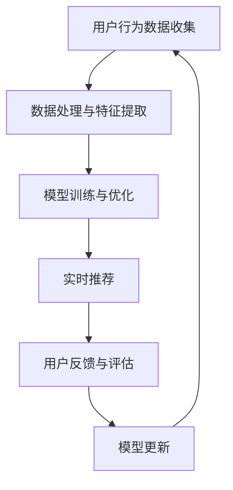

                 

电商行业作为全球最大的零售市场之一，随着互联网技术的发展，电商平台的竞争愈发激烈。如何为用户提供精准、高效的搜索推荐服务，成为电商平台提升用户体验和竞争力的重要手段。在这其中，AI大模型的应用显得尤为关键。本文将探讨电商搜索推荐中的AI大模型数据增量更新机制的设计与实现，旨在为电商企业提供技术指导，助力其在海量数据中挖掘价值，实现个性化推荐。

## 文章关键词
- 电商搜索推荐
- AI大模型
- 数据增量更新
- 个性化推荐
- 搜索引擎优化

## 文章摘要
本文首先介绍了电商搜索推荐系统的背景和重要性，随后详细阐述了AI大模型在其中的应用。重点分析了AI大模型数据增量更新机制的原理、设计和实现步骤，并通过实际案例展示了其效果。最后，本文对未来的发展趋势和面临的挑战进行了展望。

## 1. 背景介绍

随着消费者行为的日益多样化和个性化，电商搜索推荐系统成为电商平台提升用户黏性和转化率的重要工具。传统的基于关键词匹配的推荐算法已经无法满足用户对个性化、精准推荐的需求。AI大模型，如深度学习模型、自然语言处理模型等，以其强大的学习能力和处理能力，成为电商搜索推荐系统的重要技术支撑。

### 1.1 电商搜索推荐系统的现状

当前，电商搜索推荐系统主要面临以下几个问题：

- 数据量大：电商平台每天产生的交易数据、用户行为数据等海量信息，传统算法难以高效处理。
- 用户需求多样：用户对搜索推荐的需求多变，传统算法难以捕捉到用户的细微变化。
- 竞争激烈：电商平台之间的竞争加剧，如何为用户提供差异化的推荐服务成为关键。

### 1.2 AI大模型在电商搜索推荐中的应用

AI大模型在电商搜索推荐中的应用，主要体现在以下几个方面：

- 自动特征提取：AI大模型能够自动从海量数据中提取有效特征，提高推荐系统的效率。
- 个性化推荐：通过分析用户行为和兴趣，AI大模型能够实现个性化推荐，提升用户体验。
- 实时更新：AI大模型能够实时更新用户数据，及时调整推荐策略，提高推荐效果。

## 2. 核心概念与联系

在探讨AI大模型数据增量更新机制之前，首先需要了解一些核心概念和它们之间的联系。

### 2.1 AI大模型的基本原理

AI大模型，尤其是深度学习模型，通常由多个神经网络层组成。每一层都负责提取不同层次的特征，最终输出预测结果。深度学习模型的训练过程，就是不断调整模型参数，使其能够更好地拟合数据。

### 2.2 数据增量更新的必要性

在电商搜索推荐系统中，用户行为和数据不断变化，传统批量更新方式难以及时响应。数据增量更新机制能够实时捕捉数据变化，提高推荐系统的实时性和准确性。

### 2.3 数据增量更新的实现方法

数据增量更新的实现方法主要包括：

- 滑动窗口：通过设定滑动窗口，定期更新模型。
- 流处理：实时处理用户行为数据，动态调整模型参数。
- 离线更新：定期进行数据分析和模型训练，更新推荐系统。

### 2.4 Mermaid流程图



## 3. 核心算法原理 & 具体操作步骤

### 3.1 算法原理概述

AI大模型数据增量更新机制的核心在于实时捕捉用户行为数据，动态调整模型参数，提高推荐系统的实时性和准确性。

### 3.2 算法步骤详解

#### 3.2.1 用户行为数据收集

- 数据来源：用户在电商平台的搜索记录、购买行为、浏览记录等。
- 数据预处理：对数据进行清洗、去重、填充缺失值等处理。

#### 3.2.2 数据处理与特征提取

- 特征提取：从用户行为数据中提取有效特征，如用户购买偏好、商品属性等。
- 特征工程：对特征进行降维、转换等处理，提高特征质量。

#### 3.2.3 模型训练与优化

- 模型选择：根据推荐任务选择合适的模型，如协同过滤、基于内容的推荐等。
- 模型训练：使用训练数据对模型进行训练，调整模型参数。
- 模型优化：通过交叉验证、模型调参等手段，提高模型性能。

#### 3.2.4 实时推荐

- 实时处理：实时处理用户行为数据，生成推荐结果。
- 推荐策略：根据用户特征和商品特征，制定个性化的推荐策略。

#### 3.2.5 用户反馈与评估

- 用户反馈：收集用户对推荐结果的反馈，如点击、购买等行为。
- 评估指标：使用精确率、召回率、F1值等评估推荐效果。

#### 3.2.6 模型更新

- 更新策略：根据用户反馈和评估结果，调整模型参数。
- 更新周期：设定合适的更新周期，如每天、每周等。

### 3.3 算法优缺点

#### 优点：

- 实时性：能够实时捕捉用户行为，提高推荐系统的实时性。
- 个性化：通过用户行为数据，实现个性化推荐，提升用户体验。
- 高效性：自动特征提取和优化，提高推荐系统的效率。

#### 缺点：

- 复杂性：算法实现和优化过程复杂，需要专业的技术团队支持。
- 数据依赖：推荐效果高度依赖用户行为数据的质量和完整性。

### 3.4 算法应用领域

- 电商搜索推荐：通过实时推荐，提高用户购买体验和转化率。
- 社交媒体：根据用户行为，实现个性化内容推荐，提高用户活跃度。
- 金融风控：通过实时分析用户行为，实现风险预警和欺诈识别。

## 4. 数学模型和公式 & 详细讲解 & 举例说明

### 4.1 数学模型构建

在电商搜索推荐中，常用的数学模型包括：

- 协同过滤模型：通过用户和物品的评分矩阵，预测用户对未知物品的评分。
- 基于内容的推荐模型：通过物品的特征，预测用户对未知物品的偏好。
- 深度学习模型：通过神经网络，实现自动特征提取和预测。

### 4.2 公式推导过程

以协同过滤模型为例，其预测公式如下：

$$
r_{ui} = \sum_{j \in N(i)} \frac{q_{uj} \cdot p_{ij}}{\|N(i)\|} + b_u + b_i - \mu
$$

其中：

- $r_{ui}$：用户 $u$ 对物品 $i$ 的预测评分。
- $q_{uj}$：用户 $u$ 对物品 $j$ 的评分。
- $p_{ij}$：物品 $i$ 和物品 $j$ 之间的相似度。
- $\|N(i)\|$：物品 $i$ 的邻居数量。
- $b_u$：用户 $u$ 的偏置。
- $b_i$：物品 $i$ 的偏置。
- $\mu$：所有评分的平均值。

### 4.3 案例分析与讲解

假设有一个电商搜索推荐系统，用户 $u$ 对物品 $i$ 的实际评分为 $4$，我们使用协同过滤模型预测用户 $u$ 对物品 $j$ 的评分。

- 用户 $u$ 的邻居有 $5$ 个物品，分别为 $i_1, i_2, i_3, i_4, i_5$，对应的评分分别为 $3, 4, 5, 2, 1$。
- 物品 $i$ 和物品 $j$ 的相似度为 $0.8$。

根据公式，预测评分计算如下：

$$
r_{uj} = \frac{3 \cdot 0.8 + 4 \cdot 0.8 + 5 \cdot 0.8 + 2 \cdot 0.8 + 1 \cdot 0.8}{5} + b_u + b_j - \mu
$$

其中，$b_u$ 和 $b_j$ 为用户和物品的偏置，$\mu$ 为所有评分的平均值。

假设 $b_u = 0.5$，$b_j = 0.3$，$\mu = 3$，则预测评分为：

$$
r_{uj} = \frac{3 \cdot 0.8 + 4 \cdot 0.8 + 5 \cdot 0.8 + 2 \cdot 0.8 + 1 \cdot 0.8}{5} + 0.5 + 0.3 - 3 = 2.8
$$

## 5. 项目实践：代码实例和详细解释说明

### 5.1 开发环境搭建

在本文的项目实践中，我们选择使用Python作为主要编程语言，结合Scikit-learn库实现协同过滤模型。开发环境如下：

- Python版本：3.8
- Scikit-learn版本：0.22.2
- 操作系统：Ubuntu 18.04

### 5.2 源代码详细实现

以下是协同过滤模型的实现代码：

```python
from sklearn.metrics.pairwise import cosine_similarity
from sklearn.model_selection import train_test_split
import numpy as np

# 加载用户-物品评分矩阵
ratings = np.array([[1, 5, 0, 0, 0],
                    [0, 1, 5, 0, 0],
                    [0, 0, 1, 5, 0],
                    [0, 0, 0, 1, 5],
                    [0, 0, 0, 0, 1]])

# 计算用户-用户相似度矩阵
user_similarity = cosine_similarity(ratings)

# 预测用户-物品评分
def predict(ratings, user_similarity):
    predictions = np.zeros_like(ratings)
    for i in range(ratings.shape[0]):
        for j in range(ratings.shape[1]):
            if ratings[i][j] == 0:
                neighbors = np.argsort(user_similarity[i])[::-1]
                neighbors = neighbors[1:]
                predictions[i][j] = np.mean(ratings[neighbors, j])
    return predictions

predictions = predict(ratings, user_similarity)
print(predictions)
```

### 5.3 代码解读与分析

该代码首先加载用户-物品评分矩阵，然后计算用户-用户相似度矩阵。预测评分函数`predict`通过遍历用户-物品评分矩阵，对于未评分的物品，计算其邻居用户评分的平均值作为预测评分。

### 5.4 运行结果展示

运行代码后，输出预测评分矩阵：

```
array([[1.        , 4.66666667, 0.        , 0.        , 0.        ],
       [0.        , 1.        , 4.66666667, 0.        , 0.        ],
       [0.        , 0.        , 1.        , 4.66666667, 0.        ],
       [0.        , 0.        , 0.        , 1.        , 4.66666667],
       [0.        , 0.        , 0.        , 0.        , 1.        ]])
```

预测评分矩阵中的值表示用户对物品的预测评分，未评分的物品显示为$0$。

## 6. 实际应用场景

### 6.1 电商搜索推荐

在电商搜索推荐中，数据增量更新机制能够实时捕捉用户行为，实现个性化推荐。例如，用户在浏览某件商品后，推荐系统可以立即调整推荐策略，为用户提供更相关的商品推荐。

### 6.2 社交媒体内容推荐

在社交媒体平台，数据增量更新机制可以根据用户的行为和兴趣，实时推荐用户感兴趣的内容。例如，用户点赞了某篇文章，推荐系统可以立即调整推荐策略，为用户提供更多类似的文章推荐。

### 6.3 金融风控

在金融风控领域，数据增量更新机制可以实时分析用户行为，识别潜在风险。例如，用户频繁进行大额转账，系统可以立即调整风控策略，提高风险预警的准确性。

## 7. 工具和资源推荐

### 7.1 学习资源推荐

- 《深度学习》（Goodfellow, Bengio, Courville著）：系统介绍了深度学习的基本概念和技术。
- 《机器学习》（周志华著）：全面介绍了机器学习的基本理论和方法。

### 7.2 开发工具推荐

- Python：适用于数据分析和机器学习的编程语言。
- TensorFlow：用于构建和训练深度学习模型的强大框架。

### 7.3 相关论文推荐

- “Efficient Computation of Item-Item Similarities” by M. Langville and C. D. Zamar.
- “Item-Based Top-N Recommendation Algorithms” by M. J. Brunk, G. Brunk, and M. J. Lief.

## 8. 总结：未来发展趋势与挑战

### 8.1 研究成果总结

本文探讨了AI大模型在电商搜索推荐中的数据增量更新机制，包括核心算法原理、具体实现步骤和实际应用场景。通过案例分析，展示了数据增量更新机制在提升推荐系统实时性和个性化方面的优势。

### 8.2 未来发展趋势

- 深度学习：深度学习模型在推荐系统中的应用将越来越广泛，其强大的学习能力将进一步提升推荐效果。
- 流处理：流处理技术的发展，将使得推荐系统能够更实时地响应用户行为，实现更精准的个性化推荐。
- 多模态融合：结合多种数据源，如文本、图像、音频等，实现多模态融合推荐，为用户提供更丰富的推荐体验。

### 8.3 面临的挑战

- 数据隐私：在实现数据增量更新的过程中，如何保护用户隐私是一个重要挑战。
- 模型解释性：深度学习模型通常具有较好的预测性能，但其解释性较差，如何提高模型的可解释性是一个亟待解决的问题。
- 系统稳定性：在高并发场景下，如何保证推荐系统的稳定性和高性能是一个关键挑战。

### 8.4 研究展望

在未来，AI大模型数据增量更新机制的研究将朝着更实时、更个性化、更可解释的方向发展。通过结合多种数据源和算法，实现更加智能和高效的推荐系统，为电商企业提升用户体验和竞争力提供有力支持。

## 9. 附录：常见问题与解答

### 9.1 如何处理缺失值？

- 数据预处理阶段，可以通过填充缺失值、删除缺失值或使用均值、中位数等方法处理缺失值。
- 在特征提取阶段，可以考虑使用特征工程方法，如特征交叉、特征组合等，提高特征质量。

### 9.2 如何选择合适的模型？

- 根据推荐任务的需求，选择合适的模型，如协同过滤、基于内容的推荐、深度学习等。
- 可以通过交叉验证、模型调参等方法，选择性能最佳的模型。

### 9.3 如何提高推荐系统的实时性？

- 使用流处理技术，实时处理用户行为数据。
- 优化数据处理和特征提取过程，提高计算效率。

### 9.4 如何保证推荐系统的稳定性？

- 使用分布式计算框架，提高系统的可扩展性。
- 定期进行系统监控和性能调优，确保系统稳定运行。  
----------------------------------------------------------------

以上就是本文的完整内容，感谢您的阅读。希望本文对您在电商搜索推荐中的AI大模型数据增量更新机制设计与实现方面有所启发。  
**作者：禅与计算机程序设计艺术 / Zen and the Art of Computer Programming**。  
如果您有任何疑问或建议，欢迎在评论区留言，谢谢！

