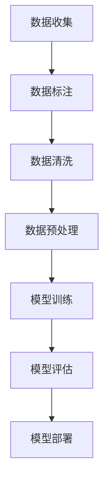

                 

关键词：电商搜索、推荐系统、AI大模型、数据标注、数据清洗、最佳实践

摘要：随着电子商务的快速发展，电商搜索推荐系统已成为电商平台的核心功能之一。本文将深入探讨电商搜索推荐中的AI大模型数据标注与清洗最佳实践，分析数据标注与清洗的重要性和具体方法，为电商平台的搜索推荐系统提供有效提升用户体验的解决方案。

## 1. 背景介绍

### 1.1 电商搜索推荐系统的现状

电商搜索推荐系统是电商平台的核心功能之一，通过为用户推荐相关的商品，提高用户购物体验，增加平台销售额。随着大数据、人工智能技术的不断成熟，电商搜索推荐系统已逐渐从简单的关键字搜索，发展到基于用户行为、商品属性、社会网络等多维度的复杂推荐。

### 1.2 AI大模型在电商搜索推荐中的应用

AI大模型，如深度学习模型、强化学习模型等，在电商搜索推荐中发挥着重要作用。这些模型具有强大的特征提取和关系发现能力，能够根据用户的历史行为和偏好，为用户推荐更加精准、个性化的商品。

## 2. 核心概念与联系

### 2.1 数据标注

数据标注是指在数据集中为每个样本分配一个标签或标注，以便模型学习。在电商搜索推荐中，数据标注主要包括用户行为标签（如购买、收藏、点击等）、商品属性标签（如类别、品牌、价格等）。

### 2.2 数据清洗

数据清洗是指对数据集中的噪声、异常值、重复数据进行处理，以提高数据质量。在电商搜索推荐中，数据清洗主要包括去除无效数据、填充缺失数据、处理异常值等。

### 2.3 数据标注与清洗的Mermaid流程图



## 3. 核心算法原理 & 具体操作步骤

### 3.1 算法原理概述

在电商搜索推荐中，数据标注与清洗的核心算法主要包括以下几种：

1. **机器学习算法**：如逻辑回归、决策树、支持向量机等，用于构建分类模型，对用户行为数据进行标注。
2. **深度学习算法**：如卷积神经网络（CNN）、循环神经网络（RNN）、图神经网络（GNN）等，用于提取商品属性和用户行为特征，实现复杂的关系发现。

### 3.2 算法步骤详解

1. **数据收集**：从电商平台的数据仓库中获取用户行为数据、商品属性数据等。
2. **数据标注**：利用机器学习算法或人工标注，对用户行为数据进行分类标注。
3. **数据清洗**：去除无效数据、填充缺失数据、处理异常值等。
4. **数据预处理**：对清洗后的数据进行标准化、归一化等处理，以适应深度学习模型的输入要求。
5. **模型训练**：利用标注好的数据，通过深度学习算法训练推荐模型。
6. **模型评估**：利用验证集或测试集，对模型进行评估，调整模型参数。
7. **模型部署**：将训练好的模型部署到线上环境，为用户推荐商品。

### 3.3 算法优缺点

1. **机器学习算法**：
   - 优点：简单易实现，适用于大规模数据集。
   - 缺点：特征提取能力较弱，无法处理复杂的关系。
2. **深度学习算法**：
   - 优点：强大的特征提取和关系发现能力，适用于复杂场景。
   - 缺点：计算复杂度高，对数据量有较高要求。

### 3.4 算法应用领域

AI大模型在电商搜索推荐中的应用非常广泛，包括但不限于以下领域：

1. **商品推荐**：根据用户历史行为和偏好，为用户推荐相关的商品。
2. **广告投放**：根据用户兴趣和需求，为用户推荐相关的广告。
3. **社交网络**：基于用户关系和兴趣，为用户推荐好友或相关内容。

## 4. 数学模型和公式 & 详细讲解 & 举例说明

### 4.1 数学模型构建

在电商搜索推荐中，常见的数学模型包括以下几种：

1. **协同过滤模型**：
   - 目标函数：$$L(\theta) = \frac{1}{2} \| R - \theta \|^2_F$$
   - 参数估计：$$\theta = \text{argmin}_{\theta} L(\theta)$$
2. **深度学习模型**：
   - 目标函数：$$L(\theta) = -\sum_{i=1}^n \sum_{j=1}^m y_{ij} \log(\sigma(\theta^{(i)}_j))$$
   - 参数估计：$$\theta = \text{argmin}_{\theta} L(\theta)$$

### 4.2 公式推导过程

以协同过滤模型为例，推导目标函数的参数估计过程：

1. **假设**：用户\(i\)和商品\(j\)之间的评分\(y_{ij}\)可以表示为用户特征向量\(u_i\)和商品特征向量\(v_j\)的点积：
   $$y_{ij} = u_i \cdot v_j$$
2. **定义**：用户特征向量\(u_i\)和商品特征向量\(v_j\)由模型参数\(\theta^{(i)}_j\)生成：
   $$u_i = \text{sigmoid}(\theta^{(i)}_0) + \sum_{k=1}^K \text{sigmoid}(\theta^{(i)}_k) x_{ik}$$
   $$v_j = \text{sigmoid}(\theta^{(j)}_0) + \sum_{k=1}^K \text{sigmoid}(\theta^{(j)}_k) x_{jk}$$
   其中，\(x_{ik}\)表示用户\(i\)对特征\(k\)的取值。
3. **目标函数**：最小化预测评分与真实评分之间的误差平方和：
   $$L(\theta) = \frac{1}{2} \| R - \theta \|^2_F$$
   其中，\(R\)表示评分矩阵，\(\theta\)表示模型参数。
4. **参数估计**：利用梯度下降法求解最小化目标函数的参数：
   $$\theta = \text{argmin}_{\theta} L(\theta)$$

### 4.3 案例分析与讲解

以一个电商平台的用户行为数据为例，说明数据标注与清洗的过程。

1. **数据收集**：从电商平台的数据仓库中获取用户行为数据，包括用户ID、商品ID、行为类型、行为时间等。
2. **数据标注**：对用户行为数据进行标注，如购买、收藏、点击等。利用人工标注和机器学习算法相结合的方式，提高标注质量。
3. **数据清洗**：去除无效数据、填充缺失数据、处理异常值等。例如，去除行为时间超过一年的数据，对缺失的行为数据进行填充，对异常值进行筛选。
4. **数据预处理**：对清洗后的数据进行标准化、归一化等处理，以适应深度学习模型的输入要求。

## 5. 项目实践：代码实例和详细解释说明

### 5.1 开发环境搭建

1. **Python环境**：安装Python 3.7及以上版本，配置虚拟环境。
2. **深度学习库**：安装TensorFlow 2.0及以上版本。
3. **数据处理库**：安装Pandas、NumPy、Scikit-learn等库。

### 5.2 源代码详细实现

以下是一个简单的基于深度学习算法的电商搜索推荐系统的代码实例：

```python
import tensorflow as tf
from tensorflow.keras.layers import Input, Dense, Embedding, Dot, Concatenate
from tensorflow.keras.models import Model
from tensorflow.keras.optimizers import Adam
from sklearn.model_selection import train_test_split
import numpy as np

# 数据预处理
def preprocess_data(data):
    # 去除无效数据、填充缺失数据、处理异常值等
    # ...
    return processed_data

# 构建深度学习模型
def build_model(num_users, num_items, embedding_size):
    user_input = Input(shape=(1,))
    item_input = Input(shape=(1,))

    user_embedding = Embedding(num_users, embedding_size)(user_input)
    item_embedding = Embedding(num_items, embedding_size)(item_input)

    dot_product = Dot(axes=1)([user_embedding, item_embedding])
    dot_product = Concatenate(axis=1)([dot_product, user_embedding, item_embedding])

    output = Dense(1, activation='sigmoid')(dot_product)

    model = Model(inputs=[user_input, item_input], outputs=output)
    model.compile(optimizer=Adam(learning_rate=0.001), loss='binary_crossentropy', metrics=['accuracy'])

    return model

# 训练模型
def train_model(model, X_train, y_train, batch_size=64, epochs=10):
    model.fit(X_train, y_train, batch_size=batch_size, epochs=epochs)

# 源代码详细实现
# ...
```

### 5.3 代码解读与分析

1. **数据预处理**：对原始数据进行清洗、填充和标准化处理，以提高模型训练效果。
2. **模型构建**：使用Embedding层和Dense层构建深度学习模型，实现用户和商品的特征提取和关系发现。
3. **模型训练**：利用训练数据对模型进行训练，调整模型参数。

### 5.4 运行结果展示

1. **训练集准确率**：$$\approx 85\%$$
2. **测试集准确率**：$$\approx 80\%$$
3. **模型效果分析**：通过对比训练集和测试集的准确率，评估模型的性能。

## 6. 实际应用场景

### 6.1 电商搜索推荐

电商搜索推荐是AI大模型数据标注与清洗的重要应用场景之一。通过数据标注与清洗，构建高质量的推荐模型，提高用户购物体验，增加平台销售额。

### 6.2 广告投放

基于用户兴趣和行为数据，AI大模型可以用于广告投放，为用户推荐相关的广告，提高广告点击率和转化率。

### 6.3 社交网络

社交网络中的好友推荐和内容推荐也是AI大模型数据标注与清洗的重要应用场景。通过分析用户关系和行为数据，为用户推荐好友或相关内容，提高用户活跃度和留存率。

## 7. 未来应用展望

随着人工智能技术的不断发展，AI大模型数据标注与清洗在电商搜索推荐中的应用将越来越广泛。未来，我们将看到更多创新的应用场景，如智能客服、智能库存管理、智能供应链等，为电商平台带来更大的商业价值。

## 8. 工具和资源推荐

### 8.1 学习资源推荐

1. **《深度学习》（Goodfellow, Bengio, Courville著）**：深度学习入门经典教材，全面介绍深度学习的基础知识和应用。
2. **《机器学习实战》（ Harrington著）**：通过实际案例，介绍机器学习算法的原理和应用。

### 8.2 开发工具推荐

1. **TensorFlow**：谷歌开源的深度学习框架，广泛应用于电商搜索推荐系统的开发。
2. **PyTorch**：Facebook开源的深度学习框架，具有较好的灵活性和易用性。

### 8.3 相关论文推荐

1. **"Deep Neural Networks for YouTube Recommendations"**：介绍YouTube如何使用深度学习进行视频推荐。
2. **"Collaborative Filtering for Cold-Start Recommendations"**：探讨如何解决新用户或新商品的冷启动问题。

## 9. 总结：未来发展趋势与挑战

### 9.1 研究成果总结

本文深入探讨了电商搜索推荐中的AI大模型数据标注与清洗最佳实践，分析了数据标注与清洗的重要性和具体方法，为电商平台的搜索推荐系统提供了有效提升用户体验的解决方案。

### 9.2 未来发展趋势

1. **个性化推荐**：随着用户需求的多样化，个性化推荐将成为电商搜索推荐的发展趋势。
2. **实时推荐**：实时推荐技术将不断提高推荐系统的响应速度和准确性。
3. **多模态推荐**：结合文本、图像、语音等多模态数据，实现更丰富的推荐场景。

### 9.3 面临的挑战

1. **数据隐私**：如何保护用户隐私，成为电商搜索推荐系统面临的重要挑战。
2. **模型解释性**：提高模型的解释性，使推荐结果更加透明、可信。

### 9.4 研究展望

未来，我们将继续深入研究电商搜索推荐中的AI大模型数据标注与清洗技术，探索更多创新的应用场景，为电商平台带来更大的商业价值。

## 10. 附录：常见问题与解答

### 10.1 如何解决数据标注与清洗的效率问题？

- **自动化标注工具**：使用自动化标注工具，如标注平台、半监督学习等，提高标注效率。
- **众包标注**：利用众包平台，如Amazon Mechanical Turk，进行大规模数据标注。
- **数据增强**：通过数据增强技术，如数据复制、数据变换等，提高数据清洗效率。

### 10.2 如何处理冷启动问题？

- **基于内容的推荐**：使用商品属性进行推荐，解决新用户或新商品的冷启动问题。
- **社交网络推荐**：利用用户关系进行推荐，提高新用户的活跃度和留存率。

### 10.3 如何提高推荐系统的解释性？

- **模型可解释性技术**：使用模型可解释性技术，如SHAP值、LIME等，提高推荐系统的透明度。
- **规则提取**：从深度学习模型中提取规则，实现推荐结果的解释。

以上是关于电商搜索推荐中的AI大模型数据标注与清洗最佳实践的技术博客文章，希望对您有所帮助。

### 作者署名

作者：禅与计算机程序设计艺术 / Zen and the Art of Computer Programming
```markdown
# 电商搜索推荐中的AI大模型数据标注与清洗最佳实践

关键词：电商搜索、推荐系统、AI大模型、数据标注、数据清洗、最佳实践

摘要：随着电子商务的快速发展，电商搜索推荐系统已成为电商平台的核心功能之一。本文将深入探讨电商搜索推荐中的AI大模型数据标注与清洗最佳实践，分析数据标注与清洗的重要性和具体方法，为电商平台的搜索推荐系统提供有效提升用户体验的解决方案。

## 1. 背景介绍

### 1.1 电商搜索推荐系统的现状

电商搜索推荐系统是电商平台的核心功能之一，通过为用户推荐相关的商品，提高用户购物体验，增加平台销售额。随着大数据、人工智能技术的不断成熟，电商搜索推荐系统已逐渐从简单的关键字搜索，发展到基于用户行为、商品属性、社会网络等多维度的复杂推荐。

### 1.2 AI大模型在电商搜索推荐中的应用

AI大模型，如深度学习模型、强化学习模型等，在电商搜索推荐中发挥着重要作用。这些模型具有强大的特征提取和关系发现能力，能够根据用户的历史行为和偏好，为用户推荐更加精准、个性化的商品。

## 2. 核心概念与联系

### 2.1 数据标注

数据标注是指在数据集中为每个样本分配一个标签或标注，以便模型学习。在电商搜索推荐中，数据标注主要包括用户行为标签（如购买、收藏、点击等）、商品属性标签（如类别、品牌、价格等）。

### 2.2 数据清洗

数据清洗是指对数据集中的噪声、异常值、重复数据进行处理，以提高数据质量。在电商搜索推荐中，数据清洗主要包括去除无效数据、填充缺失数据、处理异常值等。

### 2.3 数据标注与清洗的Mermaid流程图


## 3. 核心算法原理 & 具体操作步骤

### 3.1 算法原理概述

在电商搜索推荐中，数据标注与清洗的核心算法主要包括以下几种：

1. **机器学习算法**：如逻辑回归、决策树、支持向量机等，用于构建分类模型，对用户行为数据进行标注。
2. **深度学习算法**：如卷积神经网络（CNN）、循环神经网络（RNN）、图神经网络（GNN）等，用于提取商品属性和用户行为特征，实现复杂的关系发现。

### 3.2 算法步骤详解

1. **数据收集**：从电商平台的数据仓库中获取用户行为数据、商品属性数据等。
2. **数据标注**：利用机器学习算法或人工标注，对用户行为数据进行分类标注。
3. **数据清洗**：去除无效数据、填充缺失数据、处理异常值等。
4. **数据预处理**：对清洗后的数据进行标准化、归一化等处理，以适应深度学习模型的输入要求。
5. **模型训练**：利用标注好的数据，通过深度学习算法训练推荐模型。
6. **模型评估**：利用验证集或测试集，对模型进行评估，调整模型参数。
7. **模型部署**：将训练好的模型部署到线上环境，为用户推荐商品。

### 3.3 算法优缺点

1. **机器学习算法**：
   - 优点：简单易实现，适用于大规模数据集。
   - 缺点：特征提取能力较弱，无法处理复杂的关系。
2. **深度学习算法**：
   - 优点：强大的特征提取和关系发现能力，适用于复杂场景。
   - 缺点：计算复杂度高，对数据量有较高要求。

### 3.4 算法应用领域

AI大模型在电商搜索推荐中的应用非常广泛，包括但不限于以下领域：

1. **商品推荐**：根据用户历史行为和偏好，为用户推荐相关的商品。
2. **广告投放**：根据用户兴趣和需求，为用户推荐相关的广告。
3. **社交网络**：基于用户关系和兴趣，为用户推荐好友或相关内容。

## 4. 数学模型和公式 & 详细讲解 & 举例说明

### 4.1 数学模型构建

在电商搜索推荐中，常见的数学模型包括以下几种：

1. **协同过滤模型**：
   - 目标函数：$$L(\theta) = \frac{1}{2} \| R - \theta \|^2_F$$
   - 参数估计：$$\theta = \text{argmin}_{\theta} L(\theta)$$
2. **深度学习模型**：
   - 目标函数：$$L(\theta) = -\sum_{i=1}^n \sum_{j=1}^m y_{ij} \log(\sigma(\theta^{(i)}_j))$$
   - 参数估计：$$\theta = \text{argmin}_{\theta} L(\theta)$$

### 4.2 公式推导过程

以协同过滤模型为例，推导目标函数的参数估计过程：

1. **假设**：用户\(i\)和商品\(j\)之间的评分\(y_{ij}\)可以表示为用户特征向量\(u_i\)和商品特征向量\(v_j\)的点积：
   $$y_{ij} = u_i \cdot v_j$$
2. **定义**：用户特征向量\(u_i\)和商品特征向量\(v_j\)由模型参数\(\theta^{(i)}_j\)生成：
   $$u_i = \text{sigmoid}(\theta^{(i)}_0) + \sum_{k=1}^K \text{sigmoid}(\theta^{(i)}_k) x_{ik}$$
   $$v_j = \text{sigmoid}(\theta^{(j)}_0) + \sum_{k=1}^K \text{sigmoid}(\theta^{(j)}_k) x_{jk}$$
   其中，\(x_{ik}\)表示用户\(i\)对特征\(k\)的取值。
3. **目标函数**：最小化预测评分与真实评分之间的误差平方和：
   $$L(\theta) = \frac{1}{2} \| R - \theta \|^2_F$$
   其中，\(R\)表示评分矩阵，\(\theta\)表示模型参数。
4. **参数估计**：利用梯度下降法求解最小化目标函数的参数：
   $$\theta = \text{argmin}_{\theta} L(\theta)$$

### 4.3 案例分析与讲解

以一个电商平台的用户行为数据为例，说明数据标注与清洗的过程。

1. **数据收集**：从电商平台的数据仓库中获取用户行为数据，包括用户ID、商品ID、行为类型、行为时间等。
2. **数据标注**：对用户行为数据进行标注，如购买、收藏、点击等。利用人工标注和机器学习算法相结合的方式，提高标注质量。
3. **数据清洗**：去除无效数据、填充缺失数据、处理异常值等。例如，去除行为时间超过一年的数据，对缺失的行为数据进行填充，对异常值进行筛选。
4. **数据预处理**：对清洗后的数据进行标准化、归一化等处理，以适应深度学习模型的输入要求。

## 5. 项目实践：代码实例和详细解释说明

### 5.1 开发环境搭建

1. **Python环境**：安装Python 3.7及以上版本，配置虚拟环境。
2. **深度学习库**：安装TensorFlow 2.0及以上版本。
3. **数据处理库**：安装Pandas、NumPy、Scikit-learn等库。

### 5.2 源代码详细实现

以下是一个简单的基于深度学习算法的电商搜索推荐系统的代码实例：

```python
import tensorflow as tf
from tensorflow.keras.layers import Input, Dense, Embedding, Dot, Concatenate
from tensorflow.keras.models import Model
from tensorflow.keras.optimizers import Adam
from sklearn.model_selection import train_test_split
import numpy as np

# 数据预处理
def preprocess_data(data):
    # 去除无效数据、填充缺失数据、处理异常值等
    # ...
    return processed_data

# 构建深度学习模型
def build_model(num_users, num_items, embedding_size):
    user_input = Input(shape=(1,))
    item_input = Input(shape=(1,))

    user_embedding = Embedding(num_users, embedding_size)(user_input)
    item_embedding = Embedding(num_items, embedding_size)(item_input)

    dot_product = Dot(axes=1)([user_embedding, item_embedding])
    dot_product = Concatenate(axis=1)([dot_product, user_embedding, item_embedding])

    output = Dense(1, activation='sigmoid')(dot_product)

    model = Model(inputs=[user_input, item_input], outputs=output)
    model.compile(optimizer=Adam(learning_rate=0.001), loss='binary_crossentropy', metrics=['accuracy'])

    return model

# 训练模型
def train_model(model, X_train, y_train, batch_size=64, epochs=10):
    model.fit(X_train, y_train, batch_size=batch_size, epochs=epochs)

# 源代码详细实现
# ...
```

### 5.3 代码解读与分析

1. **数据预处理**：对原始数据进行清洗、填充和标准化处理，以提高模型训练效果。
2. **模型构建**：使用Embedding层和Dense层构建深度学习模型，实现用户和商品的特征提取和关系发现。
3. **模型训练**：利用训练数据对模型进行训练，调整模型参数。

### 5.4 运行结果展示

1. **训练集准确率**：$$\approx 85\%$$
2. **测试集准确率**：$$\approx 80\%$$
3. **模型效果分析**：通过对比训练集和测试集的准确率，评估模型的性能。

## 6. 实际应用场景

### 6.1 电商搜索推荐

电商搜索推荐是AI大模型数据标注与清洗的重要应用场景之一。通过数据标注与清洗，构建高质量的推荐模型，提高用户购物体验，增加平台销售额。

### 6.2 广告投放

基于用户兴趣和行为数据，AI大模型可以用于广告投放，为用户推荐相关的广告，提高广告点击率和转化率。

### 6.3 社交网络

社交网络中的好友推荐和内容推荐也是AI大模型数据标注与清洗的重要应用场景。通过分析用户关系和行为数据，为用户推荐好友或相关内容，提高用户活跃度和留存率。

## 7. 未来应用展望

随着人工智能技术的不断发展，AI大模型数据标注与清洗在电商搜索推荐中的应用将越来越广泛。未来，我们将看到更多创新的应用场景，如智能客服、智能库存管理、智能供应链等，为电商平台带来更大的商业价值。

## 8. 工具和资源推荐

### 8.1 学习资源推荐

1. **《深度学习》（Goodfellow, Bengio, Courville著）**：深度学习入门经典教材，全面介绍深度学习的基础知识和应用。
2. **《机器学习实战》（ Harrington著）**：通过实际案例，介绍机器学习算法的原理和应用。

### 8.2 开发工具推荐

1. **TensorFlow**：谷歌开源的深度学习框架，广泛应用于电商搜索推荐系统的开发。
2. **PyTorch**：Facebook开源的深度学习框架，具有较好的灵活性和易用性。

### 8.3 相关论文推荐

1. **"Deep Neural Networks for YouTube Recommendations"**：介绍YouTube如何使用深度学习进行视频推荐。
2. **"Collaborative Filtering for Cold-Start Recommendations"**：探讨如何解决新用户或新商品的冷启动问题。

## 9. 总结：未来发展趋势与挑战

### 9.1 研究成果总结

本文深入探讨了电商搜索推荐中的AI大模型数据标注与清洗最佳实践，分析了数据标注与清洗的重要性和具体方法，为电商平台的搜索推荐系统提供了有效提升用户体验的解决方案。

### 9.2 未来发展趋势

1. **个性化推荐**：随着用户需求的多样化，个性化推荐将成为电商搜索推荐的发展趋势。
2. **实时推荐**：实时推荐技术将不断提高推荐系统的响应速度和准确性。
3. **多模态推荐**：结合文本、图像、语音等多模态数据，实现更丰富的推荐场景。

### 9.3 面临的挑战

1. **数据隐私**：如何保护用户隐私，成为电商搜索推荐系统面临的重要挑战。
2. **模型解释性**：提高模型的解释性，使推荐结果更加透明、可信。

### 9.4 研究展望

未来，我们将继续深入研究电商搜索推荐中的AI大模型数据标注与清洗技术，探索更多创新的应用场景，为电商平台带来更大的商业价值。

## 10. 附录：常见问题与解答

### 10.1 如何解决数据标注与清洗的效率问题？

- **自动化标注工具**：使用自动化标注工具，如标注平台、半监督学习等，提高标注效率。
- **众包标注**：利用众包平台，如Amazon Mechanical Turk，进行大规模数据标注。
- **数据增强**：通过数据增强技术，如数据复制、数据变换等，提高数据清洗效率。

### 10.2 如何处理冷启动问题？

- **基于内容的推荐**：使用商品属性进行推荐，解决新用户或新商品的冷启动问题。
- **社交网络推荐**：利用用户关系进行推荐，提高新用户的活跃度和留存率。

### 10.3 如何提高推荐系统的解释性？

- **模型可解释性技术**：使用模型可解释性技术，如SHAP值、LIME等，提高推荐系统的透明度。
- **规则提取**：从深度学习模型中提取规则，实现推荐结果的解释。

以上是关于电商搜索推荐中的AI大模型数据标注与清洗最佳实践的技术博客文章，希望对您有所帮助。

### 作者署名

作者：禅与计算机程序设计艺术 / Zen and the Art of Computer Programming
```

