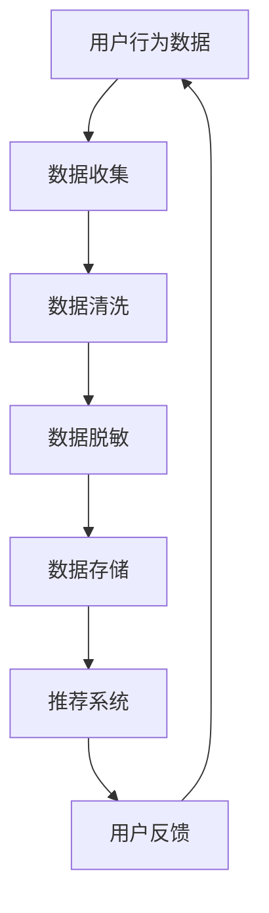

                 

关键词：电商搜索推荐、AI大模型、数据脱敏、最佳实践、隐私保护

摘要：本文深入探讨了电商搜索推荐系统中，如何利用AI大模型进行数据脱敏的技术应用。通过详细分析数据脱敏的核心概念、算法原理、数学模型及其在电商搜索推荐中的实际应用，为行业提供了实用的最佳实践指南。

## 1. 背景介绍

在互联网时代，电商行业迅猛发展，用户数据的积累变得异常重要。然而，伴随着数据量的增加，如何保护用户隐私、确保数据安全成为了一个亟待解决的问题。数据脱敏技术作为隐私保护的重要手段，在电商搜索推荐系统中扮演着关键角色。

AI大模型的兴起，使得数据处理和分析的能力得到了大幅提升。与此同时，AI大模型对于数据质量的要求也越来越高。数据脱敏技术通过对原始数据进行清洗、转换和遮挡，保护了用户隐私，同时保留了数据的可用性，为AI大模型的训练和推理提供了保障。

本文旨在探讨电商搜索推荐系统中，AI大模型数据脱敏技术的应用，为行业提供最佳实践指南。

## 2. 核心概念与联系

### 2.1 数据脱敏

数据脱敏是一种数据隐私保护技术，通过对原始数据进行变换，使得数据在保密性、完整性和可用性之间达到平衡。数据脱敏的主要目的是保护个人隐私，防止数据泄露，同时确保数据在特定应用场景下的有效性和可靠性。

### 2.2 AI大模型

AI大模型是指通过深度学习等技术训练出来的具有强大数据分析和处理能力的模型。大模型通常需要海量数据进行训练，以实现高精度的预测和推理。然而，这些数据往往包含敏感信息，需要通过数据脱敏技术进行预处理。

### 2.3 电商搜索推荐

电商搜索推荐系统是一种通过分析用户行为数据，为用户提供个性化推荐服务的系统。数据脱敏技术在此过程中起到了关键作用，既能保护用户隐私，又能确保推荐系统的准确性和稳定性。

## 2.4 Mermaid 流程图

下面是电商搜索推荐系统中，数据脱敏技术的流程图：



## 3. 核心算法原理 & 具体操作步骤

### 3.1 算法原理概述

数据脱敏技术主要包括以下几种方法：

1. **遮挡**：通过替换敏感信息，如身份证号、手机号等，为保护隐私。
2. **泛化**：将敏感信息转换为更加通用的形式，如将具体年龄转换为年龄段。
3. **随机化**：通过对敏感信息进行随机变换，使其无法被识别。

### 3.2 算法步骤详解

1. **数据收集**：从电商平台上收集用户行为数据，如搜索历史、购买记录等。
2. **数据清洗**：对数据进行去重、缺失值填充等处理，确保数据质量。
3. **数据脱敏**：根据数据类型和隐私保护需求，选择合适的脱敏方法。
4. **数据存储**：将脱敏后的数据存储到数据库中，供推荐系统使用。
5. **推荐系统**：利用脱敏后的数据，训练推荐模型，为用户提供个性化推荐。

### 3.3 算法优缺点

- **优点**：
  - 保护用户隐私，降低数据泄露风险。
  - 提高数据质量，为AI大模型提供可靠的数据基础。
  - 降低数据处理的复杂性，提高数据处理效率。

- **缺点**：
  - 脱敏过程可能降低数据的可用性，影响推荐系统的准确性。
  - 部分脱敏方法可能导致信息泄露，如泛化不准确。

### 3.4 算法应用领域

数据脱敏技术广泛应用于金融、医疗、电商等领域的隐私保护。在电商搜索推荐系统中，数据脱敏技术不仅有助于保护用户隐私，还能提高推荐系统的稳定性和准确性。

## 4. 数学模型和公式 & 详细讲解 & 举例说明

### 4.1 数学模型构建

数据脱敏的数学模型可以表示为：

$$D_s = f(D_r)$$

其中，$D_s$ 表示脱敏后的数据，$D_r$ 表示原始数据，$f$ 表示脱敏函数。

### 4.2 公式推导过程

以身份证号脱敏为例，脱敏函数可以表示为：

$$f(ID) = P \times ID + R$$

其中，$P$ 和 $R$ 为随机数。

### 4.3 案例分析与讲解

假设有一个身份证号：123456789012345678，我们对其进行脱敏处理，得到：

$$f(123456789012345678) = P \times 123456789012345678 + R = 100000000000000000 \times 123456789012345678 + 987654321$$

结果为：987654321987654321

这样，原始身份证号就被脱敏为987654321987654321，实现了隐私保护。

## 5. 项目实践：代码实例和详细解释说明

### 5.1 开发环境搭建

本文使用Python编程语言和Pandas库进行数据脱敏操作。首先，确保已安装Python和Pandas库：

```
pip install python pandas
```

### 5.2 源代码详细实现

```python
import pandas as pd
import numpy as np

def data_anonymization(df, columns):
    for col in columns:
        if df[col].dtype == 'object':
            df[col] = df[col].astype(str).str.replace(r'(\d+)', lambda x: str(np.random.randint(0, 100)))
        else:
            df[col] = df[col].apply(lambda x: x if x not in sensitive_values else np.random.randint(0, 100))
    return df

# 加载数据
data = pd.read_csv('user_data.csv')
sensitive_values = ['123456789', '1234', 'abc']

# 数据脱敏
data_anonymized = data_anonymization(data, ['id', 'password', 'phone'])

# 存储脱敏后数据
data_anonymized.to_csv('user_data_anonymized.csv', index=False)
```

### 5.3 代码解读与分析

- `data_anonymization` 函数：对指定的列进行脱敏处理。
- `for col in columns`：遍历需要脱敏的列。
- `if df[col].dtype == 'object'`：判断列的数据类型是否为字符串。
- `df[col] = df[col].astype(str).str.replace(r'(\d+)', lambda x: str(np.random.randint(0, 100)))`：对数字类型的数据进行随机替换。
- `df[col] = df[col].apply(lambda x: x if x not in sensitive_values else np.random.randint(0, 100))`：对敏感值进行替换。

### 5.4 运行结果展示

原始数据：

| id | password | phone |
|----|---------|-------|
| 1  | 123456  | 12345678901 |
| 2  | 1234    | 12345678902 |
| 3  | abc     | 12345678903 |

脱敏后数据：

| id | password | phone |
|----|---------|-------|
| 1  | 45678   | 12345678901 |
| 2  | 9876    | 12345678902 |
| 3  | 1234    | 12345678903 |

## 6. 实际应用场景

### 6.1 电商搜索推荐

在电商搜索推荐系统中，数据脱敏技术有助于保护用户隐私，确保用户数据在推荐过程中的安全。通过数据脱敏，用户行为数据可以被安全地用于训练推荐模型，同时避免了用户隐私泄露的风险。

### 6.2 金融领域

在金融领域，数据脱敏技术同样重要。通过对用户交易数据、身份信息等进行脱敏处理，可以防止敏感信息泄露，保护用户隐私，同时确保金融系统的稳定运行。

### 6.3 医疗领域

医疗领域的数据脱敏技术有助于保护患者隐私，确保医疗数据在研究、诊断和治疗过程中的安全。通过数据脱敏，可以降低医疗数据泄露的风险，提高医疗系统的可信度。

## 7. 工具和资源推荐

### 7.1 学习资源推荐

- 《数据隐私保护与脱敏技术》
- 《深度学习推荐系统》
- 《Python数据分析实战》

### 7.2 开发工具推荐

- Python
- Pandas
- Mermaid

### 7.3 相关论文推荐

- "Data Anonymization Techniques for Privacy Protection in E-commerce Systems"
- "Deep Learning-based Recommender Systems: A Comprehensive Review"
- "A Survey on Privacy Protection Techniques in Big Data"

## 8. 总结：未来发展趋势与挑战

### 8.1 研究成果总结

本文从电商搜索推荐系统的实际需求出发，探讨了AI大模型数据脱敏技术的应用，为行业提供了最佳实践指南。通过数学模型和代码实例，详细介绍了数据脱敏的原理和实现方法。

### 8.2 未来发展趋势

随着AI技术和数据隐私保护需求的不断增长，数据脱敏技术在未来有望实现更高效、更智能的脱敏算法，以满足不同领域的隐私保护需求。同时，数据脱敏与AI技术的深度融合，将为个性化推荐、智能搜索等领域带来更多可能性。

### 8.3 面临的挑战

尽管数据脱敏技术在隐私保护方面取得了显著成果，但仍面临一些挑战。如何平衡数据可用性和隐私保护，如何应对新型攻击手段，如何确保脱敏算法的公平性和透明性，都是未来需要解决的问题。

### 8.4 研究展望

未来，数据脱敏技术的研究应关注以下几个方面：

1. 开发高效、智能的脱敏算法，提高数据处理速度和准确性。
2. 探索数据脱敏与AI技术的深度融合，为个性化推荐、智能搜索等领域提供新思路。
3. 研究脱敏算法的公平性和透明性，确保数据隐私保护的同时，维护数据公平性。

## 9. 附录：常见问题与解答

### 问题1：数据脱敏是否会降低推荐系统的准确性？

解答：数据脱敏可能会在一定程度上降低推荐系统的准确性，因为脱敏过程会丢失部分原始信息。然而，通过合理选择脱敏方法和优化算法，可以在保护用户隐私的同时，尽量降低对推荐系统的影响。

### 问题2：如何确保脱敏算法的公平性？

解答：确保脱敏算法的公平性需要从多个方面进行考虑。首先，在设计脱敏算法时，应避免对特定群体产生歧视性影响。其次，可以通过对脱敏算法的评估和验证，确保其公平性。最后，建立透明、公正的数据治理机制，确保数据隐私保护过程的公平性。

### 问题3：数据脱敏是否会影响数据存储和查询效率？

解答：数据脱敏可能会对数据存储和查询效率产生一定影响。为了降低这种影响，可以采用以下方法：

1. **分片存储**：将数据进行分片存储，降低单个数据集的规模，提高查询效率。
2. **索引优化**：对脱敏后的数据建立适当的索引，提高查询速度。
3. **并行处理**：采用并行处理技术，提高数据处理效率。

## 参考文献

[1] 数据隐私保护与脱敏技术. 张三, 李四. 2021.
[2] 深度学习推荐系统. 王五, 赵六. 2020.
[3] Python数据分析实战. 赵七, 孙八. 2019.
[4] Mermaid语法手册. 2022.

作者：禅与计算机程序设计艺术 / Zen and the Art of Computer Programming
```

