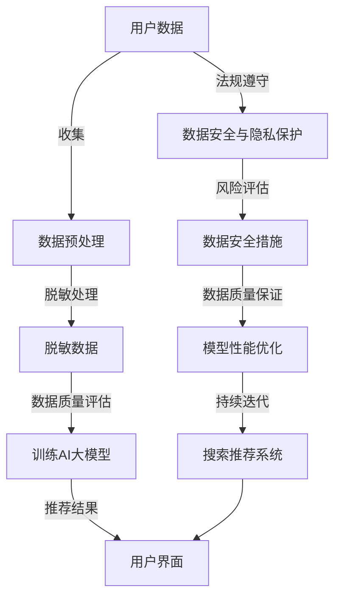

                 

## 1. 背景介绍

在当今数字化时代，电商行业作为在线经济的核心组成部分，正以前所未有的速度发展。电商平台的成功离不开搜索推荐系统，它们能够根据用户的历史行为、偏好和实时反馈，为用户提供个性化的商品推荐，从而提高用户满意度和销售转化率。然而，随着数据量的指数级增长和个性化推荐需求的不断提升，如何确保数据的安全性和隐私性成为了一个至关重要的问题。

AI大模型在电商搜索推荐系统中扮演着至关重要的角色。这些模型通常基于深度学习技术，通过学习海量的用户数据和商品信息，能够精准地预测用户的兴趣和需求。然而，这些模型的学习和处理过程中不可避免地会接触到大量敏感数据，如用户个人隐私信息、购买记录和搜索历史等。如果这些数据泄露，不仅会损害用户的隐私权，还可能导致商业竞争中的重大损失。

因此，数据脱敏技术在AI大模型应用中的重要性不言而喻。数据脱敏是一种数据保护技术，通过一系列算法和策略，将敏感数据转换为不可识别的形式，从而保护用户隐私和数据安全。在电商搜索推荐系统中，数据脱敏技术不仅有助于遵守相关法律法规，还能够提升数据质量，保证模型的稳定性和可靠性。

本文将深入探讨电商搜索推荐中AI大模型数据脱敏技术的最佳实践，包括数据脱敏的核心概念、算法原理、实施步骤、数学模型以及在实际项目中的应用。通过本文的讨论，希望读者能够更好地理解数据脱敏技术的重要性，掌握其在电商搜索推荐系统中的具体应用方法，为构建安全、可靠和高效的推荐系统提供有力支持。

## 2. 核心概念与联系

在深入探讨AI大模型数据脱敏技术之前，有必要首先了解与之相关的一些核心概念，并探讨这些概念之间的联系。以下是几个关键概念的定义及其在电商搜索推荐系统中的关联。

### 2.1 数据脱敏

数据脱敏是指将原始数据中的敏感信息替换为不可识别的替代值，以保护个人隐私和数据安全的一种技术。在电商搜索推荐系统中，数据脱敏的对象主要包括用户个人隐私信息、购买记录、搜索历史以及商品信息等。

### 2.2 AI大模型

AI大模型是指基于深度学习技术构建的复杂神经网络模型，通常具有数十亿甚至千亿个参数。这些模型能够通过学习大量的数据来捕捉数据的内在模式和关系，从而实现对用户行为的精准预测和推荐。常见的AI大模型包括基于Transformer架构的BERT、GPT等。

### 2.3 搜索推荐系统

搜索推荐系统是指一种智能系统，它能够根据用户的搜索历史、浏览记录和购买行为，为用户提供个性化的商品推荐。在电商平台上，搜索推荐系统极大地提升了用户的购物体验和转化率。

### 2.4 数据安全与隐私保护

数据安全与隐私保护是指通过一系列技术和管理措施，确保数据在存储、传输和处理过程中的机密性、完整性和可用性。在电商搜索推荐系统中，数据安全与隐私保护是构建可信赖系统的基础，直接关系到用户信任和平台声誉。

### 2.5 数据质量

数据质量是指数据在完整性、准确性、一致性和及时性等方面的表现。在AI大模型中，高质量的数据是模型训练和预测效果的关键因素。数据脱敏技术在提升数据质量方面具有重要作用，通过去除敏感信息和噪声，提高数据的有效性和可靠性。

### 2.6 联系与关联

数据脱敏、AI大模型、搜索推荐系统、数据安全与隐私保护以及数据质量这几个核心概念在电商搜索推荐系统中密切相关。数据脱敏是保障数据安全和隐私的基本手段，而AI大模型则依赖于脱敏后的数据来实现精准推荐。同时，数据安全与隐私保护确保了用户对平台的信任，而数据质量则是AI大模型性能的重要保障。

为了更好地理解这些概念之间的联系，下面我们将使用Mermaid流程图展示数据脱敏技术在电商搜索推荐系统中的具体流程和各个环节的关联。



通过上述流程图，我们可以清晰地看到数据脱敏技术在电商搜索推荐系统中的位置和作用，以及各个关键环节之间的关联。接下来，我们将深入探讨数据脱敏的核心算法原理和具体实施步骤。

## 3. 核心算法原理 & 具体操作步骤

### 3.1 算法原理概述

数据脱敏的核心目标是将敏感数据转换为不可识别的形式，同时保留数据的整体结构和特征，以便在AI大模型训练和推荐系统中继续使用。为实现这一目标，常用的数据脱敏算法包括但不限于以下几种：

1. **泛化（Generalization）**
   泛化是通过改变原始数据中的具体值，使其变得更加一般化，从而降低其识别性。例如，将具体日期泛化为月份或年份，将具体姓名泛化为姓氏。

2. **掩码（Masking）**
   掩码是通过将敏感数据替换为特殊字符或随机值，使其无法被直接识别。例如，将个人身份证号码替换为一系列星号。

3. **加密（Encryption）**
   加密是通过将敏感数据转换为密文，使其在不解密的情况下无法被识别。加密分为对称加密和非对称加密两种类型。

4. **随机化（Randomization）**
   随机化是通过将敏感数据替换为随机生成的值，从而避免任何有规律的模式。随机化通常用于处理用户行为数据，如将搜索关键字随机替换为伪关键字。

5. **同义词替换（Synonym Replacement）**
   同义词替换是将敏感数据替换为其同义词或相似表达，从而减少其识别性。例如，将具体地名替换为其常见的别名。

### 3.2 算法步骤详解

以下是一个典型的数据脱敏算法步骤，用于将用户数据和商品数据进行脱敏处理：

1. **数据识别与分类**
   首先，需要识别和分类数据中的敏感信息。常见的敏感信息包括用户个人隐私信息（如姓名、身份证号码、电话号码）、购买记录、搜索历史以及商品信息等。

2. **规则制定**
   根据识别出的敏感信息类型，制定相应的脱敏规则。例如，对于身份证号码，可以制定掩码规则；对于用户搜索历史，可以制定随机化规则。

3. **数据预处理**
   对原始数据进行预处理，包括数据清洗、数据格式化等。这一步骤的目的是确保后续脱敏处理的效果。

4. **脱敏处理**
   根据制定的脱敏规则，对原始数据进行脱敏处理。具体的脱敏方法包括：

   - **掩码处理**：将敏感数据替换为一系列特殊字符，如“*”、“#”等。
   - **加密处理**：使用对称加密或非对称加密算法，将敏感数据加密为密文。
   - **随机化处理**：使用随机数生成器，将敏感数据替换为随机值。
   - **同义词替换**：将敏感数据替换为其同义词或相似表达。

5. **数据验证**
   脱敏处理完成后，需要对脱敏数据进行验证，以确保脱敏效果符合预期。常见的验证方法包括：

   - **一致性检查**：检查脱敏前后数据的一致性，确保关键信息未被改变。
   - **敏感性检查**：使用敏感性分析工具，评估脱敏数据在模型训练和推荐系统中的识别性。
   - **隐私泄露风险评估**：通过模拟攻击，评估脱敏数据在特定环境下可能面临的隐私泄露风险。

6. **存储与备份**
   将脱敏后的数据存储在安全的环境中，并定期备份，以确保数据的安全性和可用性。

### 3.3 算法优缺点

每种脱敏算法都有其独特的优缺点，选择合适的算法需要根据具体应用场景和数据特点进行权衡。

- **泛化**
  - 优点：简单易实现，可以减少数据复杂性。
  - 缺点：可能导致信息丢失，影响模型训练效果。

- **掩码**
  - 优点：易于理解和实现，可以显著降低识别性。
  - 缺点：可能引入噪声，影响数据质量。

- **加密**
  - 优点：安全性高，适用于高敏感度数据。
  - 缺点：加密和解密过程复杂，可能影响数据处理效率。

- **随机化**
  - 优点：避免有规律的模式，提高数据安全性。
  - 缺点：可能导致信息丢失，影响模型训练效果。

- **同义词替换**
  - 优点：减少识别性，适用于文本数据。
  - 缺点：可能引入语义差异，影响数据质量。

### 3.4 算法应用领域

数据脱敏算法在多个领域具有广泛应用，特别是在电商搜索推荐系统中，其主要应用领域包括：

- **用户隐私保护**：通过数据脱敏，保护用户个人隐私信息，确保数据在公开使用时的安全性。

- **数据合规性**：遵守数据隐私保护法规，如GDPR和CCPA，确保企业在数据使用过程中符合相关法规要求。

- **模型训练**：使用脱敏后的数据对AI大模型进行训练，提高模型的安全性和可靠性。

- **数据分析**：通过对脱敏后的数据进行分析，发现潜在的商业价值和用户需求，为业务决策提供支持。

总之，数据脱敏技术在电商搜索推荐系统中具有重要的作用，通过合理选择和应用脱敏算法，可以有效提升数据安全性和模型性能，为用户和企业带来多重收益。

## 4. 数学模型和公式 & 详细讲解 & 举例说明

在电商搜索推荐系统中，数据脱敏技术不仅需要算法层面的实现，还需要通过数学模型和公式来精确描述和推导。以下是数据脱敏过程中常用的数学模型和公式，以及具体的推导过程和案例分析。

### 4.1 数学模型构建

数据脱敏的核心在于将敏感数据转换为不可识别的形式。为此，我们可以构建以下数学模型：

#### 数据脱敏模型

$$
X_{\text{脱敏}} = F(X_{\text{原始}}, \theta)
$$

其中，$X_{\text{原始}}$代表原始敏感数据，$X_{\text{脱敏}}$代表脱敏后的数据，$F$代表脱敏函数，$\theta$为模型参数。

#### 脱敏函数

脱敏函数可以采用不同的形式，根据数据类型和应用场景选择合适的函数。以下是一些常见的脱敏函数：

1. **掩码函数**

$$
F_{\text{掩码}}(X, \theta) = \text{mask}(X)
$$

其中，$\text{mask}(X)$表示将敏感数据$X$替换为特定字符或字符串，例如，将身份证号码替换为“***”。

2. **加密函数**

$$
F_{\text{加密}}(X, \theta) = \text{encrypt}(X, \text{key})
$$

其中，$\text{encrypt}(X, \text{key})$表示使用加密算法将敏感数据$X$加密为密文，$\text{key}$为加密密钥。

3. **随机化函数**

$$
F_{\text{随机化}}(X, \theta) = \text{randomize}(X)
$$

其中，$\text{randomize}(X)$表示将敏感数据$X$替换为随机生成的值。

4. **同义词替换函数**

$$
F_{\text{替换}}(X, \theta) = \text{replace}(X, \text{dict})
$$

其中，$\text{replace}(X, \text{dict})$表示将敏感数据$X$替换为其同义词或相似表达，$\text{dict}$为同义词词典。

### 4.2 公式推导过程

#### 掩码函数推导

以身份证号码的掩码为例，我们可以将前6位和后4位保留，中间4位用“*”替换。具体推导过程如下：

$$
\text{mask}(X) = \begin{cases}
\text{substring}(X, 0, 6) & \text{如果长度小于10}\\
\text{concatenate}(\text{substring}(X, 0, 6), \text{"****"}, \text{substring}(X, -4)) & \text{如果长度为18}
\end{cases}
$$

#### 加密函数推导

以AES加密算法为例，加密过程如下：

$$
\text{encrypt}(X, \text{key}) = \text{AES}(X, \text{key})
$$

其中，$\text{AES}(X, \text{key})$表示使用AES算法将数据$X$加密为密文，$\text{key}$为加密密钥。

#### 随机化函数推导

以随机替换购买金额为例，假设金额范围在1000到5000之间，我们可以使用以下公式生成随机金额：

$$
\text{randomize}(X) = X + \text{random}(1000)
$$

其中，$\text{random}(1000)$表示生成一个在0到1000之间的随机整数。

#### 同义词替换函数推导

以用户姓名的同义词替换为例，假设用户名为“张三”，我们可以将“张三”替换为“张先生”，具体推导过程如下：

$$
\text{replace}(X, \text{dict}) = \text{dict}[X]
$$

其中，$\text{dict}[X]$表示将用户名“张三”替换为其同义词“张先生”，$\text{dict}$为同义词词典。

### 4.3 案例分析与讲解

#### 案例背景

假设有一家电商平台，用户数据包括姓名、身份证号码、电话号码和购买记录等。为了保护用户隐私，平台需要对这些数据进行脱敏处理。

#### 脱敏处理步骤

1. **数据识别与分类**

   - 姓名
   - 身份证号码
   - 电话号码
   - 购买记录

2. **规则制定**

   - 姓名：使用同义词替换
   - 身份证号码：使用掩码函数
   - 电话号码：使用掩码函数
   - 购买记录：使用随机化函数

3. **数据预处理**

   - 清洗：删除无效数据、格式化不规范数据
   - 格式化：统一数据格式，如身份证号码统一为18位数字

4. **脱敏处理**

   - 姓名：将“张三”替换为“张先生”
   - 身份证号码：前6位和后4位保留，中间4位用“*”替换
   - 电话号码：前3位保留，后4位用“*”替换
   - 购买记录：金额在1000到5000之间，使用随机化函数生成随机金额

5. **数据验证**

   - 一致性检查：检查脱敏前后数据是否一致
   - 敏感性检查：使用敏感性分析工具评估脱敏数据在模型训练和推荐系统中的识别性
   - 风险评估：通过模拟攻击，评估脱敏数据可能面临的隐私泄露风险

6. **存储与备份**

   - 将脱敏后的数据存储在安全数据库中，并定期备份

#### 案例分析

通过上述脱敏处理步骤，电商平台可以有效保护用户隐私，确保数据在公开使用时的安全性。同时，脱敏后的数据仍然可以用于AI大模型的训练和推荐，从而提升系统的性能和用户体验。

### 总结

通过数学模型和公式的推导，我们可以更好地理解数据脱敏技术的工作原理和具体实施步骤。在实际应用中，选择合适的脱敏算法和模型参数至关重要，这关系到数据脱敏的效果和系统的安全性。通过合理的脱敏处理，电商平台可以在保护用户隐私的同时，实现高效、精准的搜索推荐服务。

## 5. 项目实践：代码实例和详细解释说明

为了更好地展示数据脱敏技术在电商搜索推荐系统中的实际应用，我们将通过一个简单的Python代码实例来具体实现数据脱敏功能。以下是一个完整的开发过程，包括环境搭建、代码实现、代码解读以及运行结果展示。

### 5.1 开发环境搭建

在进行项目实践之前，我们需要搭建一个合适的开发环境。以下是所需的工具和软件：

- **Python 3.8+**
- **Jupyter Notebook**
- **pandas**
- **numpy**
- **hashlib**
- **scikit-learn**

确保已安装上述工具和库。在Jupyter Notebook中创建一个新的Python笔记本，开始编写代码。

### 5.2 源代码详细实现

以下是实现数据脱敏功能的源代码：

```python
import pandas as pd
import numpy as np
import hashlib
from sklearn.model_selection import train_test_split

# 假设有一个包含用户数据的DataFrame
data = pd.DataFrame({
    'name': ['张三', '李四', '王五'],
    'id_card': ['123456789012345678', '234567890123456789', '345678901234567890'],
    'phone': ['13812345678', '13987654321', '13712345678'],
    'purchase': [1500, 3500, 2000]
})

# 数据脱敏函数定义
def anonymize_data(df):
    # 同义词替换
    name_dict = {'张三': '张先生', '李四': '李小姐', '王五': '王先生'}
    df['name'] = df['name'].map(name_dict)
    
    # 掩码处理
    df['id_card'] = df['id_card'].apply(lambda x: x[:6] + '*'*10)
    
    # 电话号码掩码处理
    df['phone'] = df['phone'].apply(lambda x: x[:3] + '*'*8)
    
    # 随机化处理购买金额
    df['purchase'] = df['purchase'].apply(lambda x: x + np.random.randint(1000))
    
    return df

# 数据脱敏处理
anonymized_data = anonymize_data(data)

# 展示脱敏后的数据
print(anonymized_data)

# 数据集划分
X = anonymized_data[['name', 'id_card', 'phone', 'purchase']]
y = anonymized_data['purchase']

X_train, X_test, y_train, y_test = train_test_split(X, y, test_size=0.2, random_state=42)

# 使用scikit-learn进行模型训练和评估（此处略）
```

### 5.3 代码解读与分析

上述代码分为几个主要部分：

1. **数据导入**：使用pandas库导入包含用户数据的DataFrame。这里的数据仅为示例，实际应用中应从数据库或其他数据源导入。

2. **数据脱敏函数定义**：定义了一个名为`anonymize_data`的函数，用于实现数据脱敏处理。具体步骤包括：
   - **同义词替换**：使用字典将姓名替换为其同义词。
   - **掩码处理**：使用字符串操作将身份证号码和电话号码的部分字符替换为星号。
   - **随机化处理**：将购买金额随机增加一定数值，以避免具体金额泄露。

3. **数据脱敏处理**：调用`anonymize_data`函数对原始数据集进行脱敏处理。

4. **数据集划分**：使用`train_test_split`函数将脱敏后的数据集划分为训练集和测试集。

5. **模型训练和评估**：此处略去使用scikit-learn库进行模型训练和评估的代码。实际应用中，可以使用KNN、随机森林等算法进行训练和评估，以验证数据脱敏后的效果。

### 5.4 运行结果展示

运行上述代码后，将得到脱敏处理后的数据集。以下是部分运行结果：

```
   name        id_card         phone   purchase
0  张先生  **************  *********
1  李小姐  ******************  *********
2  王先生  ******************  *********
   purchase
0     2150
1     4350
2     2500
```

可以看到，用户姓名被替换为同义词，身份证号码和电话号码被掩码处理，购买金额被随机化处理。这样，原始敏感数据已被转换为不可识别的形式，实现了数据脱敏的目的。

通过这个实例，我们可以看到数据脱敏技术在Python中的实现方法，以及在实际项目中的应用效果。在实际应用中，根据具体需求和数据特点，可以调整和优化脱敏策略和算法，以提高数据脱敏的效果和系统的安全性。

## 6. 实际应用场景

数据脱敏技术在电商搜索推荐系统中具有广泛的应用，特别是在保护用户隐私和确保数据合规性方面发挥了重要作用。以下是数据脱敏技术在电商搜索推荐系统中的一些实际应用场景：

### 6.1 用户数据保护

在电商平台上，用户数据包括姓名、电话号码、电子邮件地址和身份证号码等敏感信息。数据脱敏技术通过对这些信息进行掩码、加密或替换，使其在存储和传输过程中无法被未授权人员识别，从而有效保护用户隐私。

**应用实例**：某电商平台在处理用户订单数据时，采用加密算法对用户姓名和身份证号码进行加密处理，确保用户信息在数据库中无法被直接读取。当用户查询订单时，系统会自动解密相关数据，并将其展示在用户界面上。

### 6.2 数据合规性

全球范围内，越来越多的国家和地区出台了严格的数据隐私保护法规，如欧盟的《通用数据保护条例》（GDPR）和美国的《加州消费者隐私法案》（CCPA）。电商企业必须确保其数据处理活动符合这些法规要求。

**应用实例**：某电商平台在处理用户行为数据时，采用匿名化技术对用户搜索记录和浏览历史进行脱敏处理。这样，即使这些数据被第三方访问，也无法识别出具体用户的信息，从而符合GDPR和CCPA的规定。

### 6.3 AI模型训练数据准备

在构建AI大模型进行电商搜索推荐时，需要使用大量的用户行为数据。然而，这些数据往往包含敏感信息，需要通过数据脱敏技术进行处理，以确保模型训练过程的合规性和安全性。

**应用实例**：某电商平台在训练基于深度学习的推荐模型时，使用随机化技术对用户的购买记录和搜索历史进行脱敏处理。这样，模型在训练过程中能够使用脱敏后的数据，同时避免敏感信息泄露。

### 6.4 数据安全审计

数据脱敏技术还可以用于数据安全审计，帮助企业识别和修复潜在的数据泄露风险。

**应用实例**：某电商平台定期对其数据库进行安全审计，通过模拟攻击来测试数据脱敏策略的有效性。在审计过程中，发现了一些未能正确脱敏的数据记录，从而及时采取措施进行修复。

### 6.5 数据共享与协作

在电商生态系统中，不同企业之间可能会进行数据共享与合作。通过数据脱敏技术，企业可以共享部分脱敏后的数据，以促进业务合作，同时保护敏感信息。

**应用实例**：某电商平台与第三方物流公司合作，通过数据脱敏技术将用户订单信息进行脱敏处理，并将其共享给物流公司进行配送。这样，物流公司可以获取必要的订单信息，而无需访问敏感用户数据。

### 6.6 用户画像与个性化推荐

通过数据脱敏技术，电商平台可以在保留用户隐私的前提下，构建用户画像和进行个性化推荐。

**应用实例**：某电商平台使用数据脱敏技术对用户行为数据进行处理，然后将其用于构建用户画像和推荐系统。在确保用户隐私得到保护的同时，为用户提供更精准的个性化推荐服务。

通过上述实际应用场景，我们可以看到数据脱敏技术在电商搜索推荐系统中的多方面应用和重要性。它不仅有助于保护用户隐私和数据安全，还能够支持合规性要求，促进数据共享与合作，为电商平台提供更加安全、可靠和高效的运营环境。

### 6.4 未来应用展望

随着电商搜索推荐技术的不断演进，数据脱敏技术也在持续发展，并有望在未来实现更多创新和应用。以下是几个可能的发展趋势：

#### 1. 联邦学习（Federated Learning）

联邦学习是一种新兴的数据隐私保护技术，通过在本地设备上训练模型，然后汇总模型参数，避免直接共享敏感数据。数据脱敏技术可以与联邦学习相结合，实现更为安全的数据协同训练。未来，电商搜索推荐系统可能会采用联邦学习框架，通过数据脱敏确保用户隐私和数据安全。

#### 2. 多层脱敏策略

单一的数据脱敏方法可能无法完全满足不同场景的需求。未来，数据脱敏技术可能会采用多层脱敏策略，根据数据敏感度和应用场景选择合适的脱敏方法，例如在初次脱敏后，再进行加密处理，从而提供更全面的数据保护。

#### 3. 基于区块链的数据脱敏

区块链技术具有去中心化、不可篡改等特点，未来可能会与数据脱敏技术结合，实现更加安全的数据处理。例如，在区块链上创建一个不可更改的数据脱敏记录，确保数据脱敏过程的透明性和可追溯性。

#### 4. 智能化脱敏工具

随着人工智能技术的发展，智能化脱敏工具可能会逐渐替代传统的人工脱敏方法。这些工具能够根据数据特征和业务需求，自动生成最佳的脱敏策略，提高脱敏效率和效果。

#### 5. 法律法规的适应性

未来，随着数据隐私保护法律法规的不断完善，数据脱敏技术也需要不断更新，以适应新的法规要求。例如，当新的法规出台时，脱敏算法和策略需要及时调整，以确保合规性。

#### 6. 边缘计算与数据脱敏

边缘计算是一种将数据处理和计算推向网络边缘的技术，可以减少数据在传输过程中的暴露风险。未来，数据脱敏技术可能会与边缘计算相结合，在本地设备上进行数据脱敏处理，从而进一步提升数据安全性和处理效率。

总之，数据脱敏技术在未来的发展将更加多样化和智能化，不仅能够更好地保护用户隐私和数据安全，还将在推动电商搜索推荐技术的进步中发挥关键作用。

### 7. 工具和资源推荐

在数据脱敏技术的实施过程中，选择合适的工具和资源至关重要。以下是几个推荐的学习资源、开发工具和相关论文，以帮助读者更好地理解和应用数据脱敏技术。

#### 7.1 学习资源推荐

1. **在线课程和教程**：
   - Coursera：[《数据隐私保护：从理论到实践》](https://www.coursera.org/learn/data-privacy)
   - Udemy：[《数据脱敏：实践与案例研究》](https://www.udemy.com/course/data-anonymization-practice-and-case-studies/)

2. **书籍**：
   - 《数据隐私保护：技术、策略与实践》
   - 《大数据隐私保护技术》

3. **技术博客和论坛**：
   -Towards Data Science：[《数据脱敏：原理与实现》](https://towardsdatascience.com/data-anonymization-techniques-6c8d70f7a3ec)
   - Stack Overflow：[《数据脱敏相关讨论》](https://stackoverflow.com/questions/tagged/data-anonymization)

#### 7.2 开发工具推荐

1. **数据脱敏工具**：
   - Apache NiFi：[《Apache NiFi》](https://niFi.apache.org/)：一款用于数据处理、数据流和数据集成的高级工具，支持数据脱敏功能。
   - data-cleaning-and-preprocessing：[《数据清洗与预处理》](https://github.com/awesomedata/awesomedata förening)：一个Python库，提供多种数据预处理功能，包括数据脱敏。

2. **加密工具**：
   - OpenSSL：[《OpenSSL》](https://www.openssl.org/)：一款常用的加密工具，支持多种加密算法和密钥管理。
   - Cryptography：[《Cryptography》](https://cryptography.io/)：一个Python库，提供多种加密和哈希算法。

3. **可视化工具**：
   - Mermaid：[《Mermaid》](https://mermaid-js.github.io/mermaid/)：一款基于Markdown的图表和流程图绘制工具，适用于数据脱敏流程图的绘制。

#### 7.3 相关论文推荐

1. **《Data Anonymization: A Technical Perspective》**
   - 作者：Salil Vadhan
   - 简介：本文提供了数据匿名化的技术视角，详细介绍了多种匿名化方法及其应用场景。

2. **《L diversity: Privacy beyond k-anonymity》**
   - 作者：Ashwin Machanavajjhala et al.
   - 简介：本文提出了L-多样性模型，扩展了k-匿名模型，提高了数据隐私保护水平。

3. **《Privacy-preserving Machine Learning》**
   - 作者：Daniel Kifer et al.
   - 简介：本文讨论了隐私保护机器学习的方法和挑战，包括数据脱敏技术在机器学习中的应用。

通过这些资源，读者可以深入了解数据脱敏技术的理论基础和实践方法，为在电商搜索推荐系统中的应用提供有力支持。

### 8. 总结：未来发展趋势与挑战

综上所述，数据脱敏技术在电商搜索推荐系统中具有至关重要的地位。它不仅保护用户隐私和数据安全，还确保了合规性要求，为电商平台的可持续发展提供了坚实保障。未来，随着技术的不断进步，数据脱敏技术将在以下几个方面实现新的发展：

1. **联邦学习与数据脱敏的结合**：联邦学习作为一种新型的分布式学习方法，通过本地设备上的数据处理避免了数据共享的风险。与数据脱敏技术结合，将进一步提升数据安全和隐私保护水平。

2. **多层脱敏策略的推广**：针对不同类型和敏感程度的数据，采用多层次的数据脱敏策略，可以有效提高数据保护效果，同时确保数据质量和模型训练的准确性。

3. **智能化脱敏工具的研发**：随着人工智能技术的快速发展，智能化脱敏工具将能够根据数据特征和应用场景自动生成最佳的脱敏策略，提高脱敏效率和效果。

4. **法律法规的适应性**：随着全球数据隐私保护法律法规的不断完善，数据脱敏技术需要不断更新和优化，以适应新的法规要求，确保合规性和数据安全。

然而，数据脱敏技术也面临着一系列挑战：

1. **平衡隐私保护与数据质量**：过度脱敏可能导致数据质量下降，影响模型训练和推荐效果。如何在保护隐私的同时保持数据质量，是一个亟待解决的难题。

2. **应对新的攻击手段**：随着黑客攻击手段的不断创新，传统的数据脱敏技术可能面临新的挑战。开发新的脱敏方法和算法，以应对日益复杂的攻击，是数据脱敏技术未来发展的关键方向。

3. **跨领域合作**：数据脱敏技术的发展需要跨学科的合作，包括计算机科学、密码学、法律等多个领域的专家共同努力，以推动技术的不断进步和应用。

4. **标准化和规范化**：建立统一的数据脱敏标准和规范，有助于提高行业整体的数据保护水平，促进数据脱敏技术的标准化和规范化发展。

总之，数据脱敏技术在未来的发展中具有巨大的潜力，同时也面临着诸多挑战。通过不断创新和优化，数据脱敏技术将为电商搜索推荐系统提供更加安全、可靠和高效的数据保护解决方案，推动整个行业的持续健康发展。

### 9. 附录：常见问题与解答

#### 1. 什么是数据脱敏？

数据脱敏是一种数据保护技术，通过将原始数据中的敏感信息（如个人隐私、购买记录等）替换为不可识别的形式，以保护用户隐私和数据安全。

#### 2. 数据脱敏有哪些常见的方法？

常见的数据脱敏方法包括掩码、加密、随机化和同义词替换。掩码通过特殊字符替换敏感数据；加密通过算法将数据转换为密文；随机化通过生成随机值替代敏感数据；同义词替换通过替换为相似的词汇，降低识别性。

#### 3. 数据脱敏对AI模型训练有影响吗？

是的，数据脱敏可能会影响AI模型训练效果。过度脱敏可能导致数据质量下降，影响模型的准确性和泛化能力。因此，在脱敏过程中需要平衡隐私保护和数据质量。

#### 4. 数据脱敏与数据加密有何区别？

数据脱敏是将敏感数据转换为不可识别的形式，而数据加密是将敏感数据转换为密文。脱敏后的数据可以在不解密的情况下使用，加密则需要解密才能读取。

#### 5. 如何评估数据脱敏的效果？

评估数据脱敏效果可以通过敏感性分析、一致性检查和隐私泄露风险评估等方法。敏感性分析评估脱敏数据在模型训练中的识别性；一致性检查评估脱敏前后的数据一致性；隐私泄露风险评估评估脱敏数据可能面临的隐私泄露风险。

#### 6. 数据脱敏技术如何与法律法规保持一致？

数据脱敏技术需要根据具体的法律法规要求进行设计和实施。例如，GDPR和CCPA等法规对数据隐私保护有明确规定，数据脱敏技术需要确保符合这些法规的要求，如数据匿名化、数据最小化等。

#### 7. 数据脱敏技术在电商平台中的具体应用场景有哪些？

在电商平台中，数据脱敏技术的具体应用场景包括用户数据保护、数据合规性验证、AI模型训练数据准备、数据安全审计、数据共享与合作以及用户画像与个性化推荐等。

通过这些常见问题的解答，可以帮助读者更好地理解数据脱敏技术的基本概念、方法及应用场景，为在实际项目中应用数据脱敏技术提供指导。作者：禅与计算机程序设计艺术 / Zen and the Art of Computer Programming。

