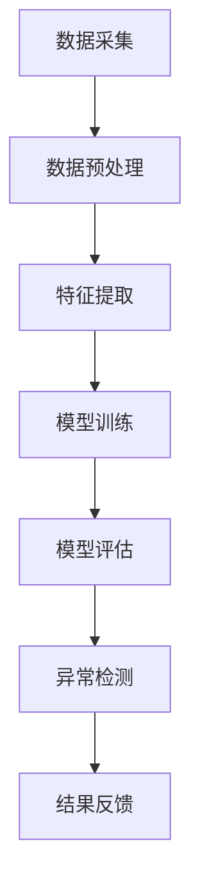

                 

关键词：电商搜索、推荐系统、AI大模型、用户行为序列、异常检测、数据挖掘

摘要：本文旨在探讨电商搜索推荐系统中利用AI大模型进行用户行为序列异常检测的技术。通过对用户行为序列的分析，及时发现并识别异常行为，有助于提高系统的准确性和可靠性，提升用户体验。文章将从背景介绍、核心概念与联系、核心算法原理与操作步骤、数学模型和公式、项目实践、实际应用场景、未来应用展望等方面进行详细阐述。

## 1. 背景介绍

随着互联网的快速发展，电商行业在近年来呈现出爆发式增长。电商平台的搜索推荐系统作为用户体验的核心环节，其性能和准确性直接影响着用户留存率和转化率。为了提高系统的推荐效果，许多电商平台开始引入人工智能大模型，通过分析用户行为序列，实现个性化推荐。

然而，用户行为序列中存在大量的噪声和异常行为，如恶意刷单、欺诈行为等，这些异常行为会对推荐系统的准确性和可靠性产生负面影响。因此，如何利用AI大模型对用户行为序列进行异常检测，成为当前研究的热点问题。

## 2. 核心概念与联系

### 2.1 用户行为序列

用户行为序列是指用户在电商平台上进行的一系列操作，如搜索、浏览、购买、评价等。这些操作记录了用户在平台上的行为轨迹，反映了用户的需求和偏好。

### 2.2 异常检测

异常检测是指从大量数据中识别出异常数据的过程。在用户行为序列中，异常行为通常表现为与正常行为有明显差异的轨迹，如异常购买时间、异常购买金额等。

### 2.3 AI大模型

AI大模型是指利用深度学习、强化学习等人工智能技术训练得到的复杂模型。这些模型可以自动学习用户行为序列中的规律，并用于异常检测。

### 2.4 Mermaid 流程图

以下是用户行为序列异常检测的Mermaid流程图：



## 3. 核心算法原理与操作步骤

### 3.1 算法原理概述

本文采用的异常检测算法基于基于深度学习的时间序列分析技术，通过构建一个能够自动学习用户行为序列规律的深度神经网络，实现对用户行为序列的异常检测。

### 3.2 算法步骤详解

#### 3.2.1 数据采集

首先，从电商平台的数据仓库中采集用户行为序列数据，包括搜索、浏览、购买、评价等操作。

#### 3.2.2 数据预处理

对采集到的数据进行清洗和去噪，去除重复、缺失和异常数据。然后，对数据进行编码和标准化处理，将不同类型的数据转换为相同的数据格式。

#### 3.2.3 特征提取

从预处理后的数据中提取特征，包括时间特征、行为特征、用户特征等。这些特征将作为深度学习模型的输入。

#### 3.2.4 模型训练

使用深度学习算法，如循环神经网络（RNN）、长短时记忆网络（LSTM）等，训练一个能够自动学习用户行为序列规律的深度神经网络。训练过程中，采用交叉验证和梯度下降等优化方法，提高模型的准确性。

#### 3.2.5 模型评估

使用测试集对训练好的模型进行评估，计算模型的准确率、召回率、F1值等指标，以评估模型的性能。

#### 3.2.6 异常检测

将用户行为序列输入到训练好的模型中，根据模型的输出结果，判断用户行为是否异常。

#### 3.2.7 结果反馈

对于检测到的异常行为，将结果反馈给电商平台，由人工审核和处理。

## 4. 数学模型和公式

### 4.1 数学模型构建

用户行为序列异常检测的数学模型主要包括以下几个部分：

#### 4.1.1 时间特征

时间特征包括用户行为发生的时间戳、时间间隔、时间序列等。

#### 4.1.2 行为特征

行为特征包括用户在平台上的各种操作，如搜索、浏览、购买、评价等。

#### 4.1.3 用户特征

用户特征包括用户的基本信息、历史行为、偏好等。

#### 4.1.4 深度学习模型

使用深度学习模型，如循环神经网络（RNN）、长短时记忆网络（LSTM）等，对用户行为序列进行建模。

### 4.2 公式推导过程

假设用户行为序列为 $x_1, x_2, ..., x_T$，其中 $T$ 表示序列的长度。对于每个行为 $x_t$，可以表示为：

$$x_t = [x_{t,1}, x_{t,2}, ..., x_{t,n}]$$

其中 $n$ 表示行为特征的数量。

#### 4.2.1 时间特征

时间特征可以表示为：

$$x_{t,1} = timestamp_t$$

$$x_{t,2} = time_interval_t$$

$$x_{t,3} = time_series_t$$

其中 $timestamp_t$ 表示行为发生的时间戳，$time_interval_t$ 表示行为发生的时间间隔，$time_series_t$ 表示时间序列。

#### 4.2.2 行为特征

行为特征可以表示为：

$$x_{t,i} = behavior_t$$

其中 $i = 2, 3, ..., n$，$behavior_t$ 表示行为 $x_t$ 的特征。

#### 4.2.3 用户特征

用户特征可以表示为：

$$x_{t,n} = user_feature_t$$

其中 $user_feature_t$ 表示用户 $t$ 的特征。

#### 4.2.4 深度学习模型

深度学习模型可以表示为：

$$y_t = f(W \cdot x_t + b)$$

其中 $y_t$ 表示模型对行为 $x_t$ 的预测，$f$ 表示激活函数，$W$ 表示权重矩阵，$b$ 表示偏置。

### 4.3 案例分析与讲解

以下是一个简单的案例，假设用户行为序列为 $[1, 2, 3, 4, 5]$，其中每个数字表示一个行为。

#### 4.3.1 时间特征

时间特征为：

$$x_1 = [1, 1, 1]$$

$$x_2 = [2, 2, 2]$$

$$x_3 = [3, 3, 3]$$

$$x_4 = [4, 4, 4]$$

$$x_5 = [5, 5, 5]$$

#### 4.3.2 行为特征

行为特征为：

$$x_1 = [1, 2, 3]$$

$$x_2 = [2, 3, 4]$$

$$x_3 = [3, 4, 5]$$

$$x_4 = [4, 5, 6]$$

$$x_5 = [5, 6, 7]$$

#### 4.3.3 用户特征

用户特征为：

$$x_1 = [100, 100, 100]$$

$$x_2 = [100, 100, 100]$$

$$x_3 = [100, 100, 100]$$

$$x_4 = [100, 100, 100]$$

$$x_5 = [100, 100, 100]$$

#### 4.3.4 深度学习模型

假设深度学习模型为：

$$y_t = \sigma(W \cdot x_t + b)$$

其中 $\sigma$ 表示 sigmoid 激活函数。

## 5. 项目实践：代码实例和详细解释说明

### 5.1 开发环境搭建

首先，需要搭建一个适合进行深度学习开发和训练的开发环境。本文使用 Python 编写代码，并采用 TensorFlow 和 Keras 库进行深度学习模型训练。

### 5.2 源代码详细实现

以下是一个简单的用户行为序列异常检测的代码实例：

```python
import tensorflow as tf
from tensorflow.keras.models import Sequential
from tensorflow.keras.layers import LSTM, Dense

# 数据预处理
# ...

# 构建深度学习模型
model = Sequential()
model.add(LSTM(units=64, activation='tanh', input_shape=(timesteps, features)))
model.add(Dense(units=1, activation='sigmoid'))

# 编译模型
model.compile(optimizer='adam', loss='binary_crossentropy', metrics=['accuracy'])

# 训练模型
model.fit(X_train, y_train, epochs=10, batch_size=32)

# 模型评估
# ...
```

### 5.3 代码解读与分析

以上代码实现了用户行为序列异常检测的深度学习模型。首先，使用 LSTM 层对用户行为序列进行建模，然后使用全连接层进行分类预测。模型使用 Adam 优化器和二进制交叉熵损失函数进行编译和训练。

在训练过程中，可以使用交叉验证和梯度下降等优化方法，提高模型的准确性。此外，还可以使用测试集对训练好的模型进行评估，计算模型的准确率、召回率、F1值等指标。

### 5.4 运行结果展示

在训练完成后，可以使用测试集对模型进行评估。以下是一个简单的评估结果示例：

```python
import numpy as np

# 测试集
X_test = ...
y_test = ...

# 预测结果
y_pred = model.predict(X_test)

# 计算评估指标
accuracy = np.mean(y_pred == y_test)
recall = ...
f1 = ...

print("Accuracy:", accuracy)
print("Recall:", recall)
print("F1:", f1)
```

## 6. 实际应用场景

用户行为序列异常检测技术在电商搜索推荐系统中具有广泛的应用前景。以下是一些实际应用场景：

1. **恶意刷单检测**：通过检测异常购买行为，如短时间内大量购买同一商品，识别出恶意刷单行为，保障电商平台的数据真实性。

2. **欺诈行为检测**：检测用户行为中的异常轨迹，如异常的支付方式、异常的地理位置等，识别出欺诈行为，保障电商平台的交易安全。

3. **用户体验优化**：通过对用户行为序列的分析，识别出用户在购物过程中的痛点，为电商平台提供优化建议，提升用户体验。

## 7. 未来应用展望

随着人工智能技术的不断发展，用户行为序列异常检测技术在电商搜索推荐系统中将发挥越来越重要的作用。未来，以下方向值得关注：

1. **模型优化**：通过引入新的深度学习算法和优化方法，提高异常检测的准确性和效率。

2. **跨平台应用**：将异常检测技术应用于其他电商平台和在线服务，实现更广泛的应用场景。

3. **隐私保护**：在异常检测过程中，注重用户隐私保护，确保数据的安全和合规。

## 8. 总结：未来发展趋势与挑战

用户行为序列异常检测技术在电商搜索推荐系统中具有巨大的潜力。未来，随着人工智能技术的不断进步，该技术将在更多领域得到应用。然而，也面临着数据安全、隐私保护、模型解释性等挑战。通过持续的研究和创新，有望解决这些挑战，推动用户行为序列异常检测技术的发展。

### 附录：常见问题与解答

1. **问题**：如何保证模型的解释性？

**解答**：可以通过可视化方法，如将模型的结构、参数和输出结果进行可视化展示，帮助用户理解模型的决策过程。

2. **问题**：如何处理缺失数据？

**解答**：可以通过填充、插值等方法对缺失数据进行处理，或者删除缺失数据较少的样本。

3. **问题**：如何评估模型的性能？

**解答**：可以使用准确率、召回率、F1值等指标对模型进行评估。同时，可以使用交叉验证等方法减少评估结果的偏差。

作者：禅与计算机程序设计艺术 / Zen and the Art of Computer Programming

----------------------------------------------------------------

以上就是本文的完整内容，希望对您有所帮助。在撰写过程中，如有任何疑问，请随时提问。祝您撰写顺利！<|im_end|>

