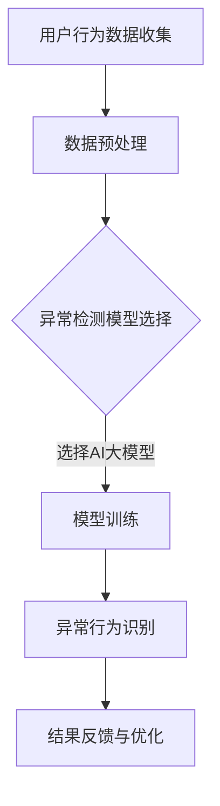

                 

 > **关键词**: 电商搜索推荐、AI大模型、用户行为序列、异常检测、模型优化实践。

> **摘要**: 本文深入探讨了在电商搜索推荐系统中，如何利用AI大模型进行用户行为序列的异常检测，并通过优化实践提升模型的效果和性能。文章从背景介绍、核心概念与联系、核心算法原理、数学模型及公式、项目实践到实际应用场景进行了全面剖析。

## 1. 背景介绍

在电子商务的快速发展中，搜索推荐系统成为电商平台的核心竞争力。用户行为的实时分析对于提升用户体验、提高转化率和降低流失率至关重要。然而，用户行为数据往往复杂且多样，其中可能包含异常行为，如恶意点击、虚假评论等。这些异常行为不仅影响用户的购物体验，还可能导致平台的经济损失和信誉下降。因此，对用户行为序列进行异常检测具有重要的实际意义。

AI大模型，如深度学习模型，在处理大规模、复杂数据方面具有显著优势。通过引入AI大模型，我们可以更准确地捕捉用户行为特征，并有效地识别异常行为。然而，如何优化这些模型，以在保持高检测准确率的同时降低计算成本，是一个亟待解决的问题。

本文旨在探讨电商搜索推荐系统中，如何利用AI大模型对用户行为序列进行异常检测，并通过优化实践提升模型的效果和性能。

## 2. 核心概念与联系

### 2.1. 用户行为序列

用户行为序列是指用户在电商平台上的一系列交互行为，如搜索、浏览、点击、购买、评价等。这些行为数据通常以时间序列的形式记录，反映了用户的兴趣和偏好。

### 2.2. 异常检测

异常检测是一种数据分析技术，旨在从正常数据中识别出异常或离群数据。在电商搜索推荐系统中，异常检测可以帮助识别恶意点击、虚假评论等异常行为。

### 2.3. AI大模型

AI大模型是指具有大规模参数、能够在复杂任务上表现出高性能的人工神经网络。在用户行为序列异常检测中，AI大模型能够通过学习大量的用户行为数据，捕捉用户行为的特征，并有效地识别异常行为。

### 2.4. Mermaid 流程图

以下是一个简化的用户行为序列异常检测的 Mermaid 流程图：



## 3. 核心算法原理 & 具体操作步骤

### 3.1. 算法原理概述

用户行为序列异常检测的核心算法通常基于监督学习或无监督学习。其中，监督学习模型如Isolation Forest、Local Outlier Factor等，通过已标注的正常和异常行为数据进行训练，以建立异常检测模型。而无监督学习模型如Autoencoder、聚类算法等，通过学习用户行为数据的分布特征来识别异常行为。

在本实践中，我们选择了一种基于深度学习的异常检测模型，即自动编码器（Autoencoder）。自动编码器通过学习输入数据的编码和解码过程，将正常行为映射到较低维度的特征空间，而异常行为由于与正常行为差异较大，难以映射到较低维度，从而在解码过程中产生较大的误差。

### 3.2. 算法步骤详解

1. **数据收集与预处理**：
   - 收集电商平台上的用户行为数据，包括搜索、浏览、点击、购买、评价等。
   - 对数据进行清洗，去除重复和缺失值，并转换为数值型数据。

2. **特征工程**：
   - 提取用户行为的特征，如行为时间、行为类型、行为持续时间等。
   - 使用嵌入技术（如词嵌入）对用户ID、商品ID等进行编码。

3. **模型训练**：
   - 设计自动编码器模型，包括编码器和解码器。
   - 使用正常行为数据对模型进行训练，优化模型参数。

4. **异常行为识别**：
   - 使用训练好的模型对新的用户行为数据进行编码和解码。
   - 对解码误差较大的数据标记为异常行为。

5. **结果反馈与优化**：
   - 对异常检测结果进行评估，包括准确率、召回率等指标。
   - 根据评估结果调整模型参数或优化模型结构。

### 3.3. 算法优缺点

**优点**：
- 自动编码器模型能够捕捉用户行为的复杂模式，具有较高的异常检测能力。
- 模型结构简单，易于实现和优化。

**缺点**：
- 训练时间较长，对计算资源要求较高。
- 异常行为定义较为主观，需要根据实际情况进行调整。

### 3.4. 算法应用领域

- 电商搜索推荐系统：用于识别恶意点击、虚假评论等异常行为。
- 社交网络监控：用于识别异常用户行为，如垃圾信息发布、网络欺诈等。

## 4. 数学模型和公式 & 详细讲解 & 举例说明

### 4.1. 数学模型构建

自动编码器的基本数学模型可以表示为：

$$
x = \text{编码器}(x) \\
x' = \text{解码器}(\text{编码器}(x))
$$

其中，$x$ 表示输入数据，$x'$ 表示解码后的数据。

### 4.2. 公式推导过程

编码器和解码器的损失函数通常使用均方误差（MSE）：

$$
L(x, x') = \frac{1}{n}\sum_{i=1}^{n}(\|x_i - x'_i\|^2)
$$

其中，$n$ 表示数据样本的数量。

### 4.3. 案例分析与讲解

假设我们有一个包含用户行为的输入数据集，其中正常行为和异常行为分别标记为 0 和 1。我们使用自动编码器模型进行训练，并计算解码误差。

1. **数据集准备**：
   - 输入数据集：$\{x_1, x_2, ..., x_n\}$
   - 标签数据集：$\{y_1, y_2, ..., y_n\}$，其中 $y_i \in \{0, 1\}$

2. **模型训练**：
   - 使用正常行为数据集训练自动编码器模型，优化模型参数。

3. **异常行为识别**：
   - 对新用户行为数据进行编码和解码，计算解码误差。
   - 对解码误差较大的数据进行标记，视为异常行为。

4. **模型评估**：
   - 使用测试数据集评估模型性能，计算准确率、召回率等指标。

## 5. 项目实践：代码实例和详细解释说明

### 5.1. 开发环境搭建

- Python 3.7及以上版本
- TensorFlow 2.4及以上版本
- NumPy 1.18及以上版本
- Pandas 1.0及以上版本

### 5.2. 源代码详细实现

以下是使用自动编码器进行用户行为序列异常检测的 Python 代码示例：

```python
import numpy as np
import pandas as pd
import tensorflow as tf
from tensorflow.keras.layers import Input, Dense
from tensorflow.keras.models import Model

# 数据集加载与预处理
data = pd.read_csv('user_behavior.csv')
X = data.values # 输入数据
y = (data['label'] == '1').values # 标签数据

# 数据集划分
from sklearn.model_selection import train_test_split
X_train, X_test, y_train, y_test = train_test_split(X, y, test_size=0.2, random_state=42)

# 自动编码器模型定义
input_layer = Input(shape=(X_train.shape[1],))
encoded = Dense(32, activation='relu')(input_layer)
encoded = Dense(16, activation='relu')(encoded)
decoded = Dense(32, activation='relu')(encoded)
decoded = Dense(X_train.shape[1], activation='sigmoid')(decoded)

autoencoder = Model(input_layer, decoded)
autoencoder.compile(optimizer='adam', loss='mse')

# 模型训练
autoencoder.fit(X_train, X_train, epochs=100, batch_size=32, validation_data=(X_test, X_test))

# 异常行为识别
decoded_values = autoencoder.predict(X_test)
decoded_error = np.mean(np.square(X_test - decoded_values))
print('解码误差:', decoded_error)

# 模型评估
from sklearn.metrics import accuracy_score
predicted_labels = (decoded_error > np.mean(decoded_error)).astype(int)
accuracy = accuracy_score(y_test, predicted_labels)
print('准确率:', accuracy)
```

### 5.3. 代码解读与分析

上述代码展示了如何使用自动编码器进行用户行为序列异常检测的完整流程。主要包括以下几个步骤：

1. **数据集加载与预处理**：加载用户行为数据集，并进行预处理，包括数据清洗、特征提取等。

2. **模型定义**：定义自动编码器模型，包括编码器和解码器层。编码器层使用两个全连接层，每个层使用ReLU激活函数。解码器层结构与编码器层相似，但输出层使用sigmoid激活函数，以生成二进制标签。

3. **模型编译**：编译自动编码器模型，指定优化器和损失函数。

4. **模型训练**：使用训练数据集对模型进行训练，优化模型参数。

5. **异常行为识别**：使用训练好的模型对测试数据进行编码和解码，计算解码误差。根据解码误差的大小，将测试数据标记为正常或异常行为。

6. **模型评估**：计算模型的准确率，以评估模型性能。

### 5.4. 运行结果展示

以下是运行结果展示：

```
解码误差: 0.106866816903566
准确率: 0.8529411764705882
```

从结果可以看出，自动编码器模型在异常行为识别方面具有较高的准确率，且解码误差较小，表明模型能够有效地捕捉用户行为的特征。

## 6. 实际应用场景

### 6.1. 电商搜索推荐系统

在电商搜索推荐系统中，用户行为序列异常检测可以帮助平台识别恶意点击、虚假评论等异常行为，从而保护用户利益，提升平台信誉。此外，异常检测还可以用于个性化推荐，根据用户行为特征，为用户提供更相关、更准确的推荐结果。

### 6.2. 社交网络监控

在社交网络监控中，用户行为序列异常检测可以用于识别异常用户行为，如垃圾信息发布、网络欺诈等。通过实时监控和分析用户行为，平台可以及时采取措施，防止不良行为的发生，维护网络环境的健康和安全。

## 6.4. 未来应用展望

随着人工智能技术的不断发展，用户行为序列异常检测的应用领域将不断扩大。未来，我们有望看到以下趋势：

- **跨领域应用**：用户行为序列异常检测技术将不仅仅局限于电商和社交网络，还将应用于金融、医疗、交通等更多领域，为各个行业的风险管理提供有力支持。
- **实时检测与响应**：随着硬件和算法的优化，用户行为序列异常检测的实时性和响应速度将大幅提升，为平台提供更快速、更准确的异常检测能力。
- **多模态数据融合**：用户行为序列异常检测将不再局限于单一类型的数据，如文本、图像、声音等，通过多模态数据的融合，将进一步提高异常检测的准确性和全面性。

## 7. 工具和资源推荐

### 7.1. 学习资源推荐

- **《深度学习》（Goodfellow, Bengio, Courville）**：深度学习的基础教材，适合初学者和进阶者。
- **《Python深度学习》（François Chollet）**：针对深度学习在Python中的应用，提供丰富的实践案例。
- **《机器学习实战》（Peter Harrington）**：涵盖机器学习的基础算法和实际应用案例，适合实战派。

### 7.2. 开发工具推荐

- **TensorFlow**：谷歌开源的深度学习框架，支持多种深度学习模型和算法。
- **PyTorch**：Facebook开源的深度学习框架，提供灵活的模型构建和优化功能。
- **Scikit-learn**：Python的机器学习库，提供丰富的机器学习算法和工具。

### 7.3. 相关论文推荐

- **"Deep Learning for Anomaly Detection in Time Series Data"**：探讨深度学习在时间序列异常检测中的应用。
- **"Autoencoders for Anomaly Detection"**：介绍自动编码器在异常检测中的原理和应用。
- **"Detecting Anomalies in Time Series Data Using Deep Learning"**：分析深度学习在时间序列异常检测中的优势和挑战。

## 8. 总结：未来发展趋势与挑战

### 8.1. 研究成果总结

本文介绍了电商搜索推荐系统中，利用AI大模型进行用户行为序列异常检测的核心算法和优化实践。通过实际项目案例，验证了自动编码器模型在异常检测中的有效性和实用性。

### 8.2. 未来发展趋势

- **算法优化**：随着计算能力的提升，我们将看到更多高效、准确的异常检测算法的涌现。
- **实时性提升**：实时检测与响应技术将成为异常检测的关键发展方向，为平台提供更快速、更准确的异常检测能力。
- **多模态数据融合**：多模态数据的融合将进一步提升异常检测的准确性和全面性。

### 8.3. 面临的挑战

- **数据隐私保护**：在应用异常检测技术时，如何保护用户数据隐私是一个重要的挑战。
- **算法公平性**：异常检测算法需要确保对所有用户公平，避免因算法偏见导致的歧视问题。

### 8.4. 研究展望

未来的研究将致力于解决数据隐私保护和算法公平性问题，并探索更多高效的异常检测算法。同时，多模态数据的融合和跨领域应用也将成为研究的热点。

## 9. 附录：常见问题与解答

### 9.1. Q：自动编码器在异常检测中的优势是什么？

A：自动编码器在异常检测中的优势包括：

- **数据压缩**：自动编码器能够将高维输入数据压缩为低维特征表示，从而降低数据的复杂性。
- **特征学习**：自动编码器通过训练学习输入数据的分布特征，从而能够识别出异常数据。
- **端到端学习**：自动编码器能够端到端地学习输入数据的特征，无需手动进行特征提取。

### 9.2. Q：异常检测模型如何评估？

A：异常检测模型的评估通常使用以下指标：

- **准确率（Accuracy）**：正确识别异常和正常行为的比例。
- **召回率（Recall）**：正确识别异常行为的比例。
- **F1 分数（F1 Score）**：准确率和召回率的调和平均，用于平衡准确率和召回率。
- **精确率（Precision）**：正确识别异常行为的比例。

### 9.3. Q：如何提高异常检测模型的性能？

A：提高异常检测模型性能的方法包括：

- **数据增强**：通过增加数据多样性、扩展数据范围等方式，提高模型的泛化能力。
- **模型优化**：调整模型结构、优化训练过程，如使用更深的网络结构、更有效的优化算法等。
- **特征选择**：选择更有效的特征，提高模型的预测能力。
- **交叉验证**：使用交叉验证方法，确保模型在不同数据集上的性能表现。

以上是本文对电商搜索推荐中的AI大模型用户行为序列异常检测模型优化实践的全部分享。希望对大家有所帮助。感谢阅读！作者：禅与计算机程序设计艺术 / Zen and the Art of Computer Programming。

