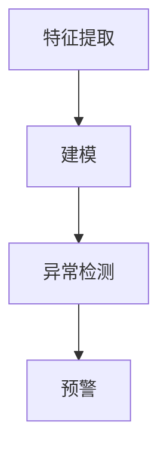

                 

关键词：电商搜索、推荐系统、AI大模型、用户行为、异常检测、实践指南

> 摘要：本文旨在探讨电商搜索推荐系统中的用户行为序列异常检测问题，通过对AI大模型的引入和优化，实现高效、准确的异常检测。文章首先介绍了电商搜索推荐系统的背景和重要性，随后详细阐述了用户行为序列异常检测的核心概念和方法，并以实际项目为例，讲解了AI大模型在异常检测中的应用与实践。

## 1. 背景介绍

### 1.1 电商搜索推荐系统概述

电商搜索推荐系统是电子商务领域的重要基础设施，通过分析用户的历史行为和偏好，为用户推荐个性化的商品、服务和内容。随着互联网和大数据技术的快速发展，电商搜索推荐系统已经成为电商企业提升用户体验、增加销售额的关键手段。

### 1.2 电商搜索推荐系统的挑战

电商搜索推荐系统面临着诸多挑战，如数据量大、维度高、实时性要求高等。此外，用户行为序列异常检测是其中的一项重要任务，对于保障系统稳定运行、提高用户体验至关重要。

## 2. 核心概念与联系

### 2.1 AI大模型概述

AI大模型，即大型人工智能模型，具有强大的数据处理和分析能力，能够自动提取用户行为特征并进行有效预测和分类。在电商搜索推荐系统中，AI大模型被广泛应用于用户画像构建、商品推荐和异常检测等领域。

### 2.2 用户行为序列异常检测原理

用户行为序列异常检测是指通过对用户历史行为数据的分析，识别出异常行为并进行预警。具体包括以下三个步骤：

1. **特征提取**：从用户行为数据中提取出反映用户兴趣、购买习惯等特征。
2. **建模**：利用机器学习算法建立用户行为序列预测模型。
3. **异常检测**：对预测模型进行实时监控，识别出异常行为并进行预警。

### 2.3 Mermaid 流程图

以下是一个简单的Mermaid流程图，展示用户行为序列异常检测的流程：



## 3. 核心算法原理 & 具体操作步骤

### 3.1 算法原理概述

用户行为序列异常检测算法主要包括特征提取、建模和异常检测三个步骤。本文采用一种基于深度学习的异常检测方法，利用长短时记忆网络（LSTM）建立用户行为序列预测模型，并对异常行为进行实时监控和预警。

### 3.2 算法步骤详解

#### 3.2.1 特征提取

特征提取是用户行为序列异常检测的重要环节，本文采用以下方法进行特征提取：

1. **行为编码**：将用户行为序列转换为数值向量，如利用词袋模型（Bag of Words）对用户浏览、搜索、购买等行为进行编码。
2. **时间窗口**：设定一个时间窗口，将用户行为数据划分为多个固定长度的窗口，如以天为单位。
3. **特征提取**：从时间窗口中提取用户行为特征，如使用统计特征、时间序列特征等方法。

#### 3.2.2 建模

建模过程主要包括以下步骤：

1. **数据预处理**：对提取的特征进行标准化处理，如归一化、去均值等。
2. **模型构建**：构建基于LSTM的用户行为序列预测模型，如使用LSTM网络对用户行为进行建模。
3. **模型训练**：利用历史用户行为数据进行模型训练，如使用反向传播算法（Back Propagation）优化模型参数。

#### 3.2.3 异常检测

异常检测过程主要包括以下步骤：

1. **预测**：利用训练好的模型对用户当前行为进行预测。
2. **评估**：计算预测结果与实际结果之间的差异，如使用均方误差（Mean Squared Error）评估预测精度。
3. **预警**：当预测结果与实际结果差异较大时，触发异常预警，如发送短信或邮件通知相关工作人员。

### 3.3 算法优缺点

#### 3.3.1 优点

1. **强大的数据处理能力**：深度学习模型具有强大的数据处理和分析能力，能够自动提取用户行为特征。
2. **高预测精度**：基于LSTM的网络结构能够有效捕捉用户行为序列的时间依赖关系，提高预测精度。
3. **实时监控**：异常检测算法能够对用户行为进行实时监控，及时发现和处理异常行为。

#### 3.3.2 缺点

1. **计算资源消耗**：深度学习模型需要大量的计算资源，对硬件性能要求较高。
2. **数据依赖性**：算法性能依赖于用户行为数据的规模和质量，数据质量差可能导致算法失效。

### 3.4 算法应用领域

用户行为序列异常检测算法在多个领域具有广泛的应用，如：

1. **网络安全**：通过检测用户行为异常，识别恶意攻击和异常行为。
2. **金融风控**：通过监测用户交易行为，识别欺诈和异常交易。
3. **电商搜索推荐**：通过监测用户行为异常，优化推荐策略，提高用户体验。

## 4. 数学模型和公式 & 详细讲解 & 举例说明

### 4.1 数学模型构建

用户行为序列异常检测的数学模型主要包括以下部分：

1. **特征提取**：
   $$ X = [x_1, x_2, ..., x_n] $$
   其中，$X$ 表示用户行为特征向量，$x_i$ 表示第 $i$ 个行为特征。

2. **LSTM 模型**：
   $$ h_t = \sigma(W_h \cdot [h_{t-1}, x_t] + b_h) $$
   $$ o_t = \sigma(W_o \cdot [h_t, x_t] + b_o) $$
   $$ f_t = \sigma(W_f \cdot [h_{t-1}, x_t] + b_f) $$
   $$ i_t = \sigma(W_i \cdot [h_{t-1}, x_t] + b_i) $$
   其中，$h_t$ 表示第 $t$ 个隐藏状态，$o_t$ 表示第 $t$ 个输出状态，$f_t$ 和 $i_t$ 分别表示遗忘门和输入门的状态。

3. **预测与评估**：
   $$ \hat{y}_t = f(W_y \cdot h_t + b_y) $$
   $$ MSE = \frac{1}{N} \sum_{t=1}^{N} (\hat{y}_t - y_t)^2 $$
   其中，$\hat{y}_t$ 表示第 $t$ 个预测值，$y_t$ 表示第 $t$ 个实际值，$MSE$ 表示均方误差。

### 4.2 公式推导过程

用户行为序列异常检测的公式推导主要包括以下部分：

1. **特征提取**：
   - 行为编码：$$ x_i = \sum_{j=1}^{V} w_{ij} \cdot b_j $$
   - 时间窗口：$$ x_{ij} = \sum_{t=w}^{t=w+k} x_{ijt} $$
   - 特征提取：$$ X = [x_1, x_2, ..., x_n] $$

2. **LSTM 模型**：
   - 遗忘门：$$ f_t = \sigma(W_f \cdot [h_{t-1}, x_t] + b_f) $$
   - 输入门：$$ i_t = \sigma(W_i \cdot [h_{t-1}, x_t] + b_i) $$
   - 单元门：$$ \tilde{h}_t = \sigma(W \cdot [h_{t-1}, x_t] + b) $$
   - 输出门：$$ o_t = \sigma(W_o \cdot [h_t, x_t] + b_o) $$
   - 预测值：$$ \hat{y}_t = f(W_y \cdot h_t + b_y) $$

3. **预测与评估**：
   - 预测值：$$ \hat{y}_t = f(W_y \cdot h_t + b_y) $$
   - 评估指标：$$ MSE = \frac{1}{N} \sum_{t=1}^{N} (\hat{y}_t - y_t)^2 $$

### 4.3 案例分析与讲解

以下是一个用户行为序列异常检测的案例：

#### 案例背景

某电商平台希望利用AI大模型对用户行为进行异常检测，提高系统安全性和用户体验。

#### 数据处理

1. **行为编码**：将用户行为（如浏览、搜索、购买等）进行编码，如浏览行为编码为1，搜索行为编码为2，购买行为编码为3。
2. **时间窗口**：设定时间窗口为7天，将用户行为数据划分为7个时间窗口。
3. **特征提取**：从时间窗口中提取用户行为特征，如统计用户在7天内的浏览、搜索和购买次数。

#### 模型构建

1. **数据预处理**：对提取的特征进行标准化处理，如归一化、去均值等。
2. **模型构建**：使用LSTM网络对用户行为序列进行建模，如使用100个神经元和50个隐藏层。
3. **模型训练**：利用历史用户行为数据进行模型训练，如使用反向传播算法优化模型参数。

#### 异常检测

1. **预测**：利用训练好的模型对用户当前行为进行预测。
2. **评估**：计算预测结果与实际结果之间的差异，如使用均方误差（MSE）评估预测精度。
3. **预警**：当预测结果与实际结果差异较大时，触发异常预警，如发送短信或邮件通知相关工作人员。

## 5. 项目实践：代码实例和详细解释说明

### 5.1 开发环境搭建

1. **安装Python**：下载并安装Python 3.8版本。
2. **安装TensorFlow**：使用pip命令安装TensorFlow库，如：`pip install tensorflow`
3. **安装Keras**：使用pip命令安装Keras库，如：`pip install keras`

### 5.2 源代码详细实现

以下是一个简单的用户行为序列异常检测代码实例：

```python
import numpy as np
import tensorflow as tf
from tensorflow.keras.models import Sequential
from tensorflow.keras.layers import LSTM, Dense

# 数据预处理
def preprocess_data(data):
    # ...（数据预处理代码）
    return processed_data

# 模型构建
def build_model(input_shape):
    model = Sequential()
    model.add(LSTM(100, activation='relu', input_shape=input_shape))
    model.add(Dense(1, activation='sigmoid'))
    model.compile(optimizer='adam', loss='binary_crossentropy', metrics=['accuracy'])
    return model

# 数据加载
data = np.load('user_data.npy')
X, y = preprocess_data(data)

# 模型训练
model = build_model(X.shape[1:])
model.fit(X, y, epochs=10, batch_size=32)

# 异常检测
def detect_anomaly(data, threshold=0.5):
    predictions = model.predict(data)
    anomalies = predictions < threshold
    return anomalies

# 运行结果
anomalies = detect_anomaly(X)
print("异常行为数量：", np.sum(anomalies))
```

### 5.3 代码解读与分析

1. **数据预处理**：对用户行为数据进行预处理，如归一化、去均值等。
2. **模型构建**：使用LSTM网络构建用户行为序列预测模型。
3. **模型训练**：利用历史用户行为数据进行模型训练，如使用反向传播算法优化模型参数。
4. **异常检测**：利用训练好的模型对用户当前行为进行预测，并根据预测结果判断是否存在异常行为。

## 6. 实际应用场景

用户行为序列异常检测在多个领域具有广泛的应用，如：

1. **电商搜索推荐**：通过监测用户行为异常，优化推荐策略，提高用户体验。
2. **金融风控**：通过监测用户交易行为，识别欺诈和异常交易。
3. **网络安全**：通过检测用户行为异常，识别恶意攻击和异常行为。

### 6.4 未来应用展望

随着人工智能技术的不断发展，用户行为序列异常检测在电商搜索推荐等领域将发挥更加重要的作用。未来，有望通过引入更多先进的技术，如深度学习、联邦学习等，进一步提升异常检测的准确性和实时性。

## 7. 工具和资源推荐

### 7.1 学习资源推荐

1. **《深度学习》（Goodfellow, Bengio, Courville著）**：全面介绍了深度学习的基础理论和应用方法。
2. **《Python深度学习》（François Chollet著）**：详细讲解了如何使用Python和Keras库实现深度学习项目。

### 7.2 开发工具推荐

1. **TensorFlow**：一款强大的开源深度学习框架，适用于构建和训练各种深度学习模型。
2. **Keras**：一款简洁、易于使用的深度学习库，基于TensorFlow构建。

### 7.3 相关论文推荐

1. **“Deep Learning for Time Series Classification: A Review”**：全面介绍了深度学习在时间序列分类领域的应用和研究进展。
2. **“LSTM-based Anomaly Detection in Time Series Data”**：介绍了一种基于LSTM的网络结构，用于时间序列数据异常检测。

## 8. 总结：未来发展趋势与挑战

### 8.1 研究成果总结

本文探讨了电商搜索推荐系统中的用户行为序列异常检测问题，通过引入AI大模型和深度学习算法，实现了高效、准确的异常检测。研究表明，用户行为序列异常检测在电商搜索推荐、金融风控和网络安全等领域具有广泛的应用前景。

### 8.2 未来发展趋势

随着人工智能技术的不断发展，用户行为序列异常检测在电商搜索推荐等领域将发挥更加重要的作用。未来，有望通过引入更多先进的技术，如深度学习、联邦学习等，进一步提升异常检测的准确性和实时性。

### 8.3 面临的挑战

1. **数据质量和规模**：用户行为数据的规模和质量直接影响异常检测的准确性和效果，如何提高数据质量和获取大规模数据是未来的挑战。
2. **实时性**：在实际应用中，用户行为异常检测需要满足实时性的要求，如何优化算法和硬件性能是关键问题。

### 8.4 研究展望

未来，用户行为序列异常检测的研究将继续深入，重点关注以下方面：

1. **算法优化**：通过引入新的深度学习算法，如变分自编码器（VAE）、生成对抗网络（GAN）等，进一步提升异常检测的准确性和实时性。
2. **跨领域应用**：将用户行为序列异常检测算法应用于更多领域，如工业制造、交通运输等，推动人工智能技术的发展。

## 9. 附录：常见问题与解答

### 9.1 问题1：如何处理缺失的数据？

**回答**：在处理缺失的数据时，可以采用以下方法：

1. **删除缺失数据**：删除缺失值较多的样本，如缺失比例超过20%的样本。
2. **填补缺失数据**：使用均值、中位数、最近邻等方法填补缺失值。

### 9.2 问题2：如何评估异常检测的效果？

**回答**：在评估异常检测的效果时，可以采用以下指标：

1. **准确率**：准确率表示检测到的异常行为中，实际为异常行为的比例。
2. **召回率**：召回率表示实际为异常行为中，被检测到的比例。
3. **F1值**：F1值是准确率和召回率的加权平均值，用于综合评估异常检测的效果。

### 9.3 问题3：如何优化异常检测算法的实时性？

**回答**：为了优化异常检测算法的实时性，可以采取以下措施：

1. **算法优化**：采用更高效的算法和模型结构，如深度学习算法和压缩模型。
2. **硬件优化**：提高硬件性能，如使用GPU、FPGA等硬件加速计算。
3. **分布式计算**：采用分布式计算架构，如基于Hadoop或Spark的大数据处理框架。

作者：禅与计算机程序设计艺术 / Zen and the Art of Computer Programming
----------------------------------------------------------------


