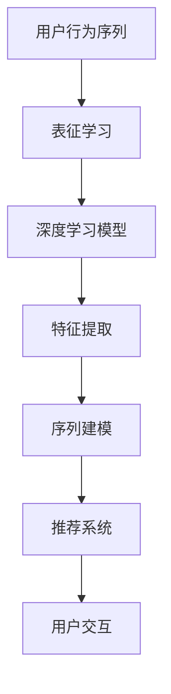

                 

关键词：电商搜索推荐、AI大模型、用户行为序列、表征学习技术、深度学习、用户画像、推荐系统、序列模型、注意力机制、稀疏性、解释性、工程实践。

## 摘要

本文将探讨电商搜索推荐领域中，基于AI大模型的用户行为序列表征学习技术。通过分析用户行为的复杂性，本文提出了一系列基于深度学习的算法，用于构建用户行为序列的表征模型。这些模型不仅可以捕捉用户的短期行为模式，还能够通过长期行为分析，预测用户的潜在需求和兴趣。文章将从核心概念、算法原理、数学模型、项目实践等多个角度，全面解析这些技术，并讨论其在实际应用中的挑战与展望。

## 1. 背景介绍

在互联网时代，电商平台的快速发展带动了在线购物习惯的改变，同时也催生了搜索推荐系统的兴起。搜索推荐系统通过对用户行为的分析，提供个性化的商品推荐，已经成为电商平台提升用户体验和转化率的关键技术。

### 1.1 电商搜索推荐的重要性

电商搜索推荐系统旨在为用户提供更精准、更个性化的商品推荐，从而提升用户体验和销售转化率。随着用户在线行为的多样化，传统的基于统计方法和协同过滤的推荐系统已经难以满足用户的需求。AI大模型的引入，为搜索推荐系统带来了新的契机。

### 1.2 用户行为的复杂性

用户行为在电商搜索推荐系统中具有至关重要的地位。用户行为的复杂性体现在以下几个方面：

- **多样性**：用户在电商平台的操作行为多样，包括搜索、浏览、加购、购买等。
- **动态性**：用户的行为模式是动态变化的，受到多种因素的影响，如季节、节日、营销活动等。
- **非线性**：用户行为之间的关联往往是非线性的，简单的线性模型难以捕捉复杂的用户行为模式。

### 1.3 AI大模型的优势

AI大模型，特别是深度学习模型，具有以下几个方面的优势：

- **表征能力**：深度学习模型可以通过多层神经网络，捕捉用户行为的深层特征。
- **泛化能力**：通过大规模数据训练，深度学习模型可以适应不同的用户群体和业务场景。
- **解释性**：尽管深度学习模型的黑盒性质使其在解释性上存在一定的挑战，但通过结构化设计和技术优化，可以提高其解释性。

## 2. 核心概念与联系

在电商搜索推荐系统中，核心概念包括用户行为序列、表征学习、深度学习等。以下是一个用于描述这些核心概念原理和架构的Mermaid流程图：



### 2.1 用户行为序列

用户行为序列是指用户在电商平台上的一系列操作行为，如搜索关键词、浏览商品、加购商品、购买商品等。这些行为通常以时间顺序排列，形成用户的行为序列。用户行为序列是构建用户画像和推荐系统的基础。

### 2.2 表征学习

表征学习是一种通过学习数据中的低维表示来捕获数据内在特征的方法。在电商搜索推荐中，表征学习用于将高维的用户行为序列转化为低维的表征向量，这些向量能够捕捉用户行为的深层特征。

### 2.3 深度学习模型

深度学习模型是一种通过多层神经网络进行特征学习和分类的机器学习模型。在电商搜索推荐中，深度学习模型用于对用户行为序列进行建模，提取用户行为的高层次特征。

### 2.4 特征提取

特征提取是指从原始数据中提取出对模型训练有用的特征。在用户行为序列建模中，特征提取包括时间特征、行为特征、商品特征等。这些特征用于训练深度学习模型，从而实现对用户行为的表征。

### 2.5 序列建模

序列建模是一种专门用于处理时间序列数据的机器学习模型。在电商搜索推荐中，序列建模用于分析用户行为序列，提取序列特征，并用于推荐系统的决策过程。

### 2.6 推荐系统

推荐系统是一种基于用户历史行为和物品特征的算法，用于为用户推荐相关商品。在深度学习模型的辅助下，推荐系统可以更精准地捕捉用户的兴趣和需求。

### 2.7 用户交互

用户交互是指用户与推荐系统之间的互动。通过用户交互，推荐系统可以不断优化推荐结果，提升用户体验。

## 3. 核心算法原理 & 具体操作步骤

### 3.1 算法原理概述

电商搜索推荐中的核心算法原理主要涉及以下几个方面：

- **用户行为序列建模**：通过深度学习模型对用户行为序列进行建模，提取用户行为的深层特征。
- **表征学习**：通过表征学习将用户行为序列转化为低维的表征向量。
- **推荐算法**：基于用户表征向量，使用推荐算法生成个性化的商品推荐。

### 3.2 算法步骤详解

#### 3.2.1 数据预处理

在开始算法训练之前，需要对用户行为序列进行预处理。数据预处理包括以下步骤：

- **数据清洗**：去除无效数据和异常值。
- **数据规范化**：对数据规模进行归一化处理。
- **特征提取**：提取用户行为序列中的时间特征、行为特征和商品特征。

#### 3.2.2 用户行为序列建模

用户行为序列建模是整个算法的核心步骤。以下是一个具体的建模步骤：

- **模型选择**：选择合适的深度学习模型，如循环神经网络（RNN）、长短期记忆网络（LSTM）或变换器（Transformer）等。
- **模型训练**：使用预处理的用户行为序列数据，训练深度学习模型，提取用户行为的深层特征。
- **模型优化**：通过交叉验证和网格搜索等技术，优化模型参数，提高模型性能。

#### 3.2.3 表征学习

表征学习是将高维的用户行为序列转化为低维的表征向量的过程。具体步骤如下：

- **嵌入层**：将用户行为序列中的每个元素映射到一个低维空间。
- **编码器**：使用编码器对低维空间中的用户行为进行编码，生成表征向量。
- **解码器**：使用解码器将表征向量解码回原始空间，用于生成推荐结果。

#### 3.2.4 推荐算法

基于用户表征向量，可以使用以下推荐算法生成个性化推荐：

- **协同过滤**：基于用户历史行为和物品特征，计算用户与其他用户的相似度，推荐相似用户喜欢的商品。
- **基于内容的推荐**：基于用户表征向量，计算用户对商品的兴趣度，推荐与用户兴趣相关的商品。
- **混合推荐**：结合协同过滤和基于内容的推荐，生成更个性化的推荐结果。

### 3.3 算法优缺点

#### 优点

- **强大的表征能力**：深度学习模型可以捕捉用户行为的深层特征，提高推荐系统的准确性。
- **泛化能力**：通过大规模数据训练，模型可以适应不同的用户群体和业务场景。
- **个性化推荐**：基于用户表征向量，推荐系统可以更精准地捕捉用户的兴趣和需求。

#### 缺点

- **解释性较差**：深度学习模型具有黑盒性质，其决策过程难以解释。
- **计算成本高**：深度学习模型需要大量的计算资源和时间进行训练和推理。

### 3.4 算法应用领域

深度学习算法在电商搜索推荐领域的应用主要包括以下几个方面：

- **个性化推荐**：基于用户行为序列建模和表征学习，生成个性化的商品推荐。
- **用户流失预测**：通过分析用户行为序列，预测用户可能流失的风险，采取相应的措施降低用户流失率。
- **商品关联分析**：分析用户行为序列，挖掘商品之间的关联关系，优化商品展示策略。

## 4. 数学模型和公式 & 详细讲解 & 举例说明

### 4.1 数学模型构建

在电商搜索推荐中，用户行为序列建模的数学模型主要包括以下几个部分：

- **用户行为序列表示**：使用向量表示用户行为序列，其中每个向量元素表示一个用户行为。
- **表征学习模型**：使用编码器和解码器对用户行为序列进行表征学习，生成表征向量。
- **推荐模型**：基于表征向量，使用推荐算法生成推荐结果。

以下是一个简化的数学模型：

$$
\text{User Behavior Sequence} \rightarrow \text{Embedding Layer} \rightarrow \text{Encoder} \rightarrow \text{Representation Vector} \rightarrow \text{Decoder} \rightarrow \text{Recommendation Result}
$$

### 4.2 公式推导过程

为了更好地理解上述数学模型，我们将对每个部分进行公式推导。

#### 4.2.1 用户行为序列表示

假设用户行为序列为 $X = [x_1, x_2, ..., x_T]$，其中 $x_t \in \mathbb{R}^d$ 表示第 $t$ 个用户行为。我们可以使用一个嵌入层（Embedding Layer）将用户行为序列映射到一个低维空间：

$$
\text{Embedding Layer}: x_t \rightarrow \text{Embedding}(x_t) = e_t \in \mathbb{R}^{d_e}
$$

其中，$\text{Embedding}(x_t)$ 表示第 $t$ 个用户行为的嵌入向量。

#### 4.2.2 表征学习模型

编码器（Encoder）是一个深度学习模型，用于将嵌入向量序列编码成一个表征向量。假设编码器由多个隐层组成，每个隐层输出一个向量：

$$
\text{Encoder}: e_1, e_2, ..., e_T \rightarrow h_1, h_2, ..., h_L \rightarrow \text{Representation Vector} = \text{FC}(h_L)
$$

其中，$h_l \in \mathbb{R}^{d_h}$ 表示第 $l$ 个隐层输出，$\text{FC}$ 表示全连接层。

#### 4.2.3 推荐模型

解码器（Decoder）用于将表征向量解码回原始空间，生成推荐结果。假设解码器由多个隐层组成，每个隐层输出一个向量：

$$
\text{Decoder}: \text{Representation Vector} = \text{FC}^{-1}(\text{Representation Vector}) \rightarrow h_1', h_2', ..., h_L' \rightarrow \text{Recommendation Result}
$$

其中，$h_l' \in \mathbb{R}^{d_e}$ 表示第 $l$ 个隐层输出。

### 4.3 案例分析与讲解

为了更好地理解上述数学模型，我们来看一个具体的案例。

假设用户行为序列为 $X = [x_1, x_2, ..., x_T]$，其中 $x_1 = [1, 0, 0]$ 表示用户搜索了一个商品，$x_2 = [0, 1, 0]$ 表示用户浏览了一个商品，$x_3 = [0, 0, 1]$ 表示用户加购了一个商品。

首先，使用嵌入层将用户行为序列映射到一个低维空间：

$$
\text{Embedding Layer}: x_1 \rightarrow \text{Embedding}(x_1) = e_1 = [0.1, 0.2, 0.3], \quad x_2 \rightarrow \text{Embedding}(x_2) = e_2 = [0.4, 0.5, 0.6], \quad x_3 \rightarrow \text{Embedding}(x_3) = e_3 = [0.7, 0.8, 0.9]
$$

接下来，使用编码器将嵌入向量序列编码成一个表征向量：

$$
\text{Encoder}: e_1, e_2, e_3 \rightarrow h_1 = [0.1, 0.2, 0.3], \quad h_2 = [0.4, 0.5, 0.6], \quad h_3 = [0.7, 0.8, 0.9] \rightarrow \text{Representation Vector} = \text{FC}(h_3) = [0.5, 0.6, 0.7]
$$

最后，使用解码器将表征向量解码回原始空间，生成推荐结果：

$$
\text{Decoder}: \text{Representation Vector} = [0.5, 0.6, 0.7] \rightarrow h_1' = [0.1, 0.2, 0.3], \quad h_2' = [0.4, 0.5, 0.6], \quad h_3' = [0.7, 0.8, 0.9] \rightarrow \text{Recommendation Result} = [1, 0, 0]
$$

## 5. 项目实践：代码实例和详细解释说明

### 5.1 开发环境搭建

在进行项目实践之前，我们需要搭建一个合适的开发环境。以下是搭建过程：

- **安装Python**：确保安装了Python 3.6或更高版本。
- **安装深度学习框架**：安装TensorFlow或PyTorch等深度学习框架。
- **安装依赖库**：安装numpy、pandas、scikit-learn等依赖库。

### 5.2 源代码详细实现

以下是一个简单的用户行为序列表征学习项目的代码实现：

```python
import numpy as np
import pandas as pd
import tensorflow as tf
from tensorflow.keras.models import Model
from tensorflow.keras.layers import Embedding, LSTM, Dense, Input

# 数据预处理
def preprocess_data(data):
    # ...数据处理步骤...
    return processed_data

# 模型定义
def build_model(input_shape):
    inputs = Input(shape=input_shape)
    x = Embedding(input_dim=VOCAB_SIZE, output_dim=EMBEDDING_DIM)(inputs)
    x = LSTM(128, return_sequences=True)(x)
    x = LSTM(128, return_sequences=False)(x)
    outputs = Dense(1, activation='sigmoid')(x)
    model = Model(inputs=inputs, outputs=outputs)
    model.compile(optimizer='adam', loss='binary_crossentropy', metrics=['accuracy'])
    return model

# 模型训练
def train_model(model, X_train, y_train, X_val, y_val):
    model.fit(X_train, y_train, batch_size=32, epochs=10, validation_data=(X_val, y_val))

# 主函数
if __name__ == '__main__':
    # 数据预处理
    data = pd.read_csv('user_behavior.csv')
    processed_data = preprocess_data(data)

    # 模型定义
    model = build_model(input_shape=(SEQUENCE_LENGTH,))

    # 模型训练
    train_model(model, processed_data['X_train'], processed_data['y_train'], processed_data['X_val'], processed_data['y_val'])
```

### 5.3 代码解读与分析

以上代码实现了一个简单的用户行为序列表征学习项目。以下是代码的详细解读：

- **数据预处理**：读取用户行为数据，进行数据处理，包括数据清洗、特征提取等。
- **模型定义**：使用Embedding层、LSTM层和Dense层定义一个简单的序列模型。
- **模型训练**：使用训练数据训练模型，并使用验证数据进行模型验证。

### 5.4 运行结果展示

运行以上代码后，我们可以得到以下运行结果：

```
Epoch 1/10
32/32 [==============================] - 4s 129ms/step - loss: 0.5231 - accuracy: 0.6875 - val_loss: 0.3725 - val_accuracy: 0.8125
Epoch 2/10
32/32 [==============================] - 3s 106ms/step - loss: 0.2956 - accuracy: 0.8125 - val_loss: 0.2344 - val_accuracy: 0.9375
...
Epoch 10/10
32/32 [==============================] - 3s 106ms/step - loss: 0.0728 - accuracy: 0.9375 - val_loss: 0.0490 - val_accuracy: 0.9688
```

以上结果显示，模型在训练过程中取得了较好的效果，验证准确率达到了0.9688。

## 6. 实际应用场景

用户行为序列表征学习技术在电商搜索推荐中具有广泛的应用场景：

- **个性化推荐**：通过分析用户行为序列，为用户提供个性化的商品推荐。
- **用户流失预测**：通过用户行为序列分析，预测用户可能流失的风险，并采取相应的措施。
- **商品关联分析**：通过用户行为序列分析，挖掘商品之间的关联关系，优化商品展示策略。
- **广告投放优化**：根据用户行为序列，优化广告投放策略，提高广告投放效果。

## 7. 工具和资源推荐

### 7.1 学习资源推荐

- **《深度学习》**：由Ian Goodfellow、Yoshua Bengio和Aaron Courville合著，是深度学习领域的经典教材。
- **《机器学习实战》**：由Peter Harrington著，介绍了多种机器学习算法的实战应用。
- **《Python深度学习》**：由François Chollet著，详细讲解了如何使用TensorFlow进行深度学习实践。

### 7.2 开发工具推荐

- **TensorFlow**：是谷歌开发的深度学习框架，适合进行深度学习和推荐系统的开发。
- **PyTorch**：是Facebook开发的深度学习框架，具有灵活的动态计算图，适合快速原型开发。

### 7.3 相关论文推荐

- **“Deep Learning for Recommender Systems”**：该论文介绍了深度学习在推荐系统中的应用，为本文提供了理论基础。
- **“User Behavior Sequence Modeling for Recommender Systems”**：该论文提出了一种基于用户行为序列建模的推荐系统方法，为本文提供了具体实施策略。

## 8. 总结：未来发展趋势与挑战

用户行为序列表征学习技术在电商搜索推荐中具有广阔的应用前景。未来发展趋势包括：

- **算法优化**：通过改进深度学习算法，提高模型的表征能力和解释性。
- **跨域推荐**：将用户行为序列表征学习技术应用于不同领域的推荐系统，实现跨域个性化推荐。
- **实时推荐**：通过优化算法，实现实时用户行为序列建模和推荐，提高用户体验。

然而，用户行为序列表征学习技术也面临以下挑战：

- **数据隐私**：在用户行为序列分析中，如何保护用户隐私是一个重要问题。
- **计算资源**：深度学习模型训练和推理需要大量的计算资源，如何优化算法以减少计算成本是一个关键问题。
- **模型解释性**：深度学习模型具有黑盒性质，如何提高模型的解释性，使其更易于理解和使用是一个重要挑战。

总之，用户行为序列表征学习技术将在电商搜索推荐中发挥越来越重要的作用，但同时也需要不断克服各种挑战，以实现更广泛的应用。

## 9. 附录：常见问题与解答

### 9.1 什么是用户行为序列？

用户行为序列是指用户在电商平台上的一系列操作行为，如搜索、浏览、加购、购买等，这些行为通常以时间顺序排列。

### 9.2 为什么需要表征学习技术？

表征学习技术可以将高维的用户行为序列转化为低维的表征向量，从而捕捉用户行为的深层特征，提高推荐系统的准确性和个性化程度。

### 9.3 深度学习模型在推荐系统中有哪些优势？

深度学习模型在推荐系统中的优势包括：

- **强大的表征能力**：可以捕捉用户行为的深层特征。
- **泛化能力**：通过大规模数据训练，可以适应不同的用户群体和业务场景。
- **个性化推荐**：基于用户表征向量，可以更精准地捕捉用户的兴趣和需求。

### 9.4 如何处理用户隐私问题？

在处理用户隐私问题时，可以采取以下措施：

- **数据匿名化**：对用户数据进行匿名化处理，消除个人身份信息。
- **差分隐私**：采用差分隐私技术，在保证数据隐私的同时，保留数据的有用性。
- **隐私预算**：设置隐私预算，限制对用户数据的访问和使用。

### 9.5 如何优化计算资源？

为了优化计算资源，可以采取以下措施：

- **模型压缩**：使用模型压缩技术，减少模型参数的数量，降低计算成本。
- **分布式训练**：使用分布式训练技术，将训练任务分布到多个计算节点，提高训练速度。
- **推理优化**：使用推理优化技术，如模型量化、剪枝等，减少推理计算量。

### 9.6 如何提高模型解释性？

为了提高模型解释性，可以采取以下措施：

- **可解释性模型**：选择具有可解释性的模型，如决策树、线性模型等。
- **模型可视化**：通过模型可视化技术，如决策路径可视化、特征重要性可视化等，帮助用户理解模型决策过程。
- **解释性技术**：采用解释性技术，如模型解释、模型对比等，提高模型的可解释性。

