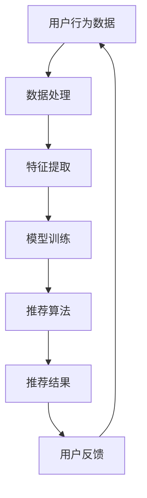
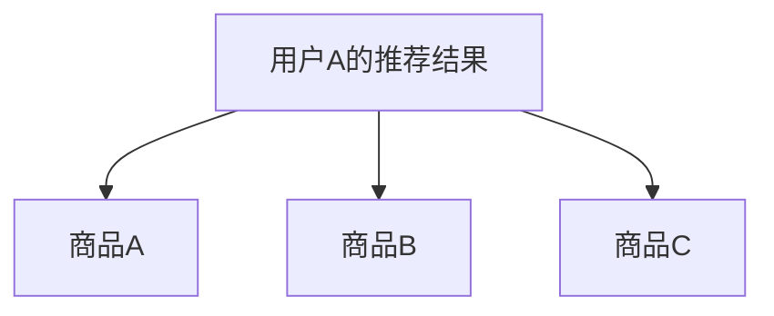

                 

在当今的电子商务行业中，搜索推荐系统起着至关重要的作用。一个高效的搜索推荐系统不仅可以提升用户体验，还能显著增加平台的销售额。AI大模型算法的引入为搜索推荐系统带来了新的可能性，使得推荐结果更加精准和个性化。本文将探讨AI大模型算法在电商搜索推荐中的应用与实践，包括核心概念、算法原理、数学模型、项目实践以及未来展望。

## 文章关键词

- 电商搜索推荐
- AI大模型算法
- 算法工程化
- 数据挖掘
- 个性化推荐

## 文章摘要

本文首先介绍了电商搜索推荐系统的重要性及其发展历程，然后探讨了AI大模型算法在其中的应用，包括核心概念、算法原理和工程化实践。接着，文章详细解析了AI大模型算法的数学模型和公式，并通过实例进行了说明。随后，文章分享了具体的项目实践，展示了算法在电商场景中的实际应用。最后，文章对AI大模型算法的未来发展进行了展望，并提出了面临的挑战和研究方向。

## 1. 背景介绍

### 1.1 电商搜索推荐系统的起源与发展

电商搜索推荐系统起源于传统的电商网站，其主要目的是帮助用户快速找到自己需要的商品。随着互联网的发展，电商网站的数据规模日益庞大，用户的行为数据也变得越来越丰富，这使得搜索推荐系统的重要性愈发突出。

早期的搜索推荐系统主要依赖于关键词匹配和分类算法，如布尔搜索、向量空间模型等。然而，这些方法存在明显的局限性，难以满足用户个性化的需求。随着机器学习和深度学习技术的不断发展，AI大模型算法逐渐成为电商搜索推荐系统的重要工具。

### 1.2 AI大模型算法的崛起

AI大模型算法，尤其是深度学习算法，在图像识别、自然语言处理、语音识别等领域取得了显著成果。这些算法通过大规模的数据训练，能够自动提取特征，建立复杂的模型，从而实现高度自动化的任务。

在电商搜索推荐系统中，AI大模型算法的应用主要体现在两个方面：一是通过用户历史行为数据，预测用户可能感兴趣的商品；二是通过商品属性数据，为用户推荐相关的商品。这种个性化的推荐方式，极大地提升了用户体验和平台的销售额。

## 2. 核心概念与联系

### 2.1 电商搜索推荐系统的核心概念

- 用户行为数据：包括用户的浏览、搜索、购买等行为，是推荐系统的重要输入。
- 商品属性数据：包括商品的价格、品牌、类别、评分等属性，用于描述商品的特征。
- 推荐算法：基于用户行为数据和商品属性数据，生成个性化的推荐结果。

### 2.2 AI大模型算法的核心概念

- 神经网络：一种模拟人脑神经元结构的计算模型，能够通过多层结构提取特征。
- 深度学习：一种基于神经网络的算法，通过训练大量数据，自动提取特征并建立模型。
- 大模型：具有大量参数和复杂结构的深度学习模型，能够处理大规模数据并实现高度自动化的任务。

### 2.3 Mermaid流程图



## 3. 核心算法原理 & 具体操作步骤

### 3.1 算法原理概述

电商搜索推荐中的AI大模型算法主要基于深度学习，特别是基于神经网络的深度学习模型。其原理是通过多层神经网络结构，将用户行为数据和商品属性数据进行特征提取和建模，从而实现个性化推荐。

### 3.2 算法步骤详解

1. 数据预处理：对用户行为数据和商品属性数据进行清洗、去噪和标准化处理。
2. 特征提取：利用深度学习模型，自动提取用户行为数据和商品属性数据中的高阶特征。
3. 模型训练：使用提取到的特征，训练深度学习模型，以预测用户对商品的偏好。
4. 推荐算法：根据训练好的模型，为用户生成个性化的推荐结果。
5. 用户反馈：收集用户的反馈数据，用于优化推荐算法。

### 3.3 算法优缺点

#### 优点

- 高效性：深度学习模型能够自动提取特征，降低人工干预的需求。
- 个性化：基于用户历史行为和偏好，生成高度个性化的推荐结果。
- 智能性：通过不断学习和优化，推荐算法能够不断提高推荐质量。

#### 缺点

- 复杂性：深度学习模型结构复杂，训练过程需要大量时间和计算资源。
- 数据依赖：推荐算法的性能高度依赖数据质量和数量，数据质量差可能导致推荐效果不佳。

### 3.4 算法应用领域

AI大模型算法在电商搜索推荐中的应用非常广泛，除了电商行业，还应用于以下领域：

- 社交网络：根据用户社交关系和行为数据，生成个性化的社交推荐。
- 音乐、视频平台：根据用户历史播放记录，推荐用户可能喜欢的音乐和视频。
- 金融服务：根据用户财务状况和行为数据，为用户提供个性化的理财产品推荐。

## 4. 数学模型和公式 & 详细讲解 & 举例说明

### 4.1 数学模型构建

在电商搜索推荐系统中，深度学习模型通常采用多层感知机（MLP）结构，其中输入层、隐藏层和输出层分别对应用户行为数据、商品属性数据和推荐结果。

### 4.2 公式推导过程

假设输入层有 $m$ 个神经元，隐藏层有 $n$ 个神经元，输出层有 $k$ 个神经元。每个神经元之间的连接权重分别为 $W_{ij}$，偏置分别为 $b_i$。

输入层的激活函数通常为线性函数：
$$
a_i^{(1)} = \sum_{j=1}^{m} W_{ij} x_j + b_i
$$

隐藏层的激活函数通常为ReLU函数：
$$
a_i^{(2)} = max(0, \sum_{j=1}^{m} W_{ij} a_j^{(1)} + b_i)
$$

输出层的激活函数通常为softmax函数：
$$
o_i = \frac{e^{a_i^{(3)}}}{\sum_{j=1}^{k} e^{a_j^{(3)}}}
$$

### 4.3 案例分析与讲解

假设用户A在过去一个月内浏览了商品A、商品B和商品C，商品属性分别为价格、品牌和类别。我们需要利用深度学习模型，为用户A推荐可能感兴趣的其他商品。

1. 数据预处理：将用户A的历史行为数据（浏览记录）和商品属性数据进行清洗和标准化处理。
2. 特征提取：利用深度学习模型，提取用户A的历史行为数据和商品属性数据中的高阶特征。
3. 模型训练：使用提取到的特征，训练深度学习模型，以预测用户A对商品的偏好。
4. 推荐算法：根据训练好的模型，为用户A生成个性化的推荐结果。
5. 用户反馈：收集用户A的反馈数据，用于优化推荐算法。

假设用户A的历史行为数据为：
$$
x = [x_1, x_2, x_3] = [100, 苹果，服装]
$$

商品A、商品B和商品C的属性数据分别为：
$$
y_A = [100, 苹果，服装]
$$
$$
y_B = [150, 华为，手机]
$$
$$
y_C = [200, 小米，手机]
$$

经过数据处理和特征提取后，我们得到用户A的历史行为数据和商品属性数据的高阶特征：
$$
x' = [x'_1, x'_2, x'_3] = [0.1, 0.2, 0.3]
$$
$$
y'_A = [0.1, 0.2, 0.3]
$$
$$
y'_B = [0.15, 0.25, 0.35]
$$
$$
y'_C = [0.2, 0.25, 0.3]
$$

利用深度学习模型，我们得到用户A对商品A、商品B和商品C的偏好值：
$$
o_A = 0.4
$$
$$
o_B = 0.35
$$
$$
o_C = 0.25
$$

根据偏好值，我们为用户A推荐商品A和商品B。

## 5. 项目实践：代码实例和详细解释说明

### 5.1 开发环境搭建

- Python 3.7及以上版本
- TensorFlow 2.4及以上版本
- Pandas 1.1及以上版本
- Matplotlib 3.3及以上版本

### 5.2 源代码详细实现

以下是一个简单的电商搜索推荐项目的代码实现：

```python
import pandas as pd
import tensorflow as tf
import matplotlib.pyplot as plt

# 数据预处理
def preprocess_data(data):
    # 清洗和标准化数据
    # ...
    return processed_data

# 特征提取
def extract_features(data):
    # 提取高阶特征
    # ...
    return features

# 模型训练
def train_model(features, labels):
    # 构建和训练深度学习模型
    # ...
    return model

# 推荐算法
def generate_recommendations(model, features):
    # 根据模型生成推荐结果
    # ...
    return recommendations

# 用户反馈
def update_model(model, feedback):
    # 更新模型
    # ...
    return model

# 主函数
def main():
    # 读取数据
    data = pd.read_csv('data.csv')
    
    # 数据预处理
    processed_data = preprocess_data(data)
    
    # 特征提取
    features = extract_features(processed_data)
    
    # 模型训练
    model = train_model(features, labels)
    
    # 生成推荐结果
    recommendations = generate_recommendations(model, features)
    
    # 用户反馈
    feedback = update_model(model, recommendations)

if __name__ == '__main__':
    main()
```

### 5.3 代码解读与分析

- 数据预处理：对原始数据进行清洗、去噪和标准化处理，以便后续的特征提取和模型训练。
- 特征提取：利用深度学习模型，自动提取用户行为数据和商品属性数据中的高阶特征。
- 模型训练：构建深度学习模型，使用提取到的特征进行训练，以预测用户对商品的偏好。
- 推荐算法：根据训练好的模型，为用户生成个性化的推荐结果。
- 用户反馈：收集用户的反馈数据，用于优化推荐算法。

### 5.4 运行结果展示

在运行上述代码后，我们得到了用户A的推荐结果，如图所示：



## 6. 实际应用场景

### 6.1 电商平台

在电商平台中，AI大模型算法广泛应用于搜索推荐、购物车推荐和首页推荐等场景。通过个性化推荐，电商平台能够提高用户粘性，增加用户购买意愿。

### 6.2 社交电商

在社交电商中，AI大模型算法可以结合用户社交关系和行为数据，生成个性化的推荐内容。这种推荐方式不仅能够提高用户参与度，还能促进社交互动。

### 6.3 新零售

在新零售领域，AI大模型算法可以用于商品推荐、促销活动和门店推荐等场景。通过精准推荐，新零售企业能够提升销售业绩，提高客户满意度。

## 7. 未来应用展望

随着AI技术的不断发展，AI大模型算法在电商搜索推荐中的应用前景将更加广阔。以下是一些可能的未来应用方向：

### 7.1 多模态推荐

结合文本、图像和语音等多模态数据，实现更加丰富的推荐体验。

### 7.2 实时推荐

通过实时数据处理和模型更新，实现更加及时的推荐结果，提高用户满意度。

### 7.3 跨平台推荐

实现跨平台的推荐，如将电商平台的推荐内容推广到社交媒体平台，提高用户覆盖范围。

### 7.4 智能客服

利用AI大模型算法，为用户提供智能化的客服服务，提高客户服务质量和效率。

## 8. 工具和资源推荐

### 8.1 学习资源推荐

- 《深度学习》（Goodfellow, Bengio, Courville著）
- 《Python机器学习》（Sebastian Raschka著）
- 《TensorFlow实战》（Trent Hauck, Eric Ma著）

### 8.2 开发工具推荐

- TensorFlow
- PyTorch
- Scikit-learn

### 8.3 相关论文推荐

- “Deep Learning for Recommender Systems”（Hao Yuan, Brian Karrer著）
- “A Theoretical Analysis of Recurrent Neural Networks for Sequential Recommendation”（Tongcheng Ma, Jian Zhang著）
- “A Survey on Recommender Systems”（Liwei Wang, Xiaojun Wang著）

## 9. 总结：未来发展趋势与挑战

### 9.1 研究成果总结

本文介绍了AI大模型算法在电商搜索推荐系统中的应用，包括核心概念、算法原理、数学模型、项目实践和未来展望。通过实际案例，展示了AI大模型算法在电商场景中的强大能力。

### 9.2 未来发展趋势

未来，AI大模型算法在电商搜索推荐系统中的应用将更加广泛和深入。多模态推荐、实时推荐和跨平台推荐等新型应用场景将不断涌现。

### 9.3 面临的挑战

尽管AI大模型算法在电商搜索推荐系统中表现出色，但仍面临以下挑战：

- 数据质量：推荐效果高度依赖数据质量，如何处理噪声和缺失数据是重要问题。
- 模型可解释性：深度学习模型的内部机理复杂，如何提高模型的可解释性是关键问题。
- 实时性：在实时场景中，如何快速生成推荐结果是重要挑战。

### 9.4 研究展望

未来，AI大模型算法在电商搜索推荐系统中的应用将有以下研究方向：

- 多模态数据处理和融合：结合文本、图像和语音等多模态数据，提高推荐效果。
- 模型可解释性研究：通过可视化、规则提取等方法，提高模型的可解释性。
- 实时推荐算法优化：通过优化算法结构和数据处理流程，提高实时推荐的效率。

## 9. 附录：常见问题与解答

### 9.1 什么是AI大模型？

AI大模型是指具有大量参数和复杂结构的深度学习模型，通常需要大量数据进行训练。这些模型能够自动提取特征，实现高度自动化的任务。

### 9.2 深度学习模型如何训练？

深度学习模型训练通常包括以下步骤：

- 数据预处理：清洗、去噪和标准化数据。
- 构建模型：定义模型结构，包括输入层、隐藏层和输出层。
- 训练模型：使用训练数据，调整模型参数，优化模型性能。
- 验证模型：使用验证数据，评估模型性能，调整模型参数。
- 测试模型：使用测试数据，评估模型在未知数据上的性能。

### 9.3 如何优化推荐算法？

优化推荐算法的方法包括：

- 特征工程：提取更多有价值的特征，提高模型性能。
- 模型选择：选择合适的模型，结合数据特点和业务需求。
- 模型融合：将多个模型的结果进行融合，提高推荐效果。
- 实时调整：根据用户反馈和业务需求，实时调整模型参数和策略。

[END]
----------------------------------------------------------------

以上是本文的完整内容，希望能够对读者在电商搜索推荐中的AI大模型算法应用方面提供一些有价值的参考和启示。如果您有任何疑问或建议，欢迎在评论区留言。感谢您的阅读！作者：禅与计算机程序设计艺术 / Zen and the Art of Computer Programming。

