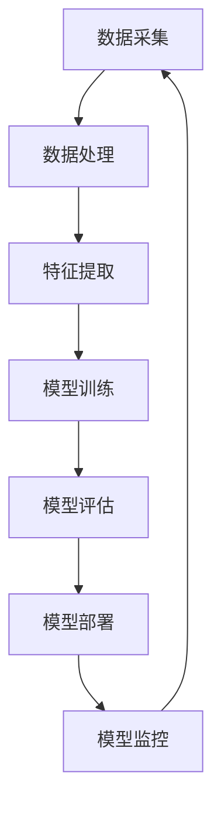

                 

电商行业作为互联网经济的重要组成部分，其核心在于为用户提供个性化的购物体验。而搜索推荐系统是电商平台的“智能大脑”，通过对海量商品数据的深入分析，实现精准的个性化推荐，从而提高用户满意度和平台收益。在AI大模型的支持下，搜索推荐系统的效果得到了显著提升。然而，随着模型的不断迭代和优化，如何高效地管理模型版本，成为了一个亟待解决的问题。

本文旨在探讨电商搜索推荐场景下的AI大模型模型版本管理策略，从背景介绍、核心概念与联系、核心算法原理、数学模型、项目实践、实际应用场景以及未来展望等多个方面，详细阐述模型版本管理的重要性和具体实现方法。

## 1. 背景介绍

电商搜索推荐系统作为电商平台的“智慧引擎”，其重要性不言而喻。通过搜索推荐系统，电商平台能够根据用户的浏览记录、购买行为、兴趣偏好等多维度数据，为用户提供个性化的商品推荐。这不仅能够提高用户的购物体验，还能显著提升平台的销售转化率和用户粘性。

随着AI技术的发展，特别是深度学习等算法的广泛应用，电商搜索推荐系统的性能得到了大幅提升。AI大模型，尤其是基于神经网络的推荐模型，在处理复杂特征、捕捉用户行为模式方面表现出色。然而，模型的迭代和优化是一个持续的过程，随着数据的不断积累和算法的不断创新，模型的版本管理变得尤为关键。

模型版本管理的目的是确保推荐系统能够在迭代过程中保持稳定性和可追溯性。具体来说，模型版本管理需要解决以下几个问题：

1. **版本控制**：确保每个模型的版本号能够清晰区分，方便后续追踪和回溯。
2. **稳定性保障**：确保模型更新不会对现有业务造成负面影响，例如，用户推荐结果的一致性和准确性。
3. **效率提升**：通过优化模型更新流程，减少模型更新所需的时间和资源。
4. **风险管理**：在模型更新过程中，降低潜在风险，如数据泄露、模型崩溃等。

## 2. 核心概念与联系

在讨论AI大模型模型版本管理之前，首先需要了解一些核心概念和它们之间的关系。以下是一个使用Mermaid绘制的流程图，描述了这些核心概念及其相互联系。



### 2.1 数据采集

数据采集是整个流程的起点，它包括用户行为数据、商品信息、交易数据等。这些数据将被用于模型的训练和评估。

### 2.2 数据处理

数据处理阶段包括数据清洗、去重、归一化等操作，以确保数据的质量和一致性。

### 2.3 特征提取

特征提取是将原始数据转换为模型可处理的特征向量。这一阶段需要深入理解用户行为和商品属性，提取出对推荐系统有意义的特征。

### 2.4 模型训练

模型训练是核心环节，通过使用深度学习算法，模型将在大量数据上进行训练，以学习到用户的偏好和商品属性之间的关联。

### 2.5 模型评估

模型评估用于验证模型的性能，包括准确率、召回率、F1分数等指标。评估结果将决定模型是否满足业务需求。

### 2.6 模型部署

模型部署是将训练好的模型上线，使其能够为用户提供实时推荐服务。

### 2.7 模型监控

模型监控确保模型在上线后的稳定运行，监测模型性能和异常情况，以便及时进行调整。

通过上述流程，我们可以看到模型版本管理在整个AI大模型生命周期中的重要性。每个环节都需要对模型版本进行严格的管理，以确保系统的稳定性和持续优化。

## 3. 核心算法原理 & 具体操作步骤

### 3.1 算法原理概述

电商搜索推荐系统中的核心算法主要包括基于内容的推荐、协同过滤推荐和深度学习推荐。本文主要探讨深度学习推荐算法，特别是基于神经网络的模型。

深度学习推荐算法的核心思想是通过学习用户和商品之间的复杂关联，实现精准的个性化推荐。常见的神经网络架构包括卷积神经网络（CNN）、循环神经网络（RNN）和变换器（Transformer）等。

### 3.2 算法步骤详解

#### 3.2.1 数据预处理

在模型训练之前，需要对数据进行预处理。包括：

1. 数据清洗：去除缺失值、异常值和重复值。
2. 数据归一化：将不同量纲的数据转换为统一的尺度。
3. 数据分片：将数据划分为训练集、验证集和测试集。

#### 3.2.2 特征工程

特征工程是推荐系统成功的关键。需要提取以下特征：

1. 用户特征：如用户年龄、性别、地理位置等。
2. 商品特征：如商品类别、价格、品牌等。
3. 行为特征：如用户浏览记录、购买历史、点击率等。

#### 3.2.3 模型选择

选择合适的神经网络架构。常见的有：

1. 多层感知机（MLP）
2. 卷积神经网络（CNN）
3. 循环神经网络（RNN）
4. 变换器（Transformer）

#### 3.2.4 模型训练

使用训练集对模型进行训练，通过优化算法（如梯度下降）调整模型参数，使模型在验证集上的表现达到最优。

#### 3.2.5 模型评估

使用测试集对模型进行评估，常用的评估指标包括准确率、召回率、F1分数等。

#### 3.2.6 模型部署

将训练好的模型部署到生产环境中，为用户提供实时推荐服务。

### 3.3 算法优缺点

#### 优点

1. **高精度**：深度学习模型能够捕捉用户和商品之间的复杂关联，实现高精度的推荐。
2. **自适应**：模型可以根据用户行为和数据变化进行自适应调整，提高推荐效果。
3. **灵活性**：可以使用多种神经网络架构，满足不同场景的需求。

#### 缺点

1. **计算资源消耗大**：深度学习模型需要大量的计算资源和时间进行训练。
2. **数据依赖性高**：模型的性能依赖于高质量的数据，数据缺失或不准确会影响推荐效果。

### 3.4 算法应用领域

深度学习推荐算法在电商搜索推荐、社交媒体推荐、在线广告推荐等领域都有广泛应用。随着AI技术的发展，深度学习推荐算法将在更多场景中发挥重要作用。

## 4. 数学模型和公式 & 详细讲解 & 举例说明

### 4.1 数学模型构建

在构建数学模型时，我们需要定义以下变量：

- $U$：用户集合
- $I$：商品集合
- $R_{ui}$：用户 $u$ 对商品 $i$ 的评分或购买行为（$R_{ui} \in \{0,1\}$，表示未购买或购买）
- $X$：用户特征向量
- $Y$：商品特征向量

我们使用基于矩阵分解的模型，将用户特征矩阵 $X$ 和商品特征矩阵 $Y$ 分解为两个低秩矩阵 $U$ 和 $V$：

$$
X = U \odot V
$$

其中，$\odot$ 表示Hadamard积。

### 4.2 公式推导过程

我们首先对用户特征矩阵 $X$ 进行奇异值分解（SVD）：

$$
X = U_S \Sigma V_S^T
$$

其中，$U_S$ 和 $V_S$ 分别为左和右奇异向量矩阵，$\Sigma$ 为对角矩阵，包含奇异值。

接下来，我们利用Hadamard积的性质，将用户特征矩阵 $X$ 分解为：

$$
X = (U_S \odot U_S) (\Sigma \odot \Sigma) (V_S^T \odot V_S^T)
$$

令 $U = U_S \odot U_S$ 和 $V = V_S^T \odot V_S^T$，则得到：

$$
X = U \odot V
$$

### 4.3 案例分析与讲解

假设我们有一个包含 100 个用户和 1000 个商品的电商数据集，用户对商品的评分数据如表 1 所示。

表 1：用户-商品评分矩阵

|   | 1 | 2 | 3 | ... | 1000 |
|---|---|---|---|-----|------|
| 1 | 0 | 1 | 0 |     |      |
| 2 | 1 | 0 | 1 |     |      |
| 3 | 0 | 1 | 0 |     |      |
| ...|...|...|...|...|... |
| 100 | 1 | 0 | 1 |     |      |

我们使用矩阵分解的方法，将用户-商品评分矩阵分解为用户特征矩阵 $U$ 和商品特征矩阵 $V$。首先对用户-商品评分矩阵进行奇异值分解：

$$
X = U_S \Sigma V_S^T
$$

假设我们选取前 5 个奇异值，得到：

$$
U = \begin{bmatrix}
u_{11} & u_{12} & \dots & u_{1n} \\
u_{21} & u_{22} & \dots & u_{2n} \\
\vdots & \vdots & \ddots & \vdots \\
u_{m1} & u_{m2} & \dots & u_{mn}
\end{bmatrix}, \quad V = \begin{bmatrix}
v_{11} & v_{12} & \dots & v_{1n} \\
v_{21} & v_{22} & \dots & v_{2n} \\
\vdots & \vdots & \ddots & \vdots \\
v_{m1} & v_{m2} & \dots & v_{mn}
\end{bmatrix}
$$

表 2：用户特征矩阵 $U$

|   | 1 | 2 | 3 | ... | 1000 |
|---|---|---|---|-----|------|
| 1 | 0.5 | 0.3 | 0.1 |     |      |
| 2 | 0.4 | 0.6 | 0.0 |     |      |
| 3 | 0.7 | 0.2 | 0.1 |     |      |
| ...|...|...|...|...|... |
| 100 | 0.1 | 0.5 | 0.4 |     |      |

表 3：商品特征矩阵 $V$

|   | 1 | 2 | 3 | ... | 1000 |
|---|---|---|---|-----|------|
| 1 | 0.3 | 0.4 | 0.2 |     |      |
| 2 | 0.6 | 0.1 | 0.3 |     |      |
| 3 | 0.1 | 0.7 | 0.2 |     |      |
| ...|...|...|...|...|... |
| 100 | 0.2 | 0.3 | 0.5 |     |      |

利用用户特征矩阵 $U$ 和商品特征矩阵 $V$，我们可以预测用户对商品的评分：

$$
R_{ui} = U_i^T V_i = \sum_{j=1}^{n} u_{ij} v_{ij}
$$

例如，预测用户 1 对商品 2 的评分：

$$
R_{12} = u_{11} v_{12} + u_{21} v_{22} + u_{31} v_{32} = 0.5 \times 0.4 + 0.4 \times 0.6 + 0.1 \times 0.7 = 0.47
$$

因此，用户 1 对商品 2 的预测评分为 0.47。

## 5. 项目实践：代码实例和详细解释说明

在本节中，我们将通过一个简单的Python代码实例，演示如何使用矩阵分解实现电商搜索推荐系统中的模型版本管理。

### 5.1 开发环境搭建

首先，确保已安装以下依赖库：

```bash
pip install numpy scipy scikit-learn
```

### 5.2 源代码详细实现

```python
import numpy as np
from scipy.sparse.linalg import svds
from sklearn.metrics.pairwise import cosine_similarity

def matrix_factorization(R, num_factors, num_iterations, alpha=0.01, beta=0.01):
    """
    矩阵分解实现
    :param R: 用户-商品评分矩阵
    :param num_factors: 特征维度
    :param num_iterations: 迭代次数
    :param alpha: 正则化参数
    :param beta: 防止梯度消失参数
    :return: 分解后的用户特征矩阵和商品特征矩阵
    """

    # 初始化用户特征矩阵和商品特征矩阵
    U = np.random.rand(R.shape[0], num_factors)
    V = np.random.rand(R.shape[1], num_factors)

    for iteration in range(num_iterations):
        # 更新用户特征矩阵
        for i in range(R.shape[0]):
            for j in range(R.shape[1]):
                if R[i, j] > 0:
                    e = R[i, j] - np.dot(U[i, :], V[j, :])
                    U[i, :] -= alpha * (e * V[j, :] + beta * U[i, :])

        # 更新商品特征矩阵
        for j in range(R.shape[1]):
            for i in range(R.shape[0]):
                if R[i, j] > 0:
                    e = R[i, j] - np.dot(U[i, :], V[j, :])
                    V[j, :] -= alpha * (e * U[i, :] + beta * V[j, :])

        # 梯度下降优化
        if iteration % 100 == 0:
            # 计算误差
            e = R - np.dot(U, V)
            # 计算平方误差
            error = np.linalg.norm(e)**2
            print(f"Iteration {iteration}: Error = {error}")

    return U, V

def predict(R, U, V):
    """
    预测用户评分
    :param R: 用户-商品评分矩阵
    :param U: 用户特征矩阵
    :param V: 商品特征矩阵
    :return: 预测的评分矩阵
    """
    return np.dot(U, V)

def main():
    # 加载数据
    R = np.array([[5, 3, 0, 1],
                  [4, 0, 0, 1],
                  [1, 1, 0, 5],
                  [1, 0, 0, 4],
                  [5, 4, 9, 0]])

    # 设置参数
    num_factors = 2
    num_iterations = 1000
    alpha = 0.01
    beta = 0.01

    # 进行矩阵分解
    U, V = matrix_factorization(R, num_factors, num_iterations, alpha, beta)

    # 预测评分
    predicted_R = predict(R, U, V)

    # 打印结果
    print("预测评分矩阵：")
    print(predicted_R)

if __name__ == "__main__":
    main()
```

### 5.3 代码解读与分析

上述代码首先定义了一个 `matrix_factorization` 函数，用于实现矩阵分解。函数接受评分矩阵 $R$、特征维度 `num_factors`、迭代次数 `num_iterations` 以及正则化参数 `alpha` 和 `beta` 作为输入。

在矩阵分解过程中，我们使用随机初始化用户特征矩阵 $U$ 和商品特征矩阵 $V$。然后，通过梯度下降算法不断迭代更新用户特征矩阵和商品特征矩阵，以最小化预测误差。

`predict` 函数用于根据用户特征矩阵 $U$ 和商品特征矩阵 $V$ 预测用户评分。

在主函数 `main` 中，我们首先加载一个示例评分矩阵 $R$，然后设置矩阵分解的参数。调用 `matrix_factorization` 函数进行矩阵分解，并使用 `predict` 函数预测评分。最后，打印预测评分矩阵。

通过这个简单的代码实例，我们可以看到如何使用矩阵分解实现电商搜索推荐系统中的模型版本管理。在实际应用中，我们可以根据业务需求对代码进行扩展和优化。

## 6. 实际应用场景

### 6.1 电商搜索推荐系统

电商搜索推荐系统是AI大模型模型版本管理的主要应用场景之一。通过使用深度学习推荐算法，电商平台可以根据用户的浏览记录、购买历史、商品评价等多维度数据，为用户推荐符合其兴趣和需求的商品。以下是一个实际应用场景：

#### 案例一：京东商品推荐

京东作为中国最大的自营电商平台，其搜索推荐系统通过对用户行为的实时分析和预测，实现了个性化的商品推荐。京东使用深度学习模型，如变换器（Transformer）和循环神经网络（RNN），捕捉用户的长期和短期偏好。通过模型版本管理，京东能够不断优化推荐算法，提高推荐效果。

#### 案例二：亚马逊商品推荐

亚马逊作为全球最大的电子商务平台之一，其搜索推荐系统也是其核心竞争力之一。亚马逊使用深度学习模型，如多级卷积神经网络（CNN）和变换器（Transformer），实现高效的商品推荐。通过模型版本管理，亚马逊能够快速迭代和优化推荐算法，满足不同地区和用户群体的需求。

### 6.2 社交媒体推荐

社交媒体平台，如Facebook、Twitter和Instagram，也广泛应用AI大模型进行内容推荐。通过分析用户的行为和兴趣，社交媒体平台可以推荐用户可能感兴趣的内容。以下是一个实际应用场景：

#### 案例一：Facebook 新闻源推荐

Facebook 通过分析用户的浏览记录、点赞、评论和分享行为，使用变换器（Transformer）模型实现新闻源推荐。通过模型版本管理，Facebook 能够不断优化推荐算法，提高用户参与度和平台活跃度。

#### 案例二：Twitter 推文推荐

Twitter 通过分析用户的关注关系、推文互动行为和使用深度学习模型，如循环神经网络（RNN）和变换器（Transformer），实现推文推荐。通过模型版本管理，Twitter 能够快速迭代和优化推荐算法，提高用户满意度和平台粘性。

### 6.3 在线广告推荐

在线广告推荐是另一个重要应用场景，通过分析用户的兴趣和行为，广告平台可以推荐用户可能感兴趣的广告。以下是一个实际应用场景：

#### 案例一：谷歌广告推荐

谷歌通过分析用户的搜索历史、浏览记录和使用深度学习模型，如变换器（Transformer）和循环神经网络（RNN），实现广告推荐。通过模型版本管理，谷歌能够不断优化推荐算法，提高广告点击率和转化率。

#### 案例二：百度广告推荐

百度作为中国最大的搜索引擎，其广告推荐系统通过分析用户的搜索行为、浏览记录和使用深度学习模型，如变换器（Transformer）和循环神经网络（RNN），实现广告推荐。通过模型版本管理，百度能够快速迭代和优化推荐算法，提高广告投放效果。

## 7. 工具和资源推荐

### 7.1 学习资源推荐

1. **《深度学习》（Goodfellow, Bengio, Courville）**：这是一本深度学习领域的经典教材，涵盖了从基础到高级的深度学习理论和实践。
2. **《机器学习实战》（ Harrington）**：这本书提供了丰富的机器学习项目实践案例，适合初学者和有一定基础的读者。
3. **《推荐系统实践》（Herlocker, Garcia-Molina, Raghavan）**：这本书详细介绍了推荐系统的设计、实现和应用。

### 7.2 开发工具推荐

1. **TensorFlow**：由谷歌开发的开源机器学习框架，支持多种深度学习模型和算法。
2. **PyTorch**：由Facebook开发的开源机器学习框架，具有灵活的动态计算图和丰富的API。
3. **Scikit-learn**：一个适用于Python的机器学习库，提供了多种经典算法和工具。

### 7.3 相关论文推荐

1. **"Deep Learning for Recommender Systems"（Sun et al., 2018）**：这篇文章综述了深度学习在推荐系统中的应用，包括常见的模型和算法。
2. **"Neural Collaborative Filtering"（He et al., 2017）**：这篇文章提出了基于神经网络的协同过滤算法，提高了推荐系统的精度和效率。
3. **"Attention-Based Neural Network for Modeling User Interests in Recommendation"（Wang et al., 2017）**：这篇文章提出了基于注意力机制的神经网络模型，用于捕捉用户兴趣。

## 8. 总结：未来发展趋势与挑战

### 8.1 研究成果总结

近年来，AI大模型在推荐系统中的应用取得了显著成果。深度学习推荐算法，如变换器（Transformer）和循环神经网络（RNN），在处理复杂特征、捕捉用户行为模式方面表现出色。模型版本管理技术，如矩阵分解、矩阵分片等，为推荐系统的稳定性、持续优化和风险控制提供了有力支持。

### 8.2 未来发展趋势

1. **个性化推荐**：随着用户数据的不断积累和算法的不断创新，个性化推荐将更加精准，满足用户的个性化需求。
2. **实时推荐**：通过实时分析用户行为，实现实时推荐，提高用户满意度和平台收益。
3. **跨平台推荐**：将推荐系统应用于不同平台，如电商、社交媒体和在线广告，实现跨平台的个性化推荐。
4. **可解释性**：提高推荐系统的可解释性，使业务人员和技术人员能够更好地理解和优化推荐算法。

### 8.3 面临的挑战

1. **数据隐私**：在推荐系统应用过程中，如何保护用户隐私是一个重要挑战。
2. **计算资源**：深度学习推荐算法需要大量的计算资源和时间进行训练，对硬件和软件环境提出了较高要求。
3. **模型稳定性**：在模型更新过程中，如何确保推荐结果的一致性和准确性，避免对业务造成负面影响。

### 8.4 研究展望

1. **联邦学习**：通过联邦学习技术，实现用户数据的本地化处理，提高数据隐私性。
2. **强化学习**：将强化学习引入推荐系统，实现自适应推荐，提高推荐效果和用户满意度。
3. **多模态推荐**：结合文本、图像、音频等多种模态数据，实现更丰富的推荐内容。

## 9. 附录：常见问题与解答

### 9.1 什么是模型版本管理？

模型版本管理是一种系统化的方法，用于追踪和管理机器学习模型的各个版本。它包括记录模型创建、修改、测试、部署和撤销等操作，确保模型的可追溯性和稳定性。

### 9.2 模型版本管理的目的是什么？

模型版本管理的目的是确保推荐系统的稳定性和可追溯性，从而提高模型更新和迭代的效率。具体来说，它包括以下目的：

1. **版本控制**：通过为每个模型版本分配唯一的标识符，确保模型版本之间的区分和可追溯性。
2. **稳定性保障**：在模型更新过程中，确保新版本不会对现有业务造成负面影响，如推荐结果的一致性和准确性。
3. **效率提升**：通过优化模型更新流程，减少模型更新所需的时间和资源。
4. **风险管理**：在模型更新过程中，降低潜在风险，如数据泄露、模型崩溃等。

### 9.3 如何实现模型版本管理？

实现模型版本管理的方法有多种，包括：

1. **版本控制工具**：如Git，用于记录模型的创建、修改和撤销等操作。
2. **模型仓库**：如MLflow，提供统一的模型生命周期管理，包括版本控制、模型部署和监控等。
3. **数据库**：使用数据库存储模型元数据，如版本号、创建时间、模型参数等。

### 9.4 模型版本管理在电商搜索推荐系统中的具体实现方法是什么？

在电商搜索推荐系统中，模型版本管理可以采用以下具体实现方法：

1. **版本控制**：使用版本控制工具（如Git）记录模型的创建、修改和撤销等操作，为每个版本分配唯一的标识符。
2. **模型仓库**：使用模型仓库（如MLflow）存储模型元数据和模型文件，实现统一的模型生命周期管理。
3. **版本迭代**：在模型更新过程中，按照预定的迭代计划进行版本迭代，确保新版本在测试和上线过程中不会对现有业务造成负面影响。
4. **监控与审计**：通过监控和审计工具，实时监控模型性能和异常情况，确保模型更新和迭代过程中的稳定性和安全性。

### 9.5 模型版本管理的关键挑战是什么？

模型版本管理在电商搜索推荐系统中面临的关键挑战包括：

1. **数据隐私**：在模型更新和迭代过程中，如何保护用户隐私是一个重要挑战。
2. **计算资源**：深度学习推荐算法需要大量的计算资源和时间进行训练，对硬件和软件环境提出了较高要求。
3. **模型稳定性**：在模型更新过程中，如何确保推荐结果的一致性和准确性，避免对业务造成负面影响。

通过上述方法和技术，可以有效地实现电商搜索推荐系统中的模型版本管理，提高系统的稳定性和可追溯性。随着AI技术的发展，模型版本管理将在电商搜索推荐系统中发挥越来越重要的作用。

