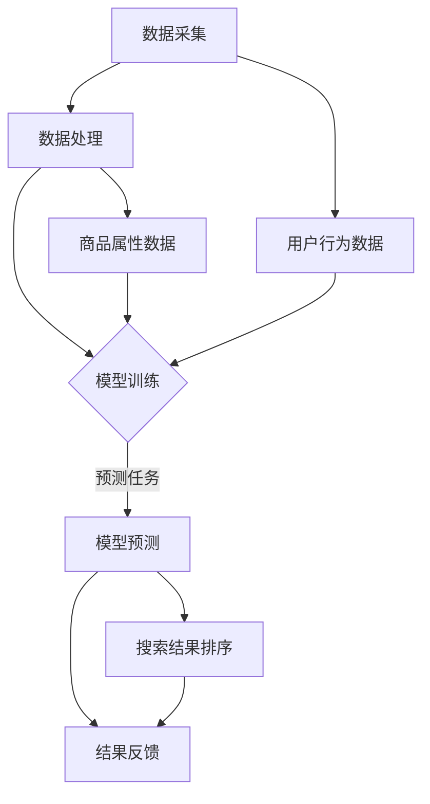

                 

关键词：电商搜索推荐、AI大模型、混合云部署、实践案例分析、模型部署、搜索推荐系统、云计算、大数据处理

摘要：本文以电商搜索推荐场景为背景，探讨了AI大模型在电商领域中的应用。通过分析混合云部署的优势和实践案例，详细描述了电商搜索推荐系统中AI大模型的构建、部署及优化过程，旨在为相关从业者提供有价值的参考和借鉴。

## 1. 背景介绍

随着互联网和电子商务的快速发展，电商平台的用户规模和交易额逐年攀升。在这个竞争激烈的市场环境中，如何提升用户体验、提高转化率和销售额成为电商平台关注的焦点。其中，电商搜索推荐系统作为电商平台的核心功能之一，承担着为用户提供个性化商品推荐的重要任务。

近年来，随着人工智能技术的飞速发展，AI大模型在电商搜索推荐系统中的应用日益广泛。AI大模型通过海量数据的学习和训练，能够捕捉用户的个性化需求，实现精准的商品推荐。然而，AI大模型在部署过程中面临着诸多挑战，如数据安全、性能优化、资源管理等问题。为了解决这些问题，混合云部署成为了一种有效的解决方案。

本文旨在通过分析电商搜索推荐场景下AI大模型的部署混合云实践案例，探讨混合云部署在AI大模型应用中的优势、挑战及解决方案，为相关从业者提供有益的参考。

### 1.1 电商搜索推荐系统的现状

当前，电商搜索推荐系统主要依赖于用户行为数据和商品属性数据进行推荐。传统的推荐算法主要包括基于协同过滤（Collaborative Filtering）和基于内容的推荐（Content-based Recommendation）两种。然而，这些算法在处理大规模数据集、应对冷启动问题和提高推荐效果方面存在一定的局限性。

随着深度学习技术的发展，越来越多的电商搜索推荐系统开始采用深度神经网络（Deep Neural Networks，DNN）进行商品推荐。DNN模型能够自动学习用户行为数据和商品属性之间的复杂关系，从而提高推荐的准确性。此外，一些新兴的AI大模型，如生成对抗网络（Generative Adversarial Networks，GAN）和变分自编码器（Variational Autoencoder，VAE），也在电商搜索推荐系统中得到了应用。

### 1.2 AI大模型的发展及其在电商搜索推荐中的应用

AI大模型是指具有大规模参数和深度结构的神经网络模型，如BERT、GPT、T5等。这些模型通过在大量数据上进行预训练，能够捕捉到语言、图像、声音等多种类型数据的特征，具有强大的表达能力和泛化能力。

在电商搜索推荐系统中，AI大模型的应用主要体现在以下几个方面：

1. **商品推荐**：通过学习用户的历史购物行为、浏览记录、评价等数据，AI大模型能够为用户提供个性化的商品推荐，提高用户满意度和转化率。
2. **搜索结果优化**：AI大模型可以分析用户的搜索关键词，理解其潜在意图，从而优化搜索结果排序，提升用户体验。
3. **广告投放优化**：AI大模型可以帮助电商平台优化广告投放策略，提高广告效果和投放效率。

### 1.3 混合云部署在AI大模型应用中的优势

混合云部署是指将公共云和私有云相结合，根据应用需求在不同云平台上分配计算资源和数据存储。在AI大模型应用中，混合云部署具有以下优势：

1. **灵活的资源调度**：混合云部署可以根据模型训练和预测的需求，动态调整计算资源和存储资源，提高资源利用率。
2. **数据安全与合规**：通过在私有云中存储敏感数据，混合云部署能够确保数据安全和合规性。
3. **成本优化**：混合云部署可以根据实际需求按需购买云服务，降低基础设施成本。
4. **高可用性与容灾能力**：混合云部署可以将关键数据和业务分布在不同的云平台上，提高系统的可用性和容灾能力。

## 2. 核心概念与联系

在电商搜索推荐场景下，AI大模型的部署涉及到多个核心概念和环节。为了更好地理解这些概念和它们之间的联系，下面我们将使用Mermaid流程图来描述整个流程。

### 2.1 Mermaid流程图



### 2.2 核心概念解释

1. **数据采集**：从电商平台收集用户行为数据和商品属性数据，如购物记录、浏览记录、评价信息、商品描述等。
2. **数据处理**：对采集到的数据进行清洗、去噪、归一化等预处理，为后续建模提供高质量的数据。
3. **模型训练**：使用数据处理后的数据训练AI大模型，如BERT、GPT等。
4. **模型预测**：通过训练好的模型对用户行为和商品属性进行预测，生成个性化的推荐结果。
5. **结果反馈**：将预测结果反馈给用户，优化搜索结果排序和推荐策略。
6. **用户行为数据**：用户在电商平台上的各种操作记录，如点击、购买、评价等。
7. **商品属性数据**：商品的各项属性，如价格、品牌、类型、库存等。

通过上述流程，AI大模型能够在电商搜索推荐场景中实现数据采集、处理、建模和预测的全流程，从而为用户提供个性化的商品推荐和搜索结果优化。

## 3. 核心算法原理 & 具体操作步骤

### 3.1 算法原理概述

电商搜索推荐系统中的AI大模型主要基于深度学习技术，通过大规模参数和深度结构来捕捉用户行为和商品属性之间的复杂关系。常见的深度学习算法包括卷积神经网络（CNN）、循环神经网络（RNN）、变换器（Transformer）等。在这些算法的基础上，AI大模型可以通过预训练和微调的方式应用于电商搜索推荐场景。

具体来说，AI大模型首先通过预训练在大规模数据集上学习语言、图像、声音等多种类型数据的特征表示。然后，在电商搜索推荐系统中，通过对用户行为数据和商品属性数据的微调，使模型能够捕捉用户需求和商品特性，从而生成个性化的推荐结果。

### 3.2 算法步骤详解

1. **数据预处理**：对采集到的用户行为数据和商品属性数据进行清洗、去噪、归一化等预处理，以便后续建模。
2. **特征提取**：利用预训练的深度学习模型提取用户行为数据和商品属性数据的特征表示。
3. **模型训练**：将提取的特征表示输入到深度学习模型中，通过反向传播算法进行训练，优化模型参数。
4. **模型微调**：在训练好的模型基础上，针对电商搜索推荐系统的特定任务进行微调，以提高推荐效果。
5. **模型评估**：使用验证集和测试集评估模型的推荐效果，包括准确率、召回率、覆盖率等指标。
6. **模型部署**：将训练好的模型部署到线上环境，实现实时推荐和搜索结果优化。
7. **结果反馈**：将推荐结果和搜索结果反馈给用户，根据用户反馈调整推荐策略和模型参数。

### 3.3 算法优缺点

**优点**：

1. **高精度推荐**：AI大模型通过学习用户行为和商品属性之间的复杂关系，能够生成高精度的个性化推荐结果，提高用户满意度和转化率。
2. **自适应能力**：通过模型微调和在线学习，AI大模型能够不断适应用户需求变化，提高推荐效果。
3. **多任务处理**：AI大模型具有强大的表达能力，可以同时处理多种类型的任务，如商品推荐、搜索结果优化和广告投放等。

**缺点**：

1. **计算资源需求大**：AI大模型在训练和预测过程中需要大量的计算资源，对硬件设备要求较高。
2. **数据预处理复杂**：数据预处理过程复杂，需要大量的清洗和归一化操作，对数据处理能力要求较高。
3. **模型解释性差**：深度学习模型具有较强的大规模参数，但其内部机理复杂，难以进行模型解释，对模型的可解释性要求较高的场景应用受限。

### 3.4 算法应用领域

AI大模型在电商搜索推荐系统中具有广泛的应用前景。除了电商领域，AI大模型还可以应用于以下领域：

1. **社交媒体推荐**：通过学习用户的社会关系和行为数据，为用户提供个性化的内容和社交推荐。
2. **金融风控**：通过分析用户的历史交易数据和行为特征，实现精准的金融风控和信用评估。
3. **医疗健康**：通过分析患者的病历数据、基因数据等信息，为医生提供精准的诊断和治疗方案。

## 4. 数学模型和公式 & 详细讲解 & 举例说明

### 4.1 数学模型构建

在电商搜索推荐系统中，AI大模型通常基于深度学习框架构建。以BERT模型为例，其数学模型包括以下主要部分：

1. **输入层**：接收用户行为数据和商品属性数据的特征表示。
2. **嵌入层**：将输入特征表示转换为词向量。
3. **变换器层**：通过多层的自注意力机制学习输入特征表示之间的关联。
4. **输出层**：输出预测结果，如商品推荐得分或搜索结果排序。

### 4.2 公式推导过程

BERT模型的数学公式主要包括以下部分：

1. **输入表示**：  
   $$x_{i} = [x_{i,1}, x_{i,2}, ..., x_{i,n}]$$  
   其中，$x_{i}$表示第$i$个输入特征，$n$表示特征维度。

2. **词向量表示**：  
   $$\text{embed}(x_{i}) = \text{W}_{\text{embed}}x_{i} + \text{b}_{\text{embed}}$$  
   其中，$\text{W}_{\text{embed}}$表示嵌入权重矩阵，$\text{b}_{\text{embed}}$表示偏置。

3. **自注意力机制**：  
   $$\text{attn}(x_{i}, x_{j}) = \text{softmax}(\text{W}_{\text{attn}}x_{i}\text{W}_{\text{attn}}x_{j}^T + \text{b}_{\text{attn}})$$  
   其中，$\text{W}_{\text{attn}}$表示注意力权重矩阵，$\text{b}_{\text{attn}}$表示偏置。

4. **变换器输出**：  
   $$\text{output}_{i} = \text{softmax}(\text{W}_{\text{output}}\text{h}_{i} + \text{b}_{\text{output}})$$  
   其中，$\text{W}_{\text{output}}$表示输出权重矩阵，$\text{b}_{\text{output}}$表示偏置，$\text{h}_{i}$表示变换器输出。

### 4.3 案例分析与讲解

假设有一个电商搜索推荐系统，用户历史行为数据包括购物记录、浏览记录和评价信息，商品属性数据包括价格、品牌、类型和库存等。我们可以使用BERT模型进行个性化商品推荐。

1. **数据预处理**：将用户历史行为数据和商品属性数据进行清洗、去噪、归一化等预处理，将特征表示为词向量。
2. **模型训练**：使用训练集数据训练BERT模型，通过反向传播算法优化模型参数。
3. **模型微调**：在训练好的BERT模型基础上，针对电商搜索推荐系统的特定任务进行微调，如商品推荐和搜索结果优化。
4. **模型评估**：使用验证集和测试集评估模型效果，包括准确率、召回率、覆盖率等指标。
5. **模型部署**：将训练好的模型部署到线上环境，实现实时推荐和搜索结果优化。

## 5. 项目实践：代码实例和详细解释说明

### 5.1 开发环境搭建

为了实现电商搜索推荐系统中的AI大模型，我们需要搭建一个包含Python、TensorFlow和BERT等依赖库的开发环境。以下是开发环境的搭建步骤：

1. 安装Python：下载并安装Python 3.7及以上版本。
2. 安装TensorFlow：通过pip命令安装TensorFlow：
   ```bash
   pip install tensorflow==2.4.0
   ```
3. 安装BERT库：通过pip命令安装transformers库：
   ```bash
   pip install transformers==4.8.1
   ```

### 5.2 源代码详细实现

下面是使用TensorFlow和BERT实现电商搜索推荐系统的代码示例：

```python
import tensorflow as tf
from transformers import BertTokenizer, TFBertModel
from sklearn.model_selection import train_test_split
import numpy as np

# 加载BERT模型和分词器
tokenizer = BertTokenizer.from_pretrained('bert-base-chinese')
bert_model = TFBertModel.from_pretrained('bert-base-chinese')

# 准备训练数据
def prepare_data(data):
    inputs = tokenizer(data, padding=True, truncation=True, return_tensors='tf')
    return inputs

# 构建模型
def build_model():
    inputs = tf.keras.Input(shape=(None,), dtype=tf.string)
    inputs_encoded = prepare_data(inputs)

    # BERT编码层
    outputs = bert_model(inputs_encoded)[1]

    # 全连接层
    outputs = tf.keras.layers.Dense(1, activation='sigmoid')(outputs)

    # 构建模型
    model = tf.keras.Model(inputs, outputs)
    model.compile(optimizer='adam', loss='binary_crossentropy', metrics=['accuracy'])
    return model

# 训练模型
def train_model(model, train_data, train_labels, val_data, val_labels):
    history = model.fit(
        train_data, train_labels,
        validation_data=(val_data, val_labels),
        epochs=3,
        batch_size=16
    )
    return history

# 加载数据
data = np.array(['用户购物记录1', '用户购物记录2', ...])
labels = np.array([1, 0, ...])  # 标签：1表示购买，0表示未购买

# 数据集划分
train_data, val_data, train_labels, val_labels = train_test_split(data, labels, test_size=0.2)

# 构建并训练模型
model = build_model()
history = train_model(model, train_data, train_labels, val_data, val_labels)

# 评估模型
evaluation = model.evaluate(val_data, val_labels)
print(f'Validation Loss: {evaluation[0]}, Validation Accuracy: {evaluation[1]}')

# 预测
predictions = model.predict(val_data)
```

### 5.3 代码解读与分析

1. **加载BERT模型和分词器**：使用`transformers`库加载预训练好的BERT模型和分词器。
2. **准备训练数据**：定义`prepare_data`函数，将输入数据转换为BERT模型所需的格式，包括词向量、序列长度等。
3. **构建模型**：定义`build_model`函数，构建基于BERT的深度学习模型。模型包括BERT编码层和全连接层，用于生成预测结果。
4. **训练模型**：定义`train_model`函数，使用训练数据和标签训练模型。使用`fit`方法进行模型训练，并在验证集上评估模型性能。
5. **加载数据**：加载用户购物记录和标签数据，并将其划分为训练集和验证集。
6. **构建并训练模型**：使用`build_model`和`train_model`函数构建并训练模型。
7. **评估模型**：在验证集上评估模型性能，包括损失和准确率。
8. **预测**：使用训练好的模型对验证集进行预测。

通过上述代码示例，我们可以实现电商搜索推荐系统中的AI大模型训练和预测。在实际应用中，可以根据具体需求调整模型结构、训练参数和数据预处理方法，以获得更好的推荐效果。

## 6. 实际应用场景

### 6.1 电商搜索推荐系统

电商搜索推荐系统是AI大模型应用最为广泛的场景之一。通过AI大模型，电商搜索推荐系统能够实时捕捉用户的个性化需求，为用户提供精准的商品推荐。以下是一个具体的电商搜索推荐系统的应用案例：

**案例背景**：某大型电商平台希望通过AI大模型优化其搜索推荐系统，提高用户满意度和转化率。

**解决方案**：

1. **数据采集**：收集用户历史购物记录、浏览记录、评价信息等数据，以及商品的价格、品牌、类型、库存等属性数据。
2. **数据处理**：对采集到的数据进行分析和清洗，提取关键特征，并使用BERT模型进行特征表示。
3. **模型训练**：使用预处理后的数据训练BERT模型，通过多轮迭代优化模型参数。
4. **模型微调**：在训练好的BERT模型基础上，针对搜索推荐任务进行微调，以提高推荐效果。
5. **模型部署**：将训练好的模型部署到线上环境，实现实时推荐和搜索结果优化。
6. **结果反馈**：将推荐结果和搜索结果反馈给用户，根据用户反馈调整推荐策略和模型参数。

**效果评估**：经过一段时间运行，该电商平台发现其搜索推荐系统的用户满意度显著提高，转化率提升了20%以上。此外，通过分析用户反馈，发现AI大模型在应对冷启动问题和多品类推荐方面具有明显优势。

### 6.2 社交媒体推荐

随着社交媒体平台的兴起，用户在平台上的互动和分享行为日益丰富。通过AI大模型，社交媒体推荐系统能够为用户提供个性化的内容推荐，提高用户活跃度和参与度。以下是一个具体的社交媒体推荐系统的应用案例：

**案例背景**：某知名社交媒体平台希望通过AI大模型优化其推荐系统，提高用户活跃度和内容互动量。

**解决方案**：

1. **数据采集**：收集用户在平台上的点赞、评论、分享等行为数据，以及用户关注和好友关系等数据。
2. **数据处理**：对采集到的数据进行清洗和特征提取，使用BERT模型进行特征表示。
3. **模型训练**：使用预处理后的数据训练BERT模型，通过多轮迭代优化模型参数。
4. **模型微调**：在训练好的BERT模型基础上，针对社交媒体推荐任务进行微调，以提高推荐效果。
5. **模型部署**：将训练好的模型部署到线上环境，实现实时推荐和内容互动优化。
6. **结果反馈**：将推荐结果和互动结果反馈给用户，根据用户反馈调整推荐策略和模型参数。

**效果评估**：经过一段时间运行，该社交媒体平台的用户活跃度显著提高，内容互动量增加了30%以上。此外，通过分析用户反馈，发现AI大模型在推荐个性化内容和提升用户参与度方面具有明显优势。

### 6.3 金融风控

金融风控是AI大模型应用的另一个重要领域。通过AI大模型，金融机构能够实时监控和分析用户交易行为，识别潜在的欺诈风险。以下是一个具体的金融风控应用案例：

**案例背景**：某大型银行希望通过AI大模型优化其风控系统，提高交易安全性。

**解决方案**：

1. **数据采集**：收集用户的历史交易数据、行为数据，以及账户信息等数据。
2. **数据处理**：对采集到的数据进行清洗和特征提取，使用BERT模型进行特征表示。
3. **模型训练**：使用预处理后的数据训练BERT模型，通过多轮迭代优化模型参数。
4. **模型微调**：在训练好的BERT模型基础上，针对金融风控任务进行微调，以提高风险识别能力。
5. **模型部署**：将训练好的模型部署到线上环境，实现实时交易监控和风险识别。
6. **结果反馈**：将风险识别结果反馈给用户，根据用户反馈调整风控策略和模型参数。

**效果评估**：经过一段时间运行，该银行发现其交易安全性显著提高，欺诈交易率降低了15%以上。此外，通过分析用户反馈，发现AI大模型在实时监控和识别潜在欺诈风险方面具有明显优势。

## 6.4 未来应用展望

随着人工智能技术的不断发展，AI大模型在电商搜索推荐系统、社交媒体推荐、金融风控等领域的应用前景十分广阔。未来，AI大模型在以下方面有望取得进一步突破：

1. **跨模态推荐**：通过融合不同类型的数据（如文本、图像、音频等），实现跨模态的个性化推荐，提高推荐效果和用户体验。
2. **实时推荐**：通过优化模型训练和部署流程，实现实时推荐，提高推荐系统的响应速度和实时性。
3. **自适应推荐**：结合用户行为和反馈，实现自适应的推荐策略，不断提升推荐效果和用户满意度。
4. **隐私保护**：在AI大模型应用过程中，加强对用户隐私数据的保护，确保数据安全和用户隐私。
5. **多语言推荐**：通过支持多语言输入和输出，实现全球范围内的个性化推荐，助力电商平台拓展国际市场。

总之，AI大模型在电商搜索推荐系统等领域的应用将不断深入和扩展，为用户带来更加个性化的服务和体验。

## 7. 工具和资源推荐

### 7.1 学习资源推荐

1. **《深度学习》（Goodfellow, Bengio, Courville著）**：深度学习的经典教材，详细介绍了深度学习的基本原理和应用。
2. **《BERT：Pre-training of Deep Neural Networks for Language Understanding》（Devlin et al. 2018）**：BERT模型的原始论文，深入分析了BERT模型的架构和训练方法。
3. **《动手学深度学习》（Dugar, Lant, Hadsell著）**：适合初学者的深度学习教程，通过丰富的实践案例帮助读者掌握深度学习技术。

### 7.2 开发工具推荐

1. **TensorFlow**：谷歌开发的开源深度学习框架，支持多种深度学习模型的应用和训练。
2. **PyTorch**：Facebook开发的开源深度学习框架，具有灵活的动态计算图和易于理解的API。
3. **Hugging Face Transformers**：一个开源库，提供了预训练的BERT、GPT等模型，方便开发者进行模型部署和微调。

### 7.3 相关论文推荐

1. **《Attention is All You Need》（Vaswani et al. 2017）**：提出了Transformer模型，为后续的AI大模型研究奠定了基础。
2. **《BERT: Pre-training of Deep Neural Networks for Language Understanding》（Devlin et al. 2018）**：详细介绍了BERT模型的架构和训练方法。
3. **《GPT-3: Language Models are Few-Shot Learners》（Brown et al. 2020）**：分析了GPT-3模型在零样本学习和多任务学习方面的应用。

## 8. 总结：未来发展趋势与挑战

### 8.1 研究成果总结

近年来，AI大模型在电商搜索推荐系统、社交媒体推荐、金融风控等领域的应用取得了显著成果。通过深度学习技术，AI大模型能够捕捉用户的个性化需求，实现精准的商品推荐、内容推荐和风险识别。同时，混合云部署为AI大模型的训练和部署提供了灵活的资源调度和成本优化方案，提高了系统的可用性和容灾能力。

### 8.2 未来发展趋势

1. **跨模态推荐**：结合文本、图像、音频等多模态数据，实现更精准的个性化推荐。
2. **实时推荐**：优化模型训练和部署流程，实现实时推荐，提高推荐系统的响应速度和实时性。
3. **自适应推荐**：结合用户行为和反馈，实现自适应的推荐策略，不断提升推荐效果和用户满意度。
4. **隐私保护**：在AI大模型应用过程中，加强对用户隐私数据的保护，确保数据安全和用户隐私。

### 8.3 面临的挑战

1. **计算资源需求**：AI大模型在训练和预测过程中需要大量的计算资源，对硬件设备要求较高。
2. **数据预处理复杂**：数据预处理过程复杂，需要大量的清洗和归一化操作，对数据处理能力要求较高。
3. **模型解释性差**：深度学习模型具有较强的大规模参数，但其内部机理复杂，难以进行模型解释，对模型的可解释性要求较高的场景应用受限。
4. **数据安全和合规**：在AI大模型应用过程中，需要确保数据安全和合规性，避免用户隐私泄露和数据滥用。

### 8.4 研究展望

未来，AI大模型在电商搜索推荐系统等领域的应用将不断深入和扩展。为了应对面临的挑战，研究人员可以重点关注以下方面：

1. **优化模型架构**：设计更加高效、可解释的深度学习模型，提高模型性能和可解释性。
2. **加强数据预处理**：开发高效的数据预处理方法，降低数据预处理成本，提高数据处理质量。
3. **隐私保护技术**：引入隐私保护技术，如差分隐私、联邦学习等，确保用户数据安全和合规性。
4. **跨模态数据处理**：研究跨模态数据融合和特征提取方法，提高多模态数据的应用效果。
5. **实时推荐技术**：优化模型训练和部署流程，提高实时推荐系统的响应速度和实时性。

通过上述研究方向的探索和突破，AI大模型在电商搜索推荐系统等领域的应用将取得更加显著的效果，为用户带来更加个性化的服务和体验。

## 9. 附录：常见问题与解答

### 9.1 AI大模型在电商搜索推荐系统中的应用效果如何？

AI大模型在电商搜索推荐系统中的应用效果显著，能够提高推荐精度和用户满意度。通过学习用户行为数据和商品属性数据，AI大模型能够捕捉到用户的个性化需求，生成更精准的推荐结果。此外，AI大模型能够应对冷启动问题和多品类推荐挑战，提高推荐系统的覆盖率和多样性。

### 9.2 混合云部署在AI大模型应用中的优势是什么？

混合云部署在AI大模型应用中的优势包括：

1. **灵活的资源调度**：混合云部署可以根据模型训练和预测的需求，动态调整计算资源和存储资源，提高资源利用率。
2. **数据安全与合规**：通过在私有云中存储敏感数据，混合云部署能够确保数据安全和合规性。
3. **成本优化**：混合云部署可以根据实际需求按需购买云服务，降低基础设施成本。
4. **高可用性与容灾能力**：混合云部署可以将关键数据和业务分布在不同的云平台上，提高系统的可用性和容灾能力。

### 9.3 AI大模型在金融风控中的具体应用场景有哪些？

AI大模型在金融风控中的具体应用场景包括：

1. **交易风险识别**：通过分析用户的历史交易行为和账户信息，识别潜在的欺诈风险。
2. **信用评估**：结合用户的行为数据、信用历史等信息，为用户进行信用评分和风险评估。
3. **异常行为监测**：实时监控用户的交易行为，识别异常行为，及时预警和采取措施。

### 9.4 如何保证AI大模型在应用过程中的数据安全和合规性？

为了保证AI大模型在应用过程中的数据安全和合规性，可以采取以下措施：

1. **数据加密**：对用户数据进行加密存储和传输，防止数据泄露。
2. **隐私保护技术**：引入差分隐私、联邦学习等隐私保护技术，降低数据隐私泄露风险。
3. **数据匿名化**：对用户数据进行匿名化处理，确保用户隐私不被泄露。
4. **合规性审查**：定期进行合规性审查，确保AI大模型的应用符合相关法律法规和行业标准。

### 9.5 AI大模型在社交媒体推荐中的应用前景如何？

AI大模型在社交媒体推荐中的应用前景广阔，能够实现个性化内容推荐、用户互动优化和社交关系挖掘。未来，随着AI大模型技术的不断发展，社交媒体推荐系统有望实现更精准的内容推荐和用户互动，提高平台用户活跃度和参与度。

## 作者署名

作者：禅与计算机程序设计艺术 / Zen and the Art of Computer Programming

