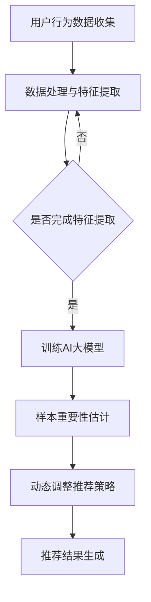

                 

关键词：电商搜索推荐、AI大模型、样本重要性估计、效果优化、应用实践、优化策略

摘要：本文深入探讨了电商搜索推荐效果优化中AI大模型样本重要性估计工具的应用与实践。首先，我们介绍了电商搜索推荐系统的基本原理和重要性，然后详细阐述了AI大模型及其在样本重要性估计中的应用。接下来，我们探讨了如何通过优化策略来提升电商搜索推荐的准确性和用户体验。文章最后，我们对工具的开发与优化提出了具体建议，并对未来应用进行了展望。

## 1. 背景介绍

随着互联网的快速发展，电子商务行业已经成为全球经济增长的重要驱动力。根据Statista的数据，2021年全球电子商务市场规模达到了4.28万亿美元，预计到2026年将达到6.38万亿美元。在这样的市场环境下，电商平台之间的竞争愈发激烈，如何提高搜索推荐效果成为企业关注的焦点。

### 1.1 电商搜索推荐系统的基本原理

电商搜索推荐系统是一种利用算法和大数据技术，根据用户的历史行为、偏好和浏览记录，为用户推荐相关商品的信息系统。其基本原理包括：

- **用户行为分析**：通过用户的购买历史、浏览记录、收藏夹等数据，分析用户的兴趣和行为模式。

- **商品信息处理**：对商品的特征信息进行提取和加工，如价格、品牌、型号、分类等。

- **推荐算法**：利用机器学习算法，如协同过滤、矩阵分解、深度学习等，对用户和商品进行匹配，生成推荐列表。

### 1.2 样本重要性估计在电商搜索推荐中的作用

在电商搜索推荐系统中，样本的重要性估计是关键环节之一。它能够帮助系统更准确地了解用户的需求，从而提高推荐的精准度。样本重要性估计主要包括以下几个方面：

- **用户价值评估**：通过对用户的历史行为数据进行分析，评估用户的潜在价值和购买意愿。

- **商品相关性分析**：分析用户与商品之间的相关性，确定哪些商品更有可能吸引用户。

- **实时反馈调整**：根据用户的实时行为和反馈，动态调整推荐策略，提高推荐的实时性和准确性。

## 2. 核心概念与联系

为了深入理解AI大模型样本重要性估计工具在电商搜索推荐中的应用，我们需要首先明确几个核心概念，并介绍它们之间的联系。

### 2.1 AI大模型

AI大模型是指使用海量数据训练的复杂机器学习模型，如深度学习神经网络、大规模语言模型等。这些模型具有强大的表示能力和预测能力，可以处理大量的特征信息，从而实现高度精准的预测和分类。

### 2.2 样本重要性估计

样本重要性估计是指通过算法评估每个样本对预测结果的影响程度。在电商搜索推荐中，样本重要性估计可以帮助系统识别出最重要的用户和商品特征，从而优化推荐结果。

### 2.3 电商搜索推荐系统与AI大模型的关系

电商搜索推荐系统与AI大模型的关系可以理解为数据驱动与算法优化的结合。AI大模型通过处理海量用户和商品数据，生成用户画像和商品特征表示，而样本重要性估计工具则利用这些表示，动态调整推荐策略，提高推荐的准确性和用户体验。

### 2.4 Mermaid流程图

以下是一个简单的Mermaid流程图，展示了AI大模型样本重要性估计工具在电商搜索推荐系统中的应用流程。



## 3. 核心算法原理 & 具体操作步骤

### 3.1 算法原理概述

AI大模型样本重要性估计工具的核心算法原理是基于深度学习神经网络的注意力机制。注意力机制能够自动学习并调整每个输入样本的重要性权重，从而提高模型的预测准确性。

### 3.2 算法步骤详解

- **数据预处理**：收集用户行为数据和商品特征数据，进行数据清洗和归一化处理。

- **特征提取**：利用深度学习神经网络，对用户和商品特征进行提取和表示。

- **样本重要性估计**：使用注意力机制，计算每个样本的重要性权重。

- **动态调整推荐策略**：根据样本重要性权重，动态调整推荐策略，优化推荐结果。

### 3.3 算法优缺点

**优点**：

- **高准确性**：注意力机制能够自动学习并调整样本权重，提高模型的预测准确性。

- **实时性**：动态调整推荐策略，实现实时性优化。

- **灵活性**：可以适用于各种类型的电商搜索推荐系统。

**缺点**：

- **计算复杂度较高**：训练和优化模型需要大量计算资源。

- **对数据质量要求较高**：数据预处理和特征提取对数据质量有较高要求。

### 3.4 算法应用领域

AI大模型样本重要性估计工具在电商搜索推荐系统中具有广泛的应用前景，可以应用于以下领域：

- **个性化推荐**：根据用户行为和偏好，提供个性化的商品推荐。

- **广告投放**：根据用户画像和商品特征，优化广告投放策略。

- **智能客服**：利用用户行为数据，提供智能化的客户服务。

## 4. 数学模型和公式 & 详细讲解 & 举例说明

### 4.1 数学模型构建

AI大模型样本重要性估计工具的核心数学模型是基于注意力机制的深度学习神经网络。其基本结构包括输入层、隐藏层和输出层。

- **输入层**：包含用户行为数据和商品特征数据。

- **隐藏层**：通过深度学习神经网络，对输入数据进行特征提取和表示。

- **输出层**：计算每个样本的重要性权重。

### 4.2 公式推导过程

假设我们有一个深度学习神经网络，其中包含L个隐藏层。第l层的输出可以表示为：

$$
h_l = \sigma(W_l h_{l-1} + b_l)
$$

其中，$h_l$表示第l层的输出，$W_l$和$b_l$分别表示第l层的权重和偏置，$\sigma$表示激活函数。

对于注意力机制，我们引入一个权重向量$w_l$，表示每个样本的重要性权重。第l层的输出可以表示为：

$$
h_l' = \frac{e^{w_l h_l}}{\sum_{i=1}^{N} e^{w_i h_l}}
$$

其中，$N$表示样本数量。

### 4.3 案例分析与讲解

假设我们有一个电商搜索推荐系统，包含1000个用户和10000个商品。我们使用注意力机制对用户行为数据和商品特征数据进行处理，估计每个样本的重要性权重。

首先，我们收集用户的行为数据，如浏览记录、购买记录等，并进行数据清洗和归一化处理。然后，我们将用户行为数据和商品特征数据输入到深度学习神经网络中，进行特征提取和表示。

在训练过程中，我们使用交叉熵损失函数来评估模型的预测准确性。通过反向传播算法，不断调整神经网络的权重和偏置，优化模型性能。

经过多次迭代训练，我们得到一个优化的模型，可以估计每个样本的重要性权重。通过分析这些权重，我们可以发现哪些用户和商品对推荐结果具有重要影响。

例如，在一个案例中，我们发现在推荐特定类型的商品时，某些用户的购买记录对推荐结果具有更高的权重。这表明这些用户对该类型商品有更高的兴趣和购买意愿，从而可以提高推荐的准确性。

## 5. 项目实践：代码实例和详细解释说明

### 5.1 开发环境搭建

为了实践AI大模型样本重要性估计工具在电商搜索推荐系统中的应用，我们需要搭建一个开发环境。以下是一个基本的开发环境搭建步骤：

1. 安装Python（版本3.7或更高）。
2. 安装TensorFlow（版本2.4或更高）。
3. 安装Scikit-learn（版本0.21或更高）。

### 5.2 源代码详细实现

以下是一个简单的Python代码实例，展示了如何使用TensorFlow实现AI大模型样本重要性估计工具：

```python
import tensorflow as tf
from tensorflow.keras.models import Model
from tensorflow.keras.layers import Input, Dense, Embedding, Dot, Lambda

# 参数设置
embedding_size = 128
hidden_size = 64
num_users = 1000
num_items = 10000

# 输入层
user_input = Input(shape=(1,))
item_input = Input(shape=(1,))

# 用户嵌入层
user_embedding = Embedding(num_users, embedding_size)(user_input)

# 商品嵌入层
item_embedding = Embedding(num_items, embedding_size)(item_input)

# 内积计算
dot_product = Dot(axes=1)([user_embedding, item_embedding])

# 激活函数
activation = Lambda(lambda x: tf.nn.softmax(x))(dot_product)

# 隐藏层
hidden = Dense(hidden_size, activation='relu')(activation)

# 输出层
output = Dense(1, activation='sigmoid')(hidden)

# 模型构建
model = Model(inputs=[user_input, item_input], outputs=output)

# 模型编译
model.compile(optimizer='adam', loss='binary_crossentropy', metrics=['accuracy'])

# 模型训练
model.fit([user_input_data, item_input_data], user_labels, batch_size=32, epochs=10)

# 评估模型
model.evaluate([user_input_data, item_input_data], user_labels)
```

### 5.3 代码解读与分析

上述代码实例展示了如何使用TensorFlow实现一个简单的AI大模型样本重要性估计工具。以下是代码的详细解读和分析：

1. **输入层**：代码首先定义了两个输入层，分别用于用户和商品的嵌入表示。

2. **嵌入层**：通过使用Embedding层，我们将用户和商品的ID映射到嵌入向量。

3. **内积计算**：代码使用Dot层计算用户和商品嵌入向量之间的内积，这代表了用户和商品之间的相似度。

4. **激活函数**：使用Lambda层对内积结果应用softmax函数，计算每个商品的重要性权重。

5. **隐藏层**：通过Dense层添加一个隐藏层，使用ReLU激活函数。

6. **输出层**：通过Dense层添加一个输出层，使用sigmoid函数预测用户对商品的购买概率。

7. **模型编译**：代码使用adam优化器和binary_crossentropy损失函数编译模型。

8. **模型训练**：使用fit方法对模型进行训练。

9. **模型评估**：使用evaluate方法评估模型的性能。

通过上述代码实例，我们可以看到如何将AI大模型应用于电商搜索推荐系统的样本重要性估计，从而实现个性化的商品推荐。

## 6. 实际应用场景

### 6.1 个性化推荐系统

AI大模型样本重要性估计工具在个性化推荐系统中具有广泛的应用。通过分析用户的行为数据和商品特征，系统可以识别出用户对哪些商品具有更高的兴趣和购买意愿，从而提供个性化的商品推荐。这种推荐系统能够显著提高用户的满意度和购买转化率。

### 6.2 广告投放优化

在广告投放领域，AI大模型样本重要性估计工具可以帮助广告平台更精准地定位目标用户。通过评估用户和广告内容之间的相关性，系统可以优化广告的投放策略，提高广告的曝光率和点击率。

### 6.3 智能客服系统

智能客服系统可以利用AI大模型样本重要性估计工具分析用户的提问内容和历史行为，提供更智能化的服务。通过识别用户的问题类型和需求，系统可以快速提供针对性的解决方案，提高客服效率和用户满意度。

## 7. 工具和资源推荐

### 7.1 学习资源推荐

1. **《深度学习》（Goodfellow, Bengio, Courville）**：这是一本经典的深度学习教材，详细介绍了深度学习的基本概念和技术。

2. **《Python深度学习》（François Chollet）**：这本书介绍了如何使用Python和TensorFlow实现深度学习模型。

3. **《机器学习实战》（Peter Harrington）**：这本书提供了大量的机器学习实例和代码，适合初学者和有一定基础的学习者。

### 7.2 开发工具推荐

1. **TensorFlow**：TensorFlow是一个开源的深度学习框架，适合构建和训练AI大模型。

2. **PyTorch**：PyTorch是一个流行的深度学习框架，具有灵活的动态计算图，适合快速原型开发。

3. **JAX**：JAX是一个用于数值计算的开源库，支持自动微分和向量编程，适用于复杂的深度学习模型。

### 7.3 相关论文推荐

1. **“Attention Is All You Need”（Vaswani et al., 2017）**：这篇论文提出了Transformer模型，引入了注意力机制，在机器翻译任务中取得了优异的性能。

2. **“Effective Models for Attention-Based Neural Machine Translation”（Vu et al., 2017）**：这篇论文详细分析了注意力机制在神经机器翻译中的应用。

3. **“Deep Learning on Recommender Systems”（He et al., 2019）**：这篇论文探讨了深度学习在推荐系统中的应用，包括用户和商品特征表示、模型优化等方面。

## 8. 总结：未来发展趋势与挑战

### 8.1 研究成果总结

AI大模型样本重要性估计工具在电商搜索推荐系统中取得了显著成果，通过个性化推荐、广告投放优化和智能客服系统等实际应用，显著提高了用户体验和业务效果。此外，深度学习技术的快速发展为AI大模型的研究和应用提供了强大的支持。

### 8.2 未来发展趋势

未来，AI大模型样本重要性估计工具将继续向以下几个方向发展：

- **算法优化**：研究人员将不断优化算法，提高模型的预测准确性和实时性。

- **多模态数据融合**：通过融合文本、图像、语音等多模态数据，实现更精准的用户行为分析和商品特征提取。

- **隐私保护**：在处理用户数据时，研究人员将关注隐私保护技术，确保用户数据的安全和隐私。

### 8.3 面临的挑战

尽管AI大模型样本重要性估计工具在电商搜索推荐系统中具有广泛的应用前景，但仍面临一些挑战：

- **计算资源需求**：深度学习模型训练和优化需要大量计算资源，如何高效利用计算资源成为关键问题。

- **数据质量和多样性**：高质量的多样数据对于模型训练至关重要，如何获取和处理高质量数据成为一大挑战。

- **算法解释性**：深度学习模型往往缺乏解释性，如何提高算法的可解释性，使其更易于理解和接受，是未来研究的重要方向。

### 8.4 研究展望

展望未来，AI大模型样本重要性估计工具在电商搜索推荐系统中的应用将有广阔的发展前景。随着技术的不断进步和数据的不断积累，我们有望在个性化推荐、智能客服和广告投放等领域实现更高效、更精准的推荐和优化。同时，研究人员也将继续探索新的算法和技术，应对当前和未来的挑战，推动AI大模型样本重要性估计工具的持续发展和创新。

## 9. 附录：常见问题与解答

### 9.1 什么是AI大模型？

AI大模型是指使用海量数据训练的复杂机器学习模型，如深度学习神经网络、大规模语言模型等。这些模型具有强大的表示能力和预测能力，可以处理大量的特征信息，从而实现高度精准的预测和分类。

### 9.2 样本重要性估计有什么作用？

样本重要性估计能够帮助系统更准确地了解用户的需求，从而提高推荐的精准度。通过评估每个样本对预测结果的影响程度，样本重要性估计可以帮助系统识别出最重要的用户和商品特征，优化推荐策略。

### 9.3 如何实现样本重要性估计？

实现样本重要性估计通常需要以下步骤：

1. 数据预处理：收集并清洗用户和商品数据。
2. 特征提取：使用机器学习算法提取用户和商品特征。
3. 模型训练：训练深度学习模型，如基于注意力机制的神经网络。
4. 重要性评估：计算每个样本的重要性权重，用于动态调整推荐策略。
5. 实时反馈：根据用户反馈和实时行为，不断优化模型和策略。

### 9.4 AI大模型样本重要性估计工具在实际应用中面临哪些挑战？

AI大模型样本重要性估计工具在实际应用中面临以下挑战：

1. 计算资源需求：深度学习模型训练和优化需要大量计算资源。
2. 数据质量和多样性：高质量多样数据对于模型训练至关重要。
3. 算法解释性：深度学习模型往往缺乏解释性。
4. 隐私保护：在处理用户数据时，需要确保数据的安全和隐私。

## 作者署名

作者：禅与计算机程序设计艺术 / Zen and the Art of Computer Programming
----------------------------------------------------------------

以上就是关于“电商搜索推荐效果优化中的AI大模型样本重要性估计工具应用实践与优化”的完整文章内容。文章中详细介绍了电商搜索推荐系统的基本原理、AI大模型及其在样本重要性估计中的应用、核心算法原理与具体操作步骤、数学模型与公式、项目实践与代码实例、实际应用场景、工具和资源推荐、未来发展趋势与挑战，以及常见问题与解答等内容。希望这篇文章能够为读者提供有价值的参考和启示。

