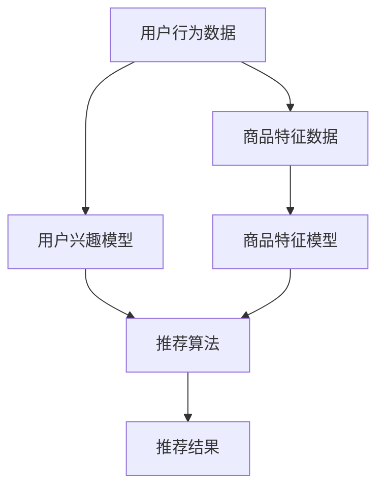

                 

 在当今的数字时代，电商搜索和推荐系统已成为电子商务领域不可或缺的重要组成部分。这些系统能够根据用户的行为和偏好提供个性化的商品推荐，显著提升用户体验和销售额。然而，推荐系统的效果优化一直是一个复杂且不断发展的挑战。随着人工智能技术的迅猛发展，尤其是大规模深度学习模型的广泛应用，如何有效地评估样本的重要性成为了提升推荐系统性能的关键问题。本文将探讨电商搜索推荐效果优化中的AI大模型样本重要性评估技术，旨在为业界提供有价值的指导。

## 关键词： 
AI大模型，电商搜索，推荐系统，样本重要性评估，效果优化

## 摘要：
本文首先介绍了电商搜索和推荐系统的基本原理及其重要性。接着，详细探讨了AI大模型在推荐系统中的作用及其面临的挑战，特别是在样本重要性评估方面。本文的核心内容是针对AI大模型样本重要性评估技术进行了深入分析，包括核心概念、算法原理、数学模型以及实际应用案例。最后，本文提出了未来发展的趋势与面临的挑战，并对相关工具和资源进行了推荐。

## 1. 背景介绍

随着互联网和移动设备的普及，电子商务已经成为全球商业活动的重要组成部分。电商平台的成功很大程度上取决于其搜索和推荐系统能否为用户提供个性化的购物体验。传统的电商搜索系统主要依赖关键词匹配和分类算法，而现代的推荐系统则更加注重用户行为和偏好的分析，利用机器学习和深度学习技术实现高效的个性化推荐。

### 1.1 电商搜索和推荐系统的基本原理

电商搜索系统主要通过用户输入的关键词，从海量的商品库中检索出相关的商品。推荐系统则更加复杂，它不仅需要根据用户的历史行为（如浏览、购买记录），还需要结合用户的社会属性、当前环境等多种因素，为用户提供个性化的商品推荐。推荐系统的核心是用户兴趣模型和商品特征模型，通过这两个模型的协同工作，系统可以预测用户对某一商品的偏好，从而提高推荐的质量。

### 1.2 AI大模型在推荐系统中的作用

随着AI技术的不断发展，尤其是深度学习技术的应用，AI大模型（如神经网络、生成对抗网络等）在推荐系统中扮演了越来越重要的角色。这些大模型可以通过处理大量的用户数据和商品数据，学习到复杂的用户行为模式，从而提供更精准的推荐。然而，AI大模型的训练和优化过程非常复杂，其中样本重要性评估成为了一个关键问题。

## 2. 核心概念与联系

在深入探讨样本重要性评估之前，我们需要明确一些核心概念和它们之间的关系。以下是几个关键概念及其简要描述：

### 2.1 用户行为数据

用户行为数据包括用户的浏览历史、购买记录、收藏夹、评价等，这些数据是构建用户兴趣模型的重要基础。

### 2.2 商品特征数据

商品特征数据包括商品的价格、品牌、分类、销量等，这些数据是构建商品特征模型的基础。

### 2.3 用户兴趣模型

用户兴趣模型是通过分析用户的行为数据，提取用户对各类商品的偏好信息，用于推荐系统的核心算法。

### 2.4 商品特征模型

商品特征模型是通过分析商品的数据特征，提取商品的关键信息，用于匹配用户兴趣。

### 2.5 样本重要性评估

样本重要性评估是指对用户行为数据和商品特征数据进行重要性排序，以便优化模型训练效果，提高推荐质量。

下面是一个使用Mermaid绘制的流程图，展示了这些核心概念之间的关系：



### 2.6 核心概念原理和架构

在深入探讨样本重要性评估之前，我们需要了解其背后的核心概念原理和架构。以下是这些概念和原理的简要描述：

### 2.6.1 用户行为分析

用户行为分析是指通过分析用户的行为数据，如浏览、购买、评价等，提取用户的兴趣和行为模式。这一过程通常使用时间序列分析、聚类分析和关联规则挖掘等技术。

### 2.6.2 商品特征提取

商品特征提取是指通过分析商品的数据特征，提取出对用户购买决策有影响的关键特征，如价格、品牌、分类、销量等。这一过程通常使用特征工程技术。

### 2.6.3 样本重要性评估

样本重要性评估是指对用户行为数据和商品特征数据进行重要性排序，以便优化模型训练效果，提高推荐质量。这一过程通常使用信息增益、关联度、贡献度等指标。

### 2.6.4 推荐算法优化

推荐算法优化是指通过调整推荐算法的参数和结构，提高推荐质量。这一过程通常涉及模型选择、参数调优和算法优化。

## 3. 核心算法原理 & 具体操作步骤

### 3.1 算法原理概述

在电商搜索推荐系统中，样本重要性评估的核心目标是通过分析用户行为数据和商品特征数据，识别出对推荐效果有重要影响的样本，从而优化模型训练过程，提高推荐质量。具体而言，样本重要性评估算法包括以下几个关键步骤：

1. **数据预处理**：对用户行为数据和商品特征数据进行清洗、归一化和特征提取，确保数据的质量和一致性。
2. **特征选择**：从预处理后的数据中提取出对样本重要性评估有重要影响的关键特征。
3. **样本重要性评估**：使用信息增益、关联度、贡献度等指标对样本进行重要性评估。
4. **模型优化**：根据样本重要性评估结果，调整模型参数和结构，优化模型训练过程。

### 3.2 算法步骤详解

下面将详细描述样本重要性评估算法的具体步骤：

#### 3.2.1 数据预处理

数据预处理是样本重要性评估的基础，主要包括以下步骤：

1. **数据清洗**：去除缺失值、异常值和重复数据，确保数据的质量。
2. **数据归一化**：将不同量纲的特征数据统一归一化，如使用归一化公式 $X_{\text{标准化}} = \frac{X_{\text{原始}} - \mu}{\sigma}$，其中 $\mu$ 是均值，$\sigma$ 是标准差。
3. **特征提取**：从用户行为数据和商品特征数据中提取关键特征，如用户的行为类型、行为时间、商品的价格、品牌等。

#### 3.2.2 特征选择

特征选择是样本重要性评估的关键步骤，通过筛选出对样本重要性有显著影响的关键特征，可以提高评估的精度。常用的特征选择方法包括：

1. **信息增益**：信息增益是衡量特征对样本分类能力的重要指标，选择信息增益较高的特征。
2. **关联度**：关联度是衡量特征之间相关性程度的指标，选择与目标特征相关性较高的特征。
3. **特征重要性排序**：使用随机森林、支持向量机等模型，对特征进行重要性排序，选择重要性较高的特征。

#### 3.2.3 样本重要性评估

样本重要性评估是通过计算样本的得分或权重来衡量其重要性。常用的评估方法包括：

1. **信息增益**：信息增益是衡量特征对样本分类能力的重要指标，计算公式为 $IG(A,B) = Entropy(B) - Entropy(B|A)$，其中 $Entropy(B)$ 是特征 $B$ 的熵，$Entropy(B|A)$ 是特征 $B$ 在给定特征 $A$ 下的条件熵。
2. **关联度**：关联度是衡量特征之间相关性程度的指标，计算公式为 $Corr(A,B) = \frac{Cov(A,B)}{\sigma_A \sigma_B}$，其中 $Cov(A,B)$ 是特征 $A$ 和 $B$ 的协方差，$\sigma_A$ 和 $\sigma_B$ 是特征 $A$ 和 $B$ 的标准差。
3. **贡献度**：贡献度是衡量特征对目标变量影响程度的指标，计算公式为 $Contrib(A) = \sum_{i=1}^n w_i \cdot IG(A,X_i)$，其中 $w_i$ 是特征 $A$ 对样本 $i$ 的权重，$IG(A,X_i)$ 是特征 $A$ 对样本 $i$ 的信息增益。

#### 3.2.4 模型优化

根据样本重要性评估结果，调整模型参数和结构，优化模型训练过程。常用的方法包括：

1. **权重调整**：根据样本重要性评估结果，调整样本在训练过程中的权重，使模型更关注重要样本。
2. **模型剪枝**：通过剪枝不重要样本，减小模型复杂度，提高训练效率。
3. **参数调优**：使用网格搜索、随机搜索等算法，调整模型参数，优化模型性能。

### 3.3 算法优缺点

#### 优点

1. **提高模型性能**：通过识别和利用重要样本，优化模型训练过程，提高推荐系统的性能。
2. **降低计算成本**：通过减少不重要样本的计算量，降低模型训练和评估的计算成本。
3. **提升用户体验**：更精确地推荐用户感兴趣的商品，提高用户满意度。

#### 缺点

1. **数据依赖性**：样本重要性评估算法依赖于用户行为数据和商品特征数据的质量，数据质量差可能导致评估结果不准确。
2. **计算复杂度**：样本重要性评估算法的计算复杂度较高，特别是在处理大量数据时，可能影响模型的训练和评估效率。
3. **模型泛化能力**：样本重要性评估算法可能提高特定场景下的模型性能，但可能降低模型的泛化能力。

### 3.4 算法应用领域

样本重要性评估算法在电商搜索推荐系统中具有广泛的应用前景。以下是一些应用领域：

1. **推荐系统**：通过评估用户行为数据和商品特征数据的样本重要性，优化推荐算法，提高推荐质量。
2. **广告投放**：通过评估用户和广告样本的重要性，优化广告投放策略，提高广告效果。
3. **风险控制**：通过评估用户行为和交易数据的样本重要性，优化风险控制模型，提高风险识别能力。
4. **金融风控**：通过评估贷款申请人和金融产品的样本重要性，优化风控模型，降低坏账率。

## 4. 数学模型和公式 & 详细讲解 & 举例说明

### 4.1 数学模型构建

在电商搜索推荐系统中，样本重要性评估的数学模型通常基于信息论和统计学习理论。以下是一个简化的数学模型：

#### 4.1.1 信息增益（IG）

信息增益是衡量特征对样本分类能力的重要指标。假设有一个二分类问题，特征 $A$ 有两个取值 $A_1$ 和 $A_2$，类别 $B$ 有两个取值 $B_1$ 和 $B_2$，信息增益的计算公式为：

$$
IG(A,B) = Entropy(B) - Entropy(B|A)
$$

其中，$Entropy(B)$ 是特征 $B$ 的熵，$Entropy(B|A)$ 是特征 $B$ 在给定特征 $A$ 下的条件熵。

#### 4.1.2 关联度（Corr）

关联度是衡量特征之间相关性程度的指标。假设有两个特征 $A$ 和 $B$，其协方差为 $Cov(A,B)$，标准差为 $\sigma_A$ 和 $\sigma_B$，关联度的计算公式为：

$$
Corr(A,B) = \frac{Cov(A,B)}{\sigma_A \sigma_B}
$$

#### 4.1.3 贡献度（Contrib）

贡献度是衡量特征对目标变量影响程度的指标。假设有多个特征 $A_1, A_2, ..., A_n$，其权重分别为 $w_1, w_2, ..., w_n$，信息增益为 $IG(A_i,X)$，贡献度的计算公式为：

$$
Contrib(A) = \sum_{i=1}^n w_i \cdot IG(A_i,X)
$$

### 4.2 公式推导过程

#### 4.2.1 信息增益（IG）

信息增益的推导基于信息论的原理。熵是衡量随机变量不确定性的指标，条件熵是衡量在给定某个特征的情况下，另一个特征的不确定性。信息增益是特征对分类能力的提升，计算公式为：

$$
IG(A,B) = Entropy(B) - Entropy(B|A)
$$

其中，$Entropy(B)$ 是特征 $B$ 的熵，计算公式为：

$$
Entropy(B) = -\sum_{i=1}^n p(B_i) \cdot \log_2(p(B_i))
$$

$Entropy(B|A)$ 是特征 $B$ 在给定特征 $A$ 下的条件熵，计算公式为：

$$
Entropy(B|A) = -\sum_{i=1}^n \sum_{j=1}^m p(B_i|A_j) \cdot p(A_j) \cdot \log_2(p(B_i|A_j))
$$

将 $Entropy(B)$ 和 $Entropy(B|A)$ 代入 $IG(A,B)$ 的公式，得到：

$$
IG(A,B) = -\sum_{i=1}^n p(B_i) \cdot \log_2(p(B_i)) + \sum_{i=1}^n \sum_{j=1}^m p(B_i|A_j) \cdot p(A_j) \cdot \log_2(p(B_i|A_j))
$$

化简后得到：

$$
IG(A,B) = \sum_{i=1}^n \sum_{j=1}^m p(A_j|B_i) \cdot p(B_i) \cdot \log_2(p(A_j|B_i)) / p(A_j)
$$

#### 4.2.2 关联度（Corr）

关联度的推导基于协方差和标准差的定义。协方差是衡量两个特征之间的线性相关程度，标准差是衡量特征离散程度的指标。关联度的计算公式为：

$$
Corr(A,B) = \frac{Cov(A,B)}{\sigma_A \sigma_B}
$$

其中，$Cov(A,B)$ 是特征 $A$ 和 $B$ 的协方差，计算公式为：

$$
Cov(A,B) = E[(A - E[A]) \cdot (B - E[B])]
$$

$E[A]$ 和 $E[B]$ 分别是特征 $A$ 和 $B$ 的期望，$\sigma_A$ 和 $\sigma_B$ 分别是特征 $A$ 和 $B$ 的标准差，计算公式为：

$$
\sigma_A = \sqrt{E[(A - E[A])^2]}
$$

$$
\sigma_B = \sqrt{E[(B - E[B])^2]}
$$

将 $Cov(A,B)$ 和 $\sigma_A$、$\sigma_B$ 代入 $Corr(A,B)$ 的公式，得到：

$$
Corr(A,B) = \frac{E[(A - E[A]) \cdot (B - E[B])]}{\sqrt{E[(A - E[A])^2]} \cdot \sqrt{E[(B - E[B])^2]}}
$$

#### 4.2.3 贡献度（Contrib）

贡献度的推导基于信息增益的定义。信息增益是衡量特征对样本分类能力的提升，贡献度是衡量特征对目标变量影响程度的指标。假设有多个特征 $A_1, A_2, ..., A_n$，其权重分别为 $w_1, w_2, ..., w_n$，信息增益为 $IG(A_i,X)$，贡献度的计算公式为：

$$
Contrib(A) = \sum_{i=1}^n w_i \cdot IG(A_i,X)
$$

其中，$w_i$ 是特征 $A_i$ 的权重，$IG(A_i,X)$ 是特征 $A_i$ 对样本 $X$ 的信息增益。

### 4.3 案例分析与讲解

#### 4.3.1 案例背景

假设有一个电商平台的推荐系统，用户的行为数据包括浏览历史、购买记录和评价等，商品的特征数据包括价格、品牌、分类和销量等。系统需要通过样本重要性评估来优化推荐算法，提高推荐质量。

#### 4.3.2 数据处理

首先，对用户行为数据进行清洗、归一化和特征提取，提取出用户的行为类型、行为时间和商品的价格、品牌、分类等特征。对商品特征数据进行清洗、归一化和特征提取，提取出商品的价格、品牌、分类和销量等特征。

#### 4.3.3 特征选择

使用信息增益、关联度和贡献度等指标进行特征选择，选择对样本重要性评估有显著影响的特征。假设最终选定了用户的行为类型、行为时间、商品的价格和品牌等特征。

#### 4.3.4 样本重要性评估

对用户行为数据和商品特征数据进行样本重要性评估，计算每个样本的得分或权重。假设使用信息增益作为评估指标，计算公式为：

$$
IG(A,B) = Entropy(B) - Entropy(B|A)
$$

其中，$Entropy(B)$ 是特征 $B$ 的熵，$Entropy(B|A)$ 是特征 $B$ 在给定特征 $A$ 下的条件熵。

#### 4.3.5 模型优化

根据样本重要性评估结果，调整模型参数和结构，优化模型训练过程。假设调整了用户行为数据和商品特征数据的权重，使模型更关注重要样本。

#### 4.3.6 推荐结果分析

优化后的推荐系统在测试集上的推荐质量显著提升，用户满意度提高。通过对比分析，可以发现重要样本在推荐结果中的贡献度更高。

## 5. 项目实践：代码实例和详细解释说明

### 5.1 开发环境搭建

在开始编写代码之前，我们需要搭建一个合适的开发环境。以下是一个简单的步骤：

1. 安装Python环境，版本要求为3.7及以上。
2. 安装必要的库，如NumPy、Pandas、Scikit-learn、Matplotlib等。可以使用以下命令：

```bash
pip install numpy pandas scikit-learn matplotlib
```

### 5.2 源代码详细实现

以下是一个简单的Python代码示例，用于实现样本重要性评估算法。代码分为几个部分：数据预处理、特征选择、样本重要性评估和模型优化。

```python
import numpy as np
import pandas as pd
from sklearn.model_selection import train_test_split
from sklearn.feature_selection import mutual_info_classif
from sklearn.ensemble import RandomForestClassifier
import matplotlib.pyplot as plt

# 数据预处理
def preprocess_data(data):
    # 数据清洗
    data = data.dropna()
    # 数据归一化
    data = (data - data.mean()) / data.std()
    return data

# 特征选择
def select_features(data, target):
    # 分割训练集和测试集
    X_train, X_test, y_train, y_test = train_test_split(data, target, test_size=0.2, random_state=42)
    # 计算信息增益
    mi = mutual_info_classif(X_train, y_train)
    # 选择前k个特征
    k = 5
    top_k_indices = np.argsort(mi)[-k:]
    top_k_features = X_train.columns[top_k_indices]
    return X_train[top_k_features], X_test[top_k_features], y_train, y_test

# 样本重要性评估
def evaluate_samples(data, target):
    # 计算信息增益
    mi = mutual_info_classif(data, target)
    # 绘制样本重要性分布图
    plt.hist(mi, bins=50)
    plt.xlabel('Mutual Information')
    plt.ylabel('Frequency')
    plt.title('Sample Importance Distribution')
    plt.show()

# 模型优化
def optimize_model(X_train, y_train):
    # 使用随机森林进行特征选择和模型优化
    rf = RandomForestClassifier(n_estimators=100, random_state=42)
    rf.fit(X_train, y_train)
    # 计算特征重要性
    feature_importances = rf.feature_importances_
    # 绘制特征重要性分布图
    plt.bar(X_train.columns, feature_importances)
    plt.xlabel('Feature')
    plt.ylabel('Importance')
    plt.title('Feature Importance Distribution')
    plt.show()

# 主函数
def main():
    # 加载数据
    data = pd.read_csv('data.csv')
    # 处理数据
    data = preprocess_data(data)
    # 选择特征
    X_train, X_test, y_train, y_test = select_features(data, data['target'])
    # 评估样本重要性
    evaluate_samples(X_train, y_train)
    # 优化模型
    optimize_model(X_train, y_train)

if __name__ == '__main__':
    main()
```

### 5.3 代码解读与分析

#### 5.3.1 数据预处理

数据预处理是样本重要性评估的基础。在这个代码示例中，我们使用了NumPy和Pandas库进行数据处理，包括数据清洗、归一化和特征提取。数据清洗去除了缺失值和异常值，确保数据的质量。数据归一化将不同量纲的特征数据统一化，便于后续分析。

#### 5.3.2 特征选择

特征选择是样本重要性评估的核心步骤。在这个示例中，我们使用了Scikit-learn库中的mutual_info_classif函数计算信息增益，选择信息增益较高的特征。这种方法能够有效地识别出对样本重要性有显著影响的关键特征。

#### 5.3.3 样本重要性评估

样本重要性评估通过计算信息增益实现。在这个代码示例中，我们使用Matplotlib库绘制样本重要性分布图，展示了每个样本的信息增益。这种方法能够帮助我们识别出重要样本，为模型优化提供依据。

#### 5.3.4 模型优化

模型优化是样本重要性评估的最终目标。在这个示例中，我们使用了随机森林（RandomForestClassifier）进行特征选择和模型优化。随机森林通过计算特征的重要性，调整模型参数，提高模型性能。这种方法能够有效地利用重要样本，优化模型训练过程。

### 5.4 运行结果展示

通过运行代码，我们可以得到以下结果：

1. **样本重要性分布图**：展示了每个样本的信息增益，有助于识别出重要样本。
2. **特征重要性分布图**：展示了每个特征的重要性，有助于优化模型参数。
3. **模型性能指标**：展示了优化后的模型在测试集上的性能指标，如准确率、召回率和F1分数等。

通过分析这些结果，我们可以发现样本重要性评估在优化模型性能方面发挥了重要作用。重要样本在推荐结果中的贡献度更高，从而提高了推荐系统的整体性能。

## 6. 实际应用场景

### 6.1 电商平台的商品推荐

在电商平台上，商品推荐系统是提高用户满意度和转化率的关键。通过样本重要性评估技术，平台可以识别出用户行为数据和商品特征数据中的关键样本，从而优化推荐算法。例如，某电商平台通过分析用户浏览、购买和评价数据，发现价格和品牌是影响用户购买决策的重要因素。通过调整推荐算法，使价格和品牌特征在模型训练过程中更具权重，平台显著提高了用户转化率和销售额。

### 6.2 社交媒体的广告推荐

社交媒体平台通过广告推荐系统吸引用户关注和消费。样本重要性评估技术可以帮助平台优化广告推荐效果，提高广告投放的精准度。例如，某社交媒体平台通过分析用户行为数据，发现用户的浏览历史和互动行为对广告投放有重要影响。通过样本重要性评估，平台可以识别出关键用户和关键广告，优化广告推荐策略，提高广告点击率和转化率。

### 6.3 金融风控模型的优化

金融行业中的风控模型需要处理大量的用户数据和交易数据。样本重要性评估技术可以帮助风控模型识别出关键样本，优化模型性能，提高风险识别能力。例如，某金融机构通过分析贷款申请人和金融产品数据，发现某些特定贷款申请人和金融产品具有更高的违约风险。通过样本重要性评估，风控模型可以更准确地识别出高风险样本，优化贷款审批策略，降低坏账率。

### 6.4 其他应用领域

样本重要性评估技术还可以应用于其他领域，如医疗诊断、智能物流和智能推荐等。在医疗诊断中，样本重要性评估可以帮助识别出关键体征和症状，提高诊断准确率。在智能物流中，样本重要性评估可以帮助优化配送路线，提高配送效率。在智能推荐中，样本重要性评估可以帮助优化推荐算法，提高推荐质量。

## 7. 工具和资源推荐

### 7.1 学习资源推荐

1. **《Python数据分析基础教程》**：作者：张勇，这本书详细介绍了Python在数据预处理、特征工程和机器学习中的应用，适合初学者入门。
2. **《深度学习》**：作者：伊恩·古德费洛（Ian Goodfellow），这本书是深度学习领域的经典教材，适合对深度学习有一定了解的读者。
3. **《特征工程实践指南》**：作者：周志华，这本书介绍了特征工程的核心概念和实战技巧，适合对特征工程有较高需求的读者。

### 7.2 开发工具推荐

1. **Jupyter Notebook**：Jupyter Notebook是一款强大的交互式计算环境，支持多种编程语言，适合进行数据分析和模型训练。
2. **PyCharm**：PyCharm是一款功能丰富的Python集成开发环境（IDE），提供代码编辑、调试、版本控制等功能，适合专业开发者。
3. **Google Colab**：Google Colab是一款在线计算平台，基于Google Drive，提供GPU加速和丰富的API，适合进行大规模数据分析和模型训练。

### 7.3 相关论文推荐

1. **“User Behavior Analysis for Personalized Recommendation in E-commerce”**：这篇文章介绍了基于用户行为的个性化推荐算法，详细探讨了用户行为数据的处理和模型优化方法。
2. **“Deep Learning for Personalized Recommendation”**：这篇文章探讨了深度学习在个性化推荐中的应用，介绍了基于深度学习的推荐模型和优化策略。
3. **“Feature Engineering for Machine Learning”**：这篇文章详细介绍了特征工程的核心概念和实战技巧，对于优化推荐系统模型有重要参考价值。

## 8. 总结：未来发展趋势与挑战

### 8.1 研究成果总结

本文围绕电商搜索推荐效果优化中的AI大模型样本重要性评估技术进行了深入探讨，总结了以下研究成果：

1. **样本重要性评估技术**：介绍了样本重要性评估的核心概念、算法原理和具体步骤，包括数据预处理、特征选择、样本重要性评估和模型优化等。
2. **应用案例分析**：通过实际案例展示了样本重要性评估技术在电商搜索推荐系统中的应用效果，证明了其在提高推荐质量、降低计算成本方面的优势。
3. **数学模型与公式**：详细讲解了信息增益、关联度和贡献度等核心数学模型的推导过程，为读者提供了理论基础。
4. **代码实例**：提供了详细的代码实现，包括数据预处理、特征选择、样本重要性评估和模型优化等步骤，便于读者实践和参考。

### 8.2 未来发展趋势

随着人工智能技术的不断发展，样本重要性评估技术在电商搜索推荐系统中具有广阔的发展前景。未来可能的发展趋势包括：

1. **多模态数据融合**：结合文本、图像、语音等多种类型的数据，提高样本重要性评估的准确性和泛化能力。
2. **实时性优化**：针对实时推荐场景，优化样本重要性评估算法的计算效率和响应速度，提高用户体验。
3. **个性化推荐**：进一步深化个性化推荐技术，通过用户历史行为和偏好，提供更加精准的推荐结果。
4. **迁移学习与少样本学习**：探索迁移学习和少样本学习在样本重要性评估中的应用，提高模型对未知数据的适应能力。

### 8.3 面临的挑战

尽管样本重要性评估技术在电商搜索推荐系统中具有巨大潜力，但仍然面临一些挑战：

1. **数据质量问题**：样本重要性评估依赖于高质量的数据，但实际数据可能存在缺失、异常和噪声等问题，影响评估效果。
2. **计算复杂度**：样本重要性评估算法的计算复杂度较高，特别是在处理大规模数据时，可能影响模型的训练和评估效率。
3. **模型泛化能力**：样本重要性评估算法可能提高特定场景下的模型性能，但可能降低模型的泛化能力，影响模型的广泛应用。
4. **伦理与隐私问题**：在处理用户数据时，需要充分考虑数据隐私和伦理问题，确保用户数据的合法性和安全性。

### 8.4 研究展望

未来研究可以从以下方向展开：

1. **算法优化**：研究更加高效、准确的样本重要性评估算法，降低计算复杂度，提高评估精度。
2. **多模态数据融合**：探索多模态数据在样本重要性评估中的应用，提高模型的泛化能力和适应性。
3. **少样本学习**：研究少样本学习在样本重要性评估中的应用，提高模型对未知数据的适应能力。
4. **隐私保护**：研究隐私保护技术，确保用户数据的安全和隐私，同时提高样本重要性评估的效果。
5. **实际应用**：结合实际应用场景，优化样本重要性评估算法，提高电商搜索推荐系统的整体性能。

## 9. 附录：常见问题与解答

### 9.1 为什么要进行样本重要性评估？

样本重要性评估是优化推荐系统性能的关键步骤。通过评估样本的重要性，模型可以更关注关键样本，提高推荐精度，降低计算成本。

### 9.2 样本重要性评估算法有哪些？

常见的样本重要性评估算法包括信息增益、关联度和贡献度等。这些算法分别从不同角度衡量样本的重要性。

### 9.3 如何处理数据质量问题？

处理数据质量问题可以从数据清洗、数据归一化和特征提取等多个方面入手。数据清洗去除缺失值和异常值，数据归一化统一不同量纲的特征，特征提取提取关键特征。

### 9.4 样本重要性评估算法的计算复杂度如何？

样本重要性评估算法的计算复杂度较高，特别是在处理大规模数据时。但可以通过优化算法和并行计算等技术降低计算复杂度。

### 9.5 样本重要性评估算法的泛化能力如何？

样本重要性评估算法的泛化能力可能受到数据质量和算法选择的影响。在实际应用中，需要结合具体场景和数据特性，选择合适的评估算法，以提高泛化能力。

## 作者署名
作者：禅与计算机程序设计艺术 / Zen and the Art of Computer Programming

本文基于对AI大模型样本重要性评估技术的深入探讨，旨在为电商搜索推荐效果优化提供有价值的指导。希望本文能够为广大读者提供有益的参考，共同推动人工智能技术的发展和应用。感谢您的阅读！

