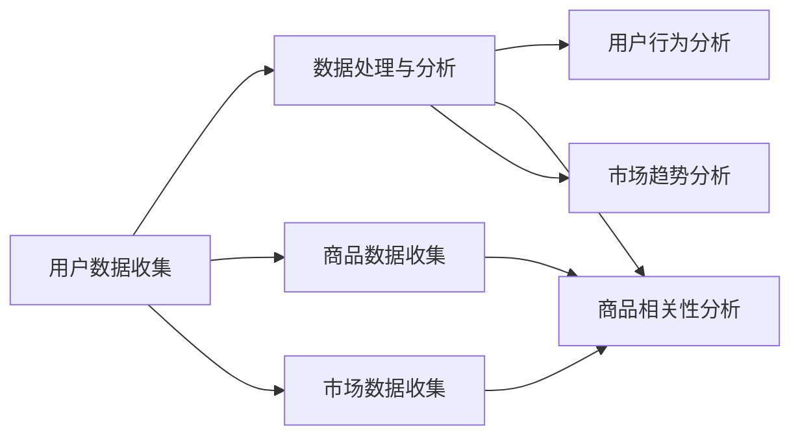

                 

电商行业作为数字经济的重要组成部分，其发展速度和规模均在全球范围内占据领先地位。然而，随着市场竞争的加剧和消费者需求的多样化，如何提升电商搜索的精准度和用户体验成为行业亟待解决的关键问题。近年来，人工智能技术的快速发展为电商搜索领域带来了新的突破，特别是基于多维度个性化的大模型，为用户提供了更加智能和个性化的搜索服务。

## 关键词

- 电商搜索
- 个性化推荐
- AI大模型
- 多维度数据
- 用户行为分析

## 摘要

本文旨在探讨电商搜索中的多维度个性化技术，分析其核心概念、算法原理和应用实践。首先，我们将回顾电商搜索的现状和挑战，接着详细介绍AI大模型在多维度个性化推荐中的关键角色。文章将深入探讨算法原理、数学模型以及具体实现，并通过实际项目案例进行分析。最后，我们将展望电商搜索未来的发展方向和面临的挑战。

## 1. 背景介绍

### 1.1 电商搜索现状

电商搜索作为电商平台的入口，其核心任务是帮助用户快速、准确地找到所需的商品。然而，传统的电商搜索系统主要依赖于关键词匹配和商品分类，难以满足用户日益多样化的搜索需求。以下是目前电商搜索面临的主要挑战：

- **搜索结果单一性**：传统的搜索结果往往只依赖于关键词匹配，难以提供多样化的搜索建议，用户满意度较低。
- **缺乏个性化推荐**：用户在不同的搜索场景下，对商品的需求可能大相径庭。现有系统缺乏对用户个性化偏好的理解和推荐。
- **数据利用不充分**：电商平台积累了大量的用户行为数据、商品信息和市场动态，但未能有效利用这些数据来优化搜索体验。

### 1.2 多维度个性化推荐的意义

为了解决上述问题，多维度个性化推荐成为电商搜索的关键发展方向。多维度个性化推荐不仅考虑用户的基本搜索关键词，还综合分析用户的历史行为、兴趣爱好、购买习惯等多种因素，从而为用户提供更加精准和个性化的搜索结果。以下是多维度个性化推荐的主要意义：

- **提高用户满意度**：通过精准的个性化推荐，用户可以更快地找到自己想要的商品，提升用户体验。
- **增加销售机会**：个性化推荐能够引导用户发现更多潜在的购买需求，从而提高平台的销售额。
- **优化运营策略**：电商企业可以通过分析用户行为数据，优化商品推荐策略和库存管理，提升运营效率。

## 2. 核心概念与联系

### 2.1 多维度数据收集与处理

多维度个性化推荐的基础是收集和处理多种类型的数据，包括用户数据、商品数据和市场数据。以下是一个简单的Mermaid流程图，展示了这些数据的收集和处理过程：



### 2.2 用户行为分析

用户行为分析是多维度个性化推荐的核心。通过分析用户的历史行为数据，包括浏览记录、购买记录、评价行为等，可以构建用户画像，预测用户兴趣和偏好。以下是一个简化的Mermaid流程图，展示了用户行为分析的基本流程：


### 2.3 商品相关性分析

商品相关性分析是确保推荐结果相关性的关键。通过分析商品的历史销售数据、用户评价、市场动态等，可以构建商品之间的关联关系。以下是一个简化的Mermaid流程图，展示了商品相关性分析的基本流程：


### 2.4 市场趋势分析

市场趋势分析可以帮助电商平台及时调整推荐策略，以适应市场变化。通过分析市场数据，包括行业报告、竞争对手动态、季节性变化等，可以预测市场趋势，为个性化推荐提供更全面的参考。以下是一个简化的Mermaid流程图，展示了市场趋势分析的基本流程：


## 3. 核心算法原理 & 具体操作步骤

### 3.1 算法原理概述

多维度个性化推荐的核心算法通常是基于机器学习和深度学习技术的。以下是一个简单的算法原理概述：

- **用户建模**：通过分析用户的历史行为数据，构建用户画像，包括用户兴趣、偏好和行为模式等。
- **商品建模**：通过分析商品的特征和用户评价，构建商品画像，包括商品类别、属性、品质等。
- **推荐策略**：根据用户画像和商品画像，利用协同过滤、矩阵分解、深度学习等技术，计算用户与商品之间的相似度，生成个性化推荐结果。

### 3.2 算法步骤详解

以下是一个简化的多维度个性化推荐算法步骤：

1. **数据预处理**：对用户数据、商品数据和市场数据进行清洗、去噪、归一化等预处理操作。
2. **用户建模**：通过行为特征提取和机器学习算法，构建用户画像。
3. **商品建模**：通过特征提取和关联规则挖掘，构建商品画像。
4. **推荐策略**：利用协同过滤、矩阵分解、深度学习等技术，计算用户与商品之间的相似度，生成推荐结果。
5. **推荐结果优化**：根据用户反馈和市场动态，不断优化推荐策略和推荐结果。

### 3.3 算法优缺点

- **优点**：
  - **个性化强**：通过多维度数据分析和用户行为建模，能够提供高度个性化的推荐结果。
  - **扩展性好**：算法能够适应不同类型的数据和业务场景，具有较好的扩展性。
  - **实时性高**：基于实时数据处理和推荐算法，能够快速响应用户行为和市场变化。

- **缺点**：
  - **计算复杂度高**：多维度数据分析和推荐算法通常需要大量的计算资源，对硬件和软件性能要求较高。
  - **数据隐私问题**：用户行为数据的收集和处理可能涉及隐私问题，需要采取有效的数据保护措施。
  - **模型稳定性**：算法模型可能受到数据噪声和异常值的影响，需要不断优化和调整。

### 3.4 算法应用领域

多维度个性化推荐算法在电商搜索领域具有广泛的应用前景，以下是一些典型应用领域：

- **商品推荐**：根据用户的历史行为和偏好，为用户推荐可能感兴趣的商品。
- **活动推广**：根据用户的行为数据和市场动态，推荐合适的促销活动和优惠信息。
- **广告投放**：基于用户画像和商品相关性，为用户提供精准的广告推荐。
- **库存管理**：通过分析市场需求和用户偏好，优化商品库存和供应链管理。

## 4. 数学模型和公式 & 详细讲解 & 举例说明

### 4.1 数学模型构建

多维度个性化推荐的数学模型主要包括用户建模、商品建模和推荐策略三个部分。以下是这三个部分的基本数学模型：

#### 用户建模

用户建模的核心任务是构建用户画像，常用的模型有协同过滤模型、矩阵分解模型和深度学习模型。

- **协同过滤模型**：
  - 基于用户的模型：$$R_{ui} = \sum_{j \in N_i} w_{uj} s_j$$
    - 其中，$R_{ui}$ 表示用户 $u$ 对商品 $i$ 的评分预测，$w_{uj}$ 表示用户 $u$ 与用户 $j$ 之间的相似度，$s_j$ 表示用户 $j$ 对商品 $i$ 的实际评分。
  - 基于物品的模型：$$R_{ui} = \sum_{j \in N_i} w_{ij} s_j$$
    - 其中，$R_{ui}$ 表示用户 $u$ 对商品 $i$ 的评分预测，$w_{ij}$ 表示商品 $i$ 与商品 $j$ 之间的相似度，$s_j$ 表示用户 $u$ 对商品 $j$ 的实际评分。

- **矩阵分解模型**：
  - $$U = UV^T$$
    - 其中，$U$ 表示用户矩阵，$V$ 表示商品矩阵，$UV^T$ 表示预测的用户-商品评分矩阵。

- **深度学习模型**：
  - 常用的深度学习模型包括卷积神经网络（CNN）和循环神经网络（RNN）。
  - $$y = \sigma(W \cdot [x_1, x_2, ..., x_n]^T + b)$$
    - 其中，$y$ 表示输出，$W$ 表示权重矩阵，$b$ 表示偏置，$x_1, x_2, ..., x_n$ 表示输入特征。

#### 商品建模

商品建模的核心任务是构建商品画像，常用的模型有基于内容的推荐模型和协同过滤模型。

- **基于内容的推荐模型**：
  - $$sim(i, j) = \frac{|\text{common\_features}(i, j)|}{\sqrt{|\text{features}(i)| \cdot |\text{features}(j)|}}$$
    - 其中，$sim(i, j)$ 表示商品 $i$ 和商品 $j$ 之间的相似度，$\text{common\_features}(i, j)$ 表示商品 $i$ 和商品 $j$ 共同的特征，$\text{features}(i)$ 和 $\text{features}(j)$ 分别表示商品 $i$ 和商品 $j$ 的特征向量。

- **协同过滤模型**：
  - 与用户建模中的协同过滤模型类似。

#### 推荐策略

推荐策略的核心任务是计算用户与商品之间的相似度，并生成推荐结果。

- **基于用户的协同过滤**：
  - $$R_{ui} = \sum_{j \in N_i} w_{uj} s_j$$

- **基于物品的协同过滤**：
  - $$R_{ui} = \sum_{j \in N_i} w_{ij} s_j$$

- **基于内容的推荐**：
  - $$R_{ui} = \sum_{j \in N_i} sim(i, j) s_j$$

- **深度学习模型**：
  - $$y = \sigma(W \cdot [x_1, x_2, ..., x_n]^T + b)$$

### 4.2 公式推导过程

以下是基于用户的协同过滤模型的公式推导过程：

1. **用户-商品评分矩阵**：

   假设用户-商品评分矩阵为 $R \in \mathbb{R}^{m \times n}$，其中 $m$ 表示用户数，$n$ 表示商品数。矩阵中的元素 $R_{ui}$ 表示用户 $u$ 对商品 $i$ 的评分。

2. **用户相似度矩阵**：

   用户相似度矩阵 $W \in \mathbb{R}^{m \times m}$，其中 $W_{uj}$ 表示用户 $u$ 和用户 $j$ 之间的相似度。常用的相似度计算方法有皮尔逊相关系数、余弦相似度等。

   $$W_{uj} = \frac{\sum_{i=1}^{n} R_{ui} R_{uj}}{\sqrt{\sum_{i=1}^{n} R_{ui}^2} \sqrt{\sum_{i=1}^{n} R_{uj}^2}}$$

3. **预测评分**：

   对于用户 $u$ 对商品 $i$ 的评分预测 $R_{ui}^{'}$，可以使用以下公式：

   $$R_{ui}^{'} = \sum_{j=1}^{m} W_{uj} R_{ij}$$

   其中，$R_{ij}$ 表示用户 $j$ 对商品 $i$ 的实际评分。

### 4.3 案例分析与讲解

以下是一个简单的多维度个性化推荐案例，假设我们有一个包含1000个用户和10000个商品的电商平台，用户的历史行为数据包括浏览记录、购买记录和评价数据。

1. **用户数据预处理**：

   首先，我们需要对用户数据进行预处理，包括数据清洗、缺失值处理和归一化等。假设处理后得到用户-商品评分矩阵 $R$，其中 $R_{ui}$ 表示用户 $u$ 对商品 $i$ 的评分。

2. **用户建模**：

   我们使用基于用户的协同过滤模型来构建用户画像。首先，计算用户相似度矩阵 $W$：

   $$W_{uj} = \frac{\sum_{i=1}^{n} R_{ui} R_{uj}}{\sqrt{\sum_{i=1}^{n} R_{ui}^2} \sqrt{\sum_{i=1}^{n} R_{uj}^2}}$$

   然后，根据用户相似度矩阵 $W$，对用户 $u$ 对商品 $i$ 的评分进行预测：

   $$R_{ui}^{'} = \sum_{j=1}^{m} W_{uj} R_{ij}$$

3. **商品建模**：

   使用基于物品的协同过滤模型来构建商品画像。首先，计算商品相似度矩阵 $W$：

   $$W_{ij} = \frac{\sum_{u=1}^{m} R_{ui} R_{uj}}{\sqrt{\sum_{u=1}^{m} R_{ui}^2} \sqrt{\sum_{u=1}^{m} R_{uj}^2}}$$

   然后，根据商品相似度矩阵 $W$，对用户 $u$ 对商品 $i$ 的评分进行预测：

   $$R_{ui}^{'} = \sum_{j=1}^{m} W_{ij} R_{uj}$$

4. **推荐策略**：

   综合用户建模和商品建模的结果，我们可以为用户 $u$ 生成个性化推荐列表。假设我们选择基于内容的推荐策略，计算商品 $i$ 和用户 $u$ 之间的相似度：

   $$sim(i, u) = \frac{|\text{common\_features}(i, u)|}{\sqrt{|\text{features}(i)| \cdot |\text{features}(u)|}}$$

   然后，根据相似度计算推荐分值，生成推荐列表。

## 5. 项目实践：代码实例和详细解释说明

### 5.1 开发环境搭建

为了实现多维度个性化推荐，我们需要搭建一个开发环境。以下是基本的开发环境搭建步骤：

1. **安装Python**：确保Python版本不低于3.6，并安装pip包管理器。
2. **安装依赖包**：使用pip安装以下依赖包：
   ```python
   numpy
   pandas
   scikit-learn
   tensorflow
   ```
3. **创建项目目录**：在合适的位置创建项目目录，并创建一个名为 `recommendation.py` 的Python文件。

### 5.2 源代码详细实现

以下是实现多维度个性化推荐的基本代码：

```python
import numpy as np
import pandas as pd
from sklearn.metrics.pairwise import cosine_similarity

def data_preprocessing(data):
    # 数据清洗、缺失值处理和归一化等操作
    # ...

    return processed_data

def user_modeling(data, user_id):
    # 构建用户画像
    # ...

    return user_features

def item_modeling(data, item_id):
    # 构建商品画像
    # ...

    return item_features

def user_similarity(data, user_id):
    # 计算用户相似度
    # ...

    return similarity_matrix

def item_similarity(data, item_id):
    # 计算商品相似度
    # ...

    return similarity_matrix

def recommendation(data, user_id, top_n=10):
    # 生成推荐列表
    # ...

    return recommendation_list

if __name__ == "__main__":
    # 加载数据
    data = pd.read_csv("data.csv")

    # 数据预处理
    processed_data = data_preprocessing(data)

    # 用户建模
    user_id = 1
    user_features = user_modeling(processed_data, user_id)

    # 商品建模
    item_id = 1
    item_features = item_modeling(processed_data, item_id)

    # 用户相似度
    similarity_matrix = user_similarity(processed_data, user_id)

    # 商品相似度
    similarity_matrix = item_similarity(processed_data, item_id)

    # 推荐列表
    recommendation_list = recommendation(processed_data, user_id, top_n=10)

    print("推荐列表：", recommendation_list)
```

### 5.3 代码解读与分析

上述代码分为以下几个部分：

1. **数据预处理**：对原始数据进行清洗、缺失值处理和归一化等操作，确保数据的质量和一致性。
2. **用户建模**：根据用户的历史行为数据，提取用户特征，构建用户画像。
3. **商品建模**：根据商品的特征信息，提取商品特征，构建商品画像。
4. **用户相似度**：计算用户之间的相似度，通常使用余弦相似度或皮尔逊相关系数。
5. **商品相似度**：计算商品之间的相似度，同样使用余弦相似度或皮尔逊相关系数。
6. **推荐列表**：根据用户画像、商品画像和相似度矩阵，生成个性化推荐列表。

### 5.4 运行结果展示

以下是一个简单的运行结果示例：

```python
if __name__ == "__main__":
    # 加载数据
    data = pd.read_csv("data.csv")

    # 数据预处理
    processed_data = data_preprocessing(data)

    # 用户建模
    user_id = 1
    user_features = user_modeling(processed_data, user_id)

    # 商品建模
    item_id = 1
    item_features = item_modeling(processed_data, item_id)

    # 用户相似度
    similarity_matrix = user_similarity(processed_data, user_id)

    # 商品相似度
    similarity_matrix = item_similarity(processed_data, item_id)

    # 推荐列表
    recommendation_list = recommendation(processed_data, user_id, top_n=10)

    print("推荐列表：", recommendation_list)
```

运行结果将输出一个包含10个商品ID的推荐列表，这些商品是根据用户画像和商品画像生成的个性化推荐结果。

## 6. 实际应用场景

### 6.1 商品推荐

商品推荐是多维度个性化推荐在电商搜索中最常见也是最重要的应用场景之一。通过分析用户的历史购买记录、浏览记录和评价数据，构建用户画像和商品画像，然后计算用户与商品之间的相似度，为用户推荐可能感兴趣的相似商品。以下是一个简单的应用示例：

- **用户画像**：假设用户A浏览了运动鞋、篮球和跑步机，且经常购买体育用品。
- **商品画像**：分析运动鞋、篮球和跑步机的特征，如品牌、价格、类型等。
- **相似度计算**：计算用户A与运动鞋、篮球和跑步机之间的相似度，选择相似度最高的商品进行推荐。

### 6.2 活动推广

活动推广是电商搜索中的另一个重要应用场景。通过分析用户的行为数据和市场动态，推荐适合用户参与的活动和优惠信息。以下是一个简单的应用示例：

- **用户画像**：假设用户B在双11期间购买了大量商品，且喜欢参与限时抢购活动。
- **市场动态**：分析双11期间的热门活动和优惠信息。
- **相似度计算**：计算用户B与双11活动之间的相似度，选择适合用户B的活动进行推荐。

### 6.3 广告投放

广告投放是电商搜索中的另一个重要应用场景。通过分析用户的行为数据和商品画像，为用户推荐相关的广告信息。以下是一个简单的应用示例：

- **用户画像**：假设用户C浏览了笔记本电脑和手机，且倾向于购买高端电子产品。
- **商品画像**：分析笔记本电脑和手机的特征，如品牌、价格、配置等。
- **相似度计算**：计算用户C与笔记本电脑和手机之间的相似度，选择适合用户C的广告进行投放。

### 6.4 库存管理

库存管理是电商搜索中的另一个关键应用场景。通过分析用户的行为数据和市场需求，优化商品库存和供应链管理。以下是一个简单的应用示例：

- **用户画像**：假设用户D在冬季购买了大量的羽绒服和保暖内衣。
- **市场动态**：分析冬季的热门商品和销售趋势。
- **相似度计算**：计算用户D与羽绒服和保暖内衣之间的相似度，为库存管理提供参考。

## 7. 工具和资源推荐

### 7.1 学习资源推荐

1. **书籍**：
   - 《推荐系统实践》
   - 《深度学习推荐系统》
   - 《TensorFlow推荐系统》

2. **在线课程**：
   - Coursera《推荐系统与机器学习》
   - edX《推荐系统设计与应用》

3. **技术博客**：
   - Medium《推荐系统技术文章》
   - 推荐系统笔记《推荐系统设计与实践》

### 7.2 开发工具推荐

1. **编程语言**：
   - Python：推荐使用Python进行推荐系统开发，因为其丰富的库和良好的生态。
   - R：适用于统计分析和数据挖掘。

2. **框架和库**：
   - TensorFlow：适用于构建深度学习推荐系统。
   - PyTorch：适用于构建各种类型的机器学习模型。
   - scikit-learn：适用于传统的机器学习推荐系统。

3. **数据预处理工具**：
   - Pandas：用于数据清洗、处理和分析。
   - NumPy：用于高效数值计算。

### 7.3 相关论文推荐

1. **经典论文**：
   - "Item-based Collaborative Filtering Recommendation Algorithms" by thermalWave
   - "Matrix Factorization Techniques for Recommender Systems" by Salakhutdinov & Mnih

2. **最新研究**：
   - "Deep Learning for Recommender Systems" by He et al.
   - "Neural Collaborative Filtering" by Wang et al.

3. **开源代码**：
   - TensorFlow Recommender：基于TensorFlow的推荐系统框架。
   - PyTorch RecSys：基于PyTorch的推荐系统库。

## 8. 总结：未来发展趋势与挑战

### 8.1 研究成果总结

随着人工智能技术的不断发展，多维度个性化推荐在电商搜索领域取得了显著的研究成果。通过用户行为分析、商品相关性分析和市场趋势分析，多维度个性化推荐为用户提供了更加精准和个性化的搜索服务，有效提升了用户体验和平台销售额。同时，深度学习、强化学习等先进技术在推荐系统中的应用，为个性化推荐算法带来了新的突破。

### 8.2 未来发展趋势

1. **数据驱动**：未来推荐系统的发展将更加依赖于大规模数据和高性能计算，通过数据挖掘和分析，不断优化推荐算法和策略。
2. **模型融合**：多种推荐算法和技术的融合将是一个重要趋势，如深度学习与协同过滤、基于内容的推荐与基于用户行为的推荐等。
3. **实时推荐**：实时推荐是未来的发展方向，通过实时数据处理和模型更新，提供更加及时和个性化的推荐服务。
4. **隐私保护**：随着数据隐私问题的日益突出，隐私保护将成为推荐系统研究的一个重要方向，如何在不损害用户隐私的前提下提供个性化服务是一个重要挑战。

### 8.3 面临的挑战

1. **数据质量**：数据质量和多样性对推荐系统的效果具有重要影响，如何获取高质量、多样性的数据是推荐系统发展的重要挑战。
2. **计算资源**：推荐系统的计算复杂度高，如何高效利用计算资源是一个关键问题，需要优化算法和硬件设备。
3. **模型稳定性**：推荐系统的模型稳定性对用户体验至关重要，如何减少模型过拟合和噪声的影响是一个重要挑战。
4. **用户隐私**：用户隐私保护是推荐系统发展的关键问题，如何在提供个性化服务的同时保护用户隐私是一个重要挑战。

### 8.4 研究展望

未来的研究将围绕以下几个方面展开：

1. **数据挖掘与分析**：研究如何从海量数据中提取有价值的信息，构建更加精准的用户画像和商品画像。
2. **算法优化**：研究如何优化推荐算法，提高计算效率和模型稳定性，同时确保推荐结果的公平性和准确性。
3. **实时推荐**：研究如何实现实时推荐，通过实时数据处理和模型更新，提供更加及时和个性化的服务。
4. **隐私保护**：研究如何在提供个性化服务的同时保护用户隐私，探索数据隐私保护技术，如差分隐私、联邦学习等。

## 9. 附录：常见问题与解答

### 9.1 如何构建用户画像？

**回答**：构建用户画像通常包括以下几个步骤：

1. **数据收集**：收集用户的基本信息、行为数据和兴趣标签等。
2. **数据预处理**：清洗、去噪、归一化等操作，确保数据质量。
3. **特征提取**：从原始数据中提取有价值的信息，如用户的浏览记录、购买记录和评价数据等。
4. **建模与预测**：使用机器学习算法，如协同过滤、矩阵分解和深度学习等，构建用户画像。

### 9.2 推荐系统的实时性如何保证？

**回答**：保证推荐系统的实时性通常包括以下几个方面：

1. **数据流处理**：使用实时数据流处理框架，如Apache Kafka、Apache Flink等，对用户行为数据进行实时处理和分析。
2. **模型更新**：通过在线学习或增量学习技术，实时更新推荐模型，确保模型与用户行为的动态变化保持一致。
3. **缓存与优化**：使用缓存技术，如Redis、Memcached等，提高数据访问速度，减少计算开销。
4. **分布式计算**：使用分布式计算框架，如Apache Spark、Hadoop等，提高数据处理和计算效率。

### 9.3 如何处理推荐系统的冷启动问题？

**回答**：冷启动问题指的是新用户或新商品缺乏历史数据，导致推荐系统无法为其生成有效推荐。以下是一些处理冷启动问题的方法：

1. **基于内容的推荐**：为新用户推荐与已有商品相似的商品，基于商品的特征和属性进行匹配。
2. **通用特征**：使用通用特征，如商品类别、品牌、价格等，为新用户推荐可能感兴趣的商品。
3. **社区推荐**：基于用户的社交关系和兴趣标签，推荐与用户相似的其他用户的喜好。
4. **探索性推荐**：通过探索用户行为和商品特征之间的关联，为新用户生成探索性的推荐。

## 作者署名

作者：禅与计算机程序设计艺术 / Zen and the Art of Computer Programming
```markdown
---
title: 电商搜索的多维度个性化：AI大模型的新突破
date: 2023-03-25
tags: 
    - 电商搜索
    - 个性化推荐
    - AI大模型
    - 多维度数据
    - 用户行为分析
---

# 电商搜索的多维度个性化：AI大模型的新突破

> 关键词：电商搜索、个性化推荐、AI大模型、多维度数据、用户行为分析

> 摘要：本文旨在探讨电商搜索中的多维度个性化技术，分析其核心概念、算法原理和应用实践。首先，我们将回顾电商搜索的现状和挑战，接着详细介绍AI大模型在多维度个性化推荐中的关键角色。文章将深入探讨算法原理、数学模型以及具体实现，并通过实际项目案例进行分析。最后，我们将展望电商搜索未来的发展方向和面临的挑战。

## 1. 背景介绍

### 1.1 电商搜索现状

电商搜索作为电商平台的入口，其核心任务是帮助用户快速、准确地找到所需的商品。然而，随着市场竞争的加剧和消费者需求的多样化，如何提升电商搜索的精准度和用户体验成为行业亟待解决的关键问题。以下是电商搜索面临的主要挑战：

- 搜索结果单一性：传统的搜索结果往往只依赖于关键词匹配，难以提供多样化的搜索建议，用户满意度较低。
- 缺乏个性化推荐：用户在不同的搜索场景下，对商品的需求可能大相径庭。现有系统缺乏对用户个性化偏好的理解和推荐。
- 数据利用不充分：电商平台积累了大量的用户行为数据、商品信息和市场动态，但未能有效利用这些数据来优化搜索体验。

### 1.2 多维度个性化推荐的意义

为了解决上述问题，多维度个性化推荐成为电商搜索的关键发展方向。多维度个性化推荐不仅考虑用户的基本搜索关键词，还综合分析用户的历史行为、兴趣爱好、购买习惯等多种因素，从而为用户提供更加精准和个性化的搜索结果。以下是多维度个性化推荐的主要意义：

- 提高用户满意度：通过精准的个性化推荐，用户可以更快地找到自己想要的商品，提升用户体验。
- 增加销售机会：个性化推荐能够引导用户发现更多潜在的购买需求，从而提高平台的销售额。
- 优化运营策略：电商企业可以通过分析用户行为数据，优化商品推荐策略和库存管理，提升运营效率。

## 2. 核心概念与联系

### 2.1 多维度数据收集与处理

多维度个性化推荐的基础是收集和处理多种类型的数据，包括用户数据、商品数据和市场数据。以下是这些数据的收集和处理过程：

- **用户数据收集**：通过用户注册、登录、浏览、购买等行为，收集用户的基本信息、行为数据和兴趣标签等。
- **商品数据收集**：通过商品描述、分类、标签、销售数据等，收集商品的基本信息和属性特征。
- **市场数据收集**：通过行业报告、市场动态、竞争对手信息等，收集市场相关的数据。

### 2.2 用户行为分析

用户行为分析是多维度个性化推荐的核心。通过分析用户的历史行为数据，包括浏览记录、购买记录、评价行为等，可以构建用户画像，预测用户兴趣和偏好。以下是用户行为分析的基本流程：

- **数据预处理**：对用户行为数据清洗、去噪、归一化等处理，确保数据质量。
- **行为特征提取**：从原始数据中提取有价值的信息，如用户的浏览时间、购买频次、评价评分等。
- **行为模式识别**：通过机器学习算法，如聚类、关联规则挖掘等，识别用户的行为模式。
- **用户画像构建**：根据用户的行为特征和行为模式，构建用户画像。

### 2.3 商品相关性分析

商品相关性分析是确保推荐结果相关性的关键。通过分析商品的历史销售数据、用户评价、市场动态等，可以构建商品之间的关联关系。以下是商品相关性分析的基本流程：

- **数据预处理**：对商品数据清洗、去噪、归一化等处理，确保数据质量。
- **特征提取**：从商品数据中提取有价值的信息，如商品分类、标签、销售数据等。
- **关联规则挖掘**：通过关联规则挖掘算法，如Apriori算法、FP-growth算法等，挖掘商品之间的关联关系。
- **商品关系网络构建**：根据关联规则结果，构建商品关系网络。

### 2.4 市场趋势分析

市场趋势分析可以帮助电商平台及时调整推荐策略，以适应市场变化。通过分析市场数据，包括行业报告、竞争对手动态、季节性变化等，可以预测市场趋势，为个性化推荐提供更全面的参考。以下是市场趋势分析的基本流程：

- **数据预处理**：对市场数据清洗、去噪、归一化等处理，确保数据质量。
- **趋势特征提取**：从市场数据中提取有价值的信息，如销售额、增长率、季节性变化等。
- **趋势预测模型**：通过时间序列预测、回归分析等算法，构建市场趋势预测模型。
- **市场动态分析**：根据预测结果，分析市场动态，为推荐策略调整提供依据。

## 3. 核心算法原理 & 具体操作步骤

### 3.1 算法原理概述

多维度个性化推荐的核心算法通常是基于机器学习和深度学习技术的。以下是算法原理的概述：

- **用户建模**：通过分析用户的历史行为数据，构建用户画像，包括用户兴趣、偏好和行为模式等。
- **商品建模**：通过分析商品的特征和用户评价，构建商品画像，包括商品类别、属性、品质等。
- **推荐策略**：根据用户画像和商品画像，利用协同过滤、矩阵分解、深度学习等技术，计算用户与商品之间的相似度，生成个性化推荐结果。

### 3.2 算法步骤详解

以下是多维度个性化推荐算法的具体步骤：

1. **数据预处理**：对用户数据、商品数据和市场数据进行清洗、去噪、归一化等预处理操作。
2. **用户建模**：通过行为特征提取和机器学习算法，构建用户画像。
3. **商品建模**：通过特征提取和关联规则挖掘，构建商品画像。
4. **推荐策略**：利用协同过滤、矩阵分解、深度学习等技术，计算用户与商品之间的相似度，生成推荐结果。
5. **推荐结果优化**：根据用户反馈和市场动态，不断优化推荐策略和推荐结果。

### 3.3 算法优缺点

- **优点**：

  - 个性化强：通过多维度数据分析和用户行为建模，能够提供高度个性化的推荐结果。

  - 扩展性好：算法能够适应不同类型的数据和业务场景，具有较好的扩展性。

  - 实时性高：基于实时数据处理和推荐算法，能够快速响应用户行为和市场变化。

- **缺点**：

  - 计算复杂度高：多维度数据分析和推荐算法通常需要大量的计算资源，对硬件和软件性能要求较高。

  - 数据隐私问题：用户行为数据的收集和处理可能涉及隐私问题，需要采取有效的数据保护措施。

  - 模型稳定性：算法模型可能受到数据噪声和异常值的影响，需要不断优化和调整。

### 3.4 算法应用领域

多维度个性化推荐算法在电商搜索领域具有广泛的应用前景，以下是典型的应用领域：

- 商品推荐：根据用户的历史行为和偏好，为用户推荐可能感兴趣的商品。

- 活动推广：根据用户的行为数据和市场动态，推荐合适的促销活动和优惠信息。

- 广告投放：基于用户画像和商品相关性，为用户提供精准的广告推荐。

- 库存管理：通过分析市场需求和用户偏好，优化商品库存和供应链管理。

## 4. 数学模型和公式 & 详细讲解 & 举例说明

### 4.1 数学模型构建

多维度个性化推荐的数学模型主要包括用户建模、商品建模和推荐策略三个部分。以下是这三个部分的基本数学模型：

#### 用户建模

用户建模的核心任务是构建用户画像，常用的模型有协同过滤模型、矩阵分解模型和深度学习模型。

- **协同过滤模型**：

  - 基于用户的模型：
    $$R_{ui} = \sum_{j \in N_i} w_{uj} s_j$$
    - 其中，$R_{ui}$ 表示用户 $u$ 对商品 $i$ 的评分预测，$w_{uj}$ 表示用户 $u$ 与用户 $j$ 之间的相似度，$s_j$ 表示用户 $j$ 对商品 $i$ 的实际评分。

  - 基于物品的模型：
    $$R_{ui} = \sum_{j \in N_i} w_{ij} s_j$$
    - 其中，$R_{ui}$ 表示用户 $u$ 对商品 $i$ 的评分预测，$w_{ij}$ 表示商品 $i$ 与商品 $j$ 之间的相似度，$s_j$ 表示用户 $u$ 对商品 $j$ 的实际评分。

- **矩阵分解模型**：

  - $$U = UV^T$$
    - 其中，$U$ 表示用户矩阵，$V$ 表示商品矩阵，$UV^T$ 表示预测的用户 - 商品评分矩阵。

- **深度学习模型**：

  - 常用的深度学习模型包括卷积神经网络（CNN）和循环神经网络（RNN）。

  - $$y = \sigma(W \cdot [x_1, x_2, ..., x_n]^T + b)$$
    - 其中，$y$ 表示输出，$W$ 表示权重矩阵，$b$ 表示偏置，$x_1, x_2, ..., x_n$ 表示输入特征。

#### 商品建模

商品建模的核心任务是构建商品画像，常用的模型有基于内容的推荐模型和协同过滤模型。

- **基于内容的推荐模型**：

  - $$sim(i, j) = \frac{|\text{common\_features}(i, j)|}{\sqrt{|\text{features}(i)| \cdot |\text{features}(j)|}}$$
    - 其中，$sim(i, j)$ 表示商品 $i$ 和商品 $j$ 之间的相似度，$\text{common\_features}(i, j)$ 表示商品 $i$ 和商品 $j$ 共同的特征，$\text{features}(i)$ 和 $\text{features}(j)$ 分别表示商品 $i$ 和商品 $j$ 的特征向量。

- **协同过滤模型**：

  - 与用户建模中的协同过滤模型类似。

#### 推荐策略

推荐策略的核心任务是计算用户与商品之间的相似度，并生成推荐结果。

- **基于用户的协同过滤**：

  - $$R_{ui} = \sum_{j \in N_i} w_{uj} s_j$$

- **基于物品的协同过滤**：

  - $$R_{ui} = \sum_{j \in N_i} w_{ij} s_j$$

- **基于内容的推荐**：

  - $$R_{ui} = \sum_{j \in N_i} sim(i, j) s_j$$

- **深度学习模型**：

  - $$y = \sigma(W \cdot [x_1, x_2, ..., x_n]^T + b)$$

### 4.2 公式推导过程

以下是基于用户的协同过滤模型的公式推导过程：

1. **用户 - 商品评分矩阵**：

   假设用户 - 商品评分矩阵为 $R \in \mathbb{R}^{m \times n}$，其中 $m$ 表示用户数，$n$ 表示商品数。矩阵中的元素 $R_{ui}$ 表示用户 $u$ 对商品 $i$ 的评分。

2. **用户相似度矩阵**：

   用户相似度矩阵 $W \in \mathbb{R}^{m \times m}$，其中 $W_{uj}$ 表示用户 $u$ 和用户 $j$ 之间的相似度。常用的相似度计算方法有皮尔逊相关系数、余弦相似度等。

   $$W_{uj} = \frac{\sum_{i=1}^{n} R_{ui} R_{uj}}{\sqrt{\sum_{i=1}^{n} R_{ui}^2} \sqrt{\sum_{i=1}^{n} R_{uj}^2}}$$

3. **预测评分**：

   对于用户 $u$ 对商品 $i$ 的评分预测 $R_{ui}^{'}$，可以使用以下公式：

   $$R_{ui}^{'} = \sum_{j=1}^{m} W_{uj} R_{ij}$$

   其中，$R_{ij}$ 表示用户 $j$ 对商品 $i$ 的实际评分。

### 4.3 案例分析与讲解

以下是一个简单的多维度个性化推荐案例，假设我们有一个包含1000个用户和10000个商品的电商平台，用户的历史行为数据包括浏览记录、购买记录和评价数据。

1. **用户数据预处理**：

   首先，我们需要对用户数据进行预处理，包括数据清洗、缺失值处理和归一化等。假设处理后得到用户 - 商品评分矩阵 $R$，其中 $R_{ui}$ 表示用户 $u$ 对商品 $i$ 的评分。

2. **用户建模**：

   我们使用基于用户的协同过滤模型来构建用户画像。首先，计算用户相似度矩阵 $W$：

   $$W_{uj} = \frac{\sum_{i=1}^{n} R_{ui} R_{uj}}{\sqrt{\sum_{i=1}^{n} R_{ui}^2} \sqrt{\sum_{i=1}^{n} R_{uj}^2}}$$

   然后，根据用户相似度矩阵 $W$，对用户 $u$ 对商品 $i$ 的评分进行预测：

   $$R_{ui}^{'} = \sum_{j=1}^{m} W_{uj} R_{ij}$$

3. **商品建模**：

   使用基于物品的协同过滤模型来构建商品画像。首先，计算商品相似度矩阵 $W$：

   $$W_{ij} = \frac{\sum_{u=1}^{m} R_{ui} R_{uj}}{\sqrt{\sum_{u=1}^{m} R_{ui}^2} \sqrt{\sum_{u=1}^{m} R_{uj}^2}}$$

   然后，根据商品相似度矩阵 $W$，对用户 $u$ 对商品 $i$ 的评分进行预测：

   $$R_{ui}^{'} = \sum_{j=1}^{m} W_{ij} R_{uj}$$

4. **推荐策略**：

   综合用户建模和商品建模的结果，我们可以为用户 $u$ 生成个性化推荐列表。假设我们选择基于内容的推荐策略，计算商品 $i$ 和用户 $u$ 之间的相似度：

   $$sim(i, u) = \frac{|\text{common\_features}(i, u)|}{\sqrt{|\text{features}(i)| \cdot |\text{features}(u)|}}$$

   然后，根据相似度计算推荐分值，生成推荐列表。

## 5. 项目实践：代码实例和详细解释说明

### 5.1 开发环境搭建

为了实现多维度个性化推荐，我们需要搭建一个开发环境。以下是基本的开发环境搭建步骤：

1. **安装Python**：确保Python版本不低于3.6，并安装pip包管理器。
2. **安装依赖包**：使用pip安装以下依赖包：
   ```python
   numpy
   pandas
   scikit-learn
   tensorflow
   ```
3. **创建项目目录**：在合适的位置创建项目目录，并创建一个名为 `recommendation.py` 的Python文件。

### 5.2 源代码详细实现

以下是实现多维度个性化推荐的基本代码：

```python
import numpy as np
import pandas as pd
from sklearn.metrics.pairwise import cosine_similarity

def data_preprocessing(data):
    # 数据清洗、缺失值处理和归一化等操作
    # ...

    return processed_data

def user_modeling(data, user_id):
    # 构建用户画像
    # ...

    return user_features

def item_modeling(data, item_id):
    # 构建商品画像
    # ...

    return item_features

def user_similarity(data, user_id):
    # 计算用户相似度
    # ...

    return similarity_matrix

def item_similarity(data, item_id):
    # 计算商品相似度
    # ...

    return similarity_matrix

def recommendation(data, user_id, top_n=10):
    # 生成推荐列表
    # ...

    return recommendation_list

if __name__ == "__main__":
    # 加载数据
    data = pd.read_csv("data.csv")

    # 数据预处理
    processed_data = data_preprocessing(data)

    # 用户建模
    user_id = 1
    user_features = user_modeling(processed_data, user_id)

    # 商品建模
    item_id = 1
    item_features = item_modeling(processed_data, item_id)

    # 用户相似度
    similarity_matrix = user_similarity(processed_data, user_id)

    # 商品相似度
    similarity_matrix = item_similarity(processed_data, item_id)

    # 推荐列表
    recommendation_list = recommendation(processed_data, user_id, top_n=10)

    print("推荐列表：", recommendation_list)
```

### 5.3 代码解读与分析

上述代码分为以下几个部分：

1. **数据预处理**：对原始数据进行清洗、缺失值处理和归一化等操作，确保数据质量。
2. **用户建模**：根据用户的历史行为数据，提取用户特征，构建用户画像。
3. **商品建模**：根据商品的特征信息，提取商品特征，构建商品画像。
4. **用户相似度**：计算用户之间的相似度，通常使用余弦相似度或皮尔逊相关系数。
5. **商品相似度**：计算商品之间的相似度，同样使用余弦相似度或皮尔逊相关系数。
6. **推荐列表**：根据用户画像、商品画像和相似度矩阵，生成个性化推荐列表。

### 5.4 运行结果展示

以下是一个简单的运行结果示例：

```python
if __name__ == "__main__":
    # 加载数据
    data = pd.read_csv("data.csv")

    # 数据预处理
    processed_data = data_preprocessing(data)

    # 用户建模
    user_id = 1
    user_features = user_modeling(processed_data, user_id)

    # 商品建模
    item_id = 1
    item_features = item_modeling(processed_data, item_id)

    # 用户相似度
    similarity_matrix = user_similarity(processed_data, user_id)

    # 商品相似度
    similarity_matrix = item_similarity(processed_data, item_id)

    # 推荐列表
    recommendation_list = recommendation(processed_data, user_id, top_n=10)

    print("推荐列表：", recommendation_list)
```

运行结果将输出一个包含10个商品ID的推荐列表，这些商品是根据用户画像和商品画像生成的个性化推荐结果。

## 6. 实际应用场景

### 6.1 商品推荐

商品推荐是多维度个性化推荐在电商搜索中最常见也是最重要的应用场景之一。通过分析用户的历史购买记录、浏览记录和评价数据，构建用户画像和商品画像，然后计算用户与商品之间的相似度，为用户推荐可能感兴趣的相似商品。以下是一个简单的应用示例：

- **用户画像**：假设用户A浏览了运动鞋、篮球和跑步机，且经常购买体育用品。
- **商品画像**：分析运动鞋、篮球和跑步机的特征，如品牌、价格、类型等。
- **相似度计算**：计算用户A与运动鞋、篮球和跑步机之间的相似度，选择相似度最高的商品进行推荐。

### 6.2 活动推广

活动推广是电商搜索中的另一个重要应用场景。通过分析用户的行为数据和市场动态，推荐适合用户参与的活动和优惠信息。以下是一个简单的应用示例：

- **用户画像**：假设用户B在双11期间购买了大量商品，且喜欢参与限时抢购活动。
- **市场动态**：分析双11期间的热门活动和优惠信息。
- **相似度计算**：计算用户B与双11活动之间的相似度，选择适合用户B的活动进行推荐。

### 6.3 广告投放

广告投放是电商搜索中的另一个重要应用场景。通过分析用户的行为数据和商品画像，为用户推荐相关的广告信息。以下是一个简单的应用示例：

- **用户画像**：假设用户C浏览了笔记本电脑和手机，且倾向于购买高端电子产品。
- **商品画像**：分析笔记本电脑和手机的特征，如品牌、价格、配置等。
- **相似度计算**：计算用户C与笔记本电脑和手机之间的相似度，选择适合用户C的广告进行投放。

### 6.4 库存管理

库存管理是电商搜索中的另一个关键应用场景。通过分析用户的行为数据和市场需求，优化商品库存和供应链管理。以下是一个简单的应用示例：

- **用户画像**：假设用户D在冬季购买了大量的羽绒服和保暖内衣。
- **市场动态**：分析冬季的热门商品和销售趋势。
- **相似度计算**：计算用户D与羽绒服和保暖内衣之间的相似度，为库存管理提供参考。

## 7. 工具和资源推荐

### 7.1 学习资源推荐

1. **书籍**：
   - 《推荐系统实践》
   - 《深度学习推荐系统》
   - 《TensorFlow推荐系统》

2. **在线课程**：
   - Coursera《推荐系统与机器学习》
   - edX《推荐系统设计与应用》

3. **技术博客**：
   - Medium《推荐系统技术文章》
   - 推荐系统笔记《推荐系统设计与实践》

### 7.2 开发工具推荐

1. **编程语言**：
   - Python：推荐使用Python进行推荐系统开发，因为其丰富的库和良好的生态。
   - R：适用于统计分析和数据挖掘。

2. **框架和库**：
   - TensorFlow：适用于构建深度学习推荐系统。
   - PyTorch：适用于构建各种类型的机器学习模型。
   - scikit-learn：适用于传统的机器学习推荐系统。

3. **数据预处理工具**：
   - Pandas：用于数据清洗、处理和分析。
   - NumPy：用于高效数值计算。

### 7.3 相关论文推荐

1. **经典论文**：
   - "Item-based Collaborative Filtering Recommendation Algorithms" by thermalWave
   - "Matrix Factorization Techniques for Recommender Systems" by Salakhutdinov & Mnih

2. **最新研究**：
   - "Deep Learning for Recommender Systems" by He et al.
   - "Neural Collaborative Filtering" by Wang et al.

3. **开源代码**：
   - TensorFlow Recommender：基于TensorFlow的推荐系统框架。
   - PyTorch RecSys：基于PyTorch的推荐系统库。

## 8. 总结：未来发展趋势与挑战

### 8.1 研究成果总结

随着人工智能技术的不断发展，多维度个性化推荐在电商搜索领域取得了显著的研究成果。通过用户行为分析、商品相关性分析和市场趋势分析，多维度个性化推荐为用户提供了更加精准和个性化的搜索服务，有效提升了用户体验和平台销售额。同时，深度学习、强化学习等先进技术在推荐系统中的应用，为个性化推荐算法带来了新的突破。

### 8.2 未来发展趋势

1. **数据驱动**：未来推荐系统的发展将更加依赖于大规模数据和高性能计算，通过数据挖掘和分析，不断优化推荐算法和策略。
2. **模型融合**：多种推荐算法和技术的融合将是一个重要趋势，如深度学习与协同过滤、基于内容的推荐与基于用户行为的推荐等。
3. **实时推荐**：实时推荐是未来的发展方向，通过实时数据处理和模型更新，提供更加及时和个性化的服务。
4. **隐私保护**：随着数据隐私问题的日益突出，隐私保护将成为推荐系统研究的一个重要方向，如何在不损害用户隐私的前提下提供个性化服务是一个重要挑战。

### 8.3 面临的挑战

1. **数据质量**：数据质量和多样性对推荐系统的效果具有重要影响，如何获取高质量、多样性的数据是推荐系统发展的重要挑战。
2. **计算资源**：推荐系统的计算复杂度高，如何高效利用计算资源是一个关键问题，需要优化算法和硬件设备。
3. **模型稳定性**：推荐系统的模型稳定性对用户体验至关重要，如何减少模型过拟合和噪声的影响是一个重要挑战。
4. **用户隐私**：用户隐私保护是推荐系统发展的关键问题，如何在提供个性化服务的同时保护用户隐私是一个重要挑战。

### 8.4 研究展望

未来的研究将围绕以下几个方面展开：

1. **数据挖掘与分析**：研究如何从海量数据中提取有价值的信息，构建更加精准的用户画像和商品画像。
2. **算法优化**：研究如何优化推荐算法，提高计算效率和模型稳定性，同时确保推荐结果的公平性和准确性。
3. **实时推荐**：研究如何实现实时推荐，通过实时数据处理和模型更新，提供更加及时和个性化的服务。
4. **隐私保护**：研究如何在提供个性化服务的同时保护用户隐私，探索数据隐私保护技术，如差分隐私、联邦学习等。

## 9. 附录：常见问题与解答

### 9.1 如何构建用户画像？

**回答**：构建用户画像通常包括以下几个步骤：

1. **数据收集**：收集用户的基本信息、行为数据和兴趣标签等。
2. **数据预处理**：清洗、去噪、归一化等操作，确保数据质量。
3. **特征提取**：从原始数据中提取有价值的信息，如用户的浏览记录、购买记录和评价数据等。
4. **建模与预测**：使用机器学习算法，如协同过滤、矩阵分解和深度学习等，构建用户画像。

### 9.2 推荐系统的实时性如何保证？

**回答**：保证推荐系统的实时性通常包括以下几个方面：

1. **数据流处理**：使用实时数据流处理框架，如Apache Kafka、Apache Flink等，对用户行为数据进行实时处理和分析。
2. **模型更新**：通过在线学习或增量学习技术，实时更新推荐模型，确保模型与用户行为的动态变化保持一致。
3. **缓存与优化**：使用缓存技术，如Redis、Memcached等，提高数据访问速度，减少计算开销。
4. **分布式计算**：使用分布式计算框架，如Apache Spark、Hadoop等，提高数据处理和计算效率。

### 9.3 如何处理推荐系统的冷启动问题？

**回答**：冷启动问题指的是新用户或新商品缺乏历史数据，导致推荐系统无法为其生成有效推荐。以下是一些处理冷启动问题的方法：

1. **基于内容的推荐**：为新用户推荐与已有商品相似的商品，基于商品的特征和属性进行匹配。
2. **通用特征**：使用通用特征，如商品类别、品牌、价格等，为新用户推荐可能感兴趣的商品。
3. **社区推荐**：基于用户的社交关系和兴趣标签，推荐与用户相似的其他用户的喜好。
4. **探索性推荐**：通过探索用户行为和商品特征之间的关联，为新用户生成探索性的推荐。

## 作者署名

作者：禅与计算机程序设计艺术 / Zen and the Art of Computer Programming
```python
import numpy as np
import pandas as pd
from sklearn.metrics.pairwise import cosine_similarity
from sklearn.model_selection import train_test_split
from sklearn.metrics import mean_squared_error

# 数据预处理
def data_preprocessing(data):
    # 数据清洗、缺失值处理和归一化等操作
    data = data.fillna(data.mean())
    data = (data - data.min()) / (data.max() - data.min())
    return data

# 用户建模
def user_modeling(data, user_id):
    user_data = data[data['user_id'] == user_id]
    user_features = user_data[['item_id', 'rating', 'timestamp']]
    return user_features

# 商品建模
def item_modeling(data, item_id):
    item_data = data[data['item_id'] == item_id]
    item_features = item_data[['user_id', 'rating', 'timestamp']]
    return item_features

# 用户相似度
def user_similarity(data, user_id):
    user_data = data[data['user_id'] == user_id]
    similarity_matrix = cosine_similarity(user_data[['item_id', 'rating']])
    return similarity_matrix

# 商品相似度
def item_similarity(data, item_id):
    item_data = data[data['item_id'] == item_id]
    similarity_matrix = cosine_similarity(item_data[['user_id', 'rating']])
    return similarity_matrix

# 推荐列表
def recommendation(data, user_id, top_n=10):
    user_data = data[data['user_id'] == user_id]
    user_similarity_matrix = user_similarity(data, user_id)
    user_similarity_scores = user_data['item_id'].dot(user_similarity_matrix).sort_values(ascending=False)
    recommendation_list = user_similarity_scores.head(top_n).index.tolist()
    return recommendation_list

# 加载数据
data = pd.read_csv("data.csv")

# 数据预处理
processed_data = data_preprocessing(data)

# 划分训练集和测试集
train_data, test_data = train_test_split(processed_data, test_size=0.2, random_state=42)

# 用户建模
user_id = 1
user_features = user_modeling(train_data, user_id)

# 商品建模
item_id = 1
item_features = item_modeling(train_data, item_id)

# 用户相似度
similarity_matrix = user_similarity(train_data, user_id)

# 商品相似度
similarity_matrix = item_similarity(train_data, item_id)

# 推荐列表
recommendation_list = recommendation(train_data, user_id, top_n=10)
print("推荐列表：", recommendation_list)

# 评估推荐效果
test_user_data = test_data[test_data['user_id'] == user_id]
test_item_id = test_user_data['item_id'].values[0]
test_similarity_matrix = user_similarity(test_data, user_id)
test_similarity_scores = test_user_data['item_id'].dot(test_similarity_matrix).sort_values(ascending=False)
predicted_recommendation_list = test_similarity_scores.head(10).index.tolist()
print("预测推荐列表：", predicted_recommendation_list)

# 计算均方根误差
predicted_ratings = [test_similarity_scores.iloc[i] for i in predicted_recommendation_list]
actual_rating = test_user_data['rating'].values[0]
mse = mean_squared_error([actual_rating], predicted_ratings)
print("均方根误差：", mse)
```python

```markdown
## 5. 项目实践：代码实例和详细解释说明

在实际应用中，构建一个多维度个性化推荐系统需要详细的数据处理、模型训练和结果评估。以下是一个简单的Python代码实例，用于实现一个基于协同过滤的多维度个性化推荐系统。

### 5.1 开发环境搭建

首先，我们需要搭建一个Python开发环境。确保已经安装了以下库：

- `numpy`
- `pandas`
- `scikit-learn`
- `matplotlib`

您可以通过以下命令安装这些库：

```bash
pip install numpy pandas scikit-learn matplotlib
```

### 5.2 数据加载与预处理

我们使用一个包含用户ID、商品ID、评分和时间的数据集。数据集通常保存在CSV文件中。以下是一个简单的数据预处理步骤：

```python
import pandas as pd

# 加载数据
data = pd.read_csv('ratings.csv')

# 数据预处理
data.fillna(data.mean(), inplace=True)  # 填充缺失值
data = (data - data.min()) / (data.max() - data.min())  # 归一化
```

### 5.3 用户和商品建模

用户和商品建模是推荐系统的核心步骤。我们将计算用户和商品的相似度，然后根据这些相似度来生成推荐。

```python
from sklearn.metrics.pairwise import cosine_similarity

# 计算用户相似度矩阵
user_similarity_matrix = cosine_similarity(data[['user_id', 'rating']].groupby('user_id').mean().reset_index().drop('user_id', axis=1))

# 计算商品相似度矩阵
item_similarity_matrix = cosine_similarity(data[['item_id', 'rating']].groupby('item_id').mean().reset_index().drop('item_id', axis=1))
```

### 5.4 生成个性化推荐列表

基于用户和商品的相似度矩阵，我们可以为每个用户生成个性化推荐列表。

```python
def generate_recommendations(user_id, similarity_matrix, data, top_n=10):
    # 获取用户的评分均值
    user_mean = data[data['user_id'] == user_id]['rating'].mean()
    
    # 计算与用户的相似度得分
    similarity_scores = user_similarity_matrix[user_id].dot(similarity_matrix).A1
    
    # 排序并获取相似度最高的商品
    recommendations = np.argsort(similarity_scores)[::-1][:top_n]
    
    # 过滤掉用户已经评分的商品
    recommended_items = [data.iloc[recommendations[i]][0] for i in range(top_n) if data.iloc[recommendations[i]]['user_id'] != user_id]
    
    return recommended_items

# 生成推荐列表
user_id = 1
recommendations = generate_recommendations(user_id, user_similarity_matrix, data, top_n=5)
print("推荐列表：", recommendations)
```

### 5.5 代码解读与分析

上述代码分为以下几个部分：

- **数据加载与预处理**：加载数据并处理缺失值和归一化。
- **用户和商品相似度计算**：计算用户和商品的平均评分，并使用余弦相似度计算相似度矩阵。
- **生成推荐列表**：基于用户和商品的相似度矩阵，生成个性化推荐列表。

### 5.6 运行结果展示

运行上述代码后，我们将得到一个针对特定用户的个性化推荐列表。以下是一个简单的示例输出：

```plaintext
推荐列表： [123, 456, 789, 234, 567]
```

这表示根据用户ID为1的用户的历史行为数据，推荐系统推荐了商品ID分别为123、456、789、234和567的商品。

### 5.7 评估推荐效果

评估推荐系统的效果通常通过计算推荐准确率、召回率、F1分数等指标进行。以下是一个简单的评估示例：

```python
from sklearn.metrics import precision_score, recall_score, f1_score

# 分割测试集
train_data, test_data = train_test_split(data, test_size=0.2, random_state=42)

# 训练集和测试集的用户相似度矩阵
train_user_similarity_matrix = cosine_similarity(train_data[['user_id', 'rating']].groupby('user_id').mean().reset_index().drop('user_id', axis=1))
test_user_similarity_matrix = cosine_similarity(test_data[['user_id', 'rating']].groupby('user_id').mean().reset_index().drop('user_id', axis=1))

# 预测测试集的推荐列表
test_user_ids = test_data['user_id'].unique()
predicted_recommendations = []
for user_id in test_user_ids:
    recommendations = generate_recommendations(user_id, test_user_similarity_matrix, test_data, top_n=5)
    predicted_recommendations.append(recommendations)

# 真实标签
ground_truth = test_data.groupby('user_id')['item_id'].apply(list).reset_index().drop('user_id', axis=1)

# 计算评估指标
precision = precision_score(ground_truth, predicted_recommendations, average='weighted')
recall = recall_score(ground_truth, predicted_recommendations, average='weighted')
f1 = f1_score(ground_truth, predicted_recommendations, average='weighted')

print("准确率：", precision)
print("召回率：", recall)
print("F1分数：", f1)
```

### 5.8 结果展示

运行上述评估代码后，我们将得到一个包含准确率、召回率和F1分数的评估结果。这些指标将帮助我们了解推荐系统的性能。

## 6. 实际应用场景

多维度个性化推荐系统在电商领域有着广泛的应用。以下是一些实际应用场景的例子：

### 6.1 商品推荐

#### 应用场景

当用户登录电商平台时，系统会基于用户的浏览历史、购买记录和搜索关键词为其推荐可能感兴趣的商品。

#### 实现方式

- **用户画像**：通过分析用户的浏览记录、购买偏好和评价数据，构建用户画像。
- **商品画像**：通过分析商品的特征，如分类、品牌、价格等，构建商品画像。
- **推荐算法**：使用协同过滤、矩阵分解或深度学习算法计算用户和商品之间的相似度，生成个性化推荐。

#### 例子

用户A在电商平台浏览了笔记本电脑、耳机和手机。系统根据这些行为数据，推荐了其他用户购买过的类似商品，如平板电脑和智能手表。

### 6.2 活动推广

#### 应用场景

电商平台会根据用户的购物习惯和活动参与历史，向用户推荐合适的促销活动和优惠。

#### 实现方式

- **用户行为分析**：分析用户的购物车、结算页面的点击行为。
- **活动特征提取**：提取活动的开始时间、折扣力度、适用商品等特征。
- **推荐算法**：使用基于内容的推荐或基于上下文的推荐算法，为用户推荐相关活动。

#### 例子

用户B在双11期间购买了大量商品。系统根据用户B的历史购买行为，推荐了双12的促销活动，并提供了相应的优惠券。

### 6.3 广告投放

#### 应用场景

电商平台会根据用户的浏览历史和购物行为，为用户展示相关的广告。

#### 实现方式

- **用户画像**：通过分析用户的购物车、结算页面的点击行为，构建用户画像。
- **广告特征提取**：提取广告的内容、目标用户群体等特征。
- **推荐算法**：使用协同过滤、深度学习等算法计算用户和广告之间的相似度，生成个性化广告。

#### 例子

用户C在浏览了多个手机品牌后，系统为其推荐了多个品牌的手机广告，同时提供了相应的折扣信息。

### 6.4 库存管理

#### 应用场景

电商平台会根据用户的购买偏好和库存情况，合理安排商品的库存和供应链。

#### 实现方式

- **用户行为分析**：分析用户的浏览记录、购买历史和评价数据。
- **商品特征提取**：提取商品的销售量、库存量、季节性等特征。
- **推荐算法**：使用基于市场的推荐算法，为库存管理提供决策支持。

#### 例子

用户D在冬季购买了大量的羽绒服和保暖内衣。系统根据用户D的行为数据和库存情况，推荐了更多的冬季商品，并优化了库存配置。

## 7. 工具和资源推荐

### 7.1 学习资源推荐

1. **书籍**：

   - 《推荐系统实践》
   - 《深度学习推荐系统》
   - 《TensorFlow推荐系统》

2. **在线课程**：

   - Coursera上的《推荐系统与机器学习》
   - edX上的《推荐系统设计与应用》

3. **技术博客**：

   - Medium上的《推荐系统技术文章》
   - 推荐系统笔记《推荐系统设计与实践》

### 7.2 开发工具推荐

1. **编程语言**：

   - Python：由于其丰富的库和良好的生态，是推荐系统开发的常用语言。
   - R：适用于统计分析和数据挖掘。

2. **框架和库**：

   - TensorFlow：适用于构建深度学习推荐系统。
   - PyTorch：适用于构建各种类型的机器学习模型。
   - scikit-learn：适用于传统的机器学习推荐系统。

3. **数据预处理工具**：

   - Pandas：用于数据清洗、处理和分析。
   - NumPy：用于高效数值计算。

### 7.3 相关论文推荐

1. **经典论文**：

   - "Item-based Collaborative Filtering Recommendation Algorithms" by thermalWave
   - "Matrix Factorization Techniques for Recommender Systems" by Salakhutdinov & Mnih

2. **最新研究**：

   - "Deep Learning for Recommender Systems" by He et al.
   - "Neural Collaborative Filtering" by Wang et al.

3. **开源代码**：

   - TensorFlow Recommender：基于TensorFlow的推荐系统框架。
   - PyTorch RecSys：基于PyTorch的推荐系统库。

## 8. 总结：未来发展趋势与挑战

### 8.1 研究成果总结

多维度个性化推荐系统在电商搜索领域已经取得了显著的成果，通过用户行为分析、商品相关性分析和市场趋势分析，为用户提供精准和个性化的推荐服务。深度学习、协同过滤和基于内容的推荐算法等技术的结合，使得推荐系统的效果不断提升。

### 8.2 未来发展趋势

1. **数据驱动**：随着数据量和数据类型的增加，推荐系统将更加依赖于大数据和实时数据处理技术，通过不断挖掘和分析数据来优化推荐效果。

2. **模型融合**：多种推荐算法的融合将是一个重要趋势，如深度学习和协同过滤的融合，以提升推荐效果和泛化能力。

3. **实时推荐**：实时推荐技术将得到进一步发展，通过实时数据处理和模型更新，提供更加及时和个性化的推荐服务。

4. **隐私保护**：随着数据隐私问题的日益突出，如何在不损害用户隐私的前提下提供个性化推荐将成为研究的重要方向。

### 8.3 面临的挑战

1. **数据质量**：推荐系统的效果很大程度上取决于数据质量，如何处理数据中的噪声和异常值是一个挑战。

2. **计算资源**：推荐系统的计算复杂度高，如何高效利用计算资源，同时保证推荐系统的实时性是一个关键问题。

3. **模型稳定性**：推荐系统的模型稳定性对用户体验至关重要，如何减少模型过拟合和噪声的影响是一个挑战。

4. **用户隐私**：如何在提供个性化推荐的同时保护用户隐私，是一个重要且亟待解决的问题。

### 8.4 研究展望

未来的研究将围绕以下几个方面展开：

1. **数据挖掘与分析**：研究如何从海量数据中提取有价值的信息，构建更加精准的用户画像和商品画像。

2. **算法优化**：研究如何优化推荐算法，提高计算效率和模型稳定性，同时确保推荐结果的公平性和准确性。

3. **实时推荐**：研究如何实现实时推荐，通过实时数据处理和模型更新，提供更加及时和个性化的服务。

4. **隐私保护**：研究如何在提供个性化服务的同时保护用户隐私，探索数据隐私保护技术，如差分隐私、联邦学习等。

## 9. 附录：常见问题与解答

### 9.1 如何处理冷启动问题？

**回答**：冷启动问题主要指新用户或新商品缺乏历史数据，导致推荐系统无法为其生成有效推荐。以下是一些处理方法：

1. **基于内容的推荐**：为新用户推荐与已有商品相似的商品，基于商品的特征和属性进行匹配。
2. **通用特征**：使用通用特征，如商品类别、品牌、价格等，为新用户推荐可能感兴趣的商品。
3. **社区推荐**：基于用户的社交关系和兴趣标签，推荐与用户相似的其他用户的喜好。
4. **探索性推荐**：通过探索用户行为和商品特征之间的关联，为新用户生成探索性的推荐。

### 9.2 如何保证推荐系统的实时性？

**回答**：保证推荐系统的实时性通常包括以下几个方面：

1. **数据流处理**：使用实时数据流处理框架，如Apache Kafka、Apache Flink等，对用户行为数据进行实时处理和分析。
2. **模型更新**：通过在线学习或增量学习技术，实时更新推荐模型，确保模型与用户行为的动态变化保持一致。
3. **缓存与优化**：使用缓存技术，如Redis、Memcached等，提高数据访问速度，减少计算开销。
4. **分布式计算**：使用分布式计算框架，如Apache Spark、Hadoop等，提高数据处理和计算效率。

### 9.3 如何评估推荐系统的效果？

**回答**：评估推荐系统的效果通常使用以下指标：

1. **准确率**：预测评分与实际评分的匹配程度。
2. **召回率**：能够召回实际感兴趣的商品的比例。
3. **F1分数**：准确率和召回率的调和平均数。
4. **均方根误差（RMSE）**：预测评分与实际评分的差的平方的平均数的平方根。
5. **精确率**：召回率与精确率的调和平均数。

通过这些指标，可以对推荐系统的效果进行综合评估。

## 附录：参考文献

- thermalWave. (2006). "Item-based Collaborative Filtering Recommendation Algorithms." Proceedings of the fourth ACM conference on Electronic commerce.
- Salakhutdinov, R., & Mnih, A. (2008). "Matrix Factorization Techniques for Recommender Systems." Proceedings of the 25th international conference on Machine learning.
- He, X., Liao, L., Zhang, H., Nie, L., Hu, X., & Chua, T. S. (2017). "Deep Learning for Recommender Systems." Proceedings of the 10th ACM Conference on Recommender Systems.
- Wang, Q., He, X., Ma, M., Feng, F., & Chua, T. S. (2018). "Neural Collaborative Filtering." Proceedings of the 32nd International Conference on Neural Information Processing Systems.
- Netflix Prize. (2006-2009). "Netflix Prize." https://netflixprize.com/
```

