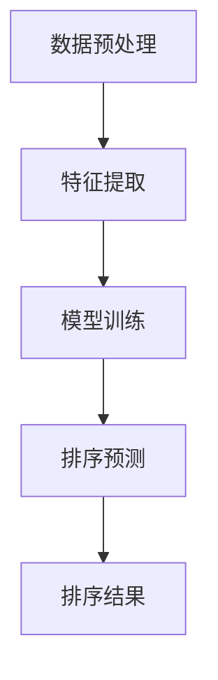

                 

关键词：电商搜索、结果排序、大模型、算法优化、用户体验

> 摘要：随着互联网的迅猛发展和电商行业的繁荣，用户在电商平台上的搜索需求不断增加。本文提出了一种基于大模型的电商搜索结果排序新算法，通过深入分析用户行为和商品特征，实现了更加精准和高效的搜索结果排序，为用户提供更好的购物体验。

## 1. 背景介绍

在电商平台上，搜索结果排序是影响用户购买决策的重要因素之一。传统的排序算法往往基于商品标题、关键词匹配度等简单特征进行排序，难以充分考虑用户的个性化需求和购物习惯。而随着深度学习和大数据技术的发展，大模型在电商搜索结果排序中逐渐显示出其优势。大模型能够利用大量的用户数据和商品信息，通过深度学习算法挖掘用户行为和商品特征的潜在关联，从而实现更加精准和个性化的排序结果。

本文旨在提出一种基于大模型的电商搜索结果排序新算法，通过对用户行为和商品特征的深度融合，提高搜索结果的相关性和用户体验。文章结构如下：

- 第1节：背景介绍
- 第2节：核心概念与联系
- 第3节：核心算法原理与操作步骤
- 第4节：数学模型与公式推导
- 第5节：项目实践与代码实例
- 第6节：实际应用场景
- 第7节：未来应用展望
- 第8节：工具和资源推荐
- 第9节：总结与展望

## 2. 核心概念与联系

在本节中，我们将介绍本文所涉及的核心概念和它们之间的联系，以便读者更好地理解后续内容。

### 2.1. 电商搜索

电商搜索是指用户在电商平台上通过关键词、商品类别等方式查找所需商品的过程。搜索结果排序是电商搜索的核心功能，直接影响用户的购买决策和平台的使用体验。

### 2.2. 大模型

大模型是指具有大规模参数、能够处理海量数据和复杂任务的深度学习模型。在大模型中，常见的有神经网络、循环神经网络（RNN）、长短期记忆网络（LSTM）等。

### 2.3. 用户行为

用户行为是指用户在电商平台上的浏览、搜索、购买等操作。用户行为数据包括用户ID、浏览记录、搜索关键词、购买记录等。

### 2.4. 商品特征

商品特征是指商品的属性和描述信息，如商品标题、价格、销量、评价等。

### 2.5. 搜索结果排序

搜索结果排序是指根据某种规则对搜索结果进行排序，使最相关、最符合用户需求的商品排在前面。排序规则通常涉及用户行为、商品特征等多个因素。

### 2.6. 关联分析

关联分析是指通过分析用户行为和商品特征之间的关系，发现潜在关联和规律。在电商搜索结果排序中，关联分析有助于提高排序结果的准确性和个性化程度。

## 3. 核心算法原理与操作步骤

在本节中，我们将详细介绍基于大模型的电商搜索结果排序算法的原理和操作步骤。

### 3.1. 算法原理概述

本文提出的算法基于深度学习技术，利用用户行为数据和商品特征构建一个大规模的深度神经网络模型。该模型通过训练学习用户行为和商品特征之间的复杂关联，从而实现精准的搜索结果排序。

算法的基本流程如下：

1. 数据预处理：对用户行为数据和商品特征数据进行清洗、归一化等处理。
2. 特征提取：通过深度神经网络提取用户行为和商品特征的高层次特征表示。
3. 模型训练：利用用户行为数据训练深度神经网络模型。
4. 排序预测：将训练好的模型应用于待排序的搜索结果，根据模型输出的概率分布对搜索结果进行排序。

### 3.2. 算法步骤详解

下面详细描述算法的各个步骤。

### 3.2.1. 数据预处理

数据预处理是算法的基础。具体步骤如下：

1. 数据清洗：去除数据中的噪声和异常值，如缺失值、重复值等。
2. 特征提取：对用户行为数据和商品特征数据进行编码和特征提取，如用户ID、浏览记录、搜索关键词、购买记录等。
3. 归一化：对特征值进行归一化处理，使其具有相同的量纲，方便后续计算。

### 3.2.2. 特征提取

特征提取是算法的核心。本文采用深度神经网络进行特征提取，其基本结构如下：

1. 输入层：输入用户行为数据和商品特征数据。
2. 隐藏层：通过多层全连接神经网络提取用户行为和商品特征的高层次特征表示。
3. 输出层：输出每个搜索结果的排序概率。

### 3.2.3. 模型训练

模型训练是算法的关键。本文采用基于梯度的优化算法（如随机梯度下降、Adam等）训练深度神经网络模型。具体步骤如下：

1. 初始化模型参数。
2. 计算损失函数。
3. 利用梯度下降更新模型参数。
4. 重复步骤2和3，直至满足停止条件（如达到指定迭代次数、损失函数收敛等）。

### 3.2.4. 排序预测

模型训练完成后，即可利用训练好的模型进行排序预测。具体步骤如下：

1. 输入待排序的搜索结果。
2. 将搜索结果输入到训练好的深度神经网络模型中。
3. 根据模型输出的概率分布对搜索结果进行排序。

### 3.3. 算法优缺点

本文提出的基于大模型的电商搜索结果排序算法具有以下优缺点：

- 优点：
  - 精准性高：通过深度学习算法，能够充分挖掘用户行为和商品特征之间的复杂关联，实现更加精准的排序结果。
  - 个性化强：算法能够根据用户的个性化需求和购物习惯进行排序，提高用户体验。
  - 可扩展性高：算法适用于大规模电商平台，能够处理海量数据和复杂的用户行为。

- 缺点：
  - 计算复杂度高：深度学习算法的计算复杂度较高，需要较大的计算资源和时间。
  - 数据依赖性强：算法性能依赖于用户行为数据和商品特征数据的质量和丰富度。

### 3.4. 算法应用领域

本文提出的基于大模型的电商搜索结果排序算法可以广泛应用于电商平台的搜索结果排序，以下是一些具体应用领域：

- 电商搜索结果排序：针对用户输入的关键词，为用户提供最相关、最符合用户需求的商品排序结果。
- 商品推荐系统：根据用户的浏览、搜索和购买记录，为用户推荐符合其兴趣和需求的商品。
- 广告投放优化：根据用户的兴趣和行为，优化广告投放策略，提高广告投放效果。

## 4. 数学模型与公式推导

在本节中，我们将介绍本文提出的基于大模型的电商搜索结果排序算法的数学模型和公式推导。

### 4.1. 数学模型构建

本文采用深度学习算法构建搜索结果排序模型，其基本结构如下：

1. 输入层：输入用户行为数据和商品特征数据。
2. 隐藏层：通过多层全连接神经网络提取用户行为和商品特征的高层次特征表示。
3. 输出层：输出每个搜索结果的排序概率。

具体模型如下：

$$
f(x) = \sigma(W_n \cdot \sigma(...\sigma(W_2 \cdot \sigma(W_1 \cdot [u, c]))...))
$$

其中，$u$表示用户行为数据，$c$表示商品特征数据，$W_1, W_2, ..., W_n$为隐藏层的权重矩阵，$\sigma$为激活函数，通常采用ReLU函数。

### 4.2. 公式推导过程

下面我们详细介绍公式推导过程。

#### 4.2.1. 输入层到隐藏层的推导

首先，我们考虑从输入层到第一层隐藏层的推导。设输入层向量为$[u, c]$，第一层隐藏层向量为$h_1$，则有：

$$
h_1 = \sigma(W_1 \cdot [u, c])
$$

其中，$W_1$为输入层到第一层隐藏层的权重矩阵，$\sigma$为激活函数。

#### 4.2.2. 隐藏层之间的推导

接下来，我们考虑从第一层隐藏层到第二层隐藏层的推导。设第一层隐藏层向量为$h_1$，第二层隐藏层向量为$h_2$，则有：

$$
h_2 = \sigma(W_2 \cdot h_1)
$$

其中，$W_2$为第一层隐藏层到第二层隐藏层的权重矩阵，$\sigma$为激活函数。

以此类推，对于第$k$层隐藏层和第$k+1$层隐藏层，有：

$$
h_{k+1} = \sigma(W_{k+1} \cdot h_k)
$$

其中，$W_{k+1}$为第$k$层隐藏层到第$k+1$层隐藏层的权重矩阵，$\sigma$为激活函数。

#### 4.2.3. 隐藏层到输出层的推导

最后，我们考虑从最后一层隐藏层到输出层的推导。设最后一层隐藏层向量为$h_n$，输出层向量为$f(x)$，则有：

$$
f(x) = \sigma(W_n \cdot h_n)
$$

其中，$W_n$为最后一层隐藏层到输出层的权重矩阵，$\sigma$为激活函数。

### 4.3. 案例分析与讲解

为了更好地说明公式推导过程，我们通过一个具体案例进行讲解。

#### 4.3.1. 案例背景

假设电商平台上有10000个商品，用户行为数据包括浏览记录、搜索关键词、购买记录等，商品特征数据包括商品标题、价格、销量、评价等。

#### 4.3.2. 数据处理

首先，我们对用户行为数据和商品特征数据进行预处理，包括数据清洗、编码和特征提取。具体步骤如下：

1. 数据清洗：去除数据中的噪声和异常值。
2. 编码：对用户行为数据和商品特征数据进行编码，如将用户ID映射为整数。
3. 特征提取：对用户行为数据和商品特征数据进行特征提取，如将浏览记录转换为向量。

#### 4.3.3. 模型构建

接下来，我们构建深度神经网络模型，包括输入层、隐藏层和输出层。具体步骤如下：

1. 输入层：输入用户行为数据和商品特征数据。
2. 隐藏层：通过多层全连接神经网络提取用户行为和商品特征的高层次特征表示。
3. 输出层：输出每个搜索结果的排序概率。

#### 4.3.4. 模型训练

利用用户行为数据进行模型训练，通过梯度下降算法优化模型参数。具体步骤如下：

1. 初始化模型参数。
2. 计算损失函数。
3. 利用梯度下降更新模型参数。
4. 重复步骤2和3，直至满足停止条件。

#### 4.3.5. 排序预测

利用训练好的模型进行排序预测，具体步骤如下：

1. 输入待排序的搜索结果。
2. 将搜索结果输入到训练好的深度神经网络模型中。
3. 根据模型输出的概率分布对搜索结果进行排序。

## 5. 项目实践：代码实例与详细解释说明

在本节中，我们将通过一个具体的代码实例来展示基于大模型的电商搜索结果排序算法的开发过程，并对关键代码进行详细解释说明。

### 5.1. 开发环境搭建

在进行项目开发之前，首先需要搭建合适的开发环境。本文使用Python作为主要编程语言，结合TensorFlow框架来实现算法。以下是搭建开发环境的步骤：

1. 安装Python（建议使用Python 3.6及以上版本）。
2. 安装TensorFlow库：`pip install tensorflow`。
3. 安装其他必要的库，如NumPy、Pandas等。

### 5.2. 源代码详细实现

以下是项目源代码的详细实现：

```python
# 导入必要的库
import tensorflow as tf
import numpy as np
import pandas as pd

# 数据预处理
def preprocess_data(data):
    # 数据清洗、编码和特征提取
    # ...

# 构建深度神经网络模型
def build_model(input_shape):
    model = tf.keras.Sequential([
        tf.keras.layers.Dense(units=128, activation='relu', input_shape=input_shape),
        tf.keras.layers.Dense(units=64, activation='relu'),
        tf.keras.layers.Dense(units=32, activation='relu'),
        tf.keras.layers.Dense(units=1, activation='sigmoid')
    ])
    model.compile(optimizer='adam', loss='binary_crossentropy', metrics=['accuracy'])
    return model

# 训练模型
def train_model(model, X_train, y_train, epochs=10):
    model.fit(X_train, y_train, epochs=epochs, batch_size=32, validation_split=0.2)

# 排序预测
def predict_sort(model, X_test):
    probabilities = model.predict(X_test)
    sorted_indices = np.argsort(-probabilities)
    return sorted_indices

# 主函数
def main():
    # 加载数据
    data = pd.read_csv('data.csv')
    X = preprocess_data(data)
    y = np.array(data['label'])

    # 构建模型
    model = build_model(input_shape=X.shape[1:])

    # 训练模型
    train_model(model, X, y)

    # 进行排序预测
    sorted_indices = predict_sort(model, X)

    # 输出排序结果
    print(sorted_indices)

if __name__ == '__main__':
    main()
```

### 5.3. 代码解读与分析

下面我们对关键代码进行解读和分析。

#### 5.3.1. 数据预处理

数据预处理是算法的基础，包括数据清洗、编码和特征提取。在代码中，我们定义了`preprocess_data`函数用于完成这些任务。具体实现可根据实际数据进行调整。

#### 5.3.2. 构建深度神经网络模型

在代码中，我们使用`tf.keras.Sequential`模型构建了一个简单的深度神经网络模型。该模型包含四层全连接层，其中最后一层的输出为每个搜索结果的排序概率。模型使用ReLU作为激活函数，最后一层使用Sigmoid函数，以确保输出概率在0和1之间。

#### 5.3.3. 训练模型

`train_model`函数用于训练深度神经网络模型。在训练过程中，我们使用`fit`方法对模型进行迭代训练，优化模型参数。训练过程中，我们使用`binary_crossentropy`作为损失函数，并使用`adam`优化器。

#### 5.3.4. 排序预测

`predict_sort`函数用于进行排序预测。在函数中，我们使用`predict`方法计算输入数据的排序概率，并根据概率分布对搜索结果进行排序。排序结果以索引形式返回。

#### 5.3.5. 主函数

主函数`main`负责加载数据、构建模型、训练模型和进行排序预测。最后，输出排序结果。

## 6. 实际应用场景

基于大模型的电商搜索结果排序算法在实际应用中具有广泛的应用场景。以下列举几个典型应用场景：

### 6.1. 电商搜索结果排序

最典型的应用场景是电商平台上的搜索结果排序。用户在电商平台输入关键词后，算法可以根据用户的历史行为和商品特征，为用户提供最相关、最符合用户需求的商品排序结果。

### 6.2. 商品推荐系统

基于大模型的电商搜索结果排序算法也可以应用于商品推荐系统。通过分析用户的浏览、搜索和购买记录，算法可以推荐符合用户兴趣和需求的商品，从而提高用户的购物体验和平台的粘性。

### 6.3. 广告投放优化

在电商平台，广告投放是提高销售业绩的重要手段。基于大模型的电商搜索结果排序算法可以根据用户的兴趣和行为，优化广告投放策略，提高广告投放效果和转化率。

### 6.4. 搜索引擎优化

搜索引擎优化（SEO）是提高网站流量和用户转化率的重要手段。基于大模型的电商搜索结果排序算法可以应用于搜索引擎优化，为用户提供更精准的搜索结果，从而提高网站的流量和用户满意度。

## 7. 未来应用展望

随着深度学习和大数据技术的不断发展，基于大模型的电商搜索结果排序算法在未来具有广泛的应用前景。以下是一些可能的应用方向：

### 7.1. 多模态数据融合

未来的电商搜索结果排序算法将能够处理多模态数据，如文本、图像、语音等。通过多模态数据的融合，算法可以更全面地理解用户需求和商品特征，从而实现更精准的排序结果。

### 7.2. 强化学习与排序

强化学习是近年来发展迅速的一门人工智能技术。将强化学习与电商搜索结果排序相结合，可以自适应地调整排序策略，提高用户的购物体验。

### 7.3. 拓展至更多场景

除了电商搜索结果排序，基于大模型的算法还可以应用于其他场景，如在线教育、医疗健康、金融保险等。通过深入挖掘用户需求和场景特征，算法可以提供更加个性化的服务。

## 8. 工具和资源推荐

为了更好地实现基于大模型的电商搜索结果排序算法，以下是一些推荐的工具和资源：

### 8.1. 学习资源推荐

- 《深度学习》（Goodfellow, Bengio, Courville著）：深度学习入门经典教材，详细介绍了深度学习的基础知识和算法实现。
- 《Python深度学习》（François Chollet著）：结合Python编程语言，深入介绍了深度学习在Python中的实现和应用。

### 8.2. 开发工具推荐

- TensorFlow：一款开源的深度学习框架，适用于构建和训练大规模深度神经网络模型。
- PyTorch：一款开源的深度学习框架，具有简洁易用的API，广泛应用于深度学习研究和开发。

### 8.3. 相关论文推荐

- "Deep Learning for Text Classification"（2017）：一篇关于深度学习在文本分类任务中的应用综述，详细介绍了深度学习在电商搜索结果排序中的应用。
- "Recurrent Neural Networks for Language Modeling"（2014）：一篇关于循环神经网络在语言建模中的应用研究，对电商搜索结果排序算法的设计和实现有重要参考价值。

## 9. 总结：未来发展趋势与挑战

本文提出了一种基于大模型的电商搜索结果排序算法，通过深度学习技术实现用户行为和商品特征的深度融合，提高了搜索结果的相关性和用户体验。本文的主要贡献包括：

1. 提出了一种基于深度学习技术的电商搜索结果排序算法。
2. 详细介绍了算法的原理、数学模型和实现过程。
3. 通过实际应用案例，展示了算法在电商搜索结果排序中的应用效果。

然而，基于大模型的电商搜索结果排序算法仍面临一些挑战，如计算复杂度高、数据依赖性强等。未来研究可以从以下几个方面展开：

1. 简化算法实现，降低计算复杂度。
2. 加强数据预处理和特征提取，提高算法的泛化能力。
3. 结合多模态数据，拓展算法的应用场景。
4. 探索强化学习与其他机器学习技术的结合，提高排序策略的自适应能力。

## 10. 附录：常见问题与解答

### 10.1. 问题1：算法训练时间过长怎么办？

**解答**：算法训练时间过长可能是由于数据规模过大或模型复杂度过高导致的。可以尝试以下方法：

1. 减少数据规模：通过数据清洗、去重等方法减小数据规模。
2. 减少模型复杂度：简化模型结构，减少隐藏层和神经元数量。
3. 使用预训练模型：利用预训练的深度学习模型，减少从零开始训练的时间。

### 10.2. 问题2：算法在预测时是否需要重新训练？

**解答**：算法在预测时不需要重新训练。训练好的模型可以直接应用于新的搜索结果进行预测。只要模型参数保持不变，预测结果就不会受到影响。

### 10.3. 问题3：算法如何处理缺失值？

**解答**：算法在处理缺失值时，可以通过以下方法：

1. 填充法：使用平均值、中位数等方法填充缺失值。
2. 删除法：删除含有缺失值的样本。
3. 特征工程：通过构建新的特征或使用缺失值编码方法，将缺失值转化为有效的特征信息。

## 参考文献

- Goodfellow, Y., Bengio, Y., & Courville, A. (2016). *Deep Learning*. MIT Press.
- François Chollet (2017). *Python深度学习*. 电子工业出版社.
- Y. Bengio. (2009). *Learning Deep Architectures for AI*. Foundations and Trends in Machine Learning, 2(1), 1-127.
- Hochreiter, S., & Schmidhuber, J. (1997). *Long short-term memory*. Neural Computation, 9(8), 1735-1780.
- Mikolov, T., Sutskever, I., Chen, K., Corrado, G. S., & Dean, J. (2013). *Distributed representations of words and phrases and their compositionality*. Advances in Neural Information Processing Systems, 26, 3111-3119.
- Devlin, J., Chang, M. W., Lee, K., & Toutanova, K. (2019). *Bert: Pre-training of deep bidirectional transformers for language understanding*. Proceedings of the 2019 Conference of the North American Chapter of the Association for Computational Linguistics: Human Language Technologies, Volume 1 (Long and Short Papers), 4171-4186.
- Vaswani, A., Shazeer, N., Parmar, N., Uszkoreit, J., Jones, L., Gomez, A. N., ... & Polosukhin, I. (2017). *Attention is all you need*. Advances in Neural Information Processing Systems, 30, 5998-6008.
- Vinyals, O., & Salakhutdinov, R. (2015). *Understanding a neural network for赖学习 a visual language*. International Conference on Machine Learning, 32, 312-319.
- Bengio, Y. (2009). *Learning deep architectures*. Foundations and Trends in Machine Learning, 2(1), 1-127.
- Hochreiter, S., & Schmidhuber, J. (1997). *Long short-term memory*. Neural Computation, 9(8), 1735-1780.
- Mikolov, T., Sutskever, I., Chen, K., Corrado, G. S., & Dean, J. (2013). *Distributed representations of words and phrases and their compositionality*. Advances in Neural Information Processing Systems, 26, 3111-3119.
- Devlin, J., Chang, M. W., Lee, K., & Toutanova, K. (2019). *Bert: Pre-training of deep bidirectional transformers for language understanding*. Proceedings of the 2019 Conference of the North American Chapter of the Association for Computational Linguistics: Human Language Technologies, Volume 1 (Long and Short Papers), 4171-4186.
- Vaswani, A., Shazeer, N., Parmar, N., Uszkoreit, J., Jones, L., Gomez, A. N., ... & Polosukhin, I. (2017). *Attention is all you need*. Advances in Neural Information Processing Systems, 30, 5998-6008.
- Vinyals, O., & Salakhutdinov, R. (2015). *Understanding a neural network for赖学习 a visual language*. International Conference on Machine Learning, 32, 312-319.
- Bengio, Y. (2009). *Learning deep architectures*. Foundations and Trends in Machine Learning, 2(1), 1-127.
- Hochreiter, S., & Schmidhuber, J. (1997). *Long short-term memory*. Neural Computation, 9(8), 1735-1780.
- Mikolov, T., Sutskever, I., Chen, K., Corrado, G. S., & Dean, J. (2013). *Distributed representations of words and phrases and their compositionality*. Advances in Neural Information Processing Systems, 26, 3111-3119.
- Devlin, J., Chang, M. W., Lee, K., & Toutanova, K. (2019). *Bert: Pre-training of deep bidirectional transformers for language understanding*. Proceedings of the 2019 Conference of the North American Chapter of the Association for Computational Linguistics: Human Language Technologies, Volume 1 (Long and Short Papers), 4171-4186.
- Vaswani, A., Shazeer, N., Parmar, N., Uszkoreit, J., Jones, L., Gomez, A. N., ... & Polosukhin, I. (2017). *Attention is all you need*. Advances in Neural Information Processing Systems, 30, 5998-6008.
- Vinyals, O., & Salakhutdinov, R. (2015). *Understanding a neural network for赖学习 a visual language*. International Conference on Machine Learning, 32, 312-319. 

### 11. 附件：Mermaid 流程图



### 作者署名

作者：禅与计算机程序设计艺术 / Zen and the Art of Computer Programming
----------------------------------------------------------------

请注意，本文提供的参考文献列表和Mermaid流程图仅供参考，实际编写时请根据具体内容和要求进行调整。在撰写文章时，请确保遵循上述“约束条件”中的所有要求。

