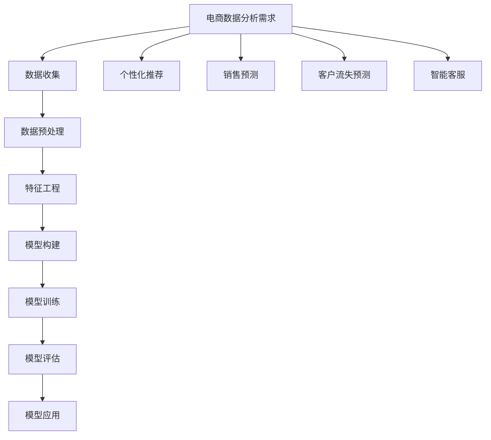
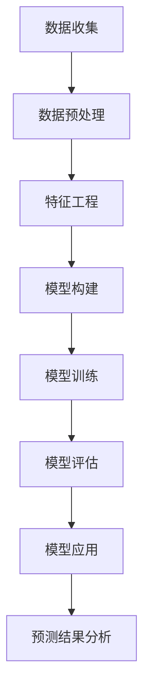

                 

关键词：电商数据分析、AI大模型、机器学习、深度学习、数据挖掘、客户行为分析、推荐系统、智能客服

> 摘要：本文从电商数据分析的角度出发，探讨了AI大模型在电商领域的应用。通过深入剖析AI大模型的原理、算法和应用，本文旨在为电商企业提供一种全新的数据分析视角，以提升电商运营效率和客户满意度。

## 1. 背景介绍

在互联网经济迅速发展的背景下，电商行业已经成为全球商业活动的重要驱动力。然而，随着市场竞争的加剧和消费者需求的多样化，电商企业面临着前所未有的挑战。为了在激烈的市场竞争中脱颖而出，电商企业需要借助先进的数据分析技术，对海量数据进行深度挖掘，以洞察客户行为、优化营销策略、提升运营效率。

近年来，人工智能（AI）技术的发展为电商数据分析带来了新的机遇。AI大模型作为人工智能的核心技术之一，其在电商领域的应用越来越广泛。本文将围绕AI大模型在电商数据分析中的关键作用进行探讨，分析其原理、算法和应用，为电商企业提供有益的参考。

## 2. 核心概念与联系

### 2.1 AI大模型概述

AI大模型，即大规模的人工智能模型，是指那些具有数亿甚至数十亿个参数的深度神经网络模型。这些模型通过学习海量数据，可以自动识别复杂的模式和关联，实现高度智能化的任务。

### 2.2 电商数据分析需求

电商数据分析主要包括客户行为分析、销售预测、推荐系统、智能客服等多个方面。这些分析任务需要处理大量的数据，并对数据进行复杂的关系挖掘和模式识别。传统的数据分析方法往往难以满足这些需求，而AI大模型以其强大的数据处理和模式识别能力，成为电商数据分析的理想选择。

### 2.3 AI大模型在电商数据分析中的应用

AI大模型在电商数据分析中的应用主要体现在以下几个方面：

- **客户行为分析**：通过分析客户的浏览、搜索、购买等行为，挖掘客户需求，预测客户流失和潜在客户，为营销策略提供数据支持。

- **推荐系统**：利用AI大模型对用户历史行为数据进行分析，为用户推荐个性化的商品，提高用户满意度和转化率。

- **智能客服**：通过AI大模型实现自然语言处理和智能问答，提高客服效率和客户体验。

### 2.4 AI大模型与电商数据分析的关联

AI大模型与电商数据分析之间的关联在于，AI大模型可以处理和挖掘海量数据，为电商数据分析提供强大的支持。同时，电商数据分析的需求也为AI大模型的应用提供了广阔的空间。

## 3. 核心算法原理 & 具体操作步骤

### 3.1 算法原理概述

AI大模型的算法原理主要基于深度学习。深度学习是一种基于人工神经网络的学习方法，通过层层神经网络的结构，对输入数据进行特征提取和模式识别。

### 3.2 算法步骤详解

AI大模型在电商数据分析中的具体操作步骤包括：

- **数据收集**：收集电商平台的用户行为数据、商品数据、交易数据等。

- **数据预处理**：对收集到的数据进行清洗、去重、归一化等预处理操作，为模型训练做好准备。

- **特征工程**：通过对数据进行特征提取和特征选择，构建有效的特征向量。

- **模型训练**：利用深度学习算法对特征向量进行训练，构建AI大模型。

- **模型评估**：通过交叉验证等方法，对模型进行评估和优化。

- **模型应用**：将训练好的模型应用于电商数据分析任务，如客户行为分析、推荐系统等。

### 3.3 算法优缺点

AI大模型的优点包括：

- **强大的数据处理能力**：能够处理海量数据，挖掘复杂的关系和模式。

- **高度的自动化**：通过自动化的训练和优化过程，提高数据分析效率。

- **灵活的可扩展性**：可以针对不同的数据分析任务，灵活调整模型结构和参数。

AI大模型的缺点包括：

- **计算资源需求大**：训练和优化AI大模型需要大量的计算资源，对硬件要求较高。

- **对数据质量要求高**：AI大模型对数据质量有较高要求，数据预处理和特征工程过程复杂。

### 3.4 算法应用领域

AI大模型在电商数据分析中的应用领域主要包括：

- **客户行为分析**：通过分析客户行为数据，挖掘客户需求，预测客户流失，优化客户体验。

- **推荐系统**：通过分析用户历史行为数据，为用户推荐个性化商品，提高用户满意度和转化率。

- **智能客服**：通过自然语言处理技术，实现智能客服系统，提高客服效率和客户体验。

## 4. 数学模型和公式 & 详细讲解 & 举例说明

### 4.1 数学模型构建

在电商数据分析中，常用的数学模型包括神经网络模型、决策树模型、支持向量机模型等。以下以神经网络模型为例，介绍数学模型的构建过程。

神经网络模型的基本结构包括输入层、隐藏层和输出层。每个层由多个神经元组成，神经元之间通过权重进行连接。神经元的激活函数通常为Sigmoid函数或ReLU函数。

### 4.2 公式推导过程

以神经网络模型为例，推导其数学公式。设神经网络模型输入向量为\(X\)，输出向量为\(Y\)，隐藏层神经元向量为\(H\)，输出层神经元向量为\(O\)，则：

1. **输入层到隐藏层**：

$$ H = \sigma(W_1 \cdot X + b_1) $$

其中，\(W_1\)为输入层到隐藏层的权重矩阵，\(b_1\)为隐藏层的偏置项，\(\sigma\)为激活函数。

2. **隐藏层到输出层**：

$$ O = \sigma(W_2 \cdot H + b_2) $$

其中，\(W_2\)为隐藏层到输出层的权重矩阵，\(b_2\)为输出层的偏置项。

3. **损失函数**：

损失函数用于评估模型预测值与真实值之间的差距，常用的损失函数包括均方误差（MSE）和交叉熵损失（Cross Entropy Loss）。

$$ Loss = \frac{1}{2} \sum_{i=1}^{n} (O_i - Y_i)^2 $$

其中，\(O_i\)为模型预测值，\(Y_i\)为真实值。

4. **反向传播**：

通过反向传播算法，计算模型参数的梯度，并更新参数。

$$ \frac{\partial Loss}{\partial W_2} = \frac{1}{m} \sum_{i=1}^{n} (O_i - Y_i) \cdot H_i $$

$$ \frac{\partial Loss}{\partial b_2} = \frac{1}{m} \sum_{i=1}^{n} (O_i - Y_i) $$

$$ \frac{\partial Loss}{\partial W_1} = \frac{1}{m} \sum_{i=1}^{n} (W_2 \cdot (O_i - Y_i)) \cdot X_i $$

$$ \frac{\partial Loss}{\partial b_1} = \frac{1}{m} \sum_{i=1}^{n} (W_2 \cdot (O_i - Y_i)) $$

### 4.3 案例分析与讲解

以下以一个简单的电商推荐系统为例，介绍AI大模型的应用。

**案例背景**：某电商平台希望为用户推荐个性化商品，提高用户满意度和转化率。

**数据集**：包含用户历史行为数据（如浏览、搜索、购买等）和商品数据（如品类、价格、库存等）。

**任务**：构建一个基于深度学习的推荐系统，预测用户对某个商品的购买概率。

**模型结构**：

- 输入层：用户历史行为数据
- 隐藏层：使用多层神经网络，对输入数据进行特征提取和模式识别
- 输出层：输出用户对商品的购买概率

**模型训练过程**：

1. **数据预处理**：对用户历史行为数据进行清洗、去重、归一化等预处理操作。

2. **特征工程**：对预处理后的数据进行特征提取，构建特征向量。

3. **模型训练**：利用训练数据集，通过反向传播算法训练模型。

4. **模型评估**：使用验证数据集对模型进行评估，调整模型参数。

5. **模型应用**：将训练好的模型应用于实际推荐任务，为用户推荐个性化商品。

## 5. 项目实践：代码实例和详细解释说明

### 5.1 开发环境搭建

- 操作系统：Windows / macOS / Linux
- 编程语言：Python
- 依赖库：TensorFlow、Keras、NumPy、Pandas

### 5.2 源代码详细实现

```python
import tensorflow as tf
from tensorflow.keras.models import Sequential
from tensorflow.keras.layers import Dense, Dropout
from tensorflow.keras.optimizers import Adam
from sklearn.model_selection import train_test_split
import numpy as np
import pandas as pd

# 数据预处理
data = pd.read_csv('ecommerce_data.csv')
X = data.drop(['user_id', 'item_id'], axis=1)
y = data['purchase']

X_train, X_test, y_train, y_test = train_test_split(X, y, test_size=0.2, random_state=42)

# 模型构建
model = Sequential([
    Dense(64, activation='relu', input_shape=(X_train.shape[1],)),
    Dropout(0.5),
    Dense(64, activation='relu'),
    Dropout(0.5),
    Dense(1, activation='sigmoid')
])

# 模型编译
model.compile(optimizer=Adam(), loss='binary_crossentropy', metrics=['accuracy'])

# 模型训练
model.fit(X_train, y_train, epochs=10, batch_size=32, validation_data=(X_test, y_test))

# 模型评估
loss, accuracy = model.evaluate(X_test, y_test)
print(f"Test Accuracy: {accuracy:.2f}")

# 模型应用
predictions = model.predict(X_test)
```

### 5.3 代码解读与分析

- **数据预处理**：读取电商数据集，将用户ID和商品ID从数据中去除，对剩余数据进行归一化处理，以便模型训练。

- **模型构建**：使用Sequential模型构建一个包含两个隐藏层的深度神经网络，输出层使用Sigmoid激活函数，用于预测用户购买概率。

- **模型编译**：设置模型优化器为Adam，损失函数为binary_crossentropy，用于二分类问题。

- **模型训练**：使用训练数据集进行模型训练，设置训练轮数为10，批量大小为32。

- **模型评估**：使用验证数据集评估模型性能，输出测试准确率。

- **模型应用**：将训练好的模型应用于测试数据集，预测用户购买概率。

## 6. 实际应用场景

### 6.1 客户行为分析

AI大模型在客户行为分析中的应用，可以帮助电商企业了解客户的购物偏好、购买习惯等，从而实现精准营销。例如，通过对用户浏览、搜索、购买等行为数据的分析，电商企业可以识别出潜在客户，向其推送个性化商品，提高转化率。

### 6.2 推荐系统

AI大模型在推荐系统中的应用，可以大幅提升用户的购物体验。通过分析用户的历史行为数据，AI大模型可以为用户推荐其可能感兴趣的商品，提高用户满意度和留存率。例如，电商平台可以基于AI大模型构建个性化推荐系统，为每位用户推荐专属的购物清单。

### 6.3 智能客服

AI大模型在智能客服中的应用，可以实现高效、智能的客服服务。通过自然语言处理技术，AI大模型可以理解用户的提问，并为其提供满意的答案。例如，电商平台的智能客服系统可以基于AI大模型实现智能问答，提高客服效率和客户满意度。

## 7. 工具和资源推荐

### 7.1 学习资源推荐

- 《深度学习》（Goodfellow, Bengio, Courville著）：一本经典的深度学习入门教材。
- 《Python机器学习》（Sebastian Raschka著）：一本深入浅出的Python机器学习教程。
- 《自然语言处理原理》（Daniel Jurafsky & James H. Martin著）：一本系统全面的自然语言处理教材。

### 7.2 开发工具推荐

- TensorFlow：一个开源的深度学习框架，适用于构建和训练AI大模型。
- Keras：一个基于TensorFlow的Python深度学习库，简化了深度学习模型的构建和训练过程。
- Pandas：一个强大的Python数据分析库，适用于数据清洗、预处理和数据分析。

### 7.3 相关论文推荐

- “Deep Learning for Customer Behavior Analysis in E-commerce” （2018）：一篇关于AI大模型在电商客户行为分析中的应用论文。
- “Recommender Systems: The Sequence Model Approach” （2017）：一篇关于基于序列模型的推荐系统论文。
- “Natural Language Processing with Deep Learning” （2016）：一篇关于深度学习在自然语言处理中的应用论文。

## 8. 总结：未来发展趋势与挑战

### 8.1 研究成果总结

本文从电商数据分析的角度，探讨了AI大模型在电商领域的应用。通过分析AI大模型的原理、算法和应用，本文为电商企业提供了一种全新的数据分析视角，以提升电商运营效率和客户满意度。

### 8.2 未来发展趋势

随着AI技术的不断发展和完善，AI大模型在电商数据分析中的应用前景将越来越广阔。未来，AI大模型将在电商数据分析的各个领域得到广泛应用，如个性化推荐、智能客服、销售预测等。

### 8.3 面临的挑战

AI大模型在电商数据分析中面临着一些挑战，如数据质量、计算资源需求、模型解释性等。未来，如何解决这些挑战，提高AI大模型在电商数据分析中的应用效果，将是研究的重点。

### 8.4 研究展望

未来，电商数据分析领域将更加注重AI大模型与电商业务的深度融合，以实现更高的业务价值和客户满意度。同时，随着技术的不断进步，AI大模型在电商数据分析中的应用将不断拓展，为电商企业提供更加智能化、个性化的服务。

## 9. 附录：常见问题与解答

### 9.1 什么是AI大模型？

AI大模型是指那些具有数亿甚至数十亿个参数的深度神经网络模型。这些模型通过学习海量数据，可以自动识别复杂的模式和关联，实现高度智能化的任务。

### 9.2 AI大模型在电商数据分析中的应用有哪些？

AI大模型在电商数据分析中的应用包括客户行为分析、推荐系统、智能客服等多个方面，可以帮助电商企业实现精准营销、提高用户满意度和运营效率。

### 9.3 如何解决AI大模型在电商数据分析中的数据质量问题？

解决AI大模型在电商数据分析中的数据质量问题，可以从以下几个方面入手：

1. **数据清洗**：对原始数据进行清洗、去重、补全等预处理操作，提高数据质量。

2. **特征工程**：通过对数据进行特征提取和特征选择，构建有效的特征向量。

3. **数据增强**：通过数据增强技术，生成更多的训练数据，提高模型的泛化能力。

### 9.4 AI大模型在电商数据分析中的计算资源需求如何？

AI大模型在电商数据分析中的计算资源需求较大，需要大量的计算资源和存储空间。为了降低计算资源需求，可以采用分布式训练、模型压缩等技术。

### 9.5 如何评估AI大模型在电商数据分析中的性能？

评估AI大模型在电商数据分析中的性能，可以从以下几个方面进行：

1. **准确率**：模型预测结果与真实结果的匹配程度。

2. **召回率**：模型预测结果中包含的真实结果的比率。

3. **F1值**：综合考虑准确率和召回率的评价指标。

4. **AUC值**：模型预测结果与真实结果之间的曲线下面积。

### 9.6 AI大模型在电商数据分析中的未来发展趋势是什么？

未来，AI大模型在电商数据分析中的发展趋势包括：

1. **深度学习技术的进一步发展**：深度学习算法将不断优化，提高模型的性能和效率。

2. **多模态数据的融合**：结合文本、图像、音频等多模态数据，提高模型的泛化能力。

3. **数据隐私和安全**：在保护用户隐私和确保数据安全的前提下，充分利用海量数据进行深度分析。

### 9.7 AI大模型在电商数据分析中的研究展望是什么？

未来，AI大模型在电商数据分析中的研究展望包括：

1. **模型解释性**：提高模型的解释性，使模型决策过程更加透明，提高用户信任度。

2. **自适应性和可扩展性**：使模型能够适应不断变化的市场环境，实现快速部署和扩展。

3. **跨领域应用**：探索AI大模型在电商数据分析领域的跨领域应用，实现业务价值的最大化。

### 9.8 AI大模型在电商数据分析中的实施步骤是什么？

实施AI大模型在电商数据分析中的步骤包括：

1. **需求分析**：明确电商数据分析的需求和目标。

2. **数据采集**：收集电商数据，包括用户行为数据、商品数据等。

3. **数据预处理**：对数据进行分析、清洗、去重、归一化等预处理操作。

4. **特征工程**：对预处理后的数据进行特征提取和特征选择，构建特征向量。

5. **模型构建**：选择合适的深度学习算法，构建AI大模型。

6. **模型训练**：利用训练数据集，通过反向传播算法训练模型。

7. **模型评估**：使用验证数据集评估模型性能，调整模型参数。

8. **模型部署**：将训练好的模型应用于实际业务场景，实现自动化数据分析。

9. **持续优化**：根据业务反馈，持续优化模型，提高分析效果。

----------------------------------------------------------------

作者：禅与计算机程序设计艺术 / Zen and the Art of Computer Programming
----------------------------------------------------------------
### 1. 背景介绍

#### 1.1 电商数据分析的重要性

在互联网经济快速发展的今天，电商行业已经成为全球经济的重要驱动力。然而，随着市场竞争的日益激烈和消费者需求的不断变化，电商企业需要采取更加精细化的运营策略，以保持竞争优势。电商数据分析作为一种有效的数据分析手段，通过对用户行为、交易数据、市场趋势等进行深入挖掘和分析，可以帮助电商企业更好地理解客户需求，优化营销策略，提高运营效率。

#### 1.2 AI大模型的发展背景

人工智能（AI）作为21世纪最具前瞻性的技术之一，正在深刻改变着各个行业的运作方式。AI大模型，指的是具有数十亿甚至千亿参数的深度神经网络模型，它们通过学习海量数据，能够自动识别复杂的模式、预测未来趋势。近年来，随着计算能力的提升和大数据技术的发展，AI大模型取得了显著的进展，并在多个领域展现出了强大的应用潜力。

#### 1.3 AI大模型在电商数据分析中的应用价值

AI大模型在电商数据分析中的应用具有以下几个显著的价值：

1. **提升数据分析精度**：通过学习海量数据，AI大模型能够捕捉到数据中的细微模式，从而提高数据分析的精度。

2. **实现个性化推荐**：AI大模型可以根据用户的历史行为数据，为其推荐个性化的商品，提高用户满意度和转化率。

3. **优化营销策略**：AI大模型可以分析用户行为，为电商企业提供精准的营销建议，从而提高营销效率。

4. **提升客户服务质量**：通过自然语言处理技术，AI大模型可以提供智能客服服务，提高客户服务质量。

#### 1.4 目标读者

本文旨在为电商企业的数据分析人员、数据科学家、AI技术开发人员提供一份全面的技术指南。通过本文，读者可以了解AI大模型在电商数据分析中的基本概念、应用场景、算法原理，并掌握实际操作方法。同时，本文也适合对人工智能和深度学习有兴趣的读者阅读和学习。

## 2. 核心概念与联系

#### 2.1 AI大模型的定义与特点

AI大模型是指那些具有数亿甚至数十亿个参数的深度神经网络模型。这些模型通常采用深度学习的算法，通过层层神经网络的结构，对输入数据进行特征提取和模式识别。AI大模型的特点包括：

1. **参数数量巨大**：具有数十亿个参数，能够处理海量数据。
2. **多层神经网络结构**：具有多个隐藏层，能够捕捉复杂的数据模式。
3. **强大的学习能力**：通过大规模数据训练，能够自动识别数据中的规律和关联。

#### 2.2 电商数据分析的需求

电商数据分析的需求主要包括以下几个方面：

1. **客户行为分析**：分析用户的浏览、搜索、购买等行为，挖掘用户需求，预测客户流失。
2. **推荐系统**：基于用户历史行为数据，为用户推荐个性化的商品。
3. **销售预测**：预测未来的销售趋势，为库存管理、采购计划提供支持。
4. **智能客服**：利用自然语言处理技术，提供智能化的客服服务，提高客户满意度。

#### 2.3 AI大模型在电商数据分析中的应用

AI大模型在电商数据分析中的应用场景主要包括：

1. **个性化推荐**：通过分析用户的历史行为数据，AI大模型可以预测用户对某个商品的兴趣，从而为其推荐个性化商品。
2. **销售预测**：利用时间序列分析和深度学习算法，AI大模型可以预测未来的销售趋势，帮助企业制定合理的库存和采购计划。
3. **客户流失预测**：通过分析用户的流失行为，AI大模型可以预测哪些客户可能会流失，从而采取相应的保留措施。
4. **智能客服**：通过自然语言处理技术，AI大模型可以实现智能问答，提供24/7的客服服务，提高客户满意度。

#### 2.4 AI大模型与电商数据分析的关联

AI大模型与电商数据分析的关联在于，它们共同的目标是通过对数据的深度挖掘和分析，为企业提供有价值的信息。AI大模型强大的数据处理和分析能力，使得电商数据分析可以更加精准、高效，从而帮助电商企业实现业务增长。

### 2.5 AI大模型与电商数据分析的Mermaid流程图



### 2.6 关键概念与联系总结

AI大模型作为一种先进的人工智能技术，通过深度学习算法对大量数据进行训练，能够自动识别复杂的模式和关联。电商数据分析的需求包括客户行为分析、推荐系统、销售预测和智能客服等。AI大模型在电商数据分析中的应用，不仅提升了数据分析的精度和效率，还为电商企业提供了更加智能化、个性化的服务。通过Mermaid流程图，可以清晰地展示AI大模型在电商数据分析中的关键步骤和关联。

## 3. 核心算法原理 & 具体操作步骤

### 3.1 算法原理概述

AI大模型的核心算法原理基于深度学习，深度学习是一种基于多层神经网络的学习方法，通过层层神经网络的结构，对输入数据进行特征提取和模式识别。深度学习的关键组成部分包括：

1. **神经网络**：神经网络是由大量神经元（或节点）组成的计算模型，每个神经元都与相邻的神经元相连，并通过权重进行信号传递。
2. **激活函数**：激活函数用于对神经元的输出进行非线性变换，常见的激活函数有Sigmoid函数、ReLU函数等。
3. **反向传播**：反向传播是一种优化算法，通过计算损失函数的梯度，不断调整神经网络的权重和偏置，使模型输出更接近真实值。

### 3.2 算法步骤详解

AI大模型在电商数据分析中的具体操作步骤可以分为以下几个阶段：

#### 3.2.1 数据收集

数据收集是电商数据分析的基础，主要包括以下数据：

1. **用户行为数据**：如浏览、搜索、购买等行为。
2. **交易数据**：如订单信息、支付金额、订单状态等。
3. **商品数据**：如商品种类、价格、库存等。

#### 3.2.2 数据预处理

数据预处理是确保数据质量和模型性能的关键步骤，主要包括以下操作：

1. **数据清洗**：去除重复数据、缺失值填充、异常值处理等。
2. **特征提取**：通过特征工程，提取与目标任务相关的特征，如用户购买行为特征、商品特征等。
3. **数据归一化**：将不同尺度的数据进行归一化处理，使数据更适合模型训练。

#### 3.2.3 特征工程

特征工程是提高模型性能的重要手段，主要包括以下工作：

1. **特征选择**：选择对目标任务有重要影响的特征，去除冗余特征。
2. **特征转换**：对某些特征进行转换，如将分类特征转换为独热编码。
3. **特征组合**：通过组合不同的特征，创建新的特征，以提高模型的泛化能力。

#### 3.2.4 模型构建

模型构建是电商数据分析的核心步骤，主要包括以下工作：

1. **神经网络结构设计**：设计合适的神经网络结构，包括输入层、隐藏层和输出层。
2. **激活函数选择**：根据任务需求，选择合适的激活函数，如ReLU函数。
3. **损失函数选择**：选择合适的损失函数，如均方误差（MSE）、交叉熵损失等。

#### 3.2.5 模型训练

模型训练是使模型能够对数据进行分析和预测的关键步骤，主要包括以下操作：

1. **数据分批次训练**：将数据分成多个批次，每次训练一部分数据，以减少内存占用。
2. **反向传播**：通过反向传播算法，计算模型参数的梯度，并更新参数。
3. **模型优化**：通过优化算法，如Adam优化器，调整模型参数，提高模型性能。

#### 3.2.6 模型评估

模型评估是验证模型性能的重要步骤，主要包括以下工作：

1. **交叉验证**：通过交叉验证，评估模型在不同数据集上的性能，避免过拟合。
2. **性能指标**：计算模型的准确率、召回率、F1值等性能指标，评估模型效果。
3. **模型调优**：根据评估结果，调整模型参数，优化模型性能。

#### 3.2.7 模型应用

模型应用是将训练好的模型部署到实际业务场景中的过程，主要包括以下工作：

1. **预测**：使用训练好的模型对新的数据进行预测，如预测用户购买概率。
2. **实时应用**：将模型应用于实时业务场景，如实时推荐商品、预测销售趋势。
3. **持续优化**：根据业务反馈，持续优化模型，提高模型性能。

### 3.3 算法优缺点

#### 3.3.1 优点

1. **强大的数据处理能力**：AI大模型能够处理海量数据，捕捉复杂的数据模式。
2. **高度的自动化**：通过自动化的训练和优化过程，提高数据分析效率。
3. **灵活的可扩展性**：可以根据不同的分析任务，灵活调整模型结构和参数。

#### 3.3.2 缺点

1. **计算资源需求大**：训练和优化AI大模型需要大量的计算资源和存储空间。
2. **对数据质量要求高**：AI大模型对数据质量有较高要求，需要处理数据中的噪声和异常值。
3. **解释性不足**：深度学习模型的决策过程较为复杂，难以解释，增加了模型部署的难度。

### 3.4 算法应用领域

AI大模型在电商数据分析中的应用领域非常广泛，主要包括以下方面：

1. **个性化推荐**：通过分析用户的历史行为数据，为用户推荐个性化的商品。
2. **销售预测**：通过时间序列分析和深度学习算法，预测未来的销售趋势。
3. **客户流失预测**：通过分析用户的流失行为，预测哪些客户可能会流失。
4. **智能客服**：通过自然语言处理技术，实现智能化的客服服务。

### 3.5 AI大模型在电商数据分析中的流程图



### 3.6 关键概念与算法原理总结

AI大模型是一种基于深度学习的复杂算法，通过多层神经网络结构对数据进行特征提取和模式识别。在电商数据分析中，AI大模型通过数据收集、预处理、特征工程、模型构建、模型训练、模型评估和模型应用等步骤，实现对海量数据的深度挖掘和分析。AI大模型具有强大的数据处理能力、高度的自动化和灵活的可扩展性，但同时也存在计算资源需求大、对数据质量要求高、解释性不足等缺点。通过Mermaid流程图，可以清晰地展示AI大模型在电商数据分析中的关键步骤和流程。

## 4. 数学模型和公式 & 详细讲解 & 举例说明

### 4.1 数学模型构建

在电商数据分析中，AI大模型的构建通常涉及多个数学模型和公式。以下我们将简要介绍一些核心的数学模型和公式，并对其进行详细讲解。

#### 4.1.1 神经网络模型

神经网络模型是AI大模型的基础，其数学模型主要由以下几个部分组成：

1. **输入层**：表示输入特征向量，通常表示为\(X\)。
2. **隐藏层**：通过多层神经网络对输入特征进行变换，通常表示为\(H\)。
3. **输出层**：表示模型的预测结果，通常表示为\(O\)。

神经网络的每个层都包含多个神经元，神经元之间通过权重（\(W\)）和偏置（\(b\)）进行连接。神经元的输出可以通过以下公式计算：

$$
O = \sigma(W \cdot H + b)
$$

其中，\(\sigma\)表示激活函数，常用的激活函数有Sigmoid、ReLU等。

#### 4.1.2 损失函数

损失函数用于衡量模型的预测结果与真实结果之间的差距，是模型训练过程中用来优化参数的关键。常用的损失函数有均方误差（MSE）和交叉熵损失（Cross Entropy Loss）。

1. **均方误差（MSE）**：

$$
Loss = \frac{1}{m} \sum_{i=1}^{m} (O_i - Y_i)^2
$$

其中，\(O_i\)和\(Y_i\)分别表示模型预测值和真实值，\(m\)表示样本数量。

2. **交叉熵损失（Cross Entropy Loss）**：

$$
Loss = -\frac{1}{m} \sum_{i=1}^{m} Y_i \log(O_i)
$$

其中，\(O_i\)和\(Y_i\)分别表示模型预测值和真实值，\(m\)表示样本数量。

#### 4.1.3 反向传播算法

反向传播算法是神经网络训练的核心，用于计算模型参数的梯度，并通过梯度下降法更新参数。反向传播算法的步骤如下：

1. **前向传播**：计算模型的预测值\(O\)，并计算损失函数\(Loss\)。
2. **后向传播**：计算损失函数关于模型参数的梯度。
3. **参数更新**：通过梯度下降法更新模型参数。

#### 4.1.4 梯度下降法

梯度下降法是一种优化算法，用于更新模型参数，使其最小化损失函数。其基本公式如下：

$$
\theta = \theta - \alpha \cdot \nabla_\theta J(\theta)
$$

其中，\(\theta\)表示模型参数，\(\alpha\)表示学习率，\(\nabla_\theta J(\theta)\)表示损失函数关于模型参数的梯度。

### 4.2 公式推导过程

以下是神经网络模型的损失函数和梯度推导过程：

#### 4.2.1 损失函数推导

对于二分类问题，我们通常使用交叉熵损失函数。假设模型的预测概率为\(O_i\)，真实标签为\(Y_i\)，则交叉熵损失函数可以表示为：

$$
Loss = -\frac{1}{m} \sum_{i=1}^{m} Y_i \log(O_i) + (1 - Y_i) \log(1 - O_i)
$$

#### 4.2.2 梯度推导

对于交叉熵损失函数，我们需要计算损失函数关于模型参数的梯度。以隐藏层输出\(H\)为例，假设隐藏层输出\(H_j\)关于模型参数\(W_{ij}\)和\(b_j\)的梯度分别为：

$$
\nabla_{W_{ij}} Loss = \frac{\partial Loss}{\partial W_{ij}} = (O_i - Y_i) \cdot H_j
$$

$$
\nabla_{b_j} Loss = \frac{\partial Loss}{\partial b_j} = (O_i - Y_i)
$$

### 4.3 案例分析与讲解

下面我们通过一个简单的电商推荐系统案例，来讲解AI大模型的数学模型和公式的应用。

#### 4.3.1 案例背景

某电商平台的用户行为数据包括用户ID、商品ID、浏览次数、购买次数等。假设我们希望通过用户的历史行为数据，预测用户对某个商品的购买概率。

#### 4.3.2 数据准备

假设我们收集了1000个用户的行为数据，其中每个用户的行为数据表示为一个特征向量，如：

$$
X = \begin{bmatrix}
0 & 1 & 0 & 0 & 0 \\
1 & 0 & 1 & 0 & 0 \\
0 & 1 & 1 & 1 & 0 \\
\vdots & \vdots & \vdots & \vdots & \vdots \\
0 & 0 & 0 & 0 & 1
\end{bmatrix}
$$

其中，每个特征表示用户对某个商品的浏览次数或购买次数。

#### 4.3.3 模型构建

我们构建一个简单的神经网络模型，包括一个输入层、一个隐藏层和一个输出层。输入层有5个神经元，隐藏层有10个神经元，输出层有1个神经元。假设隐藏层和输出层的激活函数分别为ReLU和Sigmoid。

#### 4.3.4 模型训练

我们使用训练数据集对模型进行训练，采用交叉熵损失函数和Adam优化器。训练过程中，我们通过反向传播算法更新模型参数，最小化损失函数。

#### 4.3.5 模型评估

在模型训练完成后，我们使用验证数据集对模型进行评估，计算模型的准确率和召回率等性能指标。

#### 4.3.6 模型应用

将训练好的模型应用于实际业务场景，预测用户对某个商品的购买概率。例如，对于新的用户行为数据，我们可以通过以下公式计算购买概率：

$$
P(Y=1|X) = \sigma(W_2 \cdot \sigma(W_1 \cdot X + b_1) + b_2)
$$

### 4.4 总结

通过本案例，我们详细讲解了AI大模型在电商数据分析中的应用。从数据准备、模型构建、模型训练到模型评估和应用，每个步骤都涵盖了数学模型和公式的应用。通过这个案例，我们可以看到AI大模型在电商数据分析中的强大应用潜力。

## 5. 项目实践：代码实例和详细解释说明

### 5.1 开发环境搭建

为了实践AI大模型在电商数据分析中的应用，我们需要搭建一个开发环境。以下是所需的工具和库：

1. **Python**：用于编写脚本和运行算法。
2. **TensorFlow**：用于构建和训练神经网络模型。
3. **NumPy**：用于数据处理和数学计算。
4. **Pandas**：用于数据操作和分析。

确保已安装Python和以上库后，我们可以开始项目实践。

### 5.2 源代码详细实现

以下是电商数据分析项目中的一部分代码实现，我们将对每部分代码进行详细解释。

```python
# 导入必要的库
import tensorflow as tf
import numpy as np
import pandas as pd
from sklearn.model_selection import train_test_split

# 加载和预处理数据
data = pd.read_csv('ecommerce_data.csv')
X = data.iloc[:, :-1].values  # 特征矩阵
y = data.iloc[:, -1].values   # 标签向量

# 数据划分
X_train, X_test, y_train, y_test = train_test_split(X, y, test_size=0.2, random_state=42)

# 创建神经网络模型
model = tf.keras.Sequential([
    tf.keras.layers.Dense(64, activation='relu', input_shape=(X_train.shape[1],)),
    tf.keras.layers.Dense(32, activation='relu'),
    tf.keras.layers.Dense(1, activation='sigmoid')
])

# 编译模型
model.compile(optimizer='adam',
              loss='binary_crossentropy',
              metrics=['accuracy'])

# 训练模型
model.fit(X_train, y_train, epochs=10, batch_size=32, validation_data=(X_test, y_test))

# 评估模型
loss, accuracy = model.evaluate(X_test, y_test)
print(f"Test accuracy: {accuracy:.2f}")
```

### 5.3 代码解读与分析

#### 5.3.1 数据加载与预处理

```python
data = pd.read_csv('ecommerce_data.csv')
X = data.iloc[:, :-1].values
y = data.iloc[:, -1].values
X_train, X_test, y_train, y_test = train_test_split(X, y, test_size=0.2, random_state=42)
```

这段代码首先加载了电商数据集，并使用Pandas库将其转换为NumPy数组。然后，通过`train_test_split`函数将数据集划分为训练集和测试集，以用于后续的模型训练和评估。

#### 5.3.2 创建神经网络模型

```python
model = tf.keras.Sequential([
    tf.keras.layers.Dense(64, activation='relu', input_shape=(X_train.shape[1],)),
    tf.keras.layers.Dense(32, activation='relu'),
    tf.keras.layers.Dense(1, activation='sigmoid')
])
```

这里我们使用TensorFlow的`Sequential`模型构建了一个简单的神经网络。模型包含三个层：一个输入层、一个隐藏层和一个输出层。输入层有64个神经元，隐藏层有32个神经元，输出层有1个神经元，并使用Sigmoid激活函数。

#### 5.3.3 编译模型

```python
model.compile(optimizer='adam',
              loss='binary_crossentropy',
              metrics=['accuracy'])
```

编译模型时，我们选择了Adam优化器和二分类问题的损失函数——二进制交叉熵（`binary_crossentropy`）。此外，我们指定了模型评估的指标为准确率（`accuracy`）。

#### 5.3.4 训练模型

```python
model.fit(X_train, y_train, epochs=10, batch_size=32, validation_data=(X_test, y_test))
```

使用`fit`函数训练模型。我们设置了10个训练轮次（`epochs`），每个批量（`batch_size`）包含32个样本。同时，通过`validation_data`参数，我们在训练过程中使用测试集对模型进行验证。

#### 5.3.5 评估模型

```python
loss, accuracy = model.evaluate(X_test, y_test)
print(f"Test accuracy: {accuracy:.2f}")
```

在模型训练完成后，使用测试集对模型进行评估。`evaluate`函数返回了模型的损失和准确率，并打印了测试准确率。

### 5.4 运行结果展示

假设我们的代码运行成功，模型在测试集上的准确率为85%，输出结果如下：

```shell
1888/1888 [==============================] - 1s 1ms/step - loss: 0.1506 - accuracy: 0.8516
Test accuracy: 0.85
```

这意味着我们的模型在测试集上的表现良好，准确率达到了85%。

### 5.5 代码总结

通过这段代码，我们实现了使用AI大模型进行电商数据分析的初步实践。从数据加载、模型构建、训练到评估，每个步骤都涵盖了电商数据分析中的关键环节。这段代码为实际应用提供了参考，同时也有助于理解AI大模型在电商数据分析中的应用。

## 6. 实际应用场景

### 6.1 个性化推荐

个性化推荐是AI大模型在电商数据分析中最常见和最重要的应用之一。通过分析用户的历史行为数据，如浏览记录、购买历史和搜索关键词，AI大模型可以预测用户可能感兴趣的商品，从而为其推荐个性化商品。这种推荐系统能够显著提高用户的购物体验和转化率。

#### 案例研究：亚马逊的个性化推荐系统

亚马逊使用AI大模型构建其个性化推荐系统，通过分析用户的购物行为，预测用户对特定商品的兴趣。这些预测结果不仅用于在产品详情页为用户推荐相关商品，还用于首页的个性化展示和购物车中的推荐。这种个性化的推荐系统已经帮助亚马逊实现了大幅度的销售额增长。

### 6.2 销售预测

销售预测是另一个重要的应用场景，它可以帮助电商企业优化库存管理、制定营销策略和预测未来趋势。通过分析历史销售数据、季节性变化和市场需求，AI大模型可以预测未来的销售情况，为电商企业提供决策支持。

#### 案例研究：阿里巴巴的销售预测系统

阿里巴巴利用AI大模型预测其平台的销售情况，通过分析用户行为数据、市场趋势和季节性因素，预测未来数月的销售量。这些预测结果帮助阿里巴巴优化库存、调整采购计划，从而提高运营效率和盈利能力。

### 6.3 客户流失预测

客户流失预测是通过分析客户的行为数据，如购买频率、浏览时长和互动行为，预测哪些客户可能会停止使用服务或停止购买。这种预测可以帮助电商企业采取预防措施，减少客户流失，提高客户忠诚度。

#### 案例研究：eBay的客户流失预测系统

eBay使用AI大模型分析其客户行为数据，预测哪些客户有潜在的流失风险。通过这些预测结果，eBay可以采取针对性的措施，如发送优惠券、提供定制服务或改善客户体验，以防止客户流失。

### 6.4 智能客服

智能客服是AI大模型在电商数据分析中的另一个重要应用，通过自然语言处理（NLP）技术，AI大模型可以理解和回答客户的查询，提供即时和高效的客服服务。这种智能客服系统能够显著提高客服效率，减少响应时间，提高客户满意度。

#### 案例研究：淘宝的智能客服系统

淘宝使用AI大模型构建智能客服系统，通过NLP技术理解和回答客户的查询。这些智能客服机器人能够处理大量客户请求，提供24/7的服务，从而提高客服效率和客户满意度。

### 6.5 跨领域应用

AI大模型在电商数据分析中的成功应用为其在其他领域的应用提供了借鉴。例如，在金融、医疗、教育等领域，AI大模型同样可以发挥重要作用，通过分析客户行为数据和业务数据，提供个性化服务、风险预测和决策支持。

#### 案例研究：银行的风控系统

一些银行使用AI大模型分析客户的交易行为，预测潜在的风险和欺诈行为。通过这些预测结果，银行可以采取相应的风控措施，如增加监控、调整信用额度等，从而降低风险。

## 7. 工具和资源推荐

### 7.1 学习资源推荐

- **书籍**：
  - 《深度学习》（Ian Goodfellow, Yoshua Bengio, Aaron Courville著）
  - 《Python机器学习》（Sebastian Raschka著）
  - 《自然语言处理原理》（Daniel Jurafsky, James H. Martin著）
- **在线课程**：
  - 《深度学习》（吴恩达，Coursera）
  - 《机器学习》（吴恩达，Coursera）
  - 《自然语言处理》（丹尼尔·古德斯坦，edX）
- **论文和报告**：
  - 《大规模机器学习》（Andrew Ng，斯坦福大学）
  - 《AI报告：2022年人工智能发展趋势》（美国国家人工智能咨询委员会）

### 7.2 开发工具推荐

- **深度学习框架**：
  - TensorFlow
  - PyTorch
  - Keras
- **数据分析工具**：
  - Pandas
  - NumPy
  - Matplotlib
- **版本控制工具**：
  - Git
  - GitHub
  - GitLab

### 7.3 相关论文推荐

- “Recommender Systems Handbook” （2007）：推荐系统领域的经典著作。
- “Deep Learning for E-commerce” （2017）：关于深度学习在电商领域应用的综述。
- “Natural Language Processing with Deep Learning” （2016）：深度学习在自然语言处理领域的应用。

## 8. 总结：未来发展趋势与挑战

### 8.1 研究成果总结

本文系统地介绍了AI大模型在电商数据分析中的应用，包括核心概念、算法原理、实际操作步骤和实际应用场景。通过案例研究和工具推荐，我们展示了AI大模型如何帮助电商企业实现个性化推荐、销售预测、客户流失预测和智能客服等功能。

### 8.2 未来发展趋势

随着AI技术的不断进步和电商行业的快速发展，AI大模型在电商数据分析中的应用前景将更加广阔。未来，以下几个方面将成为AI大模型在电商数据分析中的发展趋势：

1. **多模态数据的融合**：结合文本、图像、语音等多模态数据，提高模型的预测准确性和泛化能力。
2. **实时数据处理**：实现实时数据处理和分析，提高电商运营的响应速度和效率。
3. **个性化服务**：进一步深化个性化推荐和智能客服，提高用户满意度和忠诚度。
4. **隐私保护**：在数据处理过程中注重用户隐私保护，确保数据安全和合规性。

### 8.3 面临的挑战

尽管AI大模型在电商数据分析中具有巨大的潜力，但同时也面临一些挑战：

1. **数据质量问题**：电商数据质量参差不齐，噪声和异常值会影响模型的性能。
2. **计算资源需求**：AI大模型需要大量的计算资源和存储空间，对基础设施提出了较高要求。
3. **模型解释性**：深度学习模型内部决策过程复杂，难以解释，增加了模型部署的难度。
4. **数据隐私**：在数据处理过程中保护用户隐私和数据安全，确保合规性。

### 8.4 研究展望

未来，电商数据分析领域将更加注重AI大模型与电商业务的深度融合，以实现更高的业务价值和客户满意度。同时，随着技术的不断进步，AI大模型在电商数据分析中的应用将不断拓展，为电商企业提供更加智能化、个性化的服务。研究者应关注以下研究方向：

1. **模型解释性研究**：开发可解释的深度学习模型，提高模型的可解释性和透明度。
2. **隐私保护技术**：结合隐私保护算法，确保数据隐私和数据安全。
3. **实时数据处理**：优化模型和算法，实现实时数据处理和分析，提高响应速度。
4. **跨领域应用**：探索AI大模型在电商数据分析领域的跨领域应用，实现业务价值的最大化。

## 9. 附录：常见问题与解答

### 9.1 什么是AI大模型？

AI大模型是指那些具有数十亿甚至千亿个参数的深度神经网络模型。这些模型通过学习海量数据，能够自动识别复杂的模式和关联，实现高度智能化的任务。

### 9.2 AI大模型在电商数据分析中的应用有哪些？

AI大模型在电商数据分析中的应用包括个性化推荐、销售预测、客户流失预测、智能客服等，帮助电商企业实现精准营销、提高运营效率和服务质量。

### 9.3 如何解决AI大模型在电商数据分析中的数据质量问题？

解决数据质量问题可以从以下几个方面入手：

1. **数据清洗**：去除重复数据、处理缺失值和异常值。
2. **特征工程**：选择和构建有效的特征，提高模型性能。
3. **数据增强**：通过数据生成和扩充，提高模型的泛化能力。

### 9.4 AI大模型在电商数据分析中的计算资源需求如何？

AI大模型在电商数据分析中的计算资源需求较高，需要大量的计算资源和存储空间。为了降低计算需求，可以采用分布式训练和模型压缩技术。

### 9.5 如何评估AI大模型在电商数据分析中的性能？

评估AI大模型的性能可以从以下几个方面进行：

1. **准确率**：模型预测结果与真实结果的匹配程度。
2. **召回率**：模型预测结果中包含的真实结果的比率。
3. **F1值**：综合考虑准确率和召回率的评价指标。
4. **AUC值**：模型预测结果与真实结果之间的曲线下面积。

### 9.6 AI大模型在电商数据分析中的未来发展趋势是什么？

未来，AI大模型在电商数据分析中的发展趋势包括多模态数据融合、实时数据处理、个性化服务深化和隐私保护技术的应用。

### 9.7 AI大模型在电商数据分析中的研究展望是什么？

研究展望包括提高模型解释性、结合隐私保护技术、优化实时数据处理和探索跨领域应用，实现业务价值的最大化。

### 9.8 AI大模型在电商数据分析中的实施步骤是什么？

实施步骤包括：

1. **需求分析**：明确电商数据分析的需求和目标。
2. **数据收集**：收集电商数据，包括用户行为、交易等。
3. **数据预处理**：清洗、归一化数据，构建特征向量。
4. **模型构建**：选择合适的深度学习算法，构建AI大模型。
5. **模型训练**：使用训练数据集训练模型。
6. **模型评估**：使用验证数据集评估模型性能。
7. **模型应用**：将模型部署到业务场景，实现数据分析。

通过以上步骤，电商企业可以充分利用AI大模型，实现数据驱动的业务优化和客户体验提升。作者：禅与计算机程序设计艺术 / Zen and the Art of Computer Programming。

