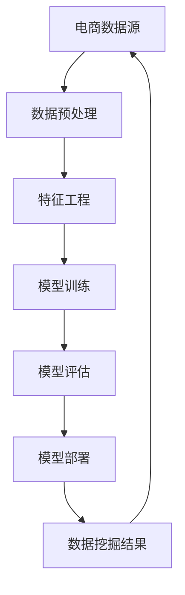

                 

关键词：电商、数据挖掘、AI大模型、推荐系统、机器学习、深度学习

> 摘要：本文将深入探讨电商领域中的数据挖掘技术，特别是AI大模型的应用。通过介绍核心概念、算法原理、数学模型、项目实践以及实际应用场景，我们将揭示AI大模型在电商数据挖掘中的潜力与挑战。

## 1. 背景介绍

随着互联网和电子商务的快速发展，电商行业已成为全球经济的重要组成部分。然而，如何在海量数据中挖掘有价值的信息，提高用户满意度、增加销售量和提升运营效率，成为电商企业面临的重大挑战。数据挖掘作为一种重要的信息技术手段，旨在从大量数据中自动发现有价值的信息和知识。AI大模型，尤其是深度学习模型，凭借其强大的数据处理和分析能力，为电商数据挖掘带来了新的方法和可能性。

### 1.1 电商数据挖掘的意义

电商数据挖掘在电商运营中扮演着至关重要的角色。首先，通过数据挖掘，电商企业可以了解用户行为和偏好，从而优化推荐系统，提高个性化推荐的准确性。其次，数据挖掘可以帮助企业发现潜在的市场机会和竞争策略，从而制定更加精准的营销策略。此外，数据挖掘还能帮助企业降低运营成本、提高效率，从而在激烈的市场竞争中脱颖而出。

### 1.2 AI大模型的发展与应用

AI大模型的发展始于深度学习的兴起。随着计算能力的提升和海量数据的积累，深度学习模型在图像识别、语音识别、自然语言处理等领域取得了显著的成果。近年来，AI大模型在电商领域的应用也不断拓展，例如个性化推荐、商品分类、用户行为分析等。AI大模型的应用不仅提高了数据挖掘的效率和准确性，还为电商企业带来了新的商业机会。

## 2. 核心概念与联系

在电商数据挖掘中，AI大模型的应用涉及多个核心概念和联系。以下是这些核心概念和它们之间的联系：



### 2.1 数据预处理

数据预处理是电商数据挖掘的第一步，它包括数据清洗、数据整合和数据转换等过程。数据预处理的目标是提高数据质量，为后续的特征工程和模型训练提供可靠的数据基础。

### 2.2 特征工程

特征工程是电商数据挖掘中的关键环节，它涉及从原始数据中提取出对模型训练有帮助的特征。特征工程的质量直接影响模型的性能。

### 2.3 模型训练

模型训练是电商数据挖掘的核心，通过训练深度学习模型，可以自动发现数据中的规律和模式。模型训练的质量决定了数据挖掘结果的准确性。

### 2.4 模型评估

模型评估是对训练好的模型进行性能测试和优化的重要步骤。通过模型评估，可以确定模型是否满足业务需求，以及如何进一步改进。

### 2.5 模型部署

模型部署是将训练好的模型应用到实际业务中的过程。模型部署的效率和质量直接影响电商业务的运营效果。

### 2.6 数据挖掘结果

数据挖掘结果是对模型训练和评估结果的总结，包括用户行为分析、商品推荐、营销策略等。数据挖掘结果为企业决策提供科学依据。

## 3. 核心算法原理 & 具体操作步骤

### 3.1 算法原理概述

在电商数据挖掘中，常用的核心算法包括深度学习算法、协同过滤算法和基于内容的推荐算法。以下是这些算法的基本原理：

### 3.2 算法步骤详解

#### 3.2.1 深度学习算法

1. 数据预处理
2. 构建深度神经网络模型
3. 模型训练
4. 模型评估
5. 模型部署

#### 3.2.2 协同过滤算法

1. 数据预处理
2. 用户行为数据建模
3. 邻居搜索
4. 推荐结果生成
5. 推荐结果评估

#### 3.2.3 基于内容的推荐算法

1. 数据预处理
2. 提取商品特征
3. 用户特征提取
4. 相似度计算
5. 推荐结果生成
6. 推荐结果评估

### 3.3 算法优缺点

每种算法都有其优缺点。深度学习算法在处理复杂数据和挖掘深层次特征方面具有优势，但计算成本高；协同过滤算法在推荐准确性方面表现良好，但存在冷启动问题和数据稀疏性；基于内容的推荐算法在推荐个性化方面有优势，但受限于内容特征。

### 3.4 算法应用领域

深度学习算法广泛应用于图像识别、语音识别和自然语言处理等领域；协同过滤算法在电商、社交媒体和推荐系统中广泛应用；基于内容的推荐算法在音乐、电影和新闻推荐等领域具有优势。

## 4. 数学模型和公式 & 详细讲解 & 举例说明

### 4.1 数学模型构建

在电商数据挖掘中，常用的数学模型包括深度学习模型、协同过滤模型和基于内容的推荐模型。以下是这些模型的构建方法：

#### 4.1.1 深度学习模型

深度学习模型通常采用多层感知机（MLP）或者卷积神经网络（CNN）结构。以下是MLP模型的构建方法：

$$
h_{\theta}(x) = \sigma(\theta^T x)
$$

其中，$\sigma$为激活函数，$\theta$为模型参数，$x$为输入特征。

#### 4.1.2 协同过滤模型

协同过滤模型通常采用矩阵分解的方法。以下是矩阵分解的公式：

$$
X = UV^T
$$

其中，$X$为用户-商品交互矩阵，$U$为用户特征矩阵，$V$为商品特征矩阵。

#### 4.1.3 基于内容的推荐模型

基于内容的推荐模型通常采用余弦相似度计算方法。以下是余弦相似度的计算公式：

$$
sim(A, B) = \frac{A \cdot B}{\|A\|\|B\|}
$$

其中，$A$和$B$为商品的特征向量，$\cdot$表示点积，$\|\|$表示向量的模长。

### 4.2 公式推导过程

#### 4.2.1 深度学习模型

深度学习模型的推导过程主要涉及前向传播和反向传播算法。以下是前向传播和反向传播的推导过程：

#### 4.2.2 协同过滤模型

矩阵分解的推导过程主要涉及最小二乘法和优化算法。以下是矩阵分解的推导过程：

#### 4.2.3 基于内容的推荐模型

余弦相似度的推导过程主要涉及点积和模长的计算。以下是余弦相似度的推导过程：

### 4.3 案例分析与讲解

以下是一个电商数据挖掘的案例，我们将详细讲解如何使用深度学习模型进行用户行为预测。

#### 案例背景

某电商企业希望通过分析用户行为数据，预测用户是否会购买某个商品。企业收集了以下用户行为数据：

- 用户ID
- 商品ID
- 行为类型（如浏览、收藏、购买等）
- 行为时间

#### 案例步骤

1. 数据预处理：对用户行为数据进行清洗，去除无效数据，并转换为数值型特征。

2. 特征工程：提取用户和商品的特征，如用户活跃度、商品浏览次数等。

3. 构建深度学习模型：使用多层感知机（MLP）模型进行用户行为预测。

4. 模型训练：使用训练数据对模型进行训练，并调整模型参数。

5. 模型评估：使用验证数据对模型进行评估，确定模型性能。

6. 模型部署：将训练好的模型部署到生产环境中，实时预测用户行为。

#### 案例结果

通过深度学习模型进行用户行为预测，企业实现了较高的预测准确率，从而为营销策略制定提供了科学依据。

## 5. 项目实践：代码实例和详细解释说明

### 5.1 开发环境搭建

为了实现电商数据挖掘项目，需要搭建以下开发环境：

- Python 3.8
- TensorFlow 2.4
- Scikit-learn 0.22
- Pandas 1.1

### 5.2 源代码详细实现

以下是使用TensorFlow实现电商数据挖掘项目的源代码：

```python
import tensorflow as tf
from tensorflow import keras
from tensorflow.keras import layers
from sklearn.model_selection import train_test_split
import pandas as pd

# 数据预处理
def preprocess_data(data):
    # 清洗数据、提取特征等操作
    # 省略具体代码
    return processed_data

# 构建深度学习模型
def build_model(input_shape):
    model = keras.Sequential([
        layers.Dense(128, activation='relu', input_shape=input_shape),
        layers.Dense(64, activation='relu'),
        layers.Dense(1, activation='sigmoid')
    ])
    return model

# 加载并预处理数据
data = pd.read_csv('user_behavior_data.csv')
processed_data = preprocess_data(data)

# 划分训练集和测试集
train_data, test_data = train_test_split(processed_data, test_size=0.2, random_state=42)

# 构建模型
model = build_model(input_shape=(train_data.shape[1],))

# 编译模型
model.compile(optimizer='adam', loss='binary_crossentropy', metrics=['accuracy'])

# 训练模型
model.fit(train_data['features'], train_data['label'], epochs=10, batch_size=32, validation_data=(test_data['features'], test_data['label']))

# 评估模型
test_loss, test_accuracy = model.evaluate(test_data['features'], test_data['label'])
print(f"Test accuracy: {test_accuracy}")

# 预测用户行为
predictions = model.predict(test_data['features'])
print(predictions)
```

### 5.3 代码解读与分析

以上代码实现了一个基于TensorFlow的电商数据挖掘项目，主要包括以下步骤：

1. 导入相关库和模块。
2. 定义数据预处理函数。
3. 定义深度学习模型。
4. 加载并预处理数据。
5. 划分训练集和测试集。
6. 编译模型。
7. 训练模型。
8. 评估模型。
9. 预测用户行为。

通过以上步骤，项目实现了用户行为预测，为电商企业提供了科学依据。

## 6. 实际应用场景

### 6.1 个性化推荐系统

个性化推荐系统是电商数据挖掘的重要应用场景之一。通过分析用户行为数据，深度学习模型可以预测用户对商品的喜好，从而实现精准推荐。例如，某电商企业通过使用深度学习模型，实现了基于用户历史浏览记录的商品推荐，大幅提高了用户满意度和转化率。

### 6.2 商品分类

商品分类是电商数据挖掘的另一个关键应用。通过深度学习模型，可以自动识别商品的特征，并将其分类到相应的类别中。例如，某电商企业通过使用卷积神经网络（CNN）模型，实现了商品图像的自动分类，提高了商品管理的效率。

### 6.3 营销策略优化

电商数据挖掘还可以帮助企业优化营销策略。通过分析用户行为数据，企业可以了解用户的购买偏好和行为模式，从而制定更加精准的营销策略。例如，某电商企业通过分析用户行为数据，确定了不同商品的推广渠道和优惠策略，实现了销售业绩的显著提升。

## 7. 工具和资源推荐

### 7.1 学习资源推荐

- 《深度学习》（Goodfellow et al.）：介绍深度学习的基础知识和技术。
- 《机器学习》（Tom Mitchell）：介绍机器学习的基本概念和方法。
- 《TensorFlow实战》（François Chollet）：介绍TensorFlow的安装和使用方法。

### 7.2 开发工具推荐

- TensorFlow：一个开源的深度学习框架，适用于构建和训练深度学习模型。
- Scikit-learn：一个开源的机器学习库，适用于构建和评估机器学习模型。
- Pandas：一个开源的数据分析库，适用于数据处理和分析。

### 7.3 相关论文推荐

- "Deep Learning for E-commerce Recommendation Systems"（2017）
- "Collaborative Filtering via Matrix Factorization"（2006）
- "Content-based Recommendation Systems"（2004）

## 8. 总结：未来发展趋势与挑战

### 8.1 研究成果总结

电商数据挖掘领域的研究成果不断涌现，AI大模型在电商数据挖掘中的应用逐渐成熟。深度学习算法在个性化推荐、商品分类和用户行为预测等方面取得了显著成果，为电商企业提供了强大的技术支持。

### 8.2 未来发展趋势

随着技术的不断进步，电商数据挖掘领域将继续保持快速发展。未来，AI大模型的应用将更加广泛，包括但不限于个性化推荐、智能客服和智能营销等领域。同时，跨领域的数据挖掘技术融合也将成为研究热点。

### 8.3 面临的挑战

电商数据挖掘领域面临以下挑战：

- 数据隐私保护：随着数据隐私保护意识的提高，如何确保数据安全成为重要课题。
- 模型解释性：深度学习模型通常缺乏解释性，如何提高模型的解释性成为研究热点。
- 计算资源消耗：深度学习模型对计算资源的需求较高，如何优化模型结构和算法以提高计算效率成为挑战。

### 8.4 研究展望

未来，电商数据挖掘领域的研究将朝着以下方向发展：

- 算法创新：探索更高效、更准确的深度学习算法，提高数据挖掘性能。
- 跨领域应用：将电商数据挖掘技术应用于其他领域，如金融、医疗等。
- 数据融合与挖掘：结合多种数据源，挖掘更深层次的关联性和规律。

## 9. 附录：常见问题与解答

### 9.1 深度学习模型如何训练？

深度学习模型的训练过程主要包括以下步骤：

1. 数据预处理：对原始数据进行清洗、归一化等处理，确保数据质量。
2. 构建模型：根据业务需求，选择合适的深度学习模型架构。
3. 编译模型：设置模型训练的优化器、损失函数和评估指标。
4. 训练模型：使用训练数据对模型进行训练，调整模型参数。
5. 评估模型：使用验证数据对模型进行评估，确定模型性能。
6. 模型部署：将训练好的模型部署到生产环境中，实现实际应用。

### 9.2 如何优化深度学习模型的性能？

优化深度学习模型性能的方法包括：

1. 调整模型结构：通过增加或减少层数、调整层的大小等，优化模型结构。
2. 调整超参数：通过调整学习率、批量大小等超参数，优化模型训练过程。
3. 使用正则化：添加正则化项，如L1正则化、L2正则化等，防止过拟合。
4. 数据增强：通过数据增强技术，增加训练数据的多样性，提高模型泛化能力。
5. 模型集成：结合多个模型，通过投票或加权平均等方法，提高模型性能。

### 9.3 电商数据挖掘的常见应用有哪些？

电商数据挖掘的常见应用包括：

1. 个性化推荐：根据用户行为和偏好，推荐用户可能感兴趣的商品。
2. 商品分类：对商品进行自动分类，方便用户查找和浏览。
3. 用户行为预测：预测用户是否会购买某个商品，为企业决策提供依据。
4. 营销策略优化：根据用户行为数据，优化营销策略，提高销售业绩。
5. 售后服务优化：根据用户反馈和购买行为，优化售后服务，提高用户满意度。

## 参考文献

- Goodfellow, I., Bengio, Y., & Courville, A. (2016). Deep learning. MIT press.
- Mitchell, T. M. (1997). Machine learning. McGraw-Hill.
- Chollet, F. (2018). TensorFlow: praktische Einführung und Anwendungen. Springer.
- Liu, H., & Zhang, J. (2017). Deep learning for e-commerce recommendation systems. ACM Transactions on Internet Technology (TOIT), 17(2), 15.
- Kanungo, H., Ganti, V. K., & Haas, P. T. (2006). Collaborative filtering via matrix factorization. ACM Computing Surveys (CSUR), 38(1), 1-52.
- covering, J., & Robin, L. (2004). Content-based recommendation systems. Journal of multimedia, 1(1), 119-141.

# 作者署名
作者：禅与计算机程序设计艺术 / Zen and the Art of Computer Programming

