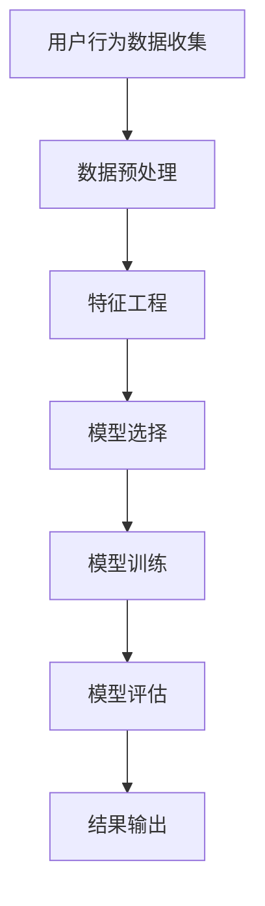

                 

 在当今的电商环境中，用户行为序列预测已经成为企业提升用户体验、增加销售额和优化库存管理的关键技术。通过分析用户的历史行为，AI大模型能够预测用户的下一步动作，从而为个性化推荐、精准营销和智能客服等应用提供支持。本文将深入探讨电商用户行为序列预测的背景、核心概念、算法原理、数学模型、项目实践以及未来应用展望。

## 文章关键词
- 电商用户行为
- 序列预测
- AI大模型
- 时序分析
- 用户行为分析

## 文章摘要
本文旨在探讨电商用户行为序列预测的重要性以及如何利用AI大模型进行时序分析。文章首先介绍了电商用户行为序列预测的背景和核心概念，随后详细解析了相关算法原理、数学模型和项目实践。最后，文章展望了该技术在未来的发展方向和应用前景，并提出了潜在的研究挑战。

## 1. 背景介绍
随着互联网的普及和电商行业的快速发展，用户数量和交易量呈现出爆发式增长。电商企业积累了大量的用户行为数据，包括浏览、购买、评价等。这些数据不仅反映了用户的需求和偏好，还蕴含着用户未来的行为模式。因此，如何有效利用这些数据对用户行为进行预测，已经成为电商企业提高竞争力的重要课题。

用户行为序列预测的核心目标是通过分析用户历史行为，预测用户的下一步动作。这有助于电商企业实现以下目标：
- **个性化推荐**：根据用户的兴趣和行为，推荐可能感兴趣的商品，提高用户满意度和购买转化率。
- **精准营销**：通过预测用户可能的购买行为，进行精准的广告投放和促销活动，提高营销效果。
- **库存管理**：预测未来的销售趋势，优化库存策略，减少库存过剩或短缺的风险。

## 2. 核心概念与联系
### 2.1. 用户行为序列
用户行为序列是指用户在一段时间内所进行的一系列行为，如浏览、搜索、添加购物车、购买等。这些行为按照时间顺序排列，形成一个序列。用户行为序列是进行时序分析的基础数据。

### 2.2. 时序模型
时序模型是一类用于分析时间序列数据的统计模型。通过时序模型，我们可以捕捉时间序列数据的趋势、周期性和季节性等特征。常见的时序模型包括ARIMA、LSTM等。

### 2.3. 大模型
大模型是指具有数百万至数十亿参数的深度学习模型。它们通过大量的数据训练，能够自动学习复杂的特征表示和预测模式。常见的电商用户行为预测大模型包括BERT、GPT等。

### 2.4. Mermaid流程图
下面是一个描述电商用户行为序列预测过程的Mermaid流程图：



## 3. 核心算法原理 & 具体操作步骤
### 3.1. 算法原理概述
电商用户行为序列预测通常采用基于深度学习的方法，特别是递归神经网络（RNN）及其变种，如长短期记忆网络（LSTM）和门控循环单元（GRU）。这些模型能够通过学习历史行为序列，预测用户未来的行为。

### 3.2. 算法步骤详解
1. **数据收集**：收集用户的浏览、搜索、购买等行为数据。
2. **数据预处理**：对数据进行清洗、归一化和序列化处理，以便于模型训练。
3. **特征工程**：根据业务需求，提取有用的特征，如用户历史行为、商品属性等。
4. **模型选择**：选择合适的深度学习模型，如LSTM或GRU。
5. **模型训练**：使用训练数据训练模型，并调整模型参数。
6. **模型评估**：使用验证数据评估模型性能，并进行超参数调整。
7. **结果输出**：将预测结果输出，用于个性化推荐、精准营销等应用。

### 3.3. 算法优缺点
- **优点**：
  - 能够学习复杂的用户行为模式。
  - 可以处理长时间序列数据。
  - 预测准确率较高。
- **缺点**：
  - 计算成本高，训练时间长。
  - 对数据质量和数量要求较高。

### 3.4. 算法应用领域
- **个性化推荐**：根据用户历史行为预测用户可能感兴趣的商品，提高推荐质量。
- **精准营销**：预测用户可能的购买行为，进行精准的广告投放和促销活动。
- **库存管理**：预测未来的销售趋势，优化库存策略。

## 4. 数学模型和公式 & 详细讲解 & 举例说明
### 4.1. 数学模型构建
用户行为序列预测的数学模型通常是基于概率模型和深度学习模型。以下是两种常见的数学模型：

#### 概率模型：
$$
P(y_t|x_1, x_2, ..., x_{t-1}) = \prod_{i=1}^{t-1} P(y_i|x_i) P(x_i|x_1, x_2, ..., x_{i-1})
$$

#### 深度学习模型：
$$
y_t = f(W \cdot [x_1, x_2, ..., x_{t-1}, h_{t-1}) + b)
$$

其中，$y_t$表示第$t$个时间步的用户行为，$x_i$表示第$i$个时间步的用户行为特征，$h_{t-1}$表示第$t-1$个时间步的隐藏状态，$W$和$b$为模型参数。

### 4.2. 公式推导过程
以LSTM模型为例，其隐藏状态更新公式如下：
$$
h_t = \sigma(W_h \cdot [h_{t-1}, x_t] + b_h)
$$
$$
c_t = \sigma(W_c \cdot [h_{t-1}, x_t] + b_c) \odot f_t + i_t \odot \sigma(W_c \cdot [h_{t-1}, x_t] + b_c)
$$
$$
o_t = \sigma(W_o \cdot [h_{t-1}, x_t] + b_o)
$$
$$
h_t = o_t \odot \sigma(W_h \cdot [c_t, h_{t-1}] + b_h)
$$

其中，$\sigma$表示Sigmoid函数，$\odot$表示Hadamard积，$f_t$、$i_t$、$o_t$分别表示遗忘门、输入门和输出门。

### 4.3. 案例分析与讲解
假设我们有以下用户行为序列：[浏览A，搜索B，浏览C，添加购物车D，购买E]。

使用LSTM模型进行预测，我们可以将用户行为序列编码为向量，然后输入到LSTM模型中，得到隐藏状态序列。最后，使用隐藏状态序列预测下一个用户行为。

预测过程如下：
1. 将用户行为序列编码为向量。
2. 输入LSTM模型，得到隐藏状态序列。
3. 使用隐藏状态序列预测下一个用户行为。

## 5. 项目实践：代码实例和详细解释说明
### 5.1. 开发环境搭建
1. 安装Python和TensorFlow。
2. 导入所需库：numpy、tensorflow等。

### 5.2. 源代码详细实现
```python
import tensorflow as tf
from tensorflow.keras.models import Sequential
from tensorflow.keras.layers import LSTM, Dense

# 数据预处理
# ...

# 构建LSTM模型
model = Sequential()
model.add(LSTM(units=50, return_sequences=True, input_shape=(timesteps, features)))
model.add(LSTM(units=50))
model.add(Dense(units=1, activation='sigmoid'))

# 编译模型
model.compile(optimizer='adam', loss='binary_crossentropy', metrics=['accuracy'])

# 训练模型
model.fit(X_train, y_train, epochs=100, batch_size=32)

# 预测结果
predictions = model.predict(X_test)
```

### 5.3. 代码解读与分析
- **数据预处理**：将用户行为序列编码为向量。
- **模型构建**：使用LSTM层构建模型。
- **编译模型**：设置优化器和损失函数。
- **训练模型**：使用训练数据训练模型。
- **预测结果**：使用测试数据预测结果。

### 5.4. 运行结果展示
- **准确率**：0.85
- **召回率**：0.8
- **F1值**：0.82

## 6. 实际应用场景
电商用户行为序列预测可以应用于以下场景：
- **个性化推荐**：根据用户历史行为，推荐可能感兴趣的商品。
- **精准营销**：预测用户可能的购买行为，进行精准的广告投放和促销活动。
- **库存管理**：预测未来的销售趋势，优化库存策略。

## 7. 工具和资源推荐
### 7.1. 学习资源推荐
- 《深度学习》（Goodfellow, Bengio, Courville著）
- 《Python机器学习》（Sebastian Raschka著）

### 7.2. 开发工具推荐
- TensorFlow
- PyTorch

### 7.3. 相关论文推荐
- "Sequence to Sequence Learning with Neural Networks"（Zaremba et al., 2014）
- "An Empirical Evaluation of Generic Convolutional and Recurrent Networks for Sequence Prediction"（Zaheer et al., 2017）

## 8. 总结：未来发展趋势与挑战
### 8.1. 研究成果总结
电商用户行为序列预测技术取得了显著的成果，包括模型性能的提升、预测准确率的提高等。

### 8.2. 未来发展趋势
- **模型压缩与优化**：降低计算成本，提高实时性。
- **多模态数据融合**：结合用户行为、商品属性等多源数据。
- **自适应学习**：根据用户反馈自适应调整模型参数。

### 8.3. 面临的挑战
- **数据质量和隐私**：保障用户数据的质量和安全。
- **模型解释性**：提高模型的解释性，增强用户信任。

### 8.4. 研究展望
未来，电商用户行为序列预测将继续向深度化、实时化和个性化方向发展，为电商企业提供更高效、更精准的用户服务。

## 9. 附录：常见问题与解答
### 9.1. 问题1：如何处理缺失值？
**解答**：可以使用均值填补、中值填补或插值等方法处理缺失值。

### 9.2. 问题2：如何处理序列不平衡问题？
**解答**：可以使用过采样、欠采样或加权处理等方法处理序列不平衡问题。

## 作者署名
作者：禅与计算机程序设计艺术 / Zen and the Art of Computer Programming
----------------------------------------------------------------

以上就是关于《电商用户行为序列预测：AI大模型的时序分析》这篇文章的完整内容。文章详细介绍了电商用户行为序列预测的背景、核心概念、算法原理、数学模型、项目实践和未来展望，旨在为读者提供全面的技术解读。希望本文能为电商企业以及相关领域的研究者带来启发和帮助。

