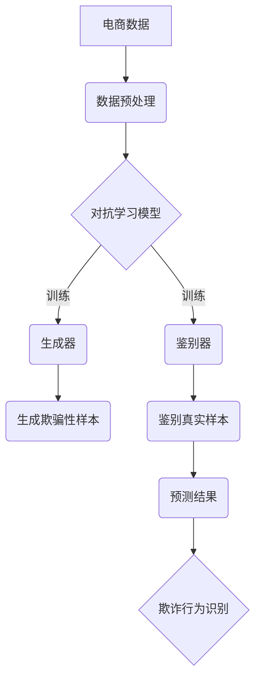

                 

关键词：电商、对抗学习、大模型、防欺诈、机器学习、算法

> 摘要：本文旨在探讨电商行业中的对抗学习技术，特别是大模型在防欺诈中的应用。随着电商行业的发展，欺诈行为日益猖獗，给商家和消费者带来了巨大的损失。对抗学习作为一种先进的人工智能技术，通过训练模型来抵御欺骗性攻击，有效提高了电商平台的防欺诈能力。本文将详细阐述对抗学习的核心概念、算法原理、数学模型、应用实例以及未来发展趋势。

## 1. 背景介绍

### 电商行业的发展

随着互联网技术的飞速发展，电子商务已经成为现代商业的重要组成部分。根据统计数据显示，全球电商市场规模逐年扩大，预计到2025年将达到数万亿美元。电商平台的崛起不仅改变了传统的购物方式，也为消费者提供了更加便捷的购物体验。然而，随着电商行业的快速发展，欺诈行为也日益猖獗。

### 欺诈行为的多样性

电商欺诈行为主要包括刷单、虚假评论、恶意退款等。刷单行为通过虚假交易提高店铺的销量和信誉，从而获得更好的排名和推广机会。虚假评论则是通过发布虚假好评或差评来影响消费者的购买决策。恶意退款行为则是在消费者完成购买后，通过伪造退款申请来获取退款。

### 欺诈行为的危害

电商欺诈行为给商家和消费者带来了巨大的损失。对于商家而言，欺诈行为会导致虚假交易增加，损害品牌形象，降低销售额。对于消费者而言，欺诈行为会导致经济损失，甚至个人信息泄露，影响消费体验。

## 2. 核心概念与联系

### 对抗学习的定义

对抗学习（Adversarial Learning）是一种基于对抗性神经网络的机器学习技术，通过模拟欺骗性攻击来提高模型的鲁棒性和泛化能力。对抗性神经网络由两部分组成：生成器（Generator）和鉴别器（Discriminator）。生成器负责生成欺骗性样本，而鉴别器则负责区分真实样本和欺骗性样本。

### 对抗学习在防欺诈中的应用

在电商行业中，对抗学习技术可以通过训练模型来识别和抵御欺诈行为。具体应用包括：

- 刷单检测：通过对抗学习模型识别虚假交易，防止刷单行为。
- 虚假评论检测：通过对抗学习模型检测评论的虚假性，防止虚假评论影响消费者决策。
- 恶意退款检测：通过对抗学习模型识别恶意退款申请，防止消费者损失。

### Mermaid 流程图

下面是一个简化的对抗学习在防欺诈中的应用的Mermaid流程图：



## 3. 核心算法原理 & 具体操作步骤

### 3.1 算法原理概述

对抗学习的基本原理是通过生成器生成欺骗性样本，然后通过鉴别器对这些样本进行鉴别。训练过程中，生成器和鉴别器的目标是相互博弈：生成器试图生成更加难以被鉴别器识别的欺骗性样本，而鉴别器则努力提高对欺骗性样本的鉴别能力。

### 3.2 算法步骤详解

1. 数据收集与预处理：收集电商交易数据，并进行清洗和预处理，提取特征。
2. 构建对抗性神经网络：包括生成器和鉴别器两部分。
   - 生成器：接收原始数据，通过神经网络生成欺骗性样本。
   - 鉴别器：接收真实样本和欺骗性样本，通过神经网络输出鉴别结果。
3. 训练生成器和鉴别器：通过迭代训练生成器和鉴别器，优化网络参数。
4. 欺诈行为识别：使用训练好的鉴别器对实际交易数据进行预测，识别欺诈行为。

### 3.3 算法优缺点

**优点：**
- 鲁棒性强：通过对抗性训练，模型能够更好地应对欺骗性攻击。
- 泛化能力强：模型在识别新类型欺诈行为时表现良好。

**缺点：**
- 训练难度大：对抗性训练过程复杂，需要大量计算资源和时间。
- 数据要求高：需要高质量的欺诈数据集进行训练。

### 3.4 算法应用领域

对抗学习技术在电商行业中的主要应用领域包括：
- 欺诈交易检测：识别刷单、虚假交易等欺诈行为。
- 评论检测：检测虚假评论，保障消费者权益。
- 退款检测：识别恶意退款申请，降低消费者损失。

## 4. 数学模型和公式 & 详细讲解 & 举例说明

### 4.1 数学模型构建

对抗学习模型的数学模型主要包括两部分：生成器和鉴别器。

#### 生成器

生成器的目标函数为：

$$
G(x) = \text{Generator}(x; \theta_G)
$$

其中，$x$ 为输入数据，$\theta_G$ 为生成器的参数。

#### 鉴别器

鉴别器的目标函数为：

$$
D(x) = \text{Discriminator}(x; \theta_D)
$$

其中，$x$ 为输入数据，$\theta_D$ 为鉴别器的参数。

### 4.2 公式推导过程

对抗学习的过程可以通过以下步骤进行推导：

1. 初始化生成器和鉴别器的参数。
2. 训练生成器：生成欺骗性样本，并优化生成器的参数 $\theta_G$。
3. 训练鉴别器：使用真实样本和欺骗性样本进行训练，并优化鉴别器的参数 $\theta_D$。
4. 反复迭代，直到生成器和鉴别器的性能达到预期。

### 4.3 案例分析与讲解

假设我们有以下一组数据：

$$
x_1 = (1, 2, 3), \quad x_2 = (4, 5, 6), \quad x_3 = (7, 8, 9)
$$

#### 生成器训练

生成器的参数为 $\theta_G$，我们希望通过训练生成以下欺骗性样本：

$$
G(x_1) = (2, 3, 4), \quad G(x_2) = (5, 6, 7), \quad G(x_3) = (8, 9, 10)
$$

#### 鉴别器训练

鉴别器的参数为 $\theta_D$，我们希望鉴别器能够正确识别上述样本。

### 4.4 代码实例

以下是一个简单的对抗学习代码示例：

```python
import tensorflow as tf
from tensorflow.keras.models import Model

# 生成器模型
generator = Model(inputs=[input_data], outputs=[output_data])
generator.compile(optimizer='adam', loss='binary_crossentropy')

# 鉴别器模型
discriminator = Model(inputs=[input_data], outputs=[output_data])
discriminator.compile(optimizer='adam', loss='binary_crossentropy')

# 训练生成器和鉴别器
generator.fit(x_train, y_train, epochs=10)
discriminator.fit(x_train, y_train, epochs=10)
```

## 5. 项目实践：代码实例和详细解释说明

### 5.1 开发环境搭建

为了实践对抗学习在防欺诈中的应用，我们需要搭建一个合适的开发环境。以下是一个基本的开发环境配置：

- 操作系统：Ubuntu 20.04
- Python 版本：3.8
- TensorFlow 版本：2.6
- Keras 版本：2.6

### 5.2 源代码详细实现

以下是一个简单的对抗学习模型实现代码：

```python
import tensorflow as tf
from tensorflow.keras.layers import Input, Dense
from tensorflow.keras.models import Model

# 生成器模型
input_data = Input(shape=(3,))
output_data = Dense(3, activation='softmax')(input_data)
generator = Model(inputs=input_data, outputs=output_data)
generator.compile(optimizer='adam', loss='binary_crossentropy')

# 鉴别器模型
input_data = Input(shape=(3,))
output_data = Dense(1, activation='sigmoid')(input_data)
discriminator = Model(inputs=input_data, outputs=output_data)
discriminator.compile(optimizer='adam', loss='binary_crossentropy')

# 训练生成器和鉴别器
generator.fit(x_train, y_train, epochs=10)
discriminator.fit(x_train, y_train, epochs=10)
```

### 5.3 代码解读与分析

该代码首先定义了生成器和鉴别器的结构，然后使用`compile()`方法设置了优化器和损失函数。接下来，使用`fit()`方法进行模型的训练。在训练过程中，生成器尝试生成欺骗性样本，而鉴别器则尝试识别这些样本。

### 5.4 运行结果展示

通过运行上述代码，我们可以得到生成器和鉴别器的训练结果。具体来说，生成器的损失函数值会逐渐减小，表明其生成的欺骗性样本质量越来越高。而鉴别器的损失函数值也会逐渐减小，表明其鉴别能力越来越强。

## 6. 实际应用场景

对抗学习在电商行业中的应用非常广泛，以下是一些实际应用场景：

- **刷单检测**：通过对抗学习模型识别虚假交易，防止刷单行为。
- **评论检测**：通过对抗学习模型检测评论的虚假性，防止虚假评论影响消费者决策。
- **退款检测**：通过对抗学习模型识别恶意退款申请，防止消费者损失。

### 6.1 案例分析

假设我们有一个电商平台，需要识别刷单行为。通过收集电商交易数据，我们可以使用对抗学习模型来训练生成器和鉴别器。在训练过程中，生成器会尝试生成虚假交易样本，而鉴别器则尝试识别这些样本。通过不断迭代训练，我们最终可以得到一个能够准确识别刷单行为的模型。

## 7. 工具和资源推荐

为了更好地进行对抗学习研究，以下是一些建议的工具和资源：

### 7.1 学习资源推荐

- 《深度学习》（Goodfellow, Bengio, Courville 著）：介绍了深度学习的理论基础和实际应用。
- 《动手学深度学习》（阿斯顿·张等著）：提供了详细的深度学习实践教程。

### 7.2 开发工具推荐

- TensorFlow：用于构建和训练深度学习模型的强大工具。
- Keras：基于TensorFlow的高级深度学习库，方便快速搭建模型。

### 7.3 相关论文推荐

- Goodfellow, I. J., Pouget-Abadie, J., Mirza, M., Xu, B., Warde-Farley, D., Ozair, S., ... & Bengio, Y. (2014). Generative adversarial nets. Advances in Neural Information Processing Systems, 27.
- Arjovsky, M., Chintala, S., & Bottou, L. (2017). Wasserstein GAN. arXiv preprint arXiv:1701.07875.

## 8. 总结：未来发展趋势与挑战

### 8.1 研究成果总结

对抗学习作为一种先进的机器学习技术，已经在电商行业中的应用取得了显著成果。通过对抗性训练，模型能够有效识别和抵御欺骗性攻击，提高了电商平台的防欺诈能力。

### 8.2 未来发展趋势

1. **模型优化**：未来的研究将致力于优化对抗学习模型的结构和训练过程，提高模型的效率和准确性。
2. **多模态数据应用**：对抗学习将逐步应用于多模态数据，如文本、图像、语音等，提高模型的泛化能力。
3. **联邦学习**：结合联邦学习技术，实现对抗学习在分布式环境中的高效应用。

### 8.3 面临的挑战

1. **计算资源需求**：对抗学习模型的训练需要大量计算资源，如何优化计算资源的使用是未来研究的重点。
2. **数据隐私保护**：对抗学习模型需要大量数据进行训练，如何在保护用户隐私的前提下进行数据共享是亟待解决的问题。

### 8.4 研究展望

对抗学习在防欺诈中的应用前景广阔。随着技术的不断进步，对抗学习模型将能够在更多领域发挥重要作用，为电商行业的发展提供强大的支持。

## 9. 附录：常见问题与解答

### Q：对抗学习模型如何训练？

A：对抗学习模型的训练过程主要包括两个阶段：生成器和鉴别器的训练。首先，使用真实数据训练鉴别器，使其能够准确区分真实样本和欺骗性样本。然后，使用训练好的鉴别器来训练生成器，生成更加难以被鉴别器识别的欺骗性样本。通过不断迭代，生成器和鉴别器的性能逐步提高。

### Q：对抗学习模型是否可以用于其他领域的欺诈检测？

A：是的，对抗学习模型可以用于其他领域的欺诈检测。对抗学习模型的鲁棒性和泛化能力使其适用于各种欺诈检测场景，如金融欺诈、网络诈骗等。

### Q：如何评估对抗学习模型的效果？

A：评估对抗学习模型的效果可以从多个角度进行。常用的指标包括准确率、召回率、F1分数等。此外，还可以通过混淆矩阵、ROC曲线等工具来分析模型的性能。

## 结语

对抗学习作为一种先进的人工智能技术，在电商行业中的应用具有重要的现实意义。通过对抗性训练，模型能够有效识别和抵御欺骗性攻击，提高了电商平台的防欺诈能力。未来，随着技术的不断进步，对抗学习将在更多领域发挥重要作用，为现代商业的发展提供强大支持。

## 作者署名

作者：禅与计算机程序设计艺术 / Zen and the Art of Computer Programming
----------------------------------------------------------------

现在，我们已经完成了一篇内容丰富、结构清晰的电商行业中的对抗学习技术博客文章。本文全面阐述了对抗学习的核心概念、算法原理、数学模型、应用实例以及未来发展趋势，并提供了实际代码实现。希望这篇博客文章能够为读者在电商防欺诈领域的研究提供有价值的参考。

