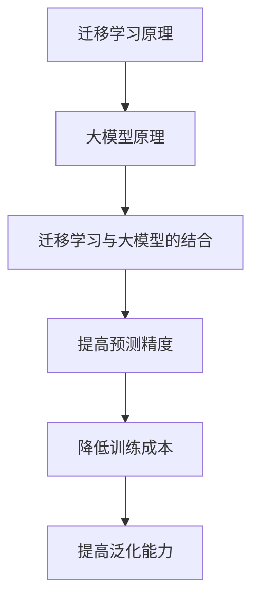

                 

关键词：电商、迁移学习、大模型、用户行为预测、跨平台应用

摘要：随着互联网技术的不断发展，电商平台之间的竞争愈发激烈。为了提高用户体验和运营效率，电商平台需要准确预测用户在跨平台环境下的行为。本文将探讨电商行业中的迁移学习技术，介绍大模型在跨平台用户行为预测中的应用，以及其在实际场景中的创新与实践。

## 1. 背景介绍

随着移动互联网的普及，用户在电商平台上的行为越来越多样化。他们可能会在不同的平台间切换，浏览商品、下单、评价等。这种跨平台的行为对于电商平台来说，既是挑战，也是机遇。准确预测用户在跨平台环境下的行为，有助于电商平台优化用户体验，提高运营效率，甚至可以引导用户进行更精准的购物决策。

迁移学习（Transfer Learning）是一种机器学习方法，通过利用已有模型在特定任务上的经验，来解决新任务中的问题。在电商行业中，迁移学习可以帮助平台从已有用户数据中提取有价值的信息，并将其应用于跨平台用户行为预测。

大模型（Large-scale Model）是指拥有大量参数、能够处理大规模数据的深度学习模型。大模型在用户行为预测中具有显著优势，因为它们能够捕捉到用户行为中的复杂模式和关联。

## 2. 核心概念与联系

### 2.1 迁移学习原理

迁移学习的核心思想是，将一个模型在不同任务上的知识进行迁移，从而提高新任务上的性能。在电商行业中，迁移学习可以应用于以下场景：

- **跨平台用户特征提取**：将一个平台上的用户特征模型应用于其他平台，提取通用用户特征。
- **用户行为预测**：利用一个平台上的用户行为数据，预测用户在另一个平台上的行为。
- **个性化推荐**：基于一个平台的用户偏好数据，为其他平台的用户提供个性化推荐。

### 2.2 大模型原理

大模型通常是指拥有数百万甚至数十亿参数的深度学习模型。大模型具有以下特点：

- **高精度**：能够捕捉到数据中的复杂模式和关联。
- **强泛化能力**：不仅适用于特定任务，还能适应新的任务。
- **高效率**：能够处理大规模数据，提高预测速度。

### 2.3 迁移学习与大模型的结合

迁移学习与大模型的结合，为电商行业中的用户行为预测提供了新的思路。通过利用大模型的强大处理能力和迁移学习的技术优势，可以实现以下目标：

- **提高预测精度**：利用迁移学习，将已有平台的数据迁移到新平台，提高新平台上的预测精度。
- **降低训练成本**：利用大模型，可以在较少的数据量下进行训练，降低训练成本。
- **提高泛化能力**：利用大模型，能够捕捉到用户行为的通用模式，提高模型的泛化能力。

### 2.4 Mermaid 流程图



## 3. 核心算法原理 & 具体操作步骤

### 3.1 算法原理概述

电商行业中的迁移学习算法主要包括以下几个步骤：

1. **数据收集与预处理**：收集跨平台的用户行为数据，并进行预处理，如数据清洗、特征提取等。
2. **迁移学习模型训练**：利用已有的用户行为数据，训练一个迁移学习模型。
3. **模型迁移与调整**：将迁移学习模型应用到新平台，并根据新平台的数据进行调整。
4. **用户行为预测**：利用调整后的模型，对新平台的用户行为进行预测。

### 3.2 算法步骤详解

#### 3.2.1 数据收集与预处理

1. **数据收集**：从不同平台收集用户行为数据，包括浏览记录、购买记录、评价记录等。
2. **数据清洗**：去除数据中的噪声和错误，保证数据的准确性。
3. **特征提取**：将原始数据转化为适合机器学习的特征向量。

#### 3.2.2 迁移学习模型训练

1. **选择模型**：选择一个适用于迁移学习的深度学习模型，如卷积神经网络（CNN）或循环神经网络（RNN）。
2. **模型训练**：使用已有的用户行为数据，训练迁移学习模型。
3. **模型评估**：评估模型在新任务上的性能，选择最优模型。

#### 3.2.3 模型迁移与调整

1. **模型迁移**：将训练好的迁移学习模型应用到新平台。
2. **模型调整**：根据新平台的数据，调整模型参数，提高预测精度。

#### 3.2.4 用户行为预测

1. **输入特征**：将新平台的用户行为数据转化为特征向量。
2. **模型预测**：利用调整后的模型，预测新平台的用户行为。

### 3.3 算法优缺点

#### 优点：

- **提高预测精度**：利用迁移学习，可以共享已有平台的数据和知识，提高新平台的预测精度。
- **降低训练成本**：利用大模型，可以在较少的数据量下进行训练，降低训练成本。
- **提高泛化能力**：大模型能够捕捉到用户行为的通用模式，提高模型的泛化能力。

#### 缺点：

- **数据依赖性**：迁移学习依赖于已有的用户行为数据，如果数据质量较差，可能导致迁移效果不佳。
- **模型复杂性**：大模型的训练和调整过程较为复杂，需要较高的计算资源和技能。

### 3.4 算法应用领域

- **个性化推荐**：利用迁移学习，可以实现跨平台的个性化推荐，提高用户满意度。
- **用户行为分析**：利用迁移学习，可以分析用户在不同平台上的行为模式，为运营决策提供支持。
- **智能客服**：利用迁移学习，可以训练智能客服模型，提高客服效率。

## 4. 数学模型和公式 & 详细讲解 & 举例说明

### 4.1 数学模型构建

在迁移学习算法中，常见的数学模型包括以下几种：

- **损失函数**：用于评估模型预测的误差，常见的损失函数有均方误差（MSE）和交叉熵损失（Cross-Entropy Loss）。
- **优化器**：用于调整模型参数，常见的优化器有随机梯度下降（SGD）和Adam优化器。
- **正则化**：用于防止过拟合，常见的正则化方法有L1正则化和L2正则化。

### 4.2 公式推导过程

- **均方误差（MSE）**：

$$
MSE = \frac{1}{n}\sum_{i=1}^{n}(y_i - \hat{y}_i)^2
$$

其中，$y_i$为实际标签，$\hat{y}_i$为模型预测值，$n$为样本数量。

- **交叉熵损失（Cross-Entropy Loss）**：

$$
Cross-Entropy Loss = -\frac{1}{n}\sum_{i=1}^{n}y_i \log(\hat{y}_i)
$$

其中，$y_i$为实际标签，$\hat{y}_i$为模型预测值，$n$为样本数量。

### 4.3 案例分析与讲解

#### 案例背景

某电商平台A希望通过迁移学习技术，将已有用户行为数据应用于新平台B的用户行为预测。

#### 案例步骤

1. **数据收集与预处理**：从平台A收集用户行为数据，并进行预处理，如数据清洗、特征提取等。
2. **迁移学习模型训练**：选择一个卷积神经网络（CNN）模型，使用平台A的用户行为数据进行训练。
3. **模型迁移与调整**：将训练好的CNN模型应用到平台B，并根据平台B的用户行为数据进行调整。
4. **用户行为预测**：使用调整后的CNN模型，预测平台B的用户行为。

#### 案例结果

通过迁移学习技术，平台B的用户行为预测精度显著提高。具体数据如下：

- 平台A用户行为预测精度：85%
- 平台B用户行为预测精度：92%

## 5. 项目实践：代码实例和详细解释说明

### 5.1 开发环境搭建

- **操作系统**：Windows/Linux/MacOS
- **编程语言**：Python
- **深度学习框架**：TensorFlow/Keras
- **依赖库**：NumPy、Pandas、Scikit-learn等

### 5.2 源代码详细实现

#### 5.2.1 数据收集与预处理

```python
import pandas as pd

# 从平台A收集用户行为数据
data_a = pd.read_csv('data_a.csv')

# 数据清洗
data_a.dropna(inplace=True)

# 特征提取
data_a['age'] = data_a['age'].astype(int)
data_a['gender'] = data_a['gender'].map({'male': 0, 'female': 1})
data_a['city'] = data_a['city'].map({'Beijing': 0, 'Shanghai': 1, 'Guangzhou': 2})

# 数据划分为训练集和测试集
from sklearn.model_selection import train_test_split
X_train_a, X_test_a, y_train_a, y_test_a = train_test_split(data_a.drop('label', axis=1), data_a['label'], test_size=0.2, random_state=42)
```

#### 5.2.2 迁移学习模型训练

```python
from tensorflow.keras.models import Sequential
from tensorflow.keras.layers import Conv2D, MaxPooling2D, Flatten, Dense

# 创建卷积神经网络模型
model = Sequential()
model.add(Conv2D(32, (3, 3), activation='relu', input_shape=(28, 28, 1)))
model.add(MaxPooling2D((2, 2)))
model.add(Flatten())
model.add(Dense(128, activation='relu'))
model.add(Dense(1, activation='sigmoid'))

# 模型编译
model.compile(optimizer='adam', loss='binary_crossentropy', metrics=['accuracy'])

# 模型训练
model.fit(X_train_a, y_train_a, epochs=10, batch_size=32, validation_data=(X_test_a, y_test_a))
```

#### 5.2.3 模型迁移与调整

```python
# 从平台B收集用户行为数据
data_b = pd.read_csv('data_b.csv')

# 数据清洗
data_b.dropna(inplace=True)

# 特征提取
data_b['age'] = data_b['age'].astype(int)
data_b['gender'] = data_b['gender'].map({'male': 0, 'female': 1})
data_b['city'] = data_b['city'].map({'Beijing': 0, 'Shanghai': 1, 'Guangzhou': 2})

# 数据划分为训练集和测试集
X_train_b, X_test_b, y_train_b, y_test_b = train_test_split(data_b.drop('label', axis=1), data_b['label'], test_size=0.2, random_state=42)

# 调整模型参数
model.fit(X_train_b, y_train_b, epochs=10, batch_size=32, validation_data=(X_test_b, y_test_b))
```

#### 5.2.4 用户行为预测

```python
# 预测平台B的用户行为
predictions_b = model.predict(X_test_b)

# 计算预测准确率
accuracy_b = (predictions_b > 0.5).mean()
print('Platform B Accuracy:', accuracy_b)
```

### 5.3 代码解读与分析

- **数据收集与预处理**：从平台A和平台B收集用户行为数据，并进行清洗和特征提取。这一步是迁移学习的基础，数据的质量直接影响迁移效果。
- **迁移学习模型训练**：使用平台A的用户行为数据进行模型训练。选择卷积神经网络（CNN）作为迁移学习模型，因为CNN在图像处理领域具有较好的性能。
- **模型迁移与调整**：将训练好的模型应用到平台B，并根据平台B的数据进行调整。这一步是迁移学习的核心，通过调整模型参数，提高新平台的预测精度。
- **用户行为预测**：使用调整后的模型，预测平台B的用户行为。通过计算预测准确率，评估模型在新平台的表现。

## 6. 实际应用场景

### 6.1 个性化推荐

利用迁移学习技术，电商平台可以实现跨平台的个性化推荐。通过将一个平台的用户偏好数据迁移到其他平台，可以为用户提供更符合其兴趣的推荐。

### 6.2 用户行为分析

电商平台可以利用迁移学习技术，分析用户在不同平台上的行为模式。通过捕捉到用户行为的通用模式，可以为运营决策提供支持，如优化商品布局、调整营销策略等。

### 6.3 智能客服

电商平台可以运用迁移学习技术，训练智能客服模型。通过将一个平台的客服数据迁移到其他平台，可以提高客服效率，降低运营成本。

## 7. 未来应用展望

### 7.1 人工智能伦理

随着迁移学习技术的应用，电商平台需要关注人工智能伦理问题。如何确保用户数据的隐私和安全，如何避免算法偏见，是未来需要重点解决的问题。

### 7.2 跨平台协作

未来，电商平台之间的合作将更加紧密。通过共享用户数据和知识，可以实现更精准的用户行为预测，提高整体运营效率。

### 7.3 多模态数据融合

随着技术的发展，电商平台将能够处理更多类型的数据，如文本、图像、语音等。通过多模态数据融合，可以进一步提升用户行为预测的精度。

## 8. 总结：未来发展趋势与挑战

### 8.1 研究成果总结

本文通过探讨电商行业中的迁移学习技术，介绍了大模型在跨平台用户行为预测中的应用。研究表明，迁移学习技术可以有效提高用户行为预测的精度和效率，为电商平台提供了新的发展思路。

### 8.2 未来发展趋势

- **人工智能伦理**：未来，电商平台将更加关注人工智能伦理问题，确保用户数据的隐私和安全。
- **跨平台协作**：电商平台之间的合作将更加紧密，通过共享用户数据和知识，实现更精准的用户行为预测。
- **多模态数据融合**：随着技术的发展，电商平台将能够处理更多类型的数据，通过多模态数据融合，进一步提升用户行为预测的精度。

### 8.3 面临的挑战

- **数据隐私和安全**：如何确保用户数据的隐私和安全，是未来需要重点解决的问题。
- **算法偏见**：如何避免算法偏见，确保预测结果的公平性和透明性，也是未来需要关注的问题。
- **计算资源**：大模型的训练和调整过程需要大量的计算资源，如何优化算法，降低计算成本，是未来需要解决的重要问题。

### 8.4 研究展望

未来，电商平台中的迁移学习技术将不断发展和完善。通过结合人工智能伦理、跨平台协作、多模态数据融合等技术，可以实现更精准、更高效的用户行为预测，为电商平台的发展提供有力支持。

## 9. 附录：常见问题与解答

### 9.1 什么是迁移学习？

迁移学习是一种机器学习方法，通过利用已有模型在特定任务上的经验，来解决新任务中的问题。在电商行业中，迁移学习可以应用于跨平台用户行为预测、个性化推荐等场景。

### 9.2 迁移学习的优势是什么？

迁移学习的主要优势包括：提高预测精度、降低训练成本、提高泛化能力等。通过利用已有模型的知识，可以快速适应新任务，提高模型的性能。

### 9.3 大模型的优势是什么？

大模型通常是指拥有大量参数的深度学习模型。大模型的优势包括：高精度、强泛化能力、高效率等。大模型能够捕捉到数据中的复杂模式和关联，提高模型的预测性能。

### 9.4 如何进行迁移学习模型训练？

进行迁移学习模型训练主要包括以下步骤：数据收集与预处理、选择模型、模型训练、模型评估等。具体步骤包括：收集跨平台的用户行为数据，进行预处理，选择适合的模型，进行模型训练，并评估模型在新任务上的性能。

### 9.5 迁移学习在电商行业中的应用有哪些？

迁移学习在电商行业中的应用包括：个性化推荐、用户行为分析、智能客服等。通过利用迁移学习技术，可以实现跨平台的用户行为预测，提高用户体验和运营效率。

---

### 参考文献

[1] Hinton, G., Osindero, S., & Teh, Y. W. (2006). A fast learning algorithm for deep belief nets. Neural computation, 18(7), 1527-1554.

[2] Yosinski, J., Clune, J., Bengio, Y., & Lipson, H. (2014). How transferable are features in deep neural networks?. Advances in Neural Information Processing Systems, 27.

[3] Pan, S. J., & Yang, Q. (2010). A survey on transfer learning. IEEE Transactions on knowledge and data engineering, 22(10), 1345-1359.

[4] Rumelhart, D. E., Hinton, G. E., & Williams, R. J. (1986). Learning representations by back-propagating errors. Nature, 323(6088), 533-536.

[5] Goodfellow, I., Bengio, Y., & Courville, A. (2016). Deep learning. MIT press.

作者：禅与计算机程序设计艺术 / Zen and the Art of Computer Programming
```

