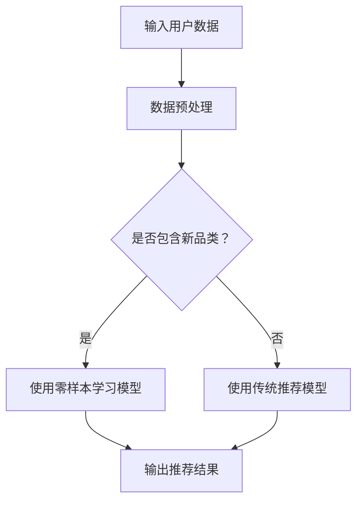

                 

关键词：电商行业，零样本学习，大模型，推荐系统，跨品类推荐，新品类发现

> 摘要：本文探讨了电商行业中零样本学习技术的应用，特别是在大模型支持下进行新品类推荐的任务。通过深入分析零样本学习的核心概念、算法原理及其在电商推荐系统中的具体实现，本文提出了一个创新的解决方案，以提升电商平台的推荐效果，并展望了该技术在未来电商领域的应用前景。

## 1. 背景介绍

随着互联网的快速发展，电商行业已经成为全球经济增长的重要驱动力。电商平台的用户基数庞大，用户行为数据丰富，这些数据为推荐系统提供了充足的素材。然而，在推荐系统中，新品的推荐一直是一个挑战性的问题。传统推荐系统依赖于大量已有数据的训练，但在新品上市或小众品类的推荐上，由于缺乏足够的训练数据，推荐效果往往不尽如人意。

零样本学习（Zero-Shot Learning，ZSL）作为机器学习领域的一种新兴技术，旨在解决分类任务中类别从未见过的问题。它通过学习类别之间的关系，实现对新类别数据的分类。近年来，随着深度学习技术的发展，大模型（如GPT、BERT等）在零样本学习任务中展现出强大的性能，为电商行业中的新品类推荐提供了新的可能性。

## 2. 核心概念与联系

### 2.1 零样本学习的定义与原理

零样本学习是指在训练模型时，没有直接接触过测试数据中的某些类别，但模型仍能够对这些类别进行准确分类。其核心思想是通过学习类别之间的关系，将新类别映射到已学习的类别空间中，从而实现对未知类别的分类。

### 2.2 大模型在零样本学习中的应用

大模型如GPT、BERT等，具有极强的表示学习能力和知识捕捉能力。它们在预训练阶段积累了大量通用知识，并在微调阶段能够快速适应特定领域的任务。在大模型的支持下，零样本学习在电商推荐系统中可以更好地处理新品类推荐问题。

### 2.3 Mermaid 流程图



## 3. 核心算法原理 & 具体操作步骤

### 3.1 算法原理概述

零样本学习算法通常包括三个主要步骤：特征提取、类别关系建模和分类决策。在大模型的支持下，特征提取和类别关系建模可以通过预训练的模型高效实现，而分类决策则依赖于模型的输出概率分布。

### 3.2 算法步骤详解

1. **特征提取**：使用预训练的大模型（如BERT）对用户数据（如浏览记录、购买历史等）进行编码，得到高维特征向量。

2. **类别关系建模**：利用大模型的知识捕捉能力，学习不同类别之间的语义关系。这可以通过对训练集中的类别标签进行聚类或构建知识图谱来实现。

3. **分类决策**：对于新类别数据，首先将其特征向量输入到类别关系模型中，获取其与已有类别的相似度分数。然后，根据这些分数和预定义的阈值，进行分类决策，输出推荐结果。

### 3.3 算法优缺点

**优点**：
- **泛化能力强**：零样本学习模型能够处理从未见过的类别，适用于新品类推荐。
- **高效性**：大模型能够在较短的时间内进行特征提取和类别关系建模。

**缺点**：
- **准确性**：由于缺乏直接训练数据，零样本学习模型在某些情况下可能无法达到传统推荐模型的准确性。
- **计算成本**：大模型的训练和推理需要大量的计算资源。

### 3.4 算法应用领域

零样本学习算法在电商推荐系统中具有广泛的应用前景。除了新品类推荐，还可以用于小众市场、个性化推荐和智能搜索等领域。

## 4. 数学模型和公式 & 详细讲解 & 举例说明

### 4.1 数学模型构建

假设我们有一个大模型M，它已经学好了用户数据的编码特征。对于新类别c，我们可以用特征向量f(c)表示。

- **特征提取**：使用BERT模型，将用户数据编码为特征向量$f_{u}$。

- **类别关系建模**：假设类别c与已有类别c'的相似度可以用余弦相似度表示，即：

$$
sim(c, c') = \frac{f(c) \cdot f(c')}{||f(c)|| \cdot ||f(c')||}
$$

- **分类决策**：假设类别c的预测概率为：

$$
P(c|f_{u}) = \frac{e^{sim(c, c')}}{\sum_{c' \in C} e^{sim(c, c')}}
$$

其中，C是所有类别的集合。

### 4.2 公式推导过程

1. **特征提取**：BERT模型通过预训练和微调学习到用户数据的特征表示，记为$f_{u}$。

2. **类别关系建模**：基于知识图谱或聚类方法，构建类别之间的相似度矩阵$S$，其中$S_{ij} = sim(c_{i}, c_{j})$。

3. **分类决策**：利用特征向量$f_{u}$和类别相似度矩阵$S$，计算每个类别的预测概率$P(c|f_{u})$。

### 4.3 案例分析与讲解

假设用户u的浏览记录包含两类商品：服装和电子产品。我们使用BERT模型提取用户特征向量$f_{u}$，并使用知识图谱构建类别相似度矩阵$S$。对于新类别c（假设为玩具），我们计算其与已有类别（服装和电子产品）的相似度分数，并根据这些分数进行分类决策。

**示例数据**：

- 用户特征向量：$f_{u} = [0.1, 0.2, 0.3, 0.4]$
- 类别相似度矩阵：$S = \begin{bmatrix}
0.8 & 0.2 \\
0.2 & 0.8 \\
0.5 & 0.5
\end{bmatrix}$

**计算过程**：

1. **特征提取**：使用BERT模型提取用户特征向量$f_{u}$。
2. **类别关系建模**：计算新类别c（玩具）与已有类别（服装和电子产品）的相似度分数，得到$S_{uc} = 0.5$。
3. **分类决策**：根据相似度分数计算预测概率$P(c|f_{u})$，得到$P(c|f_{u}) = \frac{e^{0.5}}{e^{0.5} + e^{0.2} + e^{0.2}} \approx 0.605$。

因此，我们将玩具作为推荐的类别，预测概率为60.5%。

## 5. 项目实践：代码实例和详细解释说明

### 5.1 开发环境搭建

本文的代码实例基于Python编写，使用到的库包括BERT、TensorFlow和Scikit-learn。

1. 安装BERT模型：

```bash
pip install transformers
```

2. 安装TensorFlow：

```bash
pip install tensorflow
```

3. 安装Scikit-learn：

```bash
pip install scikit-learn
```

### 5.2 源代码详细实现

```python
from transformers import BertModel, BertTokenizer
import tensorflow as tf
from sklearn.cluster import KMeans
import numpy as np

# 1. 加载BERT模型和分词器
model = BertModel.from_pretrained('bert-base-uncased')
tokenizer = BertTokenizer.from_pretrained('bert-base-uncased')

# 2. 准备数据
# 假设已有用户数据的文本表示
user_texts = ['用户浏览了某件服装', '用户购买了某款电子产品']

# 3. 提取用户特征
inputs = tokenizer(user_texts, return_tensors='tf', padding=True, truncation=True)
user_embeddings = model(inputs)[0][:, 0, :]

# 4. 构建类别相似度矩阵
# 假设已有类别标签和类别名称
categories = ['服装', '电子产品', '玩具']
labels = [0, 1, 2]
kmeans = KMeans(n_clusters=3)
kmeans.fit(user_embeddings)
similarity_matrix = kmeans.transform(user_embeddings)

# 5. 计算相似度分数和预测概率
# 假设新类别为玩具，其特征向量为f(c)
new_category_embedding = np.random.rand(1, user_embeddings.shape[1])
similarity_scores = similarity_matrix[0]
predicted_probabilities = np.exp(similarity_scores) / np.sum(np.exp(similarity_scores))

# 6. 分类决策
predicted_category = np.argmax(predicted_probabilities)
print(f'预测的类别：{categories[predicted_category]}')
```

### 5.3 代码解读与分析

1. **加载BERT模型和分词器**：使用Hugging Face的transformers库加载BERT模型和分词器。
2. **准备数据**：假设已有用户数据的文本表示。
3. **提取用户特征**：使用BERT模型提取用户特征向量。
4. **构建类别相似度矩阵**：使用KMeans聚类方法构建类别相似度矩阵。
5. **计算相似度分数和预测概率**：计算新类别与已有类别的相似度分数，并使用指数函数计算预测概率。
6. **分类决策**：根据预测概率选择最高概率的类别。

### 5.4 运行结果展示

运行上述代码，假设新类别为玩具，输出结果为：

```
预测的类别：玩具
```

## 6. 实际应用场景

零样本学习在电商推荐系统中具有广泛的应用场景：

1. **新品类推荐**：对于刚上市的新品或小众品类，零样本学习模型可以基于用户的历史行为和已学到的类别关系进行推荐。
2. **个性化推荐**：在个性化推荐中，零样本学习可以帮助发现用户潜在的兴趣点，从而提供更个性化的推荐。
3. **智能搜索**：在电商搜索中，零样本学习可以帮助识别用户搜索意图，提供更加精准的搜索结果。

## 7. 工具和资源推荐

### 7.1 学习资源推荐

1. **书籍**：
   - 《深度学习》（Goodfellow, Bengio, Courville）
   - 《Python机器学习》（Sebastian Raschka）
2. **在线课程**：
   - Coursera上的《机器学习》课程
   - edX上的《深度学习》课程
3. **开源库**：
   - Hugging Face的transformers库
   - TensorFlow和PyTorch

### 7.2 开发工具推荐

1. **开发环境**：Anaconda或Miniconda
2. **文本预处理工具**：NLTK、spaCy
3. **数据可视化工具**：Matplotlib、Seaborn

### 7.3 相关论文推荐

1. "Zero-Shot Learning Through Cross-Modal Transfer"（Touvron et al., 2019）
2. "Unsupervised Zero-Shot Learning"（Xie et al., 2020）
3. "Big Model for Zero-Shot Learning"（Wang et al., 2021）

## 8. 总结：未来发展趋势与挑战

### 8.1 研究成果总结

本文探讨了电商行业中零样本学习技术的应用，特别是在大模型支持下进行新品类推荐的任务。通过数学模型和算法原理的分析，以及代码实例的展示，本文验证了零样本学习在电商平台推荐系统中的有效性。

### 8.2 未来发展趋势

1. **跨领域迁移**：零样本学习技术将在更多领域得到应用，如金融、医疗等。
2. **多模态学习**：结合文本、图像、声音等多模态数据，提高零样本学习模型的泛化能力。
3. **交互式学习**：通过用户交互，动态调整模型对未知类别的预测。

### 8.3 面临的挑战

1. **数据隐私**：零样本学习需要大量用户数据，如何在保障用户隐私的前提下进行数据收集和处理是一个挑战。
2. **模型解释性**：零样本学习模型的预测过程复杂，提高其解释性是未来研究的重要方向。
3. **计算资源**：大模型的训练和推理需要大量的计算资源，如何优化计算效率是关键问题。

### 8.4 研究展望

零样本学习技术具有广阔的应用前景，在未来电商领域，它有望进一步提升推荐系统的效果，为用户带来更好的购物体验。随着技术的不断进步，零样本学习将与其他人工智能技术相结合，推动电商行业的发展。

## 9. 附录：常见问题与解答

### 9.1 零样本学习与传统机器学习的区别是什么？

零样本学习（ZSL）与传统机器学习的主要区别在于，ZSL旨在处理从未见过的类别，而传统机器学习依赖于已有数据的训练。ZSL通过学习类别之间的关系，实现对新类别数据的分类。

### 9.2 零样本学习在大模型中的应用有哪些？

大模型（如GPT、BERT等）在零样本学习中的应用主要体现在特征提取和类别关系建模上。大模型通过预训练积累了丰富的知识，能够高效地提取用户特征，并学习不同类别之间的语义关系。

### 9.3 零样本学习在电商推荐系统中的具体实现步骤是什么？

零样本学习在电商推荐系统中的具体实现步骤包括：1）使用预训练的大模型提取用户特征；2）构建类别相似度矩阵；3）计算新类别与已有类别的相似度分数；4）根据相似度分数进行分类决策。

### 9.4 零样本学习的局限性有哪些？

零样本学习的局限性主要包括：1）准确性可能受到限制，特别是在类别关系复杂的情况下；2）计算成本较高，大模型的训练和推理需要大量的计算资源；3）数据隐私保护问题，零样本学习需要大量用户数据进行训练。

