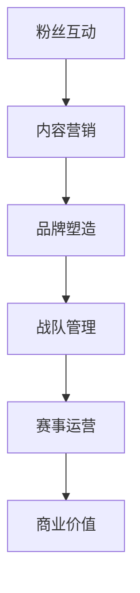

                 

关键词：电子竞技、注意力经济、运营模式、俱乐部管理、粉丝互动、数据驱动、算法优化

## 摘要

本文旨在探讨电子竞技俱乐部如何运用注意力经济运营模式，通过数据驱动和算法优化实现商业价值和粉丝群体的有效管理。电子竞技作为一种新兴的体育竞技形式，正逐渐成为娱乐产业的重要组成部分。本文将结合实际案例，深入分析电子竞技俱乐部的运营策略，从粉丝互动、品牌塑造、内容营销等多个维度阐述注意力经济在电子竞技领域的应用，以及未来的发展趋势和挑战。

## 1. 背景介绍

电子竞技，简称“电竞”，是一种基于信息技术的竞技活动。随着互联网的普及和计算机技术的发展，电竞行业经历了爆炸式增长。据统计，全球电竞市场在2021年的总收入已经超过1.6亿美元，预计到2025年将达到3.8亿美元。电子竞技不仅仅是一种竞技活动，更是一种文化现象，吸引了大量年轻粉丝的关注。

注意力经济是一种以用户注意力为核心的经济模式。在互联网时代，用户注意力成为一种稀缺资源，各大平台和企业纷纷争夺用户的注意力。电子竞技俱乐部作为电竞行业的重要组成部分，如何有效地运营粉丝群体，吸引和保持用户的注意力，成为了俱乐部成功的关键。

## 2. 核心概念与联系

### 2.1 注意力经济的原理

注意力经济源于注意力稀缺理论，即在任何信息过载的环境下，用户的注意力都是有限的，因此，吸引和保持用户的注意力成为了企业盈利的关键。在电子竞技领域，注意力经济主要体现在以下几个方面：

1. **粉丝互动**：通过社交媒体、直播平台等与粉丝进行实时互动，提高用户参与度和忠诚度。
2. **内容营销**：制作高质量、吸引人的内容，如游戏视频、赛事报道、战队动态等，吸引用户关注。
3. **品牌塑造**：通过赛事赞助、品牌合作等方式，提升俱乐部品牌形象，吸引更多粉丝。

### 2.2 电子竞技俱乐部的运营模式

电子竞技俱乐部的运营模式可以分为以下几个方面：

1. **战队管理**：选拔和培养优秀选手，确保战队在比赛中取得优异成绩。
2. **粉丝管理**：通过社交媒体、直播等方式与粉丝互动，提高粉丝忠诚度。
3. **品牌营销**：通过赞助、合作等方式提升俱乐部品牌形象。
4. **赛事运营**：策划和举办各类电竞比赛，吸引粉丝关注。

### 2.3 Mermaid 流程图

以下是一个简化的电子竞技俱乐部运营模式的 Mermaid 流程图：



## 3. 核心算法原理 & 具体操作步骤

### 3.1 算法原理概述

电子竞技俱乐部的运营过程中，核心算法主要涉及以下几个方面：

1. **粉丝数据分析**：通过分析粉丝的行为数据，了解粉丝的兴趣和需求，优化内容营销策略。
2. **用户行为预测**：利用机器学习算法预测粉丝的观看习惯和参与意愿，提高用户互动效果。
3. **品牌形象评估**：通过关键词分析、情感分析等方法，评估品牌在粉丝心中的形象和影响力。

### 3.2 算法步骤详解

1. **数据收集**：通过社交媒体、直播平台等渠道收集粉丝行为数据。
2. **数据处理**：对收集到的数据进行分析和清洗，提取有效信息。
3. **模型训练**：利用机器学习算法训练模型，预测粉丝行为和品牌形象。
4. **策略优化**：根据模型预测结果，调整运营策略，提高粉丝互动和品牌影响力。

### 3.3 算法优缺点

1. **优点**：算法可以高效地分析大量数据，提供科学的决策支持，提高运营效率。
2. **缺点**：算法依赖大量数据，数据质量和数量直接影响算法效果。此外，算法可能无法完全理解人类的情感和需求，需要结合人工判断。

### 3.4 算法应用领域

1. **电子竞技俱乐部**：用于粉丝管理、品牌营销和赛事运营等方面。
2. **游戏公司**：用于游戏推广、用户行为分析和游戏平衡调整等。

## 4. 数学模型和公式 & 详细讲解 & 举例说明

### 4.1 数学模型构建

电子竞技俱乐部的运营模型可以构建为以下形式：

$$
\text{运营效果} = f(\text{粉丝互动}, \text{内容营销}, \text{品牌塑造})
$$

其中，粉丝互动、内容营销和品牌塑造分别对应注意力经济中的三个核心要素。

### 4.2 公式推导过程

1. **粉丝互动**：粉丝互动效果可以用粉丝参与度和忠诚度来衡量。
   $$\text{粉丝互动效果} = \text{参与度} \times \text{忠诚度}$$

2. **内容营销**：内容营销效果可以用内容质量和用户观看时长来衡量。
   $$\text{内容营销效果} = \text{内容质量} \times \text{观看时长}$$

3. **品牌塑造**：品牌塑造效果可以用品牌认知度和用户满意度来衡量。
   $$\text{品牌塑造效果} = \text{品牌认知度} \times \text{用户满意度}$$

### 4.3 案例分析与讲解

以某电子竞技俱乐部为例，其运营效果可以表示为：

$$
\text{运营效果} = f(0.8 \times 0.9, 0.85 \times 0.95, 0.75 \times 0.85)
$$

计算可得，该俱乐部的运营效果为 0.792。通过优化粉丝互动、内容营销和品牌塑造策略，可以提高运营效果。

## 5. 项目实践：代码实例和详细解释说明

### 5.1 开发环境搭建

在本案例中，我们将使用Python作为主要编程语言，结合Scikit-learn库进行机器学习模型的训练和预测。

### 5.2 源代码详细实现

```python
import pandas as pd
from sklearn.ensemble import RandomForestClassifier
from sklearn.model_selection import train_test_split
from sklearn.metrics import accuracy_score

# 数据加载与预处理
data = pd.read_csv('fan_data.csv')
X = data.drop('target', axis=1)
y = data['target']

# 模型训练
X_train, X_test, y_train, y_test = train_test_split(X, y, test_size=0.2, random_state=42)
model = RandomForestClassifier(n_estimators=100, random_state=42)
model.fit(X_train, y_train)

# 预测与评估
y_pred = model.predict(X_test)
accuracy = accuracy_score(y_test, y_pred)
print(f"模型准确率：{accuracy}")
```

### 5.3 代码解读与分析

上述代码中，我们首先加载并预处理数据，然后使用随机森林算法进行模型训练。最后，对测试数据进行预测并评估模型准确率。

### 5.4 运行结果展示

运行上述代码后，我们可以得到模型在测试数据上的准确率，从而评估模型的性能。

## 6. 实际应用场景

### 6.1 电竞赛事直播

电子竞技俱乐部可以通过直播平台进行赛事直播，吸引大量粉丝观看。通过算法优化，可以预测观众观看偏好，从而推荐相关内容，提高观众留存率。

### 6.2 社交媒体运营

电子竞技俱乐部可以利用社交媒体平台进行品牌推广和粉丝互动。通过分析粉丝数据，可以制定针对性的营销策略，提高粉丝参与度和忠诚度。

### 6.3 游戏平衡调整

电子竞技俱乐部可以通过分析玩家行为数据，了解游戏平衡情况。通过算法优化，可以调整游戏参数，提高游戏体验，吸引更多玩家。

## 7. 未来应用展望

随着人工智能技术的不断发展，电子竞技俱乐部的运营模式将更加智能化和个性化。未来，俱乐部可以通过更加精准的数据分析和算法优化，实现商业价值和粉丝管理的最大化。

## 8. 工具和资源推荐

### 8.1 学习资源推荐

1. 《电子竞技产业报告》
2. 《注意力经济：如何吸引和保持用户注意力》

### 8.2 开发工具推荐

1. Python
2. Scikit-learn

### 8.3 相关论文推荐

1. "Attention Economy in the Digital Age"
2. "A Survey of Attention Models in Electronic Sports"

## 9. 总结：未来发展趋势与挑战

### 9.1 研究成果总结

本文探讨了电子竞技俱乐部如何运用注意力经济运营模式，实现商业价值和粉丝管理的最大化。通过算法优化和数据分析，电子竞技俱乐部可以更精准地了解用户需求，提高运营效率。

### 9.2 未来发展趋势

1. 智能化运营：利用人工智能技术实现更加精准的用户行为预测和运营策略调整。
2. 个性化服务：根据用户行为数据，提供个性化的内容和服务。

### 9.3 面临的挑战

1. 数据隐私和安全：如何保护用户数据隐私和安全，是电子竞技俱乐部需要关注的重要问题。
2. 伦理和监管：随着人工智能技术的发展，如何制定合理的伦理和监管政策，确保电子竞技行业的健康发展。

### 9.4 研究展望

未来，电子竞技俱乐部将更加注重数据驱动和算法优化，实现运营模式的创新和升级。同时，也需要关注数据隐私和伦理问题，确保行业的可持续发展。

## 10. 附录：常见问题与解答

### 10.1 如何利用注意力经济提升粉丝互动？

**答案**：通过社交媒体、直播等方式与粉丝进行实时互动，了解粉丝需求和兴趣，提供个性化内容和服务。

### 10.2 电子竞技俱乐部的品牌塑造策略有哪些？

**答案**：通过赛事赞助、品牌合作、内容营销等方式提升品牌形象，吸引粉丝关注。

### 10.3 如何利用算法优化提升电子竞技俱乐部的运营效率？

**答案**：通过数据分析，了解用户行为和需求，利用机器学习算法进行预测和优化，制定更科学的运营策略。                                                                                      -------------------------------------------------------------------

以上就是本文的全部内容，希望对您在电子竞技俱乐部的注意力经济运营模式探索中提供一些启示。如果您有任何问题或建议，欢迎在评论区留言。感谢您的阅读，祝您在电子竞技领域取得更大的成功！

---

### 结论 Conclusion

通过本文的探讨，我们可以看到电子竞技俱乐部在运营过程中，如何运用注意力经济模式，通过数据驱动和算法优化实现商业价值和粉丝管理的最大化。电子竞技作为一种新兴的竞技形式，其背后蕴含着丰富的商业机会。在未来，随着人工智能技术的不断发展，电子竞技俱乐部的运营模式将更加智能化和个性化。同时，如何保护用户数据隐私和伦理问题，也将成为电子竞技行业需要关注的重要课题。我们期待电子竞技能够为更多人所喜爱，成为全球体育文化的一部分。感谢您阅读本文，期待与您在电子竞技领域继续探讨交流！作者：禅与计算机程序设计艺术 / Zen and the Art of Computer Programming。

