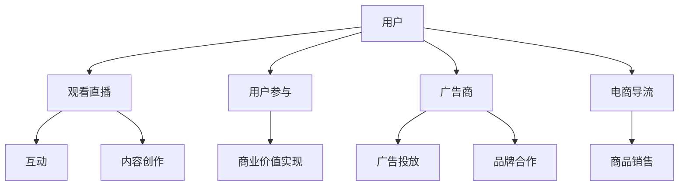

                 

关键词：直播经济，注意力经济，用户参与，互动，内容创作，商业化

> 摘要：本文探讨了直播经济这一新兴商业模式，分析了其核心概念、原理和应用，探讨了直播经济的价值创造过程、商业模式的演变以及面临的挑战和机遇。文章旨在为读者提供一个全面的视角，以了解和把握这一新兴的注意力变现方式。

## 1. 背景介绍

随着互联网技术的飞速发展，尤其是移动设备的普及，直播已经成为大众娱乐和社交的重要组成部分。而直播经济，作为一种新兴的商业模式，正逐渐成为企业获取用户关注和实现商业价值的重要途径。直播经济的本质是通过直播活动吸引用户注意力，从而实现商品或服务的推广和销售。

直播经济的兴起可以追溯到2016年左右，当时以斗鱼、虎牙为代表的直播平台开始崛起。随着直播内容的多样化，直播经济也逐渐从游戏直播向其他领域扩展，如电商直播、教育直播、医疗直播等。直播经济的快速发展，不仅改变了传统的内容消费模式，也带动了相关产业链的发展，如直播设备制造、内容制作、广告营销等。

### 1.1 直播经济的发展历程

直播经济的起源可以追溯到20世纪90年代的在线游戏直播。当时，一些游戏爱好者开始通过互联网直播自己的游戏过程，吸引了其他玩家的关注。这一现象在21世纪初的博客时代进一步发展，随着视频分享平台的兴起，如YouTube和DailyMotion，用户可以更方便地观看和分享视频内容。

进入移动互联网时代，直播平台如雨后春笋般涌现，用户可以通过手机随时随地观看和参与直播活动。直播内容的多样性使得直播平台吸引了越来越多的用户，直播经济的规模也逐渐扩大。

### 1.2 直播经济的主要特点

直播经济具有以下主要特点：

1. **实时互动性**：直播是一种实时传播的方式，用户可以与主播进行实时互动，提出问题或表达观点，这种互动性增加了用户的参与度和粘性。
   
2. **内容多样性**：直播内容涵盖了游戏、娱乐、教育、医疗、购物等多个领域，满足了不同用户群体的需求。

3. **用户参与度高**：用户不仅是内容的消费者，还可以成为内容的创作者和传播者，这种参与度使得直播内容更具活力和吸引力。

4. **商业模式创新**：直播经济带动了多种商业模式的创新，如电商直播、知识付费、广告合作等。

## 2. 核心概念与联系

为了更好地理解直播经济，我们需要先了解其核心概念和原理，并借助Mermaid流程图展示其架构。

### 2.1 核心概念

- **直播平台**：提供直播服务的平台，如斗鱼、虎牙、抖音等。
- **主播**：进行直播的用户，可以是个人或团队。
- **用户**：观看直播、参与互动的人。
- **内容**：直播过程中展示的各种信息和活动。

### 2.2 直播经济原理和架构



### 2.3 核心概念原理

- **用户参与**：用户通过观看直播、发表评论、打赏、分享等方式参与直播活动，增加了互动性和参与感。
- **内容创作**：主播通过直播活动创造内容，内容的质量和吸引力直接影响用户的参与度。
- **商业价值实现**：通过广告、电商导流、知识付费等方式实现商业价值，这是直播经济的核心目标。

## 3. 核心算法原理 & 具体操作步骤

### 3.1 算法原理概述

直播经济的核心算法原理是基于用户行为分析和数据挖掘技术。通过分析用户的行为数据，如观看时长、互动频率、消费能力等，可以更好地了解用户需求，从而实现精准的内容推送和商业价值的最大化。

### 3.2 算法步骤详解

1. **数据收集**：收集用户在直播平台上的行为数据，如观看记录、互动记录、消费记录等。
   
2. **数据预处理**：对收集到的数据进行清洗和整合，确保数据的质量和一致性。

3. **特征提取**：从预处理后的数据中提取有用的特征，如用户活跃度、观看时长、消费能力等。

4. **模型训练**：利用机器学习算法，如协同过滤、决策树、神经网络等，对提取的特征进行训练，建立用户行为预测模型。

5. **模型评估**：通过交叉验证、A/B测试等方法，评估模型的准确性和泛化能力。

6. **结果应用**：将训练好的模型应用于实际场景，如用户推荐、内容推送、广告投放等。

### 3.3 算法优缺点

- **优点**：能够实现精准的用户行为预测和内容推送，提高用户参与度和商业价值。
- **缺点**：数据质量和算法性能直接影响预测结果的准确性，且算法模型需要不断更新和优化。

### 3.4 算法应用领域

直播经济的核心算法主要应用于以下领域：

1. **用户推荐**：通过分析用户行为数据，为用户推荐感兴趣的内容和主播。
   
2. **内容推送**：根据用户行为数据和内容特征，实现个性化内容推送。

3. **广告投放**：根据用户行为和兴趣，实现精准的广告投放。

4. **商品销售**：通过直播活动，实现商品的销售和推广。

## 4. 数学模型和公式 & 详细讲解 & 举例说明

### 4.1 数学模型构建

直播经济的核心数学模型主要包括用户行为模型、内容推荐模型和广告投放模型。

#### 用户行为模型

$$
User\ Behavior\ Model = f(User\ Features, Content\ Features, Time)
$$

其中，User Features包括用户年龄、性别、兴趣爱好等；Content Features包括内容类型、主播风格、观看时长等；Time表示当前时间。

#### 内容推荐模型

$$
Content\ Recommendation\ Model = f(User\ Behavior\ Model, Content\ Features)
$$

该模型根据用户的行为数据和内容特征，为用户推荐感兴趣的内容。

#### 广告投放模型

$$
Ad\ Placement\ Model = f(User\ Behavior\ Model, Ad\ Features)
$$

该模型根据用户的行为数据和广告特征，实现精准的广告投放。

### 4.2 公式推导过程

用户行为模型的推导基于用户行为数据的相关性分析。首先，通过统计用户观看内容的历史数据，提取用户的行为特征。然后，利用统计学方法，如回归分析，建立用户行为模型。

内容推荐模型的推导基于协同过滤算法。首先，计算用户与内容的相似度矩阵。然后，利用用户与内容的相似度，为用户推荐相似的内容。

广告投放模型的推导基于贝叶斯优化算法。首先，计算用户对广告的点击率。然后，利用贝叶斯优化，调整广告的投放策略。

### 4.3 案例分析与讲解

#### 案例一：用户推荐

假设用户A喜欢观看科技类直播，最近他观看了关于人工智能的直播。根据用户行为模型，我们可以为他推荐以下内容：

- 人工智能基础知识
- 人工智能应用案例
- 人工智能行业发展趋势

#### 案例二：广告投放

假设广告商B希望投放关于智能家居的广告。根据广告投放模型，我们可以分析用户A的兴趣和行为，选择合适的投放时间、渠道和内容，以提高广告的点击率和转化率。

## 5. 项目实践：代码实例和详细解释说明

### 5.1 开发环境搭建

在开始代码实现之前，我们需要搭建一个合适的开发环境。以下是基本的开发环境要求：

- 操作系统：Windows、Linux或macOS
- 编程语言：Python
- 数据库：MySQL或MongoDB
- 直播平台API：斗鱼、虎牙或抖音的API

### 5.2 源代码详细实现

以下是一个简单的用户推荐系统的代码实现示例：

```python
# 导入必要的库
import pandas as pd
import numpy as np
from sklearn.model_selection import train_test_split
from sklearn.metrics.pairwise import cosine_similarity
from sklearn.neighbors import NearestNeighbors

# 加载数据
user_data = pd.read_csv('user_data.csv')
content_data = pd.read_csv('content_data.csv')

# 数据预处理
# ...（数据清洗、特征提取等）

# 计算内容相似度矩阵
content_similarity = cosine_similarity(content_data[['content_type', 'host_style']], content_data[['content_type', 'host_style']])

# 训练用户行为模型
# ...（特征工程、模型训练等）

# 构建推荐系统
neighb

