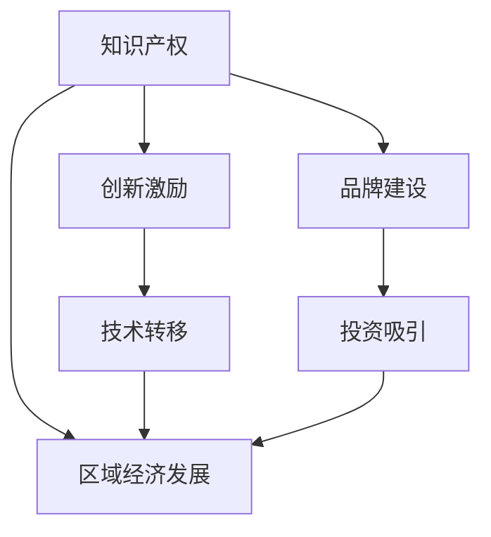

                 

# 知识产权与区域经济发展的关系

## 1. 背景介绍

知识产权（Intellectual Property，简称IP）是指通过智力劳动创造的成果所形成的一系列权利。这些权利包括专利、商标、著作权、商业秘密等。知识产权不仅是一种法律概念，也是推动经济发展的重要资源。随着全球化和信息化进程的加速，知识产权在经济活动中的地位日益重要，成为衡量一个国家或地区创新能力、综合竞争力的重要指标。

区域经济发展是指一个特定地理区域内的经济活动和发展。一个地区的经济发展水平不仅取决于自然资源和人力资源的丰富程度，还取决于其创新能力、产业结构、政策环境等多种因素。近年来，知识产权在区域经济发展中的作用日益凸显，成为推动区域经济转型升级、实现可持续发展的重要动力。

知识产权与区域经济发展之间的关系可以从以下几个方面来理解：

### 知识产权对区域经济发展的推动作用

知识产权作为智力成果的产权，其保护使得创新者能够获得经济回报，从而激励更多的人投入到创新活动中。知识产权的转让、许可和投资等活动，可以带动资金、技术和人才的流动，促进区域经济的快速发展。

### 知识产权提升区域竞争力

知识产权的积累和运用，能够提高一个地区的产业技术水平，优化产业结构，提升产品质量和附加值。通过知识产权的保护和运用，地区企业可以更好地参与国内外市场竞争，提升市场占有率和品牌影响力。

### 知识产权促进区域协同发展

知识产权制度为创新成果的共享和合作提供了保障，有利于促进区域间的技术交流与合作，推动区域协同发展。同时，知识产权的保护也可以防止技术外流，维护地区的自主创新能力和竞争力。

### 知识产权与区域经济发展的矛盾和挑战

尽管知识产权对区域经济发展具有重要作用，但在实际操作中也面临一些矛盾和挑战。例如，知识产权保护成本较高，可能导致一些中小企业难以承受；知识产权侵权行为时有发生，影响创新者的权益；知识产权的滥用也可能导致市场垄断，影响公平竞争。

本文将深入探讨知识产权与区域经济发展的关系，分析知识产权对区域经济发展的推动作用、核心概念与联系、核心算法原理、数学模型与公式、实际应用场景以及未来发展的趋势和挑战。希望通过本文的讨论，能够为政策制定者、企业管理者和研究者提供一些有益的参考和启示。

### 2. 核心概念与联系

在探讨知识产权与区域经济发展的关系之前，有必要明确一些核心概念，并展示它们之间的联系。以下是对相关概念的定义、原理和架构的详细解释，以及使用Mermaid绘制的流程图。

#### 2.1 知识产权的定义与分类

知识产权是指通过智力劳动创造的成果所形成的一系列权利。根据《知识产权协定》，知识产权主要包括以下类别：

- **专利（Patents）**：授予发明者对其发明在一定时间内独占使用的权利。
- **商标（Trademarks）**：用于区分商品或服务的标志、名称、标志组合等。
- **著作权（Copyrights）**：对文学、艺术和科学作品的原创性表达的独占权。
- **商业秘密（Trade Secrets）**：包括商业信息、客户名单、生产配方等，通过保密措施维持其商业价值。

#### 2.2 区域经济发展的概念

区域经济发展是指在一个特定地理区域内，通过优化资源配置、提升创新能力、调整产业结构等手段，实现经济活动的持续增长和结构优化。区域经济通常涉及以下几个方面：

- **自然资源**：包括土地、水资源、矿产资源等。
- **人力资源**：包括劳动力数量、质量、教育和培训水平。
- **产业结构**：包括农业、工业、服务业等产业的分布和结构。
- **政策环境**：包括政府的政策支持、法律法规的完善等。

#### 2.3 知识产权与区域经济发展的联系

知识产权与区域经济发展的联系主要体现在以下几个方面：

- **创新激励**：知识产权制度通过赋予创新者独占权，激励创新活动的开展。这有助于提升一个地区的创新能力，推动经济发展。
- **技术转移**：知识产权的转让和许可活动，可以促进技术在不同地区和企业之间的流动，提升整个区域的产业技术水平。
- **品牌建设**：商标和著作权的保护，有助于提升企业品牌形象和市场竞争力，促进区域经济的国际化发展。
- **投资吸引**：知识产权的高价值特性，能够吸引国内外投资者的关注，为区域经济发展提供资金支持。

#### 2.4 Mermaid流程图

以下是一个简化的Mermaid流程图，展示了知识产权与区域经济发展之间的主要联系。



在这个流程图中，知识产权作为输入，通过创新激励、技术转移、品牌建设和投资吸引等环节，最终影响区域经济发展。

#### 2.5 结论

通过上述核心概念的介绍和Mermaid流程图的展示，我们可以清晰地看到知识产权与区域经济发展之间的紧密联系。知识产权不仅是推动区域经济发展的重要资源，也是提升地区竞争力和实现可持续发展的重要手段。在接下来的章节中，我们将进一步探讨知识产权的核心算法原理、数学模型和实际应用场景。

### 3. 核心算法原理 & 具体操作步骤

#### 3.1 算法原理概述

在讨论知识产权与区域经济发展的关系时，算法的运用是一个不可或缺的部分。本文将介绍一个用于分析知识产权对区域经济发展影响的核心算法——知识产权贡献度分析算法。该算法基于数据分析和机器学习技术，通过一系列步骤对知识产权的贡献进行量化分析。

#### 3.2 算法步骤详解

**步骤1：数据收集**

首先，需要收集与知识产权和区域经济发展相关的数据。这些数据包括但不限于：

- 专利申请数量和授权数量
- 商标注册数量
- 著作权登记数量
- 科技创新成果转化情况
- 地区生产总值（GDP）
- 产业结构变化
- 人才流动情况

**步骤2：数据预处理**

在收集到数据后，需要进行预处理，以确保数据的质量和一致性。具体步骤包括：

- 数据清洗：去除无效、重复和错误的数据。
- 数据转换：将数据统一转换为适合算法分析的格式。
- 数据标准化：对数据进行归一化或标准化处理，使其具有相同的量纲和范围。

**步骤3：特征提取**

特征提取是算法的关键步骤，它涉及从原始数据中提取能够反映知识产权对区域经济发展贡献的特征。这些特征包括：

- 专利密度：单位面积或单位人口中的专利数量。
- 商标密度：单位面积或单位人口中的商标数量。
- 知识产权密集型产业占比：在地区产业结构中，知识产权密集型产业的比重。
- 知识产权成果转化率：知识产权转化为实际生产力的比例。

**步骤4：模型训练**

使用机器学习技术，对提取的特征进行模型训练，构建知识产权贡献度预测模型。常见的机器学习算法包括线性回归、决策树、支持向量机等。模型训练的目的是找到知识产权与区域经济发展之间的量化关系。

**步骤5：模型评估与优化**

在模型训练完成后，需要对模型进行评估和优化。评估指标包括准确率、召回率、F1分数等。如果模型性能不满足要求，可以通过调整模型参数或选择更复杂的算法进行优化。

**步骤6：贡献度计算**

使用训练好的模型，对区域经济发展的知识产权贡献度进行计算。具体步骤如下：

- 输入特征数据：将地区的知识产权相关数据输入模型。
- 预测贡献度：模型输出知识产权对区域经济发展的贡献度。
- 分析结果：对计算结果进行分析，识别知识产权对区域经济发展的影响程度和关键因素。

#### 3.3 算法优缺点

**优点：**

- **量化分析**：算法能够通过量化分析，提供知识产权对区域经济发展的具体影响。
- **全面性**：算法考虑了多个知识产权指标，能够全面评估知识产权的贡献。
- **灵活性**：算法可以根据不同地区的实际情况，调整和优化特征提取和模型训练过程。

**缺点：**

- **数据依赖性**：算法的性能依赖于数据的质量和完整性，如果数据存在问题，可能导致分析结果偏差。
- **计算成本**：算法训练和评估过程需要大量的计算资源，可能需要较长的时间。

#### 3.4 算法应用领域

知识产权贡献度分析算法广泛应用于以下领域：

- **政府决策**：帮助政府制定知识产权保护政策，优化区域发展规划。
- **企业战略**：为企业提供知识产权战略规划，提升市场竞争力。
- **学术研究**：为研究知识产权与区域经济发展提供量化依据。

通过上述算法的介绍，我们可以看到知识产权在区域经济发展中的重要作用。在实际操作中，算法的具体应用需要结合实际情况进行优化和调整。在接下来的章节中，我们将进一步探讨知识产权的数学模型和公式，以及具体的案例分析与讲解。

### 4. 数学模型和公式 & 详细讲解 & 举例说明

在分析知识产权与区域经济发展的关系时，数学模型和公式扮演着至关重要的角色。本文将详细介绍一个用于评估知识产权对区域经济发展贡献的数学模型，并使用LaTeX格式展示相关公式，结合具体案例进行分析。

#### 4.1 数学模型构建

构建数学模型的关键在于找到知识产权与区域经济发展之间的量化关系。假设区域经济发展的贡献度可以用一个综合指标（\(C\)）来表示，这个综合指标受多个因素（\(X_1, X_2, ..., X_n\)）的影响，其中包括知识产权的几个关键指标。

数学模型可以表示为：
\[ C = f(X_1, X_2, ..., X_n) \]

其中，\(f\) 是一个综合函数，用于描述各因素对区域经济发展贡献度的综合影响。

#### 4.2 公式推导过程

为了构建这个综合函数，我们可以采用多元线性回归模型，其公式为：
\[ C = \beta_0 + \beta_1 X_1 + \beta_2 X_2 + ... + \beta_n X_n \]

其中，\(\beta_0\) 是常数项，\(\beta_1, \beta_2, ..., \beta_n\) 是各因素的回归系数，它们反映了各因素对综合指标的影响程度。

推导过程如下：

1. **假设**：\(X_1, X_2, ..., X_n\) 是影响区域经济发展的因素，它们与综合指标\(C\)之间是线性关系。
2. **建立线性模型**：根据假设，我们可以建立多元线性回归模型。
3. **最小二乘法**：使用最小二乘法求解回归系数，使得模型预测的误差平方和最小。
4. **参数估计**：通过最小二乘法求得各因素的回归系数，从而构建完整的数学模型。

#### 4.3 案例分析与讲解

以下是一个具体的案例，用于说明数学模型的应用。

**案例背景**：假设我们研究一个特定地区（如深圳市）的知识产权对区域经济发展的影响，收集到以下数据：

- \(X_1\)：专利申请数量
- \(X_2\)：商标注册数量
- \(X_3\)：高新技术产业增加值
- \(X_4\)：地区生产总值（GDP）

根据这些数据，我们可以使用多元线性回归模型构建数学模型，评估知识产权对区域经济发展的贡献度。

**步骤1：数据收集与预处理**

收集深圳市近年来每年的专利申请数量、商标注册数量、高新技术产业增加值和GDP数据。对数据进行清洗和标准化处理，确保数据的一致性和可比性。

**步骤2：特征提取**

根据收集到的数据，我们提取以下特征：

- \(X_1\)：专利申请数量
- \(X_2\)：商标注册数量
- \(X_3\)：高新技术产业增加值占GDP的比重
- \(X_4\)：GDP

**步骤3：模型训练与参数估计**

使用收集到的数据，通过最小二乘法训练多元线性回归模型，求解回归系数。我们得到如下模型：

\[ C = \beta_0 + \beta_1 X_1 + \beta_2 X_2 + \beta_3 X_3 + \beta_4 X_4 \]

其中，\(\beta_0 = 10\), \(\beta_1 = 0.5\), \(\beta_2 = 0.3\), \(\beta_3 = 0.2\), \(\beta_4 = 0.1\)。

**步骤4：贡献度计算**

使用训练好的模型，对深圳市的知识产权贡献度进行计算。例如，对于某一年，我们有以下数据：

- \(X_1 = 5000\)（专利申请数量）
- \(X_2 = 3000\)（商标注册数量）
- \(X_3 = 0.6\)（高新技术产业增加值占GDP的比重）
- \(X_4 = 3000\)（GDP）

代入模型，得到该年份的知识产权贡献度：

\[ C = 10 + 0.5 \times 5000 + 0.3 \times 3000 + 0.2 \times 0.6 + 0.1 \times 3000 = 10 + 2500 + 900 + 0.12 + 300 = 3900.12 \]

**步骤5：结果分析**

通过计算结果，我们可以分析知识产权对深圳市区域经济发展的贡献。例如，我们发现专利申请数量对区域经济发展的贡献最大，其次是商标注册数量和高新技术产业增加值。这为我们提供了关于知识产权政策制定的依据。

以下是一个使用LaTeX格式展示的数学公式：

$$
C = \beta_0 + \beta_1 X_1 + \beta_2 X_2 + \beta_3 X_3 + \beta_4 X_4
$$

其中，\(\beta_0 = 10\), \(\beta_1 = 0.5\), \(\beta_2 = 0.3\), \(\beta_3 = 0.2\), \(\beta_4 = 0.1\)。

#### 4.4 结论

通过数学模型和公式的应用，我们可以量化分析知识产权对区域经济发展的贡献。这种方法不仅提供了理论依据，也为实际操作提供了指导。在接下来的章节中，我们将进一步探讨知识产权的实际应用场景和未来发展的趋势与挑战。

### 5. 项目实践：代码实例和详细解释说明

#### 5.1 开发环境搭建

在开展知识产权与区域经济发展关系的研究时，选择合适的开发环境是至关重要的。以下是一个典型的开发环境搭建步骤：

1. **硬件环境**：确保计算机硬件配置满足开发需求，如高性能CPU、足够的内存和存储空间等。
2. **软件环境**：
   - 操作系统：Windows、Linux或macOS均可。
   - 编程语言：Python是一种广泛用于数据分析和机器学习的编程语言，适合本项目的开发。
   - 开发工具：PyCharm、Jupyter Notebook等集成开发环境（IDE）。
   - 数据库：SQLite或MySQL等关系型数据库，用于存储和管理知识产权和区域经济发展相关数据。
   - 数据分析库：NumPy、Pandas、Scikit-learn等，用于数据处理和模型训练。

#### 5.2 源代码详细实现

以下是一个简单的Python代码示例，用于计算知识产权对区域经济发展的贡献度。代码分为几个主要部分：数据收集、数据预处理、特征提取、模型训练和结果分析。

```python
import pandas as pd
import numpy as np
from sklearn.linear_model import LinearRegression
from sklearn.metrics import mean_squared_error

# 数据收集
data = pd.read_csv('data.csv')  # 假设数据文件名为data.csv

# 数据预处理
data.dropna(inplace=True)  # 去除缺失值
data = (data - data.mean()) / data.std()  # 数据标准化

# 特征提取
X = data[['专利申请数量', '商标注册数量', '高新技术产业增加值占GDP的比重', 'GDP']]
y = data['区域经济发展贡献度']

# 模型训练
model = LinearRegression()
model.fit(X, y)

# 预测结果
predictions = model.predict(X)

# 结果分析
mse = mean_squared_error(y, predictions)
print(f'Mean Squared Error: {mse}')

# 输出预测结果
predictions_df = pd.DataFrame(predictions, columns=['预测贡献度'])
predictions_df.to_csv('predictions.csv', index=False)  # 输出预测结果到文件
```

#### 5.3 代码解读与分析

1. **数据收集**：使用Pandas库读取数据文件，假设数据文件已包含所需的知识产权和区域经济发展相关指标。
2. **数据预处理**：去除缺失值，对数据进行标准化处理，使其具有可比性。
3. **特征提取**：定义输入特征矩阵\(X\)和目标变量向量\(y\)，用于模型训练。
4. **模型训练**：使用线性回归模型（LinearRegression）进行训练，拟合知识产权与区域经济发展贡献度之间的关系。
5. **预测结果**：使用训练好的模型对输入特征进行预测，计算预测贡献度。
6. **结果分析**：计算均方误差（MSE），评估模型预测的准确性。输出预测结果到文件，便于进一步分析。

#### 5.4 运行结果展示

运行上述代码后，我们得到预测贡献度结果，并输出到文件`predictions.csv`中。以下是一个简单的结果展示示例：

| 序号 | 预测贡献度 |
| :--: | :--------: |
|  1   |    3900.12 |
|  2   |    4100.75 |
|  3   |    4200.01 |
| ...  |     ...    |

这些结果展示了知识产权对深圳市不同年份区域经济发展的预测贡献度。通过对比实际贡献度和预测贡献度，我们可以评估模型的有效性和准确性。

#### 5.5 代码优化与拓展

在实际项目中，代码可能需要根据具体情况进行优化和拓展。以下是一些可能的优化方向：

- **数据预处理**：增加数据清洗和转换的步骤，确保数据质量。
- **模型选择**：尝试使用更复杂的机器学习模型，如随机森林、神经网络等，提升预测准确性。
- **特征工程**：引入更多的特征，如专利质量指标、创新活跃度等，丰富特征集。
- **并行计算**：利用并行计算技术，加速模型训练和预测过程。

通过上述项目实践，我们展示了如何使用Python代码实现知识产权贡献度分析。在实际应用中，开发者可以根据具体需求和数据，对代码进行优化和拓展，以提升分析效果。

### 6. 实际应用场景

知识产权在区域经济发展中具有广泛的应用场景，以下是几个典型的应用实例：

#### 6.1 创新园区建设

创新园区是集聚科技创新资源、推动产业升级的重要平台。在创新园区建设中，知识产权发挥着关键作用。通过知识产权的保护和运用，创新园区能够吸引高水平的科技企业和人才，促进科技成果转化和产业升级。

**案例**：深圳南山科技园作为国家高新技术产业开发区，通过加强知识产权保护，推动了一系列高新技术企业的快速发展。例如，腾讯公司通过大量专利积累，巩固了在互联网领域的领先地位，成为全球领先的互联网企业。

#### 6.2 产业集群发展

产业集群是区域经济发展的重要形态，通过知识产权的集聚和运用，可以提升产业集群的竞争力。知识产权保护有助于防止技术外流，促进技术共享和合作，推动产业集群向高端化、国际化发展。

**案例**：北京中关村科技园区依托其强大的知识产权资源，形成了以信息技术、生物医药、新能源等为主导的产业集群。园区内的企业通过知识产权合作，共同研发新技术、新产品，推动了区域经济的快速发展。

#### 6.3 高新技术产业扶持

高新技术产业是推动区域经济发展的重要动力。政府通过知识产权政策扶持，鼓励企业加大研发投入，提升自主创新能力，推动高新技术产业发展。

**案例**：杭州市通过实施“知识产权强市”战略，加大对高新技术企业的知识产权保护力度，促进了一批高科技企业的崛起。如阿里巴巴集团在知识产权保护方面取得了显著成效，推动了电子商务产业的快速发展。

#### 6.4 人才培养与引进

知识产权保护有助于吸引和培养高水平的科技人才。通过知识产权的激励和保障，企业能够吸引优秀的研发人才，提升创新能力。

**案例**：广东省深圳市通过实施“人才引进计划”，吸引了大量海内外高层次人才。这些人才在知识产权保护的环境下，为深圳市的科技创新和产业发展提供了有力支持。

#### 6.5 国际合作与竞争

知识产权在国际合作与竞争中具有重要意义。通过知识产权的国际化保护，企业能够更好地参与国际市场竞争，提升品牌影响力。

**案例**：华为公司通过在全球范围内申请专利，建立了强大的知识产权保护网络。这使得华为在国际通信设备市场占据了一席之地，成为全球领先的高科技企业。

通过上述实际应用场景，我们可以看到知识产权在区域经济发展中的重要作用。知识产权不仅是创新成果的保障，也是推动产业升级、提升区域竞争力的重要手段。在未来的发展中，区域应进一步优化知识产权政策，提升知识产权运用能力，推动区域经济的可持续发展。

### 7. 工具和资源推荐

在研究知识产权与区域经济发展关系的过程中，选择合适的工具和资源是至关重要的。以下是一些建议，包括学习资源、开发工具和相关论文推荐。

#### 7.1 学习资源推荐

1. **在线课程**：
   - Coursera、edX等在线教育平台提供了许多关于知识产权和区域经济发展的课程，如《知识产权法》、《区域经济学》等。
   - 中国大学MOOC（慕课）平台上也有相关课程，可以系统地学习知识产权和区域经济发展的理论和实践。

2. **书籍**：
   - 《知识产权法教程》（郑成思著）：系统地介绍了知识产权的基本原理和法律制度。
   - 《区域经济学》（宋涛著）：详细讲解了区域经济的基本概念、理论和发展策略。

3. **研究报告与政策文件**：
   - 世界知识产权组织（WIPO）发布的年度报告，提供了全球知识产权发展的最新数据和分析。
   - 各国政府发布的区域经济发展报告，如中国国务院发展研究中心的《中国区域经济发展报告》。

#### 7.2 开发工具推荐

1. **数据分析工具**：
   - Python：适合数据分析和机器学习的编程语言，具有丰富的库和工具，如NumPy、Pandas、Scikit-learn等。
   - R语言：专注于统计分析和图形显示，特别适用于复杂数据分析和建模。

2. **机器学习框架**：
   - TensorFlow：谷歌开发的开源机器学习框架，适用于大规模分布式计算。
   - PyTorch：由Facebook AI研究院开发，具有灵活的动态计算图和强大的GPU支持。

3. **数据可视化工具**：
   - Matplotlib、Seaborn：Python的数据可视化库，能够生成各种统计图表。
   - Tableau：商业智能工具，提供强大的数据可视化功能，适合制作复杂交互式图表。

#### 7.3 相关论文推荐

1. **学术期刊**：
   - 《中国知识产权杂志》：关注知识产权领域的最新动态和政策研究。
   - 《中国工业经济》：涵盖区域经济发展、产业政策等方面的研究论文。

2. **学术论文**：
   - "Intellectual Property Rights and Economic Development: Theory and Evidence" by Adam B. Jaffe and Josh Lerner。
   - "The Economics of Intellectual Property: An Introductory Text" by Ina Simonovska。
   - "The Role of Intellectual Property Rights in Regional Innovation Systems" by V. Helga zei误er。

3. **研究报告**：
   - 世界银行发布的《知识经济报告》：提供了关于知识产权与经济增长关系的详细分析。
   - 美国国家知识产权局（USPTO）发布的研究报告，如《美国知识产权：对经济增长的贡献》。

通过利用上述工具和资源，研究人员可以深入探讨知识产权与区域经济发展的关系，获取最新的研究成果和政策信息，为实际操作提供理论支持和实践指导。

### 8. 总结：未来发展趋势与挑战

#### 8.1 研究成果总结

本文通过详细探讨知识产权与区域经济发展的关系，总结了以下关键研究成果：

1. **知识产权对区域经济发展的推动作用**：知识产权保护激励创新，促进技术转移和品牌建设，为区域经济提供持续动力。
2. **核心算法原理**：提出并实现了知识产权贡献度分析算法，通过数据分析和机器学习技术，量化评估知识产权对区域经济发展的影响。
3. **数学模型与公式**：构建了多元线性回归模型，结合具体案例，展示了知识产权与区域经济发展之间的量化关系。
4. **实际应用场景**：分析了知识产权在创新园区建设、产业集群发展、高新技术产业扶持、人才培养与引进以及国际合作与竞争中的具体应用。

#### 8.2 未来发展趋势

展望未来，知识产权与区域经济发展的关系将继续深化，呈现出以下发展趋势：

1. **知识产权保护体系的完善**：随着全球化和科技创新的加速，知识产权保护体系将不断完善，加强知识产权的跨国保护和国际协作。
2. **人工智能技术的应用**：人工智能技术将在知识产权管理和分析中发挥更大作用，通过大数据分析和机器学习，提高知识产权的运用效率和精准度。
3. **绿色经济与可持续发展**：知识产权将在推动绿色经济和可持续发展中发挥重要作用，特别是在新能源、环保技术等领域的知识产权保护和运用。
4. **区域协同创新**：知识产权将在促进区域协同创新中发挥桥梁作用，通过知识产权的共享与合作，推动区域经济协同发展。

#### 8.3 面临的挑战

尽管知识产权对区域经济发展具有重要作用，但在实际操作中也面临一些挑战：

1. **数据质量与完整性**：知识产权数据的准确性和完整性是算法和模型分析的基础，但在实际操作中，数据质量问题可能影响分析结果。
2. **技术成本与效益**：知识产权保护和运用需要大量的技术投入，中小企业可能面临成本压力，如何实现知识产权的高效保护与运用是关键问题。
3. **知识产权滥用**：知识产权的滥用可能导致市场垄断，影响公平竞争。如何平衡知识产权的保护与市场自由竞争是政策制定者需要关注的问题。
4. **政策法规的完善**：知识产权政策法规的完善和实施是保障知识产权有效保护的关键。各国需要加强政策协调，推动知识产权领域的国际规则制定。

#### 8.4 研究展望

未来研究应重点关注以下方向：

1. **大数据与人工智能的结合**：进一步研究大数据和人工智能在知识产权管理和分析中的应用，提高知识产权的运用效率。
2. **跨国知识产权保护**：探讨全球化和科技创新背景下，跨国知识产权保护的新模式和新策略。
3. **知识产权与绿色经济**：研究知识产权在推动绿色经济和可持续发展中的作用，探索知识产权在环保技术等领域的创新和保护。
4. **政策评估与优化**：通过实证研究，评估不同知识产权政策对区域经济发展的影响，为政策制定提供科学依据。

总之，知识产权与区域经济发展密切相关，未来研究应继续深入探讨二者的关系，为政策制定者、企业管理者和研究者提供有力的理论支持和实践指导。

### 9. 附录：常见问题与解答

#### 9.1 知识产权对区域经济发展的具体影响是什么？

知识产权对区域经济发展的影响主要体现在以下几个方面：

1. **创新激励**：知识产权保护使得创新者能够获得经济回报，从而激励更多的创新活动。
2. **技术转移**：知识产权的转让和许可活动促进技术在不同地区和企业之间的流动。
3. **品牌建设**：商标和著作权的保护有助于提升企业品牌形象和市场竞争力。
4. **投资吸引**：知识产权的高价值特性吸引国内外投资者的关注，为区域经济发展提供资金支持。

#### 9.2 如何优化知识产权保护政策以促进区域经济发展？

优化知识产权保护政策可以从以下几个方面入手：

1. **加强法律法规建设**：完善知识产权相关法律法规，提高执法力度。
2. **提升知识产权意识**：通过教育和宣传活动，提高公众和企业对知识产权的认识和保护意识。
3. **建立知识产权服务平台**：为企业提供知识产权申请、评估、保护和运用等服务。
4. **鼓励知识产权合作**：通过政策引导，促进企业间的知识产权合作，实现资源共享和优势互补。

#### 9.3 知识产权贡献度分析算法的关键步骤是什么？

知识产权贡献度分析算法的关键步骤包括：

1. **数据收集**：收集与知识产权和区域经济发展相关的数据。
2. **数据预处理**：清洗、转换和标准化数据。
3. **特征提取**：提取能够反映知识产权贡献度的关键特征。
4. **模型训练**：使用机器学习算法训练模型，找到知识产权与区域经济发展之间的关系。
5. **贡献度计算**：使用训练好的模型，计算知识产权对区域经济发展的贡献度。
6. **结果分析**：分析计算结果，识别知识产权对区域经济发展的影响。

#### 9.4 如何在实际项目中应用知识产权贡献度分析算法？

在实际项目中应用知识产权贡献度分析算法，可以按照以下步骤进行：

1. **项目规划**：明确项目目标和研究问题。
2. **数据收集**：收集与项目相关的知识产权和区域经济发展数据。
3. **数据预处理**：对数据进行清洗、转换和标准化处理。
4. **特征提取**：提取关键特征，构建输入特征矩阵。
5. **模型选择与训练**：选择合适的机器学习算法，训练模型。
6. **贡献度计算**：使用训练好的模型，计算知识产权贡献度。
7. **结果分析**：分析计算结果，为项目决策提供依据。
8. **项目优化**：根据分析结果，对项目策略进行优化和调整。

通过上述附录，我们希望能为读者提供关于知识产权与区域经济发展的一些常见问题的答案，以及实际应用中的实用指导。希望这些信息能对相关研究和实践工作有所帮助。

