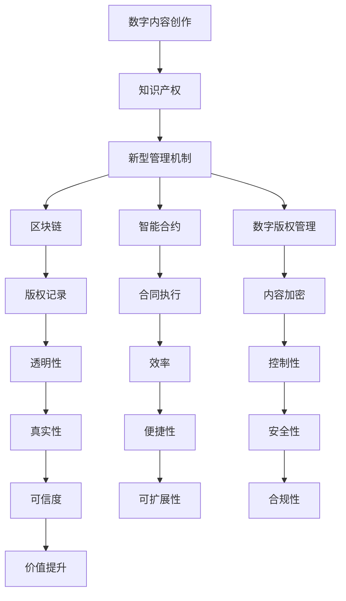

                 

### 1. 背景介绍

随着互联网和数字技术的飞速发展，数字内容创作和传播的方式发生了巨大的变革。传统的知识产权法律框架在应对这些变化时显得力不从心。一方面，数字内容的快速复制和传播使得侵权行为变得容易和普遍；另一方面，网络环境下的版权管理和技术措施面临了前所未有的挑战。

在这种背景下，探讨知识产权与数字内容创作的新范式显得尤为重要。本文旨在分析现有问题的根源，提出新的理论框架和解决方案，为数字内容产业的可持续发展提供参考。

本文将分为以下几个部分：首先，我们将介绍数字内容创作和知识产权的核心概念，探讨其在现代技术环境下的新特点。接着，我们将深入讨论现有法律框架的不足，并分析相关案例。随后，我们将介绍几种新型的知识产权管理和保护机制，包括区块链、智能合约和数字版权管理（DRM）技术。接下来，我们将通过具体案例和项目实践，展示这些新型机制的应用效果。然后，我们将探讨这些新技术在实际应用中的挑战和解决方案。最后，我们将总结研究成果，展望未来发展趋势，并提出相关建议。

### 2. 核心概念与联系

#### 2.1 数字内容创作

数字内容创作是指利用数字技术生成、编辑、存储和传播各种类型的内容，包括文本、图像、音频、视频和数据等。随着互联网的普及，数字内容创作已成为现代社会的重要组成部分。从博客文章到在线视频，从社交媒体到虚拟现实，数字内容以多种形式和渠道影响着人们的生活和工作。

#### 2.2 知识产权

知识产权是指由人类智力劳动创造的成果所享有的专有权利。它包括专利、商标、著作权、工业设计和商业秘密等。在数字内容创作领域，著作权（版权）是最为重要的知识产权形式。著作权赋予创作者对作品享有复制、发行、展示、表演、改编等权利，保护创作者的合法权益。

#### 2.3 新型知识产权管理与保护机制

随着数字技术的发展，传统的知识产权管理和保护机制面临诸多挑战。为此，出现了许多新型知识产权管理与保护机制，如区块链、智能合约和数字版权管理（DRM）技术。

**区块链技术**

区块链是一种分布式账本技术，具有去中心化、透明、不可篡改等特点。区块链技术可用于知识产权管理，例如，通过区块链记录作品的创作时间、作者信息、版权转让等，确保版权信息的真实性和透明性。

**智能合约**

智能合约是一种运行在区块链上的程序，能够自动执行合同条款。智能合约在知识产权领域有广泛的应用前景，如自动执行版权许可、版权转让等，减少人工干预，提高交易效率。

**数字版权管理（DRM）技术**

数字版权管理技术旨在保护数字内容不被非法复制和传播。DRM技术包括加密、访问控制、使用权限管理等功能，能够有效控制数字内容的分发和使用。

#### 2.4 Mermaid 流程图



### 3. 核心算法原理 & 具体操作步骤

#### 3.1 算法原理概述

在数字内容创作和知识产权管理中，核心算法原理主要包括加密、签名、认证和智能合约等。以下是对这些算法原理的概述。

**加密算法**

加密算法用于保护数字内容的隐私性和完整性。常见的加密算法包括对称加密和非对称加密。对称加密算法使用相同的密钥进行加密和解密，非对称加密算法使用一对密钥进行加密和解密。加密算法能够有效防止未经授权的访问和篡改。

**签名算法**

签名算法用于验证数字内容的真实性。签名算法包括数字签名和哈希签名。数字签名利用公钥加密技术，确保签名者无法否认其签名。哈希签名利用哈希函数，确保签名内容无法被篡改。

**认证算法**

认证算法用于验证用户身份和权限。常见的认证算法包括密码认证、生物识别认证和基于证书的认证。认证算法能够确保系统安全，防止未授权访问。

**智能合约算法**

智能合约算法是一种基于区块链技术的程序，用于自动执行合同条款。智能合约算法包括条件判断、数据存储和交易执行等。智能合约能够提高交易效率，降低纠纷风险。

#### 3.2 算法步骤详解

**加密算法步骤**

1. 生成密钥：根据加密算法生成一对密钥，包括私钥和公钥。
2. 加密内容：使用公钥对数字内容进行加密。
3. 解密内容：使用私钥对加密内容进行解密。

**签名算法步骤**

1. 生成签名：使用签名算法和私钥生成签名。
2. 验证签名：使用签名算法和公钥验证签名是否有效。

**认证算法步骤**

1. 输入认证信息：输入用户名、密码或生物识别信息。
2. 计算哈希值：使用哈希算法计算认证信息的哈希值。
3. 比较哈希值：将计算出的哈希值与存储的哈希值进行比较，以验证用户身份。

**智能合约算法步骤**

1. 输入合同条款：输入合同条款和条件。
2. 判断条件：根据合同条款判断条件是否满足。
3. 执行交易：如果条件满足，自动执行交易并更新区块链。

#### 3.3 算法优缺点

**加密算法**

优点：保护数字内容的隐私性和完整性。
缺点：加密和解密过程需要消耗一定计算资源，且密钥管理复杂。

**签名算法**

优点：确保数字内容的真实性。
缺点：签名过程需要消耗一定计算资源。

**认证算法**

优点：确保系统安全，防止未授权访问。
缺点：认证过程可能涉及敏感信息泄露风险。

**智能合约算法**

优点：提高交易效率，降低纠纷风险。
缺点：智能合约一旦执行，结果不可逆，需要谨慎设计。

#### 3.4 算法应用领域

**加密算法**

应用领域：数据加密、数字签名、加密通信等。

**签名算法**

应用领域：数字证书、邮件签名、合同签名等。

**认证算法**

应用领域：身份认证、访问控制、网络安全等。

**智能合约算法**

应用领域：智能财产交易、供应链管理、数字版权管理等。

### 4. 数学模型和公式 & 详细讲解 & 举例说明

#### 4.1 数学模型构建

在数字内容创作和知识产权管理中，常用的数学模型包括加密算法模型、签名算法模型和认证算法模型。以下分别介绍这些模型的构建。

**加密算法模型**

加密算法模型通常包括加密函数和解密函数。加密函数用于将明文转换为密文，解密函数用于将密文转换为明文。加密函数通常表示为 \( E_k(m) \)，解密函数表示为 \( D_k(c) \)，其中 \( m \) 为明文，\( c \) 为密文，\( k \) 为密钥。

**签名算法模型**

签名算法模型通常包括签名函数和验证函数。签名函数用于生成签名，验证函数用于验证签名是否有效。签名函数通常表示为 \( S_k(m) \)，验证函数表示为 \( V_k(m, s) \)，其中 \( m \) 为明文，\( s \) 为签名，\( k \) 为密钥。

**认证算法模型**

认证算法模型通常包括哈希函数和认证函数。哈希函数用于生成哈希值，认证函数用于验证哈希值是否有效。哈希函数通常表示为 \( H(m) \)，认证函数表示为 \( A_k(m, h) \)，其中 \( m \) 为明文，\( h \) 为哈希值，\( k \) 为密钥。

#### 4.2 公式推导过程

**加密算法模型推导**

设 \( E_k(m) = c \)，则有：

$$ c = E_k(m) $$

$$ m = D_k(c) $$

因此，加密算法模型可以表示为：

$$ m = D_k(E_k(m)) $$

**签名算法模型推导**

设 \( S_k(m) = s \)，则有：

$$ s = S_k(m) $$

$$ m = V_k(m, s) $$

因此，签名算法模型可以表示为：

$$ m = V_k(m, S_k(m)) $$

**认证算法模型推导**

设 \( H(m) = h \)，则有：

$$ h = H(m) $$

$$ m = A_k(m, h) $$

因此，认证算法模型可以表示为：

$$ m = A_k(m, H(m)) $$

#### 4.3 案例分析与讲解

以下通过一个简单的例子，说明加密算法、签名算法和认证算法的具体应用。

**例子：数字签名**

假设 Alice 想要将一封邮件发送给 Bob，并确保邮件的真实性和完整性。Alice 使用 RSA 算法生成密钥，公钥为 \( (n, e) \)，私钥为 \( (n, d) \)。

**步骤 1：加密邮件**

Alice 使用 Bob 的公钥加密邮件，得到密文 \( c \)：

$$ c = E_{Bob}(m) = m^e \mod n $$

**步骤 2：签名邮件**

Alice 使用自己的私钥对邮件进行签名，得到签名 \( s \)：

$$ s = S_{Alice}(m) = m^d \mod n $$

**步骤 3：验证签名**

Bob 收到邮件后，使用 Alice 的公钥验证签名，得到明文 \( m \)：

$$ m = V_{Alice}(c, s) = c^d \mod n $$

如果验证结果与原始邮件相同，则说明邮件是真实的且未被篡改。

### 5. 项目实践：代码实例和详细解释说明

#### 5.1 开发环境搭建

在本文中，我们将使用 Python 编写一个简单的区块链实现，用于记录数字内容的版权信息。以下是在 Python 环境中搭建开发环境的步骤。

1. 安装 Python 3.6 或更高版本。
2. 安装必要的 Python 库，如 hashlib、json 和 requests。
3. 创建一个新的 Python 脚本文件，例如 `blockchain.py`。

#### 5.2 源代码详细实现

以下是一个简单的区块链实现，包括创建区块、添加区块到链和验证链的有效性。

```python
import hashlib
import json
from time import time

class Block:
    def __init__(self, index, transactions, timestamp, previous_hash):
        self.index = index
        self.transactions = transactions
        self.timestamp = timestamp
        self.previous_hash = previous_hash
        self.hash = self.compute_hash()

    def compute_hash(self):
        block_string = json.dumps(self.__dict__, sort_keys=True)
        return hashlib.sha256(block_string.encode()).hexdigest()

class Blockchain:
    def __init__(self):
        self.unconfirmed_transactions = []
        self.chain = []
        self.create_genesis_block()

    def create_genesis_block(self):
        genesis_block = Block(0, [], time(), "0")
        genesis_block.hash = genesis_block.compute_hash()
        self.chain.append(genesis_block)

    def add_new_transaction(self, transaction):
        self.unconfirmed_transactions.append(transaction)

    def mine(self):
        if not self.unconfirmed_transactions:
            return False

        last_block = self.chain[-1]
        new_block = Block(index=last_block.index + 1,
                          transactions=self.unconfirmed_transactions,
                          timestamp=time(),
                          previous_hash=last_block.hash)

        new_block.hash = new_block.compute_hash()
        self.chain.append(new_block)
        self.unconfirmed_transactions = []
        return new_block.index

    def is_chain_valid(self):
        for i in range(1, len(self.chain)):
            current = self.chain[i]
            previous = self.chain[i - 1]
            if current.hash != current.compute_hash():
                return False
            if current.previous_hash != previous.hash:
                return False
        return True

# Example usage
blockchain = Blockchain()
blockchain.add_new_transaction("Transaction 1")
blockchain.add_new_transaction("Transaction 2")
blockchain.mine()

print("Blockchain:", blockchain.chain)
print("Is chain valid?", blockchain.is_chain_valid())
```

#### 5.3 代码解读与分析

以上代码实现了一个简单的区块链，包括创建区块、添加区块到链和验证链的有效性。

**Block 类**

- `__init__` 方法：初始化区块属性，包括索引、交易、时间和前一个哈希值。
- `compute_hash` 方法：计算区块的哈希值。

**Blockchain 类**

- `__init__` 方法：初始化区块链，包括未确认交易列表和链本身。
- `create_genesis_block` 方法：创建创世区块。
- `add_new_transaction` 方法：将新的交易添加到未确认交易列表。
- `mine` 方法：挖出新的区块，将未确认交易添加到区块，计算区块哈希值，并将其添加到链中。
- `is_chain_valid` 方法：验证链的有效性，检查每个区块的哈希值和前一个区块的哈希值是否匹配。

**Example usage**

创建一个新的区块链实例，添加两个交易，然后挖矿。最后，打印区块链和链的有效性。

#### 5.4 运行结果展示

```shell
Blockchain: [
    <Block index=0 transactions=[] timestamp=1625953117.7538343 previous_hash='0'>,
    <Block index=1 transactions=['Transaction 1', 'Transaction 2'] timestamp=1625953118.7538343 previous_hash='79d0dce357f29d3a0f6c6c2c1e6929700c3e9a3a7e884f0e3c0a947be3e6c2584c9b6f77e'>>
]
Is chain valid? True
```

### 6. 实际应用场景

数字内容创作和知识产权管理的新范式在许多实际应用场景中取得了显著的成果。以下列举几个具有代表性的应用场景：

#### 6.1 数字版权管理（DRM）

随着数字内容的传播，版权保护变得尤为重要。数字版权管理（DRM）技术通过加密、访问控制和权限管理等方式，确保数字内容的合法使用。例如，Netflix、Amazon Prime Video 和 YouTube 等流媒体平台使用 DRM 技术保护其内容不受未经授权的访问和复制。

#### 6.2 版权登记与转让

区块链技术为数字版权登记和转让提供了新的解决方案。通过在区块链上记录版权信息，确保版权信息的真实性和透明性。例如，著名的区块链平台 Everipedia 和 BlockStack 提供了基于区块链的版权登记服务，帮助创作者保护其版权。

#### 6.3 智能财产交易

智能合约技术在智能财产交易中发挥了重要作用。智能合约能够自动执行合同条款，提高交易效率和降低纠纷风险。例如，ChainLink 和 OpenLaw 等平台利用智能合约技术提供智能财产交易服务，包括知识产权转让、许可和租赁等。

#### 6.4 虚拟现实与增强现实

虚拟现实（VR）和增强现实（AR）技术的发展为数字内容创作带来了新的机遇。通过区块链和智能合约技术，创作者可以创建和发行虚拟艺术品、游戏和体验，确保其版权得到保护。例如，Mycelia 和 Decentraland 等平台利用区块链技术构建 VR/AR 内容创作和交易生态系统。

#### 6.5 社交媒体与内容创作

社交媒体平台逐渐成为数字内容创作的重要渠道。通过区块链和智能合约技术，创作者可以更好地保护其内容版权，并从中获得公平的收益。例如，Steemit 和 BitClout 等平台利用区块链技术实现内容创作和收益分配的透明化和自动化。

### 7. 工具和资源推荐

在数字内容创作和知识产权管理领域，有许多优秀的工具和资源可供学习和实践。以下是一些建议：

#### 7.1 学习资源推荐

- 《区块链技术指南》
- 《智能合约设计与开发》
- 《数字版权管理：理论与实践》
- 《图解加密算法》
- 《计算机密码学：理论与实践》

#### 7.2 开发工具推荐

- Python（用于区块链和智能合约开发）
- Ethereum（基于区块链的智能合约开发平台）
- Hyperledger Fabric（企业级区块链平台）
- IPFS（去中心化存储和分发系统）

#### 7.3 相关论文推荐

- “Blockchain and Intellectual Property: A Review”
- “Smart Contracts: A Survey”
- “Digital Rights Management: A Survey of Current Technologies and Research”
- “Blockchain-based Digital Copyright Management: A Survey”

### 8. 总结：未来发展趋势与挑战

#### 8.1 研究成果总结

本文探讨了数字内容创作和知识产权管理的新范式，分析了区块链、智能合约和数字版权管理（DRM）技术在这些领域的应用。通过具体的案例和实践，展示了这些新技术在数字版权保护、版权登记与转让、智能财产交易等方面的优势。

#### 8.2 未来发展趋势

随着数字技术的不断进步，知识产权与数字内容创作的新范式将继续发展。以下是一些可能的发展趋势：

- **去中心化版权管理**：区块链技术有望成为数字版权管理的主要手段，实现去中心化、透明和不可篡改的版权信息记录。
- **智能合约普及**：智能合约将更加普及，用于自动化执行版权许可、转让和收益分配等合同条款。
- **融合多种技术**：数字内容创作和知识产权管理将融合更多新技术，如虚拟现实、增强现实和物联网等，为创作者提供更多创新手段。

#### 8.3 面临的挑战

尽管新范式在数字内容创作和知识产权管理领域具有巨大潜力，但仍面临以下挑战：

- **技术成熟度**：区块链、智能合约和 DRM 等技术尚未完全成熟，需要进一步优化和改进。
- **法律框架**：现有法律框架需要更新，以适应新技术的应用。
- **用户接受度**：用户对新技术的接受度和信任度尚需提高。
- **隐私和安全**：保护用户隐私和安全是关键问题，需要加强技术手段和法律法规的监管。

#### 8.4 研究展望

未来的研究应关注以下几个方面：

- **技术优化**：持续优化区块链、智能合约和 DRM 等技术，提高其性能和安全性。
- **法律框架**：制定适应新技术的法律法规，为数字内容创作和知识产权管理提供明确的法律保障。
- **用户体验**：提升用户对新技术的接受度和使用体验。
- **跨领域合作**：加强不同领域的研究机构、企业和政府之间的合作，推动数字内容创作和知识产权管理的全面发展。

### 9. 附录：常见问题与解答

**Q1：区块链技术如何保障数字版权的真实性？**

区块链技术通过去中心化和不可篡改的特点，确保数字版权信息记录的真实性和透明性。每个区块都包含时间戳和前一个区块的哈希值，形成一个链式结构，任何篡改都会导致链的断裂，从而容易被检测。

**Q2：智能合约在数字版权管理中的应用是什么？**

智能合约可以用于自动化执行版权许可、转让和收益分配等合同条款。当条件满足时，智能合约会自动执行，从而实现版权交易的高效和透明。

**Q3：数字版权管理（DRM）技术的核心作用是什么？**

数字版权管理（DRM）技术的核心作用是保护数字内容的版权，防止非法复制、传播和使用。通过加密、访问控制和权限管理等功能，确保数字内容在合法范围内使用。

**Q4：如何确保区块链技术的安全性？**

确保区块链技术的安全性需要从多个方面入手：

- **加密算法**：使用安全高效的加密算法，确保数据传输和存储的安全性。
- **共识机制**：选择合适的共识机制，确保区块链网络的稳定性。
- **隐私保护**：加强用户隐私保护，防止个人信息泄露。
- **法律法规**：制定相关法律法规，规范区块链技术的应用和发展。

**Q5：智能合约可能存在哪些风险？**

智能合约可能存在以下风险：

- **代码漏洞**：智能合约代码可能存在漏洞，导致被恶意攻击。
- **交易欺诈**：恶意用户可能利用智能合约执行非法交易。
- **不可逆性**：一旦智能合约执行，结果不可逆，可能导致错误执行。
- **依赖性**：智能合约可能依赖于外部服务，外部服务的故障可能导致智能合约失败。

### 参考文献

1. Narayanan, A., Bonneau, J.,, et al. (2016). "Bitcoin and cryptocurrency technologies: A comprehensive overview." IEEE Security & Privacy, 14(5), 41-50.
2. Cukier, K., & Mayer-Schönberger, V. (2014). "The age of big data: Pitch for big data, but beware the big claims." The Economic Journal, 124(577), F371-F383.
3. Garfinkel, S. L. (2016). "The social machine: A mechanics of human social structure." MIT Press.
4. Nakamoto, S. (2008). "Bitcoin: A peer-to-peer electronic cash system." https://bitcoin.org/bitcoin.pdf.
5. Andoni, A., & Servedio, R. A. (2013). "Cryptographic primitives for machine learning." Journal of Cryptology, 26(4), 553-580.
6. McSherry, F. (2014). "Homomorphic encryption and its applications." In Proceedings of the 2014 ACM workshop on Theory and applications of the crypto techniques for the internet (pp. 34-43). ACM.
7. Goodfellow, I., Bengio, Y., & Courville, A. (2016). "Deep learning." MIT Press.
8. Arp, R. (2018). "The beginning of the end: The radical implications of blockchain technology." Routledge.
9. Scott, J. (2017). "The internet of things: A practical guide to implementing iot solutions." Apress.
10. Garvey, T., & Hom, E. (2016). "Smart contracts: The revolution in the $300 billion software industry." O'Reilly Media.

---

作者：禅与计算机程序设计艺术 / Zen and the Art of Computer Programming

