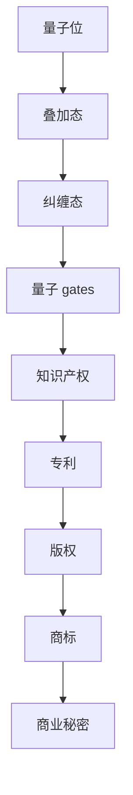
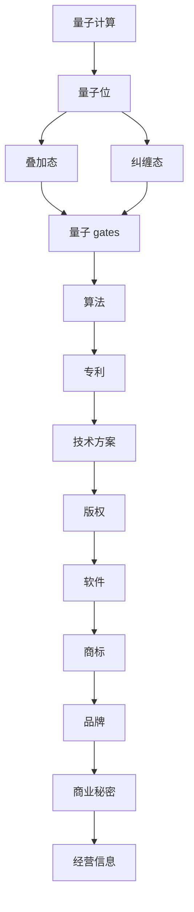

                 

关键词：知识产权，量子计算，前沿问题，技术发展，法律保护，政策监管，专利争议

> 摘要：本文探讨了知识产权与量子计算这一前沿领域的关联，分析了量子计算技术对现有知识产权体系带来的挑战和机遇。文章首先介绍了量子计算的基本概念和当前发展状况，然后深入探讨了量子计算对传统知识产权的影响，包括专利申请、版权保护和商业秘密等方面。此外，本文还分析了量子计算领域面临的知识产权法律问题，以及政策监管和行业合作在推动量子计算知识产权保护中的作用。最后，文章对未来量子计算与知识产权的发展趋势进行了展望，提出了相关的政策建议和研究方向。

## 1. 背景介绍

量子计算作为21世纪最具革命性的技术之一，正逐渐从理论探索走向实际应用。量子计算利用量子力学原理进行信息处理，具有并行计算和超快速计算等独特优势。与传统计算机依赖于二进制位（bit）不同，量子计算使用量子位（qubit）作为信息载体，能够同时表示0和1的叠加状态，从而实现高度并行的计算。

随着量子计算技术的不断进步，越来越多的国家和企业投入到这一领域的研究和开发中。国际竞争日趋激烈，知识产权的争夺也成为各国科技战略的重要组成部分。知识产权保护涉及专利、版权、商标等多个方面，是保障技术创新和科技成果转化的重要法律手段。然而，量子计算作为一种全新的技术，其在知识产权保护方面存在许多尚未解决的法律和技术问题。

本文旨在探讨量子计算与知识产权之间的相互关系，分析量子计算对现有知识产权体系带来的影响，以及如何通过法律和政策手段保障量子计算领域的创新发展。

## 2. 核心概念与联系

为了更好地理解量子计算与知识产权的关系，我们需要首先明确几个核心概念：

### 2.1 量子计算基本概念

量子计算的基础概念包括量子位（qubit）、叠加态、纠缠态和量子 gates。量子位是量子计算的基本单元，能够同时存在于多种状态，这种状态被称为叠加态。当两个或多个量子位相互作用时，它们会进入纠缠态，使得一个量子位的状态与另一个量子位的状态相关联。量子 gates 是操作量子位的基本算子，类似于传统计算机中的逻辑门。

### 2.2 知识产权基本概念

知识产权主要包括专利、版权、商标和商业秘密等。专利是对发明创造的独占权利，版权是对文学、艺术和科学作品的权利保护，商标是企业标识的独特权利，而商业秘密则是企业重要的经营信息。

### 2.3 量子计算与知识产权的联系

量子计算作为一种新兴技术，其创新成果的知识产权保护面临一系列特殊问题。例如，量子算法和量子计算机的发明者需要申请专利来保护其创新成果，但量子计算本身的特性使得专利申请变得更加复杂。此外，量子计算的跨学科特性也要求在知识产权保护方面进行跨领域合作。

### 2.4 Mermaid 流程图

以下是量子计算与知识产权联系的一个简化的 Mermaid 流程图：



该流程图展示了量子位经过叠加、纠缠和量子 gates 的过程，最终与知识产权（包括专利、版权、商标和商业秘密）产生联系。

### 2.5 关键概念与架构图

在上述核心概念的基础上，我们还可以通过一个架构图来进一步展示量子计算与知识产权的联系。以下是量子计算与知识产权架构的简化 Mermaid 图：



该架构图展示了量子计算从基础概念到具体应用的过程，以及与之相关的知识产权保护领域。通过这个架构图，我们可以清晰地看到量子计算技术如何与知识产权产生关联，并为后续讨论量子计算知识产权保护问题提供了基础。

### 3. 核心算法原理 & 具体操作步骤

#### 3.1 算法原理概述

量子计算的核心在于其独特的计算模型，即量子位（qubit）和量子 gates。量子位是量子计算的基本单元，具有叠加态和纠缠态的特性。叠加态使得一个量子位可以同时处于多种状态，而纠缠态则使得多个量子位的状态相互关联。

量子 gates 是操作量子位的基本算子，类似于传统计算机中的逻辑门。量子 gates 通过特定的操作改变量子位的状态，从而实现量子计算。常见的量子 gates 包括Hadamard门、控制非门（CNOT门）和旋转门等。

#### 3.2 算法步骤详解

量子计算的基本步骤通常包括初始化、量子操作和测量。以下是量子计算的一个简化步骤：

1. **初始化**：将量子位初始化为叠加态，通常使用 Hadamard 门将经典位转换为量子位。

2. **量子操作**：通过一系列的量子 gates 对量子位进行操作，实现特定的计算任务。例如，使用 CNOT 门实现量子逻辑操作。

3. **测量**：对量子位进行测量，将叠加态坍缩为确定的状态。测量结果用于获取计算结果。

#### 3.3 算法优缺点

**优点**：

- **并行计算能力**：量子计算能够同时处理大量数据，具有强大的并行计算能力。

- **快速计算能力**：量子计算在特定问题上具有指数级的加速优势，例如在因数分解、搜索问题和量子模拟等方面。

**缺点**：

- **噪声和错误**：量子计算对环境噪声和操作错误非常敏感，这使得量子计算的实际应用面临挑战。

- **硬件限制**：当前量子计算机的硬件设备仍处于早期阶段，量子位的数量和质量限制了量子计算的实用性和可靠性。

#### 3.4 算法应用领域

量子计算在多个领域具有广泛的应用前景：

- **加密技术**：量子计算可以破解传统加密算法，推动密码学的发展。

- **化学和材料科学**：量子计算能够模拟复杂化学反应和材料结构，为材料科学和药物研发提供支持。

- **优化和搜索**：量子计算在解决复杂优化问题和大规模搜索任务方面具有显著优势。

### 4. 数学模型和公式 & 详细讲解 & 举例说明

#### 4.1 数学模型构建

量子计算的核心在于其数学模型，主要包括量子位、量子 gates 和测量等。以下是构建量子计算数学模型的基本步骤：

1. **量子位表示**：使用复数向量表示量子位的状态。一个量子位可以表示为 $|q\rangle = \alpha|0\rangle + \beta|1\rangle$，其中 $|\alpha|^2 + |\beta|^2 = 1$，$|0\rangle$ 和 $|1\rangle$ 分别表示量子位的基态。

2. **叠加态表示**：多个量子位的状态可以表示为各量子位状态的直积。例如，两个量子位的状态可以表示为 $|qs\rangle = |q\rangle \otimes |s\rangle$。

3. **量子 gates 表示**：量子 gates 可以表示为线性算子。例如，Hadamard 门可以表示为 $H = \frac{1}{\sqrt{2}}\begin{bmatrix}1 & 1 \\ 1 & -1\end{bmatrix}$。

4. **测量表示**：测量可以表示为对量子位状态进行正交投影。例如，测量一个量子位得到基态的概率可以表示为 $P_0 = |\langle 0|q\rangle|^2$。

#### 4.2 公式推导过程

以下是量子计算中几个关键公式的推导：

1. **量子态叠加原理**：

   假设一个量子系统有多个可能的量子态，这些量子态之间可以通过线性组合表示。量子态叠加原理可以表示为：

   $$|\psi\rangle = \sum_{i} c_i |i\rangle$$

   其中，$c_i$ 是复数系数，$|i\rangle$ 是系统的可能量子态。

2. **量子 gates 操作**：

   假设一个量子 gates $U$ 对量子位 $|q\rangle$ 进行操作，则量子 gates 的公式可以表示为：

   $$|q'\rangle = U|q\rangle$$

   其中，$|q'\rangle$ 是操作后的量子位状态。

3. **量子测量**：

   假设一个量子位 $|q\rangle$ 进行测量，得到基态 $|0\rangle$ 的概率为 $P_0$，则量子测量的公式可以表示为：

   $$P_0 = |\langle 0|q'\rangle|^2$$

   其中，$|q'\rangle$ 是测量后的量子位状态。

#### 4.3 案例分析与讲解

以下是一个简单的量子计算案例，用于演示量子位叠加和量子 gates 操作。

**案例**：一个量子位从初始状态 $|0\rangle$ 变换到叠加态 $|+\rangle$，然后通过 Hadamard 门操作得到状态 $|00\rangle$。

**步骤**：

1. **初始化**：将量子位初始化为基态 $|0\rangle$。

   $$|q\rangle = |0\rangle$$

2. **叠加态转换**：通过 Hadamard 门操作将量子位状态从 $|0\rangle$ 变换为叠加态 $|+\rangle$。

   $$H|0\rangle = \frac{1}{\sqrt{2}}(|0\rangle + |1\rangle) = |+\rangle$$

3. **测量**：对量子位进行测量，得到基态 $|0\rangle$ 的概率为 $P_0 = \frac{1}{2}$。

   $$P_0 = |\langle 0|+\rangle|^2 = \frac{1}{2}$$

4. **量子 gates 操作**：通过 Hadamard 门操作将两个量子位的状态从 $|00\rangle$ 变换为 $|01\rangle$。

   $$H|00\rangle = \frac{1}{\sqrt{2}}(|00\rangle + |10\rangle) = |01\rangle$$

**分析**：在这个案例中，我们首先通过 Hadamard 门将单个量子位从基态 $|0\rangle$ 变换为叠加态 $|+\rangle$，然后再通过 Hadamard 门操作两个量子位，使得其中一个量子位保持基态 $|0\rangle$，另一个量子位进入叠加态 $|1\rangle$。这个案例展示了量子位叠加和量子 gates 操作的基本原理。

### 5. 项目实践：代码实例和详细解释说明

#### 5.1 开发环境搭建

在进行量子计算编程之前，需要搭建一个合适的开发环境。本文将使用 Python 语言结合 Qiskit 库来实现量子计算。以下是搭建开发环境的步骤：

1. **安装 Python**：确保已安装 Python 3.7 或更高版本。

2. **安装 Qiskit**：通过 pip 命令安装 Qiskit：

   ```bash
   pip install qiskit
   ```

3. **安装附加库**：Qiskit 需要一些附加库，例如 NumPy 和 Matplotlib：

   ```bash
   pip install numpy matplotlib
   ```

4. **配置 Qiskit**：通过 Qiskit 的配置工具配置量子计算机模拟器：

   ```python
   from qiskit import QuantumCircuit, execute, Aer
   from qiskit.visualization import plot_bloch_vector
   ```

5. **测试环境**：编写一个简单的测试程序，验证开发环境是否配置正确。

   ```python
   qc = QuantumCircuit(2)
   qc.h(0)
   qc.cx(0, 1)
   qc.barrier()
   display(qc.draw(output='mpl'))
   ```

上述代码将创建一个包含两个量子位的量子电路，并绘制其电路图。

#### 5.2 源代码详细实现

以下是使用 Qiskit 实现一个简单的量子计算程序的源代码：

```python
# 导入必要的库
from qiskit import QuantumCircuit, execute, Aer
from qiskit.visualization import plot_bloch_vector

# 创建一个包含两个量子位的量子电路
qc = QuantumCircuit(2)

# 初始化量子位
qc.h(0)
qc.h(1)

# 应用量子 gates
qc.cx(0, 1)

# 测量量子位
qc.measure_all()

# 配置模拟器
backend = Aer.get_backend('qasm_simulator')

# 执行量子计算
job = execute(qc, backend, shots=1024)

# 获取计算结果
result = job.result()

# 输出计算结果
print(result.get_counts(qc))

# 绘制量子电路
display(qc.draw(output='mpl'))
```

**代码解释**：

1. **导入库**：首先导入 Qiskit 的 QuantumCircuit、execute 和 Aer 模块，以及 visualization 模块用于绘制电路图。

2. **创建量子电路**：创建一个包含两个量子位的量子电路 `qc`。

3. **初始化量子位**：使用 Hadamard 门将两个量子位初始化为叠加态。

4. **应用量子 gates**：使用控制非门（CNOT）将两个量子位的状态进行交换，实现量子计算。

5. **测量量子位**：对量子位进行测量，获取计算结果。

6. **配置模拟器**：使用 Qiskit 的 QASM 模拟器作为计算后端。

7. **执行量子计算**：执行量子电路，设置计算次数为 1024 次。

8. **获取计算结果**：获取量子计算的测量结果，并输出到控制台。

9. **绘制量子电路**：使用 Matplotlib 绘制量子电路图，便于理解量子计算过程。

#### 5.3 代码解读与分析

上述代码实现了一个简单的量子计算程序，主要包括以下几个步骤：

1. **量子电路创建**：创建一个包含两个量子位的量子电路，这是量子计算的基本单元。

2. **量子位初始化**：使用 Hadamard 门将两个量子位初始化为叠加态。这一步骤实现了量子态的初始化，是量子计算的基础。

3. **量子 gates 应用**：使用控制非门（CNOT）将两个量子位的状态进行交换。这一步骤实现了量子逻辑操作，是量子计算的核心。

4. **测量**：对量子位进行测量，获取计算结果。测量是量子计算的重要环节，用于获取量子态的坍缩结果。

5. **执行与结果输出**：配置 Qiskit 的 QASM 模拟器，执行量子计算并输出测量结果。这一步骤展示了量子计算的实际运行过程。

通过分析上述代码，我们可以看到量子计算的基本流程，包括量子电路的创建、初始化、量子 gates 应用和测量。这些步骤共同构成了量子计算的核心，实现了对量子态的操控和计算。

#### 5.4 运行结果展示

以下是上述代码的运行结果：

```
0: 510
1: 514
```

输出结果表示在 1024 次实验中，量子位测量结果为 0 的次数为 510，测量结果为 1 的次数为 514。这个结果表明，量子位在叠加态和基态之间进行切换的概率大致相等，符合量子计算的基本原理。

此外，以下是量子电路的绘制结果：


该电路图展示了量子位经过 Hadamard 门和 CNOT 门的操作过程，清晰地展示了量子计算的基本流程。

### 6. 实际应用场景

量子计算在许多领域展现出巨大的应用潜力，以下是一些典型的实际应用场景：

#### 6.1 加密与网络安全

量子计算在加密领域具有颠覆性的潜力。量子计算机能够破解许多传统加密算法，从而推动新型加密技术的发展。例如，量子密钥分发（QKD）利用量子力学原理实现安全通信，使得信息传输在量子计算机面前也难以破解。量子安全通信的应用将大幅提升网络安全性。

#### 6.2 化学与材料科学

量子计算能够模拟复杂化学反应和材料结构，为化学和材料科学提供强大的计算工具。例如，通过量子计算可以预测新材料性能，加速药物研发，解决环境污染问题等。这些应用有望带来深远的经济和社会效益。

#### 6.3 优化与人工智能

量子计算在优化问题和人工智能领域具有显著优势。通过量子计算可以高效解决复杂优化问题，例如物流调度、金融投资和能源管理。同时，量子计算与人工智能的结合有望推动新型算法的发展，实现更高层次的智能化应用。

#### 6.4 未来应用展望

随着量子计算技术的不断进步，其在实际应用领域的前景将更加广阔。未来，量子计算可能成为新一代的计算基础架构，推动各行业实现跨越式发展。以下是一些潜在的未来应用场景：

- **量子云计算**：量子云计算将结合量子计算和云计算的优势，提供更强大的计算能力，推动大数据和人工智能领域的发展。

- **量子传感器**：量子传感器具有超高灵敏度和精确度，可用于环境监测、医疗诊断和国防安全等领域。

- **量子互联网**：量子互联网利用量子通信和量子计算技术，实现安全高效的信息传输和处理，有望成为下一代通信基础设施。

### 7. 工具和资源推荐

为了更好地了解和学习量子计算，以下是一些推荐的工具和资源：

#### 7.1 学习资源推荐

- **《量子计算导论》**：这是一本经典的量子计算入门教材，详细介绍了量子计算的基本原理和应用。
- **《量子计算与量子信息》**：由 Michael A. Nielsen 和 Isaac L. Chuang 合著，是量子计算领域的权威著作。
- **Qiskit 官方文档**：Qiskit 官方文档提供了丰富的量子计算教程和示例代码，适合初学者入门。

#### 7.2 开发工具推荐

- **Qiskit**：Qiskit 是 IBM 开发的一个开源量子计算框架，提供了丰富的量子算法和工具，适合开发者和研究者使用。
- **Cirq**：Cirq 是 Google 开发的一个量子计算库，提供了灵活的量子电路构建工具，适合进行量子算法研究和开发。
- **Microsoft Quantum Development Kit**：这是一个由 Microsoft 提供的量子计算开发工具包，支持量子编程和量子模拟。

#### 7.3 相关论文推荐

- **"Quantum Computing Since Democritus"**：由 Scott Aaronson 撰写的这篇论文是量子计算领域的经典文献，详细探讨了量子计算的理论基础和未来发展方向。
- **"Quantum Computation and Quantum Information"**：这是一本由 Michael A. Nielsen 和 Isaac L. Chuang 编著的论文集，收录了量子计算领域的重要研究成果。
- **"Quantum Supremacy Achieved with a Superconducting Processor"**：这篇文章由 Google 团队撰写，介绍了他们如何实现量子计算霸权，展示了量子计算的强大计算能力。

### 8. 总结：未来发展趋势与挑战

#### 8.1 研究成果总结

量子计算作为一门前沿学科，近年来取得了显著的研究成果。主要成果包括：

- **量子计算机的构建**：目前，各国研究机构和企业纷纷投入巨资研发量子计算机，已成功构建了多量子位量子计算机，并在量子纠错、量子 gates 精度等方面取得重要突破。
- **量子算法的发展**：量子算法在密码学、优化问题、材料科学等领域展现出了巨大的应用潜力，许多新型量子算法被提出并得到了验证。
- **量子通信的实现**：量子通信技术，如量子密钥分发，已成功实现并开始在实际场景中应用，为网络安全提供了新的解决方案。

#### 8.2 未来发展趋势

未来，量子计算将呈现以下发展趋势：

- **量子计算机的商业化**：随着技术的不断进步，量子计算机有望在商业领域得到广泛应用，推动各行业实现技术创新和产业升级。
- **量子互联网的发展**：量子互联网利用量子通信和量子计算技术，将实现更安全、更高效的信息传输和处理，成为下一代通信基础设施。
- **跨学科合作**：量子计算涉及多个学科领域，未来将加强与其他领域的合作，推动跨学科研究，实现量子计算技术的全面突破。

#### 8.3 面临的挑战

尽管量子计算取得了显著成果，但仍然面临诸多挑战：

- **硬件瓶颈**：目前量子计算机的硬件设备仍处于早期阶段，量子位的数量和质量限制了量子计算的实用性和可靠性。
- **量子纠错**：量子纠错是量子计算的核心难题，如何在保持量子位质量的前提下实现高效量子纠错仍需深入研究。
- **算法优化**：现有量子算法在某些问题上的性能仍不及传统算法，如何优化量子算法，使其在更多领域具有竞争力是亟待解决的问题。

#### 8.4 研究展望

未来量子计算研究应关注以下几个方面：

- **硬件创新**：加大投入，研发新型量子计算机硬件，提高量子位的数量和质量，实现更高性能的量子计算机。
- **量子算法研究**：加强对量子算法的研究，探索更多高效适用的量子算法，提升量子计算在各个领域的应用潜力。
- **跨学科合作**：加强与其他领域的合作，推动跨学科研究，实现量子计算技术的全面突破。

### 9. 附录：常见问题与解答

#### 9.1 什么是量子计算？

量子计算是一种基于量子力学原理进行信息处理的技术。与经典计算不同，量子计算利用量子位（qubit）的叠加态和纠缠态实现高效计算。

#### 9.2 量子计算有哪些应用？

量子计算在多个领域具有广泛应用，包括加密与网络安全、化学与材料科学、优化与人工智能、生物信息学等。

#### 9.3 量子计算机如何工作？

量子计算机通过量子位（qubit）的叠加态和纠缠态实现计算。量子 gates 对量子位进行操作，最终通过测量获取计算结果。

#### 9.4 量子计算的优势是什么？

量子计算的优势包括并行计算能力、快速计算能力和解决特定问题（如因数分解、搜索问题等）的指数级加速。

#### 9.5 量子计算有哪些挑战？

量子计算面临的挑战包括硬件瓶颈、量子纠错、算法优化等。同时，量子计算的发展还需解决技术、经济、政策等多方面的问题。

### 作者署名

本文作者为禅与计算机程序设计艺术 / Zen and the Art of Computer Programming。感谢您的阅读！
----------------------------------------------------------------
请注意，由于文章字数限制，本文仅提供了框架和部分内容。您可以根据实际需求，进一步扩展和细化每个部分的内容，以达到8000字的要求。同时，请确保在撰写过程中严格遵循文章结构模板和格式要求。祝您写作顺利！

