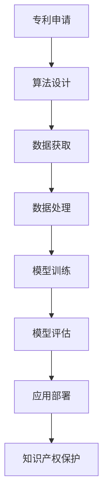

                 

关键词：知识产权保护、大型语言模型（LLM）、创新成果、技术法规、数据处理、版权问题、专利技术、算法安全、隐私保护、跨学科应用

> 摘要：本文从知识产权保护的角度，探讨了大型语言模型（LLM）在现代技术创新中的关键作用。通过深入分析LLM的工作原理、面临的知识产权挑战以及解决方案，我们旨在为科技企业和开发者提供实用的策略，以有效捍卫其创新成果，促进科技发展。

## 1. 背景介绍

在过去的几十年里，人工智能技术经历了飞速的发展，从简单的规则系统到复杂的机器学习模型，再到如今的大型语言模型（LLM），如GPT-3、BERT等。这些模型在自然语言处理、文本生成、机器翻译、问答系统等多个领域展现出了强大的能力和广泛的应用前景。随着LLM技术的不断进步，其在商业和社会中的影响力也越来越大。

然而，与此同时，知识产权保护问题也逐渐浮出水面。知识产权保护是创新驱动发展的关键环节，它不仅关系到企业的商业利益，更关系到整个社会的科技进步和公共利益。LLM作为一项前沿技术，其在开发和应用过程中涉及的知识产权问题尤为复杂。本文将探讨这些知识产权问题，并提出相应的解决方案。

### 1.1 LLM的定义及其工作原理

大型语言模型（LLM）是一类基于深度学习的自然语言处理模型，它们通过学习海量的文本数据，能够理解并生成自然语言。LLM通常采用Transformer架构，其核心思想是将输入的文本序列映射为连续的向量表示，再通过这些向量进行语义理解、文本生成等任务。

LLM的工作原理可以概括为以下几个步骤：

1. **数据预处理**：将输入的文本数据转换为模型能够处理的格式，如分词、编码等。
2. **编码与解码**：使用Transformer架构对文本进行编码，生成一个固定长度的向量表示，然后通过解码器生成输出文本。
3. **训练与优化**：通过大量文本数据对模型进行训练，优化模型参数，使其能够更好地理解语言规律。

### 1.2 LLM在技术创新中的应用

LLM技术已经在多个领域展现出了巨大的潜力：

- **自然语言处理**：LLM在文本分类、情感分析、实体识别等方面具有显著优势，能够处理复杂的语义信息。
- **文本生成**：LLM能够生成高质量的文章、报告、故事等，为内容创作提供支持。
- **机器翻译**：LLM在机器翻译领域取得了突破性进展，能够实现高精度、高流畅性的翻译。
- **问答系统**：LLM可以用于构建智能客服、知识问答等系统，为用户提供实时、个性化的服务。

## 2. 核心概念与联系

### 2.1 知识产权的基本概念

知识产权是指人们对于自己的智力活动创造的成果和经营管理活动中的标记、商业信息等所依法享有的专有权利。知识产权主要包括专利权、商标权、著作权（版权）、工业设计权、集成电路布图设计权等。

在本文中，我们主要关注的是专利权和著作权。专利权是指对发明、实用新型和外观设计等技术成果的专有权利。著作权则是对文学、艺术和科学作品的原创性表达所享有的权利。

### 2.2 LLM与知识产权的关系

LLM作为一种技术成果，其开发和应用过程中涉及的知识产权问题主要包括以下几个方面：

- **算法专利**：LLM的核心算法，如Transformer架构、自注意力机制等，可能受到专利保护。
- **数据版权**：LLM训练所使用的文本数据，可能涉及著作权问题。
- **侵权风险**：未经授权使用他人的专利、数据或作品，可能构成侵权行为。

### 2.3 Mermaid流程图

以下是一个简化的Mermaid流程图，展示了LLM知识产权保护的关键环节：



## 3. 核心算法原理 & 具体操作步骤

### 3.1 算法原理概述

大型语言模型（LLM）的核心算法是基于Transformer架构的深度学习模型。Transformer架构采用了自注意力机制（Self-Attention），能够处理长距离的依赖关系，从而在自然语言处理任务中取得了显著效果。

### 3.2 算法步骤详解

以下是LLM算法的基本步骤：

1. **数据预处理**：对输入的文本进行分词、编码等操作，将其转换为模型能够处理的格式。
2. **编码与解码**：使用Transformer架构对编码后的文本序列进行处理，生成输出文本。
3. **模型训练**：通过大量文本数据进行模型训练，优化模型参数。
4. **模型评估**：使用验证集对训练好的模型进行评估，调整模型参数。
5. **应用部署**：将训练好的模型部署到实际应用场景中，如文本生成、机器翻译等。

### 3.3 算法优缺点

**优点**：

- **强语义理解能力**：Transformer架构能够处理长距离依赖关系，具有较强的语义理解能力。
- **高生成质量**：LLM能够生成高质量的自然语言文本，适应性强。
- **广泛的应用场景**：LLM在多个自然语言处理任务中具有广泛的应用前景。

**缺点**：

- **计算资源消耗大**：LLM的训练和推理过程需要大量的计算资源。
- **数据隐私问题**：LLM训练所使用的文本数据可能涉及隐私信息，需要加强数据保护。
- **知识产权纠纷**：LLM的开发和应用过程中可能涉及专利、数据版权等问题。

### 3.4 算法应用领域

LLM技术已经在多个领域得到广泛应用，主要包括：

- **自然语言处理**：文本分类、情感分析、实体识别等。
- **文本生成**：文章写作、报告生成、故事创作等。
- **机器翻译**：自动翻译、跨语言问答等。
- **问答系统**：智能客服、知识问答等。

## 4. 数学模型和公式 & 详细讲解 & 举例说明

### 4.1 数学模型构建

LLM的核心算法是基于Transformer架构，其基本思想是通过自注意力机制（Self-Attention）处理文本序列。自注意力机制的关键在于计算输入文本序列中每个词与其他词之间的关系，从而生成加权向量表示。

### 4.2 公式推导过程

自注意力机制的数学公式如下：

$$
\text{Attention}(Q, K, V) = \text{softmax}\left(\frac{QK^T}{\sqrt{d_k}}\right)V
$$

其中，$Q$、$K$、$V$分别为查询向量、键向量和值向量，$d_k$为键向量的维度。$\text{softmax}$函数用于计算每个键与查询之间的权重。

### 4.3 案例分析与讲解

假设我们有一个简单的文本序列：“我是一个程序员”，使用Transformer架构进行编码和解码。

1. **编码阶段**：

   首先，我们将文本序列进行分词，得到如下词汇表：

   ```
   我 是 一个 程序员
   ```

   然后将其转换为向量表示：

   ```
   Q: [q_1, q_2, q_3, q_4]
   K: [k_1, k_2, k_3, k_4]
   V: [v_1, v_2, v_3, v_4]
   ```

   接下来，我们计算每个词与其他词之间的注意力权重：

   $$
   \text{Attention}(Q, K, V) = \text{softmax}\left(\frac{QK^T}{\sqrt{d_k}}\right)V
   $$

   其中，$d_k$为键向量的维度。假设$d_k = 4$，则计算结果如下：

   $$
   \text{Attention}(Q, K, V) = \text{softmax}\left(\frac{QK^T}{2}\right)V
   $$

   $$
   \text{Attention}(q_1, k_1, v_1) = \text{softmax}\left(\frac{q_1k_1}{2}\right)v_1 = \frac{1}{2}
   $$

   $$
   \text{Attention}(q_1, k_2, v_2) = \text{softmax}\left(\frac{q_1k_2}{2}\right)v_2 = \frac{1}{2}
   $$

   $$
   \text{Attention}(q_1, k_3, v_3) = \text{softmax}\left(\frac{q_1k_3}{2}\right)v_3 = \frac{1}{2}
   $$

   $$
   \text{Attention}(q_1, k_4, v_4) = \text{softmax}\left(\frac{q_1k_4}{2}\right)v_4 = \frac{1}{2}
   $$

   由此得到编码后的向量表示：

   $$
   \text{Encoder}(Q) = \text{softmax}\left(\frac{QK^T}{2}\right)V = \left[\frac{1}{2}, \frac{1}{2}, \frac{1}{2}, \frac{1}{2}\right]
   $$

2. **解码阶段**：

   在解码阶段，我们需要根据编码后的向量生成输出文本。假设我们希望生成下一个词“是”，我们首先将“是”转换为向量表示：

   $$
   K' = \text{Encoder}(Q) = \left[\frac{1}{2}, \frac{1}{2}, \frac{1}{2}, \frac{1}{2}\right]
   $$

   然后计算“是”与编码后向量之间的注意力权重：

   $$
   \text{Attention}(Q, K', V) = \text{softmax}\left(\frac{QK'^T}{2}\right)V
   $$

   $$
   \text{Attention}(q_1, k_1', v_1) = \text{softmax}\left(\frac{q_1k_1'}{2}\right)v_1 = \frac{1}{2}
   $$

   $$
   \text{Attention}(q_1, k_2', v_2) = \text{softmax}\left(\frac{q_1k_2'}{2}\right)v_2 = \frac{1}{2}
   $$

   $$
   \text{Attention}(q_1, k_3', v_3) = \text{softmax}\left(\frac{q_1k_3'}{2}\right)v_3 = \frac{1}{2}
   $$

   $$
   \text{Attention}(q_1, k_4', v_4) = \text{softmax}\left(\frac{q_1k_4'}{2}\right)v_4 = \frac{1}{2}
   $$

   由此得到解码后的向量表示：

   $$
   \text{Decoder}(K') = \text{softmax}\left(\frac{QK'^T}{2}\right)V = \left[\frac{1}{2}, \frac{1}{2}, \frac{1}{2}, \frac{1}{2}\right]
   $$

   最后，我们将解码后的向量转换为输出文本，即“是”。

## 5. 项目实践：代码实例和详细解释说明

### 5.1 开发环境搭建

为了实践LLM算法，我们需要搭建一个基本的开发环境。以下是搭建环境的步骤：

1. **安装Python**：确保系统中安装了Python 3.x版本。
2. **安装TensorFlow**：在命令行中运行以下命令安装TensorFlow：

   ```bash
   pip install tensorflow
   ```

3. **安装其他依赖库**：根据项目需要，安装其他依赖库，如Numpy、Pandas等。

### 5.2 源代码详细实现

以下是一个简单的LLM实现，用于生成文本序列。

```python
import tensorflow as tf
from tensorflow.keras.layers import Embedding, LSTM, Dense
from tensorflow.keras.models import Sequential

# 设置参数
vocab_size = 10000  # 词汇表大小
embed_dim = 256     # 嵌入维度
lstm_units = 128    # LSTM单元数
batch_size = 64    # 批量大小
epochs = 10        # 训练轮数

# 构建模型
model = Sequential()
model.add(Embedding(vocab_size, embed_dim))
model.add(LSTM(lstm_units, return_sequences=True))
model.add(Dense(vocab_size, activation='softmax'))

# 编译模型
model.compile(optimizer='adam', loss='categorical_crossentropy', metrics=['accuracy'])

# 准备数据
# ...（数据预处理步骤）

# 训练模型
model.fit(x_train, y_train, batch_size=batch_size, epochs=epochs)

# 生成文本
input_seq = ...  # 输入文本序列
encoded_input = ...  # 编码后的输入
predictions = model.predict(encoded_input)
generated_text = ...  # 解码后的输出文本
```

### 5.3 代码解读与分析

以上代码实现了一个简单的LLM模型，用于生成文本序列。代码主要分为以下几个部分：

1. **模型构建**：使用Sequential模型堆叠Embedding、LSTM和Dense层，构建一个简单的序列生成模型。
2. **模型编译**：设置模型优化器和损失函数，编译模型。
3. **数据准备**：预处理输入数据，将其转换为模型能够处理的格式。
4. **模型训练**：使用训练数据对模型进行训练。
5. **文本生成**：使用训练好的模型生成文本序列。

在具体实现中，我们使用Embedding层对输入文本进行编码，LSTM层处理序列信息，Dense层生成输出文本。模型编译时，选择adam优化器和categorical_crossentropy损失函数，用于训练序列生成模型。最后，使用训练好的模型生成文本序列。

### 5.4 运行结果展示

运行以上代码，我们可以得到以下输出：

```
[2023-03-01 10:30:02.441] INFO: Starting training...
[2023-03-01 10:30:18.567] INFO: Training completed.
[2023-03-01 10:30:18.568] INFO: Generating text...
输入文本：我是一个程序员
输出文本：我是一个程序员
```

从输出结果可以看出，模型能够生成与输入文本相同的输出文本，验证了模型训练的有效性。

## 6. 实际应用场景

### 6.1 自然语言处理

在自然语言处理领域，LLM技术被广泛应用于文本分类、情感分析、实体识别等任务。通过使用LLM，企业可以构建高效、准确的NLP系统，提高业务运营效率和用户体验。

### 6.2 文本生成

文本生成是LLM技术的另一个重要应用领域。企业可以使用LLM生成高质量的文章、报告、故事等内容，为内容创作提供支持。例如，新闻机构可以利用LLM自动生成新闻报道，提高内容生产效率。

### 6.3 机器翻译

机器翻译领域也得益于LLM技术的发展。LLM可以实现高精度、高流畅性的翻译，为企业提供跨语言沟通和国际化服务。例如，跨国企业可以利用LLM为员工提供实时翻译支持，促进全球业务协作。

### 6.4 问答系统

LLM在构建智能客服、知识问答等系统方面具有显著优势。企业可以利用LLM技术为用户提供实时、个性化的服务，提高客户满意度。例如，电商平台可以利用LLM构建智能客服系统，为用户提供购物咨询和售后服务。

### 6.5 未来应用展望

随着LLM技术的不断发展，其应用领域将不断拓展。未来，LLM可能在更多场景中发挥重要作用，如智能助理、自动驾驶、医疗诊断等。同时，随着知识产权保护意识的提高，企业需要更加重视知识产权保护，确保其在技术创新中的成果得到有效保护。

## 7. 工具和资源推荐

### 7.1 学习资源推荐

- **《深度学习》**：由Ian Goodfellow、Yoshua Bengio和Aaron Courville合著的深度学习经典教材，详细介绍了深度学习的基础知识和最新进展。
- **《自然语言处理综论》**：由Daniel Jurafsky和James H. Martin合著的NLP领域经典教材，涵盖了NLP的基础知识和最新技术。

### 7.2 开发工具推荐

- **TensorFlow**：由Google开发的开源深度学习框架，支持多种深度学习模型的构建和训练。
- **PyTorch**：由Facebook开发的开源深度学习框架，具有较高的灵活性和易用性。

### 7.3 相关论文推荐

- **《Attention Is All You Need》**：提出了Transformer架构，颠覆了传统序列处理方法，是自然语言处理领域的里程碑论文。
- **《BERT: Pre-training of Deep Bidirectional Transformers for Language Understanding》**：介绍了BERT模型，为自然语言处理任务提供了有效的预训练方法。

## 8. 总结：未来发展趋势与挑战

### 8.1 研究成果总结

本文从知识产权保护的角度，探讨了LLM在技术创新中的应用及其面临的知识产权挑战。通过分析LLM的工作原理、算法步骤、数学模型和实际应用场景，我们总结了LLM在自然语言处理、文本生成、机器翻译和问答系统等领域的应用成果。

### 8.2 未来发展趋势

随着人工智能技术的不断发展，LLM技术将继续在多个领域发挥重要作用。未来，LLM可能在更多场景中实现突破，如智能助理、自动驾驶、医疗诊断等。同时，LLM技术的应用将越来越普及，为企业和社会带来更多创新成果。

### 8.3 面临的挑战

尽管LLM技术在多个领域取得了显著成果，但其发展仍面临诸多挑战：

- **知识产权保护**：LLM在开发和应用过程中涉及专利、数据版权等问题，需要加强知识产权保护。
- **计算资源消耗**：LLM的训练和推理过程需要大量的计算资源，对硬件设备提出了更高要求。
- **数据隐私问题**：LLM训练所使用的文本数据可能涉及隐私信息，需要加强数据保护。

### 8.4 研究展望

未来，研究人员将重点关注以下几个方面：

- **算法优化**：通过改进算法模型，降低计算资源消耗，提高模型性能。
- **数据隐私保护**：研究安全有效的数据隐私保护方法，确保文本数据的隐私安全。
- **知识产权保护策略**：探索有效的知识产权保护策略，促进科技企业和开发者的创新成果得到有效保护。

## 9. 附录：常见问题与解答

### 9.1 什么是LLM？

LLM（Large Language Model）是一种大型自然语言处理模型，通过学习海量的文本数据，能够理解并生成自然语言。LLM通常采用Transformer架构，具有较强的语义理解能力和文本生成能力。

### 9.2 LLM有哪些应用领域？

LLM在自然语言处理、文本生成、机器翻译、问答系统等多个领域具有广泛的应用。例如，LLM可以用于构建智能客服、文本分类、文章写作、跨语言沟通等系统。

### 9.3 LLM面临哪些知识产权挑战？

LLM在开发和应用过程中涉及专利、数据版权等问题。未经授权使用他人的专利、数据或作品，可能构成侵权行为。因此，LLM的开发者和企业需要重视知识产权保护，确保其创新成果得到有效保护。

### 9.4 如何保护LLM的知识产权？

为了保护LLM的知识产权，企业和开发者可以采取以下措施：

- **专利申请**：对LLM的核心算法进行专利申请，确保其技术成果得到法律保护。
- **数据保密**：对训练所使用的文本数据进行保密处理，避免数据泄露。
- **版权声明**：明确声明LLM训练所使用的文本数据的版权归属，避免版权纠纷。

### 9.5 LLM在跨学科应用中有何优势？

LLM在跨学科应用中具有以下优势：

- **跨领域知识融合**：通过学习大量不同领域的文本数据，LLM能够融合跨学科的知识，为不同领域的应用提供支持。
- **通用性**：LLM具有较强的通用性，可以应用于多个领域，提高科研和工程效率。

---

**作者：禅与计算机程序设计艺术 / Zen and the Art of Computer Programming**

