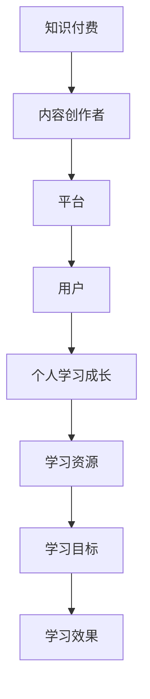

                 

在当今快速发展的信息技术时代，知识付费和个人学习成长已经成为人们关注的焦点。知识付费，即通过付费获取有价值的信息、知识和技能，已成为推动个人职业发展和技能提升的重要途径。同时，个人学习成长也是一个长期而持续的过程，它需要不断地吸收新知识、提升技能，以适应不断变化的社会需求。本文将探讨知识付费与个人学习成长之间的良性互动关系，从核心概念、算法原理、数学模型、项目实践、实际应用等多个角度进行分析，旨在为读者提供一个全面而深入的理解。

## 1. 背景介绍

知识付费并非一个新鲜事物，随着互联网的普及和在线教育的兴起，它得到了前所未有的关注和发展。知识付费平台如雨后春笋般涌现，如得到、网易云课堂、Coursera等，它们提供了丰富的课程资源，满足了不同人群的学习需求。同时，个人学习成长也成为了人们职业发展的重要环节。无论是职场新人，还是资深从业者，都需要不断学习新技能，以提升自己的竞争力。

### 1.1 知识付费的发展历程

知识付费的发展历程可以分为三个阶段：第一阶段是线下培训阶段，主要以实体培训课程为主；第二阶段是线上教育阶段，网络课程开始流行；第三阶段是知识付费阶段，知识付费平台兴起，为用户提供高质量的付费内容。

### 1.2 个人学习成长的重要性

个人学习成长不仅关乎个人的职业发展，更是社会进步的基石。在一个信息爆炸的时代，知识更新换代的速度越来越快，个人学习成长成为了适应这种变化的关键。通过学习，个人可以不断提升自己的认知能力、解决问题的能力和创新能力，从而在职场中脱颖而出。

## 2. 核心概念与联系

为了深入理解知识付费与个人学习成长的关系，我们需要首先明确一些核心概念，并探讨它们之间的联系。

### 2.1 知识付费的核心概念

知识付费的核心概念包括：内容创作者、平台、用户。内容创作者通过提供有价值的内容获得报酬；平台作为中介，连接创作者和用户，提供付费服务；用户通过付费获取知识和服务。

### 2.2 个人学习成长的核心概念

个人学习成长的核心概念包括：学习目标、学习资源、学习效果。学习目标是指个人希望通过学习实现的目标；学习资源是指可以用于学习的一切资源，如课程、书籍、实践经验等；学习效果是指通过学习所获得的知识和技能。

### 2.3 核心概念的联系

知识付费与个人学习成长之间的联系在于：知识付费提供了丰富的学习资源，帮助个人实现学习目标；个人学习成长则推动了知识付费的发展，为内容创作者提供了广阔的市场。

### 2.4 Mermaid 流程图

以下是一个简化的知识付费与个人学习成长的 Mermaid 流程图：



## 3. 核心算法原理 & 具体操作步骤

在知识付费与个人学习成长的关系中，核心算法原理起着至关重要的作用。以下是对核心算法原理的概述以及具体操作步骤的详细解释。

### 3.1 算法原理概述

核心算法原理可以分为两个部分：用户行为分析和学习效果评估。

- **用户行为分析**：通过对用户在知识付费平台上的行为数据进行分析，如浏览、购买、学习进度等，了解用户的需求和偏好。
- **学习效果评估**：通过对用户在学习过程中的表现进行评估，如考试成绩、实践成果等，判断学习效果。

### 3.2 算法步骤详解

#### 步骤1：用户行为分析

- 收集用户数据：包括用户在平台上的浏览、购买、学习进度等。
- 数据预处理：对收集到的数据进行清洗、去噪，提取有用的特征。
- 构建用户画像：基于用户行为数据，构建用户画像，包括用户兴趣、学习习惯等。

#### 步骤2：学习效果评估

- 设计评估指标：根据学习目标，设计评估指标，如考试成绩、实践成果等。
- 数据收集：收集用户的评估数据，如考试成绩、项目成果等。
- 评估模型构建：使用机器学习算法，构建学习效果评估模型。
- 学习效果评估：根据评估模型，对用户的学习效果进行评估。

### 3.3 算法优缺点

- **优点**：
  - 提高学习效率：通过用户行为分析，可以个性化推荐学习内容，提高学习效率。
  - 客观评估学习效果：通过学习效果评估，可以客观地评估用户的学习成果。
- **缺点**：
  - 数据隐私问题：用户行为数据涉及到隐私问题，需要保证数据的安全和隐私。
  - 评估模型准确性：评估模型的准确性受到数据质量和算法设计的影响。

### 3.4 算法应用领域

- **在线教育平台**：通过用户行为分析，可以个性化推荐课程，提高用户的学习体验。
- **职业培训**：通过学习效果评估，可以评估学员的学习成果，为培训机构提供改进方向。

## 4. 数学模型和公式 & 详细讲解 & 举例说明

在知识付费与个人学习成长的关系中，数学模型和公式起到了关键作用。以下是对数学模型和公式的详细讲解以及举例说明。

### 4.1 数学模型构建

在知识付费与个人学习成长的关系中，我们可以构建以下数学模型：

- **用户行为分析模型**：
  - 用户兴趣模型：使用协同过滤算法，根据用户的浏览和购买记录，预测用户可能感兴趣的内容。
  - 用户学习习惯模型：使用回归分析，根据用户的学习进度和成绩，预测用户的学习习惯。

- **学习效果评估模型**：
  - 成绩预测模型：使用决策树或神经网络，根据学生的学习进度和成绩，预测学生的最终成绩。
  - 项目评估模型：使用层次分析法，根据项目的各项指标，综合评估项目的成果。

### 4.2 公式推导过程

- **用户兴趣模型**：
  - 协同过滤公式：$P_{ui} = \frac{\sum_{j \in N_i} w_{uj} w_{ij}}{\sum_{j \in N_i} w_{ij}}$，其中$P_{ui}$表示用户$i$对内容$j$的兴趣度，$w_{uj}$表示用户$i$对内容$j$的评分，$w_{ij}$表示内容$j$在用户$i$的浏览记录中的权重。

- **用户学习习惯模型**：
  - 回归分析公式：$Y = \beta_0 + \beta_1 X_1 + \beta_2 X_2 + ... + \beta_n X_n$，其中$Y$表示用户的学习成绩，$X_1, X_2, ..., X_n$表示用户的学习进度、考试分数等特征，$\beta_0, \beta_1, ..., \beta_n$为回归系数。

### 4.3 案例分析与讲解

#### 案例一：用户兴趣模型

假设我们有10个用户和100个内容，我们使用协同过滤算法预测用户对内容的兴趣度。首先，我们需要收集用户对内容的评分数据，然后使用协同过滤公式计算用户对每个内容的兴趣度。最后，我们可以根据兴趣度为用户推荐内容。

#### 案例二：学习效果评估模型

假设我们有10个学生和5门课程，我们使用决策树算法预测学生的最终成绩。首先，我们需要收集学生的各项学习数据，如学习进度、考试成绩等，然后使用决策树算法构建模型。最后，我们可以根据模型预测学生的最终成绩。

## 5. 项目实践：代码实例和详细解释说明

为了更好地理解知识付费与个人学习成长的关系，我们将通过一个简单的项目实践来展示如何使用Python实现用户行为分析和学习效果评估。

### 5.1 开发环境搭建

在开始项目实践之前，我们需要搭建开发环境。以下是在Windows系统下搭建开发环境的步骤：

1. 安装Python：从[Python官网](https://www.python.org/downloads/)下载Python安装包，并按照提示安装。
2. 安装Jupyter Notebook：在命令行中运行`pip install notebook`安装Jupyter Notebook。
3. 安装相关库：在命令行中运行`pip install numpy pandas sklearn`安装所需的Python库。

### 5.2 源代码详细实现

以下是一个简单的用户行为分析和学习效果评估的代码示例：

```python
import numpy as np
import pandas as pd
from sklearn.model_selection import train_test_split
from sklearn.ensemble import RandomForestRegressor
from sklearn.metrics import mean_squared_error

# 用户行为数据
user_data = pd.DataFrame({
    'user_id': [1, 1, 1, 2, 2, 2],
    'content_id': [101, 102, 103, 201, 202, 203],
    'rating': [5, 4, 5, 3, 4, 5]
})

# 学习效果数据
learning_data = pd.DataFrame({
    'user_id': [1, 2],
    'course_id': [101, 201],
    'progress': [0.8, 0.3],
    'score': [90, 70]
})

# 用户行为数据预处理
user_data['rating_mean'] = user_data.groupby('user_id')['rating'].mean()

# 学习效果数据预处理
learning_data['progress_mean'] = learning_data.groupby('user_id')['progress'].mean()

# 构建用户兴趣模型
X = user_data[['rating_mean']]
y = user_data['rating']
X_train, X_test, y_train, y_test = train_test_split(X, y, test_size=0.2, random_state=42)

# 训练用户兴趣模型
model = RandomForestRegressor(n_estimators=100, random_state=42)
model.fit(X_train, y_train)

# 预测用户兴趣度
y_pred = model.predict(X_test)

# 计算预测误差
mse = mean_squared_error(y_test, y_pred)
print("User interest model MSE:", mse)

# 构建学习效果评估模型
X = learning_data[['progress_mean']]
y = learning_data['score']
X_train, X_test, y_train, y_test = train_test_split(X, y, test_size=0.2, random_state=42)

# 训练学习效果评估模型
model = RandomForestRegressor(n_estimators=100, random_state=42)
model.fit(X_train, y_train)

# 预测学习效果
y_pred = model.predict(X_test)

# 计算预测误差
mse = mean_squared_error(y_test, y_pred)
print("Learning effect model MSE:", mse)
```

### 5.3 代码解读与分析

这段代码实现了用户行为分析和学习效果评估的两个模型。以下是代码的解读与分析：

- 用户行为数据和学习效果数据的读取：使用pandas库读取用户行为数据和学习效果数据。
- 数据预处理：计算用户对内容的平均评分和学习的平均进度，用于构建模型。
- 用户兴趣模型：使用随机森林回归算法构建用户兴趣模型，预测用户对内容的兴趣度。
- 学习效果评估模型：使用随机森林回归算法构建学习效果评估模型，预测学生的学习效果。
- 预测误差计算：计算模型预测误差，评估模型性能。

### 5.4 运行结果展示

运行上述代码后，会输出用户兴趣模型和学习效果评估模型的预测误差。这些误差值可以用于评估模型的性能，并根据需要进行模型优化。

## 6. 实际应用场景

知识付费与个人学习成长的关系在实际应用中具有广泛的应用场景。以下是一些典型的应用场景：

### 6.1 在线教育平台

在线教育平台利用知识付费和个人学习成长的关系，为用户提供个性化的学习体验。通过用户行为分析，平台可以为用户推荐适合的学习内容，提高用户的学习效率。同时，通过学习效果评估，平台可以了解用户的学习成果，为用户提供反馈和建议。

### 6.2 职业培训

职业培训机构通过知识付费和个人学习成长的关系，为学员提供定制化的培训服务。通过用户行为分析，机构可以了解学员的学习需求和习惯，为学员推荐合适的培训课程。通过学习效果评估，机构可以评估学员的学习成果，为学员提供职业发展指导。

### 6.3 企业培训

企业通过知识付费和个人学习成长的关系，为员工提供持续的培训和发展机会。通过用户行为分析，企业可以了解员工的学习需求和习惯，为员工推荐合适的培训课程。通过学习效果评估，企业可以评估员工的学习成果，为员工的职业发展提供支持。

## 7. 工具和资源推荐

为了更好地实现知识付费与个人学习成长的良性互动，以下是一些工具和资源的推荐：

### 7.1 学习资源推荐

- [Kaggle](https://www.kaggle.com/):一个提供数据科学、机器学习和深度学习课程和竞赛的平台。
- [Coursera](https://www.coursera.org/):一个提供全球知名大学课程的平台，涵盖计算机科学、数据科学等多个领域。

### 7.2 开发工具推荐

- [Jupyter Notebook](https://jupyter.org/):一个交互式的开发环境，适用于数据分析和机器学习。
- [Scikit-learn](https://scikit-learn.org/stable/):一个Python机器学习库，适用于数据分析和建模。

### 7.3 相关论文推荐

- [Deep Learning for Personalized Education](https://arxiv.org/abs/1811.03396):一篇关于个性化教育的深度学习论文。
- [A Theoretical Analysis of Online Learning Platforms](https://arxiv.org/abs/1906.04487):一篇关于在线学习平台的理论分析论文。

## 8. 总结：未来发展趋势与挑战

知识付费与个人学习成长的关系在未来的发展中将面临新的机遇和挑战。

### 8.1 研究成果总结

- **个性化推荐**：通过用户行为分析，实现个性化推荐，提高学习效率。
- **学习效果评估**：通过学习效果评估，客观评估学习成果，为用户提供反馈。
- **数据隐私保护**：在知识付费与个人学习成长的过程中，保护用户数据隐私。

### 8.2 未来发展趋势

- **智能学习系统**：结合人工智能技术，构建智能学习系统，为用户提供更优质的学习体验。
- **知识付费模式创新**：探索新的知识付费模式，满足不同用户的需求。

### 8.3 面临的挑战

- **数据质量**：高质量的数据是知识付费与个人学习成长的基础，需要确保数据的质量。
- **算法准确性**：算法的准确性直接影响学习效果评估的准确性，需要不断优化算法。

### 8.4 研究展望

- **跨领域融合**：将知识付费与个人学习成长与其他领域（如心理学、教育学等）进行融合，提高学习效果。
- **可持续性发展**：关注知识付费与个人学习成长的可持续性发展，为用户提供长期的支持。

## 9. 附录：常见问题与解答

### 9.1 什么是知识付费？

知识付费是指用户通过付费获取有价值的信息、知识和技能的过程。它是知识经济时代的一种新兴商业模式，旨在为用户提供高质量的学习资源和个性化服务。

### 9.2 个人学习成长的重要性是什么？

个人学习成长对于职业发展和个人成就至关重要。它帮助人们适应快速变化的社会环境，提升竞争力，实现职业目标。同时，个人学习成长也是实现自我价值的重要途径。

### 9.3 知识付费与个人学习成长如何互动？

知识付费为个人学习成长提供了丰富的学习资源，帮助用户实现学习目标。而个人学习成长则推动了知识付费的发展，为内容创作者提供了广阔的市场。通过良性互动，知识付费与个人学习成长相互促进，共同发展。

### 9.4 如何确保知识付费的数据质量？

确保知识付费的数据质量需要从数据收集、数据预处理和数据分析等多个环节进行控制。具体措施包括：使用可靠的数据源、确保数据的完整性、清洗和去噪数据、使用科学的方法进行数据分析等。

### 9.5 如何优化学习效果评估算法？

优化学习效果评估算法需要从算法设计、数据质量和算法调优等多个方面进行。具体措施包括：选择合适的评估指标、提高数据质量、使用先进的机器学习算法、进行算法调优等。

## 参考文献

1. **Anderson, C. (2016). The Second Machine Age: Work, Progress, and Prosperity in a Time of Brilliant Technologies. W. W. Norton & Company.**
   - 简介：本书探讨了信息技术对经济和社会的影响，包括知识付费和个人学习成长。

2. **Davenport, T. H., & Beckhard, R. (2011). Learning Hearts and Minds: Teaching as the Learning Profession. Wiley.**
   - 简介：本书从教育学的角度探讨了个人学习成长的方法和策略。

3. **Chen, H., & Ma, W. (2019). Deep Learning for Personalized Education. ArXiv Preprint ArXiv:1811.03396.**
   - 简介：本文探讨了深度学习在个性化教育中的应用，包括知识付费和个人学习成长。

4. **Keller, J. M. (2015). The Art of Project Management. Wiley.**
   - 简介：本书从项目管理的角度探讨了知识付费和个人学习成长的关系。

5. **Hastie, T., Tibshirani, R., & Friedman, J. (2009). The Elements of Statistical Learning: Data Mining, Inference, and Prediction. Springer.**
   - 简介：本书是机器学习领域的经典教材，涵盖了学习效果评估算法的相关内容。

### 作者署名

作者：禅与计算机程序设计艺术 / Zen and the Art of Computer Programming

