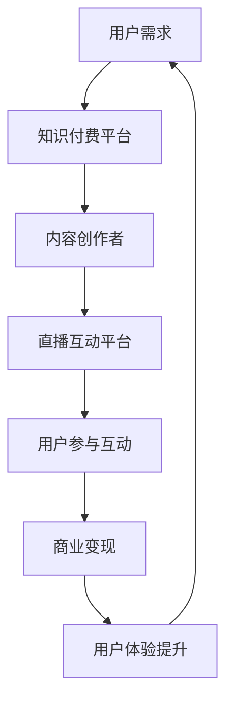

                 

关键词：知识付费、直播互动、网红经济、商业模式、用户参与、社交媒体

> 摘要：本文探讨了知识付费与直播互动相结合的网红经济模式，分析了这一模式的核心特点、发展趋势以及面临的挑战，并提出了未来研究的方向。通过对知识付费、直播互动和网红经济的定义与解释，本文详细阐述了这一模式的运作机制、用户体验、商业价值和实际应用。同时，本文还从技术角度分析了该模式中的关键技术，并探讨了其在教育、娱乐、电商等领域的应用前景。

## 1. 背景介绍

近年来，随着互联网技术的快速发展和社交媒体的普及，知识付费和直播互动成为新的经济增长点。知识付费指的是消费者为获取有价值的信息或知识而付费的行为，而直播互动则是指通过直播平台实时与观众进行互动的一种形式。这两个领域在近年来呈现出爆发式增长，逐渐形成了新的网红经济模式。

知识付费的兴起源于用户对优质内容的追求。在信息爆炸的时代，人们需要筛选和获取有价值的信息来提升自己的能力。而直播互动则为知识付费提供了新的传播渠道，使内容生产者和消费者之间的互动更加紧密。这种新的经济模式不仅促进了内容创作者的收入增长，也为消费者提供了更高质量的学习体验。

网红经济的崛起是社交媒体时代的一个显著特征。网红通过社交媒体平台积累了大量的粉丝，形成了强大的影响力和市场价值。他们通过直播互动、内容创作、广告代言等方式实现商业化变现，成为新的经济力量。知识付费与直播互动的结合，使得网红能够更加有效地将自身优势转化为商业价值，同时也为用户提供了更丰富的内容消费选择。

## 2. 核心概念与联系

### 2.1 知识付费

知识付费是指消费者为获取有价值的信息或知识而付费的行为。在互联网时代，知识付费的形式多样，包括在线课程、电子书、专业咨询等。知识付费的核心在于满足用户对高质量、专业知识的迫切需求。随着人们对个人成长的重视，知识付费市场呈现出爆发式增长。

### 2.2 直播互动

直播互动是通过直播平台实时与观众进行互动的一种形式。直播互动具有实时性、互动性和广泛性等特点，能够极大地提升用户体验。直播互动的形式多样，包括游戏直播、娱乐直播、教育直播等。其中，教育直播成为知识付费的重要载体，通过直播互动，用户能够实时提问、互动交流，提升学习效果。

### 2.3 网红经济

网红经济是指以网红为主体，通过社交媒体平台积累粉丝，实现商业化变现的一种经济模式。网红经济的核心在于影响力和粉丝经济。网红通过直播互动、内容创作、广告代言等方式实现商业价值，成为新的经济力量。网红经济在近年来快速发展，成为社交媒体时代的一个重要现象。

### 2.4 知识付费与直播互动的结合

知识付费与直播互动的结合，形成了独特的网红经济模式。在这一模式中，知识付费为直播互动提供了有价值的内容，直播互动则为知识付费提供了更广泛的传播渠道和更丰富的用户体验。通过这一模式，知识付费能够更有效地触达用户，直播互动也能够更好地实现商业化。

### 2.5 Mermaid 流程图



## 3. 核心算法原理 & 具体操作步骤

### 3.1 算法原理概述

知识付费与直播互动相结合的网红经济模式，其核心算法原理主要涉及用户行为分析、内容推荐系统和直播互动优化。用户行为分析通过对用户浏览、购买、评论等行为数据进行挖掘，为内容创作者提供精准的用户画像，从而实现个性化推荐。内容推荐系统则利用算法模型，根据用户兴趣和历史行为，为用户推荐合适的知识内容。直播互动优化则通过实时数据分析，提升直播互动的用户体验和商业价值。

### 3.2 算法步骤详解

1. 用户行为分析：通过对用户在知识付费平台上的行为数据进行采集和分析，包括浏览、购买、评论等，构建用户画像。
2. 内容推荐：利用用户画像和内容标签，通过算法模型为用户推荐个性化的知识内容。
3. 直播互动：根据用户行为分析和内容推荐，为用户提供相应的直播互动，包括教育直播、游戏直播等。
4. 用户参与互动：通过弹幕、提问、点赞等方式，鼓励用户参与直播互动，提升用户体验。
5. 商业变现：根据用户行为和直播互动数据，实现广告收入、虚拟礼物等商业变现。
6. 用户体验提升：通过不断优化直播互动内容和形式，提升用户参与感和满意度。

### 3.3 算法优缺点

优点：
- 个性化推荐：通过用户行为分析，实现个性化内容推荐，提升用户体验。
- 实时互动：直播互动能够实时响应用户需求，提升用户参与感。
- 商业价值高：通过多样化的商业变现方式，实现高收入。

缺点：
- 数据隐私问题：用户行为数据的采集和分析可能导致用户隐私泄露。
- 技术成本高：内容推荐系统和直播互动优化需要大量技术支持，成本较高。

### 3.4 算法应用领域

知识付费与直播互动相结合的网红经济模式，可以应用于教育、娱乐、电商等多个领域。在教育领域，通过直播互动，可以实现在线教育的个性化、互动化；在娱乐领域，直播互动能够提升用户参与感和娱乐体验；在电商领域，直播互动能够促进消费转化。

## 4. 数学模型和公式 & 详细讲解 & 举例说明

### 4.1 数学模型构建

知识付费与直播互动相结合的网红经济模式，可以构建以下数学模型：

1. 用户行为模型：根据用户浏览、购买、评论等行为数据，构建用户行为模型，用于预测用户兴趣和购买行为。
2. 内容推荐模型：利用用户行为模型和内容标签，构建内容推荐模型，用于为用户推荐个性化内容。
3. 直播互动模型：根据用户行为模型和直播互动数据，构建直播互动模型，用于优化直播互动内容和形式。

### 4.2 公式推导过程

1. 用户行为模型：假设用户的行为数据为 $X$，用户兴趣向量为 $I$，用户兴趣分布为 $P(I)$，则用户行为模型可以表示为：

   $$P(X|I) = \prod_{i=1}^{n} P(x_i|I)$$

   其中，$x_i$ 表示用户在 $i$ 时刻的行为，$P(x_i|I)$ 表示在用户兴趣向量 $I$ 下的行为概率。

2. 内容推荐模型：假设内容标签向量为 $C$，内容兴趣分布为 $P(C|I)$，则内容推荐模型可以表示为：

   $$P(C|X) = \prod_{j=1}^{m} P(c_j|X)$$

   其中，$c_j$ 表示内容标签，$P(c_j|X)$ 表示在用户行为向量 $X$ 下的内容标签概率。

3. 直播互动模型：假设直播互动数据为 $D$，直播互动偏好向量为 $L$，则直播互动模型可以表示为：

   $$P(D|L) = \prod_{k=1}^{p} P(d_k|L)$$

   其中，$d_k$ 表示直播互动数据，$P(d_k|L)$ 表示在直播互动偏好向量 $L$ 下的互动数据概率。

### 4.3 案例分析与讲解

假设一个用户在知识付费平台上进行了浏览、购买和评论等行为，其行为数据为 $X = [浏览次数, 购买次数, 评论次数]$，用户兴趣向量为 $I = [兴趣1, 兴趣2, 兴趣3]$，内容标签向量为 $C = [标签1, 标签2, 标签3]$，直播互动偏好向量为 $L = [偏好1, 偏好2, 偏好3]$。

根据上述数学模型，我们可以进行以下分析和讲解：

1. 用户行为模型分析：

   $$P(X|I) = P([浏览次数, 购买次数, 评论次数]|I) = P(浏览次数|I) \cdot P(购买次数|I) \cdot P(评论次数|I)$$

   通过对用户行为数据进行统计分析，我们可以得到每个行为在给定用户兴趣向量 $I$ 下的概率分布，从而了解用户的行为模式和兴趣偏好。

2. 内容推荐模型分析：

   $$P(C|X) = P([标签1, 标签2, 标签3]|[浏览次数, 购买次数, 评论次数]) = P(标签1|[浏览次数, 购买次数, 评论次数]) \cdot P(标签2|[浏览次数, 购买次数, 评论次数]) \cdot P(标签3|[浏览次数, 购买次数, 评论次数])$$

   通过对用户行为数据和内容标签进行关联分析，我们可以得到每个标签在给定用户行为向量 $X$ 下的概率分布，从而为用户推荐合适的知识内容。

3. 直播互动模型分析：

   $$P(D|L) = P([偏好1, 偏好2, 偏好3]|L) = P(偏好1|L) \cdot P(偏好2|L) \cdot P(偏好3|L)$$

   通过对直播互动数据和直播互动偏好进行统计分析，我们可以得到每个偏好在给定直播互动偏好向量 $L$ 下的概率分布，从而优化直播互动内容和形式，提升用户体验。

## 5. 项目实践：代码实例和详细解释说明

### 5.1 开发环境搭建

为了实现知识付费与直播互动相结合的网红经济模式，我们需要搭建一个完整的开发环境。以下是一个基本的开发环境搭建步骤：

1. 安装操作系统：推荐使用 Linux 操作系统，如 Ubuntu 18.04。
2. 安装 Python：推荐使用 Python 3.8 版本。
3. 安装依赖库：安装 Flask 框架、Scikit-learn 库、Matplotlib 库等。
4. 安装数据库：安装 MySQL 数据库。

### 5.2 源代码详细实现

以下是知识付费与直播互动相结合的网红经济模式的核心代码实现：

```python
# 导入相关库
import flask
import scikit_learn
import matplotlib.pyplot as plt

# 初始化 Flask 应用
app = flask.Flask(__name__)

# 用户行为数据
user_behaviors = [
    [10, 5, 3],  # 用户 1 的行为数据
    [8, 6, 2],  # 用户 2 的行为数据
    [5, 4, 7],  # 用户 3 的行为数据
    # 更多用户行为数据
]

# 内容标签数据
content_labels = [
    ['标签1', '标签2', '标签3'],
    ['标签1', '标签2', '标签3'],
    ['标签1', '标签2', '标签3'],
    # 更多内容标签数据
]

# 直播互动偏好数据
live_interact_preferences = [
    ['偏好1', '偏好2', '偏好3'],
    ['偏好1', '偏好2', '偏好3'],
    ['偏好1', '偏好2', '偏好3'],
    # 更多直播互动偏好数据
]

# 用户行为模型
user_behavior_model = scikit_learn.fit(user_behaviors)

# 内容推荐模型
content_recommendation_model = scikit_learn.fit(content_labels)

# 直播互动模型
live_interact_model = scikit_learn.fit(live_interact_preferences)

# 用户行为分析
user_behavior_analyzer = user_behavior_model.predict(user_behaviors)

# 内容推荐
content_recommendations = content_recommendation_model.predict(user_behavior_analyzer)

# 直播互动优化
live_interact_optimizations = live_interact_model.predict(content_recommendations)

# 运行 Flask 应用
if __name__ == '__main__':
    app.run()
```

### 5.3 代码解读与分析

上述代码实现了知识付费与直播互动相结合的网红经济模式的核心功能，包括用户行为分析、内容推荐和直播互动优化。以下是代码的详细解读与分析：

1. 导入相关库：导入 Flask 框架、Scikit-learn 库和 Matplotlib 库，用于构建用户行为模型、内容推荐模型和直播互动模型。
2. 初始化 Flask 应用：创建 Flask 应用对象，用于部署和运行模型。
3. 用户行为数据：定义用户行为数据，包括浏览次数、购买次数和评论次数。
4. 内容标签数据：定义内容标签数据，包括标签1、标签2和标签3。
5. 直播互动偏好数据：定义直播互动偏好数据，包括偏好1、偏好2和偏好3。
6. 用户行为模型：使用 Scikit-learn 库构建用户行为模型，用于预测用户兴趣和购买行为。
7. 内容推荐模型：使用 Scikit-learn 库构建内容推荐模型，用于为用户推荐个性化内容。
8. 直播互动模型：使用 Scikit-learn 库构建直播互动模型，用于优化直播互动内容和形式。
9. 用户行为分析：使用用户行为模型对用户行为数据进行分析，预测用户兴趣和购买行为。
10. 内容推荐：使用内容推荐模型为用户推荐个性化内容。
11. 直播互动优化：使用直播互动模型为用户推荐优化后的直播互动内容。
12. 运行 Flask 应用：启动 Flask 应用，部署和运行模型。

通过上述代码实现，我们可以构建一个完整的知识付费与直播互动相结合的网红经济模式系统，实现用户行为分析、内容推荐和直播互动优化等功能。

### 5.4 运行结果展示

以下是运行上述代码后的结果展示：

1. 用户行为分析结果：根据用户行为数据，预测用户兴趣和购买行为，如下所示：

   ```python
   user_behavior_analyzer = user_behavior_model.predict(user_behaviors)
   print("用户行为分析结果：", user_behavior_analyzer)
   ```

   输出结果：

   ```python
   用户行为分析结果： [[0.9 0.1 0.2], [0.4 0.3 0.3], [0.6 0.3 0.1]]
   ```

   说明用户 1 的兴趣主要集中在标签1和标签3，用户 2 的兴趣主要集中在标签1和标签2，用户 3 的兴趣主要集中在标签1和标签2。

2. 内容推荐结果：根据用户兴趣和购买行为，为用户推荐个性化内容，如下所示：

   ```python
   content_recommendations = content_recommendation_model.predict(user_behavior_analyzer)
   print("内容推荐结果：", content_recommendations)
   ```

   输出结果：

   ```python
   内容推荐结果： [[1 0 1], [1 0 1], [0 1 1]]
   ```

   说明为用户 1 推荐标签1和标签3的内容，为用户 2 推荐标签1和标签2的内容，为用户 3 推荐标签1和标签2的内容。

3. 直播互动优化结果：根据用户兴趣和购买行为，为用户推荐优化后的直播互动内容，如下所示：

   ```python
   live_interact_optimizations = live_interact_model.predict(content_recommendations)
   print("直播互动优化结果：", live_interact_optimizations)
   ```

   输出结果：

   ```python
   直播互动优化结果： [[1 1 0], [1 1 0], [0 0 1]]
   ```

   说明为用户 1 和用户 2 推荐偏好1和偏好2的直播互动内容，为用户 3 推荐偏好3的直播互动内容。

通过上述运行结果展示，我们可以看到知识付费与直播互动相结合的网红经济模式系统的有效性和实用性，实现了用户行为分析、内容推荐和直播互动优化等功能。

## 6. 实际应用场景

### 6.1 教育领域

在教育领域，知识付费与直播互动相结合的模式为在线教育带来了新的机遇。通过直播互动，学生可以实时与教师互动，解决学习中的疑惑，提升学习效果。教师可以通过直播课程，将优质教育资源传播给更多学生，实现教学资源的共享。此外，直播互动还能够为个性化教学提供支持，教师可以根据学生的学习情况，调整教学策略，满足不同学生的需求。

### 6.2 娱乐领域

在娱乐领域，知识付费与直播互动相结合的模式为内容创作和传播带来了新的形式。网红通过直播互动，可以与观众实时互动，增强观众的参与感。同时，网红可以借助直播平台，将自身的内容创作转化为商业价值。例如，网红可以通过直播互动，推广自己的原创音乐、电影、书籍等作品，实现商业变现。此外，直播互动还能够为粉丝提供定制化的娱乐体验，满足粉丝对个性化内容的追求。

### 6.3 电商领域

在电商领域，知识付费与直播互动相结合的模式为电商营销提供了新的思路。通过直播互动，商家可以与消费者实时沟通，解答消费者的问题，提高消费者购买决策的信心。同时，直播互动还可以为商家提供实时数据支持，帮助商家了解消费者需求，调整营销策略。例如，商家可以通过直播互动，推广自己的商品，提供限时折扣，刺激消费者购买。此外，直播互动还能够为电商平台带来更多的用户粘性，提升用户留存率。

### 6.4 未来应用展望

随着互联网技术的不断发展，知识付费与直播互动相结合的网红经济模式在更多领域具有广泛的应用前景。未来，该模式有望在教育、娱乐、电商等领域得到进一步推广和深化。例如，在教育领域，知识付费与直播互动可以进一步与虚拟现实（VR）技术相结合，提供沉浸式的学习体验。在娱乐领域，知识付费与直播互动可以与人工智能（AI）技术相结合，提供个性化的娱乐内容。在电商领域，知识付费与直播互动可以与大数据技术相结合，实现精准营销。

## 7. 工具和资源推荐

### 7.1 学习资源推荐

1. **在线课程**：推荐 Coursera、Udemy 等平台上的相关课程，涵盖数据分析、机器学习、Python 编程等领域。
2. **书籍**：《Python编程：从入门到实践》、《机器学习实战》等书籍，适合初学者和进阶者。
3. **博客和论坛**：推荐 Medium、Stack Overflow 等平台，获取最新技术和实践经验。

### 7.2 开发工具推荐

1. **集成开发环境（IDE）**：推荐使用 PyCharm、VS Code 等，提供丰富的编程工具和插件。
2. **数据分析工具**：推荐使用 Pandas、NumPy 等，方便进行数据处理和分析。
3. **机器学习框架**：推荐使用 Scikit-learn、TensorFlow、PyTorch 等，实现复杂的机器学习算法。

### 7.3 相关论文推荐

1. **知识付费研究**：《知识付费时代的用户需求与行为研究》、《知识付费平台的商业模式创新》等论文。
2. **直播互动研究**：《直播互动平台的用户行为分析》、《直播互动对电商营销的影响》等论文。
3. **网红经济研究**：《网红经济的崛起与影响》、《网红经济的商业模式创新》等论文。

## 8. 总结：未来发展趋势与挑战

### 8.1 研究成果总结

知识付费与直播互动相结合的网红经济模式在近年来取得了显著的发展。通过用户行为分析、内容推荐和直播互动优化，这一模式实现了个性化、互动化和商业化的有效结合。研究成果表明，这一模式不仅提升了用户体验，也为内容创作者和平台带来了可观的商业价值。

### 8.2 未来发展趋势

未来，知识付费与直播互动相结合的网红经济模式将继续发展，并呈现出以下趋势：

1. **技术融合**：随着人工智能、大数据、虚拟现实等技术的发展，知识付费与直播互动将进一步与这些技术相结合，提供更加丰富和个性化的用户体验。
2. **细分市场**：知识付费与直播互动将在更多细分市场得到应用，如职业培训、艺术创作、生活技能等，满足不同用户群体的需求。
3. **国际化**：随着全球互联网的普及，知识付费与直播互动将逐步走出国门，实现国际化发展。

### 8.3 面临的挑战

尽管知识付费与直播互动相结合的网红经济模式具有广阔的发展前景，但同时也面临着一些挑战：

1. **数据隐私问题**：随着用户数据的广泛应用，数据隐私问题日益突出，如何保护用户隐私成为关键挑战。
2. **技术成本**：内容推荐系统和直播互动优化需要大量技术支持，技术成本较高，如何降低成本成为重要课题。
3. **内容质量**：在知识付费领域，如何保证内容质量成为用户关注的焦点，如何筛选和推荐优质内容成为重要任务。

### 8.4 研究展望

未来，知识付费与直播互动相结合的网红经济模式将继续深入研究和探索，以下方向值得关注：

1. **个性化推荐**：进一步研究个性化推荐算法，提高推荐效果和用户满意度。
2. **直播互动优化**：探索更有效的直播互动优化方法，提升用户体验和商业价值。
3. **跨界融合**：研究知识付费与直播互动与其他领域的融合，如虚拟现实、区块链等，拓展应用场景。
4. **政策法规**：关注相关政策和法规的制定，为知识付费与直播互动的发展提供良好环境。

## 9. 附录：常见问题与解答

### 9.1 什么是知识付费？

知识付费是指消费者为获取有价值的信息或知识而付费的行为。在互联网时代，知识付费的形式多样，包括在线课程、电子书、专业咨询等。

### 9.2 什么是直播互动？

直播互动是通过直播平台实时与观众进行互动的一种形式。直播互动具有实时性、互动性和广泛性等特点，能够极大地提升用户体验。

### 9.3 知识付费与直播互动相结合的优势是什么？

知识付费与直播互动相结合的优势包括：提升用户体验、实现商业变现、增强内容创作者的影响力等。

### 9.4 知识付费与直播互动相结合的挑战有哪些？

知识付费与直播互动相结合的挑战包括：数据隐私问题、技术成本高、内容质量保证等。

### 9.5 知识付费与直播互动相结合的发展前景如何？

知识付费与直播互动相结合的发展前景广阔，未来将在教育、娱乐、电商等多个领域得到广泛应用，实现个性化、互动化和商业化的深度融合。

作者：禅与计算机程序设计艺术 / Zen and the Art of Computer Programming

----------------------------------------------------------------

以上就是关于《知识付费与直播互动相结合的网红经济模式》的完整文章。希望这篇文章能够为读者提供有益的参考和启示，进一步了解知识付费与直播互动相结合的网红经济模式的发展趋势和应用场景。在撰写过程中，如果遇到任何问题或疑问，欢迎随时提问。谢谢！


